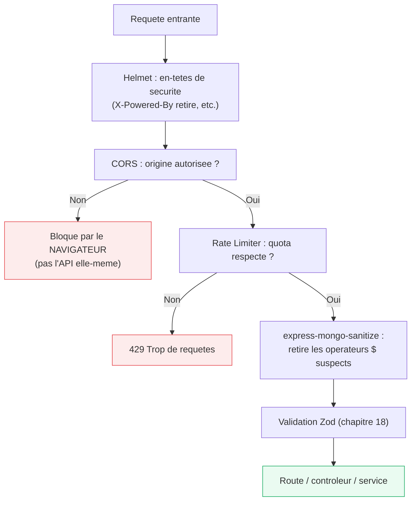

<div class="chapitre-titre-num">CHAPITRE 25</div>

# Sécurité (Helmet, CORS, Rate Limiting, injections)

<div class="encadre objectif">
<span class="encadre-titre">🎯 Objectif du chapitre</span>
Durcir une API Express contre les vulnérabilités les plus courantes : en-têtes HTTP manquants, requêtes cross-origin mal configurées, abus par volume de requêtes, et injections (SQL/NoSQL). À la fin de ce chapitre, tu sauras situer chacune de ces protections dans le classement OWASP Top 10, et appliquer une checklist de durcissement avant toute mise en production.
</div>

<div class="encadre scenario">
<span class="encadre-titre">🎬 Mise en situation</span>
Avant la mise en ligne d'une nouvelle API pour un client, tu effectues un audit de sécurité rapide. Tu découvres : aucun en-tête de sécurité configuré (`X-Powered-By: Express` visible dans chaque réponse), une configuration CORS `origin: "*"` restée en place "temporairement" depuis le développement, aucune limite de fréquence sur la route de connexion, et une requête SQL construite par concaténation de chaînes dans un script de migration de données oublié. Aucune de ces failles n'est visible à l'usage normal de l'application — c'est exactement pour ça qu'elles survivent aussi longtemps sans être corrigées. Ce chapitre construit la checklist qui les aurait toutes attrapées avant la mise en production.
</div>

## 25.1 Helmet : sécuriser les en-têtes HTTP par défaut

```
$ npm install helmet
```

```js
const helmet = require("helmet");
app.use(helmet());
```

<div class="encadre astuce">
<span class="encadre-titre">💡 Ce que Helmet fait concrètement</span>
Helmet configure automatiquement une douzaine d'en-têtes HTTP de sécurité en une seule ligne : désactive `X-Powered-By: Express` (évite de révéler la technologie utilisée aux attaquants), force certaines protections contre le détournement de clic (*clickjacking*, via `X-Frame-Options`), empêche le navigateur de deviner incorrectement un type de contenu (`X-Content-Type-Options`), et bien d'autres protections dont la configuration manuelle serait fastidieuse et source d'oublis.
</div>

## 25.2 CORS : autoriser précisément les origines nécessaires

```
$ npm install cors
```

```js
// ❌ Configuration par défaut : autorise TOUTES les origines, souvent trop permissif en production
app.use(cors());
```

```js
// ✅ Configuration explicite : n'autorise QUE les origines de confiance
const cors = require("cors");

app.use(cors({
  origin: ["https://monapp.com", "https://admin.monapp.com"],
  credentials: true, // nécessaire si des cookies (refresh token httpOnly, chapitre 23) sont échangés
}));
```

<div class="encadre attention">
<span class="encadre-titre">⚠️ CORS protège le NAVIGATEUR, pas ton API directement</span>
CORS (*Cross-Origin Resource Sharing*) est un mécanisme appliqué par le **navigateur** de l'utilisateur, empêchant un site web malveillant d'effectuer des requêtes vers ton API au nom de l'utilisateur à son insu. Un outil comme curl ou Postman n'est **jamais** bloqué par CORS (ce n'est pas un navigateur) — CORS n'est donc **pas** une protection contre un attaquant appelant directement ton API, seulement contre un scénario spécifique d'attaque via navigateur (comme le CSRF, en partie).
</div>

## 25.3 Le classement OWASP Top 10 : où se situent ces protections

<div class="encadre astuce">
<span class="encadre-titre">💡 L'OWASP Top 10, la référence des vulnérabilités web</span>
L'OWASP (*Open Worldwide Application Security Project*) publie régulièrement un classement des dix catégories de vulnérabilités les plus critiques observées dans les applications web réelles. Situer les protections de ce chapitre dans ce classement aide à prioriser un audit de sécurité.
</div>

| Catégorie OWASP (édition API Security) | Protection correspondante dans ce manuel |
|---|---|
| Broken Object Level Authorization (IDOR) | Vérification de propriété de ressource (chapitre 24) |
| Broken Authentication | JWT + bcrypt + rate limiting sur les routes d'authentification (chapitres 22, 23, section 25.4) |
| Injection (SQL, NoSQL) | Requêtes paramétrées, ORM, `express-mongo-sanitize` (sections 25.5-25.6) |
| Security Misconfiguration | Helmet, CORS restrictif, variables d'environnement (chapitre 12, sections 25.1-25.2) |
| Insufficient Logging & Monitoring | Winston + service de supervision externe (chapitre 20) |
| Excessive Data Exposure | Filtrage des champs sensibles au niveau du service (chapitre 15) |

<div class="encadre retenir">
<span class="encadre-titre">📌 À retenir</span>
Ce manuel couvre, chapitre par chapitre, la majorité des catégories les plus critiques de l'OWASP Top 10 API — pas comme une liste de cases à cocher isolée, mais intégrée organiquement à chaque sujet abordé. Ce tableau sert de carte de référence pour relier les deux.
</div>

## 25.4 Rate Limiting : limiter le nombre de requêtes

```
$ npm install express-rate-limit
```

```js
const rateLimit = require("express-rate-limit");

const limiteurGlobal = rateLimit({
  windowMs: 15 * 60 * 1000, // fenêtre de 15 minutes
  max: 100,                  // 100 requêtes maximum par IP dans cette fenêtre
  message: { message: "Trop de requêtes, réessaie plus tard" },
});

app.use(limiteurGlobal); // appliqué à TOUTE l'API
```

```js
// Un limiteur PLUS STRICT spécifiquement sur les routes sensibles (login, inscription)
const limiteurAuth = rateLimit({
  windowMs: 15 * 60 * 1000,
  max: 5, // seulement 5 tentatives de connexion par IP toutes les 15 minutes
  message: { message: "Trop de tentatives de connexion, réessaie plus tard" },
});

router.post("/auth/login", limiteurAuth, authController.connecter);
```

<div class="encadre astuce">
<span class="encadre-titre">💡 Pourquoi une limite plus stricte sur les routes d'authentification</span>
Les routes de connexion sont la cible privilégiée des attaques par force brute (essayer de nombreux mots de passe pour un même compte). Une limite de fréquence spécifique et plus restrictive sur ces routes précises réduit considérablement l'efficacité de ce type d'attaque, sans pénaliser l'usage normal du reste de l'API.
</div>



<div class="encadre astuce">
<span class="encadre-titre">💡 Explication du schéma</span>
Chaque couche de sécurité de ce chapitre s'ajoute aux précédentes, formant une défense "en profondeur" (*defense in depth*) : même si une couche est contournée, les suivantes offrent encore une protection. C'est exactement le principe qui aurait limité l'impact de chacune des failles découvertes dans l'audit de la mise en situation d'ouverture.
</div>

## 25.5 Prévention des injections SQL (rappel appliqué à Node.js)

```js
// ❌ DANGEREUX : concaténation directe de l'entrée utilisateur dans la requête SQL
const resultat = await db.query(`SELECT * FROM utilisateurs WHERE email = '${req.body.email}'`);
// Un email comme "x' OR '1'='1" modifierait le SENS de la requête (rappel détaillé dans le manuel Java de ce même auteur)
```

```js
// ✅ Requête PARAMÉTRÉE : la valeur est envoyée séparément, jamais interprétée comme du SQL
const resultat = await db.query("SELECT * FROM utilisateurs WHERE email = $1", [req.body.email]);
```

<div class="encadre astuce">
<span class="encadre-titre">💡 Les ORM (Prisma, Sequelize) paramètrent automatiquement leurs requêtes</span>
`prisma.utilisateur.findUnique({ where: { email } })` (chapitre 34) et les méthodes équivalentes de Sequelize/Mongoose génèrent en interne des requêtes **paramétrées**, protégeant automatiquement contre l'injection SQL — un avantage de sécurité non négligeable par rapport à des requêtes SQL écrites manuellement par concaténation, exactement le script de migration oublié de la mise en situation d'ouverture.
</div>

## 25.6 Prévention des injections NoSQL (spécifique à MongoDB)

```js
// ❌ DANGEREUX avec MongoDB/Mongoose : un objet peut contourner une comparaison stricte attendue
// Si req.body.motDePasse = { "$gt": "" }, cette "requête" devient toujours vraie !
const utilisateur = await Utilisateur.findOne({ email: req.body.email, motDePasse: req.body.motDePasse });
```

```
$ npm install express-mongo-sanitize
```

```js
const mongoSanitize = require("express-mongo-sanitize");
app.use(mongoSanitize()); // retire automatiquement toute clé commençant par "$" ou contenant "." des entrées
```

<div class="encadre attention">
<span class="encadre-titre">⚠️ L'injection NoSQL exploite les opérateurs MongoDB ($gt, $ne, $where...)</span>
Contrairement à l'injection SQL (qui exploite une syntaxe textuelle), l'injection NoSQL sur MongoDB exploite le fait que les requêtes sont des **objets JavaScript** — un attaquant peut injecter des opérateurs MongoDB (`$gt`, `$ne`, `$where`) directement dans un champ JSON si celui-ci n'est pas validé (chapitre 18) et sanitisé avant d'être utilisé dans une requête.
</div>

## 25.7 Content Security Policy et XSS côté API

<div class="encadre astuce">
<span class="encadre-titre">💡 Le XSS est surtout un sujet frontend, mais l'API a un rôle à jouer</span>
Le manuel React de ce même auteur détaille en profondeur la protection XSS côté frontend (React échappe automatiquement le JSX). Côté API, le rôle principal consiste à ne **jamais** renvoyer du contenu utilisateur non filtré destiné à être injecté comme HTML brut ailleurs, et à s'assurer que les en-têtes de réponse (`Content-Type: application/json`) sont corrects — Helmet (section 25.1) configure déjà une partie de ces protections par défaut.
</div>

## Atelier — Audit de sécurité complet, comme dans la mise en situation

<div class="encadre exercice">
<span class="encadre-titre">🛠️ Atelier 25 — Checklist de durcissement avant mise en production</span>

**Objectif** : reproduire l'audit de la mise en situation d'ouverture sur un projet réel, en corrigeant chaque faille trouvée.

**Préparation** : un projet Express existant (le tien, ou celui d'un atelier précédent).

**Étapes détaillées** :
1. Vérifie la présence de `helmet()` en tout début de configuration de l'application.
2. Vérifie la configuration CORS : liste explicite d'origines, jamais `origin: "*"` en production.
3. Vérifie qu'un rate limiter global existe, et qu'un rate limiter plus strict protège spécifiquement les routes d'authentification.
4. Recherche dans tout le code des requêtes SQL construites par concaténation de chaînes (`` `...${variable}...` ``) plutôt que paramétrées.
5. Si le projet utilise MongoDB/Mongoose, vérifie la présence de `express-mongo-sanitize`.
6. Pour chaque faille trouvée, corrige-la et documente la correction.

**Validation** : à la fin de l'atelier, chaque point de la checklist de fin de chapitre doit être coché honnêtement, pas seulement supposé correct.

**Résultat attendu** : exactement l'audit qui aurait dû être fait avant la mise en production dans la mise en situation d'ouverture — mais fait à temps, cette fois.

**Dépannage** : si une requête SQL concaténée est trouvée dans du code déjà en production, prioriser sa correction immédiate, même hors du cadre de cet atelier — c'est une vulnérabilité active, pas un exercice théorique.

**Nettoyage** : aucun.
</div>

## Erreurs fréquentes

<div class="encadre attention">
<span class="encadre-titre">⚠️ Erreur n°1 — Désactiver CORS ou Helmet "temporairement" pour déboguer, puis oublier de les réactiver</span>
Une pratique risquée fréquente : commenter `app.use(helmet())` ou configurer `cors({ origin: "*" })` pour résoudre rapidement un problème de développement, puis oublier de restaurer une configuration stricte avant le déploiement en production — exactement ce qui a été découvert dans la mise en situation d'ouverture.
</div>

<div class="encadre attention">
<span class="encadre-titre">⚠️ Erreur n°2 — Un rate limiting uniquement en mémoire ne fonctionne pas sur plusieurs instances</span>
La configuration `express-rate-limit` par défaut (section 25.4) stocke les compteurs **en mémoire locale du processus** — sur un déploiement avec plusieurs instances (chapitre 39, Docker Compose, load balancer), chaque instance aurait son **propre** compteur indépendant, rendant la limite globale réellement bien plus élevée que prévu. Une solution partagée (Redis, via `rate-limit-redis`) est nécessaire pour un rate limiting cohérent à travers plusieurs instances.
</div>

<div class="encadre attention">
<span class="encadre-titre">⚠️ Erreur n°3 — Un script "one-off" oublié avec une requête SQL concaténée</span>
Exactement la faille de la mise en situation d'ouverture — les scripts de migration ou d'import ponctuels sont souvent écrits rapidement, sans la même rigueur que le code applicatif principal, mais restent une porte d'entrée réelle s'ils sont un jour ré-exécutés ou exposés par erreur.
</div>

## Débogage

<div class="encadre attention">
<span class="encadre-titre">🩺 Symptôme : le rate limiting semble ne pas fonctionner en production malgré une configuration correcte</span>

- **Cause probable** : plusieurs instances de l'application tournent (load balancer), chacune avec son propre compteur en mémoire (erreur fréquente n°2).
- **Solution** : migrer vers un stockage partagé (`rate-limit-redis`).
</div>

## En entreprise

- **Scan de sécurité automatisé en CI** : de nombreuses équipes intègrent des outils (`npm audit`, Snyk, scanners SAST) qui détectent automatiquement les requêtes SQL concaténées et autres patterns à risque avant même la revue humaine.
- **Audit de sécurité récurrent, pas ponctuel** : un audit comme celui de la mise en situation d'ouverture ne devrait pas être une opération exceptionnelle avant chaque mise en production, mais une routine régulière (checklist automatisée dans le pipeline CI/CD, chapitre 39).

## Entretien technique

<div class="encadre exercice">
<span class="encadre-titre">💼 Questions fréquemment posées en entretien</span>

**Q1. "Que fait Helmet concrètement ?"**
Réponse attendue : configure automatiquement une série d'en-têtes HTTP de sécurité (désactivation de `X-Powered-By`, protections clickjacking, etc.), évitant une configuration manuelle fastidieuse et source d'oublis.

**Q2. "CORS protège-t-il ton API contre un attaquant utilisant curl ?"**
Réponse attendue : non, CORS est appliqué par le navigateur, pas par le serveur — un outil comme curl ou Postman n'est jamais soumis à cette restriction.

**Q3. "Pourquoi les ORM protègent-ils automatiquement contre l'injection SQL ?"**
Réponse attendue : ils génèrent des requêtes paramétrées en interne, où les valeurs sont transmises séparément de la structure de la requête, empêchant une valeur malveillante de modifier le sens de la requête.
</div>

## Optimisation, sécurité et maintenabilité

<div class="encadre securite">
<span class="encadre-titre">🔒 Sécurité</span>
Considérer la checklist de fin de chapitre comme un minimum non négociable avant toute mise en production, jamais une option à activer "plus tard" — exactement la leçon de la mise en situation d'ouverture.
</div>

<div class="encadre bonne-pratique">
<span class="encadre-titre">✅ Maintenabilité</span>
Documenter dans le `README.md` du projet la configuration de sécurité attendue (origines CORS autorisées, limites de rate limiting) pour qu'un nouveau développeur ne les modifie jamais par erreur sans en comprendre l'impact.
</div>

## Résumé du chapitre

- **Helmet** configure automatiquement une série d'en-têtes HTTP de sécurité, en une seule ligne.
- **CORS** protège contre un scénario d'attaque spécifique via navigateur, pas contre un appel direct à l'API — toujours restreindre aux origines de confiance en production.
- **Rate Limiting** limite les abus par volume ; une limite plus stricte sur les routes d'authentification réduit l'efficacité du brute-force.
- Les requêtes **paramétrées** (ou un ORM) préviennent l'injection SQL ; `express-mongo-sanitize` prévient l'injection NoSQL sur MongoDB.
- Ces protections couvrent plusieurs catégories majeures de l'OWASP Top 10 API, à situer dans une vision d'ensemble de la sécurité applicative.
- Le rate limiting en mémoire ne fonctionne pas correctement sur plusieurs instances sans un stockage partagé (Redis).

## Quiz

<div class="encadre exercice">
<span class="encadre-titre">📝 QCM</span>

1. Que fait Helmet ?
   - a) Chiffre toutes les requêtes
   - b) Configure automatiquement des en-têtes HTTP de sécurité
   - c) Remplace l'authentification JWT
   - d) Limite le nombre de requêtes

2. CORS protège-t-il contre un attaquant utilisant directement curl ?
   - a) Oui, toujours
   - b) Non, CORS est appliqué par le navigateur uniquement
   - c) Seulement si Helmet est aussi configuré
   - d) Seulement en production

3. Pourquoi le rate limiting en mémoire pose-t-il problème sur plusieurs instances ?
   - a) Il ne fonctionne pas du tout
   - b) Chaque instance a son propre compteur indépendant, augmentant la limite réelle
   - c) Cela ralentit le serveur
   - d) Ce n'est jamais un problème

**Corrigé** : 1-b, 2-b, 3-b.
</div>

<div class="encadre exercice">
<span class="encadre-titre">📝 Vrai ou Faux</span>

1. cors({ origin: "*" }) est une configuration sûre pour la production. — **Faux**.
2. Un ORM comme Prisma protège automatiquement contre l'injection SQL. — **Vrai**.
3. express-mongo-sanitize est utile même pour un projet PostgreSQL. — **Faux** (spécifique à MongoDB).
</div>

<div class="encadre exercice">
<span class="encadre-titre">📝 Question ouverte</span>

Pourquoi aucune des quatre failles découvertes dans l'audit de la mise en situation d'ouverture n'était-elle visible lors d'un usage normal de l'application ?

**Corrigé** : chacune de ces failles (en-têtes manquants, CORS trop permissif, absence de rate limiting, requête SQL concaténée dans un script oublié) n'affecte pas le comportement fonctionnel visible de l'application pour un utilisateur légitime — elles ouvrent une porte que seul un attaquant (ou un audit dédié) chercherait spécifiquement à exploiter. C'est précisément cette invisibilité qui les rend dangereuses : rien ne "casse" pour alerter l'équipe, contrairement à un bug fonctionnel classique qui se manifeste par une erreur visible.
</div>

## Exercices

<div class="encadre exercice">
<span class="encadre-titre">📝 Exercice 25.1</span>

Configure un rate limiter spécifique sur la route `POST /auth/login`, limitant à 5 tentatives par IP toutes les 10 minutes, avec un message d'erreur personnalisé.
</div>

**Corrigé :**
```js
const limiteurLogin = rateLimit({
  windowMs: 10 * 60 * 1000,
  max: 5,
  message: { message: "Trop de tentatives de connexion. Réessaie dans 10 minutes." },
});

router.post("/auth/login", limiteurLogin, authController.connecter);
```

## Checklist de fin de chapitre

<ul class="checklist">
<li>☐ Helmet est configuré en tout début d'application.</li>
<li>☐ CORS n'autorise que des origines explicitement listées, jamais "*" en production.</li>
<li>☐ Un rate limiter global et un rate limiter strict sur l'authentification sont en place.</li>
<li>☐ Aucune requête SQL n'est construite par concaténation de chaînes, y compris dans les scripts ponctuels.</li>
<li>☐ express-mongo-sanitize est présent si le projet utilise MongoDB.</li>
<li>☐ Le rate limiting utilise un stockage partagé (Redis) si l'application tourne sur plusieurs instances.</li>
</ul>

## FAQ

<dl class="faq">
<dt>Faut-il appliquer Helmet et CORS dans un ordre précis parmi les middlewares ?</dt>
<dd>Généralement, Helmet et CORS sont déclarés en tout début de la chaîne de middlewares (avant même le parsing JSON), pour s'appliquer à toutes les requêtes, y compris celles qui seront rejetées plus loin.</dd>

<dt>express-mongo-sanitize est-il nécessaire avec Mongoose si les schémas sont bien typés ?</dt>
<dd>Un typage Mongoose strict réduit le risque mais ne l'élimine pas totalement selon la façon dont les requêtes sont construites — `express-mongo-sanitize` reste une couche de protection supplémentaire peu coûteuse à ajouter.</dd>

<dt>Le rate limiting doit-il être identique pour tous les endpoints ?</dt>
<dd>Non, adapter la limite à la sensibilité de chaque endpoint (plus stricte sur l'authentification, plus permissive sur une simple lecture publique) offre une meilleure expérience utilisateur sans sacrifier la sécurité.</dd>
</dl>

## Références et pour aller plus loin

- Documentation Helmet : [https://helmetjs.github.io](https://helmetjs.github.io)
- Documentation cors (npm) : [https://github.com/expressjs/cors](https://github.com/expressjs/cors)
- OWASP API Security Top 10 : [https://owasp.org/API-Security/editions/2023/en/0x00-header/](https://owasp.org/API-Security/editions/2023/en/0x00-header/)

*Ceci clôt la Partie 5 (sécurité et authentification). Chapitre suivant : le téléversement de fichiers avec Multer, première étape de la Partie 6 (fonctionnalités avancées).*
