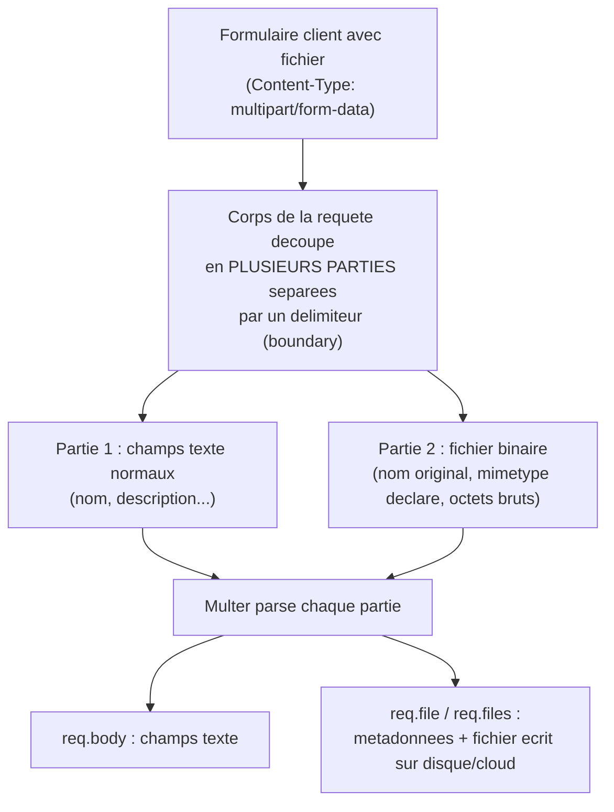

<div class="chapitre-titre-num">CHAPITRE 26</div>

# Téléversement de fichiers (Multer)

<div class="encadre objectif">
<span class="encadre-titre">🎯 Objectif du chapitre</span>
Gérer l'upload de fichiers (images, documents) dans une API Express avec Multer, avec validation de type/taille et stockage local ou cloud. À la fin de ce chapitre, tu sauras construire un endpoint d'upload qui résiste à un fichier malveillant déguisé, un volume abusif, ou un nom de fichier piégé.
</div>

<div class="encadre scenario">
<span class="encadre-titre">🎬 Mise en situation</span>
Un client demande d'ajouter un avatar de profil à son application. La première version fonctionne parfaitement en test... jusqu'à ce qu'un testeur curieux renomme un fichier `.exe` en `photo.jpg` et l'envoie quand même : l'API l'accepte sans broncher, car elle ne vérifiait que l'extension du nom de fichier. Ce chapitre construit un système d'upload qui va au-delà de cette vérification superficielle, exactement le niveau de rigueur attendu avant une mise en production réelle.
</div>

## 26.1 Pourquoi un middleware dédié est nécessaire

<div class="encadre astuce">
<span class="encadre-titre">💡 multipart/form-data : un format différent du JSON habituel</span>
Un fichier ne peut pas être envoyé en JSON classique. Le navigateur (ou tout client HTTP) encode un formulaire contenant un fichier au format `multipart/form-data`, qu'`express.json()` (chapitre 13) ne sait **pas** parser — un middleware dédié comme **Multer** est nécessaire.
</div>



<div class="encadre astuce">
<span class="encadre-titre">💡 Explication du schéma</span>
`express.json()` sait parser un corps JSON simple, mais pas cette structure en plusieurs parties séparées par un délimiteur — c'est précisément ce que Multer sait décoder, séparant les champs texte classiques (`req.body`) des fichiers binaires (`req.file`/`req.files`).
</div>

## 26.2 Configuration de base

```
$ npm install multer
```

```js
const multer = require("multer");
const path = require("path");

const stockage = multer.diskStorage({
  destination: (req, file, cb) => {
    cb(null, path.join(__dirname, "../../uploads")); // dossier de destination
  },
  filename: (req, file, cb) => {
    const suffixeUnique = Date.now() + "-" + Math.round(Math.random() * 1e9);
    cb(null, `${suffixeUnique}${path.extname(file.originalname)}`); // évite les collisions de noms
  },
});

const upload = multer({ storage: stockage });

module.exports = upload;
```

<div class="encadre securite">
<span class="encadre-titre">🔒 Sécurité — pourquoi générer un nom de fichier plutôt que garder l'original</span>
Utiliser directement `file.originalname` comme nom de fichier stocké expose à deux risques : une collision (deux utilisateurs envoient un fichier nommé de la même façon) et une tentative de "path traversal" (un nom de fichier contenant `../../` pourrait, sans cette précaution, écrire en dehors du dossier prévu). Générer un nom unique côté serveur (comme ci-dessus) élimine les deux risques à la fois.
</div>

## 26.3 Middleware d'upload sur une route

```js
const upload = require("../config/multer");

// upload.single("champNom") : un SEUL fichier, attendu sous la clé "champNom" du formulaire
router.post("/utilisateurs/:id/avatar", upload.single("avatar"), avatarController.televerser);
```

```js
// controllers/avatar.controller.js
async function televerser(req, res, next) {
  try {
    if (!req.file) {
      return res.status(400).json({ message: "Aucun fichier fourni" });
    }

    const cheminRelatif = `/uploads/${req.file.filename}`;
    await UtilisateurService.mettreAJourAvatar(req.params.id, cheminRelatif);

    res.json({ message: "Avatar mis à jour", url: cheminRelatif });
  } catch (erreur) {
    next(erreur);
  }
}
```

`req.file` (singulier) contient les métadonnées du fichier téléversé : `originalname`, `filename` (nom généré), `path`, `size`, `mimetype`.

## 26.4 Plusieurs fichiers à la fois

```js
router.post("/produits/:id/photos", upload.array("photos", 5), produitsController.ajouterPhotos);
// upload.array("photos", 5) : jusqu'à 5 fichiers sous la clé "photos"
```

```js
async function ajouterPhotos(req, res, next) {
  try {
    const urls = req.files.map((fichier) => `/uploads/${fichier.filename}`); // req.files (pluriel) : un TABLEAU
    await ProduitService.ajouterPhotos(req.params.id, urls);
    res.json({ urls });
  } catch (erreur) {
    next(erreur);
  }
}
```

## 26.5 Valider le type et la taille des fichiers

```js
const upload = multer({
  storage: stockage,
  limits: {
    fileSize: 5 * 1024 * 1024, // 5 Mo maximum
  },
  fileFilter: (req, file, cb) => {
    const typesAutorises = ["image/jpeg", "image/png", "image/webp"];
    if (!typesAutorises.includes(file.mimetype)) {
      return cb(new Error("Format de fichier non autorisé (JPEG, PNG, WebP uniquement)"));
    }
    cb(null, true); // accepte le fichier
  },
});
```

<div class="encadre attention">
<span class="encadre-titre">⚠️ Le mimetype envoyé par le client n'est pas totalement fiable</span>
`file.mimetype` provient d'un en-tête envoyé par le **client**, potentiellement falsifiable par un attaquant renommant un fichier malveillant avec une extension/mimetype trompeur — exactement le scénario de la mise en situation d'ouverture. Pour une validation réellement robuste, une vérification du contenu réel du fichier (via une librairie comme `file-type`, qui inspecte les premiers octets du fichier plutôt que de faire confiance à l'en-tête déclaré) est recommandée pour les cas sensibles.
</div>

```js
// Vérification renforcée : inspecte le contenu réel du fichier, pas seulement le mimetype déclaré
const { fileTypeFromFile } = require("file-type");

async function verifierTypeReel(cheminFichier, typesAutorises) {
  const typeDetecte = await fileTypeFromFile(cheminFichier);
  if (!typeDetecte || !typesAutorises.includes(typeDetecte.mime)) {
    throw new ValidationError("Le contenu réel du fichier ne correspond pas à un type autorisé");
  }
}
```

<div class="encadre retenir">
<span class="encadre-titre">📌 À retenir</span>
`fileFilter` (basé sur le mimetype déclaré) est une première ligne de défense rapide, mais insuffisante seule pour un contenu vraiment sensible (documents d'identité, fichiers exécutables potentiels). Une vérification du contenu réel après réception ajoute une seconde ligne de défense — exactement ce qui aurait détecté le fichier `.exe` déguisé de la mise en situation d'ouverture.
</div>

## 26.6 Gérer les erreurs Multer spécifiquement

```js
const multer = require("multer");

function gestionnaireErreurs(err, req, res, next) {
  if (err instanceof multer.MulterError) {
    if (err.code === "LIMIT_FILE_SIZE") {
      return res.status(413).json({ message: "Fichier trop volumineux" });
    }
    return res.status(400).json({ message: err.message });
  }
  // ... reste du gestionnaire d'erreurs centralisé (chapitre 19) ...
  next(err);
}
```

## 26.7 Stockage local vs cloud (S3, Cloudinary)

<div class="encadre astuce">
<span class="encadre-titre">💡 Pourquoi le stockage local ne suffit pas toujours en production</span>
`multer.diskStorage` écrit les fichiers directement sur le disque du serveur — fonctionne bien en développement ou sur un serveur unique, mais pose problème dès qu'il y a **plusieurs instances** du serveur (chapitre 39) : chaque instance aurait son propre disque, sans partage automatique des fichiers uploadés. En production, un stockage **cloud** (Amazon S3, Cloudinary, Google Cloud Storage) centralisé et accessible depuis toutes les instances est généralement préférable.
</div>

```js
// Exemple avec multer-storage-cloudinary (aperçu, configuration Cloudinary omise pour la brièveté)
const { CloudinaryStorage } = require("multer-storage-cloudinary");

const stockageCloudinary = new CloudinaryStorage({
  cloudinary,
  params: { folder: "avatars", allowed_formats: ["jpg", "png", "webp"] },
});

const uploadCloud = multer({ storage: stockageCloudinary });
```

## Atelier — Détecter le fichier déguisé de la mise en situation

<div class="encadre exercice">
<span class="encadre-titre">🛠️ Atelier 26 — Renforcer la validation au-delà du mimetype déclaré</span>

**Objectif** : reproduire puis corriger exactement le contournement découvert dans la mise en situation d'ouverture.

**Préparation** : un endpoint d'upload avec `fileFilter` basé sur le mimetype (section 26.5), et un petit fichier texte renommé en `.jpg` pour le test (`echo "faux contenu" > faux.jpg`).

**Étapes détaillées** :
1. Envoie ce fichier "faux.jpg" via Postman en spécifiant manuellement un `Content-Type: image/jpeg` pour la partie fichier (Postman permet ce réglage) : observe que `fileFilter` seul l'accepte, car il ne vérifie que ce mimetype déclaré.
2. Installe `file-type` (`npm install file-type`) et ajoute la vérification de contenu réel (section 26.5) après réception du fichier.
3. Renvoie le même fichier "faux.jpg" : observe cette fois un rejet, le contenu réel (texte brut) ne correspondant à aucun type d'image valide.

**Validation** : après l'ajout de la vérification de contenu réel, un fichier dont le contenu ne correspond pas à son mimetype déclaré doit être systématiquement rejeté, quel que soit l'en-tête envoyé par le client.

**Résultat attendu** : exactement la protection qui aurait empêché le contournement découvert par le testeur de la mise en situation d'ouverture.

**Dépannage** : si le rejet ne se produit pas, vérifie que la vérification de contenu réel s'exécute bien après l'écriture du fichier sur disque par Multer (elle a besoin du fichier réel, pas seulement des métadonnées déclarées).

**Nettoyage** : supprime le fichier "faux.jpg" de test et les fichiers uploadés générés pendant l'atelier.
</div>

## Erreurs fréquentes

<div class="encadre attention">
<span class="encadre-titre">⚠️ Erreur n°1 — Oublier de créer le dossier de destination</span>
Si le dossier `uploads/` n'existe pas physiquement, Multer lève une erreur au moment de l'upload. Toujours s'assurer que le dossier existe au démarrage de l'application (via `fs.mkdir(..., { recursive: true })`, rappel du chapitre 11), plutôt que de découvrir le problème seulement au premier upload réel.
</div>

<div class="encadre attention">
<span class="encadre-titre">⚠️ Erreur n°2 — Servir le dossier uploads/ sans aucune restriction</span>

```js
app.use("/uploads", express.static("uploads")); // ⚠️ rend TOUT le contenu du dossier publiquement accessible
```
Si des fichiers sensibles ou privés (documents personnels, pièces d'identité) sont stockés dans ce dossier, les rendre tous accessibles publiquement via une simple URL est une fuite de données potentielle — pour du contenu sensible, préférer une route authentifiée qui sert le fichier après vérification des droits, plutôt qu'un accès statique direct.
</div>

<div class="encadre attention">
<span class="encadre-titre">⚠️ Erreur n°3 — Faire confiance uniquement au mimetype déclaré pour du contenu sensible</span>
Exactement la faille de la mise en situation d'ouverture — `fileFilter` seul suffit pour un filtrage basique, mais un contenu réellement sensible mérite la vérification de contenu réel de la section 26.5.
</div>

## Débogage

<div class="encadre attention">
<span class="encadre-titre">🩺 Symptôme : "ENOENT: no such file or directory, open 'uploads/...'"</span>

- **Cause** : le dossier de destination n'existe pas (erreur fréquente n°1).
- **Solution** : créer le dossier explicitement au démarrage de l'application.
</div>

<div class="encadre attention">
<span class="encadre-titre">🩺 Symptôme : "LIMIT_FILE_SIZE" alors que le fichier semble raisonnable</span>

- **Cause** : la limite configurée (`limits.fileSize`) est plus basse que prévu, ou le client envoie un fichier plus volumineux que ce qui est visible côté interface (compression manquante, par exemple).
- **Solution** : vérifier la valeur exacte de `limits.fileSize` et la taille réelle du fichier envoyé.
</div>

## En entreprise

- **Antivirus sur les fichiers uploadés** : pour des applications à fort enjeu (santé, finance), certaines équipes passent chaque fichier téléversé par un scanner antivirus (comme ClamAV) avant de le rendre accessible, en plus de la validation de type.
- **CDN pour les fichiers publics** : les images publiques (photos de produits, avatars) sont souvent servies via un CDN plutôt que directement depuis le serveur applicatif, pour de meilleures performances et une charge réduite sur l'API elle-même.

## Entretien technique

<div class="encadre exercice">
<span class="encadre-titre">💼 Questions fréquemment posées en entretien</span>

**Q1. "Pourquoi express.json() ne peut-il pas parser un fichier uploadé ?"**
Réponse attendue : un fichier est envoyé au format `multipart/form-data`, une structure en plusieurs parties séparées par un délimiteur, différente du JSON classique — un middleware dédié comme Multer est nécessaire pour la décoder.

**Q2. "Le mimetype déclaré par le client est-il fiable pour valider un fichier ?"**
Réponse attendue : non, il peut être falsifié par le client ; une vérification robuste inspecte le contenu réel du fichier (ses premiers octets), pas seulement l'en-tête déclaré.

**Q3. "Pourquoi générer un nom de fichier côté serveur plutôt que garder le nom original ?"**
Réponse attendue : pour éviter les collisions entre utilisateurs et neutraliser un risque de path traversal si le nom original contient des séquences comme `../../`.
</div>

## Optimisation, sécurité et maintenabilité

<div class="encadre securite">
<span class="encadre-titre">🔒 Sécurité</span>
Pour tout upload destiné à un usage sensible, combiner systématiquement limite de taille, filtrage par mimetype déclaré, ET vérification du contenu réel — trois couches de défense complémentaires, pas redondantes.
</div>

<div class="encadre performance">
<span class="encadre-titre">🚀 Performance</span>
Une limite de taille de fichier trop généreuse peut ralentir le serveur et gonfler inutilement l'usage disque/cloud — calibrer la limite selon le besoin réel (un avatar n'a pas besoin d'accepter 50 Mo).
</div>

## Résumé du chapitre

- Multer gère l'upload multipart/form-data, qu'`express.json()` ne peut pas parser.
- `upload.single("champ")` pour un fichier, `upload.array("champ", max)` pour plusieurs.
- `limits` et `fileFilter` valident taille et type déclaré, mais le mimetype client reste falsifiable pour des besoins réellement sensibles — une vérification de contenu réel (`file-type`) ajoute une protection supplémentaire.
- Le stockage local convient au développement ; un stockage cloud partagé est nécessaire dès plusieurs instances de serveur.

## Quiz

<div class="encadre exercice">
<span class="encadre-titre">📝 QCM</span>

1. Pourquoi un middleware dédié (Multer) est-il nécessaire pour l'upload de fichiers ?
   - a) express.json() sait déjà tout gérer
   - b) Le format multipart/form-data diffère du JSON classique
   - c) Multer est plus rapide qu'Express
   - d) Ce n'est jamais nécessaire

2. Le mimetype déclaré par le client est-il une garantie suffisante du type réel du fichier ?
   - a) Oui, toujours
   - b) Non, il peut être falsifié
   - c) Seulement pour les images
   - d) Seulement en développement

3. Pourquoi éviter de servir tout le dossier uploads/ publiquement via express.static ?
   - a) C'est plus lent
   - b) Cela peut exposer des fichiers sensibles sans vérification des droits
   - c) Express l'interdit techniquement
   - d) Ce n'est jamais un problème

**Corrigé** : 1-b, 2-b, 3-b.
</div>

<div class="encadre exercice">
<span class="encadre-titre">📝 Vrai ou Faux</span>

1. req.file (singulier) est utilisé avec upload.array(). — **Faux** (req.files, pluriel, avec upload.array()).
2. Le mimetype déclaré par le client peut être falsifié par un attaquant. — **Vrai**.
3. Le stockage local (diskStorage) fonctionne sans problème sur plusieurs instances de serveur. — **Faux**.
</div>

<div class="encadre exercice">
<span class="encadre-titre">📝 Question ouverte</span>

Pourquoi le testeur de la mise en situation d'ouverture a-t-il réussi à contourner la validation, alors que `fileFilter` vérifiait bien le mimetype ?

**Corrigé** : `fileFilter` se base sur `file.mimetype`, une valeur **déclarée par le client** dans l'en-tête de la partie multipart concernée — rien n'empêche un client (ou un outil comme Postman) de déclarer `image/jpeg` pour un fichier dont le contenu réel est tout autre chose. Cette validation vérifie une étiquette, pas le contenu réel. Seule une inspection des premiers octets du fichier (via `file-type` ou équivalent) confirme la nature réelle du contenu, indépendamment de ce que le client prétend.
</div>

## Exercices

<div class="encadre exercice">
<span class="encadre-titre">📝 Exercice 26.1</span>

Configure Multer pour n'accepter que des fichiers PDF de moins de 2 Mo, sur une route `POST /documents`.
</div>

**Corrigé :**
```js
const uploadDocument = multer({
  storage: stockage,
  limits: { fileSize: 2 * 1024 * 1024 },
  fileFilter: (req, file, cb) => {
    if (file.mimetype !== "application/pdf") {
      return cb(new Error("Seuls les fichiers PDF sont acceptés"));
    }
    cb(null, true);
  },
});

router.post("/documents", uploadDocument.single("document"), documentsController.creer);
```

## Checklist de fin de chapitre

<ul class="checklist">
<li>☐ Je comprends pourquoi multipart/form-data nécessite un middleware dédié.</li>
<li>☐ Je sais gérer un fichier unique et plusieurs fichiers avec Multer.</li>
<li>☐ Je valide systématiquement taille et type déclaré des fichiers.</li>
<li>☐ Je sais que le mimetype client n'est pas une garantie suffisante pour du contenu sensible.</li>
<li>☐ Je ne sers jamais un dossier d'uploads sensible sans contrôle d'accès.</li>
</ul>

## FAQ

<dl class="faq">
<dt>Faut-il toujours vérifier le contenu réel d'un fichier, même pour un simple avatar ?</dt>
<dd>Pour un avatar public à faible enjeu, `fileFilter` seul est souvent suffisant en pratique. La vérification de contenu réel se justifie surtout pour des documents sensibles ou un contexte à risque élevé (santé, finance, upload exécutable potentiel).</dd>

<dt>Multer peut-il gérer un upload directement vers le cloud sans passer par le disque local ?</dt>
<dd>Oui, via des moteurs de stockage dédiés comme `multer-storage-cloudinary` ou `multer-s3`, qui envoient directement le fichier vers le service cloud sans écriture intermédiaire sur disque.</dd>

<dt>Comment limiter le nombre total de fichiers uploadés par un même utilisateur ?</dt>
<dd>Ce n'est pas une fonctionnalité de Multer lui-même — il faut l'implémenter au niveau du service (compter les fichiers déjà associés à l'utilisateur avant d'accepter un nouvel upload).</dd>
</dl>

## Références et pour aller plus loin

- Documentation Multer : [https://github.com/expressjs/multer](https://github.com/expressjs/multer)
- Documentation file-type (npm) : [https://github.com/sindresorhus/file-type](https://github.com/sindresorhus/file-type)

*Chapitre suivant : l'envoi d'e-mails avec Nodemailer.*
