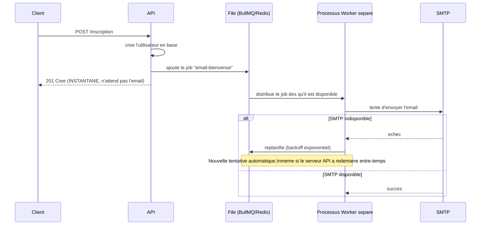

<div class="chapitre-titre-num">CHAPITRE 27</div>

# Envoi d'e-mails (Nodemailer)

<div class="encadre objectif">
<span class="encadre-titre">🎯 Objectif du chapitre</span>
Configurer l'envoi d'e-mails transactionnels (confirmation de compte, réinitialisation de mot de passe) avec Nodemailer, et gérer proprement les échecs d'envoi. À la fin de ce chapitre, tu sauras pourquoi l'envoi d'e-mail ne doit jamais bloquer une réponse HTTP, et comment une file d'attente rend cet envoi réellement fiable à l'échelle.
</div>

<div class="encadre scenario">
<span class="encadre-titre">🎬 Mise en situation</span>
Un vendredi soir, le fournisseur SMTP d'un client tombe temporairement en panne pendant 30 minutes. Pendant cette fenêtre, toutes les inscriptions de nouveaux utilisateurs échouent — pas à cause d'un bug applicatif, mais parce que le code attend (`await`) la fin de l'envoi de l'e-mail de bienvenue avant de répondre au client, et cet envoi ne se termine jamais dans les temps. Ce chapitre construit exactement le système qui aurait évité cette panne en cascade : l'inscription doit réussir même si l'e-mail de bienvenue met du temps, échoue temporairement, ou nécessite d'être retenté plus tard.
</div>

## 27.1 Configuration de base avec Nodemailer

```
$ npm install nodemailer
```

```js
// src/config/mailer.js
const nodemailer = require("nodemailer");

const transporteur = nodemailer.createTransport({
  host: process.env.SMTP_HOST,
  port: process.env.SMTP_PORT,
  secure: process.env.SMTP_PORT === "465", // true pour le port 465 (SSL direct), false pour 587 (STARTTLS)
  auth: {
    user: process.env.SMTP_USER,
    pass: process.env.SMTP_PASSWORD,
  },
});

module.exports = transporteur;
```

## 27.2 Envoyer un e-mail simple

```js
const transporteur = require("../config/mailer");

async function envoyerEmailBienvenue(destinataire, nom) {
  await transporteur.sendMail({
    from: '"Mon Application" <no-reply@monapp.com>',
    to: destinataire,
    subject: "Bienvenue sur Mon Application !",
    text: `Bonjour ${nom}, bienvenue !`, // version texte brut (fallback)
    html: `<h1>Bonjour ${nom}</h1><p>Bienvenue sur notre plateforme !</p>`,
  });
}
```

## 27.3 Templates d'e-mails avec des variables

```js
// src/templates/reinitialisationMotDePasse.js
function genererTemplateReinitialisation(nom, lienReinitialisation) {
  return `
    <div style="font-family: sans-serif; max-width: 600px; margin: auto;">
      <h2>Réinitialisation de mot de passe</h2>
      <p>Bonjour ${nom},</p>
      <p>Clique sur le lien ci-dessous pour réinitialiser ton mot de passe (valable 1 heure) :</p>
      <a href="${lienReinitialisation}" style="background:#2e8b57;color:white;padding:10px 20px;border-radius:6px;text-decoration:none;">
        Réinitialiser mon mot de passe
      </a>
      <p style="color:#888;font-size:12px;margin-top:20px;">
        Si tu n'as pas demandé cette réinitialisation, ignore cet e-mail.
      </p>
    </div>
  `;
}

module.exports = { genererTemplateReinitialisation };
```

```js
async function envoyerEmailReinitialisation(utilisateur, token) {
  const lien = `${process.env.FRONTEND_URL}/reinitialiser-mot-de-passe?token=${token}`;

  await transporteur.sendMail({
    from: '"Mon Application" <no-reply@monapp.com>',
    to: utilisateur.email,
    subject: "Réinitialisation de ton mot de passe",
    html: genererTemplateReinitialisation(utilisateur.nom, lien),
  });
}
```

## 27.4 Ne jamais bloquer une requête HTTP sur l'envoi d'un e-mail

<div class="encadre attention">
<span class="encadre-titre">⚠️ L'envoi d'e-mail peut être lent ou échouer, sans que ce soit un vrai problème métier</span>

```js
// ❌ Si le serveur SMTP est lent ou en panne, TOUTE la requête d'inscription échoue ou traîne
async function inscrire(req, res, next) {
  const utilisateur = await UtilisateurService.creer(req.body);
  await envoyerEmailBienvenue(utilisateur.email, utilisateur.nom); // bloque la réponse HTTP !
  res.status(201).json(utilisateur);
}
```
```js
// ✅ L'inscription réussit indépendamment de l'envoi d'e-mail ; l'échec d'envoi est journalisé, pas bloquant
async function inscrire(req, res, next) {
  const utilisateur = await UtilisateurService.creer(req.body);

  envoyerEmailBienvenue(utilisateur.email, utilisateur.nom).catch((erreur) => {
    logger.error("Échec d'envoi de l'e-mail de bienvenue", { erreur: erreur.message, email: utilisateur.email });
  }); // PAS de "await" ici : ne bloque pas la réponse au client

  res.status(201).json(utilisateur);
}
```
Exactement la panne de la mise en situation d'ouverture : la version bloquante fait échouer l'inscription elle-même dès que le SMTP est lent, alors que ces deux opérations n'ont aucune raison d'être liées dans leur succès.
</div>

## 27.5 Aller plus loin : file d'attente avec BullMQ

<div class="encadre astuce">
<span class="encadre-titre">💡 Pourquoi un simple .catch() silencieux ne suffit pas toujours</span>
La version non bloquante de la section 27.4 résout le blocage, mais un e-mail dont l'envoi échoue silencieusement (`.catch()` qui se contente de journaliser) **n'est jamais retenté** — l'utilisateur ne recevra tout simplement jamais son e-mail de bienvenue si le SMTP était en panne à ce moment précis. Une **file d'attente** (BullMQ, avec Redis) résout ce problème : chaque envoi devient un "job" retenté automatiquement en cas d'échec, survivant même à un redémarrage du serveur.
</div>

```
$ npm install bullmq
```

```js
// src/queues/email.queue.js
const { Queue } = require("bullmq");
const connexionRedis = { host: process.env.REDIS_HOST, port: process.env.REDIS_PORT };

const fileEmail = new Queue("emails", { connection: connexionRedis });

async function ajouterEmailBienvenueALaFile(destinataire, nom) {
  await fileEmail.add(
    "email-bienvenue",
    { destinataire, nom },
    { attempts: 3, backoff: { type: "exponential", delay: 5000 } } // 3 tentatives, delai croissant entre chacune
  );
}

module.exports = { fileEmail, ajouterEmailBienvenueALaFile };
```

```js
// src/workers/email.worker.js — processus SEPARE qui traite la file en arriere-plan
const { Worker } = require("bullmq");
const transporteur = require("../config/mailer");

const workerEmail = new Worker(
  "emails",
  async (job) => {
    const { destinataire, nom } = job.data;
    await transporteur.sendMail({
      from: '"Mon Application" <no-reply@monapp.com>',
      to: destinataire,
      subject: "Bienvenue sur Mon Application !",
      html: `<h1>Bonjour ${nom}</h1><p>Bienvenue sur notre plateforme !</p>`,
    });
  },
  { connection: { host: process.env.REDIS_HOST, port: process.env.REDIS_PORT } }
);

workerEmail.on("failed", (job, erreur) => {
  logger.error(`Echec definitif envoi email (job ${job.id}) apres toutes les tentatives`, { erreur: erreur.message });
});
```

```js
// Dans le contrôleur : remplace l'appel direct par un ajout à la file
async function inscrire(req, res, next) {
  const utilisateur = await UtilisateurService.creer(req.body);
  await ajouterEmailBienvenueALaFile(utilisateur.email, utilisateur.nom); // quasi instantane, juste ajoute a la file
  res.status(201).json(utilisateur);
}
```



<div class="encadre astuce">
<span class="encadre-titre">💡 Explication du schéma</span>
Le client reçoit sa réponse `201 Créé` immédiatement, sans jamais attendre l'envoi réel de l'e-mail. Le worker, un processus complètement séparé, traite la file à son rythme et retente automatiquement en cas d'échec — exactement le mécanisme qui aurait absorbé la panne SMTP de 30 minutes de la mise en situation d'ouverture sans faire échouer une seule inscription.
</div>

<div class="encadre retenir">
<span class="encadre-titre">📌 À retenir</span>
Pour un projet simple ou un volume d'e-mails faible, la version non bloquante avec `.catch()` (section 27.4) est un compromis raisonnable. BullMQ se justifie dès qu'un e-mail est réellement critique (confirmation de compte, réinitialisation de mot de passe) ou que le volume devient important — le projet final MediAPI (chapitres 41-47) reste volontairement sur la version simple, cette file d'attente étant documentée ici comme évolution possible.
</div>

## 27.6 Tester les e-mails en développement sans vrai serveur SMTP

```
$ npm install --save-dev nodemailer  # déjà installé, utiliser son compte de test intégré
```

```js
// Ethereal (via Nodemailer) : un faux service SMTP pour le développement, capture les e-mails sans les envoyer réellement
const compteTest = await nodemailer.createTestAccount();

const transporteurTest = nodemailer.createTransport({
  host: "smtp.ethereal.email",
  port: 587,
  auth: { user: compteTest.user, pass: compteTest.pass },
});

const info = await transporteurTest.sendMail({ /* ... */ });
console.log("Aperçu de l'e-mail :", nodemailer.getTestMessageUrl(info)); // lien pour VOIR l'e-mail envoyé
```

## Atelier — Simuler la panne SMTP de la mise en situation

<div class="encadre exercice">
<span class="encadre-titre">🛠️ Atelier 27 — De l'échec bloquant à la file d'attente résiliente</span>

**Objectif** : reproduire la panne de la mise en situation d'ouverture, et vérifier que la solution par file d'attente y résiste.

**Préparation** : Redis installé localement (ou via Docker, chapitre 37), BullMQ configuré selon la section 27.5.

**Étapes détaillées** :
1. Configure volontairement un `SMTP_HOST` invalide (simulant une panne).
2. Avec la version bloquante (section 27.4, premier exemple), lance une inscription : mesure le temps de réponse et observe l'échec de l'inscription elle-même.
3. Passe à la version non bloquante avec `.catch()` (section 27.4, second exemple) : l'inscription réussit, mais vérifie qu'aucun e-mail n'est jamais retenté.
4. Passe à la version BullMQ (section 27.5) : lance l'inscription, vérifie qu'elle répond instantanément, puis observe dans les logs du worker les tentatives automatiques répétées avec délai croissant.
5. Restaure un `SMTP_HOST` valide sans redémarrer le worker : vérifie que la prochaine tentative automatique réussit enfin.

**Validation** : seule la version BullMQ doit finir par envoyer l'e-mail avec succès une fois le SMTP rétabli, sans aucune action manuelle supplémentaire.

**Résultat attendu** : la démonstration complète de pourquoi une file d'attente rend un système réellement résilient face à une panne temporaire d'un service externe.

**Dépannage** : si le worker ne retente jamais, vérifie que `attempts` et `backoff` sont bien configurés dans `fileEmail.add(...)`.

**Nettoyage** : restaure la configuration SMTP réelle, vide la file de test (`fileEmail.obliterate()` si nécessaire, avec précaution).
</div>

## Erreurs fréquentes

<div class="encadre attention">
<span class="encadre-titre">⚠️ Erreur n°1 — Utiliser des identifiants SMTP réels dans un environnement de test/CI</span>
Les tests automatisés (chapitre 29-30) ne devraient **jamais** envoyer de vrais e-mails à de vraies adresses. Utiliser un service de test (Ethereal) ou simuler complètement le transporteur (`jest.mock`) dans l'environnement de test.
</div>

<div class="encadre attention">
<span class="encadre-titre">⚠️ Erreur n°2 — Bloquer une réponse HTTP sur l'envoi d'un e-mail</span>
Exactement la panne de la mise en situation d'ouverture — coupler artificiellement le succès d'une opération métier (inscription) à celui d'un envoi d'e-mail, qui devrait rester une conséquence secondaire, pas une condition bloquante.
</div>

## Débogage

<div class="encadre attention">
<span class="encadre-titre">🩺 Symptôme : les inscriptions échouent en masse pendant quelques minutes, sans erreur applicative évidente</span>

- **Cause probable** : envoi d'e-mail bloquant (erreur fréquente n°2) combiné à une panne ou une lenteur du fournisseur SMTP.
- **Diagnostic** : vérifier les logs pour une corrélation entre les échecs d'inscription et des timeouts SMTP.
- **Solution** : rendre l'envoi non bloquant a minima, ou migrer vers une file d'attente (section 27.5) pour une vraie résilience.
</div>

## En entreprise

- **Services d'envoi transactionnel managés** : de nombreuses équipes utilisent des services comme SendGrid, Mailgun ou Amazon SES plutôt qu'un serveur SMTP auto-géré, pour une meilleure délivrabilité et une infrastructure déjà résiliente.
- **File d'attente quasi systématique à l'échelle** : au-delà d'un volume modeste, la quasi-totalité des équipes professionnelles déplacent l'envoi d'e-mails (et d'autres tâches asynchrones : notifications push, génération de rapports) vers une file d'attente dédiée.

## Entretien technique

<div class="encadre exercice">
<span class="encadre-titre">💼 Questions fréquemment posées en entretien</span>

**Q1. "Pourquoi ne jamais await l'envoi d'un e-mail avant de répondre à une requête HTTP ?"**
Réponse attendue : pour éviter qu'une lenteur ou une panne du service d'e-mail ne fasse échouer ou traîner une opération métier qui n'en dépend pas réellement — exactement la panne de la mise en situation d'ouverture.

**Q2. "Quel avantage apporte une file d'attente (BullMQ) par rapport à un simple .catch() ?"**
Réponse attendue : des tentatives automatiques en cas d'échec (avec délai croissant), une persistance des jobs même après un redémarrage du serveur, et un traitement dans un processus séparé qui ne charge pas le serveur API principal.

**Q3. "Comment tester l'envoi d'e-mails sans envoyer de vrais messages ?"**
Réponse attendue : utiliser Ethereal (compte de test intégré à Nodemailer) en développement, ou simuler complètement le transporteur dans les tests automatisés.
</div>

## Optimisation, sécurité et maintenabilité

<div class="encadre performance">
<span class="encadre-titre">🚀 Performance</span>
Déplacer l'envoi d'e-mails vers un worker séparé (BullMQ) libère le processus API principal de cette charge, améliorant le temps de réponse perçu par le client, indépendamment de la vitesse du service SMTP.
</div>

<div class="encadre securite">
<span class="encadre-titre">🔒 Sécurité</span>
Ne jamais journaliser le contenu complet d'un e-mail contenant des informations sensibles (comme un lien de réinitialisation) dans des logs partagés — journaliser l'événement (envoi réussi/échoué) suffit, sans reproduire le contenu.
</div>

## Résumé du chapitre

- Nodemailer configure un transporteur SMTP réutilisable pour tout l'envoi d'e-mails de l'application.
- Les templates HTML avec variables interpolées produisent des e-mails transactionnels professionnels.
- L'envoi d'e-mail ne doit jamais bloquer la réponse HTTP principale ; un échec d'envoi doit être journalisé, pas nécessairement bloquant pour l'utilisateur.
- BullMQ (file d'attente avec Redis) rend l'envoi réellement résilient, avec tentatives automatiques et persistance des jobs.
- Ethereal (via Nodemailer) permet de tester l'envoi d'e-mails en développement sans jamais envoyer de vrais messages.

## Quiz

<div class="encadre exercice">
<span class="encadre-titre">📝 QCM</span>

1. Pourquoi ne jamais bloquer une réponse HTTP sur l'envoi d'un e-mail ?
   - a) Ce n'est jamais un problème
   - b) Une panne du service email ferait échouer une opération métier qui n'en dépend pas
   - c) Node.js l'interdit techniquement
   - d) Cela ralentit uniquement le serveur SMTP

2. Que fait BullMQ que .catch() seul ne fait pas ?
   - a) Il envoie les emails plus vite
   - b) Il retente automatiquement en cas d'échec, avec persistance
   - c) Il chiffre le contenu des emails
   - d) Rien de plus

3. Comment tester l'envoi d'e-mails sans envoyer de vrais messages ?
   - a) Ce n'est pas possible
   - b) Utiliser Ethereal ou simuler le transporteur
   - c) Toujours utiliser le vrai SMTP de production
   - d) Désactiver complètement les tests

**Corrigé** : 1-b, 2-b, 3-b.
</div>

<div class="encadre exercice">
<span class="encadre-titre">📝 Vrai ou Faux</span>

1. Un email envoyé via .catch() silencieux est automatiquement retenté en cas d'échec. — **Faux** (BullMQ apporte cette garantie, pas un simple catch).
2. BullMQ nécessite Redis pour fonctionner. — **Vrai**.
3. Les tests automatisés devraient envoyer de vrais emails pour être réalistes. — **Faux**.
</div>

<div class="encadre exercice">
<span class="encadre-titre">📝 Question ouverte</span>

Pourquoi la version "non bloquante avec .catch()" (section 27.4) n'aurait-elle pas suffi à absorber complètement la panne de 30 minutes de la mise en situation d'ouverture ?

**Corrigé** : elle empêche bien l'inscription elle-même d'échouer, mais tout e-mail de bienvenue dont l'envoi échoue pendant cette fenêtre de panne est **définitivement perdu** — `.catch()` se contente de journaliser l'échec, sans jamais retenter. Les utilisateurs inscrits pendant cette demi-heure ne recevraient jamais leur e-mail de bienvenue. Seule une file d'attente avec tentatives automatiques (BullMQ) garantit que l'e-mail finit par partir dès que le service SMTP redevient disponible, sans perte ni intervention manuelle.
</div>

## Exercices

<div class="encadre exercice">
<span class="encadre-titre">📝 Exercice 27.1</span>

Écris une fonction `envoyerEmailConfirmationCommande(commande)` qui envoie un e-mail récapitulatif (numéro de commande, montant total) sans bloquer la réponse HTTP du contrôleur qui l'appelle.
</div>

**Corrigé :**
```js
async function envoyerEmailConfirmationCommande(commande) {
  await transporteur.sendMail({
    from: '"Ma Boutique" <no-reply@maboutique.com>',
    to: commande.clientEmail,
    subject: `Confirmation de votre commande #${commande.id}`,
    html: `<p>Merci pour votre commande de ${commande.total} HTG.</p>`,
  });
}

// Dans le contrôleur :
envoyerEmailConfirmationCommande(commande).catch((e) => logger.error("Échec email commande", { erreur: e.message }));
res.status(201).json(commande);
```

## Checklist de fin de chapitre

<ul class="checklist">
<li>☐ Je sais configurer Nodemailer avec un transporteur SMTP.</li>
<li>☐ Je sais créer un template HTML avec variables interpolées.</li>
<li>☐ Je ne bloque jamais une réponse HTTP sur l'envoi d'un e-mail.</li>
<li>☐ Je comprends l'avantage d'une file d'attente (BullMQ) par rapport à un simple catch.</li>
<li>☐ Je sais tester l'envoi d'e-mails sans envoyer de vrais messages.</li>
</ul>

## FAQ

<dl class="faq">
<dt>Faut-il BullMQ dès le premier projet ?</dt>
<dd>Non, pour un projet simple avec un faible volume d'e-mails, la version non bloquante avec .catch() (section 27.4) est un compromis raisonnable. BullMQ apporte une vraie valeur dès qu'un e-mail est critique ou que le volume grandit.</dd>

<dt>Peut-on utiliser BullMQ pour d'autres tâches que l'envoi d'e-mails ?</dt>
<dd>Oui, c'est une file d'attente généraliste — génération de rapports, traitement d'images, notifications push, tout traitement asynchrone qui bénéficierait de tentatives automatiques et d'un traitement en arrière-plan.</dd>

<dt>Que se passe-t-il si le worker BullMQ est arrêté pendant qu'un job est en attente ?</dt>
<dd>Le job reste stocké dans Redis (persistant) jusqu'à ce qu'un worker redevienne disponible pour le traiter — aucune perte, contrairement à un job en mémoire qui disparaîtrait avec le processus.</dd>
</dl>

## Références et pour aller plus loin

- Documentation Nodemailer : [https://nodemailer.com](https://nodemailer.com)
- Documentation BullMQ : [https://docs.bullmq.io](https://docs.bullmq.io)
- Ethereal Email (test SMTP) : [https://ethereal.email](https://ethereal.email)

*Chapitre suivant : la documentation Swagger/OpenAPI, pour documenter l'API de façon interactive et exploitable par d'autres développeurs.*
