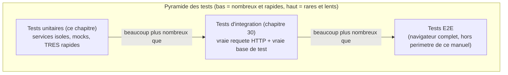

<div class="chapitre-titre-num">CHAPITRE 29</div>

# Tests unitaires (Jest)

<div class="encadre objectif">
<span class="encadre-titre">🎯 Objectif du chapitre</span>
Configurer Jest, écrire des tests unitaires sur des services (logique métier pure), et utiliser les mocks pour isoler le code testé de ses dépendances. À la fin de ce chapitre, tu sauras écrire des tests rapides et fiables qui protègent réellement ta logique métier contre les régressions futures.
</div>

<div class="encadre scenario">
<span class="encadre-titre">🎬 Mise en situation</span>
Un développeur modifie la fonction de calcul de remise d'une boutique en ligne pour ajouter un nouveau cas (remise fidélité cumulable). Trois semaines plus tard, un client signale que le calcul du total du panier est faux depuis cette modification — une régression silencieuse, découverte seulement en production. Sans tests automatisés couvrant cette logique métier, personne n'aurait pu le remarquer avant la mise en ligne. Ce chapitre construit exactement le filet de sécurité qui aurait attrapé cette régression avant qu'elle n'atteigne un vrai client.
</div>

## 29.1 Pourquoi tester en priorité les services

<div class="encadre astuce">
<span class="encadre-titre">💡 Rappel de l'architecture en couches (chapitre 17)</span>
Les **services** contiennent la logique métier pure, indépendante de HTTP et de la base de données réelle (grâce à l'injection du repository). Ce sont les candidats **idéaux** pour des tests unitaires rapides et fiables — contrairement aux contrôleurs (qui nécessitent une vraie requête HTTP, chapitre 30) ou aux repositories (qui nécessitent une vraie base de données).
</div>



<div class="encadre astuce">
<span class="encadre-titre">💡 Explication du schéma</span>
La majorité des tests d'un projet devrait être des tests unitaires (rapides, ciblés, faciles à écrire) ; les tests d'intégration (chapitre 30) couvrent moins de cas mais valident l'assemblage réel des couches ; les tests E2E (hors périmètre de ce manuel, testent l'application complète via un navigateur) restent les plus rares car les plus lents et coûteux à maintenir.
</div>

## 29.2 Installation et configuration

```
$ npm install --save-dev jest
```

```json
// package.json
"scripts": {
  "test": "jest",
  "test:watch": "jest --watch",
  "test:coverage": "jest --coverage"
}
```

## 29.3 Premier test unitaire

```js
// src/services/calculs.service.js
function calculerTotalPanier(articles) {
  return articles.reduce((total, article) => total + article.prix * article.quantite, 0);
}

module.exports = { calculerTotalPanier };
```

```js
// src/services/calculs.service.test.js
const { calculerTotalPanier } = require("./calculs.service");

describe("calculerTotalPanier", () => {
  it("calcule correctement le total de plusieurs articles", () => {
    const articles = [
      { prix: 250, quantite: 2 },
      { prix: 100, quantite: 3 },
    ];
    expect(calculerTotalPanier(articles)).toBe(800); // 250*2 + 100*3
  });

  it("retourne 0 pour un panier vide", () => {
    expect(calculerTotalPanier([])).toBe(0);
  });
});
```

```
$ npm test

 PASS  src/services/calculs.service.test.js
  calculerTotalPanier
    ✓ calcule correctement le total de plusieurs articles (2 ms)
    ✓ retourne 0 pour un panier vide (1 ms)

Test Suites: 1 passed, 1 total
Tests:       2 passed, 2 total
```

## 29.4 Les matchers Jest essentiels

| Matcher | Vérifie | Exemple |
|---|---|---|
| `toBe` | Égalité stricte (`===`), pour primitives | `expect(resultat).toBe(5)` |
| `toEqual` | Égalité profonde de structure, pour objets/tableaux | `expect(objet).toEqual({ nom: "Jaslin" })` |
| `toBeNull` | La valeur est exactement `null` | `expect(valeur).toBeNull()` |
| `toBeUndefined` | La valeur est `undefined` | `expect(valeur).toBeUndefined()` |
| `toBeTruthy` | La valeur est "vraie" au sens JavaScript | `expect(valeur).toBeTruthy()` |
| `toContain` | Un tableau/chaîne contient un élément | `expect(tableau).toContain("element")` |
| `toHaveLength` | Longueur exacte d'un tableau/chaîne | `expect(tableau).toHaveLength(3)` |
| `toThrow` | Une fonction lève bien une exception | `expect(fonction).toThrow("message")` |

<div class="encadre retenir">
<span class="encadre-titre">📌 À retenir</span>
`toBe` vs `toEqual` est la confusion la plus fréquente chez les débutants : `toBe` compare la référence (identique pour les primitives, mais deux objets distincts avec le même contenu échouent), `toEqual` compare le contenu structurel — pour un objet ou un tableau, `toEqual` est presque toujours le bon choix.
</div>

## 29.5 Tester du code asynchrone

```js
// service à tester
async function verifierAge(age) {
  if (age < 0 || age > 120) {
    throw new Error("Âge invalide");
  }
  return true;
}
```

```js
describe("verifierAge", () => {
  it("résout à true pour un âge valide", async () => {
    await expect(verifierAge(25)).resolves.toBe(true);
  });

  it("rejette pour un âge invalide", async () => {
    await expect(verifierAge(-5)).rejects.toThrow("Âge invalide");
  });
});
```

## 29.6 Mocker un repository pour tester un service isolément

```js
// services/utilisateurs.service.js
async function creerUtilisateur({ nom, email, motDePasse }, utilisateurRepository, bcrypt) {
  const existant = await utilisateurRepository.trouverParEmail(email);
  if (existant) {
    throw new ConflitError("Cet email est déjà utilisé");
  }
  const motDePasseHash = await bcrypt.hash(motDePasse, 10);
  return utilisateurRepository.creer({ nom, email, motDePasseHash });
}
```

```js
describe("creerUtilisateur", () => {
  it("lève une ConflitError si l'email existe déjà", async () => {
    const repositoryFactice = {
      trouverParEmail: jest.fn().mockResolvedValue({ id: 1, email: "jaslin@mail.com" }), // simule un utilisateur EXISTANT
      creer: jest.fn(),
    };
    const bcryptFactice = { hash: jest.fn() };

    await expect(
      creerUtilisateur({ nom: "Jaslin", email: "jaslin@mail.com", motDePasse: "abc12345" }, repositoryFactice, bcryptFactice)
    ).rejects.toThrow("Cet email est déjà utilisé");

    expect(repositoryFactice.creer).not.toHaveBeenCalled(); // vérifie que creer() n'a JAMAIS été appelé
  });

  it("crée l'utilisateur si l'email est disponible", async () => {
    const repositoryFactice = {
      trouverParEmail: jest.fn().mockResolvedValue(null), // aucun utilisateur existant
      creer: jest.fn().mockResolvedValue({ id: 1, nom: "Jaslin" }),
    };
    const bcryptFactice = { hash: jest.fn().mockResolvedValue("hash-simule") };

    const resultat = await creerUtilisateur(
      { nom: "Jaslin", email: "jaslin@mail.com", motDePasse: "abc12345" },
      repositoryFactice,
      bcryptFactice
    );

    expect(resultat.nom).toBe("Jaslin");
    expect(repositoryFactice.creer).toHaveBeenCalledWith({
      nom: "Jaslin", email: "jaslin@mail.com", motDePasseHash: "hash-simule",
    });
  });
});
```

<div class="encadre astuce">
<span class="encadre-titre">💡 jest.fn() crée une fonction "espion", vérifiable et simulable</span>
`jest.fn()` crée une fonction factice dont on peut définir la valeur de retour (`mockResolvedValue` pour une Promise résolue, `mockRejectedValue` pour une Promise rejetée) et vérifier **comment** elle a été appelée (`toHaveBeenCalledWith(...)`, `toHaveBeenCalledTimes(...)`) — la base de l'isolation d'un service de ses dépendances réelles.
</div>

## 29.7 jest.mock() : mocker un module entier

```js
// Alternative : mocker automatiquement TOUT un module (plutôt que de passer des dépendances en paramètre)
jest.mock("../repositories/utilisateurs.repository");
const UtilisateurRepository = require("../repositories/utilisateurs.repository");

describe("UtilisateurService avec jest.mock", () => {
  it("appelle bien le repository mocké", async () => {
    UtilisateurRepository.trouverParEmail.mockResolvedValue(null);
    UtilisateurRepository.creer.mockResolvedValue({ id: 1 });

    await UtilisateurService.creerUtilisateur({ nom: "Jaslin", email: "jaslin@mail.com", motDePasse: "abc12345" });

    expect(UtilisateurRepository.creer).toHaveBeenCalled();
  });
});
```

## 29.8 Organisation des tests et couverture de code

```
src/
├── services/
│   ├── utilisateurs.service.js
│   └── utilisateurs.service.test.js  # convention : fichier de test À CÔTÉ du fichier testé
```

```
$ npm run test:coverage

--------------------|---------|----------|---------|---------|
File                | % Stmts | % Branch | % Funcs | % Lines |
--------------------|---------|----------|---------|---------|
utilisateurs.service |   85.71 |    75.00 |  100.00 |   85.71 |
--------------------|---------|----------|---------|---------|
```

<div class="encadre astuce">
<span class="encadre-titre">💡 Un taux de couverture élevé n'est pas une fin en soi</span>
100% de couverture ne garantit **pas** l'absence de bugs — cela signifie seulement que chaque ligne a été **exécutée** au moins une fois par les tests, pas que tous les cas limites ont été vérifiés. Vise une couverture élevée sur la logique métier critique, sans en faire un objectif chiffré aveugle qui pousserait à écrire des tests superficiels juste pour "faire du chiffre".
</div>

## Atelier — Attraper la régression de la mise en situation

<div class="encadre exercice">
<span class="encadre-titre">🛠️ Atelier 29 — Un test qui aurait empêché l'incident</span>

**Objectif** : reproduire la régression de la mise en situation d'ouverture et démontrer qu'un test l'aurait attrapée avant la mise en production.

**Préparation** : une fonction `calculerRemise(montant, pourcentage, estFidele)` calculant une remise simple, plus une remise fidélité additionnelle de 5% si `estFidele` est vrai.

**Étapes détaillées** :
1. Écris d'abord les tests pour le comportement actuel (remise simple, sans fidélité) et vérifie qu'ils passent.
2. Modifie la fonction pour ajouter la remise fidélité, mais introduis volontairement une erreur (par exemple, appliquer la remise fidélité même quand `estFidele` est faux).
3. Relance les tests existants : ils doivent échouer, révélant immédiatement la régression.
4. Corrige la fonction, relance les tests : ils doivent repasser.

**Validation** : les tests écrits à l'étape 1 doivent échouer clairement à l'étape 3, avant toute correction — la preuve qu'ils remplissent réellement leur rôle de filet de sécurité.

**Résultat attendu** : exactement le mécanisme qui aurait empêché la régression découverte trois semaines plus tard par le client de la mise en situation d'ouverture, en la détectant immédiatement au moment du changement.

**Dépannage** : si les tests ne détectent pas la régression introduite, vérifie qu'ils couvrent bien le cas précis affecté par le changement (souvent un signe qu'il manque un cas de test).

**Nettoyage** : aucun, ces tests peuvent rester dans le projet.
</div>

## Erreurs fréquentes

<div class="encadre attention">
<span class="encadre-titre">⚠️ Erreur n°1 — Oublier await sur une assertion Jest asynchrone</span>

```js
it("rejette pour un âge invalide", () => {
  expect(verifierAge(-5)).rejects.toThrow("Âge invalide"); // ❌ pas de "await" : le test PASSE même si l'assertion échoue !
});
```
```js
it("rejette pour un âge invalide", async () => {
  await expect(verifierAge(-5)).rejects.toThrow("Âge invalide"); // ✅ "await" garantit que Jest attend le résultat réel
});
```
Sans `await` (ou `return`), Jest ne sait pas attendre la résolution de la Promise avant de conclure le test réussi — un piège **silencieux** qui donne une fausse impression de test fonctionnel alors qu'il ne vérifie en réalité rien du tout.
</div>

<div class="encadre attention">
<span class="encadre-titre">⚠️ Erreur n°2 — Confondre toBe et toEqual sur des objets</span>

```js
expect({ nom: "Jaslin" }).toBe({ nom: "Jaslin" }); // ❌ échoue toujours : deux objets distincts, même contenu
expect({ nom: "Jaslin" }).toEqual({ nom: "Jaslin" }); // ✅ compare le contenu structurel
```
</div>

## Débogage

<div class="encadre attention">
<span class="encadre-titre">🩺 Symptôme : un test asynchrone passe systématiquement, même quand il ne devrait pas</span>

- **Cause** : `await` manquant sur une assertion asynchrone (erreur fréquente n°1).
- **Diagnostic** : relire chaque `it(...)` async pour vérifier la présence de `await` devant chaque `expect(...).resolves`/`.rejects`.
- **Solution** : ajouter le `await` manquant, ou activer la règle ESLint `jest/valid-expect` qui détecte ce piège automatiquement.
</div>

## En entreprise

- **Tests obligatoires en CI avant fusion** : la quasi-totalité des équipes bloquent la fusion d'une pull request si les tests échouent, rendant impossible la régression de la mise en situation d'ouverture si elle avait été couverte par un test.
- **Couverture de code suivie mais pas absolue** : de nombreuses équipes fixent un seuil minimal de couverture (souvent 70-80% sur la logique métier), sans viser 100% partout, cohérent avec la nuance de la section 29.8.

## Entretien technique

<div class="encadre exercice">
<span class="encadre-titre">💼 Questions fréquemment posées en entretien</span>

**Q1. "Pourquoi tester en priorité les services plutôt que les contrôleurs ?"**
Réponse attendue : les services contiennent la logique métier pure, indépendante de HTTP et de la base de données réelle grâce à l'injection de dépendances — ils se testent rapidement et de façon fiable, sans simuler un contexte HTTP complet.

**Q2. "Quelle est la différence entre toBe et toEqual ?"**
Réponse attendue : `toBe` compare par référence (égalité stricte, adaptée aux primitives) ; `toEqual` compare par structure/contenu, adaptée aux objets et tableaux.

**Q3. "Pourquoi 100% de couverture de code ne garantit-il pas l'absence de bugs ?"**
Réponse attendue : la couverture mesure seulement si chaque ligne a été exécutée au moins une fois, pas si tous les cas limites et combinaisons possibles ont été vérifiés.
</div>

## Optimisation, sécurité et maintenabilité

<div class="encadre performance">
<span class="encadre-titre">🚀 Performance</span>
Les tests unitaires isolés (avec mocks) s'exécutent en millisecondes par centaines — une suite de tests unitaires complète devrait rester rapide (quelques secondes), permettant de les lancer fréquemment sans friction pendant le développement.
</div>

<div class="encadre bonne-pratique">
<span class="encadre-titre">✅ Maintenabilité</span>
Nommer les tests de façon descriptive ("lève une ConflitError si l'email existe déjà", pas "test 1") — un test qui échoue doit indiquer immédiatement, par son seul nom, ce qui a cassé.
</div>

## Résumé du chapitre

- Les services (logique métier pure) sont les candidats prioritaires pour des tests unitaires rapides et fiables.
- Les matchers Jest (`toBe`, `toEqual`, `toThrow`, `resolves`/`rejects`) couvrent la quasi-totalité des besoins d'assertion.
- `jest.fn()` crée des fonctions espion simulables, permettant d'isoler un service de son repository réel.
- Les tests unitaires forment la base large de la pyramide des tests, bien plus nombreux que les tests d'intégration ou E2E.
- Toujours `await` (ou `return`) une assertion Jest sur du code asynchrone, sinon le test peut réussir silencieusement sans rien vérifier.

## Quiz

<div class="encadre exercice">
<span class="encadre-titre">📝 QCM</span>

1. Quelle couche est la candidate prioritaire pour des tests unitaires ?
   - a) Les routes
   - b) Les services
   - c) La base de données
   - d) Le middleware CORS

2. Quel matcher utiliser pour comparer deux objets par leur contenu ?
   - a) toBe
   - b) toEqual
   - c) toContain
   - d) toBeTruthy

3. Que se passe-t-il si on oublie await devant une assertion asynchrone Jest ?
   - a) Le test échoue immédiatement
   - b) Le test peut réussir silencieusement sans vérifier réellement l'assertion
   - c) Jest lève une erreur de syntaxe
   - d) Rien, Jest gère cela automatiquement

**Corrigé** : 1-b, 2-b, 3-b.
</div>

<div class="encadre exercice">
<span class="encadre-titre">📝 Vrai ou Faux</span>

1. Les tests unitaires devraient être les plus nombreux dans une suite de tests. — **Vrai**.
2. toBe compare le contenu structurel de deux objets. — **Faux** (c'est le rôle de toEqual).
3. Une couverture de code de 100% garantit l'absence de bugs. — **Faux**.
</div>

<div class="encadre exercice">
<span class="encadre-titre">📝 Question ouverte</span>

Pourquoi la régression de la mise en situation d'ouverture a-t-elle mis trois semaines à être découverte, alors qu'un test unitaire l'aurait révélée immédiatement ?

**Corrigé** : sans test automatisé couvrant ce calcul, la seule façon de détecter une régression est l'observation manuelle ou un signalement client — un délai qui dépend entièrement du hasard de qui remarque le problème et quand. Un test unitaire, exécuté à chaque modification du code (idéalement en CI avant toute fusion), aurait échoué immédiatement au moment même où le changement introduisant le bug a été écrit, avant même d'atteindre la production.
</div>

## Exercices

<div class="encadre exercice">
<span class="encadre-titre">📝 Exercice 29.1</span>

Écris un test unitaire pour une fonction `calculerRemise(montant, pourcentage)` qui retourne le montant après application d'une remise, en vérifiant qu'elle lève une erreur si le pourcentage est hors de la plage 0-100.
</div>

**Corrigé :**
```js
function calculerRemise(montant, pourcentage) {
  if (pourcentage < 0 || pourcentage > 100) {
    throw new Error("Pourcentage invalide");
  }
  return montant * (1 - pourcentage / 100);
}

describe("calculerRemise", () => {
  it("applique correctement une remise de 20%", () => {
    expect(calculerRemise(1000, 20)).toBe(800);
  });

  it("lève une erreur pour un pourcentage invalide", () => {
    expect(() => calculerRemise(1000, 150)).toThrow("Pourcentage invalide");
  });
});
```

## Checklist de fin de chapitre

<ul class="checklist">
<li>☐ Je sais configurer Jest et lancer une suite de tests.</li>
<li>☐ Je connais les matchers essentiels et leur usage respectif.</li>
<li>☐ Je sais tester du code asynchrone (resolves/rejects).</li>
<li>☐ Je sais mocker une dépendance pour isoler un service.</li>
<li>☐ Je n'oublie jamais await sur une assertion asynchrone.</li>
</ul>

## FAQ

<dl class="faq">
<dt>Faut-il tester les contrôleurs avec Jest, ou seulement les services ?</dt>
<dd>Les contrôleurs sont mieux couverts par des tests d'intégration (chapitre 30, avec Supertest), qui simulent une vraie requête HTTP — les tester unitairement nécessiterait de simuler `req`/`res`, moins représentatif que de véritables tests d'intégration.</dd>

<dt>Jest est-il le seul framework de test pour Node.js ?</dt>
<dd>Non, Vitest et Mocha sont des alternatives populaires. Jest reste le plus largement adopté dans l'écosystème Node.js/Express, avec une documentation abondante et une intégration native des mocks.</dd>

<dt>Faut-il écrire les tests avant ou après le code (TDD) ?</dt>
<dd>Les deux approches sont valables. Ce manuel ne prescrit pas le TDD strict, mais encourage fortement à écrire les tests systématiquement, peu importe l'ordre — l'essentiel est qu'ils existent avant la mise en production.</dd>
</dl>

## Références et pour aller plus loin

- Documentation Jest : [https://jestjs.io](https://jestjs.io)
- Guide des matchers Jest : [https://jestjs.io/docs/expect](https://jestjs.io/docs/expect)

*Chapitre suivant : les tests d'intégration avec Supertest, pour tester l'API dans son ensemble, requête HTTP complète incluse.*
