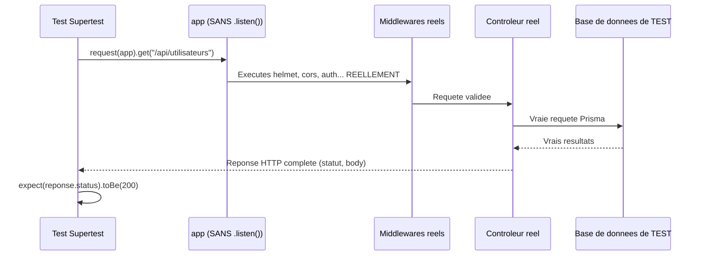

<div class="chapitre-titre-num">CHAPITRE 30</div>

# Tests d'intégration (Supertest)

<div class="encadre objectif">
<span class="encadre-titre">🎯 Objectif du chapitre</span>
Tester une API Express de bout en bout (requête HTTP réelle, middlewares, base de données de test), avec Supertest, en complément des tests unitaires du chapitre 29. À la fin de ce chapitre, tu sauras écrire des tests qui vérifient que routes, middlewares, contrôleurs et base de données fonctionnent réellement ensemble, pas seulement chaque pièce isolément.
</div>

<div class="encadre scenario">
<span class="encadre-titre">🎬 Mise en situation</span>
Tous les services d'un projet ont 90% de couverture de tests unitaires, chacun testé isolément avec des mocks. Pourtant, un bug survit en production : le middleware d'authentification est déclaré après une route sensible dans `app.js` (rappel du chapitre 14), rendant cette route accessible sans token — un problème d'assemblage, invisible pour des tests unitaires qui ne testent jamais la chaîne complète route→middleware→contrôleur. Ce chapitre construit exactement le niveau de test qui aurait révélé ce problème : les tests d'intégration, qui vérifient l'assemblage réel des pièces, pas seulement chacune séparément.
</div>

## 30.1 Test unitaire vs test d'intégration

<div class="encadre astuce">
<span class="encadre-titre">💡 Deux niveaux complémentaires, pas concurrents</span>
Un **test unitaire** (chapitre 29) isole une fonction/service de ses dépendances (mockées). Un **test d'intégration** vérifie que **plusieurs parties assemblées** fonctionnent correctement ensemble : la route, les middlewares (authentification, validation), le contrôleur, le service, et une vraie base de données (généralement une base de test dédiée). Les deux niveaux se complètent : rapide et ciblé (unitaire) vs réaliste et englobant (intégration).
</div>

| Critère | Test unitaire (chapitre 29) | Test d'intégration (ce chapitre) |
|---|---|---|
| Périmètre | Une fonction/service isolé | Route + middlewares + contrôleur + service + BDD réelle |
| Dépendances | Mockées (jest.fn()) | Réelles (vraie base de données de test) |
| Vitesse d'exécution | Très rapide (millisecondes) | Plus lent (connexion BDD réelle) |
| Ce qu'il détecte | Bugs de logique métier pure | Bugs d'assemblage (ordre des middlewares, routage, config réelle) |
| Ce qu'il NE détecte PAS | Problèmes d'intégration entre couches | Chaque cas limite individuel de la logique métier (trop lent à multiplier) |
| Exemple de bug détecté | Calcul de remise incorrect (chapitre 29) | Middleware d'authentification mal ordonné (mise en situation d'ouverture) |

<div class="encadre retenir">
<span class="encadre-titre">📌 À retenir</span>
Un projet bien testé a besoin des deux niveaux, pas d'un seul : les tests unitaires couvrent la richesse des cas limites de la logique métier à faible coût, les tests d'intégration valident que l'assemblage réel (routes, middlewares, base de données) fonctionne comme prévu — exactement le type de bug que 90% de couverture unitaire n'aurait jamais révélé dans la mise en situation d'ouverture.
</div>

## 30.2 Pourquoi séparer app.js et server.js redevient essentiel ici

Rappel du chapitre 5 : `app.js` exporte l'application Express **sans** appeler `.listen()`. Supertest peut alors envoyer des requêtes directement à cet objet `app`, **sans ouvrir de vrai port réseau**.

```
$ npm install --save-dev supertest
```

```js
// tests/integration/utilisateurs.test.js
const request = require("supertest");
const app = require("../../src/app");

describe("API Utilisateurs", () => {
  it("GET /api/utilisateurs retourne un tableau", async () => {
    const reponse = await request(app).get("/api/utilisateurs");

    expect(reponse.status).toBe(200);
    expect(Array.isArray(reponse.body)).toBe(true);
  });
});
```



<div class="encadre astuce">
<span class="encadre-titre">💡 Explication du schéma</span>
Contrairement au test unitaire (chapitre 29) où le repository est mocké, ici **toute la chaîne réelle** est exercée — exactement ce qui permet de détecter un problème d'ordre des middlewares (mise en situation d'ouverture), impossible à révéler par un test unitaire de service isolé.
</div>

## 30.3 Tester une création (POST) avec corps de requête

```js
describe("POST /api/utilisateurs", () => {
  it("crée un utilisateur avec des données valides", async () => {
    const reponse = await request(app)
      .post("/api/utilisateurs")
      .send({ nom: "Jaslin", email: "jaslin@test.com", motDePasse: "motdepasse123" });

    expect(reponse.status).toBe(201);
    expect(reponse.body.email).toBe("jaslin@test.com");
    expect(reponse.body.motDePasseHash).toBeUndefined(); // vérifie que le hash n'est JAMAIS exposé au client
  });

  it("rejette une création avec un email invalide", async () => {
    const reponse = await request(app)
      .post("/api/utilisateurs")
      .send({ nom: "Jaslin", email: "pas-un-email", motDePasse: "motdepasse123" });

    expect(reponse.status).toBe(400);
  });
});
```

## 30.4 Tester une route protégée par authentification

```js
describe("GET /api/utilisateurs/profil (protégée)", () => {
  it("refuse l'accès sans token", async () => {
    const reponse = await request(app).get("/api/utilisateurs/profil");
    expect(reponse.status).toBe(401);
  });

  it("autorise l'accès avec un token valide", async () => {
    // 1. Se connecter d'abord pour obtenir un vrai token
    const connexion = await request(app)
      .post("/api/auth/login")
      .send({ email: "jaslin@test.com", motDePasse: "motdepasse123" });

    const token = connexion.body.accessToken;

    // 2. Utiliser ce token pour accéder à la route protégée
    const reponse = await request(app)
      .get("/api/utilisateurs/profil")
      .set("Authorization", `Bearer ${token}`);

    expect(reponse.status).toBe(200);
    expect(reponse.body.email).toBe("jaslin@test.com");
  });
});
```

<div class="encadre securite">
<span class="encadre-titre">🔒 Sécurité — tester explicitement l'IDOR (rappel du chapitre 24)</span>
Un test d'intégration est l'endroit idéal pour vérifier l'absence de faille IDOR (chapitre 24) : créer deux utilisateurs distincts en base de test, et vérifier explicitement que l'un ne peut jamais accéder aux ressources de l'autre.
</div>

```js
describe("Prévention IDOR sur /api/consultations/:id", () => {
  it("un employé ne peut PAS accéder à une consultation d'un autre établissement", async () => {
    // consultationAutreEtablissementId créée en base de test, appartenant à un établissement DIFFÉRENT
    const reponse = await request(app)
      .get(`/api/consultations/${consultationAutreEtablissementId}`)
      .set("Authorization", `Bearer ${tokenEmployeEtablissementA}`);

    expect(reponse.status).toBe(403);
  });
});
```

## 30.5 Base de données de test dédiée

<div class="encadre attention">
<span class="encadre-titre">⚠️ Ne jamais faire tourner les tests d'intégration sur la base de données de production/développement</span>
Les tests d'intégration créent, modifient et suppriment réellement des données. Les exécuter sur la base de développement personnelle risquerait de la polluer avec des données de test ; sur la base de production, ce serait catastrophique. Une base de données **dédiée aux tests** (souvent nommée `nomapp_test`), configurée via une variable d'environnement séparée (`DATABASE_URL` différente en environnement `test`), est indispensable.
</div>

```js
// tests/setup.js — exécuté avant/après la suite de tests (configuré via jest.config.js)
const prisma = require("../src/config/prisma");

beforeAll(async () => {
  // S'assurer que la base de test est dans un état propre et connu avant de commencer
  await prisma.$executeRaw`TRUNCATE TABLE "Utilisateur" RESTART IDENTITY CASCADE`;
});

afterAll(async () => {
  await prisma.$disconnect(); // ferme proprement la connexion après tous les tests
});
```

```json
// package.json
"scripts": {
  "test:integration": "NODE_ENV=test jest tests/integration --setupFilesAfterEach=./tests/setup.js"
}
```

## 30.6 Nettoyer les données entre chaque test

```js
afterEach(async () => {
  // Nettoie les tables modifiées par le test précédent, pour que chaque test parte d'un état PROPRE et PRÉVISIBLE
  await prisma.utilisateur.deleteMany({ where: { email: { contains: "@test.com" } } });
});
```

<div class="encadre astuce">
<span class="encadre-titre">💡 Chaque test doit être indépendant des autres</span>
Un test qui dépend de l'ordre d'exécution ou de données laissées par un test précédent devient **fragile** et difficile à déboguer (un test échoue seulement si un autre a été exécuté avant, ou dans un ordre différent). Nettoyer systématiquement l'état entre les tests (ou utiliser des transactions annulées après chaque test) garantit leur indépendance totale.
</div>

## 30.7 Tester les cas d'erreur systématiquement

```js
describe("GET /api/utilisateurs/:id", () => {
  it("retourne 404 pour un id inexistant", async () => {
    const reponse = await request(app).get("/api/utilisateurs/999999");
    expect(reponse.status).toBe(404);
  });

  it("retourne 400 pour un id au format invalide", async () => {
    const reponse = await request(app).get("/api/utilisateurs/pas-un-id");
    expect(reponse.status).toBe(400);
  });
});
```

<div class="encadre astuce">
<span class="encadre-titre">💡 Ne pas tester QUE le "chemin heureux"</span>
Un piège fréquent : ne tester que les cas où tout se passe bien (données valides, ressource existante). Les cas d'erreur (données invalides, ressource inexistante, absence d'authentification) sont **au moins aussi importants** à couvrir, car ce sont souvent eux qui révèlent les vraies failles de robustesse d'une API.
</div>

## Atelier — Attraper le bug de la mise en situation d'ouverture

<div class="encadre exercice">
<span class="encadre-titre">🛠️ Atelier 30 — Un test d'intégration qui aurait empêché l'incident</span>

**Objectif** : reproduire le problème d'ordre des middlewares de la mise en situation d'ouverture, et démontrer qu'un test d'intégration l'aurait détecté.

**Préparation** : une route `/admin/donnees-sensibles` protégée par un middleware `authentifier`.

**Étapes détaillées** :
1. Écris un test Supertest vérifiant que `GET /admin/donnees-sensibles` sans en-tête `Authorization` retourne bien 401.
2. Dans `app.js`, déplace volontairement la déclaration de cette route **avant** le middleware `authentifier` (reproduisant le bug de la mise en situation d'ouverture).
3. Relance le test : il doit maintenant échouer, révélant que la route est devenue accessible sans authentification.
4. Corrige l'ordre dans `app.js`, relance le test : il doit repasser.

**Validation** : le test doit échouer clairement à l'étape 3, avant toute correction — la preuve qu'il détecte réellement ce type de régression d'assemblage.

**Résultat attendu** : la démonstration concrète qu'un test d'intégration couvre une catégorie de bugs qu'aucun test unitaire ne peut révéler, exactement le cas de la mise en situation d'ouverture.

**Dépannage** : si le test ne détecte pas le problème, vérifie qu'il teste bien l'absence de token (pas seulement la présence d'un token valide).

**Nettoyage** : aucun, ce test devrait rester dans la suite de tests du projet.
</div>

## Erreurs fréquentes

<div class="encadre attention">
<span class="encadre-titre">⚠️ Erreur n°1 — Oublier NODE_ENV=test, exécuter les tests contre la mauvaise base</span>
Sans variable d'environnement distincte activée explicitement pendant les tests, `ConfigDB` (chapitre 12) pourrait se connecter à la base de développement par défaut — toujours vérifier explicitement quelle base de données est ciblée avant de lancer une suite de tests qui modifie des données.
</div>

<div class="encadre attention">
<span class="encadre-titre">⚠️ Erreur n°2 — Ne tester que le chemin heureux, jamais l'assemblage de sécurité</span>
Exactement le piège de la mise en situation d'ouverture — une suite de tests concentrée uniquement sur "est-ce que la fonctionnalité marche" sans jamais tester "est-ce que la protection fonctionne réellement une fois assemblée".
</div>

## Débogage

<div class="encadre attention">
<span class="encadre-titre">🩺 Symptôme : les tests d'intégration échouent de façon incohérente selon l'ordre d'exécution</span>

- **Cause probable** : des tests qui dépendent de données laissées par un test précédent (absence de nettoyage entre tests, section 30.6).
- **Solution** : ajouter un `afterEach` ou `beforeEach` qui remet la base de test dans un état propre et prévisible.
</div>

## En entreprise

- **Tests d'intégration en CI, avant chaque déploiement** : la quasi-totalité des pipelines CI/CD (chapitre 39) exécutent la suite de tests d'intégration contre une base de test éphémère (souvent un conteneur Docker recréé à chaque exécution), garantissant un environnement toujours propre.
- **Couverture des scénarios de sécurité en intégration** : les tests d'IDOR, de RBAC et d'ordre de middlewares sont typiquement des tests d'intégration, pas unitaires — ils vérifient un comportement qui n'existe qu'une fois toutes les pièces assemblées.

## Entretien technique

<div class="encadre exercice">
<span class="encadre-titre">💼 Questions fréquemment posées en entretien</span>

**Q1. "Quelle est la différence entre un test unitaire et un test d'intégration ?"**
Réponse attendue : le test unitaire isole une unité de code (souvent un service) avec des dépendances mockées ; le test d'intégration exerce l'assemblage réel de plusieurs couches (route, middlewares, contrôleur, vraie base de données de test).

**Q2. "Pourquoi tester une route protégée sans token, en plus de la tester avec un token valide ?"**
Réponse attendue : pour vérifier que la protection fonctionne réellement dans les deux sens — un token valide donne accès, l'absence de token le refuse — exactement le type de bug d'assemblage (middleware mal ordonné) qu'un test unitaire ne peut jamais révéler.

**Q3. "Pourquoi une base de données de test dédiée est-elle indispensable ?"**
Réponse attendue : les tests d'intégration créent et suppriment réellement des données ; les exécuter contre la base de développement ou de production risquerait de la polluer ou de la corrompre.
</div>

## Optimisation, sécurité et maintenabilité

<div class="encadre securite">
<span class="encadre-titre">🔒 Sécurité</span>
Considérer les tests d'intégration comme la ligne de défense privilégiée contre les régressions de sécurité d'assemblage (ordre des middlewares, IDOR, RBAC) — exactement les catégories de bugs qu'un test unitaire isolé ne peut structurellement pas détecter.
</div>

<div class="encadre bonne-pratique">
<span class="encadre-titre">✅ Maintenabilité</span>
Garder les tests d'intégration indépendants les uns des autres (section 30.6) — un test qui échoue à cause d'un autre test précédent, plutôt qu'à cause d'un vrai bug, sape la confiance de toute l'équipe dans la suite de tests.
</div>

## Résumé du chapitre

- Supertest envoie de vraies requêtes HTTP à l'objet `app` exporté (sans `.listen()`), testant routes, middlewares et contrôleurs ensemble.
- Les tests d'intégration détectent des catégories de bugs (ordre des middlewares, IDOR, RBAC) invisibles aux tests unitaires isolés.
- Une base de données de test **dédiée**, nettoyée entre chaque test, garantit des résultats reproductibles et indépendants.
- Tester systématiquement les cas d'erreur (données invalides, ressource inexistante, absence d'authentification), pas seulement le chemin heureux.
- Toujours vérifier explicitement l'environnement ciblé (`NODE_ENV=test`) avant d'exécuter des tests qui modifient des données.

## Quiz

<div class="encadre exercice">
<span class="encadre-titre">📝 QCM</span>

1. Que teste un test d'intégration que ne teste pas un test unitaire ?
   - a) La logique métier pure isolée
   - b) L'assemblage réel des couches (routes, middlewares, contrôleurs, BDD)
   - c) La syntaxe JavaScript
   - d) Rien de différent

2. Pourquoi utiliser une base de données de test dédiée ?
   - a) Pour des raisons de performance uniquement
   - b) Pour éviter de polluer/corrompre les bases de développement ou production
   - c) Ce n'est jamais nécessaire
   - d) Supertest l'exige techniquement

3. Un test qui dépend de données laissées par un test précédent est-il une bonne pratique ?
   - a) Oui, cela accélère les tests
   - b) Non, chaque test devrait être indépendant
   - c) Seulement pour les tests de sécurité
   - d) Cela n'a aucune importance

**Corrigé** : 1-b, 2-b, 3-b.
</div>

<div class="encadre exercice">
<span class="encadre-titre">📝 Vrai ou Faux</span>

1. Supertest nécessite d'ouvrir un vrai port réseau avec .listen(). — **Faux** (il utilise directement l'objet app exporté).
2. Un test d'intégration peut détecter un problème d'ordre des middlewares. — **Vrai**.
3. Tester uniquement le chemin heureux est suffisant pour une API robuste. — **Faux**.
</div>

<div class="encadre exercice">
<span class="encadre-titre">📝 Question ouverte</span>

Pourquoi 90% de couverture de tests unitaires n'a-t-il pas empêché le bug de la mise en situation d'ouverture ?

**Corrigé** : les tests unitaires testaient chaque service isolément, avec des dépendances mockées — ils n'exercent jamais la chaîne complète route→middleware→contrôleur telle qu'assemblée dans `app.js`. Le bug (middleware d'authentification déclaré après la route) est un problème d'**assemblage**, pas de logique métier interne à un service — une catégorie de bug que seul un test d'intégration, exerçant la vraie chaîne de middlewares via une requête HTTP réelle, peut révéler.
</div>

## Exercices

<div class="encadre exercice">
<span class="encadre-titre">📝 Exercice 30.1</span>

Écris un test d'intégration pour `DELETE /api/utilisateurs/:id`, vérifiant qu'un admin peut supprimer un utilisateur (204), mais qu'un utilisateur normal reçoit une erreur 403.
</div>

**Corrigé :**
```js
describe("DELETE /api/utilisateurs/:id", () => {
  it("un ADMIN peut supprimer un utilisateur", async () => {
    const reponse = await request(app)
      .delete(`/api/utilisateurs/${utilisateurTestId}`)
      .set("Authorization", `Bearer ${tokenAdmin}`);
    expect(reponse.status).toBe(204);
  });

  it("un UTILISATEUR normal ne peut pas supprimer un utilisateur", async () => {
    const reponse = await request(app)
      .delete(`/api/utilisateurs/${utilisateurTestId}`)
      .set("Authorization", `Bearer ${tokenUtilisateurNormal}`);
    expect(reponse.status).toBe(403);
  });
});
```

## Checklist de fin de chapitre

<ul class="checklist">
<li>☐ Je comprends la différence entre test unitaire et test d'intégration.</li>
<li>☐ Je sais écrire un test Supertest pour une route protégée par authentification.</li>
<li>☐ J'utilise une base de données de test dédiée, jamais la base de développement/production.</li>
<li>☐ Je teste systématiquement les cas d'erreur, pas seulement le chemin heureux.</li>
<li>☐ Je teste explicitement l'absence de faille IDOR sur les routes manipulant des ressources par id.</li>
</ul>

## FAQ

<dl class="faq">
<dt>Faut-il choisir entre tests unitaires et tests d'intégration ?</dt>
<dd>Non, les deux sont complémentaires (section 30.1) : les tests unitaires couvrent la richesse des cas limites de la logique métier à faible coût, les tests d'intégration valident l'assemblage réel — un projet bien testé a besoin des deux.</dd>

<dt>Comment gérer les tests d'intégration en CI si la base de données n'existe pas sur le runner ?</dt>
<dd>La plupart des pipelines CI (chapitre 39) démarrent un conteneur Docker de base de données éphémère spécifiquement pour la durée des tests, garantissant un environnement toujours propre et reproductible.</dd>

<dt>Les tests d'intégration remplacent-ils les tests manuels avant une mise en production ?</dt>
<dd>Ils réduisent fortement le besoin de tests manuels répétitifs, mais ne les remplacent pas totalement — certains aspects (expérience utilisateur visuelle, par exemple) restent mieux vérifiés manuellement ou via des tests E2E dédiés.</dd>
</dl>

## Références et pour aller plus loin

- Documentation Supertest : [https://github.com/ladjs/supertest](https://github.com/ladjs/supertest)
- Documentation Jest sur les hooks (beforeAll, afterEach...) : [https://jestjs.io/docs/setup-teardown](https://jestjs.io/docs/setup-teardown)

*Ceci clôt la Partie 7 (tests). Chapitre suivant : la connexion à PostgreSQL, première étape de la Partie 8 (bases de données et ORM).*
