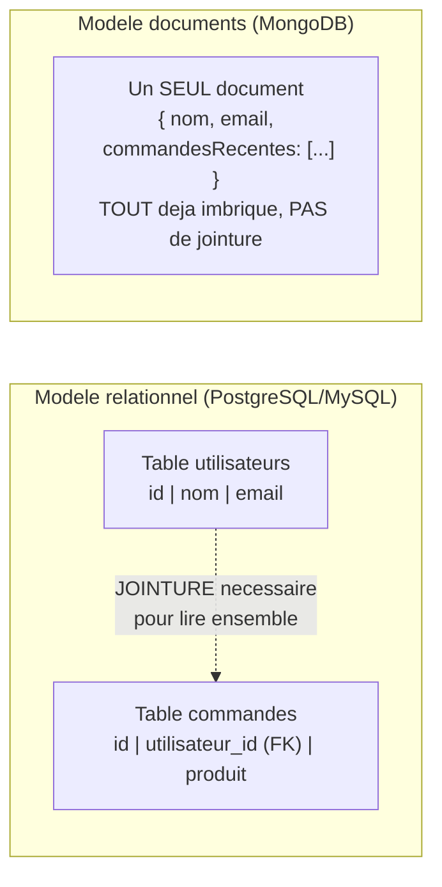

<div class="chapitre-titre-num">CHAPITRE 33</div>

# Connexion à MongoDB

<div class="encadre objectif">
<span class="encadre-titre">🎯 Objectif du chapitre</span>
Se connecter à MongoDB avec le driver natif, comprendre le modèle de données orienté documents, et savoir quand ce modèle convient mieux qu'une base relationnelle. À la fin de ce chapitre, tu sauras juger, pour un projet donné, si le modèle documents ou le modèle relationnel correspond réellement aux données à représenter.
</div>

<div class="encadre scenario">
<span class="encadre-titre">🎬 Mise en situation</span>
Une startup te demande de reprendre le développement d'une application de blog communautaire déjà commencée sur MongoDB par un développeur parti. Chaque article contient ses commentaires **imbriqués directement** dans le même document. Le problème surgit dès que le nombre de commentaires d'un article populaire dépasse plusieurs milliers : le document devient énorme, chaque lecture de l'article charge tous ces commentaires même quand seuls les 10 premiers sont affichés, et MongoDB impose une limite stricte de 16 Mo par document — un article peut littéralement devenir impossible à sauvegarder. Ce chapitre construit les bases pour comprendre pourquoi ce choix de modélisation a mal vieilli, et comment MongoDB aurait dû représenter cette relation.
</div>

## 33.1 Rappel : relationnel vs NoSQL orienté documents

Contrairement à PostgreSQL/MySQL (chapitres 31-32), MongoDB stocke des **documents** (structures proches du JSON), regroupés en **collections** (l'équivalent approximatif d'une table), sans schéma rigide imposé par la base elle-même.

```json
// Un document MongoDB typique
{
  "_id": "64f1a2b3c4d5e6f7a8b9c0d1",
  "nom": "Jaslin",
  "email": "jaslin@mail.com",
  "adresse": {
    "ville": "Pignon",
    "pays": "Haïti"
  },
  "commandesRecentes": [
    { "produit": "Riz", "quantite": 2 },
    { "produit": "Savon", "quantite": 1 }
  ]
}
```



<div class="encadre astuce">
<span class="encadre-titre">💡 Explication du schéma</span>
Le modèle relationnel sépare les données en tables reliées par des clés étrangères, assemblées à la lecture via une jointure. Le modèle documents imbrique directement les données liées dans un seul document, lu en une seule opération — rapide et simple **tant que la relation imbriquée reste bornée**. C'est exactement cette limite que la mise en situation d'ouverture illustre : des commentaires imbriqués sans borne finissent par faire exploser la taille du document.
</div>

<div class="encadre astuce">
<span class="encadre-titre">💡 L'avantage principal : des données imbriquées naturellement</span>
Contrairement au modèle relationnel qui nécessiterait des tables séparées (`commandes`, `lignes_commande`) reliées par des clés étrangères et des jointures, MongoDB permet de stocker des données **imbriquées** directement dans un seul document — pratique pour des structures naturellement hiérarchiques, lues ensemble la plupart du temps, et de taille **bornée**.
</div>

## 33.2 Installer le driver MongoDB

```
$ npm install mongodb
```

```js
// src/config/db.js
const { MongoClient } = require("mongodb");

const client = new MongoClient(process.env.MONGODB_URI);
let db;

async function connecter() {
  await client.connect();
  db = client.db(process.env.MONGODB_DB_NAME);
  console.log("Connecté à MongoDB");
  return db;
}

function obtenirDb() {
  if (!db) throw new Error("La base de données n'est pas encore connectée");
  return db;
}

module.exports = { connecter, obtenirDb };
```

```js
// server.js
const { connecter } = require("./src/config/db");

async function demarrer() {
  await connecter(); // se connecter AVANT de démarrer le serveur HTTP
  const app = require("./src/app");
  app.listen(process.env.PORT, () => console.log("Serveur démarré"));
}

demarrer();
```

## 33.3 Opérations CRUD avec le driver natif

```js
const { obtenirDb } = require("../config/db");
const { ObjectId } = require("mongodb"); // nécessaire pour convertir une chaîne d'id en vrai ObjectId MongoDB

async function creer(utilisateur) {
  const resultat = await obtenirDb().collection("utilisateurs").insertOne(utilisateur);
  return { _id: resultat.insertedId, ...utilisateur };
}

async function trouverParId(id) {
  return obtenirDb().collection("utilisateurs").findOne({ _id: new ObjectId(id) });
}

async function trouverParEmail(email) {
  return obtenirDb().collection("utilisateurs").findOne({ email });
}

async function listerTous() {
  return obtenirDb().collection("utilisateurs").find().toArray(); // .find() retourne un CURSEUR, .toArray() le matérialise
}

async function modifier(id, donnees) {
  const resultat = await obtenirDb().collection("utilisateurs").updateOne(
    { _id: new ObjectId(id) },
    { $set: donnees } // $set : ne modifie QUE les champs fournis, laisse les autres intacts
  );
  return resultat.modifiedCount > 0;
}

async function supprimer(id) {
  const resultat = await obtenirDb().collection("utilisateurs").deleteOne({ _id: new ObjectId(id) });
  return resultat.deletedCount > 0;
}
```

<div class="encadre attention">
<span class="encadre-titre">⚠️ _id n'est jamais une simple chaîne de caractères, mais un ObjectId</span>

```js
// ❌ Une chaîne brute ne correspondra JAMAIS à un _id stocké (qui est un ObjectId, un type binaire spécifique)
await db.collection("utilisateurs").findOne({ _id: "64f1a2b3c4d5e6f7a8b9c0d1" }); // retourne toujours null !
```
```js
// ✅ Toujours convertir explicitement via new ObjectId(...)
await db.collection("utilisateurs").findOne({ _id: new ObjectId("64f1a2b3c4d5e6f7a8b9c0d1") });
```
</div>

## 33.4 Requêtes avec opérateurs MongoDB

```js
// Trouver tous les produits avec un stock supérieur à 0 ET une catégorie précise
await db.collection("produits").find({
  stock: { $gt: 0 },
  categorie: "alimentaire",
}).toArray();

// Trouver un utilisateur avec l'un OU l'autre email
await db.collection("utilisateurs").find({
  $or: [{ email: "jaslin@mail.com" }, { email: "marie@mail.com" }],
}).toArray();

// Tri et pagination (rappel du chapitre 21)
await db.collection("produits")
  .find({ categorie: "alimentaire" })
  .sort({ prix: -1 }) // -1 : décroissant, 1 : croissant
  .skip(20)
  .limit(10)
  .toArray();
```

## 33.5 Index MongoDB

```js
await db.collection("utilisateurs").createIndex({ email: 1 }, { unique: true });
```

<div class="encadre astuce">
<span class="encadre-titre">💡 Même logique que les index SQL, rappel du manuel Java de ce même auteur</span>
Un index MongoDB accélère les recherches sur le champ indexé, exactement comme un index SQL classique — `{ unique: true }` garantit en plus qu'aucun doublon n'est accepté sur ce champ, imposant une contrainte d'unicité que le schéma flexible de MongoDB n'impose sinon jamais nativement.
</div>

## 33.6 Le piège de l'absence de schéma imposé

<div class="encadre attention">
<span class="encadre-titre">⚠️ MongoDB n'impose AUCUNE structure par défaut, contrairement à SQL</span>

```js
// Ces deux documents peuvent coexister dans la MÊME collection, sans erreur :
await db.collection("utilisateurs").insertOne({ nom: "Jaslin", email: "jaslin@mail.com" });
await db.collection("utilisateurs").insertOne({ nomComplet: "Marie Pierre" }); // structure TOTALEMENT différente !
```
Sans discipline (ou sans un ODM comme Mongoose, chapitre 36, qui impose un schéma **côté application**), rien n'empêche des documents de structures incohérentes de coexister dans la même collection — un risque réel de bugs silencieux si le code suppose une structure uniforme.
</div>

## 33.7 Quand imbriquer, et quand référencer plutôt qu'imbriquer

<div class="encadre securite">
<span class="encadre-titre">🔒 Fiabilité — la vraie leçon de la mise en situation d'ouverture</span>
MongoDB permet l'imbrication, mais ne l'impose jamais comme unique solution. Pour une relation **non bornée** (des commentaires qui peuvent croître indéfiniment), la bonne pratique est de **référencer** l'article depuis une collection `commentaires` séparée (via un `articleId`), exactement comme une clé étrangère relationnelle — pas de tout imbriquer par réflexe.
</div>

```js
// ❌ Commentaires imbriqués sans borne : exactement le piège de la mise en situation d'ouverture
{
  "_id": "...",
  "titre": "Mon article",
  "commentaires": [ /* peut grossir indéfiniment, jusqu'à depasser 16 Mo */ ]
}

// ✅ Commentaires dans une collection SÉPARÉE, référencés par articleId
// Collection "articles"
{ "_id": "abc123", "titre": "Mon article" }

// Collection "commentaires" (une collection à part, paginee independamment)
{ "_id": "...", "articleId": "abc123", "texte": "Super article !" }
```

```js
async function listerCommentaires(articleId, page = 1, limite = 20) {
  return db.collection("commentaires")
    .find({ articleId })
    .skip((page - 1) * limite)
    .limit(limite)
    .toArray(); // pagination independante, jamais tout charge d'un coup (rappel du chapitre 21)
}
```

<div class="encadre retenir">
<span class="encadre-titre">📌 À retenir</span>
Règle de décision : relation **bornée et lue ensemble la plupart du temps** (adresse d'un utilisateur, articles d'une commande figée) → imbriquer. Relation **non bornée ou consultée indépendamment** (commentaires d'un article populaire, historique complet d'actions) → référencer dans une collection séparée, avec pagination — exactement la correction nécessaire dans la mise en situation d'ouverture.
</div>

## 33.8 Quand choisir MongoDB plutôt qu'une base relationnelle

<div class="encadre astuce">
<span class="encadre-titre">💡 Rappel du chapitre 24 du manuel Java de ce même auteur, appliqué ici</span>
MongoDB convient bien à des données **naturellement hiérarchiques et peu relationnelles** entre elles (profils utilisateurs avec préférences imbriquées, catalogues de contenu, logs d'événements), ou à des besoins de **flexibilité de schéma** (structure évolutive rapidement). Pour des données **fortement relationnelles** avec des contraintes d'intégrité strictes (comptes bancaires, stocks avec contraintes de non-négativité, systèmes de facturation), le modèle relationnel (PostgreSQL/MySQL) reste généralement préférable — exactement le choix fait pour le projet final de ce manuel (chapitre 41), une API de gestion hospitalière aux données fortement structurées et relationnelles.
</div>

## Atelier — Corriger le blog de la mise en situation

<div class="encadre exercice">
<span class="encadre-titre">🛠️ Atelier 33 — Migrer des commentaires imbriqués vers une collection référencée</span>

**Objectif** : reproduire puis corriger le problème de modélisation de la mise en situation d'ouverture.

**Préparation** : une collection `articles` de test avec quelques documents contenant un tableau `commentaires` imbriqué de taille croissante (simule le blog hérité).

**Étapes détaillées** :
1. Insère un article avec un tableau `commentaires` contenant plusieurs centaines d'entrées simulées, et mesure la taille du document (`Object.bindata` ou simplement `JSON.stringify(document).length`).
2. Crée une collection `commentaires` séparée, migre les commentaires existants avec un `articleId` référençant l'article d'origine.
3. Retire le tableau `commentaires` du document article.
4. Réécris `listerCommentaires(articleId, page, limite)` (section 33.7) pour lire depuis la nouvelle collection, avec pagination.

**Validation** : lire un article ne doit plus jamais charger l'intégralité de ses commentaires ; seule la page demandée est chargée, quel que soit le nombre total de commentaires.

**Résultat attendu** : exactement la correction qui aurait évité que l'application ne devienne inutilisable sur les articles populaires du blog de la mise en situation d'ouverture.

**Dépannage** : si la migration semble perdre des commentaires, vérifie que chaque commentaire migré porte bien le bon `articleId` correspondant à son article d'origine.

**Nettoyage** : supprime les données de test générées.
</div>

## Erreurs fréquentes

<div class="encadre attention">
<span class="encadre-titre">⚠️ Erreur n°1 — Oublier .toArray() sur un curseur find()</span>

```js
const resultat = await db.collection("produits").find({}); // ❌ resultat est un CURSEUR, pas un tableau !
console.log(resultat.length); // undefined
```
```js
const produits = await db.collection("produits").find({}).toArray(); // ✅ matérialise le curseur en tableau
```
</div>

<div class="encadre attention">
<span class="encadre-titre">⚠️ Erreur n°2 — Imbriquer une relation non bornée par réflexe</span>
Exactement le piège de la mise en situation d'ouverture — imbriquer semble plus simple au départ, mais devient un problème structurel dès que la relation grandit sans limite prévisible.
</div>

## Débogage

<div class="encadre attention">
<span class="encadre-titre">🩺 Symptôme : "BSONObj size ... is invalid" ou document trop volumineux</span>

- **Cause** : un document a dépassé (ou approche) la limite de 16 Mo de MongoDB, typiquement à cause d'une relation imbriquée non bornée (erreur fréquente n°2).
- **Solution** : migrer la relation concernée vers une collection séparée référencée (section 33.7).
</div>

## En entreprise

- **Modélisation "schema-first" même sans schéma imposé** : de nombreuses équipes professionnelles conçoivent malgré tout un schéma de données documenté avant de coder, même si MongoDB ne l'impose pas techniquement — une discipline volontaire qui évite exactement le piège de la section 33.6.
- **Migration imbriqué → référencé, un motif récurrent** : le scénario de la mise en situation d'ouverture (commentaires, logs, historiques qui grandissent trop) est l'une des migrations MongoDB les plus fréquemment rencontrées en entreprise, souvent découverte tardivement comme dans cette mise en situation.

## Entretien technique

<div class="encadre exercice">
<span class="encadre-titre">💼 Questions fréquemment posées en entretien</span>

**Q1. "Quand imbriquer des données dans MongoDB, et quand les référencer ?"**
Réponse attendue : imbriquer pour une relation bornée, lue ensemble la plupart du temps ; référencer (collection séparée + id) pour une relation non bornée ou consultée indépendamment, pour éviter qu'un document ne devienne trop volumineux.

**Q2. "Pourquoi _id doit-il être converti en ObjectId avant une requête ?"**
Réponse attendue : `_id` est stocké comme un type binaire `ObjectId`, pas une chaîne de caractères ; comparer directement à une chaîne brute ne trouve jamais de correspondance.

**Q3. "Dans quel cas préférerais-tu MongoDB à PostgreSQL pour un nouveau projet ?"**
Réponse attendue : pour des données naturellement hiérarchiques et peu relationnelles, ou un besoin de flexibilité de schéma important ; pour des données fortement relationnelles avec des contraintes d'intégrité strictes, le modèle relationnel reste généralement préférable.
</div>

## Optimisation, sécurité et maintenabilité

<div class="encadre performance">
<span class="encadre-titre">🚀 Performance</span>
Un document trop volumineux (relation imbriquée non bornée) ralentit chaque lecture, même quand seule une petite partie de son contenu est réellement nécessaire — exactement le symptôme de la mise en situation d'ouverture.
</div>

<div class="encadre bonne-pratique">
<span class="encadre-titre">✅ Maintenabilité</span>
Documenter le schéma de données attendu de chaque collection, même sans validation MongoDB stricte activée — un schéma implicite non documenté devient vite une source de confusion pour toute personne rejoignant le projet.
</div>

## Résumé du chapitre

- MongoDB stocke des documents JSON-like en collections, permettant des structures imbriquées naturelles, sans jointures.
- `_id` est un `ObjectId`, jamais une simple chaîne — toujours convertir explicitement via `new ObjectId(...)`.
- `.find()` retourne un curseur ; `.toArray()` le matérialise en tableau JavaScript exploitable.
- Imbriquer convient aux relations bornées ; référencer (collection séparée) convient aux relations non bornées, sous peine de documents trop volumineux.
- Sans discipline ou ODM (Mongoose, chapitre 36), MongoDB n'impose aucune cohérence de structure entre documents d'une même collection.
- Préférer MongoDB pour des données hiérarchiques peu relationnelles ; préférer le relationnel pour des données à fortes contraintes d'intégrité.

## Quiz

<div class="encadre exercice">
<span class="encadre-titre">📝 QCM</span>

1. Que retourne .find() avant d'appeler .toArray() ?
   - a) Un tableau vide
   - b) Un curseur
   - c) Une erreur
   - d) Un objet JSON direct

2. Quand imbriquer une relation dans un document MongoDB ?
   - a) Toujours, c'est la seule approche possible
   - b) Pour une relation bornée, lue ensemble la plupart du temps
   - c) Jamais, il faut toujours référencer
   - d) Uniquement pour les nombres

3. Quelle limite peut poser problème avec des relations imbriquées non bornées ?
   - a) Aucune limite n'existe
   - b) La limite de 16 Mo par document
   - c) Une limite de 10 champs par document
   - d) Une limite de 100 documents par collection

**Corrigé** : 1-b, 2-b, 3-b.
</div>

<div class="encadre exercice">
<span class="encadre-titre">📝 Vrai ou Faux</span>

1. MongoDB impose un schéma strict par défaut, comme PostgreSQL. — **Faux**.
2. _id peut être comparé directement à une chaîne de caractères brute. — **Faux** (nécessite new ObjectId(...)).
3. Une relation non bornée devrait être référencée plutôt qu'imbriquée. — **Vrai**.
</div>

<div class="encadre exercice">
<span class="encadre-titre">📝 Question ouverte</span>

Pourquoi le développeur d'origine du blog de la mise en situation d'ouverture a-t-il probablement choisi d'imbriquer les commentaires, et à quel moment cette décision a-t-elle cessé d'être raisonnable ?

**Corrigé** : imbriquer semblait raisonnable au départ — la plupart des articles n'ont que quelques commentaires, et les lire ensemble en une seule requête est effectivement plus simple et plus rapide dans ce cas. La décision a cessé d'être raisonnable dès qu'un article est devenu suffisamment populaire pour accumuler des milliers de commentaires : la relation, initialement perçue comme bornée dans la pratique, s'est révélée en réalité non bornée dans le pire des cas — exactement le type d'hypothèse de modélisation qu'il faut challenger dès la conception, pas seulement après l'incident.
</div>

## Exercices

<div class="encadre exercice">
<span class="encadre-titre">📝 Exercice 33.1</span>

Écris une fonction `rechercherProduitsParNom(motCle)` utilisant une expression régulière MongoDB pour une recherche partielle insensible à la casse sur le champ `nom`.
</div>

**Corrigé :**
```js
async function rechercherProduitsParNom(motCle) {
  return obtenirDb().collection("produits").find({
    nom: { $regex: motCle, $options: "i" }, // "i" : insensible à la casse
  }).toArray();
}
```

## Checklist de fin de chapitre

<ul class="checklist">
<li>☐ Je comprends le modèle documents/collections face au modèle relationnel.</li>
<li>☐ Je sais réaliser les opérations CRUD de base avec le driver MongoDB natif.</li>
<li>☐ Je pense systématiquement à convertir un id en ObjectId.</li>
<li>☐ Je sais décider entre imbriquer et référencer une relation.</li>
<li>☐ Je sais juger si MongoDB ou le relationnel convient mieux à un projet donné.</li>
</ul>

## FAQ

<dl class="faq">
<dt>MongoDB peut-il faire des "jointures" comme SQL ?</dt>
<dd>Oui, via l'opérateur `$lookup` dans une pipeline d'agrégation — techniquement possible mais généralement moins performant qu'une jointure SQL native, et souvent le signe qu'un modèle relationnel aurait été plus adapté au besoin.</dd>

<dt>Faut-il toujours utiliser Mongoose plutôt que le driver natif ?</dt>
<dd>Pas obligatoirement — le driver natif (ce chapitre) offre un contrôle plus direct et moins de surcharge ; Mongoose (chapitre 36) apporte un schéma et une validation côté application, utile pour la plupart des projets d'équipe.</dd>

<dt>Comment savoir si mes documents risquent de devenir trop volumineux ?</dt>
<dd>Se poser la question dès la conception : "ce tableau imbriqué a-t-il une taille naturellement bornée, ou pourrait-il croître indéfiniment avec l'usage réel de l'application ?" — exactement la question qui aurait évité l'incident de la mise en situation d'ouverture.</dd>
</dl>

## Références et pour aller plus loin

- Documentation MongoDB Node.js Driver : [https://www.mongodb.com/docs/drivers/node/current/](https://www.mongodb.com/docs/drivers/node/current/)
- Guide de modélisation de données MongoDB : [https://www.mongodb.com/docs/manual/data-modeling/](https://www.mongodb.com/docs/manual/data-modeling/)

*Chapitre suivant : Prisma, l'ORM moderne qui simplifie considérablement le travail avec PostgreSQL/MySQL.*
