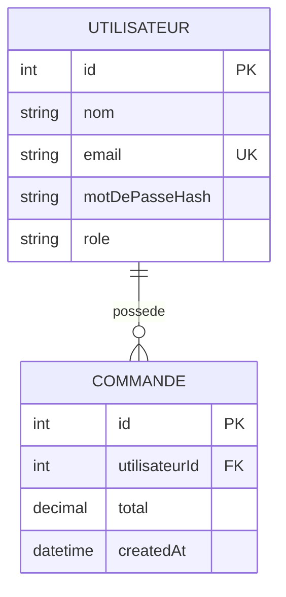
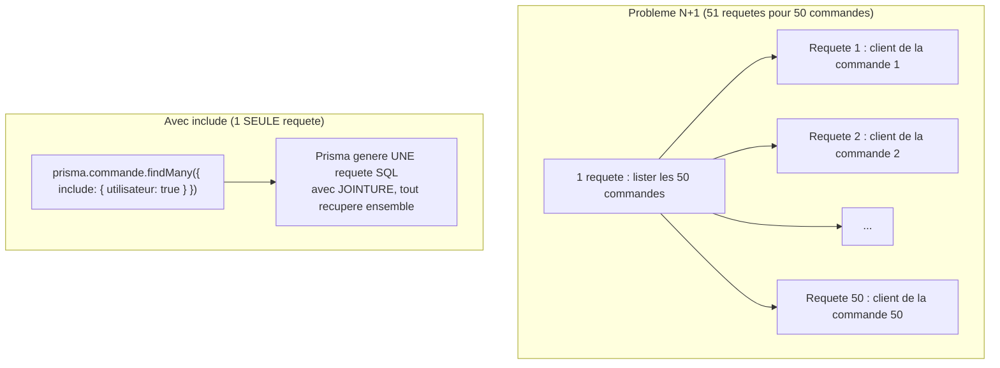

<div class="chapitre-titre-num">CHAPITRE 34</div>

# ORM Prisma

<div class="encadre objectif">
<span class="encadre-titre">🎯 Objectif du chapitre</span>
Comprendre ce qu'un ORM automatise par rapport au SQL brut des chapitres 31-32, configurer Prisma, définir un schéma, gérer les migrations, et effectuer des opérations CRUD avec relations. À la fin de ce chapitre, tu sauras reconnaître et éviter le problème de performance le plus classique des ORM : le N+1.
</div>

<div class="encadre scenario">
<span class="encadre-titre">🎬 Mise en situation</span>
Un tableau de bord affichant 50 commandes avec le nom du client de chacune met soudainement plus de 2 secondes à charger, alors qu'il était instantané en développement avec seulement 3 commandes de test. En activant les logs SQL de Prisma, tu découvres **51 requêtes distinctes** exécutées pour cette seule page : une pour lister les commandes, puis une par commande pour récupérer son client. Ce chapitre construit exactement la compréhension du problème (le "N+1") et l'outil Prisma (`include`) qui le résout en une seule requête, quel que soit le nombre de commandes affichées.
</div>

## 34.1 Ce qu'un ORM automatise

Rappel des chapitres 31-32 : le mapping manuel `resultat.rows[0]` → objet JavaScript, écrit à la main pour chaque requête, devient répétitif. Un **ORM** (*Object-Relational Mapping*) génère ce mapping automatiquement, à partir d'un schéma déclaré une seule fois.

<div class="encadre astuce">
<span class="encadre-titre">💡 Prisma : l'ORM moderne de référence pour Node.js/TypeScript</span>
Contrairement à Sequelize (chapitre 35, plus ancien, orienté classes), **Prisma** génère un client entièrement typé à partir d'un schéma déclaratif dédié (`schema.prisma`), avec une syntaxe de requêtes moderne et une gestion de migrations intégrée — devenu le choix par défaut pour un nouveau projet Node.js relationnel.
</div>

## 34.2 Installation et initialisation

```
$ npm install prisma --save-dev
$ npm install @prisma/client
$ npx prisma init
```

```
Création de :
  prisma/schema.prisma   ← définit le schéma de données
  .env                    ← contient DATABASE_URL
```

## 34.3 Le schéma Prisma

```prisma
// prisma/schema.prisma
generator client {
  provider = "prisma-client-js"
}

datasource db {
  provider = "postgresql" // ou "mysql", "mongodb"...
  url      = env("DATABASE_URL")
}

model Utilisateur {
  id             Int      @id @default(autoincrement())
  nom            String
  email          String   @unique
  motDePasseHash String
  role           Role     @default(UTILISATEUR)
  commandes      Commande[] // relation "un-à-plusieurs" : un utilisateur a plusieurs commandes
  createdAt      DateTime @default(now())
}

model Commande {
  id            Int         @id @default(autoincrement())
  utilisateur   Utilisateur @relation(fields: [utilisateurId], references: [id])
  utilisateurId Int
  total         Decimal
  createdAt     DateTime    @default(now())
}

enum Role {
  UTILISATEUR
  ADMIN
}
```



<div class="encadre astuce">
<span class="encadre-titre">💡 Explication du schéma</span>
Ce diagramme entité-relation traduit visuellement le fichier `schema.prisma` : un `Utilisateur` possède zéro, une ou plusieurs `Commande` (relation `||--o{`), chaque commande référence exactement un utilisateur via `utilisateurId` — la clé étrangère explicitement déclarée dans le modèle Prisma.
</div>

<div class="encadre astuce">
<span class="encadre-titre">💡 Un seul fichier décrit modèles, relations ET base de données ciblée</span>
Contrairement au SQL manuel (chapitres 24-25 du manuel Java de ce même auteur, ou l'écriture manuelle de `CREATE TABLE`), le schéma Prisma décrit la structure de façon **déclarative et lisible**, générant ensuite automatiquement les migrations SQL correspondantes.
</div>

## 34.4 Migrations : appliquer le schéma à la base de données

```
$ npx prisma migrate dev --name init
```

```
Applying migration `20260705120000_init`

The following migration(s) have been created and applied:

migrations/
  └─ 20260705120000_init/
    └─ migration.sql
```

<div class="encadre astuce">
<span class="encadre-titre">💡 prisma migrate dev vs prisma migrate deploy</span>
`migrate dev` (développement) génère un nouveau fichier de migration SQL à partir des changements du schéma, l'applique, et régénère le client Prisma. `migrate deploy` (production, chapitre 39) applique uniquement les migrations **déjà générées et commitées**, sans en créer de nouvelles — jamais utiliser `migrate dev` directement en production.
</div>

## 34.5 Le client Prisma généré

```js
// src/config/prisma.js
const { PrismaClient } = require("@prisma/client");

const prisma = new PrismaClient();

module.exports = prisma;
```

## 34.6 CRUD avec Prisma

```js
const prisma = require("../config/prisma");

// CREATE
async function creerUtilisateur(donnees) {
  return prisma.utilisateur.create({ data: donnees });
}

// READ
async function trouverParId(id) {
  return prisma.utilisateur.findUnique({ where: { id } });
}

async function listerTous() {
  return prisma.utilisateur.findMany({ orderBy: { nom: "asc" } });
}

// UPDATE
async function modifier(id, donnees) {
  return prisma.utilisateur.update({ where: { id }, data: donnees });
}

// DELETE
async function supprimer(id) {
  return prisma.utilisateur.delete({ where: { id } });
}
```

Remarque : **aucun mapping manuel** n'est nécessaire — `prisma.utilisateur.findUnique(...)` retourne directement un objet JavaScript avec les bons types (`Int` → `number`, `DateTime` → `Date`), automatiquement.

## 34.7 Le problème N+1, et comment include le résout

<div class="encadre attention">
<span class="encadre-titre">⚠️ Le piège N+1 : exactement la mise en situation d'ouverture</span>

```js
// ❌ N+1 : 1 requête pour lister les commandes, PUIS 1 requête PAR commande pour son client
const commandes = await prisma.commande.findMany();
for (const commande of commandes) {
  commande.utilisateur = await prisma.utilisateur.findUnique({ where: { id: commande.utilisateurId } });
}
// Pour 50 commandes : 1 + 50 = 51 requêtes SQL, exactement le ralentissement de la mise en situation d'ouverture
```
</div>



<div class="encadre astuce">
<span class="encadre-titre">💡 Explication du schéma</span>
Sans `include`, chaque accès à une relation déclenche une nouvelle requête individuelle — d'où "N+1" (1 requête initiale + N requêtes supplémentaires, une par ligne). Avec `include`, Prisma génère une seule requête SQL avec jointure, récupérant commandes et clients associés en un seul aller-retour vers la base de données — exactement la correction qui résout le ralentissement de la mise en situation d'ouverture, quel que soit le nombre de commandes affichées.
</div>

```js
// ✅ include : UNE SEULE requête, quel que soit le nombre de commandes
async function trouverCommandesAvecUtilisateur() {
  return prisma.commande.findMany({
    include: { utilisateur: { select: { nom: true, email: true } } }, // "select" : ne charge QUE les champs utiles
  });
}
```

```js
async function trouverUtilisateurAvecCommandes(id) {
  return prisma.utilisateur.findUnique({
    where: { id },
    include: { commandes: true }, // charge AUSSI les commandes liées, en une seule requête (évite le N+1)
  });
}
```

<div class="encadre retenir">
<span class="encadre-titre">📌 À retenir</span>
Le réflexe à adopter : dès qu'une boucle contient un appel `await prisma.xxx.findUnique(...)` (ou équivalent) à l'intérieur, c'est presque toujours un N+1 en train de se former. La solution est presque toujours `include` (ou `select` imbriqué) sur la requête initiale, jamais une boucle de requêtes individuelles.
</div>

## 34.8 Filtrage, tri, pagination (rappel du chapitre 21)

```js
async function rechercherProduits({ recherche, prixMin, prixMax, page, limite }) {
  const filtres = {
    ...(recherche && { nom: { contains: recherche, mode: "insensitive" } }),
    ...(prixMin && { prix: { gte: prixMin } }),
    ...(prixMax && { prix: { lte: prixMax } }),
  };

  const [produits, total] = await Promise.all([
    prisma.produit.findMany({
      where: filtres,
      skip: (page - 1) * limite,
      take: limite,
      orderBy: { nom: "asc" },
    }),
    prisma.produit.count({ where: filtres }),
  ]);

  return { produits, total };
}
```

## 34.9 Transactions avec Prisma

```js
// Transaction interactive : plusieurs opérations, tout réussit ou rien n'est appliqué
async function creerVenteAvecDecrementStock(produitId, quantite, clientId) {
  return prisma.$transaction(async (tx) => {
    const produit = await tx.produit.update({
      where: { id: produitId, stock: { gte: quantite } }, // compare-and-swap (rappel chapitre 31)
      data: { stock: { decrement: quantite } },
    }).catch(() => {
      throw new Error("Stock insuffisant");
    });

    return tx.vente.create({
      data: { produitId, quantite, clientId, total: produit.prix * quantite },
    });
  });
}
```

<div class="encadre astuce">
<span class="encadre-titre">💡 tx, pas prisma, à l'intérieur d'une transaction</span>
À l'intérieur du callback `$transaction`, il faut utiliser le client de transaction (`tx`) fourni en paramètre, jamais l'instance `prisma` globale — sinon les requêtes s'exécuteraient **hors** de la transaction, perdant toute garantie d'atomicité (rappel du piège du chapitre 31, appliqué ici à Prisma).
</div>

## 34.10 Prisma Studio : explorer les données visuellement

```
$ npx prisma studio
```

<div class="encadre capture">
<span class="encadre-titre">📷 Capture d'écran recommandée</span>
L'interface Prisma Studio ouverte dans un navigateur (`http://localhost:5555`) : la liste des modèles dans la colonne de gauche (Utilisateur, Commande...), et la vue tabulaire des données d'un modèle sélectionné, avec ses colonnes et ses relations cliquables.
</div>

Ouvre une interface web locale (généralement `http://localhost:5555`) permettant de parcourir, filtrer et modifier directement les données de la base — un équivalent visuel très pratique de phpMyAdmin, spécifiquement intégré à Prisma.

## Atelier — Détecter et corriger un N+1 réel

<div class="encadre exercice">
<span class="encadre-titre">🛠️ Atelier 34 — Reproduire le ralentissement de la mise en situation d'ouverture</span>

**Objectif** : mesurer concrètement l'impact du N+1, et vérifier que include le résout.

**Préparation** : une base de test avec 50 commandes, chacune liée à un utilisateur différent.

**Étapes détaillées** :
1. Active les logs de requêtes Prisma (`log: ["query"]` dans `new PrismaClient({...})`).
2. Écris la version N+1 (boucle avec `findUnique` à l'intérieur, section 34.7) et compte le nombre de requêtes SQL loggées pour charger les 50 commandes avec leur client.
3. Chronomètre cette version avec `console.time`/`console.timeEnd`.
4. Réécris avec `include` (version corrigée) et répète la mesure : nombre de requêtes et durée.

**Validation** : la version N+1 doit produire 51 requêtes SQL loggées ; la version avec `include` doit n'en produire qu'une seule, avec une durée nettement inférieure.

**Résultat attendu** : la preuve mesurée, pas seulement théorique, de l'écart de performance entre les deux approches — exactement la découverte de la mise en situation d'ouverture, reproduite et corrigée.

**Dépannage** : si le nombre de requêtes ne correspond pas, vérifie que les logs Prisma sont bien activés et affichés dans la console.

**Nettoyage** : aucun.
</div>

## Erreurs fréquentes

<div class="encadre attention">
<span class="encadre-titre">⚠️ Erreur n°1 — Oublier de régénérer le client après une modification du schéma</span>

```
$ npx prisma migrate dev --name ajout_champ_telephone
```
Cette commande régénère **automatiquement** le client Prisma après une migration. Mais si le schéma est modifié sans passer par `migrate dev` (rare, mais possible en édition manuelle suivie d'un simple redémarrage), `npx prisma generate` doit être appelé explicitement, sinon le client reste basé sur l'ancien schéma, provoquant des erreurs de type incohérentes avec la base réelle.
</div>

<div class="encadre attention">
<span class="encadre-titre">⚠️ Erreur n°2 — Charger une relation dans une boucle (N+1)</span>
Exactement le problème de performance de la mise en situation d'ouverture — le piège le plus fréquent et le plus coûteux de ce chapitre, souvent invisible en développement avec peu de données, et découvert seulement à l'échelle réelle en production.
</div>

## Débogage

<div class="encadre attention">
<span class="encadre-titre">🩺 Symptôme : une page se charge de plus en plus lentement à mesure que les données grandissent</span>

- **Cause probable** : un N+1 caché dans une boucle chargeant des relations une par une (erreur fréquente n°2).
- **Diagnostic** : activer les logs de requêtes Prisma (`log: ["query"]`) et compter le nombre de requêtes générées pour un seul chargement de page.
- **Solution** : remplacer la boucle par `include` (ou `select` imbriqué) sur la requête initiale.
</div>

## En entreprise

- **Logs de requêtes activés en développement systématiquement** : de nombreuses équipes activent `log: ["query"]` par défaut en développement, précisément pour repérer un N+1 avant qu'il n'atteigne la production.
- **Revue de code attentive aux boucles avec requêtes** : un `await prisma.xxx(...)` à l'intérieur d'un `for`/`map` est un signal d'alerte systématique en revue de code professionnelle.

## Entretien technique

<div class="encadre exercice">
<span class="encadre-titre">💼 Questions fréquemment posées en entretien</span>

**Q1. "Qu'est-ce que le problème N+1, et comment le résoudre avec Prisma ?"**
Réponse attendue : une requête initiale suivie d'une requête supplémentaire par ligne de résultat pour charger une relation, au lieu d'une seule requête avec jointure — résolu avec `include` (ou `select` imbriqué), qui charge la relation en une seule requête SQL.

**Q2. "Pourquoi utiliser tx plutôt que prisma à l'intérieur d'une transaction $transaction ?"**
Réponse attendue : `tx` garantit que la requête s'exécute dans le contexte de la transaction en cours ; utiliser l'instance `prisma` globale exécuterait la requête hors transaction, perdant toute garantie d'atomicité.

**Q3. "Quelle est la différence entre migrate dev et migrate deploy ?"**
Réponse attendue : `migrate dev` génère et applique de nouvelles migrations en développement ; `migrate deploy` applique uniquement les migrations déjà existantes et commitées, sans jamais en créer de nouvelles — la commande à utiliser en production.
</div>

## Optimisation, sécurité et maintenabilité

<div class="encadre performance">
<span class="encadre-titre">🚀 Performance</span>
Activer systématiquement les logs de requêtes en développement pour repérer visuellement un N+1 avant qu'il n'atteigne la production, exactement comme dans l'atelier de ce chapitre.
</div>

<div class="encadre bonne-pratique">
<span class="encadre-titre">✅ Maintenabilité</span>
Utiliser `select` en complément d'`include` pour ne charger que les champs réellement nécessaires d'une relation (comme `select: { nom: true, email: true }` plutôt que la totalité de l'objet utilisateur) — réduit le volume de données transférées sans effort supplémentaire.
</div>

## Résumé du chapitre

- Prisma génère un client typé à partir d'un schéma déclaratif (`schema.prisma`), éliminant le mapping manuel du SQL brut.
- `migrate dev` (développement, génère et applique) vs `migrate deploy` (production, applique uniquement l'existant).
- Le problème N+1 (une requête par ligne pour charger une relation) est l'un des pièges de performance les plus fréquents avec un ORM.
- `include`/`select` chargent les relations en une seule requête, évitant structurellement le N+1.
- `$transaction` avec un callback (`tx`) garantit l'atomicité de plusieurs opérations liées — toujours utiliser `tx`, jamais `prisma` directement, à l'intérieur.

## Quiz

<div class="encadre exercice">
<span class="encadre-titre">📝 QCM</span>

1. Qu'est-ce que le problème N+1 ?
   - a) Une erreur de syntaxe Prisma
   - b) Une requête initiale suivie d'une requête par ligne de résultat pour charger une relation
   - c) Un bug spécifique à MongoDB
   - d) Un problème de sécurité

2. Comment Prisma résout-il le N+1 ?
   - a) Automatiquement, sans rien faire
   - b) Via include ou select imbriqué sur la requête initiale
   - c) En augmentant la taille du pool de connexions
   - d) Ce n'est pas possible avec Prisma

3. Que faut-il utiliser à l'intérieur d'un callback $transaction ?
   - a) L'instance prisma globale
   - b) Le client de transaction (tx) fourni en paramètre
   - c) Une nouvelle instance PrismaClient
   - d) Peu importe, les deux fonctionnent identiquement

**Corrigé** : 1-b, 2-b, 3-b.
</div>

<div class="encadre exercice">
<span class="encadre-titre">📝 Vrai ou Faux</span>

1. Le N+1 est généralement visible dès le développement avec peu de données de test. — **Faux** (souvent invisible avant une échelle réelle).
2. include charge une relation en une seule requête SQL supplémentaire. — **Vrai**.
3. migrate dev est la commande recommandée pour appliquer des migrations en production. — **Faux** (migrate deploy).
</div>

<div class="encadre exercice">
<span class="encadre-titre">📝 Question ouverte</span>

Pourquoi le problème N+1 de la mise en situation d'ouverture était-il invisible avec 3 commandes de test en développement, mais devenu critique avec 50 commandes réelles ?

**Corrigé** : le nombre de requêtes supplémentaires générées est directement proportionnel au nombre de lignes retournées par la requête initiale (N, d'où le nom "N+1"). Avec 3 commandes de test, le surcoût est de seulement 3 requêtes supplémentaires — négligeable et souvent indiscernable d'une exécution normale. Avec 50 commandes réelles, ce surcoût devient 50 requêtes supplémentaires, chacune avec sa propre latence réseau vers la base de données, cumulant un ralentissement clairement perceptible — un problème dont la gravité grandit silencieusement avec le volume de données, invisible tant que les tests restent sur un jeu de données trop petit pour le révéler.
</div>

## Exercices

<div class="encadre exercice">
<span class="encadre-titre">📝 Exercice 34.1</span>

Ajoute un modèle `Produit` au schéma Prisma (id, nom, prix `Decimal`, stock `Int`), puis écris la fonction `listerProduitsSousSeuil(seuil)` retournant les produits dont le stock est inférieur au seuil donné.
</div>

**Corrigé :**
```prisma
model Produit {
  id    Int     @id @default(autoincrement())
  nom   String
  prix  Decimal
  stock Int     @default(0)
}
```
```js
async function listerProduitsSousSeuil(seuil) {
  return prisma.produit.findMany({ where: { stock: { lt: seuil } } });
}
```

## Checklist de fin de chapitre

<ul class="checklist">
<li>☐ Je sais définir un schéma Prisma avec relations.</li>
<li>☐ Je sais générer et appliquer des migrations (dev et deploy).</li>
<li>☐ Je sais reconnaître un problème N+1 et le corriger avec include.</li>
<li>☐ Je sais utiliser tx correctement à l'intérieur d'une transaction Prisma.</li>
<li>☐ J'active les logs de requêtes pour diagnostiquer les problèmes de performance.</li>
</ul>

## FAQ

<dl class="faq">
<dt>Prisma fonctionne-t-il avec MongoDB ?</dt>
<dd>Oui, Prisma supporte MongoDB comme datasource, avec quelques différences par rapport aux SGBD relationnels (pas de migrations SQL classiques, par exemple) — un pont utile entre les deux mondes présentés dans ce manuel.</dd>

<dt>include et select peuvent-ils être combinés ?</dt>
<dd>Oui, `include` peut lui-même contenir un `select` imbriqué (comme dans l'exemple de la section 34.7), permettant de charger une relation tout en limitant les champs récupérés pour cette relation.</dd>

<dt>Prisma génère-t-il toujours des requêtes optimales ?</dt>
<dd>Globalement oui pour les cas courants, mais des requêtes très complexes (agrégations avancées, jointures multiples conditionnelles) peuvent parfois bénéficier d'une requête SQL brute via `prisma.$queryRaw`, à réserver aux cas où le langage de requête Prisma standard atteint ses limites.</dd>
</dl>

## Références et pour aller plus loin

- Documentation Prisma : [https://www.prisma.io/docs](https://www.prisma.io/docs)
- Documentation Prisma sur les relations et include : [https://www.prisma.io/docs/orm/prisma-client/queries/relation-queries](https://www.prisma.io/docs/orm/prisma-client/queries/relation-queries)

*Chapitre suivant : Sequelize, un ORM plus ancien mais toujours largement utilisé, orienté classes/modèles.*
