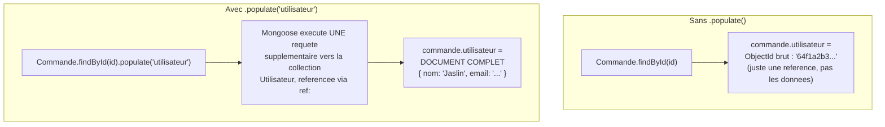

<div class="chapitre-titre-num">CHAPITRE 36</div>

# Mongoose

<div class="encadre objectif">
<span class="encadre-titre">🎯 Objectif du chapitre</span>
Structurer l'accès à MongoDB avec Mongoose, l'ODM (*Object-Document Mapping*) standard, qui impose un schéma côté application — résolvant directement le problème de flexibilité excessive du chapitre 33. À la fin de ce chapitre, tu sauras utiliser `populate()` pour résoudre des références entre documents, et éviter le piège classique de la comparaison d'ObjectId.
</div>

<div class="encadre scenario">
<span class="encadre-titre">🎬 Mise en situation</span>
Un développeur junior de ton équipe signale un bug étrange : un utilisateur ne peut jamais voir ses propres commandes, même en étant connecté avec le bon compte. Le code compare `commande.utilisateur === req.utilisateur.id`, une comparaison qui échoue systématiquement alors que les deux valeurs semblent identiques une fois affichées en console. Ce chapitre explique précisément ce piège classique des `ObjectId` Mongoose — et surtout, comment structurer proprement des relations entre documents avec `populate()`, l'équivalent MongoDB du `include` de Prisma.
</div>

## 36.1 Pourquoi Mongoose plutôt que le driver natif

Rappel du chapitre 33 (section 33.6) : MongoDB n'impose aucune structure par défaut, un risque réel d'incohérence entre documents d'une même collection. **Mongoose** résout ce problème en définissant un **schéma** côté application, validé automatiquement à chaque écriture.

| Critère | Driver natif MongoDB (chapitre 33) | Mongoose (ce chapitre) |
|---|---|---|
| Schéma imposé | Aucun, structure libre | Défini et validé côté application |
| Validation à l'écriture | Manuelle (à coder soi-même) | Automatique (`required`, `enum`, `match`...) |
| Chargement de relations | Requêtes manuelles séparées | `populate()` intégré |
| Méthodes personnalisées sur un document | Non natif | `schema.methods.xxx` |
| Hooks de cycle de vie (avant/après sauvegarde) | Non natif | `pre`/`post` intégrés |
| Courbe d'apprentissage | Plus simple, proche du JSON pur | Plus riche, plus de concepts à maîtriser |

```
$ npm install mongoose
```

## 36.2 Connexion avec Mongoose

```js
// src/config/db.js
const mongoose = require("mongoose");

async function connecter() {
  await mongoose.connect(process.env.MONGODB_URI);
  console.log("Connecté à MongoDB via Mongoose");
}

module.exports = { connecter };
```

## 36.3 Définir un schéma et un modèle

```js
// src/models/utilisateur.model.js
const mongoose = require("mongoose");

const utilisateurSchema = new mongoose.Schema({
  nom: {
    type: String,
    required: [true, "Le nom est obligatoire"],
    trim: true,
  },
  email: {
    type: String,
    required: true,
    unique: true,
    lowercase: true,
    match: [/^\S+@\S+\.\S+$/, "Format d'email invalide"],
  },
  motDePasseHash: {
    type: String,
    required: true,
  },
  role: {
    type: String,
    enum: ["UTILISATEUR", "ADMIN"],
    default: "UTILISATEUR",
  },
}, {
  timestamps: true, // ajoute createdAt/updatedAt automatiquement
});

const Utilisateur = mongoose.model("Utilisateur", utilisateurSchema);

module.exports = Utilisateur;
```

<div class="encadre astuce">
<span class="encadre-titre">💡 Cette validation s'exécute AUTOMATIQUEMENT à chaque .save()/.create()</span>
Contrairement au driver natif (chapitre 33) où rien n'empêche d'insérer un document mal formé, Mongoose **refuse** automatiquement un document ne respectant pas le schéma (champ `required` manquant, `enum` avec une valeur non listée, format `match` non respecté) — une validation similaire en esprit à Zod (chapitre 18), mais appliquée spécifiquement au niveau de la couche de persistance.
</div>

## 36.4 CRUD avec Mongoose

```js
const Utilisateur = require("../models/utilisateur.model");

async function creer(donnees) {
  return Utilisateur.create(donnees); // valide AUTOMATIQUEMENT contre le schéma avant l'insertion
}

async function trouverParId(id) {
  return Utilisateur.findById(id);
}

async function trouverParEmail(email) {
  return Utilisateur.findOne({ email });
}

async function listerTous() {
  return Utilisateur.find().sort({ nom: 1 });
}

async function modifier(id, donnees) {
  return Utilisateur.findByIdAndUpdate(id, donnees, { new: true, runValidators: true });
  // "new: true" : retourne le document APRÈS modification (pas avant)
  // "runValidators: true" : réapplique les validations du schéma, même sur un UPDATE
}

async function supprimer(id) {
  return Utilisateur.findByIdAndDelete(id);
}
```

<div class="encadre attention">
<span class="encadre-titre">⚠️ Sans runValidators: true, un UPDATE contourne les validations du schéma</span>
Par défaut, Mongoose applique les validations à la **création** (`create`, `save`), mais **pas automatiquement** aux mises à jour (`findByIdAndUpdate`) — un oubli fréquent qui permettrait d'enregistrer des données invalides via une simple modification.
</div>

## 36.5 Relations avec populate (référence entre documents)

```js
const commandeSchema = new mongoose.Schema({
  utilisateur: { type: mongoose.Schema.Types.ObjectId, ref: "Utilisateur" }, // référence vers un autre document
  total: Number,
});

const Commande = mongoose.model("Commande", commandeSchema);
```



<div class="encadre astuce">
<span class="encadre-titre">💡 Explication du schéma</span>
`ref: "Utilisateur"` dans le schéma (section 36.5) indique à Mongoose quelle collection interroger quand `.populate("utilisateur")` est appelé — la référence stockée (un simple `ObjectId`) est alors remplacée par le document complet correspondant, en une requête supplémentaire. C'est l'équivalent conceptuel du `include` de Prisma (chapitre 34), avec la même vigilance à avoir sur le N+1 si `populate()` est appelé à l'intérieur d'une boucle plutôt que sur la requête initiale.
</div>

```js
// Sans populate : utilisateur reste juste un ObjectId brut
const commande = await Commande.findById(id);
console.log(commande.utilisateur); // 64f1a2b3c4d5e6f7a8b9c0d1 (juste l'id)

// Avec populate : Mongoose charge AUTOMATIQUEMENT le document référencé
const commandeAvecUtilisateur = await Commande.findById(id).populate("utilisateur");
console.log(commandeAvecUtilisateur.utilisateur.nom); // "Jaslin" — le document complet est chargé
```

## 36.6 Middlewares Mongoose (hooks pre/post)

```js
const bcrypt = require("bcrypt");

utilisateurSchema.pre("save", async function (next) {
  if (!this.isModified("motDePasseHash")) return next(); // ne re-hache PAS si le mot de passe n'a pas changé
  this.motDePasseHash = await bcrypt.hash(this.motDePasseHash, 10);
  next();
});
```

<div class="encadre astuce">
<span class="encadre-titre">💡 Un hook pre("save") centralise une transformation systématique</span>
Ce hook garantit que **tout** enregistrement d'un utilisateur (création ou modification) hache automatiquement le mot de passe si celui-ci a changé — évitant d'avoir à s'en souvenir manuellement dans chaque service qui pourrait créer/modifier un utilisateur.
</div>

## 36.7 Méthodes personnalisées sur un modèle

```js
utilisateurSchema.methods.verifierMotDePasse = async function (motDePasseSaisi) {
  return bcrypt.compare(motDePasseSaisi, this.motDePasseHash);
};
```

```js
const utilisateur = await Utilisateur.findOne({ email });
const estValide = await utilisateur.verifierMotDePasse(motDePasseSaisi); // méthode directement sur l'instance
```

## Atelier — Corriger le bug de la mise en situation

<div class="encadre exercice">
<span class="encadre-titre">🛠️ Atelier 36 — Comparer des ObjectId correctement</span>

**Objectif** : reproduire puis corriger exactement le bug de la mise en situation d'ouverture.

**Préparation** : un modèle `Commande` avec un champ `utilisateur` référencé (section 36.5), et un utilisateur connecté simulé avec son `id`.

**Étapes détaillées** :
1. Écris une fonction `estProprietaire(commande, utilisateurId)` utilisant `commande.utilisateur === utilisateurId` (reproduisant le bug).
2. Teste-la avec une commande réelle et l'id de son propriétaire réel : observe qu'elle retourne `false` à tort.
3. Affiche `typeof commande.utilisateur` et `typeof utilisateurId` : observe qu'il s'agit d'un `ObjectId` d'un côté et probablement d'une chaîne de l'autre (ou deux instances distinctes d'`ObjectId`).
4. Corrige avec `.equals()` (section 36.8), reteste : la fonction doit maintenant retourner `true` correctement.

**Validation** : la fonction corrigée doit retourner `true` pour le vrai propriétaire, `false` pour n'importe quel autre utilisateur.

**Résultat attendu** : la compréhension définitive de pourquoi ce bug, en apparence mystérieux ("les ids sont pourtant identiques à l'affichage"), a une cause précise et une correction simple.

**Dépannage** : si `.equals()` n'est pas disponible, vérifie que la valeur comparée est bien une instance `ObjectId` de Mongoose, pas déjà une chaîne convertie.

**Nettoyage** : aucun.
</div>

## Erreurs fréquentes

<div class="encadre attention">
<span class="encadre-titre">⚠️ Erreur n°1 — Comparer directement deux ObjectId avec ===</span>

```js
if (commande.utilisateur === utilisateurConnecteId) { ... } // ❌ souvent FAUX, même si les ids "semblent" identiques
```
```js
if (commande.utilisateur.equals(utilisateurConnecteId)) { ... } // ✅ méthode dédiée d'ObjectId
// ou : if (commande.utilisateur.toString() === utilisateurConnecteId.toString())
```
Deux `ObjectId` représentant la même valeur ne sont **pas égaux** avec `===` (comparaison de référence d'objet) — toujours utiliser `.equals()` ou convertir en chaîne des deux côtés avant de comparer. Exactement le bug de la mise en situation d'ouverture.
</div>

<div class="encadre attention">
<span class="encadre-titre">⚠️ Erreur n°2 — Oublier runValidators: true sur un findByIdAndUpdate</span>
Rappel de la section 36.4 — une donnée invalide peut se glisser silencieusement via une mise à jour, contournant les mêmes règles pourtant respectées à la création.
</div>

## Débogage

<div class="encadre attention">
<span class="encadre-titre">🩺 Symptôme : une comparaison d'id "évidemment vraie" retourne toujours false</span>

- **Cause** : comparaison directe de deux `ObjectId` avec `===` (erreur fréquente n°1, exactement la mise en situation d'ouverture).
- **Diagnostic** : afficher `typeof` des deux valeurs comparées pour confirmer qu'il s'agit bien d'objets `ObjectId`, pas de primitives.
- **Solution** : utiliser `.equals()` ou convertir les deux côtés en chaîne avant de comparer.
</div>

## En entreprise

- **populate() utilisé avec parcimonie** : de nombreuses équipes limitent `populate()` aux champs réellement nécessaires (via `populate("utilisateur", "nom email")`, une syntaxe équivalente au `select` de Prisma), pour éviter de transférer des documents référencés entièrement quand seuls quelques champs sont utiles.
- **Hooks pre/post pour l'audit** : au-delà du hachage de mot de passe, les hooks Mongoose servent fréquemment à journaliser automatiquement chaque création/modification d'un document sensible, sans dupliquer cette logique dans chaque service.

## Entretien technique

<div class="encadre exercice">
<span class="encadre-titre">💼 Questions fréquemment posées en entretien</span>

**Q1. "Que fait populate() dans Mongoose ?"**
Réponse attendue : remplace une référence `ObjectId` stockée dans un document par le document complet référencé, via une requête supplémentaire — l'équivalent conceptuel d'une jointure SQL ou du `include` de Prisma.

**Q2. "Pourquoi deux ObjectId identiques échouent-ils à une comparaison === ?"**
Réponse attendue : `===` compare la référence d'objet, pas la valeur représentée ; deux instances distinctes d'`ObjectId`, même représentant la même valeur, ne sont jamais strictement égales par cette comparaison — `.equals()` doit être utilisé à la place.

**Q3. "Pourquoi runValidators: true est-il nécessaire sur findByIdAndUpdate ?"**
Réponse attendue : par défaut, Mongoose applique les validations du schéma uniquement à la création, pas aux mises à jour — sans cette option, une mise à jour pourrait enregistrer une donnée qui aurait été rejetée à la création.
</div>

## Optimisation, sécurité et maintenabilité

<div class="encadre performance">
<span class="encadre-titre">🚀 Performance</span>
Limiter les champs chargés par `populate()` aux besoins réels (`populate("utilisateur", "nom email")`) réduit le volume de données transférées, particulièrement utile si le document référencé est volumineux.
</div>

<div class="encadre bonne-pratique">
<span class="encadre-titre">✅ Maintenabilité</span>
Centraliser les méthodes de comparaison d'ObjectId (comme `estProprietaire` de l'atelier) dans un utilitaire partagé, plutôt que de répéter `.equals()` ou `.toString()` à chaque endroit du code — réduit le risque de réintroduire le bug de la mise en situation d'ouverture ailleurs dans le projet.
</div>

## Résumé du chapitre

- Mongoose impose un schéma côté application, validé automatiquement à l'écriture — résolvant la flexibilité excessive du driver natif MongoDB.
- `runValidators: true` est nécessaire pour que les mises à jour (`findByIdAndUpdate`) respectent aussi les validations du schéma.
- `populate()` charge automatiquement un document référencé par `ObjectId`, remplaçant les jointures SQL — équivalent conceptuel du `include` de Prisma.
- Les hooks `pre`/`post` centralisent des transformations systématiques (comme le hachage automatique d'un mot de passe modifié).
- Toujours comparer deux `ObjectId` via `.equals()`, jamais avec `===` — la cause du bug de la mise en situation d'ouverture.

## Quiz

<div class="encadre exercice">
<span class="encadre-titre">📝 QCM</span>

1. Que fait Mongoose que le driver natif MongoDB ne fait pas nativement ?
   - a) Se connecter à MongoDB
   - b) Imposer et valider un schéma côté application
   - c) Créer des collections
   - d) Rien de particulier

2. Comment comparer correctement deux ObjectId ?
   - a) Avec ===
   - b) Avec .equals() ou en convertissant en chaîne des deux côtés
   - c) Avec ==
   - d) Ce n'est jamais possible

3. Que faut-il ajouter à findByIdAndUpdate pour que les validations du schéma s'appliquent ?
   - a) validate: true
   - b) runValidators: true
   - c) Rien, c'est automatique
   - d) checkSchema: true

**Corrigé** : 1-b, 2-b, 3-b.
</div>

<div class="encadre exercice">
<span class="encadre-titre">📝 Vrai ou Faux</span>

1. populate() charge automatiquement un document référencé par ObjectId. — **Vrai**.
2. Les validations Mongoose s'appliquent automatiquement à findByIdAndUpdate sans configuration. — **Faux**.
3. Deux ObjectId représentant la même valeur sont toujours égaux avec ===. — **Faux**.
</div>

<div class="encadre exercice">
<span class="encadre-titre">📝 Question ouverte</span>

Pourquoi le bug de la mise en situation d'ouverture était-il particulièrement difficile à repérer pour le développeur junior, "les ids semblant identiques à l'affichage" ?

**Corrigé** : `console.log(objectId)` affiche généralement la représentation textuelle de l'ObjectId (sa valeur hexadécimale), qui semble effectivement identique visuellement à celle d'un autre ObjectId représentant la même valeur. Mais `===` en JavaScript compare la **référence** de l'objet en mémoire, pas son contenu affiché — deux instances distinctes d'ObjectId (même créées à partir de la même valeur hexadécimale) ne sont jamais la même référence, donc jamais égales avec `===`, même si leur affichage textuel est rigoureusement identique. C'est une confusion classique entre égalité de valeur et égalité de référence.
</div>

## Exercices

<div class="encadre exercice">
<span class="encadre-titre">📝 Exercice 36.1</span>

Définis un schéma Mongoose `Produit` (nom, prix, stock) avec une méthode d'instance `estDisponible()` retournant `true` si `stock > 0`.
</div>

**Corrigé :**
```js
const produitSchema = new mongoose.Schema({
  nom: { type: String, required: true },
  prix: { type: Number, required: true, min: 0 },
  stock: { type: Number, default: 0, min: 0 },
});

produitSchema.methods.estDisponible = function () {
  return this.stock > 0;
};

const Produit = mongoose.model("Produit", produitSchema);
```

## Checklist de fin de chapitre

<ul class="checklist">
<li>☐ Je sais définir un schéma Mongoose avec validations.</li>
<li>☐ Je sais utiliser runValidators: true sur les mises à jour.</li>
<li>☐ Je sais utiliser populate() pour charger une relation référencée.</li>
<li>☐ Je sais écrire un hook pre("save") pour une transformation systématique.</li>
<li>☐ Je compare toujours deux ObjectId avec .equals(), jamais ===.</li>
</ul>

## FAQ

<dl class="faq">
<dt>populate() peut-il charger plusieurs niveaux de relations imbriquées ?</dt>
<dd>Oui, via un populate imbriqué (`populate({ path: "utilisateur", populate: { path: "adresse" } })`), bien que cela puisse rapidement devenir coûteux en performance si les niveaux s'accumulent.</dd>

<dt>Faut-il toujours utiliser runValidators: true par défaut ?</dt>
<dd>C'est une bonne pratique par défaut pour toute mise à jour, sauf cas très spécifique où l'on souhaite délibérément contourner une validation — rare et à documenter explicitement si c'est le cas.</dd>

<dt>Mongoose ralentit-il les performances par rapport au driver natif ?</dt>
<dd>Un léger surcoût existe (validation, hooks), généralement négligeable face au bénéfice de fiabilité apporté — pour des cas de performance extrême, certaines équipes utilisent `.lean()` pour obtenir des objets JavaScript simples plutôt que des documents Mongoose complets, plus rapides à lire seule.</dd>
</dl>

## Références et pour aller plus loin

- Documentation Mongoose : [https://mongoosejs.com/docs/](https://mongoosejs.com/docs/)
- Documentation Mongoose sur populate : [https://mongoosejs.com/docs/populate.html](https://mongoosejs.com/docs/populate.html)

*Ceci clôt la Partie 8 (bases de données et ORM). Chapitre suivant : Docker, pour conteneuriser l'application et ses dépendances.*
