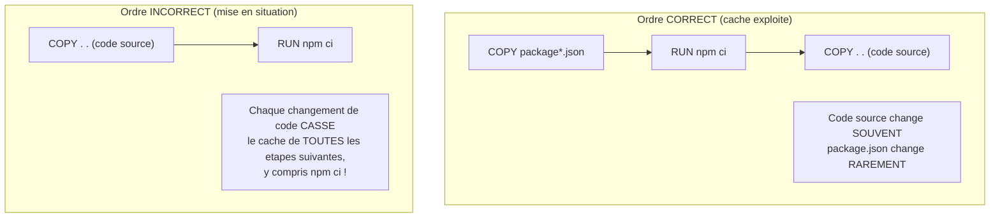

<div class="chapitre-titre-num">CHAPITRE 37</div>

# Docker

<div class="encadre objectif">
<span class="encadre-titre">🎯 Objectif du chapitre</span>
Comprendre le principe de la conteneurisation, écrire un Dockerfile optimisé pour une application Node.js, et construire/exécuter une image. À la fin de ce chapitre, tu sauras pourquoi une image Docker met parfois 5 minutes à se reconstruire, et parfois seulement 5 secondes — et comment obtenir systématiquement le second cas.
</div>

<div class="encadre scenario">
<span class="encadre-titre">🎬 Mise en situation</span>
Un développeur de ton équipe se plaint que chaque `docker build` de son projet prend plus de 4 minutes, même pour un changement d'une seule ligne dans un contrôleur. En inspectant son Dockerfile, tu remarques que `COPY . .` (qui copie tout le code source, y compris les fichiers qui changent à chaque commit) est placé **avant** `RUN npm ci` — cassant le cache de build à chaque modification, aussi minime soit-elle, forçant une réinstallation complète des dépendances à chaque fois. Ce chapitre explique précisément le mécanisme de cache par couches qui explique cet écart, et comment l'exploiter correctement.
</div>

## 37.1 Le problème résolu par Docker

<div class="encadre astuce">
<span class="encadre-titre">💡 "Ça marche sur ma machine" — le problème classique</span>
Une application qui fonctionne parfaitement sur la machine d'un développeur peut échouer sur le serveur de production à cause de différences d'environnement : version de Node.js différente, dépendance système manquante, variable d'environnement oubliée. **Docker** empaquette l'application **avec tout son environnement d'exécution** dans une image portable, garantissant un comportement identique partout où elle s'exécute.
</div>

## 37.2 Image vs conteneur

- **Image** : un modèle immuable, un "plan de construction" contenant le code, les dépendances, et la configuration nécessaire pour exécuter l'application.
- **Conteneur** : une **instance en cours d'exécution** d'une image — comme un objet est une instance d'une classe (rappel du manuel Java de ce même auteur).

```
$ docker build -t mon-api .        # construit une IMAGE à partir du Dockerfile
$ docker run -p 3000:3000 mon-api  # démarre un CONTENEUR à partir de cette image
```

## 37.3 Docker vs machine virtuelle : pourquoi Docker est si léger

| Critère | Machine virtuelle | Conteneur Docker |
|---|---|---|
| Système d'exploitation | Un OS complet par VM (noyau inclus) | Partage le noyau de l'hôte, pas d'OS complet dupliqué |
| Temps de démarrage | Minutes (démarrage d'un OS complet) | Secondes (juste un processus isolé) |
| Taille typique | Plusieurs Go | Quelques dizaines à centaines de Mo |
| Isolation | Très forte (matériel virtualisé) | Forte mais partage le noyau hôte |
| Densité (combien par serveur) | Faible (quelques VM par machine physique) | Élevée (dizaines de conteneurs par machine) |

<div class="encadre astuce">
<span class="encadre-titre">💡 Analogie</span>
Une machine virtuelle, c'est construire une maison individuelle complète à chaque nouvel habitant (fondations, murs, toit propres). Un conteneur Docker, c'est un appartement dans un immeuble déjà construit (le noyau partagé) : chaque appartement reste isolé et indépendant, mais sans dupliquer toute la structure porteuse — d'où la légèreté et la rapidité de démarrage.
</div>

## 37.4 Un Dockerfile de base

```dockerfile
# Dockerfile
FROM node:20-alpine

WORKDIR /app

COPY package*.json ./
RUN npm ci --production

COPY . .

EXPOSE 3000

CMD ["node", "server.js"]
```

<div class="encadre astuce">
<span class="encadre-titre">💡 Pourquoi copier package*.json AVANT le reste du code</span>
Docker met en **cache** chaque étape (couche/*layer*) du Dockerfile. Si le code source change mais que `package.json` reste identique, copier `package*.json` puis exécuter `npm ci` **avant** de copier le reste du code permet à Docker de réutiliser le cache de cette étape coûteuse (installation des dépendances), ne réexécutant que les étapes suivantes — accélérant considérablement les reconstructions successives. Exactement l'inverse de l'ordre fautif de la mise en situation d'ouverture.
</div>



<div class="encadre astuce">
<span class="encadre-titre">💡 Explication du schéma</span>
Docker invalide le cache d'une couche (et de **toutes** celles qui suivent) dès que son contenu change. En copiant tout le code source avant `npm ci`, le moindre changement de fichier source (fréquent) invalide le cache de `npm ci` (coûteux) à chaque reconstruction — exactement le problème des 4 minutes de la mise en situation d'ouverture. En copiant `package*.json` séparément et en premier, `npm ci` ne se relance que quand les dépendances changent réellement (rare).
</div>

## 37.5 alpine : une image de base légère

<div class="encadre astuce">
<span class="encadre-titre">💡 node:20-alpine vs node:20</span>
`node:20` (basé sur Debian complet) pèse plusieurs centaines de Mo ; `node:20-alpine` (basé sur Alpine Linux, une distribution minimaliste) ne pèse que quelques dizaines de Mo — un gain significatif de taille d'image, de temps de transfert, et de surface d'attaque de sécurité (moins de logiciels installés = moins de vulnérabilités potentielles).
</div>

## 37.6 Build multi-étapes (multi-stage) pour une image de production optimisée

```dockerfile
# Étape 1 : construction (avec toutes les devDependencies nécessaires pour un éventuel build)
FROM node:20-alpine AS build

WORKDIR /app
COPY package*.json ./
RUN npm ci

COPY . .
RUN npm run build 2>/dev/null || true # si le projet a une étape de build (TypeScript, par exemple)

# Étape 2 : production (image FINALE, allégée, sans les outils de développement)
FROM node:20-alpine AS production

WORKDIR /app
COPY package*.json ./
RUN npm ci --omit=dev # UNIQUEMENT les dépendances de production, pas Jest/nodemon/etc.

COPY --from=build /app/dist ./dist # ne récupère QUE le résultat compilé de l'étape précédente
COPY --from=build /app/prisma ./prisma

EXPOSE 3000
CMD ["node", "dist/server.js"]
```

<div class="encadre astuce">
<span class="encadre-titre">💡 L'image finale ne contient jamais les devDependencies ni le code source non compilé</span>
Le build multi-étapes sépare l'environnement de **construction** (qui peut avoir besoin d'outils lourds) de l'image **finale** réellement déployée, bien plus légère et sans surface d'attaque inutile (pas de Jest, pas d'ESLint, pas de code TypeScript brut dans l'image de production).
</div>

## 37.7 .dockerignore : exclure les fichiers inutiles

```
# .dockerignore
node_modules/
.env
.git/
*.log
tests/
coverage/
```

<div class="encadre attention">
<span class="encadre-titre">⚠️ Sans .dockerignore, node_modules local est copié dans l'image, en plus d'être réinstallé</span>
Sans ce fichier, `COPY . .` copierait aussi le `node_modules/` local du développeur (potentiellement incompatible avec l'architecture du conteneur, notamment pour des paquets natifs compilés) — `.dockerignore` fonctionne exactement comme `.gitignore`, mais pour le contexte de build Docker.
</div>

## 37.8 Variables d'environnement dans un conteneur

```
$ docker run -p 3000:3000 --env-file .env mon-api
```

```dockerfile
# Alternative : valeur par défaut dans le Dockerfile, surchageable au lancement
ENV PORT=3000
```

<div class="encadre attention">
<span class="encadre-titre">⚠️ Ne jamais intégrer de vrais secrets DANS l'image Docker elle-même</span>
Une variable définie via `ENV` dans le Dockerfile devient **partie intégrante de l'image**, visible par quiconque a accès à cette image (même sans lancer de conteneur, via `docker history`). Les vrais secrets (mots de passe, clés API) doivent toujours être injectés **au lancement** du conteneur (`--env-file`, ou via un orchestrateur comme Docker Compose, chapitre 38, ou un gestionnaire de secrets en production), jamais codés dans le Dockerfile.
</div>

## 37.9 Commandes Docker essentielles

```
$ docker build -t mon-api:1.0 .        # construit une image avec un tag de version
$ docker images                        # liste les images locales
$ docker run -d -p 3000:3000 mon-api   # démarre en arrière-plan (-d = detached)
$ docker ps                             # liste les conteneurs en cours d'exécution
$ docker logs <id_conteneur>            # affiche les logs d'un conteneur
$ docker exec -it <id_conteneur> sh    # ouvre un terminal DANS le conteneur en cours d'exécution
$ docker stop <id_conteneur>
$ docker rm <id_conteneur>              # supprime un conteneur arrêté
$ docker rmi mon-api:1.0                # supprime une image
```

## 37.10 Healthcheck : signaler que l'application est prête

```dockerfile
HEALTHCHECK --interval=30s --timeout=3s CMD wget --spider -q http://localhost:3000/sante || exit 1
```

```js
// Une route dédiée, légère, sans logique métier ni dépendance externe
app.get("/sante", (req, res) => res.status(200).json({ statut: "ok" }));
```

<div class="encadre astuce">
<span class="encadre-titre">💡 Pourquoi un healthcheck est utile en production</span>
Un orchestrateur (Docker Compose, Kubernetes) peut utiliser ce signal pour savoir si un conteneur est réellement **prêt à recevoir du trafic**, et redémarrer automatiquement un conteneur qui ne répond plus correctement — une route `/sante` volontairement minimaliste évite qu'une panne de base de données, par exemple, ne fasse échouer le healthcheck lui-même de façon trompeuse.
</div>

## Atelier — Mesurer le gain du cache de couches

<div class="encadre exercice">
<span class="encadre-titre">🛠️ Atelier 37 — Reproduire puis corriger le problème de la mise en situation</span>

**Objectif** : mesurer concrètement l'impact de l'ordre des instructions du Dockerfile sur le temps de build.

**Préparation** : un petit projet Express avec quelques dépendances.

**Étapes détaillées** :
1. Écris un Dockerfile "incorrect" avec `COPY . .` avant `RUN npm ci`.
2. Construis l'image une première fois (`docker build`), chronométrée.
3. Modifie un simple commentaire dans un fichier source, reconstruis : chronomètre à nouveau.
4. Réécris le Dockerfile dans le bon ordre (section 37.4), reconstruis une première fois (chronométrée), puis modifie à nouveau un commentaire et reconstruis (chronométrée).

**Validation** : la version incorrecte doit montrer un temps de reconstruction quasiment identique au premier build (cache cassé à chaque fois) ; la version correcte doit montrer un second build nettement plus rapide (cache de `npm ci` réutilisé).

**Résultat attendu** : la preuve chronométrée exacte du problème des 4 minutes de la mise en situation d'ouverture, et de sa correction.

**Dépannage** : si aucune différence n'est mesurable, vérifie qu'aucune option `--no-cache` n'est utilisée par erreur lors des builds de test.

**Nettoyage** : supprime les images de test créées (`docker rmi`).
</div>

## Erreurs fréquentes

<div class="encadre attention">
<span class="encadre-titre">⚠️ Erreur n°1 — Lancer npm install au lieu de npm ci dans le Dockerfile</span>
Rappel du chapitre 3 : `npm ci` garantit une installation strictement reproductible à partir de `package-lock.json`, essentielle pour qu'une image Docker construite aujourd'hui installe **exactement** les mêmes versions qu'une image construite demain avec le même code source.
</div>

<div class="encadre attention">
<span class="encadre-titre">⚠️ Erreur n°2 — Copier tout le code source avant d'installer les dépendances</span>
Exactement le problème de la mise en situation d'ouverture — casse le cache de build à chaque changement de code, même minime, forçant une réinstallation complète des dépendances à chaque reconstruction.
</div>

## Débogage

<div class="encadre attention">
<span class="encadre-titre">🩺 Symptôme : docker build prend systématiquement plusieurs minutes, même pour un petit changement</span>

- **Cause probable** : ordre incorrect des instructions dans le Dockerfile (erreur fréquente n°2).
- **Diagnostic** : vérifier que `COPY package*.json` et `RUN npm ci` précèdent bien `COPY . .`.
- **Solution** : réordonner le Dockerfile selon la section 37.4.
</div>

## En entreprise

- **Temps de build surveillé en CI** : de nombreuses équipes suivent le temps de build Docker dans leur pipeline CI/CD (chapitre 39) comme un indicateur de santé — une dégradation soudaine signale souvent un problème de cache mal exploité.
- **Images de base auditées régulièrement** : `node:20-alpine` (et son numéro de version précis) est mis à jour périodiquement pour intégrer les correctifs de sécurité du système d'exploitation sous-jacent, pas seulement de Node.js lui-même.

## Entretien technique

<div class="encadre exercice">
<span class="encadre-titre">💼 Questions fréquemment posées en entretien</span>

**Q1. "Quelle est la différence entre une image et un conteneur Docker ?"**
Réponse attendue : une image est un modèle immuable (le plan de construction) ; un conteneur est une instance en cours d'exécution de cette image, comparable à la relation entre une classe et un objet.

**Q2. "Pourquoi l'ordre des instructions dans un Dockerfile est-il important ?"**
Réponse attendue : Docker met en cache chaque couche, et invalide le cache d'une couche (et de toutes celles qui suivent) dès que son contenu change — placer les étapes qui changent rarement (installation des dépendances) avant celles qui changent souvent (code source) maximise la réutilisation du cache.

**Q3. "Pourquoi un conteneur Docker démarre-t-il tellement plus vite qu'une machine virtuelle ?"**
Réponse attendue : un conteneur partage le noyau du système d'exploitation hôte, contrairement à une VM qui démarre un système d'exploitation complet — évitant tout le temps de démarrage d'un OS.
</div>

## Optimisation, sécurité et maintenabilité

<div class="encadre performance">
<span class="encadre-titre">🚀 Performance</span>
Un Dockerfile bien ordonné (dépendances avant code source) peut réduire un temps de build de plusieurs minutes à quelques secondes sur des changements de code courants — un gain de productivité quotidien pour toute l'équipe.
</div>

<div class="encadre securite">
<span class="encadre-titre">🔒 Sécurité</span>
Une image `alpine` minimaliste réduit la surface d'attaque (moins de logiciels installés, moins de vulnérabilités potentielles) par rapport à une image basée sur une distribution Linux complète.
</div>

## Résumé du chapitre

- Docker empaquette l'application avec son environnement d'exécution complet, éliminant les différences entre machines.
- Un conteneur partage le noyau de l'hôte (contrairement à une VM), le rendant nettement plus léger et rapide à démarrer.
- L'ordre des instructions du Dockerfile (dépendances avant code source) exploite le cache de build de Docker — l'inverse de cet ordre casse le cache à chaque changement de code.
- `node:20-alpine` produit des images bien plus légères que l'image Debian complète.
- Le build multi-étapes sépare construction et image finale de production, plus légère et sans outils de développement.
- Les vrais secrets ne doivent jamais être intégrés dans l'image elle-même, toujours injectés au lancement du conteneur.

## Quiz

<div class="encadre exercice">
<span class="encadre-titre">📝 QCM</span>

1. Quelle est la différence entre une image et un conteneur ?
   - a) Aucune, ce sont des synonymes
   - b) L'image est un modèle immuable, le conteneur est une instance en cours d'exécution
   - c) Le conteneur est plus léger que l'image
   - d) L'image ne peut contenir qu'un seul fichier

2. Pourquoi copier package*.json avant le reste du code dans un Dockerfile ?
   - a) Par convention arbitraire, sans impact réel
   - b) Pour exploiter le cache de build de Docker et éviter de réinstaller les dépendances inutilement
   - c) Node.js l'exige techniquement
   - d) Pour réduire la taille de l'image

3. Pourquoi un conteneur démarre-t-il plus vite qu'une machine virtuelle ?
   - a) Il n'exécute aucun code
   - b) Il partage le noyau du système hôte, sans démarrer un OS complet
   - c) Il n'a pas de système de fichiers
   - d) Il n'y a aucune différence de vitesse

**Corrigé** : 1-b, 2-b, 3-b.
</div>

<div class="encadre exercice">
<span class="encadre-titre">📝 Vrai ou Faux</span>

1. Une variable ENV dans le Dockerfile est un bon endroit pour stocker un vrai secret de production. — **Faux**.
2. node:20-alpine est plus léger que node:20. — **Vrai**.
3. Le build multi-étapes inclut les devDependencies dans l'image finale de production. — **Faux**.
</div>

<div class="encadre exercice">
<span class="encadre-titre">📝 Question ouverte</span>

Pourquoi le développeur de la mise en situation d'ouverture n'a-t-il probablement pas remarqué le problème avant que son équipe ne s'agrandisse ?

**Corrigé** : sur un projet en solo, avec des builds peu fréquents, un temps de build de 4 minutes reste gênant mais tolérable. Avec une équipe qui grandit, le nombre de builds quotidiens (chaque développeur, plus le pipeline CI à chaque commit) se multiplie, transformant un désagrément individuel en une perte de temps collective significative — exactement le moment où ce genre de problème de cache mal exploité devient suffisamment visible pour être signalé et corrigé.
</div>

## Exercices

<div class="encadre exercice">
<span class="encadre-titre">📝 Exercice 37.1</span>

Écris un Dockerfile pour une API Node.js simple (pas de build TypeScript), basé sur `node:20-alpine`, exposant le port 4000, avec un `.dockerignore` approprié.
</div>

**Corrigé :**
```dockerfile
FROM node:20-alpine
WORKDIR /app
COPY package*.json ./
RUN npm ci --omit=dev
COPY . .
EXPOSE 4000
CMD ["node", "server.js"]
```
```
# .dockerignore
node_modules/
.env
.git/
tests/
```

## Checklist de fin de chapitre

<ul class="checklist">
<li>☐ Je comprends la différence entre image et conteneur.</li>
<li>☐ Je sais pourquoi un conteneur est plus léger qu'une VM.</li>
<li>☐ J'ordonne correctement mon Dockerfile pour exploiter le cache de build.</li>
<li>☐ Je sais écrire un build multi-étapes pour une image de production optimisée.</li>
<li>☐ Je n'intègre jamais de vrai secret dans une image Docker.</li>
</ul>

## FAQ

<dl class="faq">
<dt>Faut-il toujours utiliser un build multi-étapes ?</dt>
<dd>Pas obligatoirement pour un projet sans étape de compilation (JavaScript pur, sans TypeScript) — un Dockerfile simple (section 37.4) suffit. Le multi-étapes devient utile dès qu'une étape de build (TypeScript, bundling) produit des artefacts distincts du code source.</dd>

<dt>Docker fonctionne-t-il de la même façon sur Windows, macOS et Linux ?</dt>
<dd>Le comportement des conteneurs eux-mêmes est identique (basé sur Linux), mais Docker Desktop utilise une couche de virtualisation légère sur Windows/macOS pour exécuter ce noyau Linux — transparent pour l'utilisateur final, mais explique pourquoi Docker Desktop est nécessaire sur ces systèmes.</dd>

<dt>Comment réduire encore la taille d'une image déjà en alpine ?</dt>
<dd>Vérifier qu'aucune dépendance de développement ne s'est glissée dans l'image finale (build multi-étapes avec `--omit=dev`), et envisager des images encore plus minimalistes comme `node:20-alpine` avec un utilisateur non-root explicite plutôt que des variantes "distroless" pour la majorité des projets de ce manuel.</dd>
</dl>

## Références et pour aller plus loin

- Documentation Docker officielle : [https://docs.docker.com](https://docs.docker.com)
- Bonnes pratiques Dockerfile pour Node.js : [https://github.com/nodejs/docker-node/blob/main/docs/BestPractices.md](https://github.com/nodejs/docker-node/blob/main/docs/BestPractices.md)

*Chapitre suivant : Docker Compose, pour orchestrer l'API avec sa base de données et ses autres services.*
