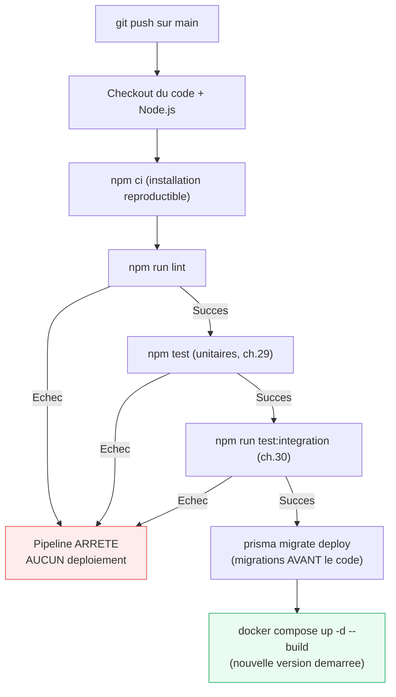
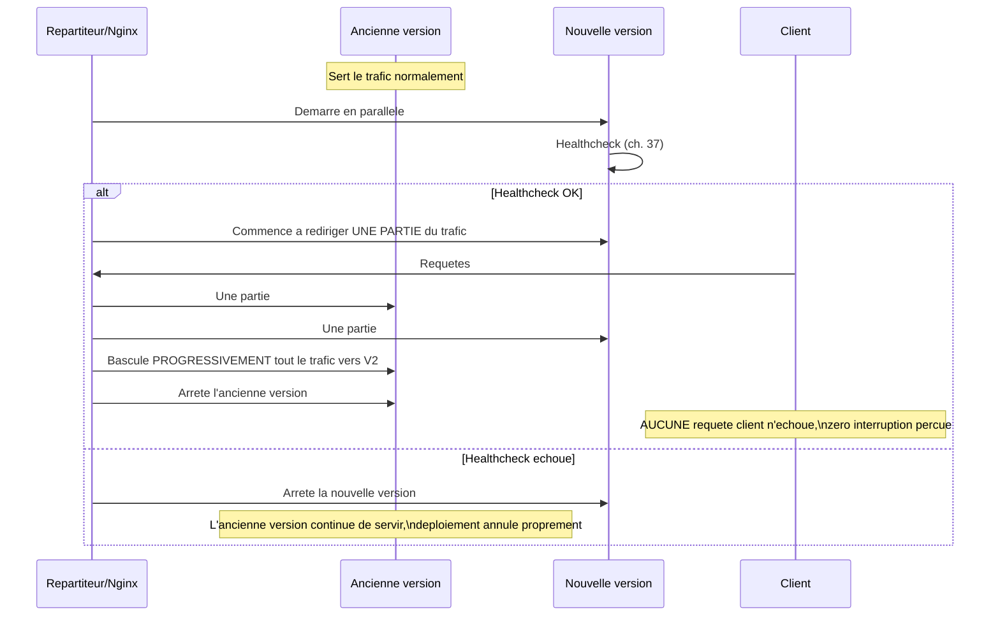

<div class="chapitre-titre-num">CHAPITRE 39</div>

# Déploiement

<div class="encadre objectif">
<span class="encadre-titre">🎯 Objectif du chapitre</span>
Déployer une API Node.js en production sur différentes plateformes, mettre en place un pipeline CI/CD basique, et gérer les migrations de base de données en production. À la fin de ce chapitre, tu sauras pourquoi un déploiement manuel devient dangereux à mesure qu'une équipe grandit, et comment l'automatiser sans jamais laisser passer du code non testé.
</div>

<div class="encadre scenario">
<span class="encadre-titre">🎬 Mise en situation</span>
Un vendredi soir, un développeur déploie manuellement une correction urgente : il se connecte en SSH, tape les commandes de mémoire, oublie d'appliquer la migration de base de données avant de redémarrer l'application. L'API redémarre avec un code qui suppose l'existence d'une colonne qui n'existe pas encore en base — 15 minutes d'indisponibilité totale, un vendredi soir, pendant que l'équipe cherche frénétiquement ce qui a été oublié. Ce chapitre construit exactement le pipeline qui rend cette erreur humaine structurellement impossible, en automatisant l'ordre correct des étapes.
</div>

## 39.1 Les grandes familles de plateformes de déploiement

| Plateforme | Type | Cas d'usage typique |
|---|---|---|
| **Railway, Render, Fly.io** | PaaS moderne | Déploiement simple depuis Git, bases de données managées incluses |
| **VPS (DigitalOcean, OVH, Hetzner)** | Serveur virtuel brut | Contrôle total, nécessite de tout configurer soi-même (Nginx, Docker, sécurité) |
| **AWS/GCP/Azure** | Cloud complet | Grande échelle, nombreux services managés, complexité de configuration plus élevée |
| **Vercel** | Serverless | Adapté aux fonctions serverless courtes, moins aux API Express classiques longue durée |

## 39.2 Déployer sur un VPS avec Docker

```
$ ssh utilisateur@mon-serveur.com
$ git clone https://github.com/jaslin/mon-api.git
$ cd mon-api
$ docker compose -f docker-compose.prod.yml up -d --build
```

```yaml
# docker-compose.prod.yml — sans volumes de développement, avec redémarrage automatique
services:
  api:
    build: .
    restart: always # redémarre automatiquement le conteneur en cas de plantage ou de redémarrage du serveur
    ports:
      - "3000:3000"
    environment:
      - NODE_ENV=production
      - DATABASE_URL=${DATABASE_URL}
    env_file:
      - .env.production
```

## 39.3 Nginx comme reverse proxy

```nginx
# /etc/nginx/sites-available/mon-api
server {
    listen 80;
    server_name api.monapp.com;

    location / {
        proxy_pass http://localhost:3000;
        proxy_set_header Host $host;
        proxy_set_header X-Real-IP $remote_addr;
        proxy_set_header X-Forwarded-For $proxy_add_x_forwarded_for;
        proxy_set_header X-Forwarded-Proto $scheme;
    }
}
```

<div class="encadre astuce">
<span class="encadre-titre">💡 Pourquoi un reverse proxy devant l'API Node.js</span>
Nginx gère le certificat HTTPS/SSL (via Let's Encrypt/Certbot), peut servir des fichiers statiques plus efficacement que Node.js, applique un rate limiting supplémentaire au niveau serveur, et permet d'héberger plusieurs applications sur le même serveur via des noms de domaine différents — autant de responsabilités qu'il vaut mieux déléguer à un serveur web dédié plutôt que de les gérer dans le code Node.js lui-même.
</div>

## 39.4 Migrations de base de données en production

```
$ npx prisma migrate deploy   # rappel du chapitre 34 : jamais "migrate dev" en production
```

<div class="encadre attention">
<span class="encadre-titre">⚠️ Toujours appliquer les migrations AVANT de démarrer la nouvelle version de l'API</span>
Démarrer une nouvelle version du code qui suppose l'existence d'une colonne/table pas encore créée en base provoquerait des erreurs immédiates. L'ordre correct : (1) appliquer les migrations, (2) démarrer/redémarrer l'application avec le nouveau code. Exactement l'étape oubliée dans la mise en situation d'ouverture.
</div>

```yaml
# Exemple d'étape dans un pipeline CI/CD (section 39.5)
- name: Appliquer les migrations
  run: npx prisma migrate deploy
- name: Redémarrer l'application
  run: docker compose up -d --build
```

## 39.5 Intégration continue (CI/CD) avec GitHub Actions

```yaml
# .github/workflows/deploy.yml
name: CI/CD

on:
  push:
    branches: [main]

jobs:
  test-et-deployer:
    runs-on: ubuntu-latest
    steps:
      - uses: actions/checkout@v4
      - uses: actions/setup-node@v4
        with:
          node-version: 20
      - run: npm ci
      - run: npm run lint
      - run: npm test                    # tests unitaires (chapitre 29)
      - run: npm run test:integration    # tests d'intégration (chapitre 30)
      - name: Déployer sur le serveur de production
        if: success()                    # UNIQUEMENT si toutes les étapes précédentes ont réussi
        run: |
          ssh utilisateur@mon-serveur.com "cd mon-api && git pull && docker compose up -d --build"
```



<div class="encadre astuce">
<span class="encadre-titre">💡 Explication du schéma</span>
Chaque étape doit réussir pour que la suivante s'exécute — un échec à n'importe quel stade (lint, tests unitaires, tests d'intégration) arrête immédiatement le pipeline, **avant** que le déploiement n'ait la moindre chance de se produire. C'est exactement cette discipline automatisée, impossible à contourner par erreur humaine, qui aurait empêché l'incident du vendredi soir de la mise en situation d'ouverture : les migrations s'appliquent systématiquement **avant** le redémarrage de l'application, dans cet ordre précis, à chaque déploiement, sans exception possible.
</div>

<div class="encadre astuce">
<span class="encadre-titre">💡 Aucun déploiement ne devrait contourner les tests</span>
Ce pipeline garantit qu'**aucun** code n'atteint la production sans être passé par le linting et l'intégralité de la suite de tests — une discipline qui détecte une régression **avant** qu'elle n'affecte de vrais utilisateurs, plutôt qu'après.
</div>

## 39.6 Gestion des processus avec PM2 (alternative/complément à Docker)

```
$ npm install -g pm2
$ pm2 start server.js --name mon-api -i max # -i max : un processus par coeur CPU disponible (cluster mode)
$ pm2 logs mon-api
$ pm2 restart mon-api
$ pm2 startup      # configure PM2 pour redémarrer automatiquement au reboot du serveur
$ pm2 save
```

<div class="encadre astuce">
<span class="encadre-titre">💡 PM2 en mode cluster : exploiter plusieurs coeurs CPU</span>
Rappel du chapitre 1 : Node.js exécute le JavaScript sur un thread unique. PM2 en mode `cluster` (`-i max`) démarre **plusieurs processus** Node.js identiques, un par coeur CPU, répartissant automatiquement les requêtes entre eux — une façon simple d'exploiter le parallélisme matériel sans changer une ligne de code applicatif.
</div>

## 39.7 Zero-downtime deployment (déploiement sans interruption)

<div class="encadre astuce">
<span class="encadre-titre">💡 Le principe du déploiement progressif (rolling deployment)</span>
Plutôt que d'arrêter l'ancienne version puis démarrer la nouvelle (provoquant une brève interruption de service), un déploiement "rolling" démarre la nouvelle version **en parallèle** de l'ancienne, redirige progressivement le trafic vers elle une fois qu'elle répond correctement (healthcheck, chapitre 37), puis arrête l'ancienne — PM2 (`pm2 reload`) et les orchestrateurs comme Kubernetes gèrent nativement ce mécanisme.
</div>



<div class="encadre astuce">
<span class="encadre-titre">💡 Explication du schéma</span>
La bascule ne se produit **jamais** brutalement : le trafic n'est redirigé vers la nouvelle version qu'une fois son healthcheck confirmé, et l'ancienne version reste disponible en secours jusqu'à la bascule complète — si la nouvelle version présente un problème, l'ancienne continue simplement de servir, sans jamais exposer les utilisateurs à une version défaillante.
</div>

## Atelier — Construire le pipeline qui aurait évité l'incident

<div class="encadre exercice">
<span class="encadre-titre">🛠️ Atelier 39 — De l'incident du vendredi soir au déploiement automatisé sûr</span>

**Objectif** : construire, étape par étape, le pipeline qui aurait rendu l'incident de la mise en situation d'ouverture structurellement impossible.

**Préparation** : un dépôt GitHub avec un projet Express simple, tests unitaires inclus.

**Étapes détaillées** :
1. Crée `.github/workflows/ci.yml` avec les étapes lint + tests unitaires uniquement, sans déploiement.
2. Pousse un changement introduisant volontairement une erreur de lint : observe l'échec du pipeline.
3. Corrige, pousse à nouveau, observe le succès.
4. Ajoute une étape de migration `prisma migrate deploy` **avant** l'étape de déploiement.
5. Simule un scénario où le code suppose une colonne inexistante : sans la migration, le déploiement échouerait ; avec elle en amont dans le bon ordre, il réussit.

**Validation** : le pipeline doit refuser tout déploiement si le lint ou les tests échouent, et appliquer systématiquement les migrations avant de redémarrer l'application, sans jamais dépendre de la mémoire d'un développeur.

**Résultat attendu** : exactement le pipeline qui aurait empêché l'incident de 15 minutes d'indisponibilité de la mise en situation d'ouverture.

**Dépannage** : si le pipeline GitHub Actions ne se déclenche pas, vérifie que le fichier est bien dans `.github/workflows/` avec l'extension `.yml`.

**Nettoyage** : aucun, ce pipeline devrait rester actif sur le projet.
</div>

## Erreurs fréquentes

<div class="encadre attention">
<span class="encadre-titre">⚠️ Erreur n°1 — Déployer directement depuis sa machine locale, sans CI/CD</span>
Sans pipeline automatisé, un déploiement manuel (`git push` puis commandes SSH tapées à la main) devient sujet à l'erreur humaine (oublier une étape, déployer un code non testé, pousser accidentellement des changements locaux non commités) — exactement l'incident de la mise en situation d'ouverture. Un pipeline CI/CD élimine cette variabilité.
</div>

<div class="encadre attention">
<span class="encadre-titre">⚠️ Erreur n°2 — Démarrer la nouvelle version du code avant d'appliquer les migrations</span>
L'ordre inverse de la section 39.4 — l'erreur précise qui a causé l'incident du vendredi soir de la mise en situation d'ouverture.
</div>

## Débogage

<div class="encadre attention">
<span class="encadre-titre">🩺 Symptôme : l'application plante immédiatement après un déploiement, avec une erreur de colonne/table manquante</span>

- **Cause** : les migrations n'ont pas été appliquées avant le redémarrage de la nouvelle version (erreur fréquente n°2).
- **Diagnostic** : vérifier l'ordre exact des étapes du pipeline de déploiement.
- **Solution** : réordonner pour que `prisma migrate deploy` (ou équivalent) précède toujours le redémarrage de l'application.
</div>

## En entreprise

- **Aucun déploiement manuel en production, sans exception** : la quasi-totalité des équipes professionnelles interdisent purement et simplement le déploiement manuel en production, précisément à cause du risque illustré par la mise en situation d'ouverture.
- **Fenêtres de déploiement évitées le vendredi** : de nombreuses équipes évitent délibérément les déploiements risqués en fin de semaine, pour ne pas se retrouver à gérer un incident sans l'équipe complète disponible — une pratique de bon sens qui n'aurait pourtant pas été nécessaire avec un pipeline automatisé fiable.

## Entretien technique

<div class="encadre exercice">
<span class="encadre-titre">💼 Questions fréquemment posées en entretien</span>

**Q1. "Pourquoi automatiser le déploiement plutôt que de le faire manuellement ?"**
Réponse attendue : élimine l'erreur humaine (étape oubliée, ordre incorrect, code non testé déployé), garantit une séquence reproductible et documentée, et permet de déployer fréquemment sans risque accru.

**Q2. "Dans quel ordre appliquer les migrations et redémarrer l'application, et pourquoi ?"**
Réponse attendue : toujours appliquer les migrations avant de redémarrer avec le nouveau code — un code qui suppose une structure de base pas encore créée provoquerait des erreurs immédiates.

**Q3. "Qu'est-ce qu'un déploiement zero-downtime ?"**
Réponse attendue : la nouvelle version démarre en parallèle de l'ancienne, le trafic n'est basculé qu'une fois son healthcheck confirmé, évitant toute interruption de service perçue par les utilisateurs.
</div>

## Optimisation, sécurité et maintenabilité

<div class="encadre securite">
<span class="encadre-titre">🔒 Sécurité</span>
Ne jamais stocker les identifiants SSH ou secrets de déploiement en clair dans un fichier de pipeline — utiliser les "secrets" chiffrés de GitHub Actions (ou équivalent), jamais commités dans le code.
</div>

<div class="encadre bonne-pratique">
<span class="encadre-titre">✅ Maintenabilité</span>
Documenter dans le pipeline lui-même (commentaires) pourquoi l'ordre des étapes est important — un futur développeur modifiant le pipeline sans comprendre cette contrainte pourrait réintroduire l'incident de la mise en situation d'ouverture.
</div>

## Résumé du chapitre

- Les plateformes PaaS simplifient le déploiement ; un VPS avec Docker offre plus de contrôle au prix d'une configuration manuelle.
- Nginx en reverse proxy gère HTTPS, fichiers statiques et rate limiting, en amont de l'application Node.js.
- Les migrations de base de données (`migrate deploy`) doivent toujours s'appliquer avant de démarrer la nouvelle version du code.
- Un pipeline CI/CD (GitHub Actions) garantit qu'aucun code non testé n'atteint la production, et impose l'ordre correct des étapes de façon structurelle.
- PM2 en mode cluster exploite plusieurs coeurs CPU malgré le modèle mono-thread de Node.js.
- Un déploiement zero-downtime bascule progressivement le trafic vers la nouvelle version, sans jamais interrompre le service.

## Quiz

<div class="encadre exercice">
<span class="encadre-titre">📝 QCM</span>

1. Dans quel ordre appliquer les migrations et redémarrer l'application ?
   - a) Redémarrer d'abord, migrer ensuite
   - b) Migrer d'abord, redémarrer ensuite
   - c) L'ordre n'a aucune importance
   - d) Les deux simultanément toujours

2. Que garantit un pipeline CI/CD par rapport à un déploiement manuel ?
   - a) Rien de plus
   - b) Élimine l'erreur humaine et garantit une séquence reproductible
   - c) Rend le code plus rapide
   - d) Remplace les tests

3. Qu'est-ce qu'un déploiement zero-downtime ?
   - a) Un déploiement instantané sans aucun délai
   - b) Un déploiement où la nouvelle version prend le relais sans interruption de service perçue
   - c) Un déploiement qui ne nécessite aucun test
   - d) Un déploiement uniquement pour les petits projets

**Corrigé** : 1-b, 2-b, 3-b.
</div>

<div class="encadre exercice">
<span class="encadre-titre">📝 Vrai ou Faux</span>

1. Un pipeline CI/CD doit continuer à déployer même si les tests échouent. — **Faux**.
2. PM2 en mode cluster exploite plusieurs coeurs CPU. — **Vrai**.
3. Les migrations doivent être appliquées après le redémarrage de la nouvelle version. — **Faux**.
</div>

<div class="encadre exercice">
<span class="encadre-titre">📝 Question ouverte</span>

Pourquoi l'incident de la mise en situation d'ouverture n'aurait-il probablement jamais atteint la production avec le pipeline de la section 39.5 en place ?

**Corrigé** : le pipeline impose un ordre fixe et non contournable : lint, tests unitaires, tests d'intégration, puis migrations, puis seulement redémarrage de l'application — chaque étape devant réussir pour que la suivante s'exécute. L'erreur humaine (oublier d'appliquer la migration avant de redémarrer) devient structurellement impossible, puisque l'étape de migration fait partie intégrante et non-optionnelle de la séquence automatisée, plutôt que de dépendre de la mémoire d'un développeur pressé un vendredi soir.
</div>

## Exercices

<div class="encadre exercice">
<span class="encadre-titre">📝 Exercice 39.1</span>

Écris un pipeline GitHub Actions minimal qui installe les dépendances, exécute les tests, et échoue le build si un test échoue (sans étape de déploiement).
</div>

**Corrigé :**
```yaml
name: CI
on: [push]
jobs:
  test:
    runs-on: ubuntu-latest
    steps:
      - uses: actions/checkout@v4
      - uses: actions/setup-node@v4
        with:
          node-version: 20
      - run: npm ci
      - run: npm test
```

## Checklist de fin de chapitre

<ul class="checklist">
<li>☐ Je connais les grandes familles de plateformes de déploiement.</li>
<li>☐ Je sais configurer Nginx comme reverse proxy devant une API Node.js.</li>
<li>☐ Je sais pourquoi les migrations doivent précéder le redémarrage de l'application.</li>
<li>☐ Je sais écrire un pipeline CI/CD basique avec GitHub Actions.</li>
<li>☐ Je comprends le principe du déploiement zero-downtime.</li>
</ul>

## FAQ

<dl class="faq">
<dt>Faut-il toujours un pipeline CI/CD complet, même pour un petit projet freelance ?</dt>
<dd>Même un pipeline minimal (lint + tests, sans déploiement automatisé) apporte une vraie valeur dès le premier projet — automatiser le déploiement complet se justifie dès que les déploiements deviennent fréquents ou que l'équipe grandit.</dd>

<dt>PM2 et Docker sont-ils concurrents ou complémentaires ?</dt>
<dd>Complémentaires : PM2 gère le cycle de vie des processus Node.js (redémarrage, mode cluster) à l'intérieur d'un environnement, que ce soit directement sur un serveur ou à l'intérieur d'un conteneur Docker.</dd>

<dt>Comment annuler un déploiement qui s'est mal passé ?</dt>
<dd>Avec un déploiement zero-downtime, l'ancienne version reste disponible jusqu'à la bascule complète, facilitant un retour arrière rapide ; sans cette approche, un retour à la version précédente (rollback) via Git et un nouveau déploiement reste la solution de secours.</dd>
</dl>

## Références et pour aller plus loin

- Documentation GitHub Actions : [https://docs.github.com/actions](https://docs.github.com/actions)
- Documentation PM2 : [https://pm2.keymetrics.io](https://pm2.keymetrics.io)
- Documentation Nginx comme reverse proxy : [https://nginx.org/en/docs/](https://nginx.org/en/docs/)

*Chapitre suivant : les bonnes pratiques et l'optimisation des performances, pour clore la Partie 9.*
