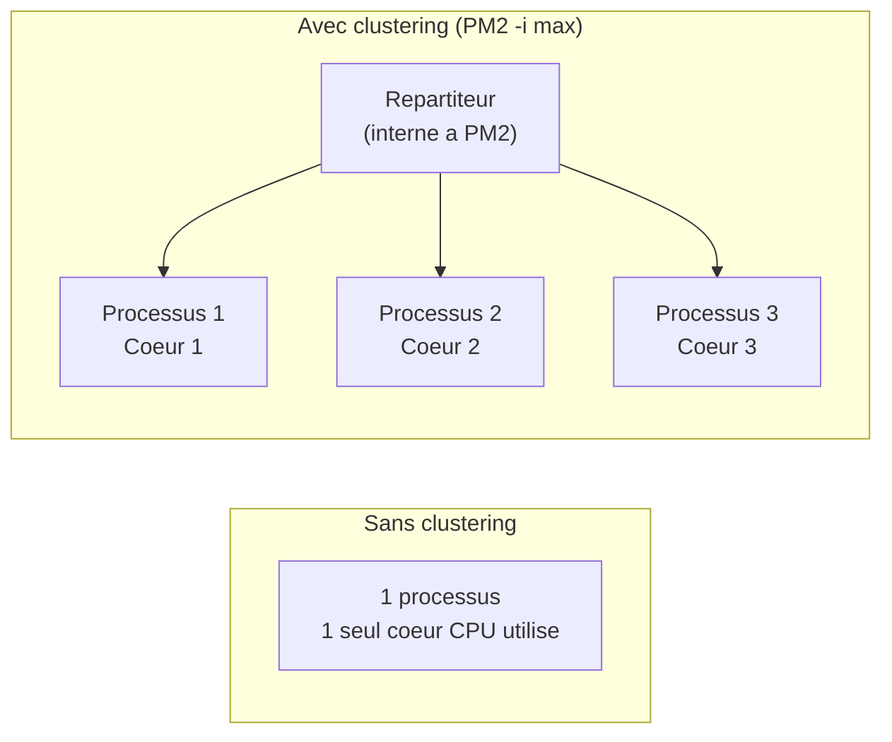

<div class="chapitre-titre-num">CHAPITRE 40</div>

# Bonnes pratiques et optimisation des performances

<div class="encadre objectif">
<span class="encadre-titre">🎯 Objectif du chapitre</span>
Consolider les bonnes pratiques transversales d'un projet Node.js professionnel, et identifier les leviers de performance les plus impactants avant le projet final. À la fin de ce chapitre, tu disposeras d'une checklist complète à appliquer avant toute mise en production, et d'une méthode pour prioriser tes optimisations plutôt que de deviner.
</div>

<div class="encadre scenario">
<span class="encadre-titre">🎬 Mise en situation</span>
Un client s'inquiète : son API répond de plus en plus lentement à mesure que sa base d'utilisateurs grandit, et te demande de "l'optimiser". Un développeur junior aurait le réflexe d'ajouter du cache partout, de réécrire des boucles en une seule ligne dense, ou de proposer une réécriture complète en microservices. Avant de toucher une seule ligne de code, ce chapitre pose la question qui devrait toujours venir en premier : **où, précisément, se trouve le ralentissement mesuré** ? Optimiser sans mesurer, c'est parier — et les paris sont rarement le bon usage du temps facturé à un client.
</div>

## 40.1 Ne jamais bloquer l'event loop (rappel critique du chapitre 1)

```js
// ❌ Bloque le thread principal : TOUTES les requêtes en attente sont gelées pendant ce calcul
function estNombrePremierSync(n) {
  for (let i = 2; i < n; i++) {
    if (n % i === 0) return false;
  }
  return true;
}
```

<div class="encadre astuce">
<span class="encadre-titre">💡 Déplacer un calcul lourd hors du thread principal</span>
Pour un calcul réellement intensif (traitement d'image, calcul cryptographique lourd), le module natif **`worker_threads`** exécute le code dans un thread séparé, sans bloquer le thread principal qui continue à traiter les autres requêtes normalement.
</div>

```js
const { Worker } = require("worker_threads");

function calculerEnArrierePlan(donnees) {
  return new Promise((resolve, reject) => {
    const worker = new Worker("./calcul-lourd.worker.js", { workerData: donnees });
    worker.on("message", resolve);
    worker.on("error", reject);
  });
}
```

## 40.2 Compression des réponses HTTP

```
$ npm install compression
```

```js
const compression = require("compression");
app.use(compression()); // compresse les réponses (gzip/brotli), réduisant la bande passante transférée
```

## 40.3 Mise en cache avec Redis

```js
const redis = require("redis");
const client = redis.createClient({ url: process.env.REDIS_URL });
await client.connect();

async function obtenirProduitsAvecCache() {
  const cache = await client.get("produits:tous");
  if (cache) {
    return JSON.parse(cache); // évite une requête base de données si le cache est encore valide
  }

  const produits = await ProduitRepository.listerTous();
  await client.setEx("produits:tous", 60, JSON.stringify(produits)); // expire après 60 secondes
  return produits;
}
```

<div class="encadre attention">
<span class="encadre-titre">⚠️ Invalider le cache lors des écritures, sinon des données obsolètes persistent</span>

```js
async function creerProduit(donnees) {
  const produit = await ProduitRepository.creer(donnees);
  await client.del("produits:tous"); // invalide le cache : la prochaine lecture rechargera les données FRAÎCHES
  return produit;
}
```
Un cache jamais invalidé après une écriture affiche des données **périmées** aux utilisateurs suivants, jusqu'à l'expiration naturelle — toujours invalider (ou mettre à jour) le cache concerné après toute modification des données sous-jacentes.
</div>

## 40.4 Index de base de données (rappel transversal)

<div class="encadre astuce">
<span class="encadre-titre">💡 Le levier de performance le plus impactant, souvent négligé</span>
Rappel des manuels React et Java de ce même auteur : un index sur les colonnes fréquemment utilisées dans un `WHERE` ou une jointure peut transformer une requête de plusieurs secondes en quelques millisecondes, sur une table volumineuse. C'est souvent le premier levier à vérifier face à un problème de performance, avant d'envisager du cache ou de la mise à l'échelle horizontale.
</div>

## 40.5 Pool de connexions dimensionné correctement

<div class="encadre attention">
<span class="encadre-titre">⚠️ Un pool trop petit limite la concurrence ; un pool trop grand épuise les ressources de la base</span>
Un pool de connexions (chapitres 31-32, 34) trop restreint (`max: 5`) limite artificiellement le nombre de requêtes traitées simultanément, même si le serveur pourrait en gérer davantage. À l'inverse, un pool trop large sur plusieurs instances de l'application peut épuiser le nombre maximal de connexions autorisées par le SGBD lui-même. Un dimensionnement adapté à la charge réelle attendue (mesuré, pas deviné) est nécessaire.
</div>

## 40.6 Clustering et scaling horizontal



## 40.7 Compresser et minifier ne suffit pas : mesurer d'abord

<div class="encadre astuce">
<span class="encadre-titre">💡 Toujours mesurer avant d'optimiser (rappel transversal des manuels précédents)</span>
Avant d'appliquer la moindre optimisation, mesurer où se trouve réellement le goulot d'étranglement : le temps de réponse est-il dominé par la base de données (ajouter des index), par la sérialisation JSON de grosses réponses (paginer davantage), par un calcul CPU (déplacer vers un worker), ou par un service externe lent (mettre en cache) ? Optimiser à l'aveugle gaspille du temps sur des axes qui n'ont, en réalité, qu'un impact marginal — exactement le piège que le développeur junior de la mise en situation d'ouverture aurait risqué de commettre.
</div>

<div class="encadre retenir">
<span class="encadre-titre">📌 À retenir</span>
Ordre de priorité recommandé face à un ralentissement mesuré : (1) index de base de données manquants (souvent la cause la plus fréquente et la moins chère à corriger), (2) requêtes N+1 non résolues (rappel du chapitre 34), (3) pagination absente ou mal dimensionnée (chapitre 21), (4) cache pour les lectures coûteuses et peu volatiles, (5) mise à l'échelle horizontale (clustering, plusieurs instances) — dans cet ordre, jamais l'inverse.
</div>

## 40.8 Bonnes pratiques transversales récapitulées

<div class="encadre astuce">
<span class="encadre-titre">💡 Checklist avant la mise en production d'une API</span>
- Architecture en couches respectée (Route → Contrôleur → Service → Repository, chapitre 17).
- Toutes les entrées validées (chapitre 18), aucune confiance aveugle dans les données client.
- Gestion d'erreurs centralisée (chapitre 19), aucune stack trace exposée en production.
- Journalisation structurée (chapitre 20), sans données sensibles.
- Authentification JWT + RBAC (chapitres 23-24) sur toutes les routes sensibles, jamais basé sur des données envoyées par le client.
- Helmet, CORS restreint, Rate Limiting (chapitre 25) activés.
- Tests unitaires et d'intégration (chapitres 29-30) couvrant la logique critique.
- Migrations de base de données versionnées et appliquées via `migrate deploy` (chapitre 34, 39), jamais de synchronisation automatique en production.
- Variables d'environnement externalisées (chapitre 12), aucun secret dans le code ou dans l'image Docker.
</div>

## Atelier — Diagnostiquer avant d'optimiser

<div class="encadre exercice">
<span class="encadre-titre">🛠️ Atelier 40 — Répondre correctement au client de la mise en situation</span>

**Objectif** : appliquer une démarche de diagnostic méthodique plutôt qu'une optimisation réflexe.

**Préparation** : une API avec une base de données de test contenant un volume significatif de données (plusieurs dizaines de milliers de lignes), et un endpoint de listing volontairement lent.

**Étapes détaillées** :
1. Mesure le temps de réponse actuel de l'endpoint concerné.
2. Active les logs de requêtes (Prisma, chapitre 34) pour identifier un éventuel N+1.
3. Vérifie la présence d'index sur les colonnes utilisées dans les filtres/tris de la requête.
4. Vérifie si une pagination est en place (chapitre 21), ou si l'endpoint charge l'intégralité des données à chaque appel.
5. Applique uniquement la correction correspondant à la cause réellement identifiée, puis remesure.

**Validation** : le temps de réponse doit s'améliorer de façon mesurable après la correction ciblée, confirmant que la cause identifiée était la bonne.

**Résultat attendu** : une réponse au client de la mise en situation d'ouverture appuyée sur des chiffres mesurés, pas sur une intuition — exactement la posture professionnelle attendue.

**Dépannage** : si l'amélioration n'est pas mesurable après la correction, reprends le diagnostic — la cause identifiée n'était probablement pas la bonne.

**Nettoyage** : aucun.
</div>

## Erreurs fréquentes

<div class="encadre attention">
<span class="encadre-titre">⚠️ Erreur n°1 — Optimiser prématurément au détriment de la lisibilité</span>
Réécrire un code parfaitement clair en une version "optimisée" mais illisible, sans avoir mesuré de problème de performance réel, dégrade la maintenabilité pour un bénéfice hypothétique. La priorité reste un code clair et bien architecturé ; l'optimisation ciblée n'intervient qu'une fois un vrai goulot d'étranglement mesuré.
</div>

<div class="encadre attention">
<span class="encadre-titre">⚠️ Erreur n°2 — Ajouter du cache avant d'avoir identifié la vraie cause</span>
Exactement le réflexe à éviter dans la mise en situation d'ouverture — le cache masque un symptôme sans corriger la cause sous-jacente (souvent un index manquant ou un N+1), et introduit sa propre complexité (invalidation, données potentiellement obsolètes).
</div>

## Débogage

<div class="encadre attention">
<span class="encadre-titre">🩺 Symptôme : un endpoint devient de plus en plus lent à mesure que les données grandissent</span>

- **Cause probable** : absence d'index sur une colonne filtrée/triée fréquemment, ou pagination absente (rappel des chapitres 21 et 34).
- **Diagnostic** : suivre la méthode de l'atelier 40 (logs de requêtes, vérification d'index, vérification de pagination) avant toute correction.
- **Solution** : appliquer uniquement la correction correspondant à la cause identifiée.
</div>

## En entreprise

- **Outils de profilage en production** : de nombreuses équipes utilisent des outils d'APM (*Application Performance Monitoring*, comme Datadog ou New Relic) pour identifier précisément les endpoints et requêtes les plus lents en conditions réelles, plutôt que de deviner.
- **Revue de performance avant mise à l'échelle** : avant d'investir dans plus de serveurs (scaling horizontal), une équipe mature vérifie systématiquement que les leviers "gratuits" (index, N+1, pagination) ont déjà été exploités.

## Entretien technique

<div class="encadre exercice">
<span class="encadre-titre">💼 Questions fréquemment posées en entretien</span>

**Q1. "Un client se plaint que son API est lente. Quelle est ta première action ?"**
Réponse attendue : mesurer précisément où se situe le ralentissement (base de données, calcul CPU, service externe, sérialisation) avant toute optimisation — jamais appliquer une solution générique sans diagnostic préalable.

**Q2. "Quel est généralement le levier de performance le plus rentable à vérifier en premier ?"**
Réponse attendue : les index de base de données manquants sur les colonnes utilisées dans les filtres et jointures fréquents — souvent la cause la plus fréquente et la moins coûteuse à corriger.

**Q3. "Pourquoi le cache n'est-il pas toujours la bonne première réponse à un problème de lenteur ?"**
Réponse attendue : le cache masque un symptôme sans corriger la cause sous-jacente, introduit une complexité d'invalidation, et risque d'exposer des données obsolètes si mal géré — à réserver aux cas où la cause réelle (souvent un index manquant ou un N+1) a déjà été traitée ou n'est pas praticable à corriger directement.
</div>

## Optimisation, sécurité et maintenabilité

<div class="encadre performance">
<span class="encadre-titre">🚀 Performance</span>
La checklist de la section 40.8 devrait être vérifiée systématiquement avant chaque mise en production, pas seulement à la création initiale du projet — les régressions de performance s'accumulent souvent silencieusement au fil des évolutions.
</div>

<div class="encadre bonne-pratique">
<span class="encadre-titre">✅ Maintenabilité</span>
Documenter, pour chaque optimisation appliquée, la mesure "avant" et "après" qui l'a justifiée — une trace précieuse pour comprendre plus tard pourquoi une décision technique a été prise, et éviter de la défaire par erreur.
</div>

## Résumé du chapitre

- Ne jamais bloquer l'event loop avec un calcul lourd synchrone ; déléguer à `worker_threads` si nécessaire.
- La compression HTTP, le cache Redis (avec invalidation systématique), et les index de base de données sont les leviers de performance les plus rentables.
- PM2 en mode cluster (ou plusieurs instances Docker) exploite le parallélisme matériel malgré le modèle mono-thread de Node.js.
- Toujours mesurer avant d'optimiser ; ne jamais sacrifier la lisibilité pour une optimisation non mesurée.
- Prioriser les corrections dans l'ordre : index manquants, N+1, pagination, cache, puis mise à l'échelle horizontale.

## Quiz

<div class="encadre exercice">
<span class="encadre-titre">📝 QCM</span>

1. Que faire en premier face à une API lente ?
   - a) Ajouter du cache partout immédiatement
   - b) Mesurer précisément où se situe le ralentissement
   - c) Réécrire le projet en microservices
   - d) Augmenter le nombre de serveurs

2. Quel est souvent le levier de performance le plus rentable à vérifier en premier ?
   - a) Les index de base de données manquants
   - b) La compression HTTP
   - c) Le nombre de commentaires dans le code
   - d) La version de Node.js utilisée

3. Pourquoi un cache non invalidé après une écriture est-il un problème ?
   - a) Ce n'est jamais un problème
   - b) Il affiche des données obsolètes aux utilisateurs suivants
   - c) Cela ralentit systématiquement l'application
   - d) Cela provoque des erreurs de syntaxe

**Corrigé** : 1-b, 2-a, 3-b.
</div>

<div class="encadre exercice">
<span class="encadre-titre">📝 Vrai ou Faux</span>

1. Il faut toujours optimiser un code, même sans problème de performance mesuré. — **Faux**.
2. Un pool de connexions trop grand peut épuiser les ressources de la base de données. — **Vrai**.
3. worker_threads permet d'exécuter un calcul lourd sans bloquer le thread principal. — **Vrai**.
</div>

<div class="encadre exercice">
<span class="encadre-titre">📝 Question ouverte</span>

Pourquoi la réponse "ajoutons du cache Redis partout" au client de la mise en situation d'ouverture serait-elle potentiellement une mauvaise décision professionnelle, même si elle "fonctionne" en apparence ?

**Corrigé** : sans diagnostic préalable, le cache masquerait peut-être un problème structurel plus profond (un index manquant, un N+1) qui continuerait à dégrader les performances pour toute requête non couverte par le cache, et qui referait surface dès que les données changent plus vite que la durée de vie du cache. Cette approche ajoute aussi une complexité durable (gestion de l'invalidation, risque de données obsolètes) pour un bénéfice potentiellement inférieur à une correction directe de la cause réelle — un temps facturé au client qui n'aurait pas résolu le problème de fond, seulement retardé sa réapparition.
</div>

## Exercices

<div class="encadre exercice">
<span class="encadre-titre">📝 Exercice 40.1</span>

Ajoute un cache Redis (60 secondes) à une fonction `obtenirStatistiquesDashboard()`, avec invalidation explicite lors de la création d'une nouvelle vente.
</div>

**Corrigé :**
```js
async function obtenirStatistiquesDashboard() {
  const cache = await client.get("dashboard:stats");
  if (cache) return JSON.parse(cache);

  const stats = await calculerStatistiques(); // requête coûteuse
  await client.setEx("dashboard:stats", 60, JSON.stringify(stats));
  return stats;
}

async function creerVente(donnees) {
  const vente = await VenteRepository.creer(donnees);
  await client.del("dashboard:stats"); // invalide le cache : les stats seront recalculées à la prochaine lecture
  return vente;
}
```

## Checklist de fin de chapitre

<ul class="checklist">
<li>☐ Je mesure toujours avant d'optimiser, jamais à l'aveugle.</li>
<li>☐ Je connais l'ordre de priorité des leviers de performance (index, N+1, pagination, cache, scaling).</li>
<li>☐ Je sais invalider un cache Redis correctement après une écriture.</li>
<li>☐ Je sais utiliser worker_threads pour un calcul CPU intensif.</li>
<li>☐ J'applique la checklist de mise en production avant chaque déploiement.</li>
</ul>

## FAQ

<dl class="faq">
<dt>Faut-il toujours du Redis dès le premier projet ?</dt>
<dd>Non, ce serait disproportionné pour un projet à faible trafic — introduire du cache seulement une fois qu'un besoin de performance réel et mesuré le justifie, cohérent avec la démarche de ce chapitre.</dd>

<dt>worker_threads et le clustering (PM2) résolvent-ils le même problème ?</dt>
<dd>Non : `worker_threads` déporte un calcul lourd hors du thread principal d'un même processus ; le clustering démarre plusieurs processus complets pour exploiter plusieurs cœurs CPU et répartir la charge globale de requêtes — complémentaires, pas interchangeables.</dd>

<dt>Comment savoir si mon pool de connexions est correctement dimensionné ?</dt>
<dd>Surveiller le taux d'attente pour obtenir une connexion (`connectionTimeoutMillis` atteint fréquemment = pool trop petit) et le nombre de connexions actives comparé à la limite maximale du SGBD (proche de la limite = pool trop grand pour le nombre d'instances déployées).</dd>
</dl>

## Références et pour aller plus loin

- Documentation Node.js sur worker_threads : [https://nodejs.org/api/worker_threads.html](https://nodejs.org/api/worker_threads.html)
- Documentation Redis : [https://redis.io/docs/](https://redis.io/docs/)
- Guide de performance Node.js (communauté) : [https://github.com/goldbergyoni/nodebestpractices#6-performance-best-practices](https://github.com/goldbergyoni/nodebestpractices)

*Ceci clôt la Partie 9 (conteneurisation et déploiement). Chapitre suivant : le projet final MediAPI, qui assemble l'ensemble des 40 chapitres précédents dans une API complète de gestion hospitalière.*
