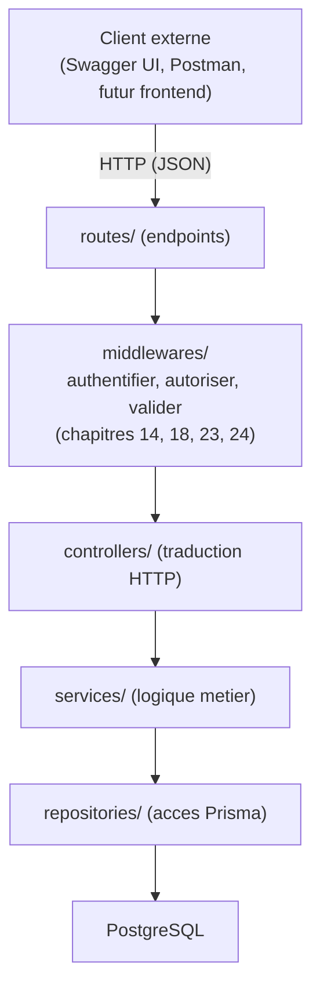
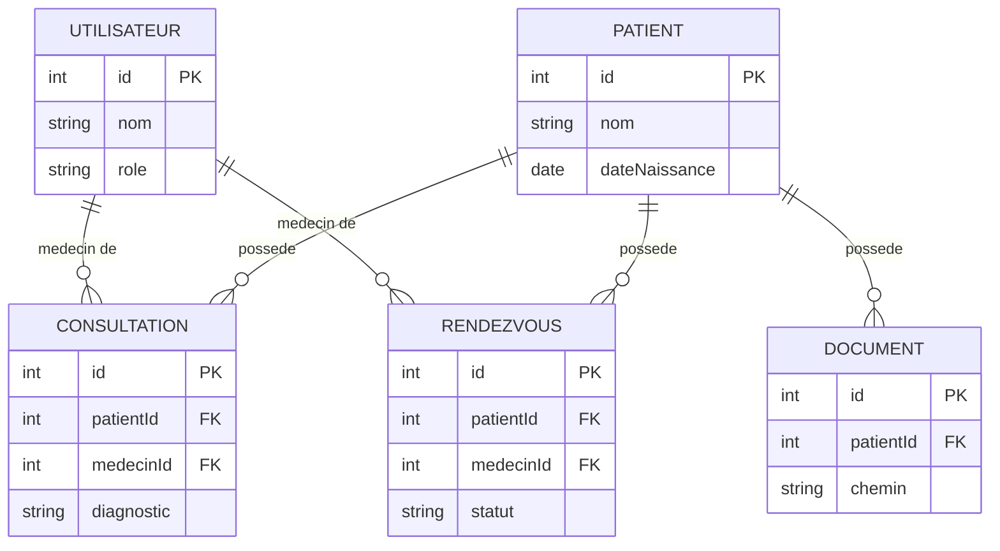
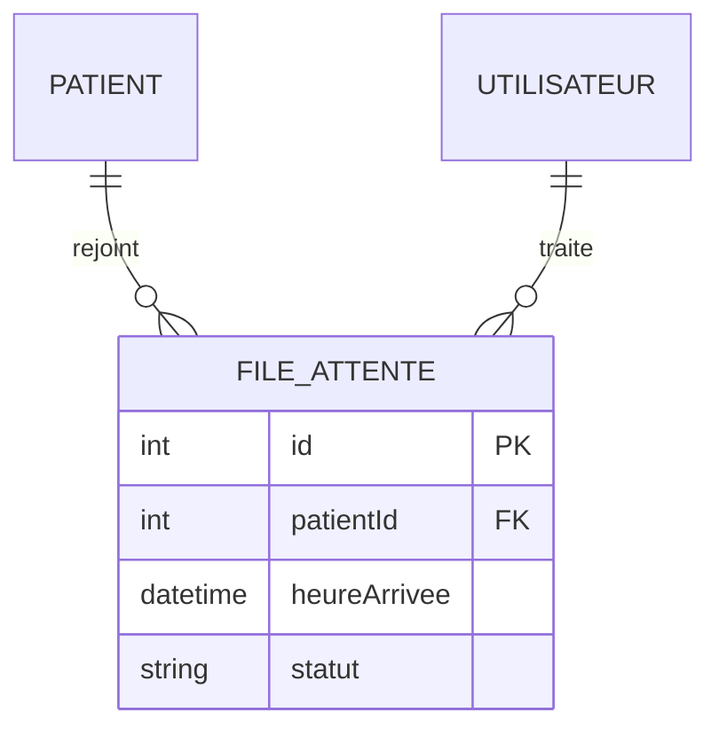

<div class="chapitre-titre-num">CHAPITRE 41</div>

# Projet final — Cahier des charges et architecture (MediAPI)

<div class="encadre objectif">
<span class="encadre-titre">🎯 Objectif du chapitre</span>
Assembler l'ensemble des 40 chapitres précédents dans un projet complet et cohérent : une API REST de gestion hospitalière, avec authentification, rôles, CRUD complets, base de données relationnelle, upload de fichiers, rapports, documentation et tests. À la fin de ce chapitre, tu auras un plan d'architecture complet, prêt à être implémenté chapitre par chapitre jusqu'au déploiement final.
</div>

<div class="encadre scenario">
<span class="encadre-titre">🎬 Mise en situation</span>
Une petite clinique privée haïtienne te contacte : elle gère encore ses patients, consultations et rendez-vous sur papier et dans des feuilles Excel dispersées. Le médecin-directeur veut une vraie application, mais avec un budget limité — pas de refonte complète du système de santé national, juste un outil solide pour sa clinique. C'est exactement le genre de mission freelance réaliste que ce manuel prépare : un cahier des charges clair, une stack éprouvée, une architecture qui a fait ses preuves sur les 40 chapitres précédents. Les 6 chapitres qui suivent construisent cette application, MediAPI, jusqu'à son déploiement complet.
</div>

## 41.1 Présentation : MediAPI

**MediAPI** est une API REST de gestion hospitalière couvrant : authentification et gestion des utilisateurs (rôles ADMIN, MEDECIN, RECEPTIONNISTE), gestion des patients, des consultations, des rendez-vous, upload de documents médicaux, génération de rapports d'activité, documentation Swagger complète et suite de tests.

<div class="encadre astuce">
<span class="encadre-titre">💡 Un domaine délibérément proche d'un projet réel</span>
Ce choix de domaine (gestion hospitalière) reprend la structure d'un système de gestion médicale réel : patients, consultations en plusieurs étapes, rendez-vous, dossiers documentaires — suffisamment riche pour mobiliser l'ensemble des concepts du manuel, sans la complexité d'un système de production complet.
</div>

## 41.2 Cahier des charges fonctionnel

1. **Authentification** : inscription (réservée à l'admin pour créer des comptes staff), connexion, rafraîchissement de session (chapitre 23).
2. **Rôles** : `ADMIN` (gestion complète), `MEDECIN` (patients, consultations), `RECEPTIONNISTE` (patients, rendez-vous) — chapitre 24.
3. **Patients** : CRUD complet, recherche, pagination (chapitre 21).
4. **Consultations** : création liée à un patient et un médecin, historique, diagnostic, prescriptions.
5. **Rendez-vous** : planification, statut (planifié/confirmé/annulé/terminé).
6. **Documents médicaux** : upload de fichiers (résultats d'examens, ordonnances scannées) liés à un patient (chapitre 26).
7. **Rapports** : statistiques d'activité (consultations par période, par médecin) — chapitre 21 combiné aux agrégations Prisma.
8. **Documentation** : Swagger complet sur toutes les routes (chapitre 28).
9. **Tests** : unitaires sur les services critiques, intégration sur les routes principales (chapitres 29-30).

<div class="encadre retenir">
<span class="encadre-titre">📌 À retenir</span>
Ce cahier des charges tient volontairement en 9 points clairs — exactement le niveau de précision qu'un vrai client comme la clinique de la mise en situation d'ouverture peut fournir sans expertise technique. Traduire ce langage métier en architecture technique concrète (le reste de ce chapitre) est une compétence à part entière, aussi importante que l'implémentation elle-même.
</div>

## 41.3 Stack technique retenue

| Couche | Choix | Chapitre de référence |
|---|---|---|
| Runtime | Node.js 20 LTS | 1-2 |
| Framework | Express.js | 13-19 |
| Validation | Zod | 18 |
| Authentification | JWT (access + refresh) | 23 |
| Base de données | PostgreSQL | 31 |
| ORM | Prisma | 34 |
| Upload | Multer (stockage local pour ce projet) | 26 |
| Documentation | Swagger/OpenAPI | 28 |
| Tests | Jest + Supertest | 29-30 |
| Conteneurisation | Docker + Docker Compose | 37-38 |

<div class="encadre astuce">
<span class="encadre-titre">💡 Pourquoi PostgreSQL plutôt que MongoDB pour ce projet</span>
Rappel du chapitre 33 : des données médicales sont fortement relationnelles (un patient a plusieurs consultations, chacune liée à un médecin précis, avec des contraintes d'intégrité importantes) — exactement le profil pour lequel le modèle relationnel (chapitre 31) surpasse un modèle documents.
</div>

## 41.4 Architecture des dossiers

```
mediapi/
├── src/
│   ├── config/
│   │   ├── prisma.js
│   │   ├── logger.js
│   │   └── swagger.js
│   ├── modele/                  (schéma Prisma, section 41.6)
│   ├── controllers/
│   │   ├── auth.controller.js
│   │   ├── patients.controller.js
│   │   ├── consultations.controller.js
│   │   ├── rendezvous.controller.js
│   │   ├── documents.controller.js
│   │   └── rapports.controller.js
│   ├── services/
│   │   ├── auth.service.js
│   │   ├── patients.service.js
│   │   ├── consultations.service.js
│   │   ├── rendezvous.service.js
│   │   └── rapports.service.js
│   ├── repositories/
│   │   ├── utilisateurs.repository.js
│   │   ├── patients.repository.js
│   │   ├── consultations.repository.js
│   │   └── rendezvous.repository.js
│   ├── routes/
│   │   ├── auth.routes.js
│   │   ├── patients.routes.js
│   │   ├── consultations.routes.js
│   │   ├── rendezvous.routes.js
│   │   ├── documents.routes.js
│   │   └── rapports.routes.js
│   ├── middlewares/
│   │   ├── authentifier.middleware.js
│   │   ├── autoriser.middleware.js
│   │   ├── valider.middleware.js
│   │   └── erreur.middleware.js
│   ├── validators/
│   │   ├── auth.validator.js
│   │   ├── patients.validator.js
│   │   └── consultations.validator.js
│   ├── errors/
│   │   └── index.js
│   ├── utils/
│   │   └── asyncHandler.js
│   └── app.js
├── prisma/
│   ├── schema.prisma
│   └── migrations/
├── tests/
│   ├── unit/
│   └── integration/
├── uploads/
├── Dockerfile
├── docker-compose.yml
├── .env.example
├── package.json
└── server.js
```

## 41.5 Diagramme d'architecture global



## 41.6 Modèle de données (aperçu, détaillé au chapitre 44)



<div class="encadre astuce">
<span class="encadre-titre">💡 Explication du schéma</span>
Ce modèle entité-relation traduit directement le cahier des charges de la section 41.2 : un `Utilisateur` (médecin) peut être lié à plusieurs `Consultation` et `RendezVous` ; un `Patient` possède ses propres consultations, rendez-vous et documents — chaque relation reflète une règle métier réelle exprimée par la clinique de la mise en situation d'ouverture (un médecin suit plusieurs patients, un patient a un historique de consultations).
</div>

## 41.7 Découpage des chapitres suivants

- **Chapitre 42** : authentification et gestion des utilisateurs/rôles.
- **Chapitre 43** : CRUD complets (patients, consultations, rendez-vous).
- **Chapitre 44** : schéma Prisma complet et migrations.
- **Chapitre 45** : upload de documents et génération de rapports.
- **Chapitre 46** : documentation Swagger et suite de tests.
- **Chapitre 47** : conteneurisation Docker et déploiement final.

## Atelier — Poser le squelette du projet MediAPI

<div class="encadre exercice">
<span class="encadre-titre">🛠️ Atelier 41 — Démarrer MediAPI comme un vrai projet client</span>

**Objectif** : créer le squelette complet du projet, prêt à recevoir le code des chapitres suivants — exactement la première étape que tu ferais pour la clinique de la mise en situation d'ouverture.

**Préparation** : Node.js installé (chapitre 2), un terminal.

**Étapes détaillées** :
1. Crée le dossier `mediapi/` et initialise npm (`npm init -y`).
2. Crée l'intégralité de l'arborescence de la section 41.4 (dossiers vides avec `.gitkeep` si nécessaire).
3. Installe les dépendances principales de la stack (section 41.3) : `express`, `zod`, `jsonwebtoken`, `bcrypt`, `@prisma/client`, `prisma` (dev), `multer`, `swagger-jsdoc`, `swagger-ui-express`, `jest` (dev), `supertest` (dev).
4. Crée `.env.example` documentant les variables attendues (`DATABASE_URL`, `JWT_ACCESS_SECRET`, `JWT_REFRESH_SECRET`, `PORT`).
5. Initialise Git et fais un premier commit avec ce squelette.

**Validation** : `npm install` doit s'exécuter sans erreur, et l'arborescence doit correspondre exactement à la section 41.4.

**Résultat attendu** : un projet vide mais entièrement structuré, prêt pour le chapitre 42 (authentification), sans qu'aucune réorganisation ne soit nécessaire plus tard.

**Dépannage** : si une dépendance échoue à s'installer, vérifie la version de Node.js active (`node -v`, rappel du chapitre 2) — certaines dépendances récentes exigent une version LTS relativement récente.

**Nettoyage** : aucun, ce squelette sert de base à tous les chapitres suivants.
</div>

## Erreurs fréquentes

<div class="encadre attention">
<span class="encadre-titre">⚠️ Erreur n°1 — Commencer à coder avant d'avoir clarifié le cahier des charges</span>
Se lancer directement dans l'implémentation sans avoir traduit clairement les besoins métier (comme la section 41.2) en architecture technique mène souvent à des refontes coûteuses en cours de route — exactement l'étape que ce chapitre formalise avant tout code.
</div>

<div class="encadre attention">
<span class="encadre-titre">⚠️ Erreur n°2 — Sous-dimensionner l'architecture pour un projet "juste pour un client"</span>
Le réflexe de simplifier excessivement l'architecture parce qu'il s'agit d'"un petit projet client" (comme la clinique de la mise en situation d'ouverture) mène souvent à devoir tout refactoriser dès la première fonctionnalité imprévue — l'architecture en couches (chapitre 17) ne coûte pas significativement plus cher à mettre en place dès le départ, quelle que soit la taille apparente du projet.
</div>

## Débogage

<div class="encadre attention">
<span class="encadre-titre">🩺 Symptôme : incertitude sur où placer un nouveau fichier au fil du projet</span>

- **Cause** : arborescence non posée clairement dès le départ (rappel du chapitre 5).
- **Solution** : toujours se référer à l'arborescence de la section 41.4 comme source de vérité, l'ajuster consciemment si un besoin non anticipé apparaît, plutôt que d'improviser au cas par cas.
</div>

## En entreprise

- **Cahier des charges avant code, systématiquement** : même pour un projet modeste, une phase de clarification des besoins (comme la section 41.2) évite la majorité des refontes coûteuses en cours de développement.
- **Réutilisation de patterns éprouvés entre projets** : l'architecture de MediAPI reprend délibérément les mêmes conventions que les 40 chapitres précédents — exactement la façon dont une agence ou un freelance expérimenté réutilise une architecture éprouvée d'un projet à l'autre, plutôt que de repartir de zéro à chaque mission.

## Entretien technique

<div class="encadre exercice">
<span class="encadre-titre">💼 Questions fréquemment posées en entretien</span>

**Q1. "Comment structurerais-tu l'architecture d'un nouveau projet Node.js à partir d'un cahier des charges client ?"**
Réponse attendue : traduire chaque besoin fonctionnel en modèle de données et endpoints, choisir la stack selon les contraintes réelles (type de données, besoin de flexibilité de schéma), et poser l'architecture en couches avant tout code — exactement la démarche de ce chapitre.

**Q2. "Pourquoi documenter un diagramme d'architecture avant de coder ?"**
Réponse attendue : il sert de référence partagée pour toute l'équipe (ou pour soi-même plus tard), révèle les incohérences de conception avant qu'elles ne coûtent cher en refactorisation, et facilite l'onboarding d'un nouveau développeur sur le projet.

**Q3. "Comment choisirais-tu entre PostgreSQL et MongoDB pour un nouveau projet de gestion (patients, commandes, etc.) ?"**
Réponse attendue : évaluer si les données sont fortement relationnelles avec des contraintes d'intégrité importantes (PostgreSQL) ou naturellement hiérarchiques avec un besoin de flexibilité de schéma (MongoDB) — rappel des chapitres 31 et 33.
</div>

## Optimisation, sécurité et maintenabilité

<div class="encadre bonne-pratique">
<span class="encadre-titre">✅ Maintenabilité</span>
Documenter les décisions d'architecture (comme le choix de PostgreSQL plutôt que MongoDB, section 41.3) directement dans le projet (README ou fichier dédié) — une décision non documentée est une décision qu'un futur développeur devra deviner ou remettre en question sans contexte.
</div>

## Résumé du chapitre

- MediAPI assemble l'ensemble des concepts des 40 chapitres précédents dans une API de gestion hospitalière cohérente.
- L'architecture en couches (routes → middlewares → contrôleurs → services → repositories → PostgreSQL/Prisma) structure tout le projet.
- Le modèle de données relationnel reflète directement les besoins métier du cahier des charges.
- Les 6 chapitres suivants construisent MediAPI fonctionnalité par fonctionnalité, jusqu'au déploiement Docker complet.

## Quiz

<div class="encadre exercice">
<span class="encadre-titre">📝 QCM</span>

1. Pourquoi PostgreSQL a-t-il été choisi plutôt que MongoDB pour MediAPI ?
   - a) MongoDB n'existe pas pour Node.js
   - b) Les données médicales sont fortement relationnelles avec des contraintes d'intégrité importantes
   - c) PostgreSQL est toujours plus rapide
   - d) Aucune raison particulière

2. Combien de rôles distincts le cahier des charges de MediAPI définit-il ?
   - a) 2
   - b) 3
   - c) 5
   - d) 1

3. Quelle couche gère l'accès direct à Prisma dans l'architecture de MediAPI ?
   - a) Les contrôleurs
   - b) Les repositories
   - c) Les middlewares
   - d) Les routes

**Corrigé** : 1-b, 2-b (ADMIN, MEDECIN, RECEPTIONNISTE), 3-b.
</div>

<div class="encadre exercice">
<span class="encadre-titre">📝 Vrai ou Faux</span>

1. MediAPI utilise le modèle access/refresh token vu au chapitre 23. — **Vrai**.
2. L'architecture de MediAPI diffère fondamentalement de celle enseignée dans les chapitres précédents. — **Faux** (elle réutilise exactement les mêmes conventions).
3. Il est recommandé de commencer à coder avant de clarifier le cahier des charges. — **Faux**.
</div>

<div class="encadre exercice">
<span class="encadre-titre">📝 Question ouverte</span>

Le médecin-directeur de la clinique de la mise en situation d'ouverture demande, en cours de projet, d'ajouter un module de facturation. Comment l'architecture posée dans ce chapitre facilite-t-elle cet ajout ?

**Corrigé** : l'architecture en couches (routes → middlewares → contrôleurs → services → repositories) et l'organisation par domaine métier (un dossier/fichier par ressource) permettent d'ajouter un nouveau module `facturation/` en suivant exactement le même patron que les modules existants (`patients/`, `consultations/`...), sans avoir à modifier la structure globale ni les modules déjà en place — exactement le bénéfice d'une architecture pensée dès le départ plutôt qu'improvisée au fil de l'eau.
</div>

## Exercices

<div class="encadre exercice">
<span class="encadre-titre">📝 Exercice 41.1</span>

Le médecin-directeur souhaite ajouter une fonctionnalité de "liste d'attente" (patients en attente d'une consultation le jour même, sans rendez-vous préalable). Propose l'ajout nécessaire au modèle de données (section 41.6) et au cahier des charges (section 41.2), sans encore l'implémenter.
</div>

**Corrigé (exemple de proposition) :**
```
10. Liste d'attente : un patient peut être ajouté à une file d'attente du jour,
    sans rendez-vous préalable, avec une position et une heure d'arrivée.
```


## Checklist de fin de chapitre

<ul class="checklist">
<li>☐ Je comprends le cahier des charges complet de MediAPI.</li>
<li>☐ Je sais justifier chaque choix de la stack technique retenue.</li>
<li>☐ J'ai créé le squelette complet du projet (atelier 41).</li>
<li>☐ Je comprends le modèle de données et ses relations principales.</li>
<li>☐ Je sais situer chaque chapitre suivant (42-47) dans la construction du projet.</li>
</ul>

## FAQ

<dl class="faq">
<dt>Pourquoi ne pas commencer directement à coder les fonctionnalités sans ce chapitre de cadrage ?</dt>
<dd>Un cahier des charges et une architecture posés avant le code évitent la majorité des refontes coûteuses en cours de projet — exactement la valeur ajoutée d'un développeur expérimenté face à un client, au-delà de la seule capacité à écrire du code.</dd>

<dt>MediAPI est-il un projet "jouet" ou représentatif d'un vrai projet freelance ?</dt>
<dd>Volontairement représentatif : la clinique de la mise en situation d'ouverture est un profil de client réaliste pour une mission freelance en Haïti — un cahier des charges clair, un budget limité, des besoins concrets plutôt que des fonctionnalités superflues.</dd>

<dt>Faut-il suivre exactement cette architecture, ou peut-on l'adapter ?</dt>
<dd>Cette architecture reflète les bonnes pratiques enseignées dans ce manuel, mais reste adaptable selon le contexte réel d'un projet — l'essentiel est de comprendre le raisonnement derrière chaque choix, pas de la suivre aveuglément dans tous les contextes.</dd>
</dl>

## Références et pour aller plus loin

- Rappel des chapitres 5 et 17 (architecture de projet, architecture en couches) pour approfondir les fondations reprises ici.

*Chapitre suivant : authentification et gestion des utilisateurs/rôles, la fondation du projet MediAPI.*
