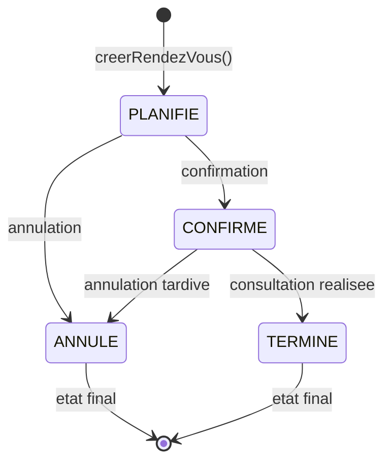

<div class="chapitre-titre-num">CHAPITRE 43</div>

# Projet final — CRUD complets

<div class="encadre objectif">
<span class="encadre-titre">🎯 Objectif du chapitre</span>
Implémenter les CRUD complets de MediAPI (patients, consultations, rendez-vous), en réutilisant l'architecture en couches des chapitres 15-17, et formaliser une machine à états pour les statuts de rendez-vous. À la fin de ce chapitre, MediAPI disposera de son cœur fonctionnel complet, prêt à recevoir upload et rapports (chapitre 45).
</div>

<div class="encadre scenario">
<span class="encadre-titre">🎬 Mise en situation</span>
Pendant les tests avec la réceptionniste de la clinique, elle marque par erreur un rendez-vous comme "Terminé" alors qu'il vient d'être "Annulé" par le patient au téléphone. Le médecin-directeur demande : "peut-on empêcher ce genre d'erreur de manipulation directement dans le système ?" C'est exactement le rôle d'une machine à états explicite : au lieu de laisser n'importe quel statut être modifié vers n'importe quel autre, ce chapitre formalise précisément quelles transitions sont autorisées — rendant l'erreur de la réceptionniste techniquement impossible, pas seulement une question de vigilance humaine.
</div>

## 43.1 Patients : repository, service, contrôleur

```js
// src/repositories/patients.repository.js
const prisma = require("../config/prisma");

async function creer(donnees) {
  return prisma.patient.create({ data: donnees });
}
async function trouverParId(id) {
  return prisma.patient.findUnique({ where: { id } });
}
async function rechercherEtLister({ recherche, page, limite }) {
  const filtres = recherche ? { nom: { contains: recherche, mode: "insensitive" } } : {};
  const [patients, total] = await Promise.all([
    prisma.patient.findMany({ where: filtres, skip: (page - 1) * limite, take: limite, orderBy: { nom: "asc" } }),
    prisma.patient.count({ where: filtres }),
  ]);
  return { patients, total };
}
async function modifier(id, donnees) {
  return prisma.patient.update({ where: { id }, data: donnees });
}
async function supprimer(id) {
  return prisma.patient.delete({ where: { id } });
}

module.exports = { creer, trouverParId, rechercherEtLister, modifier, supprimer };
```

```js
// src/services/patients.service.js
const PatientRepository = require("../repositories/patients.repository");
const { NonTrouveError } = require("../errors");

async function creerPatient(donnees) {
  return PatientRepository.creer(donnees);
}

async function obtenirPatient(id) {
  const patient = await PatientRepository.trouverParId(id);
  if (!patient) throw new NonTrouveError("Patient introuvable");
  return patient;
}

async function listerPatients({ recherche, page = 1, limite = 20 }) {
  const { patients, total } = await PatientRepository.rechercherEtLister({ recherche, page, limite });
  return { donnees: patients, pagination: { page, limite, total, totalPages: Math.ceil(total / limite) } };
}

async function modifierPatient(id, donnees) {
  await obtenirPatient(id); // vérifie l'existence avant modification (lève NonTrouveError sinon)
  return PatientRepository.modifier(id, donnees);
}

async function supprimerPatient(id) {
  await obtenirPatient(id);
  return PatientRepository.supprimer(id);
}

module.exports = { creerPatient, obtenirPatient, listerPatients, modifierPatient, supprimerPatient };
```

```js
// src/controllers/patients.controller.js
const asyncHandler = require("../utils/asyncHandler");
const PatientService = require("../services/patients.service");

const creer = asyncHandler(async (req, res) => {
  const patient = await PatientService.creerPatient(req.body);
  res.status(201).json(patient);
});

const obtenir = asyncHandler(async (req, res) => {
  const patient = await PatientService.obtenirPatient(Number(req.params.id));
  res.json(patient);
});

const lister = asyncHandler(async (req, res) => {
  const resultat = await PatientService.listerPatients({
    recherche: req.query.recherche,
    page: Number(req.query.page) || 1,
    limite: Number(req.query.limite) || 20,
  });
  res.json(resultat);
});

const modifier = asyncHandler(async (req, res) => {
  const patient = await PatientService.modifierPatient(Number(req.params.id), req.body);
  res.json(patient);
});

const supprimer = asyncHandler(async (req, res) => {
  await PatientService.supprimerPatient(Number(req.params.id));
  res.status(204).send();
});

module.exports = { creer, obtenir, lister, modifier, supprimer };
```

## 43.2 Consultations : logique métier avec relation patient + médecin

```js
// src/services/consultations.service.js
const ConsultationRepository = require("../repositories/consultations.repository");
const PatientService = require("./patients.service");

async function creerConsultation({ patientId, medecinId, motif, diagnostic, prescriptions }) {
  await PatientService.obtenirPatient(patientId); // vérifie que le patient existe réellement (lève NonTrouveError sinon)

  return ConsultationRepository.creer({
    patientId,
    medecinId,
    motif,
    diagnostic,
    prescriptions,
    date: new Date(),
  });
}

async function listerConsultationsPatient(patientId) {
  await PatientService.obtenirPatient(patientId);
  return ConsultationRepository.listerParPatient(patientId);
}

module.exports = { creerConsultation, listerConsultationsPatient };
```

```js
// src/repositories/consultations.repository.js
const prisma = require("../config/prisma");

async function creer(donnees) {
  return prisma.consultation.create({
    data: donnees,
    include: { medecin: { select: { nom: true } }, patient: { select: { nom: true } } },
  });
}

async function listerParPatient(patientId) {
  return prisma.consultation.findMany({
    where: { patientId },
    include: { medecin: { select: { nom: true } } },
    orderBy: { date: "desc" },
  });
}

module.exports = { creer, listerParPatient };
```

## 43.3 Rendez-vous : gestion des statuts (enum) et machine à états

```prisma
model RendezVous {
  id         Int             @id @default(autoincrement())
  patient    Patient         @relation(fields: [patientId], references: [id])
  patientId  Int
  medecin    Utilisateur     @relation("MedecinRendezVous", fields: [medecinId], references: [id])
  medecinId  Int
  dateHeure  DateTime
  statut     StatutRendezVous @default(PLANIFIE)
}

enum StatutRendezVous {
  PLANIFIE
  CONFIRME
  ANNULE
  TERMINE
}
```



<div class="encadre astuce">
<span class="encadre-titre">💡 Explication du schéma</span>
Ce diagramme d'état traduit exactement `TRANSITIONS_AUTORISEES` en représentation visuelle : depuis `ANNULE` ou `TERMINE`, **aucune** transition n'est possible — ce sont des états finaux. C'est précisément cette contrainte qui aurait empêché l'erreur de la réceptionniste dans la mise en situation d'ouverture : un rendez-vous déjà `ANNULE` ne peut structurellement plus jamais devenir `TERMINE`.
</div>

```js
// src/services/rendezvous.service.js
const RendezVousRepository = require("../repositories/rendezvous.repository");
const { ValidationError } = require("../errors");

const TRANSITIONS_AUTORISEES = {
  PLANIFIE: ["CONFIRME", "ANNULE"],
  CONFIRME: ["TERMINE", "ANNULE"],
  ANNULE: [],
  TERMINE: [],
};

async function changerStatut(rendezVousId, nouveauStatut) {
  const rendezVous = await RendezVousRepository.trouverParId(rendezVousId);
  if (!rendezVous) throw new NonTrouveError("Rendez-vous introuvable");

  if (!TRANSITIONS_AUTORISEES[rendezVous.statut].includes(nouveauStatut)) {
    throw new ValidationError(`Transition ${rendezVous.statut} → ${nouveauStatut} non autorisée`);
  }

  return RendezVousRepository.modifierStatut(rendezVousId, nouveauStatut);
}

module.exports = { changerStatut };
```

<div class="encadre astuce">
<span class="encadre-titre">💡 Une machine à états explicite évite les transitions incohérentes</span>
`TRANSITIONS_AUTORISEES` empêche par exemple de faire passer un rendez-vous directement de `ANNULE` à `TERMINE` — une règle métier centralisée dans le service, testable indépendamment (chapitre 29), plutôt que dispersée dans plusieurs contrôleurs. Exactement la protection demandée par le médecin-directeur dans la mise en situation d'ouverture.
</div>

## 43.4 Routes complètes assemblées

```js
// src/routes/patients.routes.js
const router = require("express").Router();
const authentifier = require("../middlewares/authentifier.middleware");
const autoriser = require("../middlewares/autoriser.middleware");
const { valider } = require("../middlewares/valider.middleware");
const { creerPatientSchema, modifierPatientSchema } = require("../validators/patients.validator");
const patientsController = require("../controllers/patients.controller");

router.use(authentifier); // TOUTES les routes de ce router exigent une authentification

router.get("/", autoriser("ADMIN", "MEDECIN", "RECEPTIONNISTE"), patientsController.lister);
router.post("/", autoriser("ADMIN", "RECEPTIONNISTE"), valider(creerPatientSchema), patientsController.creer);
router.get("/:id", autoriser("ADMIN", "MEDECIN", "RECEPTIONNISTE"), patientsController.obtenir);
router.put("/:id", autoriser("ADMIN", "RECEPTIONNISTE"), valider(modifierPatientSchema), patientsController.modifier);
router.delete("/:id", autoriser("ADMIN"), patientsController.supprimer);

module.exports = router;
```

## Atelier — Vérifier la machine à états en conditions réelles

<div class="encadre exercice">
<span class="encadre-titre">🛠️ Atelier 43 — Reproduire puis bloquer l'erreur de la réceptionniste</span>

**Objectif** : vérifier que la machine à états empêche réellement l'erreur de la mise en situation d'ouverture.

**Préparation** : MediAPI avec authentification (chapitre 42) et le module rendez-vous de ce chapitre.

**Étapes structurées** :
1. Crée un rendez-vous (statut initial `PLANIFIE`).
2. Fais-le transiter vers `ANNULE` via `changerStatut`.
3. Tente ensuite de le faire transiter vers `TERMINE` (reproduisant l'erreur de la réceptionniste) : observe le rejet en erreur de validation.
4. Crée un second rendez-vous, fais-le transiter correctement `PLANIFIE` → `CONFIRME` → `TERMINE`, en vérifiant chaque étape.
5. Tente une transition invalide sur ce second rendez-vous (par exemple, `TERMINE` → `PLANIFIE`) : observe également le rejet.

**Validation** : toute transition absente de `TRANSITIONS_AUTORISEES` doit être rejetée avec un message clair, quelle que soit la combinaison tentée.

**Résultat attendu** : la preuve concrète que la machine à états rend l'erreur de manipulation de la mise en situation d'ouverture techniquement impossible, pas seulement découragée.

**Dépannage** : si une transition invalide réussit malgré tout, vérifie que `changerStatut` est bien le seul point d'entrée utilisé pour modifier le statut (pas un `update` Prisma direct qui contournerait la vérification).

**Nettoyage** : remets les rendez-vous de test dans un état neutre ou supprime-les.
</div>

## Erreurs fréquentes

<div class="encadre attention">
<span class="encadre-titre">⚠️ Erreur n°1 — Modifier le statut d'un rendez-vous directement via Prisma, en contournant le service</span>

```js
// ❌ Contourne TRANSITIONS_AUTORISEES : n'importe quelle transition devient possible
await prisma.rendezVous.update({ where: { id }, data: { statut: "TERMINE" } });
```
Toute modification du statut doit obligatoirement passer par `changerStatut()`, jamais par un accès direct au repository ou à Prisma — exactement le principe du chapitre 17 (ne jamais court-circuiter le service).
</div>

<div class="encadre attention">
<span class="encadre-titre">⚠️ Erreur n°2 — Oublier de vérifier l'existence du patient avant de créer une consultation</span>
Sans l'appel à `PatientService.obtenirPatient(patientId)` en amont, une consultation pourrait être créée avec un `patientId` invalide, provoquant une erreur de contrainte de clé étrangère moins explicite côté base de données.
</div>

## Débogage

<div class="encadre attention">
<span class="encadre-titre">🩺 Symptôme : un rendez-vous se retrouve dans un état incohérent (par exemple, TERMINE après avoir été ANNULE)</span>

- **Cause probable** : une modification de statut a contourné `changerStatut()` (erreur fréquente n°1).
- **Diagnostic** : rechercher dans le code tout appel direct à `prisma.rendezVous.update()` modifiant le champ `statut` en dehors du service dédié.
- **Solution** : centraliser systématiquement toute modification de statut dans `changerStatut()`.
</div>

## En entreprise

- **Machines à états explicites, un pattern récurrent** : ce même besoin (statuts avec transitions contrôlées) revient dans la quasi-totalité des projets de ce portefeuille — commandes (GESCOM, SHOPAY), réservations (LAKAY, OTELA), tickets de maintenance — toujours résolu par le même principe de dictionnaire de transitions autorisées.
- **Vérification systématique d'existence avant relation** : la vérification de patient existant avant création de consultation (section 43.2) est une pratique standard pour toute opération créant une relation entre deux entités.

## Entretien technique

<div class="encadre exercice">
<span class="encadre-titre">💼 Questions fréquemment posées en entretien</span>

**Q1. "Comment implémenterais-tu une machine à états pour un workflow métier (commande, rendez-vous, ticket) ?"**
Réponse attendue : un dictionnaire (ou une structure équivalente) associant à chaque état la liste des états suivants autorisés, vérifié systématiquement avant toute modification de statut, centralisé dans le service — jamais laissé à la discrétion de chaque appelant.

**Q2. "Pourquoi vérifier l'existence d'un patient avant de créer une consultation, alors que la base de données a déjà une contrainte de clé étrangère ?"**
Réponse attendue : la contrainte de clé étrangère empêcherait bien l'incohérence, mais produirait une erreur de bas niveau (contrainte SQL violée) moins explicite qu'une erreur métier claire (`NonTrouveError`) — la vérification applicative améliore l'expérience développeur/utilisateur sans remplacer la garantie de la base.

**Q3. "Que se passerait-il si TRANSITIONS_AUTORISEES était vérifié seulement côté frontend ?"**
Réponse attendue : n'importe quel client contournant le frontend (Postman, script) pourrait forcer une transition invalide directement via l'API — la validation doit toujours être appliquée côté serveur, rappel du principe du chapitre 18.
</div>

## Optimisation, sécurité et maintenabilité

<div class="encadre bonne-pratique">
<span class="encadre-titre">✅ Maintenabilité</span>
Centraliser `TRANSITIONS_AUTORISEES` dans un seul endroit facilement localisable rend l'évolution des règles métier (par exemple, ajouter un état "REPORTE") triviale à implémenter et à auditer, comparé à une logique de transition dispersée dans plusieurs contrôleurs.
</div>

<div class="encadre securite">
<span class="encadre-titre">🔒 Sécurité</span>
Chaque route de ce chapitre applique le RBAC du chapitre 24 précisément selon l'action (lecture ouverte à tout le personnel, suppression réservée à l'admin) — rappel que l'autorisation doit toujours être pensée action par action, pas de façon globale.
</div>

## Résumé du chapitre

- Patients, consultations et rendez-vous suivent tous le même patron architectural (repository → service → contrôleur) du chapitre 17.
- Les consultations valident l'existence du patient avant création, réutilisant directement `PatientService.obtenirPatient`.
- Les rendez-vous appliquent une machine à états explicite (`TRANSITIONS_AUTORISEES`), centralisant une règle métier autrement facile à contourner ou à violer par erreur de manipulation.
- Chaque route applique précisément les rôles autorisés selon l'action (lecture vs écriture vs suppression), reflet direct du chapitre 24.

## Quiz

<div class="encadre exercice">
<span class="encadre-titre">📝 QCM</span>

1. Depuis l'état ANNULE, quelle transition est autorisée selon TRANSITIONS_AUTORISEES ?
   - a) Vers TERMINE
   - b) Vers CONFIRME
   - c) Aucune, c'est un état final
   - d) Vers PLANIFIE

2. Pourquoi centraliser la logique de transition dans le service plutôt que dans chaque contrôleur ?
   - a) Pour des raisons de style uniquement
   - b) Pour garantir une seule source de vérité, testable et non contournable
   - c) Express l'exige techniquement
   - d) Cela n'a aucune importance

3. Que vérifie ConsultationService.creerConsultation avant de créer la consultation ?
   - a) Rien de particulier
   - b) Que le patient référencé existe réellement
   - c) Que le médecin a un diplôme valide
   - d) Que la date est dans le futur

**Corrigé** : 1-c, 2-b, 3-b.
</div>

<div class="encadre exercice">
<span class="encadre-titre">📝 Vrai ou Faux</span>

1. Un rendez-vous TERMINE peut repasser à CONFIRME. — **Faux** (état final).
2. La modification de statut d'un rendez-vous doit toujours passer par changerStatut(). — **Vrai**.
3. La vérification d'existence du patient avant consultation est redondante avec la contrainte de clé étrangère de la base. — **Faux** (complémentaire, pas redondante — messages d'erreur différents et plus clairs).
</div>

<div class="encadre exercice">
<span class="encadre-titre">📝 Question ouverte</span>

Le médecin-directeur demande d'ajouter un nouvel état "REPORTE" (rendez-vous décalé à une date ultérieure, sans annulation). Où et comment cette évolution s'intègre-t-elle dans l'architecture de ce chapitre ?

**Corrigé** : ajouter `REPORTE` à l'enum Prisma `StatutRendezVous`, puis mettre à jour uniquement le dictionnaire `TRANSITIONS_AUTORISEES` pour définir précisément depuis quels états on peut passer à `REPORTE`, et vers quels états `REPORTE` peut lui-même transiter (probablement `PLANIFIE` ou `CONFIRME`, jamais directement `TERMINE`). Aucune autre partie du code (contrôleur, routes) n'a besoin d'être modifiée — exactement le bénéfice de la centralisation évoqué dans la section "Optimisation, sécurité et maintenabilité".
</div>

## Exercices

<div class="encadre exercice">
<span class="encadre-titre">📝 Exercice 43.1</span>

Ajoute l'état `REPORTE` à la machine à états des rendez-vous : un rendez-vous `PLANIFIE` ou `CONFIRME` peut être reporté, et un rendez-vous `REPORTE` peut ensuite être confirmé ou annulé.
</div>

**Corrigé :**
```js
const TRANSITIONS_AUTORISEES = {
  PLANIFIE: ["CONFIRME", "ANNULE", "REPORTE"],
  CONFIRME: ["TERMINE", "ANNULE", "REPORTE"],
  REPORTE: ["CONFIRME", "ANNULE"],
  ANNULE: [],
  TERMINE: [],
};
```
```prisma
enum StatutRendezVous {
  PLANIFIE
  CONFIRME
  REPORTE
  ANNULE
  TERMINE
}
```

## Checklist de fin de chapitre

<ul class="checklist">
<li>☐ J'ai implémenté le CRUD complet des patients (repository, service, contrôleur, routes).</li>
<li>☐ J'ai implémenté la création de consultations avec vérification d'existence du patient.</li>
<li>☐ J'ai implémenté la machine à états des rendez-vous avec TRANSITIONS_AUTORISEES.</li>
<li>☐ J'ai vérifié qu'aucune transition invalide n'est acceptée.</li>
<li>☐ Chaque route applique le bon RBAC selon l'action (lecture/écriture/suppression).</li>
</ul>

## FAQ

<dl class="faq">
<dt>Faut-il une machine à états pour chaque entité du projet ?</dt>
<dd>Non, seulement pour les entités dont le cycle de vie métier compte réellement des étapes contraintes (comme les rendez-vous) — un simple CRUD (comme les patients) n'a pas besoin de cette complexité.</dd>

<dt>Peut-on tester la machine à états sans base de données réelle ?</dt>
<dd>Oui, la logique de `TRANSITIONS_AUTORISEES` elle-même se teste unitairement (chapitre 29) sans aucune dépendance à la base — seul `RendezVousRepository.trouverParId`/`modifierStatut` nécessite un mock ou une vraie base pour un test d'intégration (chapitre 30).</dd>

<dt>Comment gérer une transition qui nécessite une règle métier plus complexe qu'un simple statut de départ/arrivée ?</dt>
<dd>Le dictionnaire `TRANSITIONS_AUTORISEES` peut être étendu par des fonctions de validation additionnelles appelées après la vérification de base (par exemple, "un rendez-vous ne peut passer à TERMINE que si sa date est déjà passée") — la structure reste la même, seule la logique de vérification s'enrichit.</dd>
</dl>

## Références et pour aller plus loin

- Rappel des chapitres 15-17 (contrôleurs/services, architecture en couches) pour les fondations de ce chapitre.

*Chapitre suivant : le schéma Prisma complet et les migrations, pour formaliser l'ensemble du modèle de données de MediAPI.*
