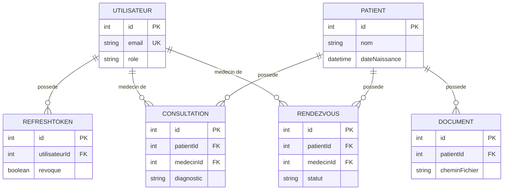

<div class="chapitre-titre-num">CHAPITRE 44</div>

# Projet final — Base de données avec Prisma + PostgreSQL

<div class="encadre objectif">
<span class="encadre-titre">🎯 Objectif du chapitre</span>
Formaliser le schéma Prisma complet de MediAPI, appliquer la première migration, et peupler la base avec un script de seed cohérent. À la fin de ce chapitre, MediAPI disposera d'un modèle de données complet et prêt à supporter tous les modules précédents (chapitres 42-43) sans aucune modification de structure supplémentaire.
</div>

<div class="encadre scenario">
<span class="encadre-titre">🎬 Mise en situation</span>
Avant la démonstration client, tu dois pouvoir montrer une application déjà remplie de données réalistes — pas une base vide qui obligerait à tout saisir manuellement devant le médecin-directeur. Ce chapitre construit exactement l'outil qui résout ce besoin récurrent de toute mission freelance : un script de seed qui recrée, en une seule commande, un jeu de données cohérent et démontrable, à chaque fois que la base est réinitialisée.
</div>

## 44.1 Schéma Prisma complet de MediAPI

```prisma
// prisma/schema.prisma
generator client {
  provider = "prisma-client-js"
}

datasource db {
  provider = "postgresql"
  url      = env("DATABASE_URL")
}

model Utilisateur {
  id             Int          @id @default(autoincrement())
  nom            String
  email          String       @unique
  motDePasseHash String
  role           Role         @default(RECEPTIONNISTE)
  refreshTokens  RefreshToken[]
  consultations  Consultation[] @relation("MedecinConsultations")
  rendezVous     RendezVous[]    @relation("MedecinRendezVous")
  createdAt      DateTime     @default(now())
}

model RefreshToken {
  id            Int         @id @default(autoincrement())
  tokenHash     String
  utilisateur   Utilisateur @relation(fields: [utilisateurId], references: [id])
  utilisateurId Int
  revoque       Boolean     @default(false)
  expireLe      DateTime
  createdAt     DateTime    @default(now())

  @@index([utilisateurId])
}

model Patient {
  id             Int            @id @default(autoincrement())
  nom            String
  dateNaissance  DateTime
  telephone      String?
  adresse        String?
  consultations  Consultation[]
  rendezVous     RendezVous[]
  documents      Document[]
  createdAt      DateTime       @default(now())

  @@index([nom])
}

model Consultation {
  id             Int         @id @default(autoincrement())
  patient        Patient     @relation(fields: [patientId], references: [id])
  patientId      Int
  medecin        Utilisateur @relation("MedecinConsultations", fields: [medecinId], references: [id])
  medecinId      Int
  motif          String
  diagnostic     String?
  prescriptions  String?
  date           DateTime    @default(now())

  @@index([patientId])
  @@index([medecinId])
}

model RendezVous {
  id         Int              @id @default(autoincrement())
  patient    Patient          @relation(fields: [patientId], references: [id])
  patientId  Int
  medecin    Utilisateur      @relation("MedecinRendezVous", fields: [medecinId], references: [id])
  medecinId  Int
  dateHeure  DateTime
  statut     StatutRendezVous @default(PLANIFIE)

  @@index([patientId])
  @@index([dateHeure])
}

model Document {
  id         Int      @id @default(autoincrement())
  patient    Patient  @relation(fields: [patientId], references: [id])
  patientId  Int
  nomFichier String
  cheminFichier String
  typeDocument String
  createdAt  DateTime @default(now())

  @@index([patientId])
}

enum Role {
  ADMIN
  MEDECIN
  RECEPTIONNISTE
}

enum StatutRendezVous {
  PLANIFIE
  CONFIRME
  ANNULE
  TERMINE
}
```



<div class="encadre astuce">
<span class="encadre-titre">💡 Explication du schéma</span>
Ce diagramme entité-relation complet formalise visuellement les 6 modèles du schéma Prisma et leurs relations : `Utilisateur` est au centre de deux relations distinctes (`RefreshToken` pour l'authentification, chapitre 23 ; `Consultation`/`RendezVous` en tant que médecin), et `Patient` regroupe l'ensemble de son historique médical (consultations, rendez-vous, documents) — exactement la structure nécessaire pour qu'un médecin ou une réceptionniste retrouve tout l'historique d'un patient en une seule vue.
</div>

<div class="encadre astuce">
<span class="encadre-titre">💡 Pourquoi des index sur patientId, medecinId, dateHeure</span>
Rappel du chapitre 25 (SQL indispensable, dans le manuel Java de ce même auteur) et du chapitre 21 de ce manuel : ces colonnes sont systématiquement utilisées dans des `WHERE`/jointures (lister les consultations d'un patient, les rendez-vous d'une période) — les indexer accélère considérablement ces requêtes fréquentes, à mesure que le volume de données grandit.
</div>

## 44.2 Générer et appliquer la première migration

```
$ npx prisma migrate dev --name init
```

```
prisma/migrations/
└── 20260705120000_init/
    └── migration.sql
```

## 44.3 Script de seed (données de démonstration)

```js
// prisma/seed.js
const { PrismaClient } = require("@prisma/client");
const bcrypt = require("bcrypt");
const prisma = new PrismaClient();

async function main() {
  const motDePasseHash = await bcrypt.hash("motdepasse123", 10);

  const admin = await prisma.utilisateur.create({
    data: { nom: "Admin Système", email: "admin@mediapi.ht", motDePasseHash, role: "ADMIN" },
  });

  const medecin = await prisma.utilisateur.create({
    data: { nom: "Dr. Jaslin Occius", email: "medecin@mediapi.ht", motDePasseHash, role: "MEDECIN" },
  });

  const patient = await prisma.patient.create({
    data: { nom: "Marie Pierre", dateNaissance: new Date("1990-05-15"), telephone: "+509 3456 7890" },
  });

  await prisma.consultation.create({
    data: {
      patientId: patient.id,
      medecinId: medecin.id,
      motif: "Consultation de routine",
      diagnostic: "Rien à signaler",
    },
  });

  console.log("Seed terminé :", { admin: admin.email, medecin: medecin.email, patient: patient.nom });
}

main()
  .catch((e) => { console.error(e); process.exit(1); })
  .finally(() => prisma.$disconnect());
```

```json
// package.json
"prisma": {
  "seed": "node prisma/seed.js"
},
"scripts": {
  "db:seed": "npx prisma db seed"
}
```

<div class="encadre retenir">
<span class="encadre-titre">📌 À retenir</span>
Un script de seed bien conçu (comme celui-ci) doit rester **idempotent** dans son intention même s'il ne l'est pas techniquement ici (`create` échouerait sur une seconde exécution à cause de la contrainte `@unique` sur l'email) — combiné à `prisma migrate reset` (qui vide la base avant de reseeder), il garantit un jeu de données identique et démontrable à chaque exécution, exactement le besoin de la mise en situation d'ouverture.
</div>

## 44.4 Requête de rapport agrégé (aperçu, détaillé au chapitre 45)

```js
async function consultationsParMedecin(dateDebut, dateFin) {
  return prisma.consultation.groupBy({
    by: ["medecinId"],
    where: { date: { gte: dateDebut, lte: dateFin } },
    _count: { id: true },
  });
}
```

## Atelier — Préparer une vraie démonstration client

<div class="encadre exercice">
<span class="encadre-titre">🛠️ Atelier 44 — Reproduire le besoin de la mise en situation d'ouverture</span>

**Objectif** : construire un jeu de données de démonstration suffisamment riche pour une vraie présentation client.

**Préparation** : le schéma Prisma complet de ce chapitre, une base PostgreSQL de test.

**Étapes détaillées** :
1. Applique la migration initiale (`prisma migrate dev --name init`).
2. Étends le script de seed de la section 44.3 pour créer 3 médecins, 10 patients, et au moins 15 consultations réparties entre eux sur plusieurs dates.
3. Ajoute quelques rendez-vous dans différents statuts (`PLANIFIE`, `CONFIRME`, `TERMINE`) pour rendre la démonstration réaliste.
4. Exécute `npx prisma migrate reset` (qui vide puis reseed automatiquement) : vérifie que la base revient systématiquement au même état démontrable.
5. Ouvre Prisma Studio (`npx prisma studio`, rappel du chapitre 34) pour vérifier visuellement la cohérence des données générées.

**Validation** : après `migrate reset`, la base doit contenir exactement le même jeu de données cohérent à chaque exécution, prêt à être présenté sans préparation supplémentaire.

**Résultat attendu** : exactement l'outil qui aurait évité de devoir saisir manuellement des données avant chaque démonstration client, comme dans la mise en situation d'ouverture.

**Dépannage** : si le seed échoue avec une erreur de contrainte unique, vérifie que `migrate reset` a bien vidé la base avant de relancer le seed (il le fait automatiquement, mais un seed lancé isolément sur une base déjà peuplée échouera, comportement attendu).

**Nettoyage** : aucun, ce jeu de données démonstratif reste utile pour le reste du développement.
</div>

## Erreurs fréquentes

<div class="encadre attention">
<span class="encadre-titre">⚠️ Erreur n°1 — Oublier les index sur les colonnes de clé étrangère</span>
Sans `@@index([patientId])` sur `Consultation`, par exemple, lister les consultations d'un patient (une opération très fréquente) devient de plus en plus lente à mesure que la table grandit — rappel du chapitre 21 et 40 sur l'importance des index comme premier levier de performance.
</div>

<div class="encadre attention">
<span class="encadre-titre">⚠️ Erreur n°2 — Un script de seed non idempotent utilisé en dehors de migrate reset</span>
Exécuter `node prisma/seed.js` directement sur une base déjà peuplée (sans passer par `migrate reset`) échoue sur la contrainte `@unique` de l'email — un comportement attendu, mais qui peut surprendre si mal compris.
</div>

## Débogage

<div class="encadre attention">
<span class="encadre-titre">🩺 Symptôme : le seed échoue avec une erreur de contrainte unique sur l'email</span>

- **Cause** : le script a été exécuté sur une base déjà peuplée par un seed précédent (erreur fréquente n°2).
- **Solution** : utiliser `npx prisma migrate reset` (vide puis reseed automatiquement), plutôt que `node prisma/seed.js` isolément sur une base non vidée.
</div>

## En entreprise

- **Scripts de seed comme livrable à part entière** : de nombreuses équipes considèrent un bon script de seed comme un outil de productivité collectif, pas juste un détail technique — il accélère l'onboarding de nouveaux développeurs et facilite chaque démonstration client.
- **Index vérifiés systématiquement en revue de code** : sur chaque nouvelle relation entre modèles, la présence d'un index sur la colonne de clé étrangère est un point de contrôle standard, précisément pour éviter la dégradation de performance de l'erreur fréquente n°1.

## Entretien technique

<div class="encadre exercice">
<span class="encadre-titre">💼 Questions fréquemment posées en entretien</span>

**Q1. "Pourquoi indexer systématiquement les colonnes de clé étrangère ?"**
Réponse attendue : elles sont utilisées dans la quasi-totalité des jointures et filtres liés à cette relation (lister les consultations d'un patient, par exemple) — sans index, ces requêtes se dégradent progressivement avec le volume de données.

**Q2. "À quoi sert un script de seed dans un projet Node.js ?"**
Réponse attendue : peupler la base avec des données cohérentes et reproductibles, utiles en développement, pour les démonstrations client, et souvent comme base pour les tests d'intégration.

**Q3. "Pourquoi RefreshToken est-il un modèle séparé plutôt qu'un simple champ sur Utilisateur ?"**
Réponse attendue : un utilisateur peut avoir plusieurs sessions actives simultanément (plusieurs appareils), chacune avec son propre refresh token révocable indépendamment — rappel du modèle access/refresh token du chapitre 23.
</div>

## Optimisation, sécurité et maintenabilité

<div class="encadre performance">
<span class="encadre-titre">🚀 Performance</span>
Les index posés dès la conception initiale du schéma (section 44.1) évitent d'avoir à les ajouter en urgence plus tard sur une table déjà volumineuse, une opération de migration potentiellement plus lente et risquée en production.
</div>

<div class="encadre securite">
<span class="encadre-titre">🔒 Sécurité</span>
Le mot de passe de démonstration du seed (`motdepasse123`) ne doit jamais être utilisé tel quel en production — documenter clairement que ces comptes sont réservés au développement/démonstration, jamais déployés avec ces identifiants sur un environnement réel.
</div>

## Résumé du chapitre

- Le schéma Prisma complet de MediAPI couvre `Utilisateur`, `RefreshToken`, `Patient`, `Consultation`, `RendezVous`, `Document`, avec index sur les colonnes fréquemment interrogées.
- `prisma migrate dev --name init` génère et applique la première migration versionnée.
- Un script de seed (`prisma/seed.js`) peuple la base avec des comptes et données de démonstration cohérents, réutilisables en développement comme en tests, et rejouable via `migrate reset`.
- `groupBy` de Prisma permet des agrégations directement en base de données, sans charger toutes les lignes en mémoire Node.js.

## Quiz

<div class="encadre exercice">
<span class="encadre-titre">📝 QCM</span>

1. Pourquoi indexer patientId sur le modèle Consultation ?
   - a) Pour des raisons esthétiques
   - b) Pour accélérer les requêtes filtrant par patient, très fréquentes
   - c) Prisma l'exige obligatoirement
   - d) Pour réduire la taille de la base

2. Comment reseeder proprement une base déjà peuplée ?
   - a) node prisma/seed.js directement
   - b) npx prisma migrate reset (vide puis reseed)
   - c) Supprimer manuellement chaque ligne
   - d) Ce n'est pas possible

3. Pourquoi RefreshToken est-il un modèle séparé de Utilisateur ?
   - a) Par convention arbitraire
   - b) Un utilisateur peut avoir plusieurs sessions/tokens actifs simultanément
   - c) Prisma ne permet pas les champs multiples
   - d) Pour des raisons de performance uniquement

**Corrigé** : 1-b, 2-b, 3-b.
</div>

<div class="encadre exercice">
<span class="encadre-titre">📝 Vrai ou Faux</span>

1. Un script de seed exécuté deux fois de suite sur la même base fonctionne sans erreur dans cet exemple. — **Faux** (contrainte unique sur l'email).
2. groupBy de Prisma effectue l'agrégation côté base de données, pas en mémoire Node.js. — **Vrai**.
3. Les index doivent être ajoutés seulement une fois un problème de performance constaté. — **Faux** (les index sur clés étrangères sont recommandés dès la conception).
</div>

<div class="encadre exercice">
<span class="encadre-titre">📝 Question ouverte</span>

Pourquoi la capacité à régénérer rapidement un jeu de données cohérent (comme dans la mise en situation d'ouverture) est-elle particulièrement précieuse pour une mission freelance, au-delà du seul confort de développement ?

**Corrigé** : une démonstration client improvisée avec une base vide ou des données incohérentes nuit directement à la crédibilité professionnelle — le client juge la qualité du travail en partie sur la fluidité de la présentation. Un script de seed fiable et rejouable élimine ce risque : quelle que soit la fréquence des tests ou des réinitialisations de base pendant le développement, une démonstration propre reste disponible en une seule commande, à tout moment, sans préparation de dernière minute.
</div>

## Exercices

<div class="encadre exercice">
<span class="encadre-titre">📝 Exercice 44.1</span>

Étends le script de seed pour ajouter un compte `RECEPTIONNISTE` et un rendez-vous lié au patient et au médecin déjà créés, avec le statut `PLANIFIE`.
</div>

**Corrigé :**
```js
const receptionniste = await prisma.utilisateur.create({
  data: { nom: "Sophie Baptiste", email: "reception@mediapi.ht", motDePasseHash, role: "RECEPTIONNISTE" },
});

await prisma.rendezVous.create({
  data: {
    patientId: patient.id,
    medecinId: medecin.id,
    dateHeure: new Date("2026-08-01T09:00:00"),
    statut: "PLANIFIE",
  },
});
```

## Checklist de fin de chapitre

<ul class="checklist">
<li>☐ J'ai défini le schéma Prisma complet avec les 6 modèles de MediAPI.</li>
<li>☐ J'ai indexé les colonnes de clé étrangère et de filtrage fréquent.</li>
<li>☐ J'ai appliqué la première migration.</li>
<li>☐ J'ai écrit un script de seed produisant un jeu de données démontrable.</li>
<li>☐ J'ai vérifié le fonctionnement de migrate reset pour reseeder proprement.</li>
</ul>

## FAQ

<dl class="faq">
<dt>Faut-il un script de seed distinct pour chaque environnement (développement, test, démonstration) ?</dt>
<dd>Pas nécessairement distinct, mais souvent paramétrable (volume de données différent selon l'environnement) — un seed minimal pour les tests automatisés (rapide), un seed riche pour les démonstrations client (réaliste).</dd>

<dt>Le seed doit-il être commité dans Git ?</dt>
<dd>Oui, `prisma/seed.js` fait partie du code source du projet — contrairement aux données elles-mêmes (la base), qui ne sont jamais versionnées directement.</dd>

<dt>Comment gérer des données de seed volumineuses (des centaines de patients) sans ralentir le script ?</dt>
<dd>Utiliser `createMany` plutôt que des `create` individuels en boucle, réduisant le nombre d'allers-retours vers la base de données — un principe similaire à l'évitement du N+1 (chapitre 34).</dd>
</dl>

## Références et pour aller plus loin

- Rappel du chapitre 34 (ORM Prisma) pour les fondations complètes de ce chapitre.
- Documentation Prisma sur le seeding : [https://www.prisma.io/docs/orm/prisma-migrate/workflows/seeding](https://www.prisma.io/docs/orm/prisma-migrate/workflows/seeding)

*Chapitre suivant : l'upload de documents médicaux et la génération de rapports d'activité complets.*
