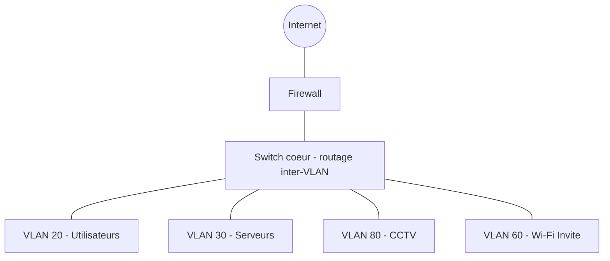

<div class="chapitre-titre-num">CHAPITRE 3</div>

# Apprendre à lire un réseau

## Objectifs pédagogiques

Reconnaître à vue les dix équipements les plus courants d'un réseau d'entreprise, et savoir lire les six types de documents/schémas qu'un technicien réseau rencontre sur le terrain : schéma physique, schéma logique, topologie, plan de baie, plan IP, plan VLAN.

## Prérequis

Chapitres 1-2.

## 3.1 Reconnaître les équipements sur le terrain

Avant de configurer quoi que ce soit, il faut savoir identifier physiquement ce que l'on a devant soi. Voici les dix équipements les plus courants d'un projet réseau + vidéosurveillance, avec leurs indices visuels caractéristiques.

| Équipement | Indices visuels typiques |
|---|---|
| PC (poste de travail) | Boîtier tour, mini-PC ou portable ; une seule prise réseau RJ45 (ou Wi-Fi uniquement) |
| Serveur | Boîtier rack (1U/2U/4U) ou tour renforcée, souvent plusieurs disques visibles en façade (baies chaudes-échangeables), ventilation bruyante, parfois deux blocs d'alimentation redondants |
| Switch | Boîtier rectangulaire plat avec de nombreux ports RJ45 alignés (8 à 48 ports), rangée de voyants LED par port, généralement monté en baie (rack 19 pouces) |
| Routeur | Moins de ports que le switch (souvent 2 à 10), inscriptions "WAN"/"LAN" ou "Internet"/"Ethernet" à côté des ports, parfois une antenne pour le Wi-Fi intégré |
| Firewall | Ressemble à un petit routeur/switch, souvent avec un nom de marque visible (FortiGate, pfSense, SonicWall), plusieurs ports étiquetés par zone (WAN, LAN, DMZ) |
| Point d'accès Wi-Fi (AP) | Petit boîtier blanc rond ou carré, fixé au plafond ou au mur, une seule prise réseau RJ45 (souvent alimentée en PoE, donc aucun câble électrique visible) |
| Caméra IP | Boîtier dôme (plafond) ou boîtier tubulaire/bullet (mural, orienté), objectif visible, un seul câble réseau RJ45 (PoE) ou un câble réseau + un câble électrique séparé |
| NVR (enregistreur vidéo réseau) | Boîtier rack ou de bureau avec plusieurs ports RJ45 PoE en façade ou à l'arrière, souvent un ou plusieurs disques durs internes, sortie vidéo HDMI/VGA vers un écran de contrôle |
| Imprimante réseau | Imprimante de bureau standard avec un port RJ45 (en plus ou à la place de l'USB), souvent une petite adresse IP affichée sur son écran de configuration |
| Téléphone IP | Ressemble à un téléphone de bureau classique, mais avec un câble RJ45 au dos (parfois deux ports RJ45 : un vers la prise murale, un second vers le PC de l'utilisateur) |

<div class="encadre astuce">
<span class="encadre-titre">💡 Le réflexe du technicien terrain : compter les ports avant tout</span>
Face à un boîtier inconnu dans une baie, la première question à se poser est "combien de ports RJ45 a-t-il, et sont-ils tous identiques ?". Beaucoup de ports identiques et alignés → très probablement un switch. Peu de ports, avec des étiquettes différentes (WAN/LAN) → très probablement un routeur ou un firewall. C'est un indice fiable même sans connaître la marque.
</div>

## 3.2 Le schéma physique : ce qui est réellement câblé

Un **schéma physique** représente le câblage réel entre les équipements : quel port de quel appareil est relié à quel port de quel autre appareil, avec quel type de câble. C'est le document qu'un technicien utilise pour suivre un câble sur le terrain ou dans une baie.

```{.uml}
SCHEMA PHYSIQUE — Petit bureau (exemple)

  Prise murale bureau 101 ─────────── Patch panel port 1 ─┐
  Prise murale bureau 102 ─────────── Patch panel port 2 ─┤
  Prise murale accueil    ─────────── Patch panel port 3 ─┤
                                                            │  (cordons de brassage
                                                            │   cuivre Cat6, 0.5 m)
                                                            ▼
  [ SWITCH ACCES 24 PORTS ]  Gi0/1 ── Gi0/2 ── Gi0/3 ── ... ── Gi0/23 ── Gi0/24
        │                                                              │
        │ Gi0/24 (fibre SFP)                                          │ Gi0/23
        │                                                    (reserve, non branche)
        ▼
  [ SWITCH COEUR ]
        │ Gi0/1 (cuivre Cat6)
        ▼
  [ ROUTEUR / FIREWALL ]
        │ port WAN
        ▼
  [ BOX OPERATEUR ]
```

## 3.3 Le schéma logique : comment les données circulent réellement

Un **schéma logique** représente l'organisation fonctionnelle du réseau — les VLAN, le sens du routage, les zones de sécurité — indépendamment du câblage physique réel. Deux appareils reliés au même switch physique peuvent apparaître dans deux "bulles" complètement séparées sur un schéma logique s'ils appartiennent à des VLAN différents.



<div class="encadre astuce">
<span class="encadre-titre">💡 Pourquoi les deux schémas sont indispensables, et jamais interchangeables</span>
Le schéma physique répond à la question "où dois-je débrancher un câble pour isoler ce poste ?". Le schéma logique répond à la question "pourquoi ce poste ne peut-il pas joindre cette caméra ?". Un technicien qui ne dispose que du schéma physique perd un temps considérable à comprendre le fonctionnement logique d'un incident de sécurité ou de routage — et inversement, un schéma logique seul ne permet pas de suivre un câble sur le terrain. Un dossier de projet complet (Volume 15) fournit systématiquement les deux.
</div>

## 3.4 La topologie : la forme générale du réseau

La **topologie** décrit la forme générale selon laquelle les équipements sont interconnectés. Les projets de ce manuel utilisent presque toujours une topologie **hiérarchique en étoile**, organisée en trois couches logiques (le modèle "Core / Distribution / Access", que nous retrouverons dans les Volumes 5 à 8) :

- **Access (accès)** : les switches au plus près des utilisateurs et des équipements finaux (postes, caméras, AP) ;
- **Distribution** : regroupe le trafic de plusieurs switches d'accès, applique les politiques (ACL, QoS) ;
- **Core (cœur)** : la colonne vertébrale du réseau, relie les blocs de distribution entre eux et vers le firewall/routeur, dimensionnée pour le débit le plus élevé.

Sur un petit projet (Volume 16, Projet 1), les couches Distribution et Core sont souvent fusionnées en un seul switch cœur. Sur un grand projet multi-bâtiments (Projet 4), les trois couches sont clairement distinctes, avec de la fibre optique entre elles.

```{.uml}
TOPOLOGIE HIERARCHIQUE (Core / Distribution / Access)

                        [ FIREWALL ]
                              │
                        [ CORE SWITCH ]
                         /            \
              [ DIST. BAT A ]      [ DIST. BAT B ]
               /          \           /         \
        [ACCES 1F]   [ACCES 2F]  [ACCES 1F]  [ACCES 2F]
          |  |  |       |  |  |     |  |  |      |  |  |
         PC PC AP     PC PC Cam   PC PC AP     PC PC Cam
```

## 3.5 Le plan de baie (rack) : l'organisation verticale d'une armoire

Un **plan de baie** représente l'emplacement exact de chaque équipement dans une armoire réseau, de haut en bas, mesuré en unités de rack (U — une unité standard de 4,45 cm de hauteur). Il est indispensable pour l'installation physique (Volume 6) et pour toute intervention future (savoir immédiatement où se trouve un équipement donné sans devoir le chercher visuellement dans toute la baie).

```{.uml}
PLAN DE BAIE 42U (exemple, de haut en bas)

 U42 ┌────────────────────────────────┐
     │ Panneau passe-cables (haut)     │
 U41 ├────────────────────────────────┤
     │ Patch panel 24 ports (data)     │
 U40 ├────────────────────────────────┤
     │ Panneau passe-cables            │
 U39 ├────────────────────────────────┤
     │ Switch coeur                    │
 U38 ├────────────────────────────────┤
     │ Switch acces PoE #1             │
 U37 ├────────────────────────────────┤
     │ Switch acces PoE #2             │
 U36 ├────────────────────────────────┤
     │ Firewall                        │
 U35 ├────────────────────────────────┤
     │ Routeur / modem operateur       │
     ⋮              ⋮                  ⋮
  U8 ├────────────────────────────────┤
     │ Serveur rack 2U                 │
  U6 ├────────────────────────────────┤
     │ NVR videosurveillance           │
  U4 ├────────────────────────────────┤
     │ Onduleur (UPS) rack             │
  U1 └────────────────────────────────┘
     │ PDU (bandeau electrique) - fond │
     └────────────────────────────────┘
```

<div class="encadre astuce">
<span class="encadre-titre">💡 Pourquoi les équipements actifs sont regroupés en haut</span>
Un plan de baie professionnel place généralement les équipements réseau actifs (switches, firewall) dans la moitié supérieure — plus accessible, plus proche du câblage horizontal qui arrive par le haut ou le bas de la baie — et réserve le bas, plus stable et plus proche du centre de gravité, aux équipements lourds (onduleur, serveurs). Le Volume 6 détaille l'ensemble des règles d'installation d'une baie.
</div>

## 3.6 Le plan IP : le tableau de référence de l'adressage

Un **plan IP** est un tableau qui documente, pour chaque VLAN ou segment réseau, la plage d'adresses utilisée, la passerelle, la plage DHCP et les éventuelles réservations d'adresses fixes. Il est la référence unique que tout technicien doit consulter avant d'attribuer une adresse — jamais improvisée sur le terrain.

| VLAN | Nom | Réseau | Masque | Passerelle | Plage DHCP | Utilisation |
|---|---|---|---|---|---|---|
| 10 | Management | 10.10.10.0 | /27 | 10.10.10.1 | Pas de DHCP (fixe) | Management des équipements réseau |
| 20 | Utilisateurs | 10.10.20.0 | /24 | 10.10.20.1 | .50 à .200 | Postes de travail |
| 30 | Serveurs | 10.10.30.0 | /26 | 10.10.30.1 | Pas de DHCP (fixe) | Serveurs |
| 80 | CCTV | 10.10.80.0 | /23 | 10.10.80.1 | .50 à .250 (réservations par caméra) | Caméras et NVR |

La méthode complète de conception de ce tableau, adresse par adresse, fait l’objet du Volume 4.

## 3.7 Le plan VLAN : qui a le droit de parler à qui

Un **plan VLAN** complète le plan IP en documentant, pour chaque VLAN, les règles d'accès autorisées vers les autres VLAN — l'information que le plan IP seul ne donne pas.

| VLAN source | Peut joindre | Ne peut pas joindre |
|---|---|---|
| Utilisateurs (20) | Serveurs (30, ports applicatifs uniquement), Internet | CCTV (80), Management (10) |
| CCTV (80) | NVR (dans le même VLAN) | Tout le reste, y compris Internet |
| Management (10) | Tous les équipements réseau | — (VLAN administratif, accès total volontaire) |

<div class="encadre attention">
<span class="encadre-titre">⚠️ Un plan IP sans plan VLAN d'accès est incomplet</span>
Attribuer une plage d'adresses à chaque VLAN (plan IP) ne dit rien sur les autorisations de communication entre eux : c'est le plan VLAN d'accès, associé aux règles de firewall et aux ACL (Volumes 4, 8 et 9), qui matérialise réellement la logique de sécurité du réseau. Un projet livré sans ce second tableau documenté est une porte ouverte à des règles de sécurité oubliées ou mal comprises par le prochain technicien qui reprendra le projet.
</div>

## 3.8 Laboratoire — lire un schéma inconnu

Observe le schéma physique suivant, puis réponds aux questions.

```{.uml}
  PC-Reception ── SW-ACCES port Gi0/5
  Camera-Entree ── SW-ACCES port Gi0/12 (PoE)
  SW-ACCES port Gi0/24 (fibre) ── SW-COEUR port Gi0/1
  SW-COEUR port Gi0/2 ── FIREWALL port LAN
  FIREWALL port WAN ── BOX-OPERATEUR
```

1. Si le câble entre `SW-ACCES` et `SW-COEUR` est débranché, `PC-Reception` peut-il encore imprimer sur une imprimante branchée sur le même `SW-ACCES` ? Justifie avec ce que tu as appris en 3.2-3.3.
2. `Camera-Entree` a-t-elle besoin d'une alimentation électrique séparée d'après ce schéma ? Pourquoi ?
3. Si `PC-Reception` n'a plus accès à Internet mais peut toujours joindre l'imprimante et le serveur de fichiers locaux, quel tronçon du schéma est le plus probablement en cause ?

**Corrigé :**
1. Oui — `PC-Reception` et l'imprimante restent reliés au même switch d'accès physique ; seul l'accès vers le reste du réseau (serveurs, Internet, via le switch cœur) serait coupé.
2. Non — le port Gi0/12 est identifié PoE, la caméra est donc très probablement alimentée par le même câble réseau.
3. Le tronçon Firewall → Box opérateur (le WAN), puisque l'accès local (LAN) fonctionne toujours normalement.

## Résumé du chapitre

Dix équipements se reconnaissent à leurs indices visuels (nombre et étiquetage des ports, forme du boîtier). Le schéma physique documente le câblage réel ; le schéma logique documente l'organisation fonctionnelle (VLAN, routage) ; la topologie décrit la forme générale (le modèle Core/Distribution/Access utilisé dans tout ce manuel) ; le plan de baie documente l'emplacement vertical des équipements ; le plan IP documente l'adressage ; le plan VLAN documente les règles d'accès entre VLAN.

*Fin du Volume 1. Chapitre suivant : l'adressage IPv4, les masques et la notation CIDR — le premier des cinq chapitres du Volume 2 consacré à l'adressage IP de zéro à expert.*
