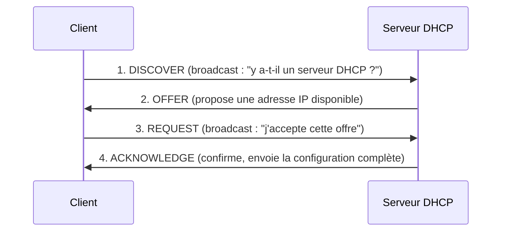

<div class="chapitre-titre-num">CHAPITRE 6</div>

# DHCP et DNS en détail

## Objectifs pédagogiques

Comprendre précisément le déroulement d'une attribution DHCP (processus DORA), savoir quand utiliser une plage dynamique, une réservation ou une adresse statique, et comprendre le fonctionnement du DNS ainsi que les types d'enregistrements les plus courants.

## Prérequis

Chapitres 4-5.

## 6.1 Le processus DHCP complet : DORA

Quand un appareil sans adresse IP se connecte à un réseau équipé d'un serveur DHCP, quatre messages s'échangent, dans cet ordre — un moyen mnémotechnique courant est **DORA** (Discover, Offer, Request, Acknowledge).



1. **DISCOVER** : le client, n'ayant encore aucune adresse IP, envoie un message en **broadcast** ("à tout le monde sur ce réseau") pour trouver un serveur DHCP.
2. **OFFER** : chaque serveur DHCP qui reçoit ce message répond en proposant une adresse IP libre de sa plage.
3. **REQUEST** : le client choisit une des offres reçues (généralement la première) et **rediffuse** ce choix en broadcast — c'est ce broadcast, et non un message privé au serveur choisi, qui permet aux **autres** serveurs DHCP éventuels de comprendre que leur offre n'a pas été retenue, et de remettre leur adresse proposée dans le pool disponible.
4. **ACKNOWLEDGE** : le serveur choisi confirme l'attribution et envoie la configuration complète — adresse IP, masque, passerelle, DNS, durée du bail, et éventuellement d'autres options (6.4).

<div class="encadre attention">
<span class="encadre-titre">⚠️ Un réseau avec deux serveurs DHCP actifs sur le même VLAN, sans coordination, distribue des adresses en conflit</span>
Si deux serveurs DHCP répondent sur le même sous-réseau avec des plages qui se chevauchent (ou pire, avec des plages différentes mais un même appareil recevant tantôt l'une, tantôt l'autre au fil de ses reconnexions), des conflits d'adresses IP apparaissent de façon imprévisible. C'est un des scénarios de dépannage les plus fréquents sur le terrain (chapitre 42) — la solution est soit un seul serveur DHCP autorisé par VLAN, soit une coordination explicite entre plusieurs (partage de plage), jamais un second serveur DHCP "oublié" allumé par erreur.
</div>

## 6.2 Le bail DHCP (lease time) et son renouvellement

Une adresse IP distribuée par DHCP n'est jamais attribuée définitivement : elle est prêtée pour une durée déterminée, le **bail** (lease). Une fois la moitié de la durée du bail écoulée, le client tente automatiquement de renouveler son bail directement auprès du serveur qui l'a émis (sans repasser par un DISCOVER complet) ; s'il échoue à joindre ce serveur, il retente à 87,5 % de la durée du bail, cette fois en broadcast vers n'importe quel serveur DHCP disponible ; s'il échoue encore à l'expiration complète du bail, l'adresse est perdue et le client redémarre le processus DORA depuis le début.

<div class="encadre astuce">
<span class="encadre-titre">💡 Choisir la durée du bail selon le type de réseau</span>
Un bail court (quelques heures) libère rapidement les adresses des appareils qui se déconnectent souvent — adapté à un Wi-Fi invité à forte rotation (visiteurs). Un bail long (plusieurs jours) réduit le trafic réseau de renouvellement et convient à un VLAN de postes fixes qui restent connectés en permanence. Un pool DHCP trop petit combiné à un bail trop long peut cependant provoquer un **épuisement du pool** (plus aucune adresse disponible) si le nombre d'appareils dépasse la capacité du sous-réseau — un scénario de dépannage du chapitre 42.
</div>

## 6.3 Plage dynamique, réservation ou adresse statique : quand utiliser quoi

Trois façons différentes d'attribuer une adresse IP à un appareil coexistent sur un même réseau, chacune adaptée à un usage précis :

| Méthode | Fonctionnement | Quand l'utiliser |
|---|---|---|
| **Plage dynamique** (DHCP standard) | Le serveur attribue une adresse libre de sa plage, potentiellement différente à chaque connexion | Postes utilisateurs, appareils mobiles, invités — tout ce qui n'a pas besoin d'une adresse prévisible |
| **Réservation DHCP** | Le serveur attribue toujours la **même** adresse à une **adresse MAC** donnée, mais via le processus DHCP normal | Imprimantes, caméras IP, téléphones IP, petits serveurs applicatifs — besoin d'une adresse stable, mais confort de la configuration automatique |
| **Adresse statique** (configurée manuellement sur l'appareil) | L'appareil ne contacte jamais de serveur DHCP, l'administrateur saisit l'IP/masque/passerelle/DNS directement dessus | Équipements réseau eux-mêmes (switches, routeurs, firewalls), serveurs critiques, NVR |

<div class="encadre astuce">
<span class="encadre-titre">💡 Pourquoi les réservations DHCP sont préférables au statique pur, sauf exception</span>
Une réservation DHCP offre une adresse tout aussi stable qu'une configuration statique (toujours la même, associée à la MAC de l'appareil), mais reste centralisée et modifiable en un seul endroit (le serveur DHCP) si le plan IP doit évoluer un jour — alors qu'une flotte de 50 caméras en adressage statique pur nécessiterait de se reconnecter individuellement à chacune pour changer quoi que ce soit. Ce manuel réserve donc l'adressage statique pur aux équipements dont l'adresse doit être joignable même si le service DHCP tombe en panne — typiquement les équipements réseau eux-mêmes.
</div>

## 6.4 Les options DHCP courantes

Au-delà de l'adresse IP elle-même, un bail DHCP transporte des **options** — des paramètres additionnels que le client applique automatiquement.

| Option | Numéro | Contenu |
|---|---|---|
| Passerelle par défaut | Option 3 | L'adresse du routeur local |
| Serveurs DNS | Option 6 | Une ou plusieurs adresses de serveurs DNS |
| Nom de domaine | Option 15 | Le suffixe DNS local (ex. `entreprise.local`) |
| Serveur NTP | Option 42 | L'adresse du serveur d'horloge réseau (essentiel pour la cohérence des horodatages de logs et de vidéosurveillance, Volume 13) |
| Options spécifiques constructeur | Option 43 | Utilisée notamment par les bornes Wi-Fi UniFi pour découvrir automatiquement l'adresse de leur contrôleur sur le réseau (Volume 10) |

## 6.5 Le fonctionnement du DNS

Le **DNS** (chapitre 2.6) fonctionne par une hiérarchie de serveurs interrogés successivement. Simplifié au niveau nécessaire pour ce manuel :

1. Un appareil interroge le **serveur DNS configuré** (celui reçu par DHCP, ou un serveur DNS interne d'entreprise).
2. Si ce serveur connaît déjà la réponse (elle a été demandée récemment par quelqu'un d'autre et mise en cache), il répond immédiatement.
3. Sinon, pour un nom public, ce serveur interroge à son tour la hiérarchie mondiale du DNS (serveurs racine → serveurs du domaine de tête comme `.com` → serveur faisant autorité pour le domaine exact) jusqu'à obtenir la réponse, puis la renvoie au client et la garde en cache pour la prochaine demande.

## 6.6 Les types d'enregistrements DNS les plus courants

| Type | Contenu | Exemple |
|---|---|---|
| **A** | Traduit un nom en adresse IPv4 | `intranet.entreprise.local` → `10.10.30.10` |
| **AAAA** | Traduit un nom en adresse IPv6 | `intranet.entreprise.local` → `fd00::10` |
| **CNAME** | Fait pointer un nom vers un autre nom (alias) | `www.entreprise.ht` → `entreprise.ht` |
| **MX** | Indique le ou les serveurs de messagerie d'un domaine | `entreprise.ht` → serveur mail, avec une priorité |
| **PTR** | Résolution inverse : traduit une adresse IP en nom | `10.10.30.10` → `intranet.entreprise.local` |
| **TXT** | Texte libre, souvent utilisé pour des vérifications (SPF/DKIM email, validation de domaine) | — |
| **NS** | Indique quels serveurs font autorité pour un domaine | — |

## 6.7 DNS interne et DNS public : le split DNS

En entreprise, il est courant qu'un même nom de domaine réponde **différemment** selon que la requête vient de l'intérieur du réseau ou de l'extérieur (Internet) — c'est le **split DNS** (ou split-horizon DNS).

**Exemple concret** : `nvr.entreprise.local` résolu par le serveur DNS **interne** de l'entreprise pointe vers l'adresse privée `10.10.80.5` du NVR (joignable uniquement depuis le LAN) — ce nom n'existe tout simplement pas sur un serveur DNS **public**, où seul `www.entreprise.ht` (le site public de l'entreprise) est résolu, vers une adresse publique différente.

<div class="encadre attention">
<span class="encadre-titre">⚠️ Ne jamais exposer publiquement le nom interne d'un équipement sensible</span>
Un split DNS mal conçu, où le nom interne d'un NVR ou d'un serveur de fichiers apparaît par erreur dans le DNS public, révèle à n'importe qui sur Internet l'existence et le nom de cet équipement — une information précieuse pour un attaquant, même si l'adresse elle-même reste privée et injoignable depuis l'extérieur. La séparation stricte entre zone DNS interne et zone DNS publique, vérifiée explicitement, fait partie de la checklist de sécurité du Volume 13.
</div>

## 6.8 Laboratoire — observer le DHCP et le DNS en action

<div class="ou-executer">À EXÉCUTER SUR WINDOWS — PowerShell</div>

```powershell
ipconfig /release
ipconfig /renew
```

Observe le résultat : la commande `/release` abandonne le bail DHCP actuel (le PC perd temporairement son adresse IP), la commande `/renew` relance un DORA complet et affiche la nouvelle adresse attribuée.

<div class="ou-executer">À EXÉCUTER SUR WINDOWS — PowerShell</div>

```powershell
Resolve-DnsName entreprise.ht -Type A
Resolve-DnsName entreprise.ht -Type MX
```

Interprète le résultat : la première commande affiche l'adresse IPv4 (enregistrement A) associée au nom interrogé, la seconde affiche le ou les serveurs de messagerie (enregistrement MX) de ce domaine, avec leur priorité.

## Résumé du chapitre

Le DHCP attribue une adresse via 4 messages (DORA : Discover, Offer, Request, Acknowledge), pour une durée limitée (le bail) renouvelée automatiquement. Trois méthodes d'attribution coexistent : plage dynamique (postes), réservation (imprimantes, caméras), statique (équipements réseau). Le DNS traduit les noms en adresses via une hiérarchie de serveurs interrogés en cascade, avec plusieurs types d'enregistrements (A, AAAA, CNAME, MX, PTR, TXT). Le split DNS sépare la résolution interne de la résolution publique d'un même domaine.

## Exercices

<div class="encadre exercice">
<span class="encadre-titre">📝 Exercice 6.1</span>
Une caméra IP doit toujours être joignable à la même adresse pour que le NVR ne la perde jamais, mais l'équipe souhaite garder la possibilité de changer facilement le plan IP à l'avenir sans reconfigurer chaque caméra une par une. Quelle méthode d'attribution choisir ?
</div>

**Corrigé :** Une réservation DHCP (par adresse MAC) — adresse stable comme du statique, mais modifiable de façon centralisée depuis le serveur DHCP si besoin.

<div class="encadre exercice">
<span class="encadre-titre">📝 Exercice 6.2</span>
Un visiteur se plaint que son adresse IP Wi-Fi invité de la veille "ne fonctionne plus" aujourd'hui. Est-ce anormal ?
</div>

**Corrigé :** Non — un pool Wi-Fi invité utilise généralement un bail court, précisément pour permettre une forte rotation des visiteurs ; l'ancienne adresse a très probablement expiré et a été réattribuée à un autre appareil entretemps, ce qui est le fonctionnement normal attendu.

*Chapitre suivant : IPv6 essentiel — structure, types d'adresses, SLAAC et coexistence avec IPv4.*
