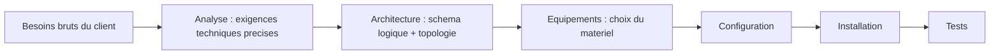
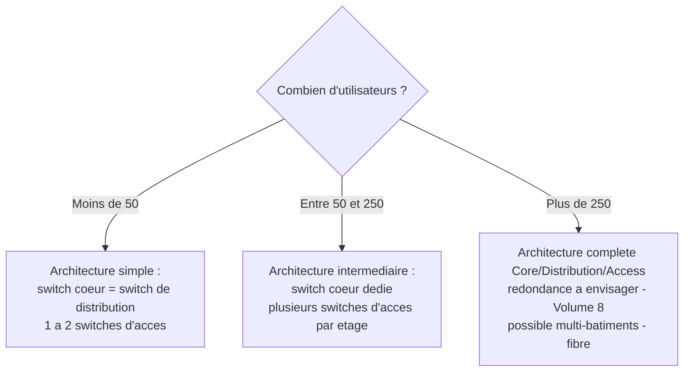

<div class="chapitre-titre-num">CHAPITRE 10</div>

# Des besoins à l'architecture

## Objectifs pédagogiques

Transformer un besoin exprimé en langage naturel par un client ("on veut Internet et des caméras") en une architecture technique précise, à l'aide d'une méthode reproductible et de premiers arbres de décision — la compétence qui sépare un installateur qui répète des schémas standards d'un concepteur capable de justifier chacun de ses choix.

## Prérequis

Chapitre 9.

## 10.1 Le principe : ne jamais sauter directement du besoin au matériel

Un débutant, face à un besoin client, a le réflexe de chercher immédiatement une liste de matériel ("il faut combien de switches ?"). C'est une erreur : entre le besoin brut et le choix du matériel, une étape d'**analyse** doit systématiquement transformer chaque besoin flou en **exigence technique précise**.



Ce fil conducteur est celui de l'ensemble de ce manuel : les Volumes 3-4 couvrent l'Analyse et l'Architecture, le Volume 5 les Équipements, les Volumes 6-13 la Configuration et l'Installation, le Volume 14 le dépannage, et le Volume 16 applique l'intégralité de la chaîne sur des projets complets.

## 10.2 L'étape d'analyse : transformer un besoin flou en exigence précise

**Exemple** : le client dit *"On veut Internet et des caméras."*

| Besoin brut | Question à poser | Exigence technique qui en résulte |
|---|---|---|
| "Internet" | Pour combien d'utilisateurs simultanés ? Quels usages (navigation simple, visioconférence, transferts lourds) ? | Bande passante WAN minimale à souscrire auprès de l'opérateur ; nombre d'adresses IP publiques nécessaires |
| "Des caméras" | Combien de zones à couvrir ? Conservation combien de jours ? Consultation à distance ? | Nombre de caméras (chapitre 16) ; capacité de stockage (chapitre 34) ; VLAN CCTV dédié (chapitre 12) ; accès distant sécurisé (Volume 9) |

Chaque ligne de ce tableau devient, une fois complétée, un critère explicite qui guidera un choix précis dans les chapitres suivants — jamais une improvisation au moment de l'achat du matériel.

## 10.3 Premier arbre de décision : combien d'utilisateurs ?

Le nombre d'utilisateurs à connecter est le facteur qui détermine, plus que tout autre, la forme générale de l'architecture (topologie, chapitre 3.4).



**Justification de chaque seuil** :

- **Moins de 50** : le trafic inter-VLAN reste modeste, un unique switch capable de faire à la fois cœur et distribution (chapitre 3.4) suffit largement, réduisant le coût sans compromettre la performance.
- **Entre 50 et 250** : le volume de trafic et le nombre de ports nécessaires justifient un switch cœur dédié, distinct des switches d'accès, pour centraliser le routage inter-VLAN sans saturer un switch qui devrait aussi gérer des ports utilisateurs.
- **Plus de 250** : la charge et souvent la dispersion géographique (plusieurs étages, plusieurs bâtiments) justifient une architecture à trois couches complètes, avec une réflexion sérieuse sur la redondance (chapitre 27) — une panne du switch cœur affecterait alors un nombre d'utilisateurs jugé inacceptable pour l'activité de l'entreprise.

## 10.4 Second arbre de décision : combien de caméras ?

Le nombre de caméras détermine, de façon largement indépendante du nombre d'utilisateurs, plusieurs choix structurants de la partie vidéosurveillance (Volume 12).

```mermaid
graph TD
    Q{Combien de cameras ?}
    Q -->|Moins de 20| A[NVR de bureau suffisant<br/>1 switch PoE dedie ou partage<br/>VLAN CCTV recommande mais pas critique]
    Q -->|Entre 20 et 100| B[NVR rack ou petit serveur VMS<br/>switches PoE dedies obligatoires<br/>VLAN CCTV obligatoire<br/>calcul de bande passante rigoureux - chapitre 34]
    Q -->|Plus de 100| C[Architecture VMS sur serveur(s) dedie(s)<br/>stockage en baie/SAN a envisager<br/>plusieurs switches PoE, uplinks fibre<br/>supervision dediee du sous-reseau CCTV]
```

**Justification de chaque seuil** :

- **Moins de 20** : le débit total agrégé (chapitre 34) reste gérable par un NVR d'entrée/moyenne gamme et un switch PoE standard, éventuellement partagé avec d'autres usages si le budget est très contraint (non recommandé, mais viable).
- **Entre 20 et 100** : le débit et la puissance PoE cumulée dépassent ce qu'un switch unique polyvalent peut raisonnablement absorber sans dégrader les autres usages du réseau — un ou plusieurs switches PoE **dédiés** à la vidéosurveillance, sur un VLAN strictement séparé, deviennent la pratique professionnelle standard.
- **Plus de 100** : le volume de données à stocker (chapitre 34) et la charge de traitement dépassent la capacité confortable d'un NVR classique — une architecture VMS logicielle sur serveur(s) dédié(s), avec du stockage extensible, devient nécessaire.

<div class="encadre astuce">
<span class="encadre-titre">💡 Ces deux arbres se combinent, ils ne s'excluent pas</span>
Un projet de 300 employés avec seulement 8 caméras suit l'arbre "utilisateurs" en architecture complète (10.3, branche >250) mais l'arbre "caméras" en configuration simple (10.4, branche <20) : les deux décisions restent indépendantes, chacune régissant sa propre partie de l'architecture globale. Le Volume 16 applique systématiquement les deux arbres, séparément, sur chacun des six projets.
</div>

## 10.5 Appliquer les deux arbres au cas du chapitre 8

Reprenons le cas d'étude du chapitre 8 : 80 employés, 15 caméras (marge à 21).

- **Arbre utilisateurs** (10.3) : 80 → branche "entre 50 et 250" → architecture intermédiaire, switch cœur dédié, distinct des switches d'accès de chaque étage.
- **Arbre caméras** (10.4) : 15-21 → branche "moins de 20" → un NVR de bureau suffit, mais ce manuel recommande malgré tout, par cohérence avec le reste du projet (VLAN CCTV déjà prévu au plan IP du chapitre 8.4), un switch PoE dédié plutôt que partagé — décision documentée explicitement plutôt que suivie aveuglément (voir 10.6).

## 10.6 Documenter le "pourquoi" de chaque décision, pas seulement le "quoi"

<div class="encadre attention">
<span class="encadre-titre">⚠️ Un arbre de décision donne une recommandation par défaut, jamais une obligation absolue</span>
Le cas du chapitre 8 illustre bien la nuance : l'arbre "caméras" recommande un simple NVR de bureau pour 15-21 caméras, mais ce projet choisit malgré tout un switch PoE dédié — parce que le VLAN CCTV était de toute façon déjà prévu (chapitre 8.4) et que le surcoût d'un switch dédié reste marginal face au gain en isolation de sécurité. **Chaque écart par rapport à la recommandation par défaut d'un arbre de décision doit être documenté avec sa justification** dans le dossier de projet (Volume 15) — exactement comme les décisions techniques documentées tout au long de ce manuel (voir le `SOMMAIRE.md` du projet lui-même, qui applique ce principe à sa propre rédaction).
</div>

## 10.7 Laboratoire — construire sa propre architecture à partir d'un besoin flou

Un client dit : *"On est une petite équipe qui grandit vite, peut-être 40 aujourd'hui mais on vise 120 dans 2 ans, et on veut pouvoir surveiller le parking et les 3 entrées."*

1. Transforme ce besoin brut en tableau d'exigences techniques (méthode 10.2).
2. Applique l'arbre de décision utilisateurs (10.3) — en te basant sur l'effectif **cible** (120) plutôt que l'effectif actuel (40), et justifie ce choix.
3. Applique l'arbre de décision caméras (10.4) sur la base de "3 entrées + parking" — combien de caméras cela représente-t-il concrètement, et quelle branche en résulte ?

**Corrigé (point 2) :** Concevoir sur la base de l'effectif cible (120) plutôt qu'actuel (40) évite de devoir refaire l'architecture cœur/distribution dans 2 ans — un choix économiquement plus sain que deux investissements successifs, à condition que le budget initial du client le permette (arbitrage à documenter explicitement si ce n'est pas le cas).

## Résumé du chapitre

Un besoin brut se transforme toujours d'abord en exigence technique précise (étape d'Analyse), jamais directement en choix de matériel. Deux arbres de décision structurent l'architecture : le nombre d'utilisateurs (seuils à 50 et 250) détermine la topologie générale, le nombre de caméras (seuils à 20 et 100) détermine l'architecture de la partie vidéosurveillance. Ces arbres donnent une recommandation par défaut, jamais une règle absolue — tout écart doit être documenté avec sa justification.

*Fin du Volume 3. Chapitre suivant : la conception du plan IP — la méthode complète généralisée à partir du chapitre 8, avec le tableau professionnel complet par VLAN.*
