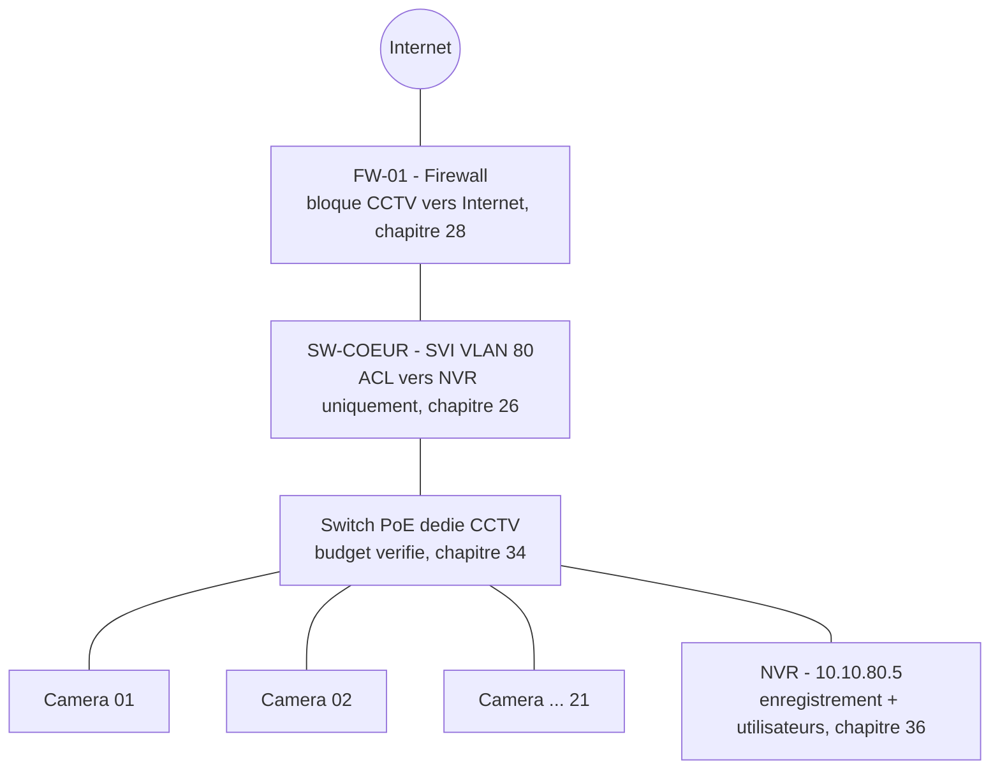

<div class="chapitre-titre-num">CHAPITRE 37</div>

# Intégration réseau + vidéosurveillance

## Objectifs pédagogiques

Revoir l'architecture complète de bout en bout — du VLAN CCTV jusqu'au NVR, en passant par le switch PoE dédié et le firewall — et vérifier que chaque pièce configurée séparément dans les chapitres précédents fonctionne réellement ensemble comme un système cohérent.

## Prérequis

Chapitres 33-36.

## OBJECTIF

Confirmer, par un test de bout en bout et non par une simple relecture de configuration, que l'isolation VLAN, le budget PoE, la bande passante réelle et le blocage Internet du VLAN CCTV fonctionnent tous simultanément, exactement comme conçu depuis le chapitre 11.

## 37.1 L'architecture complète, schéma de référence



Chaque flèche de ce schéma correspond à une configuration précise, déjà réalisée dans un chapitre antérieur — ce chapitre ne reconfigure rien, il **vérifie l'ensemble** comme un tout.

## 37.2 Test de bout en bout n°1 — isolation VLAN respectée

<div class="ou-executer">À EXÉCUTER SUR UN POSTE DE TEST — branché temporairement sur le VLAN 80 (CCTV)</div>

```
ping 10.10.20.1
ping 10.10.80.5
```

<div class="resultat encadre">
<span class="encadre-titre">📋 Résultat attendu</span>
Le ping vers `10.10.20.1` (passerelle du VLAN Utilisateurs) doit **échouer** (bloqué par l'ACL du chapitre 26.2) ; le ping vers `10.10.80.5` (le NVR, même VLAN) doit **réussir**. Le premier résultat confirme l'isolation, le second confirme que l'ACL n'a pas été configurée trop restrictivement au point de bloquer une communication légitime.
</div>

## 37.3 Test de bout en bout n°2 — blocage Internet respecté (double couche)

<div class="ou-executer">À EXÉCUTER SUR UN POSTE DE TEST — branché temporairement sur le VLAN 80 (CCTV)</div>

```
ping 8.8.8.8
```

<div class="resultat encadre">
<span class="encadre-titre">📋 Résultat attendu</span>
Échec — bloqué en réalité par **deux couches indépendantes** (défense en profondeur, chapitre 28) : l'ACL du switch cœur (chapitre 26.2, qui n'autorise que le NVR comme destination) **et** la règle explicite du firewall (chapitre 28, étape 5) si jamais la première venait à être désactivée par erreur. Vérifier, dans les journaux du firewall (`FortiView`), qu'aucune tentative de ce test n'apparaît comme autorisée.
</div>

## 37.4 Test de bout en bout n°3 — budget PoE réellement consommé

<div class="ou-executer">À EXÉCUTER SUR LE SWITCH PoE DÉDIÉ — Cisco IOS</div>

```
show power inline
```

<div class="resultat encadre">
<span class="encadre-titre">📋 Résultat attendu</span>
La consommation totale affichée doit être proche de la valeur calculée au chapitre 34.6 (~227 W pour 21 caméras), jamais significativement supérieure au budget PoE du switch installé — un écart important entre la valeur calculée et la valeur réellement mesurée indique soit une erreur de calcul initial, soit une caméra consommant davantage que son profil déclaré (à vérifier individuellement).
</div>

## 37.5 Test de bout en bout n°4 — bande passante réelle conforme au calcul

<div class="ou-executer">À EXÉCUTER SUR LE SWITCH PoE DÉDIÉ — Cisco IOS</div>

```
show interfaces GigabitEthernet1/0/24 | include rate
```

<div class="resultat encadre">
<span class="encadre-titre">📋 Résultat attendu</span>
Le débit mesuré sur le port d'uplink vers SW-COEUR (agrégeant le trafic des 21 caméras) doit être cohérent avec les `63 Mbit/s` calculés au chapitre 34.6 — un débit largement supérieur suggère un débit réel de caméra différent du bitrate cible configuré (chapitre 35, étape 4, à vérifier caméra par caméra si l'écart est significatif).
</div>

## 37.6 Test de bout en bout n°5 — enregistrement réel confirmé

Reprendre la checklist individuelle du chapitre 33 (étape 18) sur un échantillon représentatif de caméras (pas nécessairement les 21, mais au minimum une par type d'emplacement et de calendrier d'enregistrement configuré au chapitre 36.4) : relecture réelle d'une séquence enregistrée dans les dernières minutes, pas seulement un statut "en ligne" affiché par le NVR.

## DÉPANNAGE

Tout échec à l'un des cinq tests de ce chapitre renvoie précisément au chapitre où la configuration correspondante a été réalisée (11-12 pour le VLAN/ACL, 13 et 34 pour le PoE, 28 pour le firewall, 35-36 pour les caméras/NVR) — jamais une reconfiguration à l'aveugle sans avoir identifié laquelle des couches a échoué.

## CHECKLIST DE FIN — Volume 12 complet

- [ ] Isolation VLAN CCTV vérifiée (accès au NVR uniquement)
- [ ] Blocage Internet vérifié en double couche (ACL switch + règle firewall)
- [ ] Budget PoE réellement consommé cohérent avec le calcul du chapitre 34
- [ ] Bande passante réelle cohérente avec le calcul du chapitre 34
- [ ] Enregistrement réel confirmé par relecture sur un échantillon représentatif de caméras

## Laboratoire complet — simuler une caméra IP sans matériel CCTV réel

<div class="encadre astuce">
<span class="encadre-titre">💡 Pratiquer le VLAN/NVR sans acheter de caméra</span>
Un smartphone Android ou iOS peut se transformer en caméra IP de test via une application de flux vidéo réseau (par exemple une application "IP Webcam" gratuite disponible sur le store officiel de chaque plateforme, qui diffuse un flux MJPEG/RTSP accessible par adresse IP) — suffisant pour pratiquer l'intégralité de la chaîne réseau (VLAN, PoE non applicable ici, ajout à un logiciel VMS) sans investir dans du matériel de vidéosurveillance réel.
</div>

**Quoi installer** : une application de diffusion de flux réseau sur un smartphone (recherche "IP camera" sur le store officiel de l'appareil) + un logiciel VMS avec période d'évaluation gratuite compatible ONVIF/RTSP générique côté PC ou VM.
**Où télécharger** : store officiel du smartphone pour l'application ; le site du VMS choisi (plusieurs éditeurs proposent une édition gratuite limitée en nombre de caméras, suffisante pour ce laboratoire).
**Comment installer** : installer l'application sur le smartphone, la démarrer, noter l'adresse IP et le port RTSP/MJPEG affichés à l'écran ; installer le VMS sur une VM (VirtualBox, méthode chapitre 32) ou directement sur le poste de travail.
**RAM/CPU (VM VMS)** : 4 Go de RAM, 2 cœurs.
**Interfaces réseau** : smartphone et VM/PC hébergeant le VMS doivent être sur le **même réseau** (Wi-Fi domestique du foyer, à défaut d'un VLAN CCTV réel pour ce laboratoire).

**Topologie simplifiée** : `[ Smartphone (camera simulee) ] --- [ Reseau Wi-Fi du labo ] --- [ VM VMS ]`.

**Adresses IP** : notées directement depuis l'application du smartphone (généralement affichées à l'écran au démarrage du flux, ex. `192.168.1.45:8080`).

**Commandes/étapes à réaliser** : dans le VMS, ajouter une caméra manuellement par adresse IP et flux RTSP/MJPEG (l'équivalent exact de l'étape "ajout manuel" du chapitre 36.3, utilisée quand la découverte ONVIF automatique ne fonctionne pas) ; configurer un enregistrement continu de quelques minutes.

**Tests à réaliser** :
1. Confirmer l'image en direct visible dans le VMS.
2. Confirmer l'enregistrement réel par relecture (méthode de vérification du chapitre 33, étape 18 — la même exigence de relecture réelle, jamais un statut supposé).
3. Déplacer le smartphone (simulant un mouvement dans le champ de la "caméra") et observer si le VMS propose une détection de mouvement basique sur le flux — une bonne introduction pratique au principe du chapitre 35, étape 6, même si la configuration fine de zones de détection reste propre à chaque caméra IP réelle.

## Résumé du chapitre

L'intégration finale ne reconfigure rien : elle **prouve**, par cinq tests de bout en bout distincts, que l'isolation VLAN, le double blocage Internet, le budget PoE, la bande passante et l'enregistrement réel fonctionnent tous simultanément comme un système cohérent — chaque test renvoyant précisément au chapitre responsable en cas d'échec, jamais à une reconfiguration hasardeuse.

*Fin du Volume 12. Chapitre suivant : la supervision réseau — SNMP, agents, dashboard et alertes, premier chapitre du Volume 13.*
