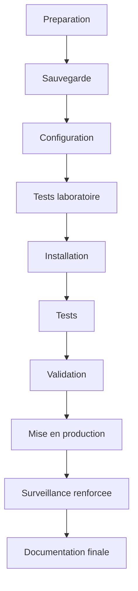

<div class="chapitre-titre-num">CHAPITRE 48</div>

# Mise en production, tests et recette

## Objectifs pédagogiques

Dérouler une procédure de mise en production qui évite toute interruption de service inutile, puis valider formellement le projet avec le client au moyen d'une matrice de tests complète et d'un rapport de recette signé.

## Prérequis

Volumes 1-14, chapitre 47.

## OBJECTIF

Basculer un réseau fraîchement configuré en production réelle, sans interruption pour les utilisateurs déjà en place (sur un projet de migration) ou avec un démarrage propre (sur un projet neuf), puis obtenir une validation formelle et documentée du client.

## 48.1 La procédure de mise en production



1. **Préparation** : confirmer la disponibilité de toute la nomenclature (chapitre 47), planifier une fenêtre de bascule en dehors des heures critiques du client, informer les utilisateurs concernés à l'avance.
2. **Sauvegarde** : sur un projet de migration (remplacement d'une infrastructure existante), sauvegarder l'état actuel avant toute modification — permet un retour en arrière si la bascule échoue.
3. **Configuration** : appliquer l'ensemble des chapitres de configuration de ce manuel (Volumes 7-13), idéalement préparée et testée **avant** le jour de la bascule (voir 48.2).
4. **Tests laboratoire** : valider la configuration en environnement isolé (chapitre 46, laboratoires suggérés par volume) avant tout déploiement sur le matériel réel du client.
5. **Installation** : déploiement physique (Volume 6) et raccordement final.
6. **Tests** : matrice de tests complète (48.3), jamais un simple "ça a l'air de marcher".
7. **Validation** : signature du client sur le rapport de recette (48.4).
8. **Mise en production** : bascule effective, en dehors des heures critiques (48.2).
9. **Surveillance renforcée** : période d'observation rapprochée (24-72h) suivant la bascule, avant de considérer le projet stabilisé.
10. **Documentation finale** : chapitre 49.

## 48.2 Comment éviter une interruption de service

<div class="encadre astuce">
<span class="encadre-titre">💡 Préparer un maximum en dehors de la fenêtre de bascule elle-même</span>
La quasi-totalité des configurations de ce manuel (VLAN, routage, firewall, Wi-Fi, serveurs) peuvent être **préparées et vérifiées en amont**, sur du matériel non encore mis en production ou en environnement de test — seule la bascule finale (raccordement physique, changement d'adressage sur l'existant) doit réellement se dérouler dans la fenêtre de service réduite. Réduire au strict minimum ce qui doit se faire "en direct" est la meilleure protection contre une interruption prolongée et imprévue.
</div>

Sur un projet de migration, prévoir systématiquement un **plan de retour arrière** (rollback) documenté avant la bascule : si un test critique de la matrice (48.3) échoue après la bascule, revenir à la configuration sauvegardée (étape 2) plutôt que de tenter de corriger dans l'urgence sur un réseau déjà en production perturbée.

## 48.3 La matrice de tests

Une matrice de tests professionnelle documente, pour chaque fonctionnalité critique du projet, le résultat attendu et le résultat réel obtenu — jamais une simple case "testé/non testé" sans détail.

| Test | Résultat attendu | Résultat réel | Statut |
|---|---|---|---|
| DHCP VLAN 20 | IP obtenue en moins de 5 s | 2 s | PASS |
| DHCP VLAN 25 (Comptabilité) | IP obtenue, isolée des autres VLAN | Confirmé | PASS |
| DNS interne | Résolution `srv-01.entreprise.local` | Résolue | PASS |
| DNS public (redirecteur) | Résolution `google.com` | Résolue | PASS |
| Internet (NAT) | Navigation web fonctionnelle | Fonctionnelle | PASS |
| VLAN CCTV isolé | Aucun accès sortant sauf NVR | Confirmé (chapitre 37) | PASS |
| Bascule VRRP | Coupure < 5 s au débranchement de SW-COEUR | 3 s | PASS |
| Wi-Fi Corporate | Connexion WPA2-Enterprise réussie | Confirmée | PASS |
| Wi-Fi Invité | Isolation client confirmée | Confirmée | PASS |
| Caméra 01 | Image nette, enregistrement confirmé | Confirmé | PASS |
| Sauvegarde serveur | Job planifié exécuté avec succès | Confirmé | PASS |
| Restauration test | Fichier restauré et vérifié | Confirmé (chapitre 39.6) | PASS |
| SSH sur chaque équipement | Connexion réussie, Telnet refusé | Confirmé | PASS |
| VPN SSL nomade | Connexion et accès aux ressources internes | Confirmée | PASS |
| Supervision | Tous les équipements "Available" dans Zabbix | Confirmé | PASS |

<div class="encadre attention">
<span class="encadre-titre">⚠️ Un seul test en échec bloque la validation, jamais une exception "à corriger plus tard"</span>
Un projet livré avec un ou plusieurs tests de cette matrice en échec, "à corriger dans une future intervention", installe une dette technique dès le premier jour — et prive le client d'une base fiable pour juger de la qualité de la livraison. Chaque échec doit être corrigé et re-testé avant la validation (étape 48.4), sans exception.
</div>

## 48.4 Le rapport de recette

Le rapport de recette formalise, par écrit et signé par le client, l'acceptation du projet livré :

```
RAPPORT DE RECETTE — [Nom du projet]

Date de recette : ___________
Représentant client : ___________
Représentant intégrateur : ___________

Matrice de tests jointe (section 48.3) : [ ] Tous les tests PASS
Documentation finale remise (chapitre 49) : [ ] Oui
Formation du client effectuée : [ ] Oui, voir chapitre 49

Réserves éventuelles : ___________________________

Signature client : ___________        Signature intégrateur : ___________
```

## Résumé du chapitre

La mise en production suit une séquence stricte (préparation → sauvegarde → configuration → tests laboratoire → installation → tests → validation → mise en production → surveillance renforcée → documentation), en préparant systématiquement tout ce qui peut l'être en dehors de la fenêtre de bascule elle-même, avec un plan de retour arrière documenté sur toute migration. La matrice de tests documente précisément le résultat attendu et obtenu de chaque fonctionnalité critique, et le rapport de recette formalise, signé, l'acceptation du client — aucun test en échec ne doit rester "à corriger plus tard" au moment de cette signature.

*Chapitre suivant : la documentation finale du client et la maintenance — les livrables remis, et le calendrier de maintenance quotidien à annuel.*
