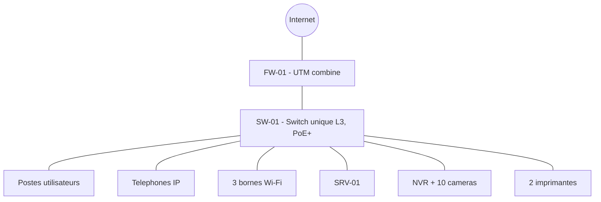

CHAPITRE 51

# Projet 1 — Petite entreprise, 30 employés

## Objectifs pédagogiques

Réaliser un premier projet complet de A à Z, en appliquant l'intégralité de la méthode de ce manuel à une échelle volontairement simple — l'occasion de voir comment les arbres de décision des chapitres 10, 14 et 15 conduisent naturellement à une architecture allégée, sans sur-ingénierie inutile.

## Prérequis

Volumes 1-15.

## 01. Cahier des charges

Une entreprise de **30 employés**, sur un seul étage d'un petit immeuble de bureaux, souhaite : un réseau informatique complet avec téléphonie IP, un Wi-Fi corporate et un Wi-Fi invité pour ses visiteurs, **1 serveur** de fichiers/annuaire, **2 imprimantes réseau**, et **10 caméras** de vidéosurveillance sur les entrées et l'open space.

## 02. Questions posées au client

Reprendre le questionnaire complet du chapitre 9.2 — réponses obtenues pour ce projet : croissance anticipée modeste (35-40 employés à 3 ans), aucun service à isoler particulièrement (pas de comptabilité séparée à ce stade), budget contraint imposant une architecture allégée, pas de deuxième site prévu.

## 03. Étude de site

Un seul étage, 320 m², open space + 3 bureaux fermés + 1 salle de réunion + accueil. Local technique : petite pièce fermée existante, climatisée, prise électrique dédiée disponible (chapitre 9). Distance maximale au poste le plus éloigné : 45 m (bien sous la limite de 90 m, chapitre 17.3).

## 04. Architecture

**Application des arbres de décision** (chapitre 10) :

- Utilisateurs (30-40) → branche "moins de 50" (chapitre 10.3) : architecture simple, **un seul switch** combinant cœur et accès, aucune redondance de switch cœur nécessaire.
- Caméras (10) → branche "moins de 20" (chapitre 10.4) : NVR de bureau, switch PoE partagé avec les autres usages (le budget PoE total reste modeste à cette échelle, calcul en section 12).
- Routeur/firewall (chapitre 14.1) : **combinés** dans un seul boîtier UTM, aucune séparation nécessaire à cette échelle.

## 05. Plan IP

| VLAN | Nom | Réseau | Passerelle | DHCP |
|---|---|---|---|---|
| 10 | Management | 10.51.10.0/28 | 10.51.10.1 | Non (statique) |
| 20 | Utilisateurs | 10.51.20.0/26 | 10.51.20.1 | Oui, .10-.55 |
| 30 | Serveurs | 10.51.30.0/29 | 10.51.30.1 | Non (statique) |
| 40 | VoIP | 10.51.40.0/26 | 10.51.40.1 | Réservation MAC |
| 50 | Wi-Fi Corporate | 10.51.50.0/26 | 10.51.50.1 | Oui, .10-.55 |
| 60 | Wi-Fi Invité | 10.51.60.0/27 | 10.51.60.1 | Oui, .10-.25 |
| 80 | CCTV | 10.51.80.0/27 | 10.51.80.1 | Réservation MAC |

Méthode complète : chapitre 11. Sous-dimensionné volontairement par rapport au bloc `/16` du projet fil rouge (chapitre 8.3) — un projet de cette taille n'a pas besoin de réserver un `/24` complet par VLAN, un `/26`-`/29` suffit largement avec une marge de croissance confortable pour 35-40 employés.

## 06. VLAN

Sept VLAN au lieu des neuf standards (chapitre 8.4) — **Comptabilité** et **Sécurité** omis, aucun besoin exprimé par le client (04) ne les justifie ; **IoT** non plus, faute d'objets connectés dans ce projet. Configuration technique identique à la méthode du chapitre 20, appliquée sur le seul switch SW-01 (pas de trunk inter-switch nécessaire, chapitre 21, puisqu'un unique switch dessert tout le projet).

## 07. Matériel (nomenclature, méthode chapitre 47)

| Référence | Équipement | Quantité | Caractéristiques minimales |
|---|---|---|---|
| SW-01 | Switch L3 24 ports PoE+ | 1 | Budget PoE ≥ 150 W (calcul section 12), VLAN/RSTP/SSH |
| FW-01 | Firewall UTM combiné | 1 | Débit avec inspection ≥ débit WAN souscrit (chapitre 14.2) |
| AP-01 à 03 | Borne Wi-Fi 6 | 3 | PoE, 2 SSID minimum |
| SRV-01 | Serveur tour ou rack 1U | 1 | AD/DNS/DHCP/fichiers (chapitre 16.6), RAID 1 minimum |
| NVR-01 | NVR de bureau, 16 canaux | 1 | Stockage ≥ calcul section 12 |
| CAM-01 à 10 | Caméra IP 2-4 MP | 10 | Dôme intérieur / bullet entrée (chapitre 16.1) |
| Imprimantes | Imprimante réseau | 2 | Port RJ45 |
| UPS-01 | Onduleur | 1 | Dimensionné section 12 |

## 08. Câblage

Méthode complète : chapitre 17. ~35 prises (30 postes + 2 imprimantes + 3 AP), toutes en Cat6 UTP, aucune distance ne dépassant 45 m (03) — aucun besoin de fibre sur ce projet.

## 09. Configuration

Reprendre à l'identique la méthode des chapitres 19-24 (accès, VLAN, ports, sécurité de base) sur **SW-01 uniquement** — le chapitre 21 (trunk/LACP) et le chapitre 27 (VRRP) ne s'appliquent pas à ce projet (un seul switch, pas de redondance de cœur à cette échelle, conformément à la décision de la section 04).

## 10. Firewall

Reprendre la méthode du chapitre 28, avec les objets d'adresse ajustés aux 7 VLAN de ce projet (05). Le VPN nomade (chapitre 29.2) reste pertinent si des employés travaillent à distance ; le VPN site-à-site (chapitre 29.1) est omis, aucune agence n'étant prévue.

## 11. Wi-Fi

Reprendre la méthode du chapitre 30 avec 3 bornes plutôt que le nombre du projet fil rouge — dimensionnement vérifié par les deux méthodes du chapitre 15.1 : couverture (320 m² ÷ 200 m²/borne ≈ 2 bornes) et capacité ((40 × 1,5) ÷ 30 ≈ 2 bornes) ; 3 bornes retenues pour une marge de sécurité sur la couverture réelle compte tenu des 3 bureaux fermés qui atténuent le signal.

## 12. Calculs (méthode chapitres 13.4, 15.1, 34)

**PoE** : 3 AP (20 W) + 10 caméras (9 W) + 2 téléphones IP partagés... soit au total `(3×20)+(10×9)=150 W`, ×1,2 = **180 W minimum** de budget PoE.
**CCTV — stockage** (méthode chapitre 34, caméras 2 MP H.265 ~2 Mbit/s, 30 jours) : `10 × 0,95 To × (2/3, ratio de débit inférieur) × 1,15 ≈ 7,3 To`.
**CCTV — bande passante** : `10 × 2 = 20 Mbit/s`.

## 13. CCTV

Reprendre la méthode complète des chapitres 33/35/36 — un NVR de bureau (10.4) suffit à ce volume, ONVIF pour l'ajout des 10 caméras, calendrier continu sur les 3 caméras d'entrée, détection de mouvement pour les 7 restantes (économie de stockage conforme à la note du chapitre 34.3).

## 14. Tests

Matrice complète selon le modèle du chapitre 48.3, adaptée aux 7 VLAN de ce projet — même structure, mêmes exigences, aucun allègement de la rigueur de test pour un "petit" projet.

## 15. Documentation

Dossier complet selon le chapitre 49.1 — la taille réduite du projet ne dispense d'aucun document de la liste.

## 16. Devis

Structure en 8 postes (chapitre 50.1) appliquée à la nomenclature de la section 07 — un projet de cette taille se chiffre généralement en jours plutôt qu'en semaines pour les postes main-d'œuvre et configuration, une différence d'échelle à refléter explicitement dans le devis final remis au client.

## 17. Maintenance

Calendrier du chapitre 49.2 appliqué à l'identique — la fréquence des contrôles ne dépend pas de la taille du projet, seul le temps passé à chaque contrôle varie.

## Résumé du chapitre

Ce premier projet complet illustre comment les arbres de décision des chapitres 10 et 14 conduisent naturellement à une architecture allégée et cohérente (un seul switch, un firewall/routeur combiné, un NVR de bureau) sans qu'aucune étape de la méthode ne soit sautée pour autant — les 17 points du cahier des charges sont tous traités, à l'échelle réelle du projet.

*Chapitre suivant : Projet 2 — entreprise moyenne, 150 employés, VLAN invité et DMZ.*
