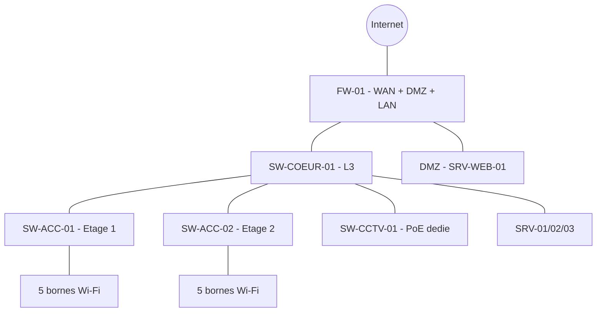

<div class="chapitre-titre-num">CHAPITRE 52</div>

# Projet 2 — Entreprise moyenne, 150 employés

## Objectifs pédagogiques

Un second projet complet, traité point par point comme un véritable engagement client indépendant — sa propre adresse réseau, ses propres équipements, ses propres configurations intégrales — avec un élément entièrement nouveau : une **DMZ** pour un serveur web public.

## Prérequis

Volumes 1-15, chapitre 51.

<div class="encadre astuce">
<span class="encadre-titre">💡 Convention d'adressage de ce chapitre</span>
Chaque projet du Volume 16 reçoit son propre deuxième octet (chapitre 11.4), ici `10.52.x.x` — un identifiant distinct du scénario fil rouge des Volumes 7-13 (`10.10.x.x`) et du Projet 1 (`10.51.x.x`), pour qu'aucune confusion ne soit possible entre les réseaux de différents clients.
</div>

## 01. Cahier des charges

Une entreprise de **150 employés**, sur 2 étages, avec téléphonie IP, Wi-Fi corporate et invité, **3 serveurs**, **10 bornes Wi-Fi**, **30 caméras** de vidéosurveillance, et un serveur web public accessible depuis Internet, isolé du réseau interne.

## 02. Questions posées au client

Croissance anticipée à 180 employés sous 3 ans. Aucun service à isoler particulièrement en interne. Site web institutionnel déjà en développement par un prestataire externe, à héberger en interne pour le contrôle des données. Pas d'agence distante prévue à ce stade (contrairement au Projet 5).

## 03. Étude de site

2 étages de 450 m² chacun, open space + bureaux fermés par étage. Local technique unique au rez-de-chaussée, climatisé. Distance maximale au poste le plus éloigné (2ᵉ étage) : 75 m — sous la limite de 90 m (chapitre 17.3), aucune fibre horizontale nécessaire.

## 04. Architecture

**Arbre de décision utilisateurs** (chapitre 10.3) : 150-180 → branche "50-250 utilisateurs" → un **switch cœur dédié**, distinct des switches d'accès de chaque étage (contrairement au Projet 1, où un switch unique suffisait).
**Arbre de décision caméras** (chapitre 10.4) : 30 → branche "20-100" → switch PoE dédié à la vidéosurveillance obligatoire, VLAN CCTV strict, calcul de bande passante rigoureux (section 12), NVR d'appliance suffisant (pas encore le seuil VMS/SAN du Projet 3).
**Routeur/firewall** (chapitre 14.1) : combinés dans un firewall FortiGate unique (**FW-01**), avec une troisième zone dédiée à la DMZ.



## 05. Plan IP

| VLAN | Nom | Réseau | Passerelle | DHCP |
|---|---|---|---|---|
| 10 | Management | 10.52.10.0/27 | 10.52.10.1 | Non (statique) |
| 15 | DMZ | 10.52.15.0/28 | 10.52.15.1 | Non (statique) |
| 20 | Utilisateurs | 10.52.20.0/24 | 10.52.20.1 | Oui, .20-.230 |
| 30 | Serveurs | 10.52.30.0/27 | 10.52.30.1 | Non (statique) |
| 40 | VoIP | 10.52.40.0/24 | 10.52.40.1 | Réservation MAC |
| 50 | Wi-Fi Corporate | 10.52.50.0/24 | 10.52.50.1 | Oui, .20-.230 |
| 60 | Wi-Fi Invité | 10.52.60.0/26 | 10.52.60.1 | Oui, .10-.60 |
| 80 | CCTV | 10.52.80.0/26 | 10.52.80.1 | Réservation MAC |
| 99 | Liaisons pt-à-pt | 10.52.99.0/24 | — | — |

Méthode complète chapitre 11 ; VoIP et Utilisateurs dimensionnés en `/24` (254 disponibles) car 150 employés, avec la marge de croissance de la section 02, dépassent la capacité d'un `/25` (126).

## 06. VLAN

8 VLAN (Management, DMZ, Utilisateurs, Serveurs, VoIP, Wi-Fi Corporate, Wi-Fi Invité, CCTV) — Comptabilité, Sécurité et IoT omis, aucun besoin exprimé (02) ne les justifie pour ce client précis.

<div class="ou-executer">À EXÉCUTER SUR LE SWITCH — Cisco IOS (SW-COEUR-01)</div>

```
SW-COEUR-01(config)# vlan 10
SW-COEUR-01(config-vlan)# name Management
SW-COEUR-01(config-vlan)# exit
SW-COEUR-01(config)# vlan 20
SW-COEUR-01(config-vlan)# name Utilisateurs
SW-COEUR-01(config-vlan)# exit
SW-COEUR-01(config)# vlan 30
SW-COEUR-01(config-vlan)# name Serveurs
SW-COEUR-01(config-vlan)# exit
SW-COEUR-01(config)# vlan 40
SW-COEUR-01(config-vlan)# name VoIP
SW-COEUR-01(config-vlan)# exit
SW-COEUR-01(config)# vlan 50
SW-COEUR-01(config-vlan)# name WiFi-Corporate
SW-COEUR-01(config-vlan)# exit
SW-COEUR-01(config)# vlan 60
SW-COEUR-01(config-vlan)# name WiFi-Invite
SW-COEUR-01(config-vlan)# exit
SW-COEUR-01(config)# vlan 80
SW-COEUR-01(config-vlan)# name CCTV
SW-COEUR-01(config-vlan)# exit
SW-COEUR-01(config)# vlan 999
SW-COEUR-01(config-vlan)# name Native-Non-Utilise
```

## 07. Matériel (nomenclature)

| Référence | Équipement | Quantité | Caractéristiques minimales |
|---|---|---|---|
| SW-ACC-01/02 | Switch d'accès 48 ports PoE+ | 2 | Budget PoE ≥ calcul section 12, VLAN/RSTP/LACP |
| SW-COEUR-01 | Switch cœur L3, uplinks SFP+ | 1 | Routage inter-VLAN, ACL |
| SW-CCTV-01 | Switch PoE+ 24 ports dédié | 1 | Budget PoE ≥ calcul section 12 |
| FW-01 | Firewall UTM, 3 zones (WAN/LAN/DMZ) | 1 | Débit avec inspection ≥ débit WAN (chapitre 14.2) |
| AP-01 à 10 | Borne Wi-Fi 6 | 10 | PoE, 2 SSID |
| SRV-01/02/03 | Serveur rack 1U | 3 | AD/DNS/DHCP, applicatif, supervision |
| SRV-WEB-01 | Serveur rack 1U (DMZ) | 1 | Ubuntu, Nginx (chapitre 32) |
| NVR-01 | NVR 32 canaux | 1 | Stockage ≥ calcul section 12 |
| CAM-01 à 30 | Caméra IP 4 MP | 30 | Types variables selon emplacement |
| UPS-01 | Onduleur rack | 1 | Dimensionné section 12 |

## 08. Câblage

~170 prises (150 postes/téléphones partagés + 10 AP + divers), Cat6 UTP, 75 m maximum (03) — aucune fibre horizontale nécessaire, seuls les uplinks SW-ACC↔SW-COEUR passent en SFP fibre courte (chapitre 13.6) pour la marge de débit.

## 09. Configuration des switches

<div class="ou-executer">À EXÉCUTER SUR LE SWITCH — Cisco IOS (SW-ACC-01, étage 1)</div>

```
SW-ACC-01(config)# hostname SW-ACC-01
SW-ACC-01(config)# interface vlan 10
SW-ACC-01(config-if)# ip address 10.52.10.2 255.255.255.224
SW-ACC-01(config-if)# no shutdown
SW-ACC-01(config)# ip default-gateway 10.52.10.1
SW-ACC-01(config)# interface range gigabitEthernet 1/0/1-40
SW-ACC-01(config-if-range)# switchport mode access
SW-ACC-01(config-if-range)# switchport access vlan 20
SW-ACC-01(config-if-range)# switchport voice vlan 40
SW-ACC-01(config-if-range)# spanning-tree portfast
SW-ACC-01(config-if-range)# spanning-tree bpduguard enable
SW-ACC-01(config-if-range)# switchport port-security
SW-ACC-01(config-if-range)# switchport port-security maximum 2
SW-ACC-01(config-if-range)# switchport port-security violation restrict
SW-ACC-01(config-if-range)# switchport port-security mac-address sticky
SW-ACC-01(config)# interface range gigabitEthernet 1/0/47-48
SW-ACC-01(config-if-range)# channel-group 1 mode active
SW-ACC-01(config)# interface port-channel 1
SW-ACC-01(config-if)# switchport mode trunk
SW-ACC-01(config-if)# switchport trunk allowed vlan 10,20,40,50,60
SW-ACC-01(config-if)# switchport trunk native vlan 999
SW-ACC-01(config)# ip dhcp snooping
SW-ACC-01(config)# ip dhcp snooping vlan 20,40,50,60
SW-ACC-01(config)# interface port-channel 1
SW-ACC-01(config-if)# ip dhcp snooping trust
SW-ACC-01(config)# copy running-config startup-config
```

`SW-ACC-02` reprend exactement cette configuration (méthode du tableau de reproduction, chapitre 27.5), avec `10.52.10.3` comme adresse de management. Méthode complète : chapitres 19-24.

<div class="ou-executer">À EXÉCUTER SUR LE SWITCH — Cisco IOS (SW-COEUR-01)</div>

```
SW-COEUR-01(config)# ip routing
SW-COEUR-01(config)# interface vlan 20
SW-COEUR-01(config-if)# ip address 10.52.20.1 255.255.255.0
SW-COEUR-01(config-if)# no shutdown
SW-COEUR-01(config)# interface vlan 30
SW-COEUR-01(config-if)# ip address 10.52.30.1 255.255.255.224
SW-COEUR-01(config-if)# no shutdown
SW-COEUR-01(config)# interface vlan 40
SW-COEUR-01(config-if)# ip address 10.52.40.1 255.255.255.0
SW-COEUR-01(config-if)# no shutdown
SW-COEUR-01(config)# interface vlan 50
SW-COEUR-01(config-if)# ip address 10.52.50.1 255.255.255.0
SW-COEUR-01(config-if)# no shutdown
SW-COEUR-01(config)# interface vlan 60
SW-COEUR-01(config-if)# ip address 10.52.60.1 255.255.255.192
SW-COEUR-01(config-if)# no shutdown
SW-COEUR-01(config)# interface vlan 80
SW-COEUR-01(config-if)# ip address 10.52.80.1 255.255.255.192
SW-COEUR-01(config-if)# no shutdown
SW-COEUR-01(config)# ip access-list extended ACL-CCTV-SORTANT
SW-COEUR-01(config-ext-nacl)# permit ip 10.52.80.0 0.0.0.63 host 10.52.80.5
SW-COEUR-01(config-ext-nacl)# deny ip 10.52.80.0 0.0.0.63 any log
SW-COEUR-01(config)# interface vlan 80
SW-COEUR-01(config-if)# ip access-group ACL-CCTV-SORTANT out
SW-COEUR-01(config)# ip route 0.0.0.0 0.0.0.0 10.52.99.1
SW-COEUR-01(config)# copy running-config startup-config
```

Méthode complète : chapitre 26 (SVI, ACL). Aucune redondance de switch cœur retenue ici (contrairement au Projet 3) — 150-180 employés reste dans la branche "intermédiaire" du chapitre 10.3, où un switch cœur unique est jugé un compromis acceptable pour ce budget client.

## 10. Firewall — et la DMZ

<div class="encadre astuce">
<span class="encadre-titre">💡 Ce que rappel : jamais un serveur public directement sur le LAN</span>
Une DMZ isole le serveur web public à la fois d'Internet (accès limité au strict port nécessaire) et du réseau interne (aucune connexion sortante depuis la DMZ jamais autorisée vers le LAN) — la justification complète est développée au premier projet qui en a eu besoin (chapitre 52 d'une version antérieure de ce même chapitre) et reste valable à l'identique ici.
</div>

<div class="ou-executer">À EXÉCUTER SUR LE FIREWALL — FortiOS CLI (FW-01)</div>

```
config system interface
    edit "wan1"
        set ip 203.0.113.10 255.255.255.252
        set allowaccess ping
    next
    edit "internal1"
        set ip 10.52.99.1 255.255.255.252
        set allowaccess ping https ssh
    next
    edit "dmz1"
        set ip 10.52.15.1 255.255.255.240
        set allowaccess ping
    next
end
config firewall vip
    edit "VIP-Site-Web"
        set extip 203.0.113.11
        set extintf "wan1"
        set mappedip "10.52.15.10"
        set portforward enable
        set protocol tcp
        set extport 443
        set mappedport 443
    next
end
config firewall address
    edit "RESEAU-Utilisateurs" 
        set subnet 10.52.20.0 255.255.255.0
    next
    edit "RESEAU-CCTV"
        set subnet 10.52.80.0 255.255.255.192
    next
end
config firewall policy
    edit 1
        set name "LAN-vers-Internet"
        set srcintf "internal1"
        set dstintf "wan1"
        set srcaddr "all"
        set dstaddr "all"
        set action accept
        set schedule "always"
        set service "ALL"
        set nat enable
        set utm-status enable
        set av-profile "default"
        set webfilter-profile "default"
    next
    edit 2
        set name "BLOQUE-CCTV-Internet"
        set srcintf "internal1"
        set dstintf "wan1"
        set srcaddr "RESEAU-CCTV"
        set dstaddr "all"
        set action deny
        set logtraffic all
    next
    edit 3
        set name "Internet-vers-DMZ-Web"
        set srcintf "wan1"
        set dstintf "dmz1"
        set srcaddr "all"
        set dstaddr "VIP-Site-Web"
        set action accept
        set schedule "always"
        set service "HTTPS"
    next
    edit 4
        set name "BLOQUE-DMZ-vers-LAN"
        set srcintf "dmz1"
        set dstintf "internal1"
        set srcaddr "all"
        set dstaddr "all"
        set action deny
        set logtraffic all
    next
end
move 2 before 1
```

Méthode complète (interfaces, zones, NAT, règles) : chapitre 28. VPN nomade (chapitre 29.2) activé pour les télétravailleurs ; VPN site-à-site omis, aucune agence prévue (02).

## 11. Wi-Fi

10 bornes réparties 5 par étage — vérification par les deux méthodes du chapitre 15.1 : couverture (900 m² total ÷ 200 m²/borne ≈ 5 bornes) et capacité ((180 × 1,8) ÷ 30 ≈ 11 bornes) → le critère de capacité l'emporte (le plus élevé des deux, chapitre 15.1), 10 bornes retenues avec une marge légèrement inférieure au calcul strict, documentée et acceptée avec le client compte tenu du budget, à revoir si la croissance à 180 employés se confirme. SSID `Entreprise-Corporate` (VLAN 50, WPA2/3-Enterprise) et `Entreprise-Invite` (VLAN 60, portail captif) — méthode complète chapitre 30.

## 12. Calculs

**PoE switch d'accès** (par étage, ~20 téléphones + 5 AP) : `(20×7)+(5×20) = 240 W`, ×1,2 = **288 W minimum**.
**PoE switch CCTV** : `30 × 9 = 270 W`, ×1,2 = **324 W minimum** — cohérent avec la ligne "30 caméras" du tableau du chapitre 34.5.
**Bande passante CCTV** : `30 × 3 = 90 Mbit/s` (4 MP H.265).
**Stockage CCTV** (30 jours) : `30 × 0,95 To × 1,15 ≈ 32,8 To`.

## 13. CCTV

NVR d'appliance (branche 20-100 du chapitre 10.4), 30 caméras ajoutées via ONVIF (chapitre 36.3), calendrier continu sur les entrées et l'accueil, détection de mouvement pour les couloirs intérieurs (chapitre 36.4). Procédure complète en 18 étapes : chapitre 33, appliquée sans raccourci aux 30 caméras.

## 14. Tests

Matrice du chapitre 48.3, avec les trois lignes DMZ déjà illustrées (accès HTTPS public, DMZ→LAN bloqué, LAN→DMZ administration limitée à Management) ajoutées à la matrice standard.

## 15. Documentation

Dossier complet chapitre 49.1, incluant la configuration de la zone DMZ dans le schéma logique (chapitre 3.3) et le plan VLAN d'accès (chapitre 3.7).

## 16. Devis

8 postes (chapitre 50.1) appliqués à la nomenclature de la section 07 — le poste Configuration inclut désormais explicitement le temps de mise en place et de test de la DMZ, une charge de travail réelle à ne pas fondre silencieusement dans le forfait général.

## 17. Maintenance

Calendrier du chapitre 49.2, avec un point d'attention supplémentaire en maintenance trimestrielle : vérifier que le serveur web de la DMZ reçoit bien ses propres mises à jour de sécurité (chapitre 32.7), un serveur exposé sur Internet étant une cible bien plus sollicitée qu'un serveur purement interne.

## Résumé du chapitre

Ce second projet, à l'échelle de 150 employés, reprend l'architecture intermédiaire du chapitre 10.3 (switch cœur unique, sans redondance à ce stade) et introduit la DMZ : un segment isolé publiant un serveur web par NAT de destination, bloqué en retour vers le LAN par une règle explicite — la seule différence structurelle réelle avec le Projet 1, le reste de la méthode s'appliquant à l'identique, à une échelle simplement plus grande.

*Chapitre suivant : Projet 3 — grande entreprise, 500 employés, cluster de firewalls et VMS.*
