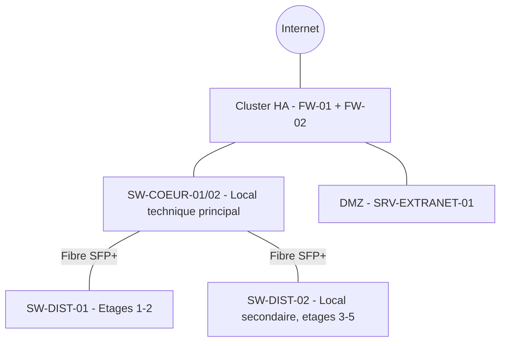

<div class="chapitre-titre-num">CHAPITRE 53</div>

# Projet 3 — Grande entreprise, 500 employés

## Objectifs pédagogiques

Passer à l'échelle "grande entreprise" : architecture Core/Distribution/Access complète avec fibre, cluster de firewalls en haute disponibilité, DMZ, et bascule d'une architecture NVR vers un VMS logiciel avec stockage SAN pour 100 caméras.

## Prérequis

Volumes 1-15, chapitres 51-52.

<div class="encadre astuce">
<span class="encadre-titre">💡 Convention d'adressage</span>
Ce projet utilise `10.53.x.x`, distinct des Projets 1 (`10.51.x.x`) et 2 (`10.52.x.x`).
</div>

## 01. Cahier des charges

**500 employés**, sur 5 étages d'un immeuble de bureaux, **100 caméras**, **20 bornes Wi-Fi**, plusieurs serveurs virtualisés, **2 firewalls en haute disponibilité**, plusieurs baies réseau reliées en fibre, VoIP, DMZ pour un portail extranet client, supervision et sauvegardes complètes.

## 02. Questions posées au client

Croissance anticipée à 550 employés sous 3 ans. Portail extranet destiné aux clients de l'entreprise (consultation de commandes), devant rester accessible même en cas de forte charge — d'où l'exigence de continuité de service sur le firewall (02, justifiant la HA). Aucune agence distante à ce stade (traité séparément au Projet 5).

## 03. Étude de site

5 étages de 600 m² chacun. Deux locaux techniques : un local principal (rez-de-chaussée, baie cœur + baie serveurs) et un local secondaire (3ᵉ étage, baie de distribution intermédiaire) — la distance du rez-de-chaussée au 5ᵉ étage dépassant la limite pratique d'un câblage horizontal unique.

## 04. Architecture

**Arbre de décision utilisateurs** (chapitre 10.3) : 500-550 → branche **"plus de 250"** → architecture Core/Distribution/Access complète, redondance à prévoir.
**Arbre de décision caméras** (chapitre 10.4) : 100 → seuil de la branche **"plus de 100"** → VMS logiciel sur stockage SAN dédié (13).



## 05. Plan IP

Convention étendue du chapitre 8.3 : le troisième octet distingue désormais à la fois le VLAN **et** la zone de distribution, sur le modèle VLSM du chapitre 5.

| VLAN | Zone | Réseau | Passerelle |
|---|---|---|---|
| 10 | Management (tout le site) | 10.53.10.0/26 | 10.53.10.1 |
| 15 | DMZ | 10.53.15.0/28 | 10.53.15.1 |
| 20 | Utilisateurs — Dist. 1 (étages 1-2) | 10.53.20.0/24 | 10.53.20.1 |
| 21 | Utilisateurs — Dist. 2 (étages 3-5) | 10.53.21.0/24 | 10.53.21.1 |
| 30 | Serveurs | 10.53.30.0/26 | 10.53.30.1 |
| 40 | VoIP (tout le site) | 10.53.40.0/23 | 10.53.40.1 |
| 50 | Wi-Fi Corporate | 10.53.50.0/23 | 10.53.50.1 |
| 60 | Wi-Fi Invité | 10.53.60.0/25 | 10.53.60.1 |
| 80 | CCTV | 10.53.80.0/24 | 10.53.80.1 |
| 99 | Liaisons pt-à-pt (fibre) | 10.53.99.0/24 | — |

<div class="encadre astuce">
<span class="encadre-titre">💡 Pourquoi le VLAN Utilisateurs est scindé en deux (20 et 21)</span>
Séparer les utilisateurs par zone de distribution (plutôt qu'un unique VLAN 20 pour tout le site) limite la taille de chaque domaine de broadcast (chapitre 5.1) à environ 250 postes au lieu de 500, et surtout localise immédiatement un incident (chapitre 41) à la zone de distribution concernée — un bénéfice direct de la méthode VLSM appliquée à l'échelle d'un vrai grand projet, plutôt qu'une simple habitude.
</div>

## 06-08. VLAN, matériel, câblage

10 VLAN (méthode chapitre 12, appliquée deux fois pour les VLAN 20/21 sur des switches de distribution distincts). Nomenclature (méthode chapitre 47) : 2 firewalls, 2 switches cœur, 2 switches de distribution, ~8 switches d'accès (un ou deux par étage selon la densité), 1 switch PoE CCTV dédié (voire deux compte tenu du volume, calcul section 12), 20 bornes Wi-Fi, serveur VMS + baie SAN (13), 100 caméras. Câblage certifié (chapitre 17) par zone de distribution, fibre SFP+ entre chaque distribution et le cœur (chapitre 13.6, le volume agrégé de 250+ postes et 100 caméras exclut un uplink cuivre 1G).

## 09. Configuration — tableau de reproduction

La configuration de chaque switch (accès, distribution, cœur) suit à l'identique la méthode complète des chapitres 19-27 — hostname, VLAN, ports, trunk LACP, RSTP, Port Security, DHCP Snooping, SVI, OSPF ou VRRP selon le rôle. Plutôt que de répéter le même bloc de commandes pour chacun des ~12 équipements de ce projet (chapitre 50, règle contre la répétition inutile), voici le tableau exact de reproduction :

| Équipement | Rôle | Adresse management | VLAN portés |
|---|---|---|---|
| SW-COEUR-01 | Cœur, master VRRP | 10.53.10.2 | Toutes les SVI |
| SW-COEUR-02 | Cœur, backup VRRP | 10.53.10.3 | Toutes les SVI |
| SW-DIST-01 | Distribution étages 1-2 | 10.53.10.10 | 20, 40, 50, 60 |
| SW-DIST-02 | Distribution étages 3-5 | 10.53.10.11 | 21, 40, 50, 60 |
| SW-ACC-01 à 08 | Accès par étage | 10.53.10.20-27 | 20 ou 21 selon l'étage, 40, 50, 60 |
| SW-CCTV-01/02 | PoE dédié CCTV | 10.53.10.30-31 | 80 |

VRRP (chapitre 27) est configuré sur SW-COEUR-01/02 pour chaque VLAN, exactement selon la méthode et le tableau de reproduction déjà illustrés au chapitre 27.5 — SW-COEUR-01 prioritaire (110), SW-COEUR-02 backup (100), `preempt` et `track` actifs.

## 10. Firewall — cluster HA et DMZ

<div class="ou-executer">À EXÉCUTER SUR LE FIREWALL — FortiOS CLI (FW-01, priorité haute ; répéter en miroir sur FW-02 avec priorité inférieure)</div>

```
config system ha
    set mode a-p
    set group-name "CLUSTER-FW-500"
    set password ClusterHASecret2026!
    set priority 200
    set hbdev "port3" 50
end
config system interface
    edit "dmz1"
        set ip 10.53.15.1 255.255.255.240
        set allowaccess ping
    next
end
config firewall vip
    edit "VIP-Extranet"
        set extip 203.0.113.20
        set extintf "wan1"
        set mappedip "10.53.15.10"
        set portforward enable
        set protocol tcp
        set extport 443
        set mappedport 443
    next
end
config firewall policy
    edit 10
        set name "Internet-vers-DMZ-Extranet"
        set srcintf "wan1"
        set dstintf "dmz1"
        set srcaddr "all"
        set dstaddr "VIP-Extranet"
        set action accept
        set schedule "always"
        set service "HTTPS"
    next
    edit 11
        set name "BLOQUE-DMZ-vers-LAN"
        set srcintf "dmz1"
        set dstintf "internal1"
        set srcaddr "all"
        set dstaddr "all"
        set action deny
        set logtraffic all
    next
end
```

<div class="resultat encadre">
<span class="encadre-titre">📋 Résultat attendu (vérification HA)</span>

```
FW-01 # get system ha status
  vcluster 1: work
    FW-01: master
    FW-02: slave
```
</div>

Méthode complète du cluster HA : identique à la version précédente de ce chapitre — `hbdev` dédié, bascule automatique, `priority` distincte des deux membres.

## 11. Wi-Fi

20 bornes, méthode du chapitre 15.1 appliquée par étage, contrôleur unique pour tout le site (chapitre 15.6).

## 12-13. Calculs et CCTV — VMS + SAN

**Calculs** (méthode chapitre 34, 100 caméras, 4 MP H.265, 30 jours) : bande passante `100 × 3 = 300 Mbit/s`, stockage `100 × 0,95 × 1,15 ≈ 109,3 To`, budget PoE `100 × 9 × 1,2 = 1 080 W`, réparti sur 2 switches PoE dédiés (SW-CCTV-01/02, section 09).

Un serveur VMS dédié (SRV-VMS-01, dimensionné selon la méthode du chapitre 16.6) remplace le NVR d'appliance, connecté en fibre 10G à une baie SAN dédiée (iSCSI) dimensionnée sur les 109,3 To calculés, en RAID 10 (chapitre 16.7, débit d'écriture simultané élevé sur 100 flux). Chaque caméra reste configurée selon la méthode identique du chapitre 35 ; l'ajout au VMS suit un principe ONVIF équivalent au chapitre 36.3.

## 14-17. Tests, documentation, devis, maintenance

Matrice de tests (chapitre 48.3) enrichie d'un test de bascule HA (débrancher FW-01, confirmer la bascule automatique sur FW-02 sans perte de session VPN) et des trois tests DMZ déjà illustrés au chapitre 52.14. Documentation, devis (nomenclature substantiellement plus large, deux baies réseau et une baie SAN à budgétiser séparément) et maintenance suivent les mêmes méthodes qu'aux chapitres précédents.

## Résumé du chapitre

À l'échelle de 500 employés, l'architecture passe à trois couches complètes avec fibre entre elles, un VLAN Utilisateurs scindé par zone de distribution (VLSM appliqué à la localisation d'incident), le firewall devient un cluster actif-passif en haute disponibilité avec sa propre DMZ, et le franchissement du seuil de 100 caméras impose une bascule vers un VMS logiciel sur stockage SAN dédié — chaque évolution découlant directement des arbres de décision et des critères déjà posés aux chapitres 10 et 14, jamais d'un choix arbitraire.

*Chapitre suivant : Projet 4 — campus d'entreprise, plusieurs bâtiments, fibre en anneau et redondance inter-bâtiments.*
