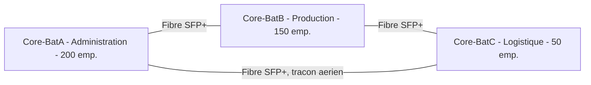

<div class="chapitre-titre-num">CHAPITRE 54</div>

# Projet 4 — Campus d'entreprise, plusieurs bâtiments

## Objectifs pédagogiques

Concevoir un campus de plusieurs bâtiments reliés en anneau de fibre optique, où OSPF démontre enfin tout son intérêt réel à trois nœuds : un lien inter-bâtiment en panne ne coupe jamais le campus, le trafic se réoriente automatiquement.

## Prérequis

Volumes 1-15, chapitres 51-53.

<div class="encadre astuce">
<span class="encadre-titre">💡 Convention d'adressage à deux niveaux</span>
Ce projet utilise `10.54.x.x` (identifiant de projet, comme les précédents) — et, à l'intérieur de ce bloc, une extension du **numéro de VLAN standard** (chapitre 8.4) par bâtiment : Bâtiment A garde la numérotation de base (VLAN 20 = Utilisateurs), Bâtiment B ajoute 100 (VLAN 120 = Utilisateurs), Bâtiment C ajoute 200 (VLAN 220 = Utilisateurs) — un VLAN 1xx ou 2xx s'identifie ainsi instantanément comme appartenant à un bâtiment précis, sans avoir à consulter un tableau externe.
</div>

## 01. Cahier des charges

Un campus de **3 bâtiments** (Administration, Production/Ateliers, Logistique), environ **400 employés** au total, réseau unifié entre bâtiments, vidéosurveillance couvrant également les espaces extérieurs entre bâtiments, continuité de service même en cas de coupure d'une liaison inter-bâtiment.

## 02. Questions posées au client

Bâtiment Administration : 200 employés (siège du firewall et de l'accès Internet). Production : 150 employés + zone atelier avec contraintes d'interférence électromagnétique (chapitre 17.2, câblage blindé FTP à prévoir). Logistique : 50 employés, quais de chargement à couvrir en vidéosurveillance extérieure.

## 03. Étude de site

Trois bâtiments distincts, tranchées existantes entre Administration↔Production et Production↔Logistique (vérifiées lors de l'étude, chapitre 9), aucune tranchée directe Administration↔Logistique — la liaison de fermeture de l'anneau (04) devra emprunter un tracé aérien ou une nouvelle tranchée, un surcoût à chiffrer explicitement (16).

## 04. Architecture



<div class="encadre astuce">
<span class="encadre-titre">💡 Anneau plutôt qu'étoile</span>
Chaque bâtiment dispose de deux chemins physiquement distincts vers les deux autres — la coupure d'un seul lien (le scénario le plus probable, chapitre 42.10, dommage de tranchée lors de travaux de voirie) laisse le campus entièrement fonctionnel, reconfiguré automatiquement par OSPF (05) en quelques secondes.
</div>

## 05. Plan IP et VLAN par bâtiment

| VLAN | Nom | Bâtiment | Réseau |
|---|---|---|---|
| 10 | Management | A | 10.54.10.0/27 |
| 20 | Utilisateurs | A | 10.54.20.0/24 |
| 30 | Serveurs | A | 10.54.30.0/27 |
| 40 | VoIP | A | 10.54.40.0/24 |
| 80 | CCTV | A | 10.54.80.0/25 |
| 110 | Management | B | 10.54.110.0/27 |
| 120 | Utilisateurs | B | 10.54.120.0/24 |
| 140 | VoIP | B | 10.54.140.0/24 |
| 180 | CCTV | B | 10.54.180.0/25 |
| 210 | Management | C | 10.54.210.0/28 |
| 220 | Utilisateurs | C | 10.54.220.0/25 |
| 240 | VoIP | C | 10.54.240.0/25 |
| 280 | CCTV | C | 10.54.280.0/26 |
| 99 | Liaisons fibre inter-bâtiments | — | 10.54.99.0/24 |

Liaisons de l'anneau (VLSM en `/30`, méthode chapitre 5) : A↔B `10.54.99.0/30`, B↔C `10.54.99.4/30`, C↔A `10.54.99.8/30`.

## 06. Routage OSPF inter-bâtiments

<div class="ou-executer">À EXÉCUTER SUR LE SWITCH — Cisco IOS (Core-BatA)</div>

```
Core-BatA(config)# interface GigabitEthernet1/0/1
Core-BatA(config-if)# description Fibre vers Core-BatB
Core-BatA(config-if)# no switchport
Core-BatA(config-if)# ip address 10.54.99.1 255.255.255.252
Core-BatA(config-if)# no shutdown
Core-BatA(config)# interface GigabitEthernet1/0/2
Core-BatA(config-if)# description Fibre vers Core-BatC
Core-BatA(config-if)# no switchport
Core-BatA(config-if)# ip address 10.54.99.10 255.255.255.252
Core-BatA(config-if)# no shutdown
Core-BatA(config)# router ospf 1
Core-BatA(config-router)# router-id 10.54.10.1
Core-BatA(config-router)# network 10.54.10.0 0.0.0.31 area 0
Core-BatA(config-router)# network 10.54.20.0 0.0.0.255 area 0
Core-BatA(config-router)# network 10.54.30.0 0.0.0.31 area 0
Core-BatA(config-router)# network 10.54.40.0 0.0.0.255 area 0
Core-BatA(config-router)# network 10.54.80.0 0.0.0.127 area 0
Core-BatA(config-router)# network 10.54.99.0 0.0.0.3 area 0
Core-BatA(config-router)# network 10.54.99.8 0.0.0.3 area 0
Core-BatA(config-router)# copy running-config startup-config
```

**Bâtiment B** (`Core-BatB`, router-id `10.54.110.1`) et **Bâtiment C** (`Core-BatC`, router-id `10.54.210.1`) reprennent la même méthode, chacun annonçant ses propres réseaux locaux et ses deux liaisons fibre vers ses voisins directs de l'anneau (tableau de reproduction, principe déjà appliqué au chapitre 53.09).

## VÉRIFICATION

<div class="ou-executer">À EXÉCUTER SUR LE SWITCH — Cisco IOS (Core-BatA)</div>

```
Core-BatA# show ip ospf neighbor
```

<div class="resultat encadre">
<span class="encadre-titre">📋 Résultat attendu</span>
Deux voisins `FULL` (Core-BatB et Core-BatC, un pour chaque lien de l'anneau) — un seul voisin `FULL` signalerait qu'un des deux liens de fermeture de l'anneau n'est pas encore opérationnel (à corriger avant mise en production, jamais accepté comme "presque bon").
</div>

## 07-09. VLAN, matériel, câblage, configuration des switches

Chaque bâtiment reprend intégralement l'architecture Core/Distribution/Access adaptée à sa taille (Administration et Production suivent le modèle du Projet 3, Logistique celui du Projet 1) — la configuration de chaque switch d'accès et de distribution suit à l'identique les chapitres 19-24, selon le tableau de reproduction déjà illustré au chapitre 53.09, étendu à trois jeux d'équipements distincts par bâtiment.

## 10-11. Firewall et Wi-Fi

Un unique cluster de firewalls en haute disponibilité (méthode identique au chapitre 53.10) positionné en frontière du bâtiment Administration, qui héberge la liaison opérateur principale — Production et Logistique atteignent Internet via l'anneau de fibre et le routage OSPF. Wi-Fi (chapitre 30) dimensionné bâtiment par bâtiment, contrôleur unique pour le campus entier garantissant un roaming cohérent d'un bâtiment à l'autre (chapitre 15.6).

## 12-13. Calculs et CCTV extérieure

Caméras extérieures (quais de Logistique, voies de circulation entre bâtiments, cahier des charges 01) : indice IP66 minimum (chapitre 16.4), portée IR adaptée aux distances extérieures, liaison fibre pour toute caméra au-delà de 90 m d'un local technique (chapitre 17.3) plutôt qu'un tirage cuivre hors norme.

## 14. Tests — la preuve de l'anneau

<div class="encadre attention">
<span class="encadre-titre">⚠️ Le test le plus important de ce projet</span>
Débrancher **volontairement** un des trois liens de l'anneau (par exemple C↔A) pendant un `ping` continu entre un poste de Logistique et un serveur d'Administration — le trafic doit se réorienter automatiquement via Production (B) en quelques secondes (`show ip ospf neighbor` confirme la disparition du voisin direct, `show ip route` confirme le nouveau chemin appris). Sans ce test réalisé **réellement**, l'investissement dans la topologie en anneau (04) n'est qu'une hypothèse non vérifiée.
</div>

## 15-17. Documentation, devis, maintenance

Documentation (chapitre 49) avec un schéma consolidé du campus en plus d'un schéma par bâtiment. Devis (chapitre 50) chiffrant séparément le surcoût de la liaison de fermeture C↔A (tracé aérien identifié en 03). Maintenance (chapitre 49.2) avec un registre distinct par bâtiment pour les contrôles physiques, un registre unique pour la supervision centralisée (chapitre 38, qui couvre naturellement les trois bâtiments depuis un seul outil).

## Résumé du chapitre

Un campus de plusieurs bâtiments relie ses cœurs en anneau de fibre, chaque bâtiment recevant sa propre tranche de VLAN (base, +100, +200) pour une identification immédiate. OSPF, configuré ici sur trois nœuds réels avec leurs vraies liaisons, démontre concrètement sa valeur : la rupture d'un lien de l'anneau se reconfigure automatiquement, un fait vérifié par un test de débranchement réel, pas simplement affirmé en théorie.

*Chapitre suivant : Projet 5 — entreprise multi-sites, VPN site-à-site vers plusieurs agences.*
