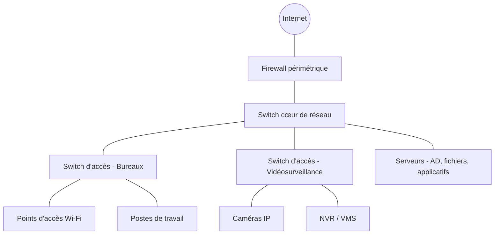

CHAPITRE 1

# Introduction aux réseaux

## Objectifs pédagogiques

Comprendre ce qu'est un réseau informatique, distinguer les différentes échelles de réseaux (LAN, WAN, MAN, PAN, SAN), et situer VPN, Internet, Intranet et Extranet dans une architecture d'entreprise.

## Prérequis

Aucun. Ce chapitre ouvre le manuel.

## 1.1 Qu'est-ce qu'un réseau informatique ?

💡 Définition
Un réseau informatique est un ensemble d'équipements (ordinateurs, serveurs, imprimantes, téléphones IP, caméras...) interconnectés par des liens filaires ou sans fil, capables d'échanger des données selon des règles communes appelées protocoles.

Trois éléments constituent systématiquement un réseau :

1. **Les nœuds (hosts)** : tout équipement disposant d'une adresse réseau (poste, serveur, imprimante, caméra IP, téléphone IP).
2. **Les liens** : le support physique ou logique reliant les nœuds (cuivre, fibre optique, radiofréquence Wi-Fi).
3. **Les règles d'échange (protocoles)** : les conventions qui permettent à deux équipements de se comprendre, quel que soit leur fabricant.

💡 Pourquoi ce manuel commence par les fondamentaux
Un intégrateur qui déploie un réseau de 300 postes et 40 caméras IP dans un centre commercial (chapitre 31) doit maîtriser exactement les mêmes fondamentaux qu'un étudiant qui configure ses deux premiers postes en réseau — seule l'échelle change, jamais les principes. Ce manuel construit délibérément ces fondamentaux avant d'aborder la moindre configuration réelle.

## 1.2 Types de réseaux par étendue géographique

### 1.2.1 PAN (Personal Area Network)

Réseau à l'échelle d'un individu, quelques mètres : liaison Bluetooth entre un smartphone et une montre connectée, un casque audio sans fil.

### 1.2.2 LAN (Local Area Network)

Réseau local, à l'échelle d'un bâtiment ou d'un étage : le réseau d'un bureau, d'une salle de classe, d'un étage d'hôpital. C'est l'échelle de travail principale des chapitres 6 à 13 de ce manuel.

### 1.2.3 MAN (Metropolitan Area Network)

Réseau à l'échelle d'une ville : interconnexion de plusieurs bâtiments d'une même municipalité ou d'un campus universitaire étalé sur plusieurs rues (chapitre 27, projet Université).

### 1.2.4 WAN (Wide Area Network)

Réseau à grande échelle, reliant plusieurs sites géographiquement distants : le réseau interne d'une banque avec ses agences dans tout le pays (chapitre 30), ou d'un siège social multi-sites (chapitre 34). Internet est le plus grand WAN existant.

### 1.2.5 SAN (Storage Area Network)

⚠️ Ne pas confondre ce SAN avec le SAN "réseau à l'échelle du quartier"
Dans le contexte entreprise/datacenter, SAN désigne presque toujours un **Storage Area Network** : un réseau dédié à haute performance (souvent en fibre optique, protocole Fibre Channel ou iSCSI) reliant des serveurs à des baies de stockage partagées — concept central du chapitre 36 (projet Datacenter), à ne pas confondre avec un réseau LAN classique qui transporte des données applicatives génériques.

## 1.3 Réseaux logiques : VPN, Internet, Intranet, Extranet

| Terme | Définition | Exemple |
|---|---|---|
| **Internet** | Réseau mondial public, interconnexion de millions de réseaux indépendants | Navigation web, messagerie |
| **Intranet** | Réseau privé d'une organisation, basé sur les mêmes protocoles qu'Internet mais inaccessible depuis l'extérieur | Portail RH interne, annuaire d'entreprise |
| **Extranet** | Extension contrôlée de l'intranet, ouverte à des partenaires externes authentifiés | Portail fournisseur, espace client B2B |
| **VPN (Virtual Private Network)** | Tunnel chiffré permettant de relier deux réseaux ou un utilisateur distant à un réseau privé, via un réseau public (Internet) | Télétravailleur se connectant au réseau du siège (chapitre 11) |

💡 Le VPN ne crée pas un nouveau réseau physique, il l'étend virtuellement
Un salarié en télétravail connecté en VPN "semble" présent sur le réseau local de l'entreprise (il peut accéder aux serveurs de fichiers internes comme s'il était au bureau) alors qu'il transite en réalité par Internet — le chiffrement du tunnel VPN garantit que ce trajet public reste confidentiel et intègre, détaillé au chapitre 11.

## 1.4 Panorama d'un réseau d'entreprise moderne

Ce schéma synthétise l'ensemble des briques que ce manuel va détailler : le firewall (chapitre 13), le switch cœur et les switches d'accès (chapitre 10), le Wi-Fi (chapitre 12), les serveurs (chapitres 14-15), et le réseau dédié à la vidéosurveillance (chapitre 21) — volontairement isolé du réseau bureautique par un VLAN distinct.

## 1.5 Erreurs fréquentes

⚠️ Confondre l'échelle d'un réseau avec sa complexité technique
Un LAN de petite entreprise (20 postes) et un LAN de grand hôpital (2000 postes, chapitre 28) utilisent les mêmes protocoles fondamentaux — la complexité additionnelle vient de la segmentation, de la redondance et de la sécurité, pas d'une "autre sorte" de réseau.

## 1.6 Bonnes pratiques

- Toujours identifier l'échelle réelle du besoin (LAN, MAN, WAN) avant de dimensionner une solution technique.
- Séparer logiquement Intranet et Extranet dès la conception, même sur un réseau physique unique — l'isolation se fait par VLAN et règles de firewall (chapitres 6 et 13).
- Documenter systématiquement les interconnexions VPN entre sites, elles constituent souvent le point le plus sensible d'un audit de sécurité (chapitre 16).

## 1.7 Résumé du chapitre

- Un réseau se définit par ses nœuds, ses liens et ses protocoles communs.
- L'échelle géographique distingue PAN, LAN, MAN, WAN, et le SAN désigne un réseau de stockage dédié.
- Internet, Intranet, Extranet et VPN sont des notions logiques de périmètre et d'accès, superposables à n'importe quelle échelle physique.

## Exercices

📝 Exercice 1.1

Une entreprise possède un siège à Port-au-Prince et trois agences dans d'autres villes, toutes interconnectées. Un salarié en déplacement se connecte au réseau du siège depuis un hôtel via Internet. Identifiez : le type de réseau reliant les quatre sites, et le mécanisme permettant la connexion du salarié.

**Corrigé :**
Les quatre sites interconnectés forment un **WAN** (réseau à grande échelle, multi-villes). Le salarié en déplacement utilise un **VPN** pour établir un tunnel chiffré depuis l'hôtel (réseau public) jusqu'au réseau privé du siège.

*Chapitre suivant : les modèles réseau OSI et TCP/IP, socle théorique de toute la suite du manuel.*
