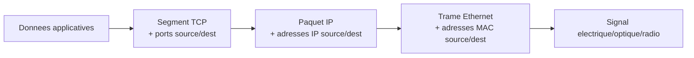

CHAPITRE 2

# Modèles réseau

## Objectifs pédagogiques

Maîtriser le modèle OSI à sept couches et le modèle TCP/IP à quatre couches, comprendre l'encapsulation et la décapsulation, et savoir situer chaque équipement/protocole du manuel dans la couche correspondante.

## Prérequis

Chapitre 1.

## 2.1 Pourquoi un modèle en couches ?

💡 Diviser pour mieux dépanner
Découper la communication réseau en couches indépendantes permet à chaque couche de ne se préoccuper que de son propre rôle (acheminement physique, adressage, transport fiable, application) — un ingénieur qui diagnostique une panne peut isoler le problème couche par couche, plutôt que de considérer le réseau comme une boîte noire monolithique. Cette démarche structurera le dépannage dans l'ensemble du manuel.

## 2.2 Le modèle OSI (Open Systems Interconnection)

| Couche | Nom | Rôle | Exemples |
|---|---|---|---|
| 7 | Application | Interface avec les logiciels utilisateurs | HTTP, HTTPS, FTP, SMTP, DNS |
| 6 | Présentation | Format, chiffrement, compression des données | TLS/SSL, JPEG, ASCII |
| 5 | Session | Ouverture, gestion et fermeture des sessions | NetBIOS, RPC |
| 4 | Transport | Transport fiable ou non, segmentation | TCP, UDP |
| 3 | Réseau | Adressage logique et routage | IP, ICMP, protocoles de routage (chapitre 11) |
| 2 | Liaison de données | Adressage physique (MAC), commutation | Ethernet, switches, VLAN (chapitre 10) |
| 1 | Physique | Transmission des signaux bruts | Câblage cuivre/fibre, connecteurs (chapitre 8) |

💡 Moyen mnémotechnique
"**P**hysique **L**iaison **R**éseau **T**ransport **S**ession **P**résentation **A**pplication" — de bas en haut, ou en anglais "**A**ll **P**eople **S**eem **T**o **N**eed **D**ata **P**rocessing" pour "Application, Presentation, Session, Transport, Network, Data Link, Physical" de haut en bas.

## 2.3 Le modèle TCP/IP (modèle pratique, réellement implémenté)

⚠️ OSI est un modèle théorique de référence, TCP/IP est le modèle réellement utilisé sur Internet
Aucun équipement réel n'implémente strictement les 7 couches OSI séparées — le modèle TCP/IP, plus condensé (4 couches), est celui effectivement câblé dans les systèmes d'exploitation et équipements réseau. OSI reste néanmoins la référence pédagogique universelle pour raisonner et communiquer entre professionnels.

| Couche TCP/IP | Équivalent OSI | Rôle |
|---|---|---|
| Application | Application + Présentation + Session | Protocoles applicatifs (HTTP, DNS, SMTP...) |
| Transport | Transport | TCP (fiable, avec accusés de réception) ou UDP (rapide, sans garantie) |
| Internet | Réseau | Adressage IP et routage |
| Accès réseau | Liaison de données + Physique | Ethernet, Wi-Fi, câblage |

## 2.4 Encapsulation et décapsulation

💡 L'encapsulation : chaque couche ajoute son propre en-tête, comme des enveloppes imbriquées
Quand un poste de travail envoie une requête web, la couche Application génère une requête HTTP ; la couche Transport l'encapsule dans un segment TCP (ajout des ports source/destination) ; la couche Internet encapsule ce segment dans un paquet IP (ajout des adresses IP source/destination) ; la couche Accès réseau encapsule ce paquet dans une trame Ethernet (ajout des adresses MAC). Chaque couche ignore le contenu des couches supérieures, elle ne fait qu'ajouter sa propre enveloppe.

À la réception, l'opération inverse s'appelle la **décapsulation** : chaque couche du destinataire retire son en-tête correspondant avant de transmettre le contenu à la couche supérieure, jusqu'à ce que l'application finale reçoive les données originales.

## 2.5 Unités de données par couche (PDU — Protocol Data Unit)

| Couche | Nom de l'unité de données |
|---|---|
| Application | Données (Data) |
| Transport | Segment (TCP) ou Datagramme (UDP) |
| Réseau | Paquet |
| Liaison de données | Trame |
| Physique | Bits |

⚠️ Un vocabulaire précis évite les malentendus en entreprise
Dire "le paquet n'arrive pas" quand le problème est en réalité au niveau de la trame (adressage MAC) ou du segment (port bloqué par un firewall, chapitre 13) peut orienter un diagnostic dans la mauvaise direction — utiliser le terme exact de la couche concernée facilite la communication entre techniciens et accélère le dépannage.

## 2.6 Exemple concret : parcours d'une requête web à travers les couches

1. **Application** : le navigateur génère une requête `GET /` en HTTP.
2. **Transport** : TCP découpe et numérote les segments, ajoute les ports (source aléatoire, destination 443 pour HTTPS).
3. **Réseau** : IP ajoute l'adresse IP source du poste et l'adresse IP destination du serveur web.
4. **Liaison de données** : Ethernet ajoute l'adresse MAC du poste et l'adresse MAC de la prochaine destination (souvent la passerelle/routeur, pas le serveur final).
5. **Physique** : la trame est convertie en signaux électriques (cuivre), optiques (fibre) ou radio (Wi-Fi) et transmise sur le support.

💡 L'adresse MAC de destination change à chaque saut, l'adresse IP de destination ne change jamais
C'est la distinction fondamentale entre couche 2 et couche 3 : l'adresse IP identifie la destination finale de bout en bout, tandis que l'adresse MAC ne sert qu'à identifier le prochain équipement sur le chemin (le routeur suivant) — un routeur (chapitre 11) réécrit systématiquement l'adresse MAC à chaque saut tout en conservant l'adresse IP d'origine.

## 2.7 Erreurs fréquentes

⚠️ Confondre couche 2 (switch) et couche 3 (routeur) lors d'un dépannage
Un switch (couche 2) ne comprend que les adresses MAC et ne route jamais entre réseaux IP différents — un problème de communication entre deux VLAN différents (chapitre 10) ne se résout jamais en vérifiant la configuration d'un switch seul, il nécessite un routeur ou un switch de couche 3 pour effectuer le routage inter-VLAN.

## 2.8 Bonnes pratiques

- Toujours identifier la couche concernée avant de commencer un diagnostic réseau (le problème est-il physique, de commutation, de routage, ou applicatif ?).
- Utiliser le vocabulaire précis (trame, paquet, segment) dans la documentation technique (chapitre 25), plutôt que le terme générique "paquet" pour tout.

## 2.9 Résumé du chapitre

- Le modèle OSI (7 couches) est la référence théorique universelle ; le modèle TCP/IP (4 couches) est celui réellement implémenté.
- L'encapsulation ajoute un en-tête à chaque couche descendante ; la décapsulation retire ces en-têtes à la réception.
- Chaque couche possède sa propre unité de données (bits, trame, paquet, segment, données) et son propre type d'adressage (MAC en couche 2, IP en couche 3).

## Exercices

📝 Exercice 2.1

Un technicien constate qu'un poste de travail ne parvient pas à joindre un serveur situé dans un autre VLAN, alors que la commutation locale (même VLAN) fonctionne parfaitement. À quelle couche OSI ce problème se situe-t-il le plus probablement, et quel type d'équipement faut-il vérifier en priorité ?

**Corrigé :**
Le problème se situe à la **couche 3 (Réseau)** : la commutation locale (couche 2) fonctionnant, il faut vérifier le **routeur ou le switch de couche 3** assurant le routage inter-VLAN, ainsi que les éventuelles ACL (chapitre 6) bloquant le trafic entre ces deux VLAN.

*Chapitre suivant : l'adressage IP, IPv4/IPv6, subnetting et VLSM.*
