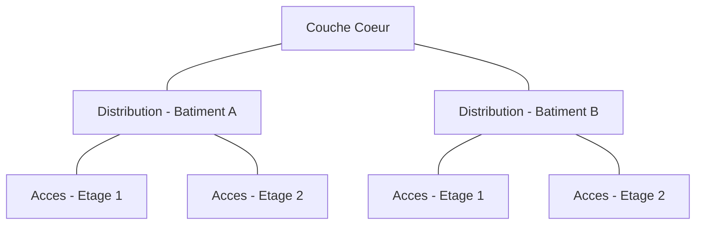

<div class="chapitre-titre-num">CHAPITRE 6</div>

# Conception logique

## Objectifs pédagogiques

Concevoir un plan d'adressage complet, segmenter un réseau en VLAN cohérents, appliquer les principes de QoS et d'ACL, et comprendre l'architecture réseau hiérarchique et la haute disponibilité.

## Prérequis

Chapitres 1-5.

## 6.1 L'architecture hiérarchique à trois niveaux

<div class="encadre astuce">
<span class="encadre-titre">💡 Le modèle Cisco à trois couches, standard de l'industrie</span>
Ce modèle structure logiquement n'importe quel réseau d'entreprise, quel que soit le constructeur retenu (chapitre 4) : chaque couche a un rôle unique, ce qui simplifie le dépannage et l'évolution future.
</div>

| Couche | Rôle | Équipements typiques |
|---|---|---|
| **Cœur (Core)** | Commutation/routage à très haut débit entre les blocs du réseau, aucune fonction de sécurité complexe | Switches cœur haute performance |
| **Distribution** | Routage inter-VLAN, application des ACL et de la QoS, agrégation des switches d'accès | Switches de couche 3 |
| **Accès (Access)** | Connexion des postes, téléphones IP, caméras, points d'accès Wi-Fi | Switches d'accès PoE |



<div class="encadre astuce">
<span class="encadre-titre">💡 Réseaux plus petits : modèle réduit à deux couches</span>
Pour un site unique de taille modeste (une école, chapitre 26), les couches Cœur et Distribution sont souvent fusionnées en un unique switch de couche 3 central — le modèle à trois couches complètes se justifie surtout à partir d'un campus (chapitre 35) ou d'un datacenter (chapitre 36).
</div>

## 6.2 Segmentation par VLAN

<div class="encadre astuce">
<span class="encadre-titre">💡 Le VLAN : isoler logiquement sans multiplier le câblage physique</span>
Un VLAN (Virtual LAN, IEEE 802.1Q) crée un domaine de diffusion (broadcast domain) distinct sur une infrastructure physique partagée — les postes du VLAN 10 ne voient jamais le trafic broadcast du VLAN 20, même s'ils sont connectés au même switch physique. Détaillé techniquement au chapitre 10.
</div>

### Plan de VLAN type pour une entreprise moyenne

| VLAN ID | Nom | Usage | Sous-réseau (exemple) |
|---|---|---|---|
| 10 | Direction | Postes de direction | 10.10.10.0/24 |
| 20 | Bureautique | Postes utilisateurs standards | 10.10.20.0/23 |
| 30 | Téléphonie IP | Voix sur IP (VoIP) | 10.10.30.0/24 |
| 40 | Vidéosurveillance | Caméras IP et NVR (chapitre 21) | 10.10.40.0/23 |
| 50 | Wi-Fi invités | Accès Internet uniquement, isolé du LAN | 10.10.50.0/24 |
| 60 | Serveurs | DMZ interne, serveurs applicatifs | 10.10.60.0/25 |
| 99 | Management | Administration des équipements réseau eux-mêmes | 10.10.99.0/27 |

<div class="encadre attention">
<span class="encadre-titre">⚠️ Toujours isoler le VLAN de management des VLAN utilisateurs</span>
Un attaquant ayant compromis un poste utilisateur classique ne doit jamais pouvoir atteindre directement l'interface d'administration des switches/routeurs — le VLAN 99 (management) doit être accessible uniquement depuis un poste d'administration dédié, filtré par ACL (section 6.4) et rappelé au chapitre 16 (Zero Trust).
</div>

## 6.3 Plan d'adressage IP global

Rappel direct du chapitre 3 (VLSM) appliqué à l'échelle d'un projet complet : chaque VLAN reçoit un sous-réseau dimensionné selon l'inventaire du chapitre 5, documenté dans un tableau maître unique conservé dans le dossier d'architecture (chapitre 25).

## 6.4 ACL (Access Control List)

<div class="encadre astuce">
<span class="encadre-titre">💡 Une ACL filtre le trafic selon des critères précis (source, destination, port, protocole)</span>
Contrairement à un firewall périmétrique (chapitre 13) qui filtre le trafic entrant/sortant d'Internet, une ACL s'applique en interne, typiquement sur un routeur ou un switch de couche 3, pour contrôler le trafic **entre VLAN** — par exemple, autoriser le VLAN Bureautique à joindre le VLAN Serveurs sur le port 443 uniquement, tout en bloquant tout accès du VLAN Wi-Fi invités vers n'importe quel VLAN interne.
</div>

```
! Exemple d'ACL Cisco IOS : bloquer le Wi-Fi invites vers tous les VLAN internes,
! mais autoriser la sortie Internet
access-list 100 deny ip 10.10.50.0 0.0.0.255 10.10.0.0 0.0.255.255
access-list 100 permit ip 10.10.50.0 0.0.0.255 any
```

## 6.5 QoS (Quality of Service)

<div class="encadre astuce">
<span class="encadre-titre">💡 La QoS priorise certains flux quand la bande passante est limitée</span>
La voix sur IP (VoIP) et la vidéosurveillance en temps réel tolèrent très mal la latence et la gigue (jitter) — la QoS marque ces flux en priorité haute (classe EF — Expedited Forwarding pour la voix) pour qu'ils passent avant un simple transfert de fichier en cas de saturation du lien, principe détaillé techniquement au chapitre 10.
</div>

## 6.6 Haute disponibilité (introduction, détaillée au chapitre 11)

Principes de conception à intégrer dès la phase logique :

- **Redondance de liens** : agrégation (LACP) entre switches critiques, pour tolérer la panne d'un câble ou d'un port.
- **Redondance de passerelle** : VRRP/HSRP entre deux routeurs, pour qu'un poste conserve sa connectivité même si le routeur principal tombe.
- **Redondance d'alimentation** : onduleurs et blocs d'alimentation redondants sur les équipements critiques (chapitre 9).

## 6.7 Erreurs fréquentes

<div class="encadre attention">
<span class="encadre-titre">⚠️ Créer trop peu de VLAN "pour simplifier", au détriment de la sécurité</span>
Mélanger la vidéosurveillance et la bureautique dans un même VLAN (pour "gagner du temps" à la conception) expose l'ensemble du réseau utilisateur en cas de compromission d'une caméra IP mal sécurisée — un défaut de conception fréquent et coûteux à corriger après déploiement.
</div>

## 6.8 Bonnes pratiques

- Toujours documenter le plan de VLAN et le plan d'adressage dans un tableau maître unique, mis à jour à chaque modification (chapitre 25).
- Isoler systématiquement la vidéosurveillance (chapitre 21), la téléphonie IP, et le Wi-Fi invités dans des VLAN dédiés.
- Prévoir la haute disponibilité dès la conception logique, pas comme un ajout a posteriori.

## 6.9 Résumé du chapitre

- L'architecture hiérarchique à trois couches (Cœur, Distribution, Accès) structure logiquement tout réseau d'entreprise.
- Le VLAN segmente les domaines de diffusion ; l'ACL filtre le trafic inter-VLAN ; la QoS priorise les flux sensibles à la latence.
- La haute disponibilité (redondance de liens, de passerelle, d'alimentation) se conçoit dès cette phase logique, pas après coup.

## Exercices

<div class="encadre exercice">
<span class="encadre-titre">📝 Exercice 6.1</span>

Proposez un plan de VLAN pour un petit hôtel (chapitre 29) avec : réception/administration, Wi-Fi clients, vidéosurveillance, et téléphonie IP.
</div>

**Corrigé :**
| VLAN | Usage |
|---|---|
| 10 | Réception / Administration |
| 20 | Wi-Fi clients (isolé, accès Internet uniquement) |
| 30 | Téléphonie IP |
| 40 | Vidéosurveillance |

*Chapitre suivant : la conception physique (plans, baies, climatisation, chemins de câbles).*
