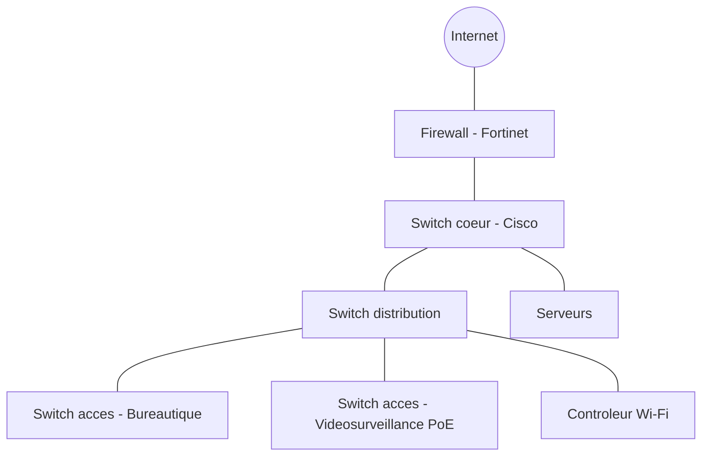

<div class="chapitre-titre-num">CHAPITRE 7</div>

# Conception physique

## Objectifs pédagogiques

Concevoir l'implantation physique d'un local serveur/baies, dimensionner la climatisation et l'alimentation électrique, planifier les chemins de câbles, et produire des schémas réseau professionnels avec Visio, Draw.io et Mermaid.

## Prérequis

Chapitres 1-6.

## 7.1 Le local serveur / local technique

<div class="encadre astuce">
<span class="encadre-titre">💡 Un local technique n'est jamais "un simple placard"</span>
Le local hébergeant les baies de brassage et équipements actifs doit répondre à des exigences précises, souvent sous-estimées dans les petits projets : température contrôlée, alimentation électrique dédiée et protégée, accès restreint, et absence de risque d'infiltration d'eau (jamais sous un point d'eau, jamais au sous-sol en zone inondable).
</div>

Critères de choix d'un local technique :

- Surface suffisante pour circuler autour des baies (minimum 60 cm à l'arrière, 90 cm à l'avant pour l'ouverture des portes).
- Absence de canalisations d'eau/chauffage traversant le plafond du local.
- Porte fermant à clé, accès restreint et journalisé pour les sites sensibles (banque, chapitre 30 ; datacenter, chapitre 36).
- Alimentation électrique dédiée sur un circuit distinct, avec mise à la terre conforme (section 7.4).

## 7.2 Climatisation

<div class="encadre astuce">
<span class="encadre-titre">💡 La chaleur est le premier ennemi silencieux d'un local technique</span>
Chaque équipement actif dissipe de la chaleur ; sans régulation thermique, la température peut dépasser les seuils de fonctionnement garantis par les constructeurs, provoquant des redémarrages intempestifs voire des pannes matérielles définitives. Une climatisation dédiée (et non le chauffage/climatisation général du bâtiment, qui s'arrête souvent la nuit ou le week-end) est requise dès qu'un local héberge plusieurs baies actives.
</div>

Règle de dimensionnement simplifiée : la puissance frigorifique nécessaire (en BTU ou kW) se calcule à partir de la puissance électrique totale consommée par les équipements actifs du local (quasi-intégralement transformée en chaleur), avec une marge de sécurité de 20 %.

## 7.3 Alimentation électrique

- **Circuit dédié** : le local technique doit disposer d'un ou plusieurs circuits électriques dédiés, dimensionnés pour la charge actuelle et future (chapitre 5).
- **Onduleurs (UPS)** : détaillés au chapitre 9, ils protègent contre les coupures et micro-coupures.
- **Alimentation redondante** : pour les sites critiques (chapitre 30, 36), prévoir une double arrivée électrique (voire un groupe électrogène de secours).

## 7.4 Mise à la terre

<div class="encadre attention">
<span class="encadre-titre">⚠️ Une mise à la terre défaillante endommage silencieusement les équipements</span>
Une masse électrique mal reliée à la terre peut provoquer des différences de potentiel entre équipements interconnectés, générant des dysfonctionnements intermittents difficiles à diagnostiquer (ports réseau qui se désactivent aléatoirement, redémarrages inexpliqués) — la vérification de la mise à la terre par un électricien qualifié doit précéder toute installation active dans un nouveau local.
</div>

## 7.5 Chemins de câbles

Principes de conception des chemins de câbles (chemins de câbles métalliques, goulottes, faux plafonds) :

- Séparer physiquement les chemins de câbles courant fort (électrique) et courant faible (réseau) d'au moins 30 cm, ou utiliser des séparateurs métalliques, pour limiter les perturbations électromagnétiques.
- Prévoir un taux de remplissage maximal de 50 à 70 % des chemins de câbles pour permettre des ajouts futurs sans reprise complète.
- Étiqueter les chemins de câbles à chaque traversée de cloison/plancher pour faciliter la maintenance (rappel du chapitre 8, étiquetage).

## 7.6 Racks et organisation des baies

<div class="encadre astuce">
<span class="encadre-titre">💡 Organisation verticale standard d'une baie 42U</span>
De haut en bas : panneaux de brassage (patch panels) en haut, switches actifs juste en dessous (raccourcit les cordons de brassage), serveurs/UPS en milieu de baie (poids réparti), équipements de stockage en bas (centre de gravité bas pour la stabilité de la baie).
</div>

```
Position dans la baie (42U)      Equipement
--------------------------------------------------
U42 - U40                        Panneau de brassage cuivre (24 ports)
U39 - U37                        Panneau de brassage fibre
U36 - U34                        Switch coeur / distribution
U33 - U28                        Switches d'acces (empilables)
U27 - U20                        Serveurs (rack-mount)
U19 - U12                        Baie de stockage / NAS
U11 - U5                         Onduleur (UPS) rack
U4  - U1                         Tiroir clavier/ecran ou reserve
```

## 7.7 Brassage

Le brassage relie, via des cordons courts (patch cords), le panneau de brassage (extrémité fixe du câblage horizontal) aux ports des équipements actifs. Un brassage propre et documenté (couleurs par usage, longueurs adaptées, cheminement en peigne) facilite considérablement la maintenance ultérieure (chapitre 8 pour la méthodologie complète de câblage).

## 7.8 Créer des schémas réseau professionnels

<div class="encadre astuce">
<span class="encadre-titre">💡 Trois outils complémentaires selon le contexte</span>
- **Microsoft Visio** : standard historique en entreprise, riche bibliothèque de pochoirs (stencils) constructeurs (Cisco, HPE...), format `.vsdx` largement accepté par les clients grands comptes.
- **Draw.io (diagrams.net)** : gratuit, fonctionnalités proches de Visio, format ouvert, excellent pour les PME et les consultants indépendants.
- **Mermaid** : diagrammes générés à partir de texte, versionnables dans un dépôt Git aux côtés de la documentation, idéal pour une documentation technique vivante et un dossier d'architecture maintenu comme du code.
</div>

Exemple de schéma logique en Mermaid, utilisé tout au long de ce manuel :



<div class="encadre attention">
<span class="encadre-titre">⚠️ Un schéma logique n'est pas un schéma physique</span>
Le schéma logique (ci-dessus) représente les relations fonctionnelles entre équipements (qui parle à qui) ; le schéma physique représente leur emplacement réel (quel bâtiment, quel étage, quelle baie, quel port précis) — les deux documents sont indispensables et complémentaires dans le dossier d'architecture (chapitre 25), jamais interchangeables.
</div>

## 7.9 Erreurs fréquentes

<div class="encadre attention">
<span class="encadre-titre">⚠️ Sous-dimensionner la climatisation lors de l'ajout d'équipements</span>
Chaque ajout de serveur ou de switch dans un local existant augmente la charge thermique — un local dimensionné initialement pour 3 kW de charge et poussé à 5 kW sans revoir la climatisation entraîne des surchauffes progressives, souvent découvertes seulement lors d'une panne en pleine canicule.
</div>

## 7.10 Bonnes pratiques

- Valider la climatisation et l'alimentation électrique du local AVANT la livraison des équipements actifs, jamais après.
- Toujours produire un schéma logique ET un schéma physique distincts, tenus à jour à chaque modification.
- Prévoir un taux de remplissage maximal de 70 % des baies et chemins de câbles dès la conception initiale, pour absorber la croissance sans reprise complète.

## 7.11 Résumé du chapitre

- Le local technique doit répondre à des exigences précises de climatisation, d'alimentation électrique et de mise à la terre, souvent sous-estimées.
- L'organisation verticale d'une baie suit une logique standard (brassage en haut, stockage lourd en bas).
- Visio, Draw.io et Mermaid sont trois outils complémentaires pour produire la documentation schématique du projet.

## Exercices

<div class="encadre exercice">
<span class="encadre-titre">📝 Exercice 7.1</span>

Un local technique héberge des équipements consommant au total 2,5 kW électriques. En appliquant une marge de sécurité de 20 % sur la puissance frigorifique nécessaire, quelle capacité de climatisation (en kW de puissance frigorifique équivalente) faut-il prévoir ?
</div>

**Corrigé :**
2,5 kW × 1,20 (marge de sécurité) = **3 kW de puissance frigorifique** à prévoir au minimum.

*Chapitre suivant : le câblage — cuivre, fibre optique, tests de certification et étiquetage.*
