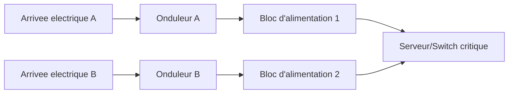

CHAPITRE 9

# Installation des équipements

## Objectifs pédagogiques

Monter correctement des équipements en rack, organiser le brassage, assurer une ventilation adéquate, et dimensionner onduleurs et alimentation redondante.

## Prérequis

Chapitres 1-8.

## 9.1 Montage en rack

💡 Toujours commencer par le bas pour les équipements lourds
Un onduleur ou un serveur volumineux monté en partie basse abaisse le centre de gravité de la baie, réduisant le risque de basculement lors de l'ouverture des portes ou de l'extraction sur rails — rappel de l'organisation verticale déjà présentée au chapitre 7.

Points de vigilance au montage :

- Utiliser systématiquement les vis/écrans cage adaptés au type de rail (carré, rond, fileté) de la baie.
- Laisser un espace de 1U entre équipements dégageant une chaleur importante, si la ventilation du local le permet.
- Fixer les équipements lourds (serveurs, onduleurs) sur des rails coulissants supportant leur poids réel, jamais uniquement sur les vis avant.

## 9.2 Organisation du brassage

💡 Un brassage en peigne facilite tout dépannage futur
Router les cordons de brassage horizontalement puis verticalement (jamais en diagonale d'un coin à l'autre de la baie) via des passe-câbles/anneaux dédiés, avec une longueur de cordon adaptée à la distance réelle (ni trop court ni en surlongueur emmêlée), permet d'identifier et de remplacer un cordon sans perturber l'ensemble du brassage voisin.

Convention de couleurs recommandée (à documenter dans le dossier d'architecture, chapitre 25) :

| Couleur | Usage |
|---|---|
| Bleu | Postes de travail / Bureautique |
| Jaune | Téléphonie IP |
| Vert | Vidéosurveillance |
| Rouge | Management / Administration réseau |
| Gris | Serveurs |
| Orange | Liaisons inter-switch (uplinks) |

## 9.3 Ventilation

⚠️ Respecter le sens de circulation d'air (front-to-back) des équipements en rack
La quasi-totalité des équipements rack-mount modernes aspirent l'air froid en façade et rejettent l'air chaud à l'arrière — installer un équipement à l'envers (ou mélanger dans une même baie des équipements à flux d'air incohérent) crée des zones de recirculation d'air chaud qui dégradent le refroidissement global, même avec une climatisation de local par ailleurs suffisante (chapitre 7).

Bonnes pratiques de ventilation en baie :

- Obturer les emplacements U vides avec des panneaux (blanking panels), pour éviter que l'air chaud arrière ne recircule vers l'avant.
- Regrouper les équipements par flux d'air cohérent (allée froide à l'avant des baies, allée chaude à l'arrière) — principe fondamental détaillé au chapitre 36 (datacenter).

## 9.4 Onduleurs (UPS)

💡 Dimensionner un onduleur : puissance ET autonomie sont deux critères distincts
La puissance (en VA ou W) doit couvrir la charge totale des équipements protégés avec une marge de 20-30 % ; l'autonomie (en minutes) doit être suffisante pour couvrir soit un arrêt propre des serveurs (quelques minutes), soit le basculement vers un groupe électrogène de secours sur les sites critiques (chapitre 30, banque ; chapitre 28, hôpital).

| Type d'onduleur | Protection assurée | Usage typique |
|---|---|---|
| Off-line (standby) | Coupure totale uniquement, temps de bascule court | Postes de travail individuels |
| Line-interactive | Coupures + régulation de tension (sur/sous-tension) | PME, petites baies réseau |
| On-line (double conversion) | Protection totale, zéro interruption, isolation complète du réseau électrique | Datacenter, sites critiques (chapitres 28, 30, 36) |

## 9.5 Alimentation redondante

💡 Redondance N+1 : le principe de base de la haute disponibilité électrique
Un équipement critique (serveur, switch cœur) équipé de deux blocs d'alimentation, chacun raccordé à une source électrique distincte (un onduleur différent, voire une arrivée électrique différente), continue de fonctionner même en cas de panne d'une seule source — principe repris pour l'ensemble de l'infrastructure électrique des projets critiques (Partie 11).

## 9.6 Checklist d'installation

💡 Checklist avant mise en production d'une baie

- [ ] Tous les équipements fixés sur rails/vis adaptés, aucun jeu mécanique.
- [ ] Panneaux d'obturation posés sur tous les emplacements U vides.
- [ ] Brassage organisé par couleur, en peigne, sans excès de longueur.
- [ ] Étiquetage complet à chaque extrémité de câble (chapitre 8).
- [ ] Onduleur dimensionné et testé (simulation de coupure).
- [ ] Alimentation redondante vérifiée sur les équipements critiques.
- [ ] Température du local mesurée en charge réelle, conforme aux seuils constructeur.
- [ ] Mise à la terre vérifiée (chapitre 7).

## 9.7 Erreurs fréquentes

⚠️ Brancher les deux blocs d'alimentation redondants sur le même onduleur
Une redondance d'alimentation n'a de sens que si chaque source est réellement indépendante — brancher les deux blocs d'un serveur sur le même onduleur (voire la même prise multiple) annule tout l'intérêt de la redondance en cas de panne de cet onduleur unique.

## 9.8 Bonnes pratiques

- Toujours tester un onduleur par une simulation de coupure réelle après installation, pas seulement se fier à son voyant d'état.
- Documenter dans le dossier d'architecture (chapitre 25) quelle arrivée électrique alimente quel onduleur, et quel équipement chaque bloc d'alimentation redondant.
- Prévoir un contrat de maintenance préventive des onduleurs (remplacement des batteries selon la durée de vie constructeur, généralement 3 à 5 ans).

## 9.9 Résumé du chapitre

- Le montage en rack doit respecter le poids, le sens de ventilation, et l'organisation verticale déjà planifiée au chapitre 7.
- Le brassage organisé par couleur et en peigne facilite considérablement la maintenance future.
- Les onduleurs se dimensionnent en puissance ET en autonomie ; la redondance électrique (N+1) exige des sources réellement indépendantes.

## Exercices

📝 Exercice 9.1

Un serveur critique dispose de deux blocs d'alimentation redondants. Décrivez le montage électrique correct pour que cette redondance soit réellement efficace.

**Corrigé :**
Chaque bloc d'alimentation doit être raccordé à un **onduleur distinct**, lui-même idéalement alimenté par une **arrivée électrique différente** — garantissant que la panne d'un onduleur ou d'un circuit électrique n'affecte qu'un seul des deux blocs, laissant le serveur opérationnel sur le second.

*Chapitre suivant : la configuration des switches (VLAN, trunk, STP, LACP, QoS).*
