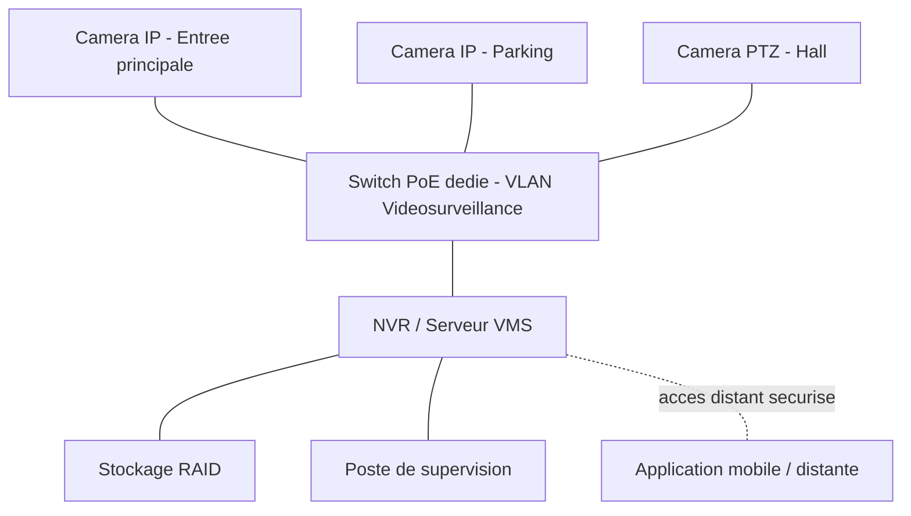

CHAPITRE 17

# Introduction à la vidéosurveillance IP

## Objectifs pédagogiques

Comprendre l'architecture d'un système de vidéosurveillance IP (CCTV IP), distinguer l'analogique de l'IP, et poser les critères de choix des caméras.

## Prérequis

Chapitres 1-16, en particulier la segmentation VLAN (chapitre 6) et le PoE (chapitre 4).

## 17.1 Architecture d'un système CCTV IP

💡 Un système de vidéosurveillance IP est un système informatique à part entière
Contrairement à l'idée reçue d'un "simple ajout de caméras", un système CCTV IP moderne repose entièrement sur l'infrastructure réseau déjà décrite dans ce manuel : switches PoE (chapitre 4), VLAN dédié (chapitre 21), stockage NVR (chapitre 22), et sécurisation périmétrique (chapitre 13) — sa conception suit exactement la même rigueur méthodologique que n'importe quel autre système du réseau d'entreprise.

Composants du système :

1. **Caméras IP** : capturent et encodent le flux vidéo (H.264/H.265), détaillées au chapitre 18.
2. **Réseau dédié PoE** : alimente et transporte le flux vidéo, isolé du reste du réseau (chapitre 21).
3. **NVR (Network Video Recorder) ou serveur VMS (Video Management System)** : enregistre, indexe et gère les flux (chapitre 22).
4. **Stockage** : conserve les enregistrements selon une politique de rétention définie (chapitre 22).
5. **Poste de supervision / application mobile** : consultation en direct et en différé, avec gestion des droits d'accès.

## 17.2 Analogique vs IP

| Critère | Analogique (CVBS/HD-TVI/HD-CVI/AHD) | IP |
|---|---|---|
| Câblage | Coaxial, alimentation séparée | Ethernet Cat6/6A (données + alimentation via PoE) |
| Résolution | Limitée (jusqu'à quelques mégapixels selon la norme) | Jusqu'à plusieurs dizaines de mégapixels |
| Évolutivité | Limitée, câblage dédié par caméra | Native, s'appuie sur l'infrastructure réseau existante |
| Analytique embarquée | Généralement absente | Détection de mouvement, franchissement de ligne, reconnaissance, LPR (chapitre 23) |
| Coût d'infrastructure existante | Faible si déjà en place (rénovation) | Nécessite ou réutilise un réseau Ethernet PoE |

💡 La vidéosurveillance analogique reste pertinente dans un seul cas précis
Un site disposant déjà d'un câblage coaxial existant et fonctionnel, avec un besoin de résolution modeste, peut justifier une solution hybride (encodeurs convertissant l'analogique en flux IP) plutôt qu'un recâblage complet — mais tout nouveau projet (Partie 11 de ce manuel) est conçu nativement en IP, sans exception, compte tenu des besoins actuels en résolution et en analytique.

## 17.3 Critères de choix des caméras (aperçu, détaillé au chapitre 18)

- **Résolution** : adaptée à l'usage (identification faciale, lecture de plaque, ou simple détection de présence).
- **Sensibilité en faible luminosité** : critique pour un usage nocturne extérieur.
- **Type de boîtier** : dôme, bullet, PTZ, fisheye, thermique — selon l'usage précis (chapitre 18).
- **Indices de protection IP/IK** : résistance à l'eau, à la poussière, aux chocs (chapitre 20).
- **Compatibilité ONVIF** : standard ouvert garantissant l'interopérabilité entre caméras et NVR/VMS de constructeurs différents.

💡 ONVIF : l'équivalent vidéosurveillance des standards ouverts réseau (802.1Q, OSPF)
De même que ce manuel privilégie les standards ouverts pour l'interopérabilité multi-constructeur du réseau (chapitre 4), le standard **ONVIF (Open Network Video Interface Forum)** garantit qu'une caméra IP d'un fabricant peut être intégrée à un NVR/VMS d'un autre fabricant, évitant le verrouillage propriétaire (vendor lock-in) sur l'ensemble du système de vidéosurveillance.

## 17.4 Cadre légal et réglementaire (aperçu)

⚠️ La vidéosurveillance est encadrée juridiquement, pas uniquement techniquement
Avant tout déploiement, vérifier les obligations légales locales : signalétique informant de la présence de caméras, durée maximale légale de conservation des enregistrements, restrictions sur la captation d'espaces privés (fenêtres de tiers, voie publique au-delà du strict nécessaire), et cadre spécifique applicable à la reconnaissance faciale (chapitre 23). Ces obligations varient significativement selon le pays et doivent être vérifiées avec un conseil juridique local avant tout déploiement commercial.

## 17.5 Erreurs fréquentes

⚠️ Traiter la vidéosurveillance comme un projet indépendant du réseau existant
Ajouter des caméras IP sans considération pour la capacité du réseau existant (bande passante, PoE disponible, VLAN) crée une saturation progressive affectant à la fois la vidéosurveillance elle-même et les autres usages du réseau — la conception (chapitres 19-21) doit être menée avec la même rigueur que n'importe quel autre projet réseau de ce manuel.

## 17.6 Bonnes pratiques

- Concevoir tout nouveau projet nativement en IP, avec caméras conformes ONVIF pour préserver l'interopérabilité.
- Vérifier le cadre légal local avant tout déploiement, en particulier pour les fonctionnalités avancées (reconnaissance faciale, LPR).
- Intégrer la vidéosurveillance dans la même démarche de conception rigoureuse (analyse des besoins, plan réseau dédié) que le reste de l'infrastructure.

## 17.7 Résumé du chapitre

- Un système CCTV IP est un système informatique complet : caméras, réseau PoE dédié, NVR/VMS, stockage et supervision.
- L'IP surpasse l'analogique en résolution, évolutivité et capacités d'analyse embarquée, pour un coût de câblage désormais comparable.
- ONVIF garantit l'interopérabilité multi-constructeur ; le cadre légal doit être vérifié avant tout déploiement.

## Exercices

📝 Exercice 17.1

Un client possède un système analogique existant fonctionnel mais souhaite ajouter de la détection de mouvement intelligente et de la lecture de plaques. Quelle option technique recommanderiez-vous ?

**Corrigé :**
Migration vers des **caméras IP natives** conformes ONVIF : l'analytique avancée (détection intelligente, LPR/ANPR, chapitre 23) nécessite la puissance de traitement et la résolution des caméras IP modernes, rarement disponible sur un système analogique même avec encodeurs — une migration complète, plutôt qu'un ajout hybride partiel, est recommandée dès que ce niveau de fonctionnalité est requis.

*Chapitre suivant : les caméras — dôme, bullet, PTZ, fisheye, thermiques, LPR/ANPR, multi-capteurs.*
