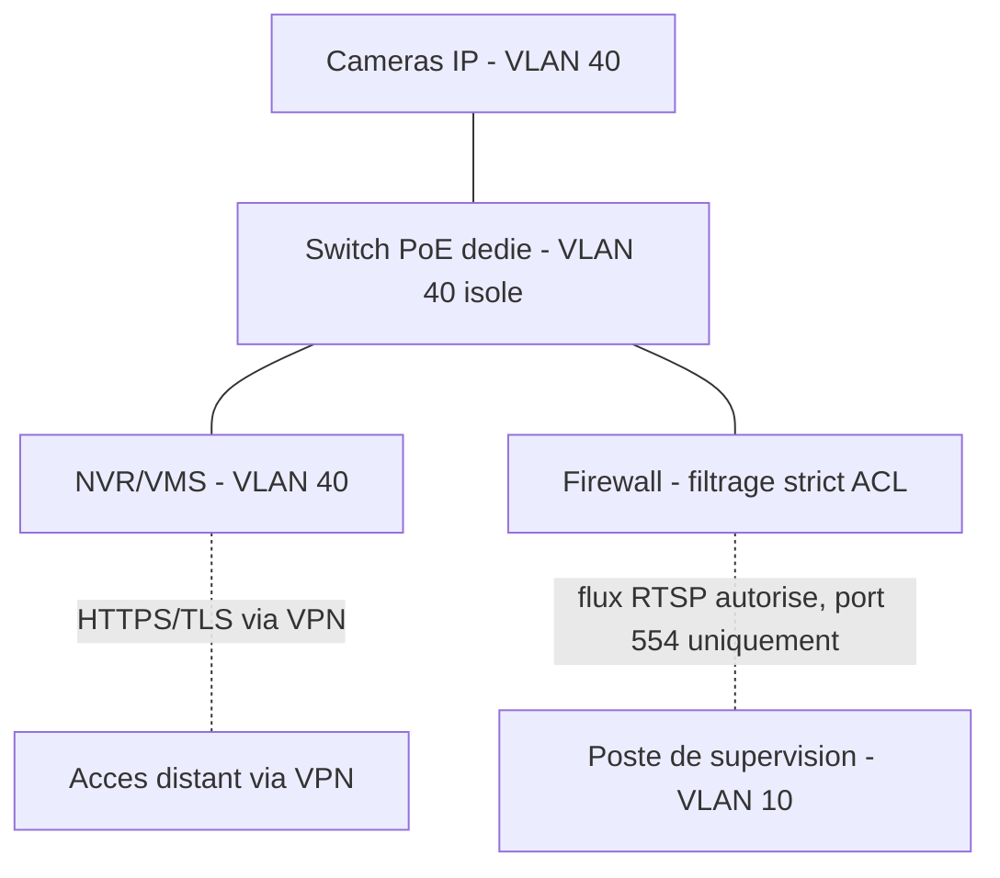

<div class="chapitre-titre-num">CHAPITRE 21</div>

# Réseau dédié à la vidéosurveillance

## Objectifs pédagogiques

Concevoir un VLAN dédié à la vidéosurveillance, dimensionner le PoE et la bande passante nécessaires, appliquer la QoS aux flux vidéo, comprendre l'usage du multicast, et sécuriser les flux vidéo.

## Prérequis

Chapitres 1-20, en particulier les chapitres 6 (VLAN), 10 (switches), et 13 (firewall).

## 21.1 VLAN dédié à la vidéosurveillance

Rappel du chapitre 6 : le VLAN vidéosurveillance (exemple VLAN 40, `10.10.40.0/23`) doit rester strictement isolé des VLAN utilisateurs, avec un filtrage ACL/firewall n'autorisant que les flux strictement nécessaires (accès du NVR aux caméras, et accès des postes de supervision autorisés au NVR).

```
! ACL Cisco IOS - le VLAN Videosurveillance ne peut PAS initier de connexion
! vers le VLAN Bureautique, seul le sens inverse (poste de supervision -> NVR) est autorise
access-list 140 deny ip 10.10.40.0 0.0.1.255 10.10.20.0 0.0.1.255
access-list 140 permit ip 10.10.20.0 0.0.1.255 10.10.40.0 0.0.1.255 eq 554
access-list 140 deny ip 10.10.40.0 0.0.1.255 any
```

<div class="encadre attention">
<span class="encadre-titre">⚠️ Une caméra IP compromise est un vecteur d'attaque interne réel et documenté</span>
De nombreuses caméras IP bas de gamme ont historiquement souffert de vulnérabilités graves (mots de passe par défaut non changés, firmwares obsolètes) — l'isolation stricte du VLAN vidéosurveillance (section 6.2, rappel du Zero Trust chapitre 16) limite l'impact d'une caméra compromise à ce seul segment, l'empêchant de servir de rebond vers le réseau bureautique ou les serveurs.
</div>

## 21.2 Dimensionnement PoE

Rappel du chapitre 4 : chaque caméra IP se raccorde via PoE (802.3af/at selon le modèle — les PTZ et caméras chauffées consomment généralement en 802.3at).

**Calcul du budget PoE d'un switch** :

```
Budget_PoE_total_switch >= Somme(consommation_max_de_chaque_camera_raccordee) x 1,2 (marge de securite)
```

**Exemple** : un switch 24 ports PoE+ raccordant 20 caméras dôme (7 W chacune) et 4 caméras PTZ (25 W chacune) :

```
Consommation_totale = (20 x 7) + (4 x 25) = 140 + 100 = 240 W
Budget_PoE_necessaire = 240 W x 1,2 = 288 W minimum
```

<div class="encadre astuce">
<span class="encadre-titre">💡 Vérifier le budget PoE global du switch, pas seulement la puissance par port</span>
Un switch peut annoncer 30 W par port en 802.3at, mais son budget PoE **total** (souvent 370 W ou 740 W selon le modèle) peut être insuffisant si tous les ports sont utilisés simultanément à leur puissance maximale — vérifier la fiche technique du switch pour son budget PoE agrégé, pas uniquement la puissance maximale par port individuel.
</div>

## 21.3 Bande passante requise

**Formule d'estimation par caméra** (H.264/H.265, débit variable selon résolution et compression) :

| Résolution | Débit typique H.264 | Débit typique H.265 (environ -50%) |
|---|---|---|
| 2 MP (1080p) | 4-6 Mbps | 2-3 Mbps |
| 4 MP | 6-8 Mbps | 3-4 Mbps |
| 8 MP (4K) | 12-16 Mbps | 6-8 Mbps |

<div class="encadre astuce">
<span class="encadre-titre">💡 H.265 réduit le débit de moitié à qualité équivalente, au prix d'une charge de calcul plus élevée</span>
Privilégier H.265 (HEVC) réduit significativement la bande passante et l'espace de stockage nécessaire (chapitre 22) — à vérifier néanmoins la compatibilité du NVR/VMS et des caméras existantes, tous les modèles ne supportant pas ce codec plus récent.
</div>

**Exemple de calcul pour un site de 30 caméras 4 MP en H.265** :

```
Bande_passante_totale = 30 x 3,5 Mbps (moyenne) = 105 Mbps
```

Ce flux doit transiter sans contention entre le switch d'accès vidéosurveillance et le NVR — un lien uplink en 1 Gbit/s offre une marge très confortable, mais le calcul doit être refait à l'échelle de chaque projet (chapitre 26-36).

## 21.4 QoS appliquée aux flux vidéo

Rappel des chapitres 6 et 10 : bien que moins critique en latence que la VoIP, un flux vidéo de vidéosurveillance en direct (consultation live par un poste de supervision) bénéficie d'un marquage QoS prioritaire pour éviter les saccades en cas de congestion temporaire du réseau, en particulier lors d'un enregistrement simultané de tous les flux vers le NVR.

```
Switch(config)# class-map match-all VIDEOSURVEILLANCE
Switch(config-cmap)# match access-group 140
Switch(config)# policy-map QOS-VIDEO
Switch(config-pmap)# class VIDEOSURVEILLANCE
Switch(config-pmap-c)# priority percent 30
```

## 21.5 Multicast pour la diffusion à plusieurs postes de supervision

<div class="encadre astuce">
<span class="encadre-titre">💡 Le multicast évite de dupliquer le flux vidéo pour chaque poste de supervision consultant simultanément</span>
Si plusieurs postes de supervision (salle de contrôle, poste mobile, direction) consultent simultanément le flux en direct d'une même caméra, une diffusion en unicast classique multiplierait la bande passante consommée par autant de flux identiques que de spectateurs — le multicast (IGMP) permet à un seul flux réseau d'être reçu simultanément par plusieurs postes abonnés, économisant considérablement la bande passante sur les sites à supervision multi-poste (aéroport, chapitre 32 ; centre commercial, chapitre 31).
</div>

```
! Activation IGMP snooping sur le switch, pour un multicast efficace
Switch(config)# ip igmp snooping
Switch(config)# ip igmp snooping vlan 40
```

## 21.6 Sécurisation des flux vidéo

<div class="encadre astuce">
<span class="encadre-titre">💡 Chiffrer les flux vidéo, en particulier pour la consultation à distance</span>
Les flux RTSP internes peuvent transiter en clair au sein du VLAN isolé (section 21.1), mais tout accès distant (application mobile, consultation hors site) doit impérativement passer par un VPN (chapitre 11) ou un flux chiffré HTTPS/TLS proposé par le VMS (chapitre 22) — jamais d'exposition directe d'un flux caméra ou NVR sur Internet sans chiffrement et authentification forte.
</div>

## 21.7 Schéma du réseau vidéosurveillance dédié



## 21.8 Erreurs fréquentes

<div class="encadre attention">
<span class="encadre-titre">⚠️ Sous-dimensionner le budget PoE global du switch lors de l'ajout progressif de caméras</span>
Rappel de la section 21.2 : ajouter des caméras PTZ ou chauffées (fort besoin PoE) à un switch initialement dimensionné pour des dômes basse consommation peut dépasser le budget PoE agrégé du switch, provoquant des coupures d'alimentation intermittentes sur certains ports sans message d'erreur explicite en apparence.
</div>

## 21.9 Bonnes pratiques

- Isoler strictement le VLAN vidéosurveillance, avec un filtrage ACL n'autorisant que les flux strictement nécessaires.
- Recalculer le budget PoE et la bande passante à chaque ajout significatif de caméras, pas seulement au dimensionnement initial.
- Chiffrer systématiquement tout accès distant aux flux vidéo, jamais d'exposition directe sur Internet.

## 21.10 Résumé du chapitre

- Le VLAN vidéosurveillance doit être isolé et filtré strictement, limitant l'impact d'une caméra compromise.
- Le budget PoE se calcule sur la consommation totale agrégée du switch, pas uniquement par port individuel.
- H.265 réduit significativement la bande passante et le stockage nécessaires ; le multicast économise la bande passante en cas de supervision multi-poste.

## Exercices

<div class="encadre exercice">
<span class="encadre-titre">📝 Exercice 21.1</span>

Un switch PoE+ raccorde 16 caméras dôme à 8 W chacune et 2 caméras PTZ à 30 W chacune. Calculez le budget PoE minimum nécessaire avec une marge de sécurité de 20 %.
</div>

**Corrigé :**
```
Consommation_totale = (16 x 8) + (2 x 30) = 128 + 60 = 188 W
Budget_PoE_necessaire = 188 x 1,2 = 225,6 W minimum
```

*Chapitre suivant : le NVR et le VMS (installation, RAID, stockage, redondance, rétention, alertes).*
