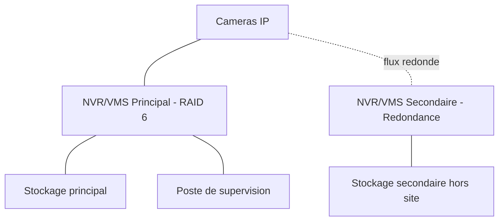

<div class="chapitre-titre-num">CHAPITRE 22</div>

# NVR et VMS

## Objectifs pédagogiques

Installer et configurer un NVR/VMS, dimensionner le RAID et le stockage, assurer la redondance, définir une politique de rétention conforme, et exploiter la recherche vidéo et les alertes.

## Prérequis

Chapitres 1-21.

## 22.1 NVR vs VMS

<div class="encadre astuce">
<span class="encadre-titre">💡 Le NVR est une appliance dédiée, le VMS est un logiciel installable sur serveur généraliste</span>
Un **NVR (Network Video Recorder)** est une appliance matérielle dédiée, souvent fournie par le même constructeur que les caméras, avec une interface simplifiée — adaptée aux projets de taille modeste (école, chapitre 26 ; hôtel, chapitre 29). Un **VMS (Video Management System)** est une solution logicielle installée sur un serveur généraliste (Windows Server ou Linux, chapitres 14-15), offrant une scalabilité et une intégration plus poussées — recommandé pour les grands projets multi-sites (chapitre 34) ou nécessitant une intégration avancée (chapitre 23).
</div>

## 22.2 Dimensionnement RAID

<div class="encadre astuce">
<span class="encadre-titre">💡 Le RAID protège contre la panne d'un disque, pas contre la suppression accidentelle ou le ransomware</span>
Un NVR/VMS de production doit toujours reposer sur un RAID protégeant contre la panne physique d'un disque — rappel important : le RAID n'est **pas** une sauvegarde (chapitre 16, règle 3-2-1), il assure uniquement la continuité de service en cas de panne matérielle d'un disque du volume.
</div>

| Niveau RAID | Tolérance de panne | Capacité utile | Recommandation |
|---|---|---|---|
| RAID 0 | Aucune (aggrave le risque) | 100 % | À proscrire pour la vidéosurveillance |
| RAID 1 | 1 disque (mirroring) | 50 % | Petits NVR (2 disques) |
| RAID 5 | 1 disque | (n-1)/n | Standard pour NVR/VMS de taille moyenne |
| RAID 6 | 2 disques | (n-2)/n | Recommandé pour les gros volumes de stockage (fiabilité accrue) |
| RAID 10 | 1 disque par paire miroir | 50 % | Hautes performances en écriture, coût en capacité |

## 22.3 Calcul de l'espace de stockage nécessaire

**Formule générale** :

```
Stockage_total_Go = Nombre_de_cameras x Debit_moyen_Mbps x 3600 x 24 x Jours_de_retention / 8 / 1000
```

**Exemple** : 30 caméras à 3,5 Mbps moyen (H.265, rappel du chapitre 21), rétention de 30 jours.

```
Stockage_par_camera_par_jour = 3,5 Mbps x 3600 x 24 / 8 / 1000 = 37,8 Go/jour
Stockage_total = 30 cameras x 37,8 Go x 30 jours = 34 020 Go ≈ 34 To
```

<div class="encadre astuce">
<span class="encadre-titre">💡 Toujours ajouter une marge de sécurité de 15-20 % au calcul brut</span>
Le débit réel varie selon l'activité de la scène (plus de mouvement = débit plus élevé en compression variable) — un calcul basé uniquement sur le débit moyen théorique sous-estime légèrement le besoin réel ; ajouter systématiquement 15-20 % de marge, soit environ **40 To** dans l'exemple ci-dessus plutôt que 34 To au plus juste.
</div>

## 22.4 Redondance du NVR/VMS

<div class="encadre astuce">
<span class="encadre-titre">💡 Un NVR unique constitue un point de défaillance unique pour l'ensemble du système de vidéosurveillance</span>
Sur les sites critiques (banque, chapitre 30 ; aéroport, chapitre 32), un second NVR/VMS en haute disponibilité (basculement automatique, ou enregistrement redondant en parallèle sur deux systèmes distincts) protège contre la panne matérielle complète du système principal — un compromis budgétaire plus modeste consiste à répliquer uniquement les enregistrements critiques (guichets, entrées) vers un second stockage.
</div>

## 22.5 Politique de rétention

<div class="encadre attention">
<span class="encadre-titre">⚠️ La durée de rétention est encadrée légalement, pas seulement techniquement</span>
Rappel du chapitre 17 : la durée maximale de conservation des enregistrements de vidéosurveillance est encadrée par la réglementation locale (souvent limitée à 30 jours dans de nombreuses juridictions pour les espaces publics/commerciaux, sauf réquisition judiciaire) — la politique de rétention technique (section 22.3) doit être calée sur cette contrainte légale, jamais fixée uniquement selon la capacité de stockage disponible.
</div>

Configuration type de rétention par zone d'importance :

| Zone | Durée de rétention typique | Justification |
|---|---|---|
| Périmètre général | 15-30 jours | Conformité légale standard |
| Guichets, caisses, points sensibles | 30-90 jours (selon réglementation sectorielle) | Exigence renforcée (secteur bancaire, chapitre 30) |
| Zones réglementées (santé, chapitre 28) | Selon réglementation sanitaire spécifique | Cadre légal sectoriel propre |

## 22.6 Recherche vidéo

Fonctionnalités de recherche attendues d'un VMS moderne :

- **Recherche temporelle** : consultation directe à une date/heure précise.
- **Recherche par mouvement** : filtrage des séquences contenant une activité détectée dans une zone définie de l'image.
- **Recherche par métadonnées** : recherche croisée avec les événements LPR/ANPR ou de contrôle d'accès (chapitre 23), par exemple "toutes les entrées du véhicule immatriculé X durant le mois".

## 22.7 Alertes

<div class="encadre astuce">
<span class="encadre-titre">💡 Une alerte utile est actionnable, pas seulement informative</span>
Une alerte de détection de mouvement envoyée sans contexte (juste "mouvement détecté caméra 12") noie rapidement l'opérateur sous un volume ingérable de notifications — configurer des zones de détection précises (exclure les zones de passage normal, cibler les zones sensibles hors horaires), avec une notification incluant une image extraite et un lien direct vers la séquence concernée.
</div>

```
Regle d'alerte type :
  Declencheur : detection de mouvement, zone "Entree arriere"
  Plage horaire : 20h00 - 06h00 (hors horaires d'ouverture)
  Action : notification email + SMS a l'astreinte, avec capture image jointe
  Exclusion : vehicules de livraison identifies par plaque (integration LPR, chapitre 23)
```

## 22.8 Schéma d'architecture NVR/VMS redondant



## 22.9 Erreurs fréquentes

<div class="encadre attention">
<span class="encadre-titre">⚠️ Confondre RAID et sauvegarde</span>
Rappel de la section 22.2 : un RAID 6 protège contre la panne de deux disques simultanés, mais ne protège absolument pas contre une suppression accidentelle, une corruption logicielle, ou un ransomware chiffrant le volume entier — une copie de sauvegarde distincte (chapitre 16) reste nécessaire pour les enregistrements les plus critiques, au-delà du seul RAID.
</div>

## 22.10 Bonnes pratiques

- Dimensionner le stockage avec une marge de 15-20 % au-delà du calcul théorique basé sur le débit moyen.
- Caler la politique de rétention sur la contrainte légale locale en priorité, la capacité technique en second lieu.
- Configurer des alertes ciblées et contextualisées, pas des notifications génériques noyant l'opérateur.

## 22.11 Résumé du chapitre

- Le NVR (appliance dédiée) convient aux projets modestes, le VMS (logiciel sur serveur) aux grands projets nécessitant scalabilité et intégration.
- Le RAID protège contre la panne disque mais ne remplace jamais une sauvegarde réelle.
- La politique de rétention doit respecter le cadre légal local avant toute considération de capacité de stockage.

## Exercices

<div class="encadre exercice">
<span class="encadre-titre">📝 Exercice 22.1</span>

Calculez le stockage nécessaire (avec 20 % de marge) pour 15 caméras à 4 Mbps moyen, rétention de 21 jours.
</div>

**Corrigé :**
```
Stockage_par_camera_par_jour = 4 Mbps x 3600 x 24 / 8 / 1000 = 43,2 Go/jour
Stockage_brut = 15 x 43,2 x 21 = 13 608 Go
Stockage_avec_marge = 13 608 x 1,2 ≈ 16 330 Go ≈ 16,3 To
```

*Chapitre suivant : l'intégration (contrôle d'accès, alarmes, LPR/ANPR, interphonie IP, notifications).*
