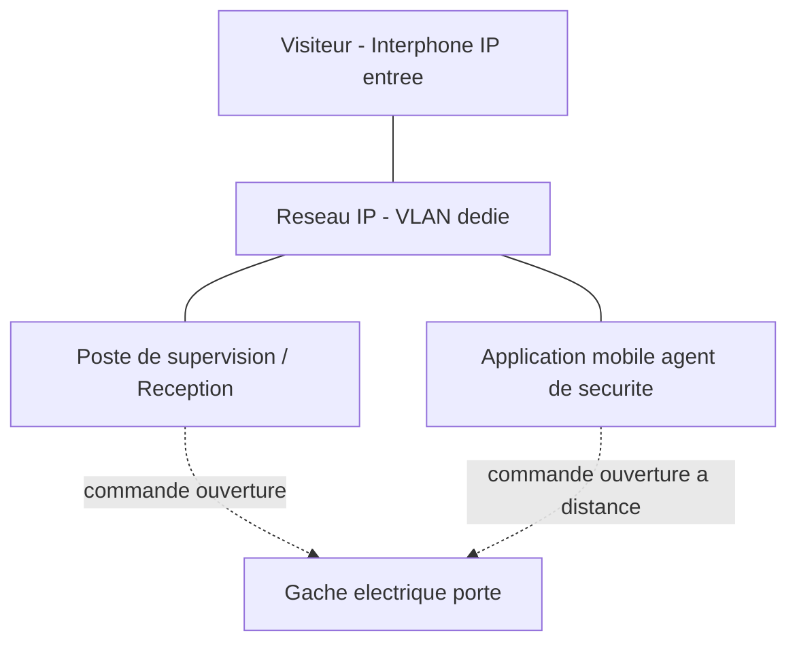

<div class="chapitre-titre-num">CHAPITRE 23</div>

# Intégration de la vidéosurveillance

## Objectifs pédagogiques

Intégrer la vidéosurveillance au contrôle d'accès et aux alarmes, comprendre la détection de mouvement avancée, situer le cadre légal de la reconnaissance faciale, exploiter le LPR/ANPR, et intégrer l'interphonie IP et les notifications.

## Prérequis

Chapitres 1-22.

## 23.1 Intégration avec le contrôle d'accès

<div class="encadre astuce">
<span class="encadre-titre">💡 Croiser badge et vidéo confirme visuellement chaque événement d'accès</span>
L'intégration entre un système de contrôle d'accès (lecteurs de badge, serrures électroniques) et le VMS (chapitre 22) permet d'associer automatiquement chaque événement de badge (entrée autorisée, tentative refusée, porte forcée) à la séquence vidéo correspondante — un lecteur de badge seul confirme QUI a badgé, la vidéo associée confirme QUI est réellement entré, détectant les cas de "tailgating" (une personne non badgée suivant de près une personne autorisée).
</div>

```
Regle d'integration type :
  Evenement : "Acces refuse - porte principale"
  Action : capture automatique de 10 secondes de video (5s avant / 5s apres l'evenement)
  Notification : envoi a l'agent de securite avec la sequence jointe
```

## 23.2 Intégration avec les systèmes d'alarme

<div class="encadre astuce">
<span class="encadre-titre">💡 Une alarme intrusion déclenche automatiquement l'affichage et l'enregistrement prioritaire de la caméra concernée</span>
Le déclenchement d'un détecteur de mouvement périmétrique ou d'une alarme anti-intrusion classique peut être configuré pour automatiquement afficher en plein écran la caméra couvrant la zone concernée sur le poste de supervision, et marquer la séquence enregistrée comme prioritaire (protégée d'un éventuel écrasement automatique en cas de saturation du stockage).
</div>

## 23.3 Détection de mouvement avancée (analytique vidéo)

Au-delà de la simple détection de mouvement basique (chapitre 22), l'analytique vidéo moderne (souvent embarquée directement dans la caméra) permet :

- **Franchissement de ligne virtuelle** : alerte si un objet/personne traverse une ligne définie dans l'image (par exemple, une clôture virtuelle).
- **Détection de zone** : alerte si une présence est détectée dans une zone interdite précise, en excluant les zones de passage normal.
- **Comptage de personnes** : utile pour la gestion de flux (centre commercial, chapitre 31 ; aéroport, chapitre 32).
- **Détection d'objet abandonné ou disparu** : pertinent en contexte de sûreté (aéroport, chapitre 32).

## 23.4 Reconnaissance faciale : cadre légal

<div class="encadre attention">
<span class="encadre-titre">⚠️ La reconnaissance faciale est l'une des fonctionnalités les plus strictement encadrées juridiquement</span>
Contrairement à la simple détection de présence (chapitre 22), la reconnaissance faciale traite une donnée biométrique identifiante — de nombreuses juridictions imposent un consentement explicite, une déclaration auprès d'une autorité de protection des données, une analyse d'impact préalable, voire interdisent purement et simplement cet usage dans certains contextes (espaces publics notamment). Cette fonctionnalité ne doit JAMAIS être activée sans validation juridique préalable spécifique au pays et au secteur d'activité concernés, indépendamment de sa disponibilité technique sur l'équipement.
</div>

Usages généralement plus facilement admis (sous conditions strictes de consentement et de finalité) :

- Contrôle d'accès volontaire à un bâtiment sécurisé (le personnel consent explicitement à l'enrôlement).
- Alerte de présence d'une personne sur une liste de sûreté préalablement constituée légalement (contexte très encadré, souvent réservé aux autorités).

## 23.5 LPR/ANPR : intégration pratique

Rappel du chapitre 18 (caméras LPR) et du chapitre 19 (dimensionnement) : l'intégration LPR permet des automatisations concrètes.

```
Regle d'integration type - Parking d'entreprise :
  Evenement : plaque reconnue en entree
  Verification : plaque presente dans la liste "Vehicules autorises"
  Action si autorise : ouverture automatique de la barriere
  Action si non reconnu : alerte a l'agent d'accueil + enregistrement prioritaire
```

<div class="encadre astuce">
<span class="encadre-titre">💡 Le LPR croisé avec une base de données constitue une automatisation à forte valeur ajoutée</span>
Au-delà de la simple lecture, l'intégration LPR-base de données permet l'ouverture automatique de barrière pour les véhicules autorisés (livraison, employés), la facturation automatique d'un parking payant, ou l'alerte immédiate en cas de détection d'un véhicule recherché — un cas d'usage central du chapitre 31 (centre commercial) et du chapitre 33 (usine, contrôle des livraisons).
</div>

## 23.6 Interphonie IP

<div class="encadre astuce">
<span class="encadre-titre">💡 Un interphone IP combine audio bidirectionnel, vidéo et intégration au contrôle d'accès</span>
Contrairement à un interphone analogique classique, un interphone IP s'intègre nativement au même réseau (VLAN dédié, souvent partagé avec la vidéosurveillance ou un VLAN spécifique) et peut déclencher l'ouverture d'une porte à distance depuis le poste de supervision ou une application mobile, après vérification visuelle et vocale du visiteur.
</div>



## 23.7 Notifications centralisées

<div class="encadre astuce">
<span class="encadre-titre">💡 Centraliser toutes les notifications (vidéo, accès, alarme) vers un canal unique évite la dispersion</span>
Plutôt que de multiplier les applications et canaux de notification distincts par système (une app pour la vidéo, une autre pour le contrôle d'accès, une autre pour l'alarme), une intégration centralisée (souvent via le VMS comme plateforme pivot, ou un outil de supervision dédié, chapitre 24) regroupe l'ensemble des alertes de sûreté en un point unique, réduisant le risque qu'un événement important passe inaperçu.
</div>

## 23.8 Erreurs fréquentes

<div class="encadre attention">
<span class="encadre-titre">⚠️ Activer la reconnaissance faciale par simple disponibilité technique, sans validation juridique</span>
Rappel de la section 23.4 : de nombreux projets d'intégration proposent la reconnaissance faciale "en option" dans leur catalogue technique — son activation ne doit jamais être une simple case à cocher dans un cahier des charges technique, mais toujours précédée d'une validation juridique explicite et documentée, spécifique au pays et secteur du projet.
</div>

## 23.9 Bonnes pratiques

- Intégrer systématiquement contrôle d'accès et vidéosurveillance pour détecter le tailgating et confirmer visuellement chaque événement.
- Ne jamais activer la reconnaissance faciale sans validation juridique préalable documentée.
- Centraliser les notifications de sûreté (vidéo, accès, alarme) vers un canal unique de supervision.

## 23.10 Résumé du chapitre

- L'intégration contrôle d'accès + vidéo + alarme transforme des systèmes indépendants en une chaîne de sûreté cohérente et automatisée.
- La reconnaissance faciale reste l'une des fonctionnalités les plus juridiquement sensibles, à activer uniquement après validation légale explicite.
- Le LPR/ANPR intégré à une base de données automatise des actions concrètes (ouverture de barrière, alerte ciblée) à forte valeur opérationnelle.

## Exercices

<div class="encadre exercice">
<span class="encadre-titre">📝 Exercice 23.1</span>

Un client souhaite activer la reconnaissance faciale sur les caméras d'entrée de son entreprise pour identifier automatiquement ses employés. Quelle est la première étape obligatoire avant toute activation technique ?
</div>

**Corrigé :**
Une **validation juridique préalable** (conformité à la réglementation locale de protection des données biométriques, consentement explicite des employés, éventuelle déclaration auprès d'une autorité de protection des données) — jamais une simple activation technique basée sur la disponibilité de la fonctionnalité sur l'équipement.

*Chapitre suivant : la supervision réseau (SNMP, Syslog, Zabbix, PRTG, Grafana, Centreon, Nagios).*
