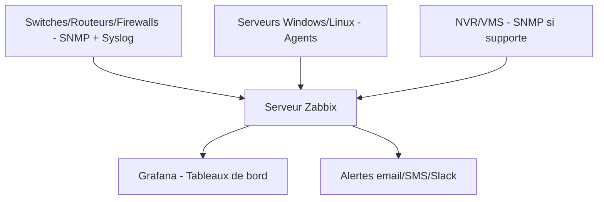

<div class="chapitre-titre-num">CHAPITRE 24</div>

# Supervision réseau

## Objectifs pédagogiques

Comprendre SNMP et Syslog comme fondations de la supervision, et positionner Zabbix, PRTG, Grafana, Centreon et Nagios selon le contexte projet.

## Prérequis

Chapitres 1-23.

## 24.1 SNMP (Simple Network Management Protocol)

<div class="encadre astuce">
<span class="encadre-titre">💡 SNMP interroge et reçoit des informations d'état depuis les équipements réseau</span>
Chaque équipement réseau (switch, routeur, firewall, onduleur réseau) expose des compteurs et états via une base d'objets structurée (MIB — Management Information Base), interrogeable par un outil de supervision selon deux modes : **polling** (l'outil interroge périodiquement l'équipement) et **traps** (l'équipement notifie proactivement un événement, par exemple un port qui tombe).
</div>

```
! Activation SNMP en lecture seule sur un switch Cisco IOS
Switch(config)# snmp-server community RESEAU_RO RO
Switch(config)# snmp-server location "Batiment A - Baie 1"
Switch(config)# snmp-server contact "admin@entreprise.local"
Switch(config)# snmp-server enable traps
Switch(config)# snmp-server host 10.10.60.30 version 2c RESEAU_RO
```

<div class="encadre attention">
<span class="encadre-titre">⚠️ SNMPv1/v2c transmettent la communauté (mot de passe) en clair</span>
SNMPv2c reste largement répandu pour sa simplicité, mais transmet la chaîne de communauté sans chiffrement — **SNMPv3** doit être privilégié dès que possible, avec authentification et chiffrement (`authPriv`), en particulier sur le VLAN de management (rappel du chapitre 6).
</div>

## 24.2 Syslog

<div class="encadre astuce">
<span class="encadre-titre">💡 Syslog centralise les journaux d'événements de tous les équipements réseau</span>
Contrairement à SNMP (état et compteurs), Syslog transmet des messages d'événements textuels horodatés (redémarrage, erreur d'interface, tentative de connexion) — rappel direct du chapitre 16 (SIEM) : centraliser les logs Syslog de tous les équipements réseau vers un serveur unique est un prérequis à toute investigation de sécurité ou de panne a posteriori.
</div>

```
Switch(config)# logging host 10.10.60.31
Switch(config)# logging trap informational
Switch(config)# logging source-interface vlan99
```

## 24.3 Zabbix

<div class="encadre astuce">
<span class="encadre-titre">💡 Zabbix : solution open source complète, hautement personnalisable</span>
Zabbix couvre la supervision réseau (SNMP), serveurs (agents dédiés Windows/Linux) et applications, avec un moteur de seuils, d'alertes et de tableaux de bord entièrement personnalisable — gratuit et open source, mais nécessitant un investissement initial de configuration plus important que des solutions commerciales clé en main.
</div>

## 24.4 PRTG

<div class="encadre astuce">
<span class="encadre-titre">💡 PRTG : solution commerciale, rapide à déployer</span>
PRTG (Paessler) propose une découverte automatique du réseau et des capteurs préconfigurés pour la majorité des cas d'usage courants — un déploiement plus rapide que Zabbix pour une équipe IT réduite, au prix d'une licence payante au-delà d'un nombre de capteurs gratuit limité.
</div>

## 24.5 Grafana

<div class="encadre astuce">
<span class="encadre-titre">💡 Grafana : visualisation, pas collecte — se combine avec d'autres outils</span>
Grafana ne collecte pas nativement de données (contrairement à Zabbix, PRTG, Nagios) : c'est un outil de visualisation avancée qui se connecte à des sources de données existantes (Zabbix, Prometheus, InfluxDB, bases de données SQL) pour produire des tableaux de bord riches et personnalisés — souvent utilisé en complément d'un outil de collecte plutôt qu'en remplacement.
</div>

## 24.6 Centreon

<div class="encadre astuce">
<span class="encadre-titre">💡 Centreon : bâti sur les fondations de Nagios, avec une interface d'entreprise</span>
Centreon s'appuie historiquement sur le moteur de supervision Nagios (section 24.7), avec une interface de configuration et des tableaux de bord considérablement enrichis pour un usage en environnement d'entreprise — populaire dans les grandes organisations francophones en particulier.
</div>

## 24.7 Nagios

<div class="encadre astuce">
<span class="encadre-titre">💡 Nagios : le pionnier historique de la supervision open source</span>
Nagios reste une référence robuste et éprouvée, avec un vaste écosystème de plugins communautaires couvrant pratiquement tout cas d'usage — son interface native est plus austère que les solutions modernes (Zabbix, PRTG), ce qui explique en partie l'émergence de surcouches comme Centreon.
</div>

## 24.8 Grille de choix selon le contexte projet

| Outil | Points forts | Contexte recommandé |
|---|---|---|
| **Zabbix** | Open source, très complet, personnalisable | Équipe IT avec temps de configuration disponible, budget logiciel contraint |
| **PRTG** | Déploiement rapide, découverte automatique | Petite/moyenne structure, équipe IT réduite, budget licence disponible |
| **Grafana** | Visualisation avancée, combinable | En complément d'un outil de collecte existant, tableaux de bord direction |
| **Centreon** | Interface entreprise sur base Nagios | Grande organisation, besoin de reporting structuré |
| **Nagios** | Robustesse éprouvée, écosystème de plugins | Environnements très spécifiques nécessitant un plugin particulier |

## 24.9 Exemple d'architecture de supervision centralisée



## 24.10 Seuils d'alerte type

<div class="encadre astuce">
<span class="encadre-titre">💡 Configurer des seuils progressifs (warning/critical) plutôt qu'un seuil unique</span>
Un seuil unique déclenche une alerte binaire tardive ; deux niveaux (avertissement à 70-80 %, critique à 90-95 %) permettent une intervention préventive avant que la situation ne devienne réellement critique.
</div>

| Métrique | Seuil avertissement | Seuil critique |
|---|---|---|
| Utilisation CPU équipement | 70 % | 90 % |
| Utilisation bande passante lien | 70 % | 90 % |
| Espace disque serveur/NVR | 80 % | 95 % |
| Latence lien WAN | 100 ms | 300 ms |
| Perte de paquets | 1 % | 5 % |

## 24.11 Erreurs fréquentes

<div class="encadre attention">
<span class="encadre-titre">⚠️ Superviser sans configurer d'alertes réellement exploitées</span>
Un outil de supervision déployé mais dont les alertes ne sont ni acheminées vers une équipe qui les surveille réellement, ni testées périodiquement, n'apporte aucune valeur réelle — vérifier régulièrement (test mensuel) que la chaîne complète (détection → notification → réception par un humain) fonctionne effectivement de bout en bout.
</div>

## 24.12 Bonnes pratiques

- Centraliser SNMP et Syslog de l'ensemble des équipements réseau vers un outil de supervision unique dès la mise en production.
- Configurer des seuils progressifs (avertissement/critique) plutôt qu'un seuil binaire unique.
- Tester périodiquement la chaîne complète d'alerte, de la détection jusqu'à la réception effective par une personne responsable.

## 24.13 Résumé du chapitre

- SNMP interroge état et compteurs, Syslog centralise les événements textuels — les deux fondations de toute supervision réseau.
- Zabbix, PRTG, Centreon et Nagios sont des outils de collecte complets ; Grafana est un outil de visualisation se combinant avec eux.
- Le choix d'outil dépend du budget, du temps de configuration disponible, et de la taille de l'organisation.

## Exercices

<div class="encadre exercice">
<span class="encadre-titre">📝 Exercice 24.1</span>

Une PME avec une petite équipe IT souhaite une supervision opérationnelle rapidement, sans investissement de configuration important. Quel outil recommanderiez-vous, et pourquoi ?
</div>

**Corrigé :**
**PRTG** : sa découverte automatique du réseau et ses capteurs préconfigurés permettent une mise en service rapide sans expertise de configuration approfondie, adapté à une équipe IT réduite disposant d'un budget licence modeste — Zabbix, bien que gratuit, exigerait un investissement de configuration plus important non disponible ici.

*Chapitre suivant : la documentation de projet (cahier des charges, dossier d'architecture, PRA/PCA).*
