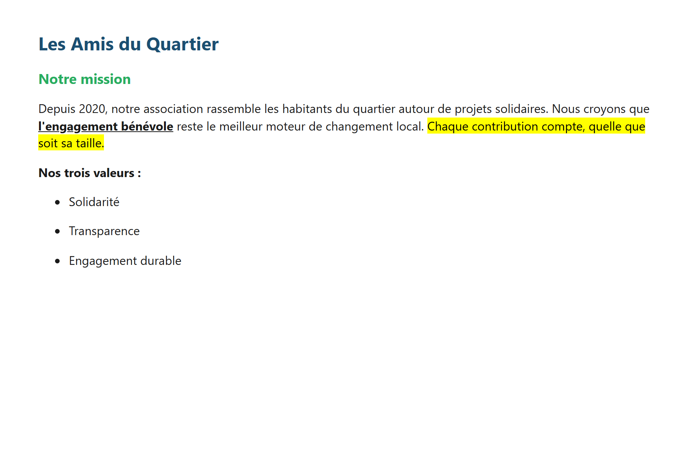
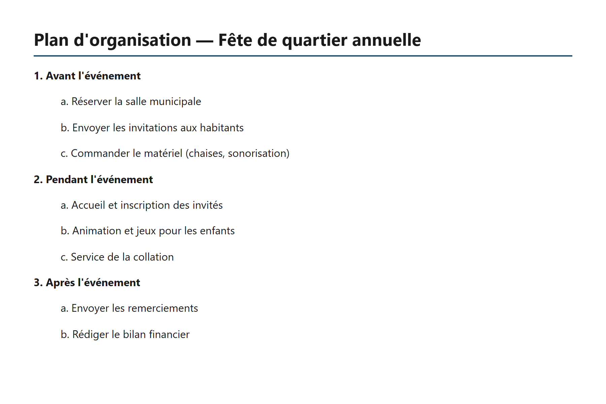
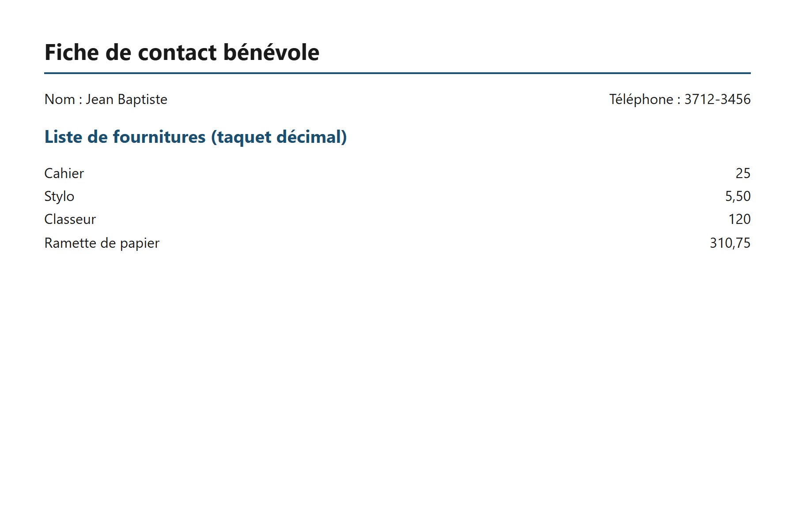
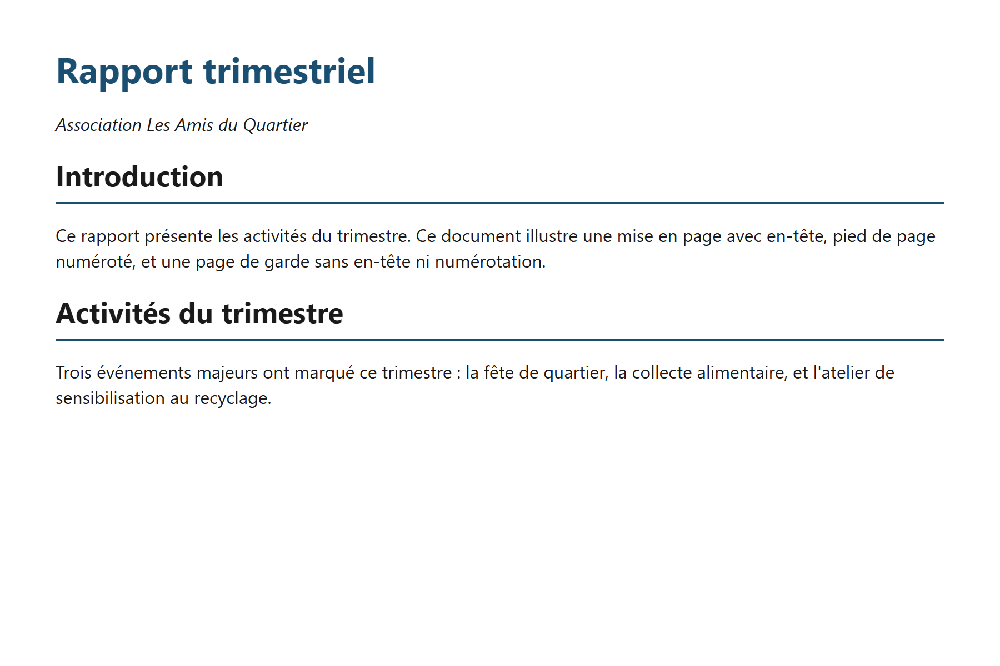
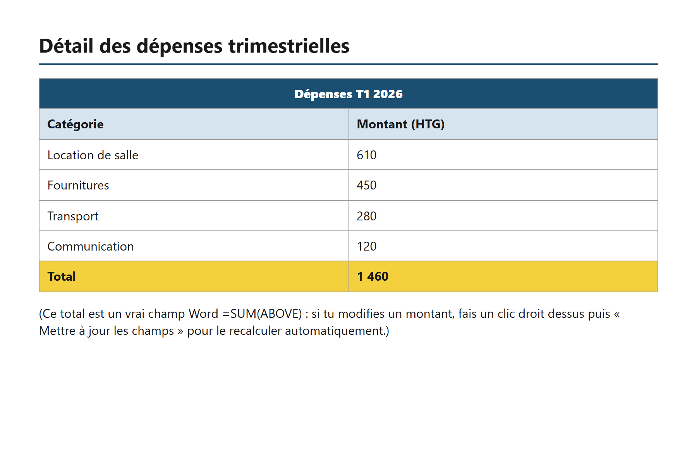
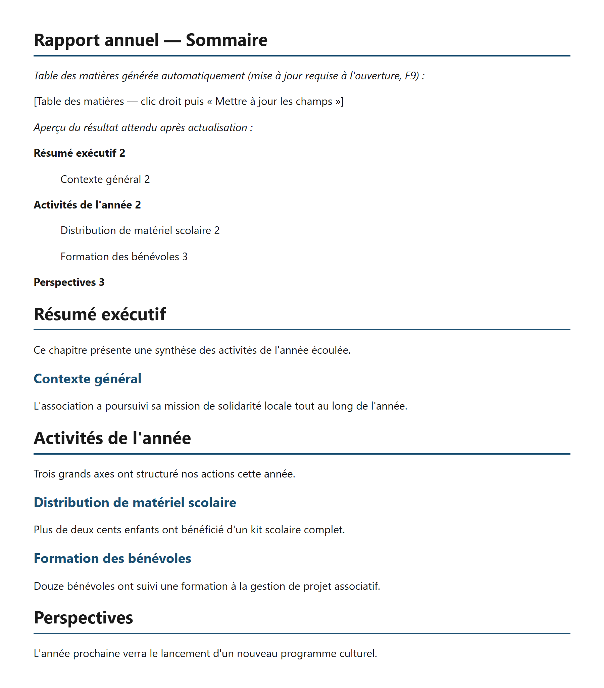
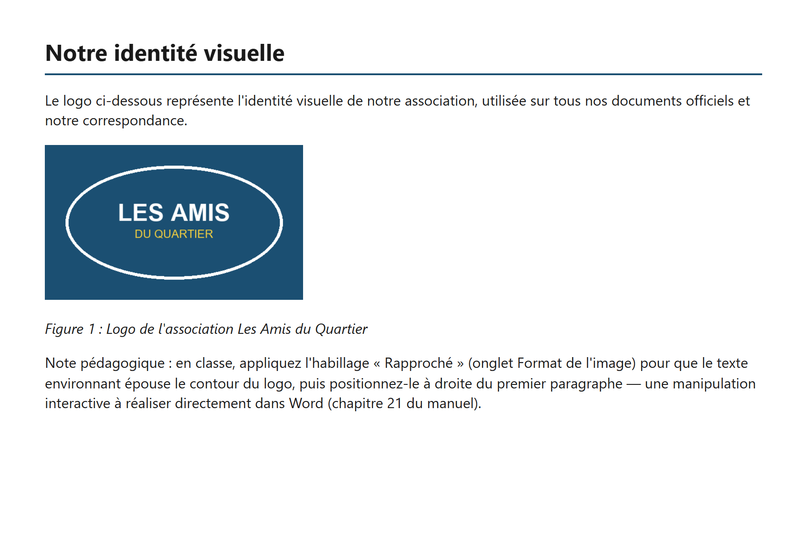
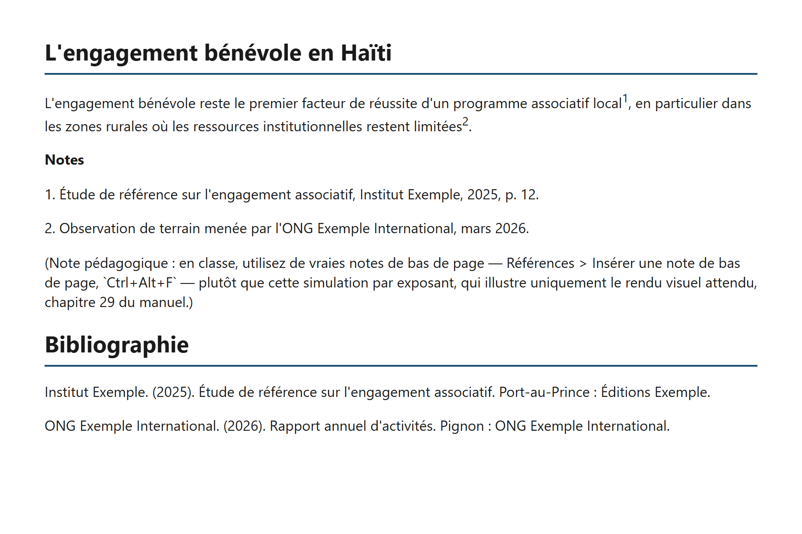
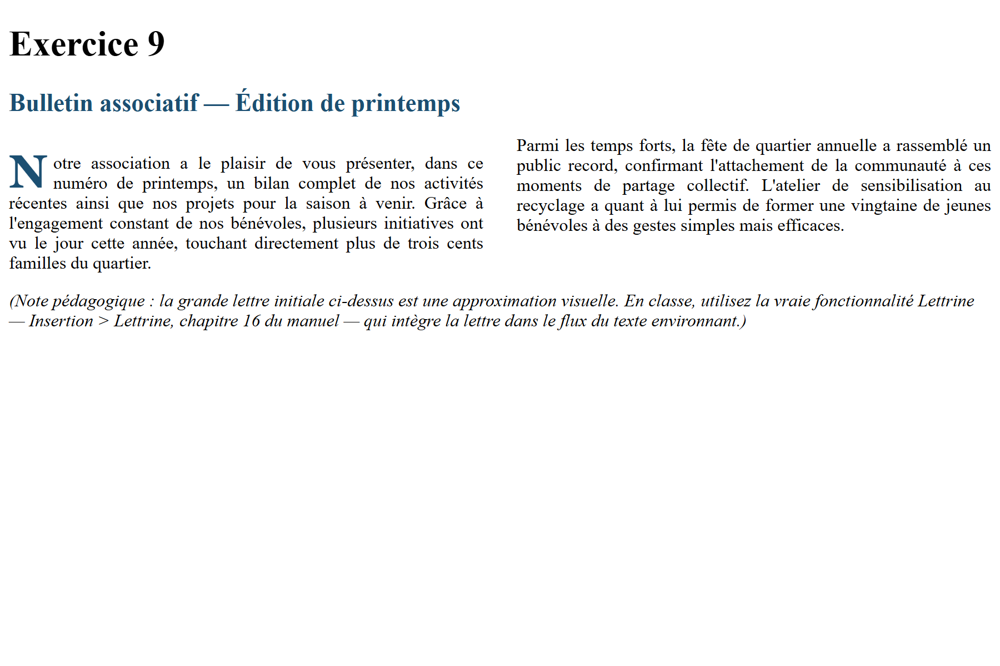
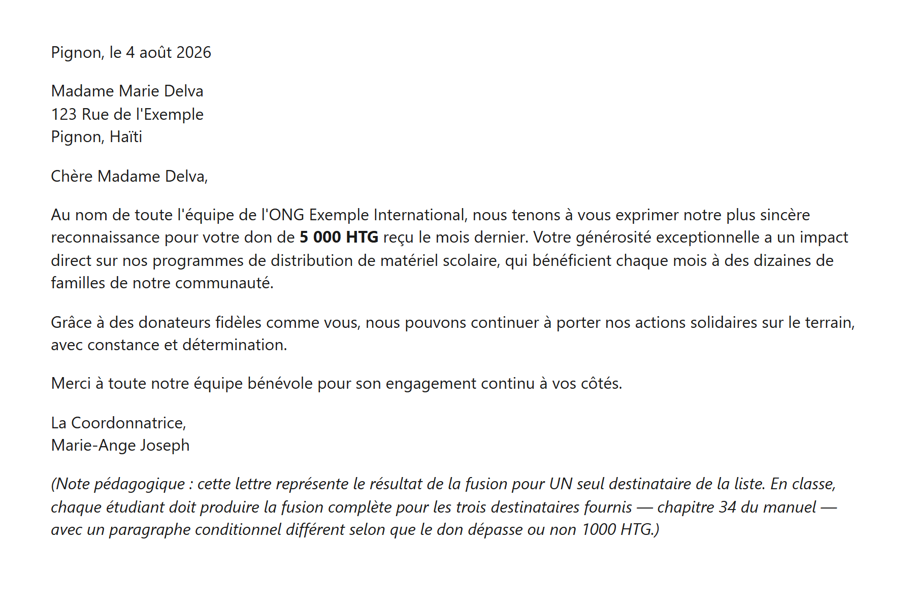

<!-- Reference: livrables/formations/manuel-word/chapitres/ pour la numerotation des chapitres citee ci-dessous. -->

# Exercices supplémentaires — Microsoft Word

Ce document rassemble **10 exercices pratiques à réaliser en classe** et **5 devoirs à réaliser à la maison**, en complément du manuel de référence. Chaque exercice combine une ou plusieurs notions déjà vues et propose, en plus des instructions, le **rendu final réel** attendu : un fichier Word valide (`solutions_docx/`) accompagné d'un aperçu image (`solutions_png/`) montrant exactement à quoi le document terminé doit ressembler.

**Comment utiliser ce document en classe :**

1. L'enseignant présente l'énoncé et l'objectif de l'exercice.
2. Les étudiants réalisent l'exercice dans Word, sans regarder la solution.
3. Une fois terminé, chacun compare son résultat à l'image de la solution.
4. En cas de doute sur une manipulation précise, le fichier `.docx` de la solution peut être ouvert et inspecté directement dans Word.

Tous les exercices reprennent l'univers de l'association fictive **« Les Amis du Quartier »**, déjà utilisé dans les études de cas du manuel, pour rester cohérents et réalistes.

> **Note sur les champs Word.** Certains exercices (5, 6) utilisent de vrais champs Word (formule `=SUM`, table des matières). Dans le fichier `.docx` fourni, ces champs affichent déjà la valeur correcte, mais restent de vrais champs recalculables : sélectionnez-les puis appuyez sur `F9` (ou clic droit → « Mettre à jour les champs ») pour vérifier qu'ils se recalculent bien.

---

## Sommaire

**Exercices de classe**

| # | Titre | Compétence principale | Niveau | Durée |
|---|-------|------------------------|--------|-------|
| 1 | Fiche de mission associative | Mise en forme caractères et paragraphes | Débutant | 20 min |
| 2 | Plan d'organisation d'un événement | Liste multiniveaux | Débutant | 15 min |
| 3 | Fiche de contact bénévole | Tabulations | Débutant | 20 min |
| 4 | Rapport trimestriel | Mise en page complète (page de garde, en-tête, pied de page) | Intermédiaire | 30 min |
| 5 | Détail des dépenses trimestrielles | Tableau avancé (fusion, trame, tri, champ SUM) | Intermédiaire | 30 min |
| 6 | Rapport annuel avec sommaire | Styles + table des matières automatique | Intermédiaire | 25 min |
| 7 | Identité visuelle illustrée | Image, habillage, légende | Intermédiaire | 20 min |
| 8 | L'engagement bénévole en Haïti | Notes de bas de page, bibliographie | Intermédiaire | 25 min |
| 9 | Bulletin associatif de printemps | Colonnes et lettrine | Avancé | 25 min |
| 10 | Lettre de remerciement aux donateurs | Publipostage (aperçu d'une fusion) | Avancé | 30 min |

**Devoirs (à la maison)** : voir la [section dédiée](#devoirs-à-la-maison) en fin de document.

---

## Exercice 1 — Fiche de mission associative

- **🎯 Objectif** : maîtriser la mise en forme de caractères (gras, italique, souligné, surlignage, couleur) et de paragraphes (alignement, interligne, listes à puces).
- **⏱ Durée** : 20 minutes
- **📊 Niveau** : Débutant
- **🧩 Chapitres liés** : 9 (Mise en forme des caractères), 10 (Mise en forme des paragraphes), 11 (Listes à puces)

### Instructions

1. Créer un titre centré « Les Amis du Quartier », en gras, taille 18, police Calibri, couleur bleue (#1B4F72).
2. Ajouter un sous-titre « Notre mission », en gras, taille 14, couleur verte (#27AE60).
3. Rédiger un paragraphe justifié (interligne 1,5) présentant l'association, en mettant en gras **et** en souligné l'expression « l'engagement bénévole », puis en surlignant en jaune la dernière phrase du paragraphe.
4. Ajouter la ligne « Nos trois valeurs : » en gras.
5. Lister ces trois valeurs sous forme de liste à puces : Solidarité, Transparence, Engagement durable.

### ✅ Solution — rendu final

Fichier Word complet : `solutions_docx/exercice1_solution.docx`

---

## Exercice 2 — Plan d'organisation d'un événement

- **🎯 Objectif** : structurer un document avec une liste hiérarchique à deux niveaux (numérotation puis lettres).
- **⏱ Durée** : 15 minutes
- **📊 Niveau** : Débutant
- **🧩 Chapitres liés** : 11 (Listes à puces, numérotées, multiniveaux)

### Instructions

1. Ajouter un titre de style Titre 1 : « Plan d'organisation — Fête de quartier annuelle ».
2. Créer trois sections numérotées de premier niveau (1., 2., 3.), en gras : « Avant l'événement », « Pendant l'événement », « Après l'événement ».
3. Sous chaque section, ajouter 2 à 3 sous-points identifiés par des lettres (a., b., c.) et légèrement en retrait, détaillant les tâches concrètes de chaque étape.

### ✅ Solution — rendu final

Fichier Word complet : `solutions_docx/exercice2_solution.docx`

---

## Exercice 3 — Fiche de contact bénévole

- **🎯 Objectif** : poser et utiliser des taquets de tabulation, y compris un taquet décimal, pour aligner du texte sans utiliser de tableau.
- **⏱ Durée** : 20 minutes
- **📊 Niveau** : Débutant
- **🧩 Chapitres liés** : 12 (Tabulations)

### Instructions

1. Ajouter un titre de style Titre 1 : « Fiche de contact bénévole ».
2. Sur une seule ligne, poser un taquet de tabulation **droit** à 12 cm, puis taper « Nom : Jean Baptiste », une tabulation, puis « Téléphone : 3712-3456 » (le second bloc doit s'aligner sur la marge droite grâce au taquet).
3. Ajouter un sous-titre « Liste de fournitures (taquet décimal) ».
4. Pour chaque article ci-dessous, poser un taquet **décimal** à 8 cm et taper le nom de l'article, une tabulation, puis le prix (les virgules décimales doivent s'aligner verticalement) :
   - Cahier — 25
   - Stylo — 5,50
   - Classeur — 120
   - Ramette de papier — 310,75

### ✅ Solution — rendu final

Fichier Word complet : `solutions_docx/exercice3_solution.docx`

> L'aperçu ci-dessus illustre l'alignement obtenu grâce aux taquets ; ouvrez le fichier `.docx` dans Word pour observer directement les marqueurs de tabulation sur la règle.

---

## Exercice 4 — Rapport trimestriel

- **🎯 Objectif** : construire une mise en page professionnelle complète : marges personnalisées, page de garde, en-tête et pied de page avec numérotation, première page différente.
- **⏱ Durée** : 30 minutes
- **📊 Niveau** : Intermédiaire
- **🧩 Chapitres liés** : 13 (Mise en page), 14 (En-têtes, pieds de page, numérotation), 15 (Sauts de page et de section)

### Instructions

1. Régler les quatre marges du document à 2,5 cm.
2. Créer une page de garde centrée : titre « Rapport trimestriel » (gras, taille 28, bleu #1B4F72) et sous-titre « Association Les Amis du Quartier » (italique, taille 16), suivie d'un saut de page.
3. Activer une première page différente, puis ajouter un en-tête centré « Association Les Amis du Quartier » (gras, bleu) sur les pages suivantes uniquement.
4. Ajouter un pied de page centré « Page X sur Y » à l'aide de vrais champs Word (PAGE et NUMPAGES), absent de la page de garde.
5. Ajouter deux sections de contenu (style Titre 1) : « Introduction » et « Activités du trimestre », séparées par un saut de page, avec un court paragraphe chacune.

### ✅ Solution — rendu final

Fichier Word complet : `solutions_docx/exercice4_solution.docx`

---

## Exercice 5 — Détail des dépenses trimestrielles

- **🎯 Objectif** : construire un tableau avancé avec fusion de cellules, trame de fond, tri des données et un total calculé par un vrai champ Word.
- **⏱ Durée** : 30 minutes
- **📊 Niveau** : Intermédiaire
- **🧩 Chapitres liés** : 26 (Créer et mettre en forme un tableau), 27 (Tableaux avancés : formules, tri, conversion)

### Instructions

1. Ajouter un titre de style Titre 1 : « Détail des dépenses trimestrielles ».
2. Créer un tableau de 2 colonnes. Fusionner les deux cellules de la première ligne en un titre « Dépenses T1 2026 » (fond bleu #1B4F72, texte blanc, gras, centré).
3. Ajouter une ligne d'en-têtes de colonnes « Catégorie » / « Montant (HTG) » (fond bleu clair #D6E4F0, gras).
4. Saisir puis **trier par montant décroissant** les quatre dépenses suivantes : Fournitures (450), Transport (280), Communication (120), Location de salle (610).
5. Ajouter une ligne de total (fond jaune #F4D03F) dont le montant est calculé par un vrai champ Word `=SUM(ABOVE)` (Insertion > Rapide Parts > Champ, ou `Ctrl+F9` puis taper la formule) plutôt que saisi manuellement.
6. Ajouter une note en italique expliquant comment mettre à jour ce champ après modification d'un montant.

### ✅ Solution — rendu final

Fichier Word complet : `solutions_docx/exercice5_solution.docx`

---

## Exercice 6 — Rapport annuel avec sommaire

- **🎯 Objectif** : utiliser les styles de titres (Titre 1 / Titre 2) pour structurer un document, puis générer une table des matières automatique à partir de ces styles.
- **⏱ Durée** : 25 minutes
- **📊 Niveau** : Intermédiaire
- **🧩 Chapitres liés** : 17 (Styles de texte et styles rapides), 28 (Table des matières automatique)

### Instructions

1. Ajouter un titre de style Titre 1 : « Rapport annuel — Sommaire ».
2. Insérer une table des matières automatique (Références > Table des matières) — elle sera vide tant qu'aucun style de titre n'existe plus bas dans le document.
3. Après un saut de page, structurer le corps du rapport en utilisant uniquement les styles **Titre 1** et **Titre 2** : « Résumé exécutif » (Titre 1) contenant « Contexte général » (Titre 2) ; « Activités de l'année » (Titre 1) contenant « Distribution de matériel scolaire » et « Formation des bénévoles » (Titre 2) ; « Perspectives » (Titre 1). Rédiger une phrase sous chaque titre.
4. Revenir en haut du document, clic droit sur la table des matières, « Mettre à jour les champs » : elle doit alors refléter exactement la structure créée, avec les bons numéros de page.

### ✅ Solution — rendu final

Fichier Word complet : `solutions_docx/exercice6_solution.docx`

> L'aperçu montre le résultat attendu **après** la mise à jour du champ TOC (l'aperçu image simule ce rendu ; dans le fichier `.docx` réel, `F9` est nécessaire une fois le document ouvert dans Word).

---

## Exercice 7 — Identité visuelle illustrée

- **🎯 Objectif** : insérer une image, lui appliquer un habillage de texte, et lui ajouter une légende numérotée automatique.
- **⏱ Durée** : 20 minutes
- **📊 Niveau** : Intermédiaire
- **🧩 Chapitres liés** : 21 (Images : insertion et mise en forme)

### Instructions

1. Ajouter un titre de style Titre 1 : « Notre identité visuelle », suivi d'un court paragraphe d'introduction.
2. Insérer le logo de l'association (fourni dans `assets/logo_association.png`), largeur 3 pouces, centré.
3. Ajouter une légende « Figure 1 : Logo de l'association Les Amis du Quartier » (italique, taille 10, centrée) sous l'image.
4. **Manipulation interactive** (à réaliser directement dans Word, non visible sur l'image statique) : appliquer l'habillage de texte « Rapproché » à l'image (onglet Format de l'image), puis la repositionner à droite d'un paragraphe de texte pour que celui-ci épouse son contour.

### ✅ Solution — rendu final

Fichier Word complet : `solutions_docx/exercice7_solution.docx`

---

## Exercice 8 — L'engagement bénévole en Haïti

- **🎯 Objectif** : insérer de vraies notes de bas de page et construire une bibliographie avec retrait suspendu.
- **⏱ Durée** : 25 minutes
- **📊 Niveau** : Intermédiaire
- **🧩 Chapitres liés** : 29 (Notes de bas de page et notes de fin), 30 (Citations et bibliographie)

### Instructions

1. Ajouter un titre de style Titre 1 : « L'engagement bénévole en Haïti ».
2. Rédiger un paragraphe de deux phrases, et insérer **deux vraies notes de bas de page** (Références > Insérer une note de bas de page, `Ctrl+Alt+F`) à la fin de chacune, citant une source fictive.
3. Ajouter, après un saut de ligne, une section « Bibliographie » (Titre 1) listant ces deux sources avec un retrait suspendu (première ligne à gauche, lignes suivantes en retrait de 1,25 cm).

### ✅ Solution — rendu final

Fichier Word complet : `solutions_docx/exercice8_solution.docx`

> Le fichier solution simule les notes par des exposants numérotés pour un aperçu visuel indépendant de Word ; en classe, utilisez impérativement de vraies notes de bas de page (fonctionnalité native, chapitre 29).

---

## Exercice 9 — Bulletin associatif de printemps

- **🎯 Objectif** : mettre en page un article façon bulletin/journal, avec une section en deux colonnes et une lettrine.
- **⏱ Durée** : 25 minutes
- **📊 Niveau** : Avancé
- **🧩 Chapitres liés** : 16 (Colonnes et mises en page avancées)

### Instructions

1. Ajouter un titre centré « Bulletin associatif — Édition de printemps » (gras, taille 20, bleu #1B4F72).
2. Insérer un saut de section (continu), puis mettre le corps de l'article en **2 colonnes** (Disposition > Colonnes).
3. Au début du premier paragraphe, appliquer une **lettrine** (Insertion > Lettrine) sur la première lettre du texte.
4. Rédiger deux paragraphes présentant les activités de l'association.
5. Insérer un second saut de section (continu) pour revenir à une seule colonne avant la fin du document.

### ✅ Solution — rendu final

Fichier Word complet : `solutions_docx/exercice9_solution.docx`

> L'aperçu approxime la lettrine par une lettre agrandie flottante (limite de l'outil de conversion utilisé pour générer l'image) ; le fichier `.docx` documente la manipulation exacte à reproduire avec la vraie fonctionnalité Lettrine.

---

## Exercice 10 — Lettre de remerciement aux donateurs

- **🎯 Objectif** : comprendre le résultat attendu d'une fusion de courrier (publipostage) en observant une lettre déjà fusionnée pour un destinataire.
- **⏱ Durée** : 30 minutes
- **📊 Niveau** : Avancé
- **🧩 Chapitres liés** : 34 (Publipostage : lettres, étiquettes, enveloppes, e-mails)

### Instructions

1. Reproduire la mise en forme d'une lettre de remerciement standard : date alignée à droite, bloc adresse du destinataire, formule d'appel, corps de la lettre (avec le montant du don en gras), formule de politesse, signature.
2. Repérer, dans le texte, les informations qui varieraient d'un destinataire à l'autre si cette lettre provenait d'une véritable fusion de courrier (nom, adresse, montant du don).
3. **À la maison** : ce même modèle de lettre sert de point de départ au [Devoir 5](#devoir-5-campagne-de-remerciement-aux-donateurs-publipostage-complet), qui demande de réaliser la fusion complète.

### ✅ Solution — rendu final

Fichier Word complet : `solutions_docx/exercice10_solution.docx`

> Ce document représente le résultat de la fusion **pour un seul destinataire**. Il ne contient donc pas de champs de fusion actifs (`«Nom»`, `«Adresse»`...) : ceux-ci sont à créer par l'étudiant lui-même dans le Devoir 5, à partir d'une véritable source de données.

---

## Devoirs à la maison

Les cinq devoirs suivants sont à réaliser **individuellement, à la maison**, et remis pour évaluation. Chaque devoir combine plusieurs notions vues en classe et reprend l'univers des « Amis du Quartier » pour rester cohérent avec les exercices précédents. Contrairement aux exercices ci-dessus, **aucune solution n'est fournie** : c'est un travail évalué, pas un entraînement guidé.

Consignes communes : nom de fichier `NOM_Prenom_DevoirX.docx`, orthographe et présentation soignées comptant dans la note, remise dans le délai fixé par l'enseignant.

### Devoir 1 — Fiche de bienvenue d'un nouveau bénévole

**Contexte.** L'association accueille un nouveau bénévole et souhaite lui remettre une fiche d'accueil d'une page.

**Consignes :**
1. Titre mis en forme (police, taille, couleur au choix mais cohérents).
2. Un paragraphe de bienvenue justifié, interligne 1,5, avec au moins un passage en gras **et** souligné, et une phrase surlignée.
3. Une liste à puces d'au moins 4 avantages à être bénévole dans l'association.
4. Un tableau ou une ligne avec taquets de tabulation présentant au moins 3 horaires de permanence (jour / heure).

**Barème (/20) :** titre formaté (3) · paragraphe correctement mis en forme (4) · mise en valeur gras/souligné/surlignage (3) · liste à puces (4) · tabulations correctement posées et alignées (4) · orthographe et présentation (2).

### Devoir 2 — Compte-rendu de réunion du comité

**Contexte.** Le comité de l'association vient de se réunir ; il faut rédiger le compte-rendu officiel.

**Consignes :**
1. Document d'au moins 2 pages structuré avec les styles **Titre 1** et **Titre 2** (au moins 3 sections).
2. Un ordre du jour sous forme de **liste multiniveaux** (points principaux numérotés, sous-points en lettres).
3. Un en-tête avec le nom de l'association.
4. Un pied de page avec numérotation « Page X sur Y » (vrais champs Word).

**Barème (/20) :** styles de titres correctement appliqués (4) · structure logique en 3 sections ou plus (3) · liste multiniveaux correcte (4) · en-tête (3) · pied de page numéroté avec champs (3) · présentation générale (3).

### Devoir 3 — Bulletin illustré de l'association

**Contexte.** Prolongement de l'exercice 9 : produire un second bulletin, sur un sujet différent (ex. un événement à venir).

**Consignes :**
1. Titre mis en forme, puis un court chapeau d'introduction.
2. Une image (logo fourni ou image personnelle libre de droits) insérée, correctement dimensionnée, avec habillage de texte et légende.
3. Le corps de l'article en **2 colonnes** *ou* avec une **lettrine**, au choix (les deux ensemble pour un bonus).

**Barème (/20) :** image insérée et bien dimensionnée (3) · habillage correctement appliqué (4) · légende présente et cohérente (3) · mise en colonnes ou lettrine correctement réalisée (6) · présentation générale (4).

### Devoir 4 — Bilan financier trimestriel

**Contexte.** Prolongement de l'exercice 5 : produire un bilan plus complet, avec justification des chiffres.

**Consignes :**
1. Un tableau d'au moins 6 dépenses, **trié par montant décroissant**.
2. Une ligne d'en-tête fusionnée et colorée, des en-têtes de colonnes avec trame de fond.
3. Une ligne de total calculée par un **vrai champ Word** `=SUM(ABOVE)`.
4. Une **vraie note de bas de page** précisant la source des chiffres (ex. « Comptabilité de l'association, mars 2026 »).

**Barème (/20) :** tableau structuré et trié (4) · mise en forme (fusion + trame) (4) · champ SUM fonctionnel et correctement inséré (5) · note de bas de page correcte (4) · présentation (3).

### Devoir 5 — Campagne de remerciement aux donateurs (publipostage complet)

**Contexte.** Prolongement direct de l'exercice 10 : cette fois, la fusion doit être réalisée pour de vrai, avec plusieurs destinataires.

**Consignes :**
1. Créer une source de données (feuille Excel) d'au moins 3 donateurs : nom, adresse, montant du don.
2. Reprendre le modèle de lettre de l'exercice 10 et y insérer les **champs de fusion** correspondants (`«Nom»`, `«Adresse»`, `«Montant»`...).
3. Ajouter un **champ conditionnel** (Publipostage > Règles > Si... Alors... Sinon...) affichant un message différent selon que le don dépasse 1000 HTG ou non.
4. **Terminer la fusion** vers un nouveau document regroupant les lettres des 3 destinataires (et non vers l'imprimante).

**Barème (/20) :** source de données correcte, 3 lignes minimum (3) · champs de fusion correctement insérés (5) · champ conditionnel Si...Alors...Sinon fonctionnel (6) · fusion terminée vers un nouveau document avec les 3 lettres (4) · présentation (2).
