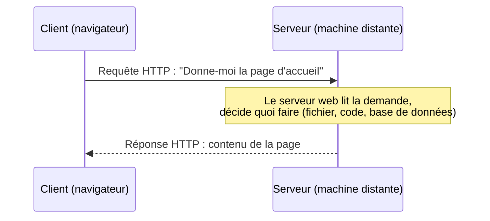
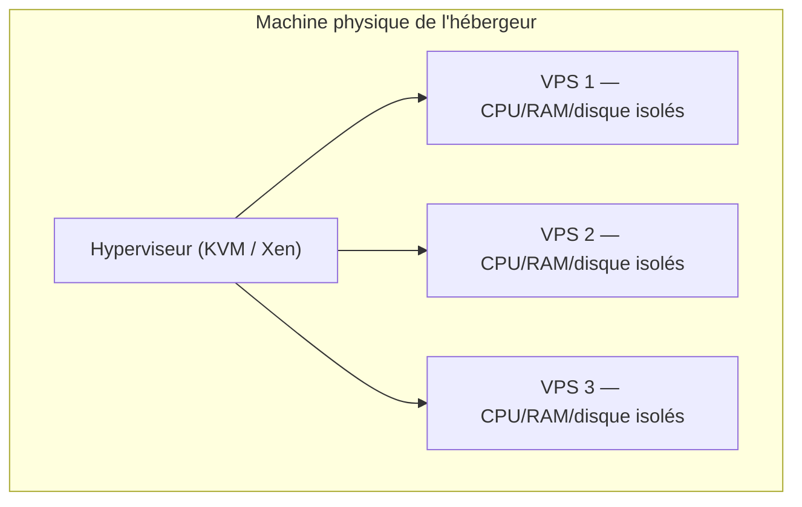
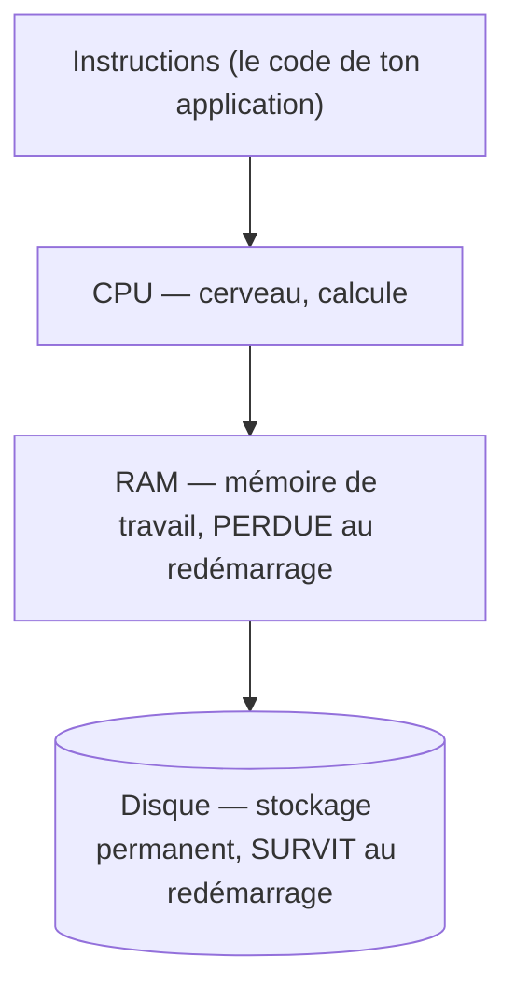
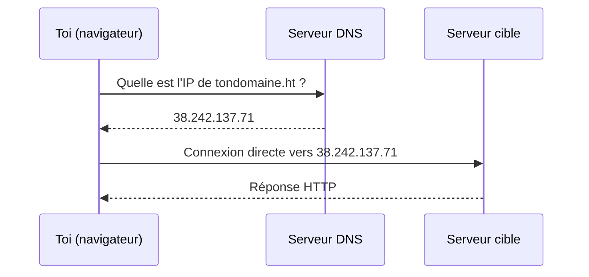
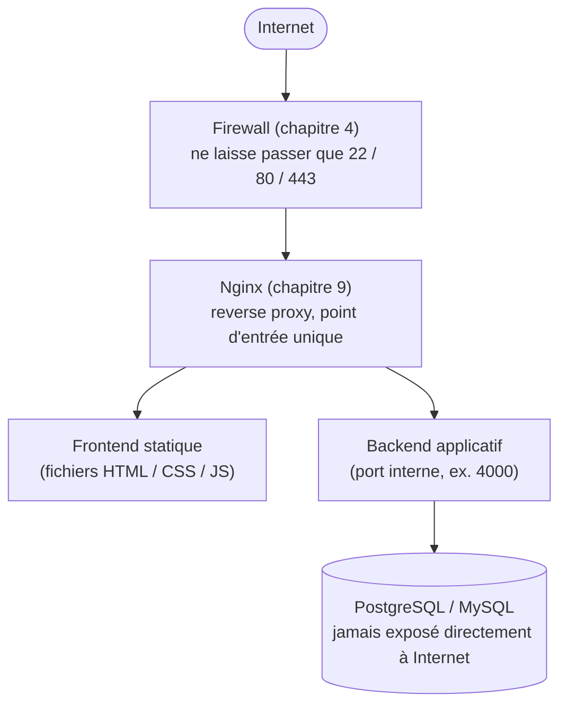

# Chapitre 1 — Comprendre un serveur

**Niveau : Débutant**

---

## Introduction

Avant d'installer quoi que ce soit, avant de taper la moindre commande, il faut comprendre ce que tu es réellement en train de manipuler. Ce chapitre pose les fondations conceptuelles de tout l'ouvrage : la machine, le réseau, la sécurité de base, le système d'exploitation. Aucune commande n'y est tapée — c'est un chapitre de compréhension pure, à lire attentivement, parce que chaque chapitre qui suit s'appuie sur le vocabulaire construit ici sans jamais le redéfinir.

Beaucoup de débutants sautent ce genre de chapitre pour "aller droit au but". C'est une fausse économie de temps : sans ce socle, chaque commande future devient une formule magique mémorisée sans compréhension, et la moindre panne devient un mur infranchissable. Ce chapitre est court à lire mais change durablement la façon dont tu vas aborder tout le reste du manuel.

---

## 🎯 Objectifs pédagogiques

À la fin de ce chapitre, tu sauras :
- expliquer ce qu'est un serveur et en quoi il diffère fondamentalement d'un PC, jusqu'au niveau du matériel et du système d'exploitation ;
- distinguer hébergement mutualisé, VPS, cloud et serveur dédié, et justifier lequel choisir pour un projet donné ;
- expliquer le rôle du CPU, de la RAM et du disque, et prédire l'impact d'un manque de chacun ;
- expliquer précisément comment deux machines se trouvent et communiquent sur Internet (adresse IP, port, DNS) ;
- définir domaine, sous-domaine et reverse proxy, et dessiner le trajet complet d'une requête ;
- expliquer les bases de la sécurité réseau (firewall, SSH, HTTPS) et pourquoi chacune est nécessaire ;
- expliquer ce qu'est un processus, un service, un daemon, et le rôle de systemd et cron ;
- expliquer à quoi servent les logs et les variables d'environnement, et pourquoi leur absence cause des incidents précis ;
- expliquer le système de permissions Linux (utilisateurs, groupes, root) et pourquoi il existe.

## 📋 Prérequis

Aucune connaissance en administration système ou en réseau n'est supposée. Il faut seulement : savoir utiliser un ordinateur et un navigateur web normalement, avoir déjà écrit du code dans au moins un langage de programmation (peu importe lequel), et disposer d'un ordinateur avec accès à Internet pour les laboratoires. Aucun VPS n'est nécessaire pour ce chapitre — les laboratoires se font entièrement depuis ton PC actuel.

## Pourquoi ce chapitre est important

Un débutant complet qui veut "juste déployer son application" est tenté de sauter directement aux commandes. C'est une erreur qui se paie plus tard, sous forme d'incompréhension totale face à la moindre panne. Chaque commande de ce manuel repose sur un petit nombre de concepts fondamentaux — machine, réseau, processus, permission — et **ce chapitre construit le vocabulaire et le modèle mental sur lequel s'appuient tous les suivants**.

Sauter ce chapitre, c'est essayer de lire une carte routière sans connaître la légende : chaque symbole restera un mystère, alors qu'il suffit de quelques dizaines de minutes pour l'apprendre une bonne fois pour toutes. Tous les futurs diagnostics de panne (chapitre 18) reposeront sur ta capacité à te demander "à quel endroit exact de ce trajet la requête s'est-elle arrêtée ?" — une question qui n'a de sens que si le trajet lui-même (construit dans ce chapitre) est déjà clair dans ta tête.

---

## Concepts fondamentaux

Ce chapitre couvre neuf notions, dans un ordre pensé pour que chacune s'appuie sur la précédente :

1. **Serveur** — un rôle logiciel, exécuté sur une machine.
2. **Familles d'hébergement** — où cette machine vit physiquement, et sous quel niveau de contrôle.
3. **Matériel** — CPU, RAM, disque : ce qui détermine sa capacité réelle.
4. **Réseau** — comment une autre machine la trouve et lui parle (IP, port, DNS).
5. **Reverse proxy** — comment plusieurs services cohabitent derrière une seule porte d'entrée.
6. **Sécurité réseau de base** — firewall, SSH, HTTPS.
7. **Processus et services** — comment un programme reste actif en continu.
8. **Logs et variables d'environnement** — comment observer et configurer un système sans toucher au code.
9. **Permissions** — qui a le droit de faire quoi.

La section suivante développe chacune en profondeur.

---

## Explications détaillées

### 1.1 Qu'est-ce qu'un serveur ?

Le mot "serveur" désigne à la fois **un rôle** et **une machine**, et confondre les deux est la première source de confusion chez un débutant.

> 💡 **Analogie** — Pense à un restaurant. Le **serveur** (la personne) prend les commandes des clients et leur apporte ce qu'ils ont demandé. Les **clients**, ce sont les navigateurs web, les applications mobiles, ou d'autres programmes qui envoient des demandes ("donne-moi la page d'accueil", "donne-moi les données de cet utilisateur"). Le restaurant tout entier — la cuisine, le personnel, les stocks — c'est la **machine serveur** : l'ordinateur physique ou virtuel sur lequel tourne le logiciel qui répond aux demandes.

Concrètement :
- **Un serveur (rôle)** est un programme qui écoute des demandes et y répond : un serveur web (nginx, Apache), un serveur d'API (ton backend Express), un serveur de base de données (MySQL).
- **Un serveur (machine)** est l'ordinateur — physique ou virtuel — sur lequel ces programmes tournent en permanence, généralement allumé 24h/24, 7j/7.

Dans ce manuel, quand on dit "le serveur" sans préciser, on parle de la machine : celle sur laquelle tu vas te connecter, installer des logiciels, et faire tourner ton application.

**Ce qui se passe réellement en arrière-plan** quand tu visites un site web :

**Explication du diagramme, ligne par ligne :** le client (ton navigateur) initie toujours l'échange en envoyant une requête HTTP — le serveur ne "pousse" jamais de contenu sans qu'une demande précède, dans ce modèle de base. Le serveur reçoit cette demande, l'interprète (ce que fait précisément ce traitement occupe l'essentiel du reste de ce manuel), puis renvoie une réponse. Absolument tout ce manuel n'est qu'une exploration en profondeur de ce qui se passe entre ces deux flèches.

> 📌 **À retenir** — Un serveur n'est pas un type d'ordinateur magique différent d'un PC dans sa nature. C'est un ordinateur (physique ou virtuel) configuré pour rester allumé en permanence et répondre à des demandes venues du réseau, plutôt que pour être utilisé directement par une personne devant un écran.

### 1.2 Différence entre un PC et un serveur

| | PC personnel | Serveur |
|---|---|---|
| Usage | Utilisé directement, devant un écran | Utilisé à distance, généralement sans écran ni clavier branchés |
| Disponibilité | Éteint la nuit, en veille souvent | Allumé en permanence (idéalement 24h/24, 365j/an) |
| Interface | Interface graphique (souris, fenêtres) | Le plus souvent en ligne de commande uniquement |
| Localisation | Chez toi | Dans un centre de données (datacenter), parfois à des milliers de kilomètres |
| Rôle | Exécuter des logiciels pour un utilisateur | Répondre à des demandes de nombreux clients simultanément |
| Redondance | Aucune, une seule machine | Souvent redondant (alimentation, réseau, parfois la machine elle-même) |
| Sauvegarde électrique | Rarement présente | Onduleurs + générateurs de secours dans le datacenter |
| Refroidissement | Ventilateur interne standard | Salle climatisée dédiée, température surveillée en continu |

> ⚠️ **Attention** — Un serveur n'a presque jamais d'écran ni de clavier branchés physiquement. Toute l'administration se fait à distance, en ligne de commande, via un protocole appelé **SSH** (section 1.7). C'est une des premières choses qui déstabilise un débutant : pas de fenêtres, pas de souris, juste du texte. C'est aussi ce qui rend un serveur automatisable, scriptable, reproductible — un vrai avantage une fois qu'on s'y est fait.

**Impact en production** de cette différence : un PC qui plante pendant la nuit n'a aucune conséquence, personne ne s'en aperçoit. Un serveur qui plante pendant la nuit met potentiellement hors ligne une application utilisée par de vrais utilisateurs, à n'importe quelle heure, dans n'importe quel fuseau horaire — d'où l'importance de tout ce qui sera vu aux chapitres 13 (Monitoring) et 16 (Sauvegardes avancées) : une panne de serveur doit être détectée et corrigée **avant** qu'un humain ne la remarque de lui-même, pas après.

### 1.3 Les familles d'hébergement

Il existe plusieurs façons d'obtenir "un serveur", avec des compromis différents entre coût, contrôle et responsabilité.

> 💡 **Analogie** — Louer un logement. **L'hébergement mutualisé**, c'est une chambre en colocation où tu ne peux rien modifier à la structure du bâtiment, juste utiliser ta chambre selon des règles fixées. **Le VPS**, c'est un appartement dans un immeuble : tu as tes propres murs, ta propre porte fermée à clé, tu peux repeindre et réaménager comme tu veux, mais l'immeuble (la machine physique) est partagé avec d'autres appartements (d'autres VPS). **Le serveur dédié**, c'est une maison individuelle : toute la machine physique t'appartient, rien n'est partagé. **Le cloud**, c'est un service d'appartements à la demande où tu peux en ajouter ou en retirer en quelques clics, payé à l'usage.

**Ce qui se passe réellement en arrière-plan d'un VPS** : un logiciel appelé **hyperviseur** (KVM, Xen, ou équivalent — Proxmox et VMware en sont des exemples connus) tourne sur la machine physique de l'hébergeur et simule, pour chaque VPS, un ordinateur complet et isolé : son propre processeur virtuel, sa propre mémoire allouée, son propre disque virtuel.

**Explication du diagramme :** une seule machine physique, en bas de la hiérarchie logique, héberge un hyperviseur qui à son tour fait tourner plusieurs VPS totalement isolés les uns des autres. Du point de vue du système d'exploitation installé dans un VPS, rien ne distingue une vraie machine physique d'une machine virtuelle — c'est précisément ce qui rend cette isolation fiable.

| Critère | Mutualisé | VPS | Dédié | Cloud |
|---|---|---|---|---|
| Accès administrateur (root) | Non | Oui | Oui | Oui |
| Isolation des ressources | Faible (voisins bruyants possibles) | Bonne | Totale | Bonne, élastique |
| Coût mensuel typique | 2-10 $ | 5-40 $ | 50-300 $+ | Variable, à l'usage |
| Facilité de mise à l'échelle | Aucune | Manuelle (changer d'offre) | Aucune (remplacer la machine) | Automatique possible |
| Idéal pour ce manuel | Non (aucun terminal) | **Oui** | Charge très élevée | Une fois les bases maîtrisées |

**Hébergement mutualisé (shared hosting).** Plusieurs sites web partagent la même machine et les mêmes ressources, gérées entièrement par l'hébergeur. Tu n'as **aucun accès administrateur** (pas de terminal, pas de root) — tout se fait via une interface web limitée (type cPanel). Bon marché, mais totalement inadapté à ce manuel : on ne peut rien y installer soi-même.

**VPS (Virtual Private Server — serveur privé virtuel).** Une machine physique est découpée, via l'hyperviseur décrit ci-dessus, en plusieurs machines virtuelles indépendantes. Chaque VPS a ses propres ressources garanties (CPU, RAM, disque), son propre système d'exploitation, et surtout : **un accès administrateur complet (root)**. C'est ce qu'on utilise dans ce manuel — le meilleur compromis coût/contrôle pour apprendre et pour héberger la plupart des applications réelles.

**Serveur dédié.** Une machine physique entière, rien que pour toi. Puissance et isolation maximales, mais coût nettement plus élevé et souvent disproportionné tant qu'on n'a pas un trafic conséquent.

**Cloud (à la demande / élastique).** Les grands fournisseurs (AWS, Azure, Google Cloud) proposent des VPS ("instances") qu'on peut créer et détruire en quelques secondes via une interface ou une API, avec une **facturation à l'usage** (parfois à la minute) et des dizaines de services annexes (bases de données managées, stockage, CDN...). Puissant mais nettement plus complexe à maîtriser au début, et la facturation à l'usage peut surprendre si elle n'est pas surveillée.

> ✅ **Bonne pratique** — Pour ce manuel et pour la plupart des projets de taille raisonnable (jusqu'à plusieurs milliers d'utilisateurs actifs), un VPS classique chez un hébergeur comme Hetzner, Contabo ou DigitalOcean est largement suffisant, prévisible en coût, et bien plus simple à apprendre que les services cloud à la carte. On y reviendra en détail au chapitre 4.

### 1.4 Anatomie d'un serveur : CPU, RAM, disque

Trois ressources déterminent ce qu'un serveur peut faire, et il faut comprendre leur rôle pour choisir un serveur adapté à un projet — et pour diagnostiquer une lenteur plus tard (chapitres 14 et 18).

**Explication du schéma, ligne par ligne :** les instructions (le code de ton application) entrent par le CPU, qui les exécute une par une. Le CPU a besoin de données immédiatement disponibles pour travailler vite — c'est le rôle de la RAM, qui les lui fournit à grande vitesse mais les perd totalement dès que le courant s'arrête. Le disque, en bas du schéma, est la mémoire lente mais permanente : c'est là que tout doit être écrit pour survivre à un redémarrage.

**CPU (Central Processing Unit — processeur).** Le cerveau qui exécute les instructions. Un serveur avec plusieurs **cœurs** (cores) peut exécuter plusieurs tâches en parallèle. Pour une application web classique (backend Express/Prisma, par exemple), 1 à 2 cœurs suffisent largement au démarrage.

> 💡 **Analogie** — Le CPU, ce sont les mains d'un cuisinier. Plus de cœurs, c'est comme avoir plusieurs cuisiniers en cuisine : ils peuvent préparer plusieurs plats en même temps, mais chaque plat individuel n'est pas préparé plus vite par un seul cuisinier — il faut juste plus de cuisiniers pour traiter plus de commandes en parallèle.

**Ce qui se passe réellement en arrière-plan :** un CPU exécute des instructions en cycles d'horloge, mesurés en GHz (milliards de cycles par seconde). Un "cœur" est une unité de calcul complète et indépendante ; un CPU moderne en contient plusieurs sur la même puce physique. Le système d'exploitation (Linux, dans ce manuel) décide en permanence quel processus utilise quel cœur à quel instant — c'est le rôle de l'**ordonnanceur** (scheduler), un composant du noyau Linux.

**RAM (Random Access Memory — mémoire vive).** La mémoire de travail à court terme, où vivent les données en cours d'utilisation. Contrairement au disque, elle est **volatile** : tout son contenu disparaît si le serveur redémarre. Chaque processus (section 1.8) consomme de la RAM tant qu'il tourne.

> 💡 **Analogie** — Si le disque dur est l'armoire où on range tout durablement, la RAM est le plan de travail de la cuisine : ce qu'on est en train d'utiliser là, maintenant. Un plan de travail trop petit oblige à ranger et ressortir sans cesse (lent) ; un plan de travail assez grand permet de tout avoir sous la main.

> ⚠️ **Attention** — Manquer de RAM est l'une des causes les plus fréquentes de plantage d'un serveur en production (le système "tue" un processus pour libérer de la mémoire — l'"OOM killer", vu en détail au chapitre 18). Un VPS de 1 Go de RAM suffit pour un tout petit projet de test ; un projet réel avec base de données tourne plus confortablement à partir de 2 à 4 Go.

**Impact en production :** une application qui manque de RAM ne ralentit pas gentiment — elle finit par être tuée brutalement par le système d'exploitation, sans avertissement dans ses propres logs (le signal vient du noyau, pas de l'application elle-même), ce qui rend ce type de panne particulièrement déroutant pour un débutant qui ne sait pas où chercher. Le chapitre 18 y consacre un scénario entier.

**Disque : HDD, SSD, NVMe.** Le stockage **persistant** : contrairement à la RAM, son contenu survit à un redémarrage. C'est là que vivent le système d'exploitation, le code de l'application, et les données de la base de données.

| Type | Vitesse relative | Mécanisme | Présence chez les hébergeurs VPS modernes |
|---|---|---|---|
| HDD | 1x (référence) | Disque magnétique rotatif, pièces mobiles | Quasiment disparu |
| SSD (SATA) | 20-30x plus rapide qu'un HDD | Mémoire électronique, aucune pièce mobile | Standard courant |
| NVMe | 50-100x plus rapide qu'un HDD | Mémoire électronique, connecté directement au bus PCIe | De plus en plus le défaut |

> 📌 **À retenir** — Pour une base de données, la vitesse du disque a un impact direct et souvent sous-estimé sur les performances perçues par l'utilisateur final. À budget égal, préférer systématiquement un hébergeur qui propose du SSD/NVMe plutôt que du HDD.

### 1.5 Le réseau : comment deux machines se trouvent et se parlent

**Adresse IP.** Chaque machine connectée à Internet possède une **adresse IP**, l'équivalent d'une adresse postale : elle permet à une autre machine de savoir où envoyer des données.

- **IPv4** : le format historique, à 4 nombres séparés par des points, chacun entre 0 et 255 (exemple : `38.242.137.71`). Le nombre total d'adresses IPv4 possibles est épuisé depuis plusieurs années, ce qui les rend rares et donc parfois facturées en supplément par les hébergeurs.
- **IPv6** : le format plus récent, bien plus long (exemple : `2001:0db8:85a3::8a2e:0370:7334`), conçu pour offrir un nombre quasiment illimité d'adresses. De plus en plus répandu, mais pas encore universellement supporté par tous les réseaux — un serveur en production dispose généralement des deux.

> 💡 **Analogie** — L'IP, c'est l'adresse postale complète d'un bâtiment. Sans elle, aucun courrier (aucune donnée) ne peut te trouver sur Internet.

**Ports.** Une seule machine peut faire tourner plusieurs services réseau en même temps (un serveur web, une base de données, un serveur SSH...). Le **port** est un numéro qui permet de distinguer à quel service une donnée entrante est destinée, une fois arrivée à la bonne adresse IP.

> 💡 **Analogie** — Si l'IP est l'adresse du bâtiment, le port est le numéro d'appartement. Le courrier arrive au bon immeuble (IP) puis est distribué au bon appartement (port).

| Port | Service | Exposé publiquement dans ce manuel ? |
|---|---|---|
| 22 | SSH (connexion administrateur à distance) | Oui |
| 80 | HTTP (web, non chiffré) | Oui (redirige vers 443) |
| 443 | HTTPS (web, chiffré) | Oui |
| 3306 | MySQL | Jamais |
| 5432 | PostgreSQL | Jamais |
| 6379 | Redis | Jamais |

> ⚠️ **Attention** — Un port "ouvert" sur Internet est un point d'entrée potentiel pour une attaque. La règle de base (détaillée au chapitre 4 avec le firewall) : n'ouvrir au public que les ports strictement nécessaires (22, 80, 443), jamais le port d'une base de données ou d'un backend applicatif directement.

**DNS, domaine, sous-domaine.** Personne ne mémorise `38.242.137.71` pour visiter un site — on retient un nom, `tondomaine.ht`. Le **DNS** (Domain Name System) est le système mondial qui traduit un nom de domaine en adresse IP.

**Explication ligne par ligne :** taper un nom de domaine ne contacte jamais directement le serveur cible — une étape de traduction invisible (les deux premières flèches) a toujours lieu avant que la vraie connexion (troisième flèche) ne s'établisse. C'est pour cette raison qu'un domaine mal configuré (chapitre 18, scénario dédié au DNS) rend un site injoignable même si le serveur, lui, fonctionne parfaitement.

> 💡 **Analogie** — Le DNS, c'est l'annuaire téléphonique d'Internet. Tu connais le nom ("Pizzeria Chez Marco"), l'annuaire te donne le numéro à appeler (l'adresse IP réelle).

- **Nom de domaine** : `tondomaine.ht`, acheté auprès d'un registrar (Namecheap, OVH, Google Domains...).
- **Sous-domaine** : une subdivision du domaine principal, gratuite et illimitée une fois le domaine possédé — `api.tondomaine.ht`, `admin.tondomaine.ht`. Utile pour séparer différents services d'une même application (le site public, le back-office, l'API) sous des adresses distinctes.

### 1.6 Le modèle client-serveur et le reverse proxy

Sur un serveur qui héberge plusieurs applications ou plusieurs composants (un frontend, un backend, parfois plusieurs sites), un logiciel appelé **reverse proxy** se place devant tout le reste et redirige chaque requête entrante vers le bon composant interne, selon des règles (le domaine demandé, le chemin de l'URL...).

**Explication ligne par ligne :** une requête entrante rencontre d'abord le firewall, qui filtre déjà tout ce qui n'est pas sur un port autorisé. Ce qui passe atteint nginx, qui décide — selon le domaine ou le chemin demandé — s'il doit servir un fichier statique directement ou transmettre la requête à un programme backend qui tourne en interne. Ce backend, à son tour, peut interroger une base de données, elle-même jamais directement accessible depuis Internet. C'est ce schéma exact que tu construiras, brique par brique, du chapitre 4 au chapitre 10.

> 💡 **Analogie** — Le reverse proxy, c'est la réceptionniste d'un immeuble de bureaux. Le visiteur (la requête) ne connaît que l'adresse de l'immeuble ; c'est la réceptionniste qui l'oriente vers le bon étage et le bon bureau (le bon service interne), sans que le visiteur ait besoin de connaître le plan interne du bâtiment.

### 1.7 Les bases de la sécurité réseau

**Firewall (pare-feu).** Un logiciel qui filtre le trafic réseau entrant et sortant selon des règles, en bloquant tout ce qui n'est pas explicitement autorisé.

> 💡 **Analogie** — Le videur à l'entrée d'un établissement : il vérifie chaque personne qui se présente et n'en laisse entrer que certaines, selon une liste de critères définie à l'avance.

> ✅ **Bonne pratique** — Sur un serveur, la politique de base recommandée est **"tout refuser par défaut, autoriser explicitement ce qui est nécessaire"** — jamais l'inverse. Ce point est détaillé et mis en pratique (`ufw`) au chapitre 2 et au chapitre 4.

**SSH (Secure Shell).** Le protocole standard pour se connecter à distance, en ligne de commande, à un serveur Linux, de façon chiffrée (personne ne peut espionner la connexion en transit). C'est **la** porte d'entrée principale d'un administrateur système vers son serveur — tout le chapitre 4 en dépend.

**HTTPS, SSL/TLS, certificats.** **HTTP** transmet les données en clair : n'importe qui interceptant le trafic (sur un Wi-Fi public par exemple) peut le lire. **HTTPS** ajoute une couche de chiffrement (via un protocole appelé **TLS**, historiquement **SSL** — les deux termes sont encore utilisés de façon interchangeable dans le langage courant) qui rend le contenu illisible pour quiconque l'intercepte en chemin.

Pour activer HTTPS, un serveur doit présenter un **certificat** : un fichier délivré par une autorité de confiance qui prouve que le serveur est bien celui qu'il prétend être pour ce nom de domaine précis. Le chapitre 10 explique comment obtenir un certificat gratuit et automatiquement renouvelé via Let's Encrypt.

> ⚠️ **Attention** — En 2026, un site sans HTTPS est signalé "Non sécurisé" par tous les navigateurs modernes, perd en référencement, et ne peut pas utiliser certaines fonctionnalités web modernes (géolocalisation, notifications push...). HTTPS n'est plus une option pour un site en production, c'est un prérequis de base.

### 1.8 Processus, services, daemons, systemd, cron

**Processus.** Un **processus** est une instance d'un programme en cours d'exécution. Chaque fois qu'un programme démarre, le système d'exploitation lui attribue un identifiant unique (**PID**, Process ID) et lui alloue de la mémoire et du temps CPU.

**Service et daemon.** Un **daemon** (prononcé "démon", terme historique Unix) est un processus qui tourne en arrière-plan, sans interaction directe avec un utilisateur, généralement démarré automatiquement au démarrage du système et redémarré s'il s'arrête de façon inattendue. Le terme **service** désigne la même idée, dans le vocabulaire de gestion moderne (systemd — voir ci-dessous). Un serveur web (nginx), une base de données (MySQL), un serveur SSH : tous fonctionnent comme des services/daemons.

> 💡 **Analogie** — Un daemon, c'est un employé qui travaille en coulisses, sans jamais être face au client, mais dont le travail continu est indispensable au fonctionnement de l'établissement (la personne qui maintient la température des chambres froides dans un restaurant, par exemple).

**systemd.** Le système standard, sur les distributions Linux modernes dont Ubuntu, qui gère le démarrage, l'arrêt, le redémarrage automatique et la supervision de tous les services du système. C'est l'outil qu'on utilisera (commande `systemctl`, détaillée au chapitre 2) pour démarrer/arrêter/vérifier l'état de nginx, MySQL, et d'autres services système.

> 📌 **À retenir** — PM2 (utilisé plus loin dans ce manuel pour le code de l'application elle-même) joue un rôle similaire à systemd, mais spécifiquement pour les process Node.js applicatifs, avec des fonctionnalités adaptées au développement (rechargement, logs applicatifs groupés, gestion multi-process). Les deux coexistent sur un même serveur, chacun sur son périmètre.

**Cron.** Le planificateur de tâches de Linux : il exécute une commande donnée à intervalle régulier (toutes les nuits à 2h, toutes les heures, chaque premier du mois...), sans intervention humaine. C'est ce qui permettra, aux chapitres 13 (Monitoring) et 16 (Sauvegardes avancées), d'automatiser des tâches répétitives critiques.

### 1.9 Logs

Les **logs** (journaux) sont l'enregistrement chronologique de ce qui se passe sur un système ou dans une application : requêtes reçues, erreurs rencontrées, connexions effectuées, actions réalisées. Ce sont la première et souvent la seule source d'information disponible pour comprendre pourquoi quelque chose a mal tourné après coup.

> 💡 **Analogie** — Le journal de bord d'un navire : chaque événement notable est consigné avec son horodatage, pour pouvoir reconstituer après coup ce qui s'est passé, dans quel ordre, et pourquoi.

> ✅ **Bonne pratique** — Prendre l'habitude, face à n'importe quel problème sur un serveur, de **toujours commencer par lire les logs pertinents** avant de chercher une solution en ligne. Neuf fois sur dix, la cause exacte du problème y est écrite noir sur blanc. Ce réflexe est développé en profondeur au chapitre 18.

### 1.10 Variables d'environnement

Une **variable d'environnement** est une valeur (texte) fournie à un programme depuis l'extérieur de son code, au moment où il démarre, plutôt qu'écrite en dur dans le code source. C'est le mécanisme standard pour fournir à une application des informations qui changent selon l'endroit où elle tourne — l'adresse de la base de données, une clé secrète, l'URL publique du site — sans jamais modifier le code lui-même entre le développement et la production.

> 💡 **Analogie** — Une recette de cuisine générique qui dit "utilise le sel qui se trouve dans TA cuisine" plutôt que d'imposer une marque précise achetée dans un magasin précis. La recette (le code) reste identique partout ; seul l'ingrédient réel fourni (la variable d'environnement) change selon le contexte.

> ⚠️ **Attention** — Les variables d'environnement contiennent très souvent des secrets (mots de passe de base de données, clés d'API, clés de chiffrement). Elles ne doivent **jamais** être écrites dans le code source ni envoyées sur un dépôt Git public ou privé — ce point capital est développé au chapitre 3 (Git) et revient dans presque tous les dépannages du chapitre 18.

### 1.11 Permissions Linux : utilisateurs, groupes, root

Linux est un système **multi-utilisateur** par conception : plusieurs comptes peuvent exister sur une même machine, chacun avec ses propres droits sur les fichiers et les actions autorisées.

- **Un utilisateur** possède un nom, un identifiant numérique (UID), et un dossier personnel (`/home/nomutilisateur`).
- **Un groupe** rassemble plusieurs utilisateurs pour leur attribuer des droits communs sans les répéter individuellement.
- **`root`** est l'utilisateur administrateur suprême, avec absolument tous les droits sur le système, sans aucune restriction — y compris celui de supprimer des fichiers essentiels au fonctionnement de la machine, ou de rendre le serveur inutilisable en une seule commande mal tapée.

> 💡 **Analogie** — Dans un immeuble de bureaux, chaque employé (utilisateur) a un badge qui lui ouvre certaines portes seulement. Certains services (groupes) partagent l'accès à une même salle. Le concierge général (`root`) a un passe-partout qui ouvre absolument toutes les portes, y compris la salle des machines électriques — un pouvoir puissant, donc dangereux à utiliser pour des tâches du quotidien.

> ❌ **Erreur fréquente** — Un débutant, frustré par un message "permission refusée", a le réflexe de tout faire en tant que `root` (ou avec `sudo` systématiquement) pour "que ça marche". C'est une mauvaise habitude qui augmente drastiquement les conséquences d'une erreur de frappe (une commande de suppression mal ciblée, exécutée en `root`, peut détruire des fichiers système critiques sans aucune confirmation). La bonne pratique — développée au chapitre 2 et au chapitre 4 — est de travailler au quotidien avec un utilisateur normal, et de n'invoquer les droits `root` (via `sudo`) que ponctuellement, pour l'action précise qui le nécessite réellement.

---

## Analogies clés de ce chapitre

| Notion | Analogie |
|---|---|
| Serveur | Le personnel et la cuisine d'un restaurant |
| Hébergement (mutualisé/VPS/dédié/cloud) | Colocation, appartement, maison individuelle, location à la demande |
| CPU | Les mains d'un cuisinier |
| RAM vs disque | Le plan de travail vs l'armoire de la cuisine |
| Adresse IP | L'adresse postale d'un bâtiment |
| Port | Le numéro d'appartement dans l'immeuble |
| DNS | L'annuaire téléphonique |
| Reverse proxy | La réceptionniste d'un immeuble de bureaux |
| Firewall | Le videur à l'entrée d'un établissement |
| Daemon | L'employé qui travaille en coulisses |
| Logs | Le journal de bord d'un navire |
| Variable d'environnement | "Utilise le sel de TA cuisine", pas une marque imposée |
| Permissions / root | Les badges d'employés vs le passe-partout du concierge |

---

## Étude de cas

**Contexte.** Imagine que tu rejoins, comme développeur freelance, une petite structure qui gère une plateforme de gestion académique déjà en ligne — un scénario très proche de ce que vivent de nombreux développeurs indépendants dès leurs premières missions. Le fondateur t'écrit : *"Le site rame parfois le matin, et hier il a été injoignable pendant vingt minutes. Peux-tu regarder ?"*

**Sans ce chapitre**, cette phrase est un mur : tu ne sais même pas par où commencer, ni ce que "injoignable" peut vouloir dire techniquement.

**Avec ce chapitre**, tu sais immédiatement qu'il faut distinguer plusieurs hypothèses indépendantes, chacune correspondant à une notion vue ici : un problème de **DNS** (1.5, le domaine ne pointe peut-être plus vers la bonne IP) ; un problème de **ressources** (1.4, le serveur manque de RAM ou de CPU aux heures de pointe du matin) ; un problème de **service arrêté** (1.8, le processus applicatif a peut-être crashé) ; ou un problème de **réseau/firewall** (1.7, un port a peut-être été fermé par erreur). Tu sais aussi que la première chose à faire, dans tous les cas, est de consulter les **logs** (1.9) plutôt que de deviner.

Ce diagnostic structuré — plutôt qu'une réaction de panique — est exactement la posture qu'un administrateur système professionnel adopte face à un incident, et c'est ce que le chapitre 18 formalisera en méthode complète une fois tous les outils nécessaires acquis.

---

## Bonnes pratiques (récapitulatif du chapitre)

- Choisir un VPS plutôt qu'un hébergement mutualisé dès qu'un accès terminal est nécessaire.
- Préférer systématiquement un disque SSD/NVMe à un HDD, en particulier pour une base de données.
- N'ouvrir au firewall que les ports strictement nécessaires (22, 80, 443).
- Ne jamais exposer publiquement le port d'une base de données.
- Activer HTTPS sur tout site destiné à un usage réel, sans exception.
- Consulter systématiquement les logs avant de chercher une solution ailleurs.
- Ne jamais écrire un secret directement dans le code source.
- Travailler au quotidien avec un utilisateur non-root, réserver `sudo` aux actions qui le nécessitent réellement.

---

## Erreurs fréquentes (récapitulatif du chapitre)

| Erreur | Pourquoi elle arrive | Conséquence |
|---|---|---|
| Confondre serveur (rôle) et serveur (machine) | Le mot est utilisé pour les deux dans le langage courant | Confusion en lisant toute documentation technique |
| Choisir un hébergement mutualisé pour ce manuel | Prix attractif au premier regard | Aucun accès terminal possible, bloquant dès le chapitre 2 |
| Travailler en permanence en `root` | Réflexe pour "éviter les erreurs de permission" | Une seule faute de frappe peut détruire des fichiers critiques |
| Ignorer les logs face à un problème | Réflexe de chercher directement une solution en ligne | Perte de temps à chercher une cause déjà écrite dans les logs |
| Écrire un secret directement dans le code | Semble plus simple à court terme | Fuite de secret si le code est un jour partagé ou publié |

---

## Captures d'écran à réaliser

> 📸 **Capture 1**
> **Logiciel :** navigateur web (Chrome, Firefox ou Edge), outils de développement (F12)
> **Pourquoi cette capture est utile :** elle rend visible, une seule fois, tout le vocabulaire réseau du chapitre (protocole, statut, en-têtes) sur un exemple réel et familier.
> **Page/écran concerné :** onglet "Réseau" / "Network", après rechargement d'une page web quelconque
> **Niveau de zoom conseillé :** 100 %, fenêtre du navigateur maximisée pour que les colonnes du tableau réseau soient toutes lisibles
> **Montrer :** la liste des requêtes, le code de statut HTTP d'une requête, le protocole (`https`), l'adresse de destination
> **Entourer :** la colonne "Protocol" ou l'indication `h2`/`https`, et le code de statut (ex : `200`)
> **Flouter/masquer :** rien de sensible normalement présent sur cet écran pour un site public

> 📸 **Capture 2**
> **Logiciel :** [dnschecker.org](https://dnschecker.org)
> **Pourquoi cette capture est utile :** elle rend concret un mécanisme entièrement invisible en usage normal (la résolution DNS), en montrant qu'un même nom de domaine peut être résolu différemment selon l'emplacement géographique interrogé.
> **Page/écran concerné :** page de résultat après recherche d'un domaine (ex : `google.com`)
> **Niveau de zoom conseillé :** 100 %, capture de la page entière avec la carte ou la liste de résultats visible
> **Montrer :** la carte ou liste des résultats par pays, l'adresse IP retournée pour plusieurs emplacements
> **Entourer :** une adresse IP affichée pour un emplacement précis
> **Flouter/masquer :** aucune information sensible sur cet écran

---

## Laboratoire pratique n°1 — Observer le DNS en action

**Objectifs :** voir concrètement la résolution DNS décrite en 1.5, et confirmer qu'un même domaine peut être résolu différemment selon la localisation géographique de l'interrogation.
**Prérequis :** aucun.
**Matériel nécessaire :** un ordinateur avec navigateur et accès Internet.

**Étapes :**
1. Ouvre [dnschecker.org](https://dnschecker.org) dans ton navigateur.
2. Tape un nom de domaine connu, par exemple `google.com`, et lance la recherche.
3. Observe l'adresse IP retournée pour plusieurs emplacements géographiques différents dans les résultats.
4. Note l'adresse IP retournée pour la localisation la plus proche de chez toi.
5. Recommence avec un second domaine de ton choix (par exemple un de tes propres projets, s'il en a déjà un).

**Résultat attendu :** une liste de résultats montrant, pour chaque emplacement testé, une adresse IP (parfois identique partout, parfois différente selon la répartition de charge géographique du site testé).

**Vérifications :** tu dois être capable de citer, pour le domaine testé, au moins une adresse IP correcte associée.

**Erreurs fréquentes :**
- Confondre l'adresse IP affichée avec un numéro de port ou un identifiant quelconque : une adresse IPv4 a toujours la forme de quatre nombres séparés par des points, chacun entre 0 et 255.
- Interroger un domaine qui n'existe pas ou mal orthographié, obtenant une page d'erreur plutôt qu'un résultat — relire attentivement le nom de domaine tapé.

**Solutions :** si aucun résultat ne s'affiche, vérifier la connexion Internet locale, puis réessayer avec un domaine connu comme `google.com` pour isoler si le problème vient du domaine testé ou de l'outil lui-même.

---

## Laboratoire pratique n°2 — Observer un échange client-serveur réel

**Objectifs :** identifier dans un vrai navigateur les éléments du diagramme de la section 1.1 (requête, réponse, statut, protocole).
**Prérequis :** Laboratoire 1 complété (familiarité de base avec le navigateur en mode inspection).
**Matériel nécessaire :** un ordinateur avec navigateur et accès Internet.

**Étapes :**
1. Ouvre n'importe quel site web dans ton navigateur.
2. Ouvre les outils de développement (touche F12, ou clic droit → "Inspecter").
3. Va dans l'onglet "Réseau" / "Network". Coche "Preserve log" si l'option est disponible.
4. Recharge la page (F5 ou Ctrl+R).
5. Clique sur la première requête de la liste (généralement le document HTML principal).
6. Repère, dans le panneau de détail : l'URL complète, le protocole (`https://`), le code de statut, et au moins un en-tête de réponse (`Content-Type`, par exemple).

**Résultat attendu :** une requête sélectionnée dont tu peux lire distinctement l'URL, le code de statut (généralement `200`), et au moins un en-tête de réponse.

**Vérifications :** tu dois pouvoir répondre sans hésiter à "quel est le code de statut de cette requête, et que signifie-t-il ?" (une réponse réussie).

**Erreurs fréquentes :**
- Ouvrir l'onglet réseau **après** le chargement de la page : la liste apparaît vide car les requêtes déjà passées ne sont pas capturées rétroactivement — toujours recharger la page une fois l'onglet ouvert.
- Confondre l'onglet "Réseau"/"Network" avec l'onglet "Console" (qui affiche des messages, pas des requêtes).

**Solutions :** si la liste reste vide après un rechargement, vérifier qu'aucun filtre n'est actif dans la barre de l'onglet réseau (un filtre par type de fichier peut cacher la requête principale).

---

## Laboratoire pratique n°3 — Cartographier une application que tu connais

**Objectifs :** transférer le schéma théorique de la section 1.6 à un cas concret et personnel.
**Prérequis :** Laboratoires 1 et 2 complétés.
**Matériel nécessaire :** une feuille de papier ou un éditeur de texte.

**Étapes :**
1. Choisis une application web que tu utilises régulièrement, ou l'un de tes propres projets.
2. Dessine le schéma "Internet → Firewall → Nginx → Backend → Base de données" (section 1.6).
3. Indique, si tu les connais, les vrais noms de domaine/sous-domaines utilisés par cette application.
4. Identifie, pour cette application, ce qui constitue probablement le "frontend statique" et ce qui constitue le "backend applicatif".

**Résultat attendu :** un schéma personnel complet, avec au moins un élément réel (domaine, sous-domaine, ou type de composant) correctement identifié.

**Vérifications :** relis ton schéma et vérifie qu'il respecte l'ordre logique du chapitre (le firewall est toujours avant nginx, jamais après).

**Erreurs fréquentes :** placer la base de données directement après le firewall (sans passer par le backend) — rappelle-toi que la base ne doit jamais être accessible directement depuis l'extérieur (section 1.5).

**Solutions :** si tu ne connais pas l'architecture réelle de l'application choisie, c'est normal à ce stade — le but est de raisonner sur le schéma générique, pas de deviner une architecture que tu n'as jamais vue.

---

## Exercices

1. Explique avec tes propres mots, sans relire le chapitre, la différence entre un PC et un serveur.
2. Un client te demande d'héberger une application qui aura environ 50 utilisateurs au lancement, avec un budget serré. Quelle famille d'hébergement (1.3) recommandes-tu, et pourquoi pas les trois autres ?
3. Une application plante après plusieurs jours de fonctionnement stable, sans erreur explicite dans ses propres logs applicatifs. À la lumière de la section 1.4, quelle piste dois-tu explorer en premier ?
4. Pourquoi un mot de passe de base de données ne doit-il jamais être écrit directement dans le code source (1.10) ? Donne un scénario concret où cela causerait un problème réel.
5. Explique pourquoi `sudo ufw enable` sans avoir autorisé SSH au préalable (1.7, développé au chapitre 2) est une erreur potentiellement bloquante.

---

## Quiz

**Question 1.** Un VPS est :
a) Un ordinateur physique entièrement dédié à un seul client
b) Une machine virtuelle isolée sur un serveur physique partagé, avec accès root
c) Un hébergement mutualisé avec plus de stockage
d) Un service de stockage cloud uniquement

**Question 2.** La RAM est dite "volatile" parce que :
a) Elle est plus rapide que le disque
b) Son contenu disparaît totalement lors d'une coupure de courant ou d'un redémarrage
c) Elle coûte plus cher que le disque
d) Elle ne peut contenir que du texte

**Question 3.** Le rôle du DNS est de :
a) Chiffrer les communications entre client et serveur
b) Traduire un nom de domaine en adresse IP
c) Filtrer le trafic réseau entrant
d) Stocker les mots de passe des utilisateurs

**Question 4.** Pourquoi le port d'une base de données ne doit-il jamais être ouvert publiquement ?
a) Parce que les bases de données n'acceptent pas les connexions réseau
b) Parce que cela ralentirait le serveur
c) Parce que ce serait un point d'entrée direct pour une attaque, contournant l'application
d) Parce que le port 3306 est réservé par Linux

**Question 5.** `root` doit être utilisé :
a) En permanence, pour éviter les erreurs de permission
b) Uniquement pour l'action précise qui nécessite réellement des droits administrateur, jamais comme habitude de travail
c) Uniquement le premier jour de configuration du serveur
d) Jamais, sous aucun prétexte

> 🔑 **Corrigé** — 1: b · 2: b · 3: b · 4: c · 5: b

---

## 📝 Résumé du chapitre

- Un serveur est un rôle logiciel (répondre à des demandes) exécuté sur une machine (physique ou virtuelle) allumée en permanence, sans écran ni clavier, administrée à distance.
- On choisit entre mutualisé (aucun contrôle), VPS (bon compromis, celui utilisé dans ce manuel), dédié (tout pour soi, coûteux) et cloud (élastique, facturé à l'usage) ; un hyperviseur isole chaque VPS sur la machine physique partagée.
- CPU, RAM et disque sont les trois ressources qui déterminent ce qu'un serveur peut faire ; la RAM est volatile, le disque est permanent, le SSD/NVMe est aujourd'hui le standard.
- Une adresse IP identifie une machine sur le réseau, un port identifie un service précis sur cette machine, le DNS traduit un nom de domaine humainement lisible en adresse IP.
- Un reverse proxy (nginx, dans ce manuel) redirige les requêtes entrantes vers le bon service interne — c'est l'architecture cible de tout ce manuel.
- Firewall, SSH et HTTPS forment le socle minimal de sécurité réseau d'un serveur.
- Un processus est un programme en cours d'exécution ; un service/daemon tourne en arrière-plan en continu ; systemd gère les services système, PM2 gère les process applicatifs Node, cron planifie des tâches récurrentes.
- Les logs sont la première source de vérité en cas de problème ; les variables d'environnement séparent la configuration (et les secrets) du code source.
- Linux est multi-utilisateur ; `root` a tous les droits et ne doit être invoqué que ponctuellement, jamais comme habitude de travail.

## ✅ Checklist avant de passer au chapitre 2

- [ ] Je peux expliquer avec mes propres mots la différence entre un PC et un serveur.
- [ ] Je sais dire quelle famille d'hébergement (mutualisé/VPS/dédié/cloud) je vais utiliser et pourquoi.
- [ ] Je peux expliquer ce qu'est une adresse IP et un port sans relire le chapitre.
- [ ] Je sais dessiner de mémoire le schéma Internet → Firewall → Nginx → Backend → Base de données.
- [ ] Je comprends pourquoi un mot de passe de base de données ne doit jamais être écrit dans le code source.
- [ ] Je sais ce que signifie "root" et pourquoi ce n'est pas l'utilisateur à utiliser au quotidien.
- [ ] J'ai réalisé les trois laboratoires de ce chapitre et complété les exercices.
- [ ] J'ai obtenu au moins 4/5 au quiz — sinon, relire la section correspondant à la question manquée avant de continuer.

---

## Glossaire du chapitre

**Serveur**
Définition simple : un ordinateur allumé en permanence qui répond à des demandes venues d'Internet.
Définition technique : une machine (physique ou virtuelle) exécutant un ou plusieurs programmes qui écoutent des connexions réseau entrantes et y répondent selon un protocole défini.
Exemple concret : le VPS sur lequel tourne `nginx` et une API Express.
Voir : Chapitre 1, section 1.1.

**VPS (Virtual Private Server)**
Définition simple : une portion isolée d'un serveur physique, avec ses propres ressources et un accès administrateur complet.
Définition technique : une machine virtuelle créée par un hyperviseur, disposant d'un CPU, d'une RAM et d'un disque alloués, et d'un accès root indépendant des autres VPS du même hôte physique.
Exemple concret : un VPS Hetzner de 2 vCPU / 4 Go de RAM loué pour ce manuel.
Voir : Chapitre 1, section 1.3 ; Chapitre 4.

**Hyperviseur**
Définition simple : le logiciel qui découpe une grosse machine physique en plusieurs petites machines virtuelles.
Définition technique : une couche logicielle (KVM, Xen...) qui virtualise le matériel et isole plusieurs systèmes d'exploitation invités sur une même machine hôte.
Exemple concret : KVM, utilisé par la plupart des hébergeurs VPS.
Voir : Chapitre 1, section 1.3.

**CPU**
Définition simple : le cerveau de l'ordinateur, qui exécute les instructions.
Définition technique : le processeur, composé d'un ou plusieurs cœurs exécutant des instructions à une fréquence mesurée en GHz, ordonnancés par le noyau du système d'exploitation.
Exemple concret : un VPS "2 vCPU" dispose de deux cœurs virtuels.
Voir : Chapitre 1, section 1.4.

**RAM**
Définition simple : la mémoire de travail immédiate, perdue si le courant s'arrête.
Définition technique : mémoire volatile à accès aléatoire, utilisée par les processus pour stocker leurs données en cours de traitement.
Exemple concret : une application Node.js consommant 200 Mo de RAM pendant son exécution.
Voir : Chapitre 1, section 1.4.

**Adresse IP**
Définition simple : l'adresse d'une machine sur Internet.
Définition technique : un identifiant numérique unique (IPv4 sur 32 bits ou IPv6 sur 128 bits) attribué à une interface réseau, utilisé pour l'acheminement des paquets.
Exemple concret : `38.242.137.71`.
Voir : Chapitre 1, section 1.5.

**Port**
Définition simple : le numéro qui indique à quel service précis une donnée est destinée sur une machine.
Définition technique : un entier de 0 à 65535 identifiant un point de terminaison de communication réseau, associé à un protocole de transport (TCP/UDP).
Exemple concret : le port 443 pour HTTPS.
Voir : Chapitre 1, section 1.5.

**DNS (Domain Name System)**
Définition simple : l'annuaire qui traduit un nom de domaine en adresse IP.
Définition technique : un système hiérarchique et distribué de résolution de noms, interrogé via des enregistrements (A, AAAA, CNAME, MX...).
Exemple concret : la résolution de `tondomaine.ht` vers `38.242.137.71`.
Voir : Chapitre 1, section 1.5.

**Reverse proxy**
Définition simple : le logiciel qui reçoit toutes les requêtes en premier et les redirige vers le bon service interne.
Définition technique : un serveur intermédiaire placé côté serveur (contrairement à un proxy classique, côté client) qui reçoit les requêtes pour le compte d'un ou plusieurs serveurs backend.
Exemple concret : Nginx redirigeant `/api` vers un backend Express et `/` vers des fichiers statiques.
Voir : Chapitre 1, section 1.6 ; Chapitre 9.

**Firewall**
Définition simple : le filtre qui bloque tout trafic réseau non autorisé.
Définition technique : un dispositif logiciel ou matériel appliquant des règles de filtrage de paquets selon des critères (port, IP source, protocole).
Exemple concret : `ufw`, qui n'autorise que les ports 22/80/443 sur le VPS de ce manuel.
Voir : Chapitre 1, section 1.7 ; Chapitre 4.

**SSH (Secure Shell)**
Définition simple : le moyen sécurisé de se connecter à distance à un serveur en ligne de commande.
Définition technique : un protocole de communication chiffré (par défaut sur le port 22) permettant l'exécution de commandes à distance et le transfert de fichiers.
Exemple concret : `ssh jaslin@38.242.137.71`.
Voir : Chapitre 1, section 1.7 ; Chapitre 4.

**HTTPS / TLS / SSL**
Définition simple : la version chiffrée de HTTP, qui protège les données échangées avec un site.
Définition technique : HTTP transporté sur une connexion chiffrée par TLS (anciennement SSL), garantissant confidentialité et intégrité des données en transit.
Exemple concret : le cadenas affiché par le navigateur sur `https://tondomaine.ht`.
Voir : Chapitre 1, section 1.7 ; Chapitre 10.

**Processus**
Définition simple : un programme en cours d'exécution.
Définition technique : une instance d'exécution d'un programme, identifiée par un PID, disposant de son propre espace mémoire et de son temps CPU alloué par l'ordonnanceur.
Exemple concret : le process Node.js lancé par `pm2 start server.js`.
Voir : Chapitre 1, section 1.8.

**Daemon / Service**
Définition simple : un programme qui tourne en arrière-plan en continu, sans interaction directe.
Définition technique : un processus détaché d'un terminal, généralement démarré au boot et supervisé par systemd, redémarré automatiquement en cas d'arrêt inattendu.
Exemple concret : le service `nginx`.
Voir : Chapitre 1, section 1.8.

**systemd**
Définition simple : le gestionnaire de services du système Linux.
Définition technique : le système d'init standard des distributions Linux modernes, gérant le démarrage, l'arrêt et la supervision des services via des unités (`.service`).
Exemple concret : `systemctl status nginx`.
Voir : Chapitre 1, section 1.8 ; Chapitre 2.

**Cron**
Définition simple : le planificateur de tâches automatiques de Linux.
Définition technique : un daemon (`cron`) exécutant des commandes à des horaires définis dans des fichiers `crontab`, selon une syntaxe à cinq champs temporels.
Exemple concret : une sauvegarde de base de données lancée chaque nuit à 2h.
Voir : Chapitre 1, section 1.8 ; Chapitre 12.

**Logs**
Définition simple : l'historique écrit de ce qui s'est passé sur un système ou une application.
Définition technique : des enregistrements horodatés d'événements, généralement écrits dans des fichiers ou centralisés via un journal système (journald).
Exemple concret : `/var/log/nginx/error.log`.
Voir : Chapitre 1, section 1.9 ; Chapitre 18.

**Variable d'environnement**
Définition simple : une valeur de configuration fournie à un programme de l'extérieur, sans toucher au code.
Définition technique : une paire clé-valeur du contexte d'exécution d'un processus, accessible par le programme via l'API de son langage (`process.env` en Node.js, par exemple).
Exemple concret : `DATABASE_URL`.
Voir : Chapitre 1, section 1.10.

**Root**
Définition simple : le compte administrateur suprême de Linux, avec tous les droits.
Définition technique : l'utilisateur d'UID 0, non soumis aux vérifications de permissions habituelles du système de fichiers ni à la plupart des restrictions du noyau.
Exemple concret : `sudo` élève temporairement une commande aux droits de root.
Voir : Chapitre 1, section 1.11 ; Chapitre 2.

---

## ❓ FAQ

**Un VPS, c'est vraiment une machine séparée, ou juste une simulation ?**
C'est une vraie machine du point de vue de ce qui tourne dessus (vrai système d'exploitation, vrais processus, vraie consommation de RAM/CPU mesurable) mais elle partage le matériel physique réel avec d'autres VPS du même serveur physique, via l'hyperviseur (1.3) qui garantit l'isolation entre eux. Pour tout ce que ce manuel enseigne, la distinction n'a pas d'impact pratique.

**Faut-il apprendre le cloud (AWS/Azure/GCP) plutôt que le VPS classique ?**
Pas pour commencer. Les concepts fondamentaux (Linux, réseau, sécurité, déploiement) sont strictement les mêmes ; le cloud ajoute une couche de services et d'interface propriétaires par-dessus. Il est nettement plus facile d'apprendre le cloud après avoir maîtrisé un VPS classique que l'inverse.

**Pourquoi apprendre en ligne de commande alors que des interfaces graphiques d'administration existent (type cPanel, Plesk) ?**
Parce qu'elles limitent ce qu'on peut faire à ce que leurs développeurs ont prévu, coûtent souvent une licence, et surtout parce qu'elles ne développent pas la compréhension réelle du système — en cas de panne non prévue par l'interface, on reste bloqué. La ligne de commande, une fois maîtrisée (chapitre 2), est plus rapide, plus précise, et fonctionne à l'identique sur n'importe quel serveur Linux au monde.

**Pourquoi ce chapitre n'a-t-il aucune commande à taper ?**
Parce que taper des commandes sans comprendre ce qu'elles manipulent (une machine, un réseau, un processus) mène à du copier-coller aveugle, pas à une vraie compétence. Le chapitre 2 prend le relais avec les mains sur le clavier, en s'appuyant directement sur le vocabulaire construit ici.

---

## Références officielles

- Ubuntu Server Documentation — [ubuntu.com/server/docs](https://ubuntu.com/server/docs)
- IANA Service Name and Transport Protocol Port Number Registry — [iana.org/assignments/service-names-port-numbers](https://www.iana.org/assignments/service-names-port-numbers)
- RFC 1035 — Domain Names, Implementation and Specification (DNS)
- RFC 9110 — HTTP Semantics
- RFC 8446 — The Transport Layer Security (TLS) Protocol Version 1.3
- Documentation officielle systemd — [freedesktop.org/wiki/Software/systemd](https://www.freedesktop.org/wiki/Software/systemd/)

---

## Conclusion

Ce chapitre n'a servi à rien de mesurable en apparence — aucune application n'a été déployée, aucune ligne de commande tapée. Et pourtant, c'est le chapitre le plus important de tout l'ouvrage : chaque terme défini ici (serveur, VPS, IP, port, DNS, reverse proxy, firewall, processus, log, variable d'environnement, permission) reviendra sans nouvelle définition dans chacun des 27 chapitres suivants. Le chapitre 2 va maintenant te mettre les mains sur un vrai clavier, dans un vrai terminal, pour commencer à agir sur les concepts que tu viens d'apprendre à nommer.

---

⬅️ [Sommaire](README.md) · ➡️ **Suite : Chapitre 2 — Les bases de Linux**
