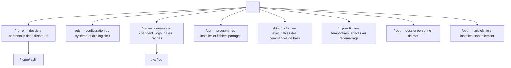
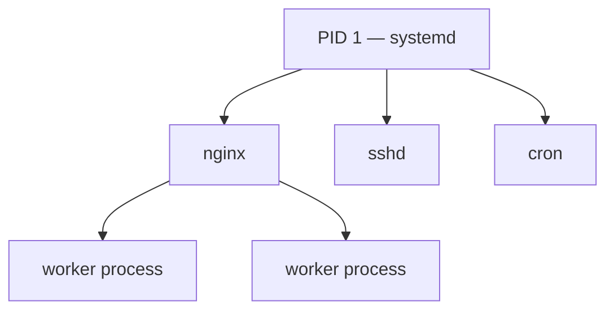

# Chapitre 2 — Les bases de Linux

**Niveau : Débutant**

---

## Introduction

Le chapitre 1 t'a donné le vocabulaire et les concepts. Ce chapitre te met les mains sur le clavier, dans un vrai terminal. Linux, présenté ici comme si tu ne l'avais jamais utilisé, va progressivement devenir un espace aussi familier que le bureau de ton système d'exploitation habituel — à la différence près qu'ici, tout se fait en texte, et que chaque action est explicite, traçable, reproductible.

Ce chapitre est le plus dense en commandes de tout le début du manuel : c'est volontaire. Une fois ces commandes maîtrisées, chaque chapitre suivant devient nettement plus rapide à assimiler, parce que tu ne buteras plus sur la syntaxe elle-même — seulement sur la logique propre à chaque nouvel outil.

## 🎯 Objectifs pédagogiques

À la fin de ce chapitre, tu sauras : utiliser un terminal en toute confiance ; lire et comprendre la syntaxe de n'importe quelle commande Linux, même une que tu n'as jamais vue, en t'appuyant sur `--help` et `man` ; naviguer dans l'arborescence de fichiers Linux avec des chemins absolus et relatifs ; créer, déplacer, copier, supprimer, lire et éditer des fichiers en ligne de commande ; comprendre et modifier les permissions d'un fichier au niveau du bit ; utiliser `sudo` à bon escient plutôt que par réflexe ; installer des logiciels avec `apt` en comprenant ce que le gestionnaire de paquets fait réellement ; observer et gérer les processus en cours ; consulter les logs système et gérer les services avec systemd ; configurer un pare-feu simple ; te connecter à distance et transférer des fichiers en toute sécurité ; télécharger des ressources depuis le réseau en ligne de commande.

## 📋 Prérequis

Chapitre 1 complété. Un terminal accessible : sous Linux ou macOS, le Terminal intégré suffit ; sous Windows, Git Bash ou WSL (Windows Subsystem for Linux). Aucun VPS n'est encore nécessaire — tout ce chapitre se pratique sur ta propre machine, le chapitre 4 branchera ensuite ces mêmes commandes sur un vrai serveur distant.

## Pourquoi ce chapitre est important

Un serveur Linux, rappelé au chapitre 1, n'a presque jamais d'interface graphique. Toute l'administration — de l'installation d'un logiciel à la lecture d'un log d'erreur en pleine nuit — passe par ces commandes. Ne pas les maîtriser, c'est rester dépendant de recherches en ligne pour la moindre opération, avec le risque de copier-coller une commande dangereuse sans en comprendre la portée. Ce chapitre construit l'autonomie : à la fin, tu ne chercheras plus "comment faire X sur Linux", tu sauras raisonner toi-même à partir de la logique commune à toutes les commandes Unix.

---

## Concepts fondamentaux

1. **Le terminal** — l'unique interface d'un serveur Linux typique.
2. **La commande** — toujours de la forme `commande [options] [arguments]`.
3. **L'arborescence** — une racine unique `/`, tout le reste en découle.
4. **Le fichier** — sous Linux, presque tout est représenté comme un fichier, y compris les périphériques.
5. **La permission** — trois niveaux (propriétaire/groupe/autres), trois droits (lecture/écriture/exécution).
6. **Le processus** — un programme en cours d'exécution, observable et contrôlable.
7. **Le paquet** — une unité logicielle installable via un gestionnaire centralisé (`apt`).
8. **Le réseau en ligne de commande** — se connecter, transférer, télécharger, sans jamais quitter le terminal.

---

## Explications détaillées

### 2.1 Le terminal et le shell

Le **terminal** (aussi appelé console) est une fenêtre où l'on tape des commandes en texte plutôt que de cliquer sur des icônes. Le programme qui interprète ce que tu tapes s'appelle un **shell**. Le plus répandu sur Linux est **bash** ; un autre, plus moderne, est **zsh**. Ce manuel utilise bash — celui présent par défaut sur Ubuntu Server.

> 💡 **Analogie** — Si une interface graphique est comme commander au restaurant en pointant du doigt une photo sur le menu, le terminal, c'est parler directement au chef en cuisine avec des instructions précises. Plus rapide et plus puissant une fois qu'on connaît le vocabulaire, mais il faut effectivement le connaître.

> 📌 **À retenir** — Une commande tapée dans le terminal s'exécute dès que tu appuies sur Entrée. Il n'y a pas de "bouton Annuler" une fois validée.

### 2.2 Anatomie d'une commande Linux

Presque toutes les commandes Linux suivent la même structure :

```
commande [options] [arguments]
```

- **La commande** : le nom du programme à exécuter.
- **Les options** (ou "flags") : modifient le comportement, précédées d'un tiret (`-l`) ou de deux (`--all`).
- **Les arguments** : sur quoi la commande doit agir.

**Exemple décomposé :** `ls -la /home/jaslin` → `ls` (la commande, lister un dossier) · `-la` (deux options combinées : `-l` format détaillé, `-a` fichiers cachés inclus) · `/home/jaslin` (l'argument, le dossier ciblé).

**Découvrir une commande inconnue :**
```bash
commande --help
man commande
```
`--help` affiche un résumé rapide ; `man` (manual) ouvre le manuel complet, navigable aux flèches, `q` pour quitter.

> ✅ **Bonne pratique** — Avant de copier-coller une commande trouvée sur Internet (surtout avec `sudo` ou `rm`), prends l'habitude de comprendre chaque mot qui la compose.

### 2.3 L'arborescence Linux

Contrairement à Windows (plusieurs racines : `C:`, `D:`...), Linux a **une seule racine**, notée `/`.


**Explication du diagramme :** chaque branche a un rôle prévisible et standardisé sur toute distribution Linux — une fois ce plan connu, on retrouve n'importe quel fichier système sans avoir à deviner. `/home` contient les dossiers personnels des utilisateurs normaux (jamais celui de root, qui a le sien à part en `/root`) ; `/var` (variable) contient tout ce qui change en cours de vie du système, les logs en premier lieu ; `/etc` contient la configuration, presque toujours en texte lisible.

**Chemins absolus et relatifs.** Un **chemin absolu** part toujours de la racine `/` (ex. `/home/jaslin/app`) et fonctionne depuis n'importe où. Un **chemin relatif** part de l'endroit courant dans le terminal. Deux raccourcis : `.` (dossier courant), `..` (dossier parent), `~` (dossier personnel).

> ❌ **Erreur fréquente** — Confondre chemin absolu et relatif est la cause n°1 de "command not found" ou "no such file or directory" chez un débutant. Face à cette erreur, le premier réflexe est `pwd` pour savoir où l'on se trouve réellement.

### 2.4 Naviguer et gérer les fichiers

#### `pwd`
**Description :** affiche le chemin absolu du dossier dans lequel on se trouve actuellement.
**Syntaxe :** `pwd`
**Décomposition mot par mot :** *print working directory*.
**Options :** aucune utilisée en pratique courante.
**Cas d'utilisation :** se repérer après plusieurs `cd`, avant d'exécuter une commande dont l'effet dépend du dossier courant.
**Exemple :**
```bash
pwd
```
**Résultat attendu :**
```
/home/jaslin
```
**Explication du résultat :** le chemin absolu complet du dossier courant, depuis la racine `/`.
**Erreurs possibles :** aucune en pratique — `pwd` ne peut pas échouer sur un système fonctionnel.
**Vérification :** comparer avec l'endroit où l'on pense être.
**Cas pratiques :** premier réflexe systématique quand on est perdu dans l'arborescence, ou avant un `rm -r` pour confirmer qu'on cible le bon dossier.

#### `ls`
**Description :** liste le contenu d'un dossier.
**Syntaxe :** `ls [options] [chemin]`
**Décomposition mot par mot :** *list*.
**Options principales :**

| Option | Effet |
|---|---|
| `-l` | Format détaillé (permissions, propriétaire, taille, date) |
| `-a` | Inclut les fichiers cachés (nom commençant par `.`) |
| `-h` | Tailles lisibles par un humain (`4.2K` plutôt que `4302`) |
| `-t` | Trie par date de modification |

**Cas d'utilisation :** vérifier le contenu d'un dossier avant d'agir dessus, vérifier qu'un fichier a bien été créé.
**Exemple :**
```bash
ls -lah /home/jaslin
```
**Résultat attendu :**
```
drwxr-xr-x  5 jaslin jaslin 4.0K Jul 27 10:00 app
-rw-r--r--  1 jaslin jaslin  220 Jul 27 09:58 .bashrc
```
**Explication du résultat :** chaque ligne représente un fichier ou dossier ; la première colonne encode le type et les permissions (détaillé en 2.6), suivie du propriétaire, du groupe, de la taille, de la date, et du nom.
**Erreurs possibles :** `ls: cannot access '...': No such file or directory` si le chemin donné n'existe pas — vérifier l'orthographe et le chemin avec `pwd`.
**Vérification :** le fichier ou dossier attendu apparaît dans la liste.
**Cas pratiques :** confirmer qu'un déploiement a bien copié les bons fichiers ; vérifier l'existence d'un fichier `.env` avant de lancer une application.

#### `cd`
**Description :** change le dossier courant.
**Syntaxe :** `cd [chemin]`
**Décomposition mot par mot :** *change directory*.
**Options :** aucune en usage courant ; `cd` seul ramène au dossier personnel.
**Cas d'utilisation :** se déplacer vers le dossier d'un projet avant d'exécuter des commandes qui y sont relatives (`npm install`, `git pull`...).
**Exemple :**
```bash
cd /home/jaslin/app
cd ..
cd ~
cd -
```
**Résultat attendu :** aucune sortie visible en cas de succès — l'invite de commande (prompt) reflète généralement le nouveau dossier.
**Explication du résultat :** l'absence de message est normale ; `cd -` revient spécifiquement au dossier précédent, pratique pour les allers-retours.
**Erreurs possibles :** `bash: cd: chemin: No such file or directory` si le dossier n'existe pas.
**Vérification :** `pwd` juste après pour confirmer le nouvel emplacement.
**Cas pratiques :** navigation quotidienne entre le dossier d'un projet et son sous-dossier de logs, par exemple.

#### `mkdir`
**Description :** crée un nouveau dossier.
**Syntaxe :** `mkdir [options] nom-du-dossier`
**Décomposition mot par mot :** *make directory*.
**Options principales :** `-p` crée aussi tous les dossiers parents manquants en une seule commande.
**Cas d'utilisation :** préparer une arborescence de projet avant d'y placer des fichiers.
**Exemple :**
```bash
mkdir -p app/backend/logs
```
**Résultat attendu :** aucune sortie en cas de succès.
**Explication du résultat :** les trois niveaux (`app`, `backend`, `logs`) sont créés d'un coup grâce à `-p`.
**Erreurs possibles :** sans `-p`, `mkdir: cannot create directory 'app/backend/logs': No such file or directory` si `app/` n'existe pas déjà.
**Vérification :** `ls` sur le chemin créé.
**Cas pratiques :** préparer un dossier de sauvegardes (`mkdir -p /var/backups/monapp`) avant le premier script de sauvegarde du chapitre 12.

#### `touch`
**Description :** crée un fichier vide, ou met à jour sa date de modification s'il existe déjà.
**Syntaxe :** `touch nom-du-fichier`
**Décomposition mot par mot :** littéralement "toucher" le fichier.
**Options :** rarement utilisées en usage courant.
**Cas d'utilisation :** créer rapidement un fichier vide à éditer ensuite.
**Exemple :**
```bash
touch test.txt
```
**Résultat attendu :** aucune sortie.
**Explication du résultat :** le fichier `test.txt` existe désormais, vide.
**Erreurs possibles :** `Permission denied` si le dossier courant n'appartient pas à l'utilisateur (voir 2.6).
**Vérification :** `ls -l test.txt`.
**Cas pratiques :** créer un fichier `.gitkeep` pour forcer Git à suivre un dossier vide (technique reprise au chapitre 3).

#### `cp`
**Description :** copie un fichier ou un dossier.
**Syntaxe :** `cp [options] source destination`
**Décomposition mot par mot :** *copy*.
**Options principales :** `-r` (récursif), obligatoire pour copier un dossier entier.
**Cas d'utilisation :** dupliquer un fichier de configuration avant de le modifier.
**Exemple :**
```bash
cp fichier.txt copie.txt
cp -r dossier/ copie-dossier/
```
**Résultat attendu :** aucune sortie en cas de succès.
**Explication du résultat :** `copie.txt` et `copie-dossier/` existent désormais, identiques à leur source au moment de la copie.
**Erreurs possibles :** `cp: -r not specified; omitting directory 'dossier/'` si `-r` est oublié pour un dossier.
**Vérification :** `ls` sur la destination.
**Cas pratiques :** `cp .env.example .env` avant de personnaliser un fichier de configuration — un schéma qui reviendra à chaque déploiement du chapitre 6.

#### `mv`
**Description :** déplace ou renomme un fichier ou un dossier (Linux ne distingue pas les deux opérations).
**Syntaxe :** `mv source destination`
**Décomposition mot par mot :** *move*.
**Options :** `-i` demande confirmation avant d'écraser un fichier existant.
**Cas d'utilisation :** réorganiser des fichiers, ou renommer un fichier.
**Exemple :**
```bash
mv fichier.txt /home/jaslin/archives/
mv ancien-nom.txt nouveau-nom.txt
```
**Résultat attendu :** aucune sortie en cas de succès.
**Explication du résultat :** le fichier n'existe plus à son ancien emplacement/nom, seulement au nouveau.
**Erreurs possibles :** écrase silencieusement un fichier de destination existant sans `-i` — perte de données possible.
**Vérification :** `ls` à la fois sur l'ancien et le nouvel emplacement.
**Cas pratiques :** archiver un ancien fichier de log avant rotation.

#### `rm`
**Description :** supprime un fichier ou un dossier, de façon définitive et immédiate.
**Syntaxe :** `rm [options] fichier`
**Décomposition mot par mot :** *remove*.
**Options principales :** `-r` (récursif, nécessaire pour un dossier), `-f` (force, sans confirmation même en cas d'erreur).
**Cas d'utilisation :** nettoyer des fichiers temporaires ou obsolètes.
**Exemple :**
```bash
rm fichier.txt
rm -r dossier-obsolete/
```
**Résultat attendu :** aucune sortie en cas de succès.
**Explication du résultat :** le fichier/dossier n'existe plus, sans passer par une corbeille récupérable.
**Erreurs possibles :** `rm: cannot remove 'x': Is a directory` sans `-r` sur un dossier ; **suppression irréversible** en cas de mauvais chemin.
**Vérification :** `ls` confirme l'absence du fichier.
**Cas pratiques :** nettoyage de fichiers de test après un laboratoire, purge d'anciennes sauvegardes en dehors de la fenêtre de rétention (chapitre 12).

> ⚠️ **Attention — la commande la plus dangereuse de ce chapitre.** `rm` ne déplace jamais vers une corbeille : la suppression est immédiate et définitive. `rm -rf` combinée à un chemin erroné (un espace de trop, une variable vide) peut détruire des parties critiques du système. **Quand tu ne peux pas ne pas la lire** : avant tout `rm -rf`, relis le chemin deux fois, et teste d'abord sans `-rf` sur un seul fichier ciblé si le moindre doute existe. Les versions récentes de `rm` refusent `rm -rf /` seul par sécurité — mais ce filet n'existe pas pour un chemin presque correct.

### 2.5 Lire et éditer des fichiers

#### `cat`
**Description :** affiche tout le contenu d'un fichier d'un coup.
**Syntaxe :** `cat fichier`
**Décomposition mot par mot :** *concatenate* (à l'origine, concaténer plusieurs fichiers).
**Options :** `-n` numérote les lignes.
**Cas d'utilisation :** lire rapidement un petit fichier.
**Exemple :**
```bash
cat .env.example
```
**Résultat attendu :** le contenu textuel intégral du fichier, affiché dans le terminal.
**Explication du résultat :** adapté aux petits fichiers ; sur un gros fichier, tout défile d'un coup, illisible.
**Erreurs possibles :** `cat: fichier: No such file or directory`.
**Vérification :** le contenu affiché correspond à ce qui est attendu.
**Cas pratiques :** vérifier rapidement le contenu d'un fichier de configuration court.

#### `less`
**Description :** affiche un fichier page par page, navigable.
**Syntaxe :** `less fichier`
**Décomposition mot par mot :** un jeu de mots historique sur la commande `more` qu'elle remplace ("less is more").
**Navigation :** flèches ou Espace pour avancer, `b` pour reculer, `/motclé` pour chercher (`n` pour l'occurrence suivante), `q` pour quitter.
**Cas d'utilisation :** lire un fichier volumineux (log, configuration longue) sans le faire défiler d'un bloc.
**Exemple :**
```bash
less /var/log/nginx/error.log
```
**Résultat attendu :** l'écran se remplit avec le début du fichier, navigable interactivement.
**Explication du résultat :** contrairement à `cat`, `less` charge progressivement, ne bloque jamais même sur un fichier énorme.
**Erreurs possibles :** aucune, sauf fichier inexistant.
**Vérification :** navigation fluide confirmée.
**Cas pratiques :** lecture d'un log d'erreur de plusieurs milliers de lignes.

#### `tail`
**Description :** affiche la fin d'un fichier, avec une option de suivi en temps réel.
**Syntaxe :** `tail [options] fichier`
**Décomposition mot par mot :** littéralement "la queue" du fichier.
**Options principales :** `-f` (*follow*, suit les nouvelles lignes en direct), `-n N` (affiche les N dernières lignes).
**Cas d'utilisation :** surveiller un log d'application en temps réel pendant qu'elle tourne.
**Exemple :**
```bash
tail -f /var/log/nginx/error.log
tail -n 50 fichier.txt
```
**Résultat attendu :** les dernières lignes du fichier, puis (avec `-f`) chaque nouvelle ligne ajoutée s'affiche en continu jusqu'à interruption (`Ctrl+C`).
**Explication du résultat :** `-f` ne rend pas la main tant qu'on n'interrompt pas manuellement — c'est le comportement voulu pour une surveillance continue.
**Erreurs possibles :** aucune, sauf fichier inexistant.
**Vérification :** de nouvelles lignes apparaissent à mesure que l'application écrit dans le fichier.
**Cas pratiques :** premier réflexe pour diagnostiquer un problème applicatif en direct — repris intensivement au chapitre 18.

#### `nano`
**Description :** éditeur de texte simple en plein écran, avec raccourcis affichés en permanence.
**Syntaxe :** `nano fichier`
**Raccourcis essentiels :** `Ctrl+O` puis Entrée (sauvegarder, *Write Out*), `Ctrl+X` (quitter), `Ctrl+K` (couper une ligne), `Ctrl+W` (chercher).
**Cas d'utilisation :** éditer un fichier de configuration directement sur le serveur.
**Exemple :**
```bash
nano .env
```
**Résultat attendu :** l'éditeur s'ouvre en plein écran, contenu du fichier visible et modifiable.
**Explication du résultat :** les raccourcis disponibles restent affichés en bas de l'écran en permanence, contrairement à `vim`.
**Erreurs possibles :** `Error writing ...: Permission denied` si le fichier appartient à un autre utilisateur — rouvrir avec `sudo nano`.
**Vérification :** rouvrir le fichier avec `cat` pour confirmer la modification sauvegardée.
**Cas pratiques :** éditeur par défaut de tout ce manuel, pour sa simplicité.

#### `vim`
**Description :** éditeur de texte avancé, à modes, très puissant mais avec une courbe d'apprentissage marquée.
**Syntaxe :** `vim fichier`
**Modes essentiels :** `i` (passer en mode insertion), `Échap` (revenir en mode normal), `:wq` + Entrée (sauvegarder et quitter), `:q!` + Entrée (quitter sans sauvegarder).
**Cas d'utilisation :** seul éditeur parfois préinstallé sur un serveur minimal, ou pour qui en maîtrise la puissance.
**Exemple :**
```bash
vim fichier.txt
```
**Résultat attendu :** l'éditeur s'ouvre en mode normal (lecture), sans raccourcis affichés à l'écran.
**Explication du résultat :** contrairement à `nano`, aucune aide visuelle par défaut — la maîtrise s'acquiert par la pratique.
**Erreurs possibles :** rester "coincé" dans l'éditeur, ne sachant pas en sortir.
**Vérification :** `:wq` ramène au prompt du terminal.
**Cas pratiques :** dépannage sur un serveur minimal où `nano` n'est pas installé.

> ❌ **Erreur fréquente et célèbre chez tous les débutants** — se retrouver coincé dans `vim`. Solution systématique : `Échap` puis `:q!` puis Entrée.

#### `grep`
**Description :** cherche un motif de texte dans le contenu d'un ou plusieurs fichiers.
**Syntaxe :** `grep [options] "motif" fichier`
**Décomposition mot par mot :** *global regular expression print*.
**Options principales :** `-r` (récursif dans un dossier), `-i` (ignore la casse), `-n` (affiche le numéro de ligne).
**Cas d'utilisation :** retrouver instantanément où un mot-clé apparaît dans un projet entier.
**Exemple :**
```bash
grep -i "error" /var/log/nginx/error.log
grep -rn "DATABASE_URL" ~/app/backend/
```
**Résultat attendu :**
```
config.ts:12:  DATABASE_URL: process.env.DATABASE_URL,
```
**Explication du résultat :** le nom du fichier, le numéro de ligne, et la ligne complète contenant le motif recherché.
**Erreurs possibles :** aucune sortie si le motif n'est trouvé nulle part — ce n'est pas une erreur, c'est une absence de résultat.
**Vérification :** le nombre de résultats correspond à ce qu'on attend intuitivement.
**Cas pratiques :** retrouver toutes les occurrences d'une variable d'environnement avant de la renommer.

#### `find`
**Description :** cherche des fichiers par leur nom, type, date ou autres attributs.
**Syntaxe :** `find chemin -name "motif"`
**Décomposition mot par mot :** *find*.
**Options principales :** `-name` (par nom), `-type d`/`-type f` (dossier/fichier), `-mtime` (par date de modification).
**Cas d'utilisation :** localiser tous les fichiers d'un certain type dans une arborescence.
**Exemple :**
```bash
find /home/jaslin/app -name "*.env"
find . -type d -name "node_modules"
```
**Résultat attendu :** la liste des chemins complets correspondant au critère.
**Explication du résultat :** contrairement à `grep`, `find` cherche des fichiers **par leurs attributs**, pas dans leur contenu.
**Erreurs possibles :** `find: 'chemin': No such file or directory` si le chemin de départ n'existe pas.
**Vérification :** les fichiers listés existent réellement (`ls` sur l'un d'eux).
**Cas pratiques :** retrouver tous les dossiers `node_modules` d'un monorepo avant un nettoyage global.

### 2.6 Permissions : `chmod`, `chown`, `sudo`

**Lire les permissions d'un fichier :**
```bash
ls -l fichier.txt
```
```
-rw-r--r-- 1 jaslin jaslin 220 Jul 27 09:58 fichier.txt
```
Le premier bloc se lit en 4 groupes : type (`-` fichier, `d` dossier, `l` lien symbolique), puis trois groupes de 3 caractères (**r**ead, **w**rite, e**x**ecute) pour le propriétaire, le groupe, et les autres.

> 💡 **Analogie** — Trois niveaux d'accès à un document dans un bureau : toi (le propriétaire), ton équipe (le groupe), et n'importe quel visiteur (les autres).

#### `chmod`
**Description :** modifie les permissions d'un fichier ou dossier.
**Syntaxe :** `chmod [permissions] fichier`
**Décomposition mot par mot :** *change mode*.
**Notation numérique (la plus utilisée) :** chaque droit vaut un chiffre (r=4, w=2, x=1), additionné par groupe.

| Chiffre | Signification |
|---|---|
| 7 | rwx (tout) |
| 6 | rw- (lecture + écriture) |
| 5 | r-x (lecture + exécution) |
| 4 | r-- (lecture seule) |
| 0 | --- (aucun droit) |

**Cas d'utilisation :** rendre un script exécutable, restreindre l'accès à un fichier sensible.
**Exemple :**
```bash
chmod 644 fichier.txt
chmod 755 script.sh
chmod 600 cle-privee
```
**Résultat attendu :** aucune sortie ; `ls -l` confirme le changement.
**Explication du résultat :** `644` = propriétaire rw-, groupe r--, autres r-- (standard pour un fichier) ; `755` = propriétaire rwx, groupe et autres r-x (standard pour un exécutable) ; `600` = seul le propriétaire peut lire/écrire (standard pour un secret).
**Erreurs possibles :** `chmod: changing permissions of 'x': Operation not permitted` si on n'est ni le propriétaire ni root.
**Vérification :** `ls -l` sur le fichier modifié.
**Cas pratiques :** `chmod 600` sur une clé privée SSH (obligatoire, chapitre 4) ; `chmod +x` sur un script de déploiement.

> ⚠️ **Attention** — `chmod 777` (tous les droits pour tout le monde) est une faille de sécurité directe. Ne jamais l'utiliser par réflexe pour "que ça marche" — toujours se demander quel est le droit réellement nécessaire.

#### `chown`
**Description :** change le propriétaire (et éventuellement le groupe) d'un fichier.
**Syntaxe :** `chown utilisateur:groupe fichier`
**Décomposition mot par mot :** *change owner*.
**Options principales :** `-R` (récursif, tout un dossier).
**Cas d'utilisation :** rendre un fichier créé par root de nouveau modifiable par l'utilisateur normal.
**Exemple :**
```bash
sudo chown jaslin:jaslin app.js
sudo chown -R www-data:www-data /var/www/monsite
```
**Résultat attendu :** aucune sortie ; `ls -l` confirme le nouveau propriétaire.
**Explication du résultat :** le fichier appartient désormais à l'utilisateur et au groupe indiqués.
**Erreurs possibles :** `Operation not permitted` sans `sudo`, puisque seul root peut changer le propriétaire d'un fichier qui ne lui appartient pas.
**Vérification :** `ls -l`.
**Cas pratiques :** cas fréquent — un fichier créé accidentellement via `sudo` devient inaccessible en écriture à l'utilisateur normal, `chown` le restaure.

#### `sudo`
**Description :** exécute une seule commande avec les droits complets de root.
**Syntaxe :** `sudo commande`
**Décomposition mot par mot :** *superuser do*.
**Options :** `-u utilisateur` (exécute en tant qu'un autre utilisateur que root).
**Cas d'utilisation :** toute action nécessitant des droits administrateur (installation de paquets, modification de fichiers système, gestion de services).
**Exemple :**
```bash
sudo apt update
sudo systemctl restart nginx
```
**Résultat attendu :** demande le mot de passe de l'utilisateur courant (pas celui de root), puis exécute la commande avec les pleins droits.
**Explication du résultat :** `sudo` n'ouvre pas une session root permanente — il élève juste la commande qui suit, une seule fois.
**Erreurs possibles :** `user is not in the sudoers file` si l'utilisateur n'a pas été ajouté au groupe `sudo` (chapitre 4).
**Vérification :** `sudo whoami` doit répondre `root`.
**Cas pratiques :** quasiment toutes les commandes d'installation et de configuration système de ce manuel.

> 📌 **À retenir** — `sudo` oblige à réfléchir à chaque commande sensible individuellement, plutôt que d'opérer en permanence avec des droits maximaux. Se demander, avant chaque `sudo` : "cette action a-t-elle réellement besoin des droits administrateur ?"

### 2.7 Installer des logiciels avec `apt`

**Description :** APT (*Advanced Package Tool*) est le gestionnaire de paquets standard d'Ubuntu/Debian : il télécharge, installe, met à jour et supprime des logiciels depuis des dépôts officiels vérifiés, en gérant automatiquement les dépendances.

> 💡 **Analogie** — Un magasin d'applications, comme le Play Store, mais en ligne de commande, pour des logiciels système.

**Ce qui se passe réellement en arrière-plan :** `apt` consulte une liste locale de paquets disponibles (mise à jour par `update`), résout les dépendances nécessaires (un paquet peut en exiger d'autres), télécharge les fichiers `.deb` correspondants depuis un dépôt distant, vérifie leur signature cryptographique (garantissant qu'ils n'ont pas été altérés), puis les installe.

**Commandes principales :**
```bash
sudo apt update              # rafraîchit la liste des paquets disponibles (ne les installe pas)
sudo apt upgrade             # met à jour tous les paquets déjà installés
sudo apt install nginx       # installe un paquet précis
sudo apt remove nginx        # désinstalle (garde la configuration)
sudo apt purge nginx         # désinstalle ET supprime la configuration
sudo apt search motclé       # cherche un paquet par mot-clé
sudo apt list --installed    # liste tout ce qui est installé
```
**Résultat attendu (`apt install`) :** un résumé des paquets à installer (avec dépendances), une demande de confirmation, puis la progression du téléchargement et de l'installation.
**Explication du résultat :** `apt` affiche toujours ce qu'il s'apprête à faire avant de le faire — une confirmation explicite (`y`) est nécessaire sauf avec `-y`.
**Erreurs possibles :** `Unable to locate package` si `apt update` n'a pas été fait récemment, ou si le nom du paquet est incorrect.
**Vérification :** `nginx -v` (ou équivalent) après installation, ou `dpkg -l | grep nginx`.
**Cas pratiques :** installation de chaque logiciel du chapitre 5, mises à jour de sécurité du chapitre 17.

> ❌ **Erreur fréquente** — Lancer `apt install` sans avoir fait `apt update` récemment : le paquet installé peut être obsolète, ou l'installation peut échouer. **Toujours `update` avant un `install` important.**

### 2.8 Observer les processus

#### `ps`
**Description :** liste les processus en cours à un instant donné.
**Syntaxe :** `ps [options]`
**Décomposition mot par mot :** *process status*.
**Options principales :** `aux` (tous les processus, tous utilisateurs, format détaillé, y compris sans terminal attaché).
**Cas d'utilisation :** identifier le PID d'un processus précis.
**Exemple :**
```bash
ps aux | grep node
```
**Résultat attendu :**
```
jaslin   12345  0.5  2.1  912345 84320 ?  Sl   10:00   0:15 node dist/server.js
```
**Explication du résultat :** utilisateur propriétaire, PID, %CPU, %RAM, puis la commande exacte lancée. Le symbole `|` (pipe) envoie la sortie de `ps aux` en entrée de `grep`, qui filtre les lignes contenant "node".
**Erreurs possibles :** aucune sortie si aucun processus ne correspond au filtre — normal si le processus n'est pas lancé.
**Vérification :** le PID retourné correspond bien au processus attendu.
**Cas pratiques :** trouver le PID d'un processus qui bloque un port avant de le terminer.

#### `top` / `htop`
**Description :** affichent en temps réel la liste des processus, triés par consommation de ressources.
**Syntaxe :** `top` ou `htop`
**Cas d'utilisation :** premier réflexe face à un serveur perçu comme lent.
**Exemple :**
```bash
htop
```
**Résultat attendu :** un tableau de bord interactif, actualisé en continu, montrant CPU/RAM par processus.
**Explication du résultat :** `htop` (à installer via `apt install htop`) est une version colorée et navigable de `top`, plus lisible pour un débutant.
**Erreurs possibles :** `htop: command not found` si non installé.
**Vérification :** `q` pour quitter, retour normal au prompt.
**Cas pratiques :** diagnostic de performance, repris en profondeur au chapitre 14.

### 2.9 Services et logs système

#### `systemctl`
**Description :** gère les services système (démarrer, arrêter, activer au démarrage, consulter l'état).
**Syntaxe :** `systemctl [action] service`
**Cas d'utilisation :** contrôler nginx, MySQL, ou tout autre service géré par systemd.
**Exemple :**
```bash
sudo systemctl status nginx
sudo systemctl restart nginx
sudo systemctl enable nginx
```
**Résultat attendu (`status`) :**
```
● nginx.service - A high performance web server
     Loaded: loaded (/lib/systemd/system/nginx.service; enabled)
     Active: active (running) since ...
```
**Explication du résultat :** `Active: active (running)` confirme que le service tourne ; `enabled` confirme qu'il démarrera automatiquement au prochain boot.
**Erreurs possibles :** `Unit nginx.service could not be found` si le service n'est pas installé ou mal nommé.
**Vérification :** `systemctl status` après chaque action pour confirmer l'état réel.
**Cas pratiques :** `restart` interrompt brièvement le service ; `reload` (quand supporté) applique une nouvelle configuration sans interruption — préférable en production, détaillé au chapitre 9.


**Explication du diagramme :** systemd (PID 1, le tout premier processus lancé au démarrage) est le parent de tous les services système, eux-mêmes parents de leurs propres processus enfants (les workers nginx, par exemple).

#### `journalctl`
**Description :** consulte le journal centralisé de systemd, regroupant les messages de tous les services gérés.
**Syntaxe :** `journalctl [options]`
**Options principales :** `-u service` (filtre par service), `-f` (temps réel), `--since`, `-p err` (niveau de gravité minimum).
**Cas d'utilisation :** diagnostiquer pourquoi un service a échoué à démarrer.
**Exemple :**
```bash
journalctl -u nginx -f
journalctl -p err --since today
```
**Résultat attendu :** un flux chronologique d'entrées de log, horodatées, filtrées selon les options choisies.
**Explication du résultat :** chaque ligne indique la date, le service source, et le message — un point d'entrée unique plutôt que de deviner dans quel fichier chercher.
**Erreurs possibles :** liste vide si le filtre est trop restrictif ou la période trop courte.
**Vérification :** les entrées affichées correspondent bien à la période et au service recherchés.
**Cas pratiques :** point de départ systématique de tout dépannage de service système, développé au chapitre 18.

### 2.10 Réseau et sécurité en ligne de commande

#### `ufw`
**Description :** interface simplifiée pour configurer le pare-feu Linux.
**Syntaxe :** `ufw [action] [règle]`
**Décomposition mot par mot :** *Uncomplicated Firewall*.
**Cas d'utilisation :** n'autoriser que les ports strictement nécessaires sur un serveur.
**Exemple :**
```bash
sudo ufw allow OpenSSH
sudo ufw allow 80
sudo ufw enable
sudo ufw status verbose
```
**Résultat attendu (`status verbose`) :**
```
Status: active
22/tcp (OpenSSH)  ALLOW IN  Anywhere
80/tcp            ALLOW IN  Anywhere
```
**Explication du résultat :** chaque ligne montre un port autorisé et sa provenance ; tout ce qui n'est pas listé est refusé par défaut.
**Erreurs possibles :** perte d'accès SSH si `enable` est exécuté avant d'avoir autorisé le port 22.
**Vérification :** `ufw status` confirme les règles actives ; test d'une nouvelle connexion SSH dans un second terminal avant de fermer le premier.
**Cas pratiques :** configuration de base de tout serveur du chapitre 4.

> ⚠️ **Attention, piège classique et potentiellement bloquant** — Activer `ufw` sans avoir autorisé SSH au préalable coupe instantanément l'accès au serveur, y compris le sien. Toujours `allow OpenSSH` **avant** `enable`, jamais après.

#### `ssh`
**Description :** se connecte à distance, en ligne de commande, à un serveur Linux, de façon chiffrée.
**Syntaxe :** `ssh utilisateur@adresse-ip`
**Cas d'utilisation :** toute administration à distance d'un serveur.
**Exemple :**
```bash
ssh jaslin@38.242.137.71
```
**Résultat attendu :** première connexion, demande de confirmation de l'empreinte du serveur ; ensuite, authentification (mot de passe ou clé) puis ouverture d'une session shell distante.
**Explication du résultat :** l'empreinte confirmée est mémorisée pour détecter une usurpation future du serveur.
**Erreurs possibles :** `Connection refused` (service SSH arrêté), `Connection timed out` (pare-feu), `Permission denied` (authentification échouée) — développés en détail au chapitre 18.
**Vérification :** l'invite de commande change pour refléter la session distante (`jaslin@nomserveur:~$`).
**Cas pratiques :** point d'entrée de toute la Partie II du manuel.

#### `scp` / `rsync`
**Description :** transfèrent des fichiers entre machine locale et machine distante.
**Syntaxe :** `scp source destination` · `rsync -avz source/ destination/`
**Décomposition mot par mot :** *secure copy* · *remote sync*.
**Options principales (`rsync`) :** `-a` (archive, préserve permissions/dates), `-v` (verbeux), `-z` (compression).
**Cas d'utilisation :** transférer un build frontend vers le serveur, synchroniser un dossier de sauvegardes.
**Exemple :**
```bash
scp fichier-local.txt jaslin@IP:/home/jaslin/
rsync -avz dist/ jaslin@IP:~/sites/monapp/
```
**Résultat attendu :** progression du transfert affichée, puis retour au prompt.
**Explication du résultat :** `rsync`, contrairement à `scp`, ne retransfère que ce qui a réellement changé depuis la dernière synchronisation — bien plus rapide pour des mises à jour répétées.
**Erreurs possibles :** `Permission denied` si les droits du dossier de destination sont insuffisants.
**Vérification :** `ls` sur le serveur distant après transfert.
**Cas pratiques :** déploiement de frontends statiques (chapitre 6), synchronisation de sauvegardes (chapitre 12).

#### `curl` / `wget`
**Description :** interrogent ou téléchargent des ressources réseau en ligne de commande.
**Syntaxe :** `curl [options] url` · `wget url`
**Options principales (`curl`) :** `-I` (en-têtes seulement), `-O` (sauvegarde dans un fichier).
**Cas d'utilisation :** vérifier qu'un serveur répond correctement, télécharger un script d'installation.
**Exemple :**
```bash
curl -I https://exemple.com
wget https://exemple.com/fichier.zip
```
**Résultat attendu (`curl -I`) :**
```
HTTP/2 200
content-type: text/html
```
**Explication du résultat :** le code de statut HTTP (ici `200`, succès) et les en-têtes de la réponse, sans le corps complet.
**Erreurs possibles :** `curl: (7) Failed to connect` si le serveur est injoignable.
**Vérification :** le code de statut retourné correspond à ce qui est attendu.
**Cas pratiques :** vérification post-déploiement systématique (`curl -I` sur l'URL de production), réflexe central du chapitre 18.

---

## Analogies clés de ce chapitre

| Notion | Analogie |
|---|---|
| Terminal vs interface graphique | Parler au chef en cuisine vs pointer une photo sur le menu |
| `rm` sans corbeille | Une suppression au feu, pas au bac à recyclage |
| `sudo` | Emprunter le passe-partout du concierge, une porte à la fois |
| `apt` | Le magasin d'applications du système |

---

## Étude de cas

**Contexte.** Tu rejoins un projet dont le serveur affiche une erreur 500 depuis ce matin, sans autre information. Le fondateur n'a aucun accès SSH lui-même — c'est entièrement à toi de jouer.

**Démarche, en s'appuyant uniquement sur ce chapitre :** connexion (`ssh`), puis observation immédiate de l'état du service applicatif — s'il tourne via systemd, `systemctl status monapp` et `journalctl -u monapp -n 50` donnent en quelques secondes la dernière erreur survenue. Si le message évoque un fichier manquant, `ls -l` sur le chemin concerné confirme ou infirme l'hypothèse. Si un problème de permission apparaît dans les logs, `ls -l` puis `chown`/`chmod` corrigent la cause exacte, jamais une supposition. Chaque étape de cette démarche mobilise une commande de ce chapitre, jamais une commande devinée.

---

## Bonnes pratiques (récapitulatif du chapitre)

- Toujours vérifier sa position (`pwd`) avant une opération destructive.
- Toujours relire un `rm -rf` deux fois avant de valider.
- Ne jamais utiliser `chmod 777` par réflexe.
- Réserver `sudo` à l'action précise qui le nécessite, jamais comme habitude de session.
- Toujours `apt update` avant un `apt install` important.
- Toujours autoriser SSH dans `ufw` avant d'activer le pare-feu.
- Utiliser `less`/`tail -f` plutôt que `cat` sur un fichier dont la taille est inconnue.

---

## Erreurs fréquentes (récapitulatif du chapitre)

| Erreur | Pourquoi elle arrive | Conséquence |
|---|---|---|
| Confondre chemin absolu et relatif | Manque de réflexe `pwd` | "No such file or directory" à répétition |
| `rm -rf` sur un mauvais chemin | Chemin non revérifié avant validation | Perte de données irréversible |
| `chmod 777` par réflexe | Vouloir "que ça marche" rapidement | Faille de sécurité |
| Rester coincé dans `vim` | Modes non compris | Blocage temporaire, résolu par `Échap` puis `:q!` |
| `ufw enable` sans autoriser SSH avant | Ordre des étapes non respecté | Perte d'accès au serveur |

---

## Captures d'écran à réaliser

> 📸 **Capture 3**
> **Logiciel :** Terminal (Git Bash, WSL, ou Terminal Linux/Mac)
> **Pourquoi cette capture est utile :** documenter l'aspect concret d'une session terminal pour un lecteur qui n'en a jamais vu.
> **Page/écran concerné :** après exécution de `ls -la` dans un dossier personnel
> **Niveau de zoom conseillé :** 100 %, police de taille lisible (14pt minimum)
> **Montrer :** l'invite de commande (prompt), la commande tapée, la sortie complète
> **Entourer :** la colonne des permissions en début de ligne
> **Flouter/masquer :** le nom d'utilisateur ou le nom de machine si jugé personnel

---

## Laboratoire pratique n°1 — Manipulation de fichiers et permissions

**Objectifs :** maîtriser la création, l'édition, la copie et la suppression de fichiers, ainsi que la lecture et la modification des permissions.
**Prérequis :** un terminal accessible (2.1).
**Matériel nécessaire :** un ordinateur avec terminal.

**Étapes :**
1. Crée un dossier `labo-linux` avec un sous-dossier `logs` en une seule commande (`mkdir -p`).
2. Crée un fichier `test.txt` dedans (`touch`), écris-y du texte avec `nano`, sauvegarde.
3. Affiche son contenu avec `cat`.
4. Copie ce fichier en `test-copie.txt`, puis renomme la copie en `archive.txt` (`mv`).
5. Affiche les permissions du fichier avec `ls -l`, puis retire le droit d'écriture pour le groupe et les autres (`chmod 644`).
6. Cherche le mot que tu as écrit dans `test.txt` avec `grep`.
7. Supprime tout le dossier `labo-linux` avec `rm -r`.

**Résultat attendu :** chaque commande s'exécute sans erreur, le contenu et les permissions correspondent aux attentes à chaque étape.
**Vérifications :** `ls -l` après chaque modification pour confirmer visuellement le changement.
**Erreurs fréquentes :** oublier `-p` à l'étape 1 (`mkdir` échoue sur `logs` si `labo-linux` n'existe pas encore) ; oublier `-r` à l'étape 7 (`rm` refuse de supprimer un dossier sans lui).
**Solutions :** relire le message d'erreur exact, qui indique presque toujours l'option manquante.

## Laboratoire pratique n°2 — Observation de processus et services

**Objectifs :** identifier un processus en cours et consulter l'état d'un service.
**Prérequis :** Laboratoire 1 complété.
**Matériel nécessaire :** un ordinateur avec terminal (Linux/Mac natif, ou WSL pour un accès complet à `systemctl`).

**Étapes :**
1. Lance `htop` (l'installer avec `sudo apt install htop` si nécessaire, sous Linux/WSL).
2. Identifie le processus qui consomme le plus de CPU à cet instant.
3. Quitte `htop` (`q`), puis retrouve ce même processus avec `ps aux | grep motclé`.
4. Si `systemctl` est disponible, vérifie l'état d'un service connu (`systemctl status ssh`, par exemple).
5. Consulte ses dernières entrées de log avec `journalctl -u ssh -n 20`.

**Résultat attendu :** le même processus identifié par les deux méthodes (`htop` et `ps aux`), un service dont l'état ("active (running)") est confirmé par deux commandes différentes.
**Vérifications :** cohérence entre les informations obtenues par `htop`/`ps` et par `systemctl status`.
**Erreurs fréquentes :** chercher un processus par un nom trop générique avec `grep`, obtenant trop de résultats (y compris `grep` lui-même, qui apparaît dans sa propre recherche !).
**Solutions :** affiner le motif de recherche, ou utiliser `pgrep motclé` comme alternative plus ciblée.

## Laboratoire pratique n°3 — Transfert de fichiers entre deux machines

**Objectifs :** utiliser `scp` ou `rsync` pour transférer un fichier réel.
**Prérequis :** un second accès (un autre compte, ou anticiper le VPS du chapitre 4 si déjà disponible) ; à défaut, ce laboratoire peut se limiter à `rsync` en local entre deux dossiers.
**Matériel nécessaire :** deux emplacements accessibles (deux dossiers locaux à défaut d'un vrai second serveur).

**Étapes :**
1. Crée un fichier de test avec un peu de contenu.
2. Copie-le vers un second emplacement avec `rsync -avz`.
3. Modifie légèrement le fichier source, relance le même `rsync`, observe que seule la modification est retransmise (option `-v` rend ceci visible).
4. Si un second serveur est disponible, recommence l'opération via SSH (`rsync -avz fichier.txt utilisateur@IP:/chemin/`).

**Résultat attendu :** le fichier de destination reflète exactement le contenu du fichier source après chaque synchronisation.
**Vérifications :** comparer le contenu des deux fichiers (`diff fichier-source fichier-destination` ne doit rien afficher s'ils sont identiques).
**Erreurs fréquentes :** oublier le `/` final après un nom de dossier source avec `rsync`, qui change la sémantique (copie le dossier lui-même plutôt que son contenu).
**Solutions :** toujours terminer un chemin de dossier source par `/` quand on veut synchroniser son contenu, pas le dossier en tant que tel.

---

## Exercices

1. Sans relire le chapitre, écris de mémoire la structure générale d'une commande Linux.
2. Explique la différence entre `cp` et `mv` avec un exemple concret pour chacune.
3. Un fichier affiche `-rwxr--r--`. Décris précisément qui peut faire quoi sur ce fichier.
4. Pourquoi `sudo ufw enable` avant `sudo ufw allow OpenSSH` est-il risqué ? Reformule avec tes propres mots.
5. Donne un exemple où `less` est clairement préférable à `cat`, et un exemple où l'inverse est vrai.
6. Quelle commande utiliserais-tu pour savoir si un service nginx est actuellement démarré, sans consulter ses logs ?

---

## Quiz

**Question 1.** Que fait l'option `-p` de `mkdir` ?
a) Rend le dossier privé
b) Crée aussi les dossiers parents manquants
c) Affiche une confirmation avant création
d) Protège le dossier contre la suppression

**Question 2.** `chmod 600 cle-privee` donne quels droits ?
a) Lecture/écriture pour tout le monde
b) Lecture/écriture pour le seul propriétaire, rien pour les autres
c) Exécution pour le propriétaire uniquement
d) Aucun droit pour personne, y compris le propriétaire

**Question 3.** Pourquoi `sudo` ne doit-il pas être utilisé en permanence ?
a) Il ralentit les commandes
b) Il augmente les conséquences d'une erreur de frappe
c) Il n'est disponible que sur certains systèmes
d) Il désactive le pare-feu

**Question 4.** Quelle commande affiche les nouvelles lignes d'un fichier de log en temps réel ?
a) `cat fichier.log`
b) `tail -f fichier.log`
c) `ls -l fichier.log`
d) `find fichier.log`

**Question 5.** Que se passe-t-il si `sudo ufw enable` est exécuté sans avoir autorisé SSH au préalable ?
a) Rien de particulier
b) Le pare-feu refuse de s'activer
c) La connexion SSH en cours (et toute future) peut être coupée
d) SSH est automatiquement autorisé par défaut

> 🔑 **Corrigé** — 1: b · 2: b · 3: b · 4: b · 5: c

---

## 📝 Résumé du chapitre

- Le terminal exécute des commandes de la forme `commande [options] [arguments]` ; `--help` et `man` documentent n'importe quelle commande inconnue.
- L'arborescence Linux part d'une racine unique `/` ; `pwd` indique toujours où l'on se trouve.
- `ls`, `cd`, `mkdir`, `cp`, `mv`, `rm` couvrent l'essentiel de la gestion de fichiers ; `rm -rf` est irréversible.
- `cat`/`less` lisent, `tail -f` suit en temps réel, `nano` édite simplement, `grep` cherche dans le contenu, `find` cherche des fichiers par nom.
- Les permissions reposent sur trois niveaux et trois droits ; `sudo` élève ponctuellement une seule commande, jamais une session entière.
- `apt` installe et met à jour les logiciels système, toujours après un `update`.
- `ps`, `htop` montrent les processus ; `systemctl` gère les services, `journalctl` centralise leurs logs.
- `ufw` configure un pare-feu simple — toujours autoriser SSH avant de l'activer.
- `ssh` connecte à distance, `scp`/`rsync` transfèrent des fichiers, `curl`/`wget` interrogent le réseau.

## ✅ Checklist avant de passer au chapitre 3

- [ ] Je sais lire n'importe quelle commande de ce chapitre et identifier la commande, les options et les arguments.
- [ ] Je sais naviguer et gérer des fichiers sans hésiter.
- [ ] Je sais lire les permissions d'un fichier et les modifier avec `chmod`.
- [ ] Je comprends pourquoi `sudo ufw enable` sans autoriser SSH avant est dangereux.
- [ ] J'ai réalisé les trois laboratoires et complété les exercices.
- [ ] J'ai obtenu au moins 4/5 au quiz.

---

## Glossaire du chapitre

**Shell**
Définition simple : le programme qui interprète les commandes tapées dans un terminal.
Définition technique : un interpréteur de commandes (bash, zsh...) offrant un langage de script et une interface en ligne de commande vers le système d'exploitation.
Exemple concret : bash, le shell par défaut d'Ubuntu Server.
Voir : Chapitre 2, section 2.1.

**Chemin absolu / relatif**
Définition simple : l'adresse complète d'un fichier depuis la racine, ou son adresse depuis l'endroit où l'on se trouve.
Définition technique : une séquence de noms de dossiers séparés par `/`, débutant à la racine (absolu) ou à un dossier courant implicite (relatif).
Exemple concret : `/home/jaslin/app` (absolu) vs `app` (relatif, si déjà dans `/home/jaslin`).
Voir : Chapitre 2, section 2.3.

**Permission**
Définition simple : ce qu'un utilisateur a le droit de faire sur un fichier.
Définition technique : un ensemble de droits (lecture, écriture, exécution) attribués séparément au propriétaire, au groupe, et aux autres utilisateurs.
Exemple concret : `chmod 644` sur un fichier de configuration.
Voir : Chapitre 2, section 2.6.

**Paquet**
Définition simple : une unité de logiciel installable en une commande.
Définition technique : une archive `.deb` contenant un programme, ses métadonnées et ses dépendances, distribuée via un dépôt APT.
Exemple concret : le paquet `nginx`.
Voir : Chapitre 2, section 2.7.

---

## ❓ FAQ

**Faut-il mémoriser toutes ces commandes par cœur ?**
Non. L'objectif est de comprendre la logique commune (commande/options/arguments, `--help`/`man`) pour pouvoir déchiffrer n'importe quelle commande rencontrée plus tard, même sans l'avoir mémorisée à l'avance.

**Pourquoi Linux et pas Windows pour un serveur ?**
Ce n'est pas une obligation technique absolue, mais Linux domine très largement l'hébergement web : gratuit, léger en ressources, écosystème aligné avec la quasi-totalité des outils de ce manuel, immense communauté de documentation.

**J'ai fait une erreur avec `rm` et perdu un fichier important, que faire ?**
Sur un vrai serveur en production : restaurer depuis une sauvegarde (chapitre 12 et 16). La bonne pratique n'est pas d'apprendre à récupérer après coup, mais de vérifier avant d'exécuter.

---

## Références officielles

- GNU Coreutils Manual — [gnu.org/software/coreutils/manual](https://www.gnu.org/software/coreutils/manual/)
- Ubuntu Server Documentation — [ubuntu.com/server/docs](https://ubuntu.com/server/docs)
- APT User's Guide (Debian) — [debian.org/doc/manuals/apt-guide](https://www.debian.org/doc/manuals/apt-guide/)
- systemd System and Service Manager — [freedesktop.org/wiki/Software/systemd](https://www.freedesktop.org/wiki/Software/systemd/)
- OpenSSH Manual Pages — [man.openbsd.org/ssh](https://man.openbsd.org/ssh)

---

## Conclusion

Ce chapitre transforme un terminal vide en un outil de travail complet. Tu sais désormais naviguer, manipuler des fichiers, comprendre et modifier des permissions, observer des processus, gérer des services, et communiquer en réseau — tout ce dont un vrai serveur, sans interface graphique, a besoin pour être administré. Le chapitre 3 ajoute la dernière brique fondationnelle avant de toucher à un vrai VPS : Git, l'outil qui va faire voyager ton code depuis ta machine jusqu'au serveur que tu prépareras au chapitre 4.

---

⬅️ [Chapitre 1 — Comprendre un serveur](01-comprendre-un-serveur.md) · ➡️ **Suite : [Chapitre 3 — Git et le contrôle de version](03-git.md)**
