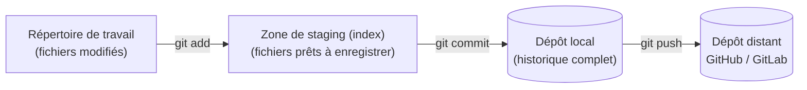
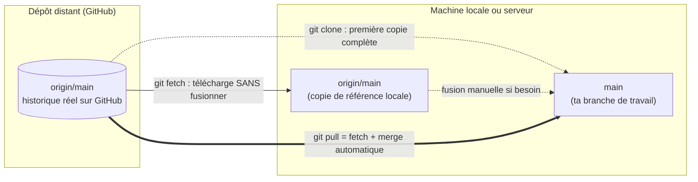
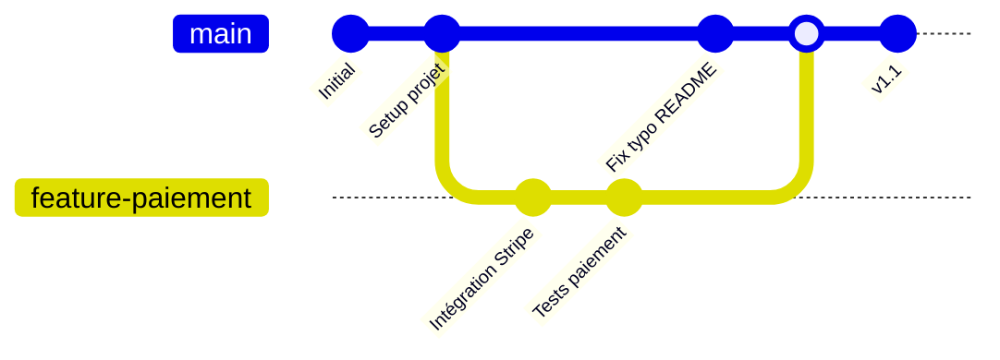

# Chapitre 3 — Git et le contrôle de version

**Niveau : Débutant**

---

## Introduction

Avant de préparer un vrai serveur au chapitre 4, il manque une dernière brique fondationnelle : le moyen de faire voyager le code depuis ta machine jusqu'à ce serveur, de façon fiable, traçable, et réversible. C'est le rôle de Git. Ce chapitre part du principe que tu n'as peut-être jamais utilisé Git de façon rigoureuse — beaucoup de développeurs autodidactes savent taper `git add . && git commit -m "fix"` sans comprendre ce qui se passe réellement derrière, ce qui devient un problème le jour où un conflit ou une erreur de manipulation survient sur un vrai projet en production.

## 🎯 Objectifs pédagogiques

À la fin de ce chapitre, tu sauras : expliquer ce qu'est le contrôle de version et pourquoi il est indispensable, même seul sur un projet ; utiliser Git en local pour suivre l'évolution d'un projet (init, add, commit, log, diff) ; créer un compte et un dépôt sur GitHub ou GitLab ; authentifier une machine (la tienne, puis un serveur) auprès de GitHub/GitLab via SSH, sans jamais taper de mot de passe ; cloner un dépôt privé sur un serveur via une Deploy Key à accès restreint ; expliquer précisément la différence entre `clone`, `fetch` et `pull` ; créer des branches, les fusionner, et résoudre un conflit de fusion réel ; créer des tags et des releases pour marquer des versions ; configurer un `.gitignore` efficace et ne jamais versionner un secret.

## 📋 Prérequis

Chapitre 2 complété (terminal, SSH en aperçu). Un compte GitHub ou GitLab (gratuit, à créer si besoin — la démarche de création de compte n'est pas détaillée ici, elle est intuitive depuis leur page d'accueil).

## Pourquoi ce chapitre est important

Sans contrôle de version, un projet n'a ni historique, ni filet de sécurité, ni moyen fiable de transporter le code vers un serveur. Tout le reste de ce manuel — chaque déploiement, chaque pipeline CI/CD au chapitre 11 — suppose que le code vit dans un dépôt Git, accessible depuis le serveur. Un développeur qui ne maîtrise pas Git au-delà du strict minimum se retrouve démuni face à un conflit de fusion, perd parfois du travail par manque de compréhension des commandes, ou pire, expose des secrets en les committant par erreur — l'un des incidents de sécurité les plus fréquents et les plus évitables en développement professionnel.

---

## Concepts fondamentaux

1. **Dépôt (repository)** — un projet suivi par Git, avec tout son historique.
2. **Commit** — un instantané nommé et horodaté de l'état du projet à un moment donné.
3. **Zone de staging (index)** — une étape intermédiaire entre "fichier modifié" et "fichier enregistré dans l'historique".
4. **Branche** — une ligne de développement indépendante, permettant de travailler sur plusieurs versions du projet en parallèle.
5. **Remote** — un dépôt distant (GitHub, GitLab) référencé par un nom (`origin`, par convention).
6. **Clone / Fetch / Pull** — trois opérations distinctes de synchronisation avec un remote, souvent confondues.
7. **Merge** — la fusion de deux historiques divergents en un seul.
8. **Conflit** — une situation où Git ne peut pas fusionner automatiquement deux changements qui touchent la même partie d'un fichier.
9. **Tag / Release** — un marqueur fixe pointant vers un commit précis, généralement une version publiée.

---

## Explications détaillées

### 3.1 Pourquoi le contrôle de version

Sans Git, un développeur gère les versions "à la main" : `projet-final.zip`, `projet-final-v2.zip`, `projet-final-v2-VRAIMENT-final.zip`. Cette approche ne permet ni de revenir précisément à un état antérieur, ni de comprendre ce qui a changé entre deux versions, ni de collaborer sans écraser le travail d'un collègue.

> 💡 **Analogie** — Git, c'est un peu comme la fonction "Historique des versions" d'un traitement de texte collaboratif, mais poussée à l'extrême : chaque sauvegarde est nommée, expliquée, et il devient possible de revenir à n'importe quel point précis, de comparer deux points entre eux, ou de faire travailler deux personnes sur des parties différentes du même document sans qu'elles s'écrasent mutuellement.


**Explication du diagramme, ligne par ligne :** modifier un fichier ne l'enregistre pas automatiquement dans l'historique — il faut d'abord le placer explicitement en zone de staging (`git add`), une étape intermédiaire qui permet de choisir précisément quels changements inclure dans le prochain commit, même si plusieurs fichiers ont été modifiés. `git commit` transforme ce qui est en staging en un point d'historique permanent et local. `git push` envoie ensuite ces commits vers un dépôt distant, les rendant visibles et récupérables par d'autres machines (dont, plus tard, un serveur de production).

> 📌 **À retenir** — Un commit **local** n'existe que sur ta machine tant qu'il n'a pas été poussé (`push`) vers un remote. Perdre son ordinateur avant d'avoir poussé signifie perdre tout ce travail.

### 3.2 Git en local

#### `git init`
**Description :** transforme un dossier ordinaire en dépôt Git, en créant un sous-dossier caché `.git/` qui contiendra tout l'historique.
**Syntaxe :** `git init`
**Décomposition mot par mot :** *initialize*.
**Options :** rarement nécessaires en usage courant.
**Cas d'utilisation :** démarrer le suivi de version d'un nouveau projet.
**Exemple :**
```bash
cd mon-projet
git init
```
**Résultat attendu :**
```
Initialized empty Git repository in /home/jaslin/mon-projet/.git/
```
**Explication du résultat :** un dossier `.git/` a été créé — c'est lui qui contient tout l'historique, jamais les fichiers du projet eux-mêmes en dehors de cette structure interne.
**Erreurs possibles :** `Reinitialized existing Git repository` si `.git/` existe déjà — sans danger, mais signale que le dossier était déjà un dépôt.
**Vérification :** `ls -la` révèle le dossier `.git/`.
**Cas pratiques :** premier réflexe en démarrant n'importe quel nouveau projet, avant même le premier fichier de code.

#### `git status`
**Description :** affiche l'état actuel du dépôt : fichiers modifiés, en staging, ou non suivis.
**Syntaxe :** `git status`
**Cas d'utilisation :** vérifier ce qui va être inclus dans le prochain commit, avant de le faire.
**Exemple :**
```bash
git status
```
**Résultat attendu :**
```
On branch main
Changes not staged for commit:
  modified:   src/app.js
Untracked files:
  .env
```
**Explication du résultat :** `app.js` a été modifié mais pas encore ajouté au staging ; `.env` n'est suivi par Git dans aucun état — un signal à vérifier immédiatement (section 3.10).
**Erreurs possibles :** `fatal: not a git repository` si exécuté en dehors d'un dépôt initialisé.
**Vérification :** la liste correspond à ce qu'on a réellement modifié.
**Cas pratiques :** réflexe systématique avant chaque `commit`, pour ne jamais committer par erreur un fichier non désiré.

#### `git add`
**Description :** place un ou plusieurs fichiers modifiés dans la zone de staging, en vue du prochain commit.
**Syntaxe :** `git add fichier` ou `git add .`
**Cas d'utilisation :** choisir précisément quels changements seront inclus dans le prochain commit.
**Exemple :**
```bash
git add src/app.js
git add .
```
**Résultat attendu :** aucune sortie en cas de succès.
**Explication du résultat :** `git add .` ajoute tous les fichiers modifiés du dossier courant et de ses sous-dossiers — pratique, mais risqué si un fichier sensible traîne parmi eux (d'où l'importance du `.gitignore`, section 3.10).
**Erreurs possibles :** `fatal: pathspec 'x' did not match any files` si le nom de fichier est incorrect.
**Vérification :** `git status` confirme le passage en zone de staging (`Changes to be committed`).
**Cas pratiques :** `git add .` pour un commit global, `git add fichier-précis.js` pour un commit ciblé sur un seul changement logique.

#### `git commit`
**Description :** enregistre définitivement, dans l'historique local, tout ce qui est actuellement en zone de staging.
**Syntaxe :** `git commit -m "message"`
**Options principales :** `-m` (message en ligne, sans ouvrir d'éditeur).
**Cas d'utilisation :** créer un point d'historique nommé après un changement logique cohérent.
**Exemple :**
```bash
git commit -m "Ajouter la validation du formulaire de connexion"
```
**Résultat attendu :**
```
[main a1b2c3d] Ajouter la validation du formulaire de connexion
 1 file changed, 12 insertions(+), 2 deletions(-)
```
**Explication du résultat :** `a1b2c3d` est le début du hash unique identifiant ce commit ; le résumé indique le nombre de fichiers et de lignes affectés.
**Erreurs possibles :** `nothing to commit, working tree clean` si rien n'a été mis en staging au préalable.
**Vérification :** `git log` montre le nouveau commit en tête.
**Cas pratiques :** un commit par changement logique cohérent, avec un message clair — jamais "fix" ou "wip" comme seul message sur un projet professionnel.

> ✅ **Bonne pratique** — Un bon message de commit décrit **ce qui change et pourquoi**, au présent de l'impératif ("Ajouter", "Corriger", pas "Ajouté" ni "J'ai ajouté"). Un historique de commits bien écrit devient une documentation vivante du projet, consultable des années plus tard.

#### `git log`
**Description :** affiche l'historique des commits.
**Syntaxe :** `git log [options]`
**Options principales :** `--oneline` (une ligne par commit), `-n 5` (limite aux 5 derniers), `--graph` (visualisation des branches en texte).
**Cas d'utilisation :** retrouver quand et pourquoi un changement précis a été effectué.
**Exemple :**
```bash
git log --oneline -n 5
```
**Résultat attendu :**
```
a1b2c3d Ajouter la validation du formulaire de connexion
f4e5d6c Corriger le style du bouton d'envoi
...
```
**Explication du résultat :** chaque ligne montre le début du hash et le message du commit, du plus récent au plus ancien.
**Erreurs possibles :** aucune, sauf dépôt sans commit (`fatal: your current branch 'main' does not have any commits yet`).
**Vérification :** le commit attendu apparaît bien dans la liste.
**Cas pratiques :** identifier le dernier commit stable avant un rollback (repris en Partie X, études de cas).

#### `git diff`
**Description :** affiche les différences ligne par ligne entre deux états du code.
**Syntaxe :** `git diff [options]`
**Cas d'utilisation :** relire précisément ce qui a changé avant de committer.
**Exemple :**
```bash
git diff
```
**Résultat attendu :**
```diff
- const port = 3000;
+ const port = process.env.PORT || 3000;
```
**Explication du résultat :** les lignes précédées de `-` ont été supprimées, celles précédées de `+` ont été ajoutées, par rapport au dernier commit.
**Erreurs possibles :** aucune sortie si rien n'a changé depuis le dernier commit.
**Vérification :** les changements affichés correspondent à ce qu'on pense avoir modifié.
**Cas pratiques :** relecture systématique avant un commit, en particulier avant un `git add .` sur un projet avec plusieurs fichiers modifiés.

### 3.3 Dépôts distants : GitHub et GitLab

Un dépôt local (créé avec `git init`) ne vit que sur ta machine. Un **dépôt distant** (remote), hébergé sur une plateforme comme **GitHub** ou **GitLab**, permet de le sauvegarder ailleurs, de le partager, et de le rendre accessible depuis n'importe quelle autre machine — dont un serveur de production.

| Plateforme | Particularité | Usage typique |
|---|---|---|
| GitHub | La plus répandue mondialement, écosystème CI/CD (GitHub Actions, chapitre 11) très intégré | Projets open source et privés, standard de facto |
| GitLab | Peut être auto-hébergé, CI/CD intégré nativement (GitLab CI, chapitre 11) | Entreprises voulant garder le contrôle total de l'infrastructure |

> 📌 **À retenir** — Les deux plateformes fonctionnent de façon quasiment identique du point de vue de Git lui-même — les commandes `git` restent les mêmes, seule l'interface web et certaines fonctionnalités avancées diffèrent.

### 3.4 Authentification SSH vers GitHub/GitLab

Se connecter à un dépôt distant nécessite une authentification. La méthode recommandée, plus sûre et plus pratique qu'un mot de passe, repose sur une paire de clés SSH — le même mécanisme déjà annoncé au chapitre 1 (section 1.7) et qui reviendra identique au chapitre 4 pour se connecter à un serveur.

#### `ssh-keygen`
**Description :** génère une paire de clés cryptographiques (privée et publique) utilisée pour s'authentifier sans mot de passe.
**Syntaxe :** `ssh-keygen -t ed25519 -C "commentaire"`
**Décomposition mot par mot :** *SSH key generate*.
**Options principales :** `-t ed25519` (type de clé, l'algorithme moderne recommandé), `-C` (commentaire libre, pratique pour identifier l'usage de la clé).
**Cas d'utilisation :** créer une identité cryptographique pour authentifier une machine (la tienne, ou plus tard un serveur) auprès de GitHub/GitLab.
**Exemple :**
```bash
ssh-keygen -t ed25519 -C "jaslin@github"
```
**Résultat attendu :** trois questions interactives (emplacement du fichier, passphrase optionnelle deux fois), puis :
```
Your identification has been saved in /home/jaslin/.ssh/id_ed25519
Your public key has been saved in /home/jaslin/.ssh/id_ed25519.pub
```
**Explication du résultat :** deux fichiers sont créés — `id_ed25519` (la clé **privée**, ne jamais la partager) et `id_ed25519.pub` (la clé **publique**, sans risque à partager).
**Erreurs possibles :** un fichier de même nom existe déjà — choisir un nom distinct ou confirmer l'écrasement en connaissance de cause.
**Vérification :** `ls ~/.ssh/` liste les deux fichiers générés.
**Cas pratiques :** une paire de clés dédiée par usage (une pour ton compte GitHub personnel, une distincte pour chaque serveur — section 3.5) est une meilleure pratique qu'une clé unique réutilisée partout.

**Ajouter la clé publique sur GitHub/GitLab :** copier le contenu de `id_ed25519.pub` (`cat ~/.ssh/id_ed25519.pub`) dans les réglages "SSH Keys" du compte.

**Vérifier l'authentification :**
```bash
ssh -T git@github.com
```
**Résultat attendu :**
```
Hi tonpseudo! You've successfully authenticated, but GitHub does not provide shell access.
```

### 3.5 Dépôt privé et Deploy Keys

Un **dépôt privé** n'est visible et accessible qu'aux comptes explicitement autorisés. Pour qu'un **serveur** (pas un développeur humain) puisse cloner ce dépôt, la bonne pratique n'est **pas** d'y copier ta clé SSH personnelle, mais de créer une **Deploy Key** : une clé SSH dédiée à ce serveur, donnant accès en lecture seule à **un seul dépôt précis**.

> ✅ **Bonne pratique** — Une Deploy Key distincte par serveur/projet, plutôt que la clé personnelle du développeur : si un serveur est un jour compromis, seule cette clé (à accès limité) doit être révoquée, jamais l'accès complet du compte GitHub personnel à l'ensemble de ses dépôts.

La démarche : générer une paire de clés **sur le serveur lui-même** (`ssh-keygen`, comme ci-dessus), copier la clé publique dans les réglages "Deploy Keys" du dépôt GitHub/GitLab concerné (accès lecture seule coché), puis vérifier avec `ssh -T git@github.com` depuis le serveur.

### 3.6 Cloner, Pull, Fetch : la différence essentielle

C'est l'un des points les plus souvent confondus par les débutants — et l'une des sources d'erreurs les plus fréquentes en déploiement.


**Explication du diagramme, ligne par ligne :** `git clone` ne s'utilise qu'**une seule fois**, pour obtenir une première copie complète (tout l'historique, toutes les branches) d'un dépôt distant. `git fetch` télécharge ensuite les nouveaux commits du remote **sans jamais toucher** à ta branche de travail locale — une opération toujours sûre, qui ne peut rien casser. `git pull`, la commande la plus utilisée au quotidien, fait `fetch` **puis** fusionne (`merge`) automatiquement dans ta branche actuelle — pratique, mais qui peut déclencher un conflit (section 3.8) si des changements locaux et distants se chevauchent.

#### `git clone`
**Description :** copie intégralement un dépôt distant (historique complet, branches) dans un nouveau dossier local.
**Syntaxe :** `git clone url [dossier]`
**Cas d'utilisation :** première récupération d'un projet existant, en local ou sur un serveur.
**Exemple :**
```bash
git clone git@github.com:tonorg/monapp.git
```
**Résultat attendu :**
```
Cloning into 'monapp'...
remote: Enumerating objects: 142, done.
Receiving objects: 100% (142/142), done.
```
**Explication du résultat :** un nouveau dossier `monapp/` a été créé, contenant tout le projet ainsi que son historique complet ; le remote `origin` est configuré automatiquement.
**Erreurs possibles :** `Permission denied (publickey)` si l'authentification SSH (3.4/3.5) n'est pas configurée ; `Repository not found` si l'URL est incorrecte ou l'accès non autorisé.
**Vérification :** `cd monapp && git remote -v` confirme l'URL du remote configuré.
**Cas pratiques :** première étape de tout déploiement sur un serveur neuf (chapitre 6).

#### `git fetch`
**Description :** télécharge les nouveaux commits et branches du remote, sans les fusionner dans la branche locale actuelle.
**Syntaxe :** `git fetch [remote]`
**Cas d'utilisation :** consulter ce qui a changé côté distant avant de décider de fusionner.
**Exemple :**
```bash
git fetch origin
```
**Résultat attendu :**
```
remote: Counting objects: 5, done.
From github.com:tonorg/monapp
   a1b2c3d..f4e5d6c  main -> origin/main
```
**Explication du résultat :** les nouveaux commits sont désormais connus localement (accessibles via `origin/main`), mais ta branche `main` locale n'a pas encore changé.
**Erreurs possibles :** erreurs d'authentification identiques à `clone`.
**Vérification :** `git log origin/main` montre les commits téléchargés, distincts de `git log main` tant qu'aucun merge n'a eu lieu.
**Cas pratiques :** vérifier l'état du remote avant une opération sensible, sans risque de modifier son propre travail en cours.

#### `git pull`
**Description :** effectue un `fetch` puis fusionne automatiquement les nouveaux commits distants dans la branche locale actuelle.
**Syntaxe :** `git pull [remote] [branche]`
**Cas d'utilisation :** mettre à jour un dépôt local (ou un serveur) avec les derniers changements poussés.
**Exemple :**
```bash
git pull origin main
```
**Résultat attendu :**
```
Updating a1b2c3d..f4e5d6c
Fast-forward
 src/app.js | 4 ++--
```
**Explication du résultat :** "Fast-forward" signifie qu'aucun commit local divergent n'existait — la branche locale a simplement avancé jusqu'au dernier commit distant, sans fusion complexe.
**Erreurs possibles :** conflit de fusion (section 3.8) si des commits locaux et distants divergent sur les mêmes lignes.
**Vérification :** `git log --oneline -n 3` confirme les nouveaux commits présents localement.
**Cas pratiques :** commande centrale de toute mise à jour de déploiement — `git pull origin main` est la première étape de chaque redéploiement dans ce manuel (chapitre 6).

### 3.7 Branches et stratégie de branches

Une **branche** est une ligne de développement indépendante — un moyen de travailler sur une nouvelle fonctionnalité ou un correctif sans affecter le code déjà stable.


**Explication du diagramme :** la branche `main` avance de son côté (ici, un correctif mineur) pendant qu'une branche séparée `feature-paiement` accueille plusieurs commits liés à une même fonctionnalité, isolément. Une fois cette fonctionnalité terminée et validée, `merge` réunit les deux historiques en un seul, sur `main`.

#### `git branch`
**Description :** liste, crée ou supprime des branches.
**Syntaxe :** `git branch [nom]`
**Cas d'utilisation :** créer une nouvelle ligne de développement isolée.
**Exemple :**
```bash
git branch feature-paiement
git branch
```
**Résultat attendu :**
```
* main
  feature-paiement
```
**Explication du résultat :** l'astérisque indique la branche actuellement active.
**Erreurs possibles :** `a branch named 'x' already exists` si le nom est déjà pris.
**Vérification :** `git branch` liste la nouvelle branche créée.
**Cas pratiques :** une branche par fonctionnalité ou correctif, jamais de développement direct sur `main` dans une équipe.

#### `git switch` (ou `git checkout`)
**Description :** bascule vers une branche existante.
**Syntaxe :** `git switch nom-branche`
**Cas d'utilisation :** passer d'une ligne de développement à une autre.
**Exemple :**
```bash
git switch feature-paiement
git switch -c feature-notifications
```
**Résultat attendu :**
```
Switched to branch 'feature-paiement'
```
**Explication du résultat :** les fichiers du dossier de travail reflètent désormais l'état de la branche ciblée ; `-c` crée et bascule en une seule commande.
**Erreurs possibles :** `error: Your local changes would be overwritten` si des modifications non committées entrent en conflit avec la branche cible — committer ou mettre de côté (`git stash`) avant de basculer.
**Vérification :** `git branch` confirme la branche active (astérisque).
**Cas pratiques :** `git switch -c` au démarrage de chaque nouvelle fonctionnalité.

### 3.8 Merge et résolution de conflits

#### `git merge`
**Description :** fusionne l'historique d'une autre branche dans la branche actuelle.
**Syntaxe :** `git merge nom-branche`
**Cas d'utilisation :** intégrer une fonctionnalité terminée dans `main`.
**Exemple :**
```bash
git switch main
git merge feature-paiement
```
**Résultat attendu (cas simple) :**
```
Merge made by the 'ort' strategy.
 src/paiement.js | 40 ++++++++++++
```
**Explication du résultat :** un nouveau commit de fusion a été créé, réunissant les deux historiques.
**Erreurs possibles :** `CONFLICT (content): Merge conflict in fichier.js` quand la même partie d'un fichier a été modifiée différemment sur les deux branches.
**Vérification :** `git log --graph --oneline` montre la fusion réalisée.
**Cas pratiques :** intégration régulière de fonctionnalités terminées, avant un déploiement.

**Ce qui se passe réellement lors d'un conflit :** Git ne devine jamais à ta place quelle version garder quand deux branches modifient la même ligne différemment. Il marque le fichier concerné avec des balises explicites :
```
<<<<<<< HEAD
const tauxTaxe = 0.10;
=======
const tauxTaxe = 0.12;
>>>>>>> feature-paiement
```
Tout ce qui se trouve entre `<<<<<<< HEAD` et `=======` est la version de la branche actuelle ; tout ce qui se trouve entre `=======` et `>>>>>>> feature-paiement` est la version de la branche fusionnée. **Résoudre le conflit** consiste à éditer manuellement le fichier pour ne garder que la version voulue (ou une combinaison des deux), supprimer les balises, puis :
```bash
git add fichier.js
git commit
```

> ⚠️ **Attention** — Un conflit n'est jamais résolu "automatiquement en gardant les deux" sans réflexion : il faut comprendre l'intention de chaque changement avant de décider laquelle garder, ou comment les combiner. Committer un fichier encore truffé de balises `<<<<<<<` par erreur est une faute fréquente chez un débutant pressé.

### 3.9 Tags et Releases

Un **tag** est un marqueur fixe pointant vers un commit précis — typiquement utilisé pour marquer une version publiée.

#### `git tag`
**Description :** crée un marqueur nommé sur le commit actuel (ou un commit précis).
**Syntaxe :** `git tag nom-du-tag`
**Cas d'utilisation :** marquer un point de l'historique comme "la version qui tourne actuellement en production" — une pratique reprise dans les études de cas de la Partie X pour permettre un rollback précis.
**Exemple :**
```bash
git tag v1.0.0
git push origin v1.0.0
```
**Résultat attendu :** aucune sortie locale ; le `push` confirme l'envoi du tag vers le remote.
**Explication du résultat :** contrairement à un commit, un tag ne bouge jamais une fois créé — il reste attaché en permanence au même commit.
**Erreurs possibles :** `tag already exists` si le nom est déjà utilisé.
**Vérification :** `git tag` liste les tags existants ; visible aussi dans l'interface GitHub/GitLab sous "Tags"/"Releases".
**Cas pratiques :** `git tag prod-2026-07-27` après chaque déploiement réussi en production, pour retrouver rapidement "le dernier commit qui marchait".

Une **Release** (GitHub/GitLab) est une couche supplémentaire au-dessus d'un tag : une page dédiée avec notes de version, fichiers joints éventuels, visible dans l'interface web de la plateforme — créée manuellement depuis l'onglet "Releases" du dépôt, en s'appuyant sur un tag existant.

### 3.10 `.gitignore` et secrets jamais versionnés

Le fichier `.gitignore`, placé à la racine d'un projet, liste les fichiers et dossiers que Git doit **ignorer** — ne jamais les suivre, ne jamais proposer de les ajouter au staging.

```gitignore
node_modules/
dist/
.env
*.log
```

> ⚠️ **Attention, rappel capital du chapitre 1 (section 1.10)** — Un `.env` contenant de vrais secrets (mots de passe, clés API) ne doit **jamais** être suivi par Git, même dans un dépôt privé. Un secret committé une seule fois reste consultable dans l'historique tant qu'aucune réécriture d'historique n'est effectuée — le supprimer plus tard ne suffit pas à le rendre à nouveau confidentiel. La seule réponse fiable face à un secret déjà committé est de le considérer comme compromis et de le faire tourner (nouveau mot de passe, nouvelle clé).

> ✅ **Bonne pratique** — Créer le `.gitignore` **avant** le premier commit d'un projet, jamais après. Un `.env.example` (sans valeurs réelles, juste les noms des variables attendues) committé à la place documente ce dont l'application a besoin sans exposer aucun secret.

---

## Analogies clés de ce chapitre

| Notion | Analogie |
|---|---|
| Contrôle de version | L'historique des versions d'un document collaboratif, poussé à l'extrême |
| Commit | Une photo instantanée et datée du projet |
| Branche | Une ligne de développement parallèle, comme un brouillon séparé du document final |
| Deploy Key | Un badge d'accès limité à une seule salle, plutôt que le passe-partout complet |
| Fetch vs Pull | Consulter le courrier à travers la vitre vs l'ouvrir et le ranger directement |

---

## Étude de cas

**Contexte.** Deux développeurs travaillent sur le même projet. L'un ajoute un champ de recherche à une page ; l'autre, en parallèle, corrige un bug d'affichage sur cette même page. Sans branches, ils écraseraient mutuellement leur travail en committant directement sur `main`.

**Démarche, uniquement avec les outils de ce chapitre :** chacun travaille sur sa propre branche (`feature-recherche` et `fix-affichage`), commit régulièrement avec des messages clairs, pousse (`push`) sa branche vers le dépôt distant. Une fois les deux prêtes, elles sont fusionnées l'une après l'autre dans `main` (`merge`) — un éventuel conflit, s'il touche les mêmes lignes, est résolu manuellement (section 3.8) en comprenant l'intention de chaque changement, jamais en écrasant l'un au profit de l'autre sans réflexion.

---

## Bonnes pratiques (récapitulatif du chapitre)

- Un commit par changement logique cohérent, avec un message clair au présent de l'impératif.
- `.gitignore` créé avant le premier commit, jamais après.
- Une Deploy Key distincte par serveur/projet, jamais la clé personnelle du développeur.
- `git fetch` pour consulter sans risque, `git pull` seulement quand on est prêt à fusionner.
- Un tag après chaque déploiement de production réussi.
- Ne jamais résoudre un conflit sans comprendre l'intention de chaque version.

---

## Erreurs fréquentes (récapitulatif du chapitre)

| Erreur | Pourquoi elle arrive | Conséquence |
|---|---|---|
| `.env` committé par erreur | `.gitignore` absent ou incomplet au premier commit | Secret exposé, à considérer compromis |
| Confondre `fetch` et `pull` | Les deux semblent "mettre à jour" | Fusion inattendue non voulue |
| Développer directement sur `main` | Semble plus simple à court terme sur un petit projet | Conflits plus fréquents, historique confus |
| Committer un fichier avec des balises de conflit non résolues | Précipitation après un merge | Code cassé (balises interprétées comme du code) |
| Réutiliser sa clé SSH personnelle comme Deploy Key | Simplicité apparente | Compromission totale du compte si le serveur est piraté |

---

## Captures d'écran à réaliser

> 📸 **Capture 4**
> **Logiciel :** GitHub
> **Pourquoi cette capture est utile :** montrer où et comment ajouter une clé SSH ou une Deploy Key, une étape purement visuelle sans équivalent en ligne de commande.
> **Page/écran concerné :** Settings → SSH and GPG keys (pour une clé personnelle) ou Repository → Settings → Deploy Keys (pour une Deploy Key)
> **Niveau de zoom conseillé :** 100 %, fenêtre complète du navigateur
> **Montrer :** le formulaire d'ajout de clé, le champ "Title", le champ "Key"
> **Entourer :** le bouton "Add SSH key" / "Add deploy key"
> **Flouter/masquer :** le contenu réel de la clé publique collée dans le champ (même si une clé publique n'est théoriquement pas sensible, éviter de publier une clé identifiable liée à un compte réel)

---

## Laboratoire pratique n°1 — Créer un dépôt local et le pousser sur GitHub

**Objectifs :** créer un dépôt Git local, l'associer à GitHub, et y pousser un premier commit.
**Prérequis :** compte GitHub créé, `ssh-keygen` effectué et clé publique ajoutée à GitHub (section 3.4).
**Matériel nécessaire :** un ordinateur avec terminal et Git installé.

**Étapes :**
1. Crée un dossier `mon-premier-depot` et initialise-le (`git init`).
2. Crée un fichier `README.md` avec une ligne de texte.
3. Vérifie l'état (`git status`), ajoute le fichier (`git add`), committe (`git commit -m "Premier commit"`).
4. Sur GitHub, crée un nouveau dépôt vide (sans README, pour éviter un conflit).
5. Associe ton dépôt local à ce remote : `git remote add origin git@github.com:tonpseudo/mon-premier-depot.git`.
6. Pousse ton commit : `git push -u origin main`.

**Résultat attendu :** le fichier `README.md` visible sur la page GitHub du dépôt.
**Vérifications :** rafraîchir la page GitHub du dépôt et confirmer la présence du fichier et du message de commit.
**Erreurs fréquentes :** `error: failed to push some refs` si le dépôt distant contient déjà un commit (créé avec un README depuis GitHub) — dans ce cas, faire `git pull origin main --allow-unrelated-histories` avant de repousser.
**Solutions :** toujours créer le dépôt distant **vide** quand un dépôt local existe déjà, pour éviter cette divergence.

## Laboratoire pratique n°2 — Configurer une Deploy Key et cloner un dépôt privé

**Objectifs :** générer une clé dédiée et cloner un dépôt privé avec elle, en simulant ce qui sera fait sur un vrai serveur au chapitre 4.
**Prérequis :** Laboratoire 1 complété, dépôt rendu privé dans ses réglages GitHub.
**Matériel nécessaire :** un terminal (idéalement une seconde machine ou un second dossier isolé, pour bien simuler un "serveur" distinct).

**Étapes :**
1. Génère une nouvelle paire de clés dédiée : `ssh-keygen -t ed25519 -C "labo-serveur"` (choisir un nom de fichier distinct de ta clé personnelle pour ne pas l'écraser).
2. Affiche la clé publique générée (`cat`) et copie-la.
3. Sur GitHub, va dans le dépôt du Laboratoire 1 → Settings → Deploy Keys → Add deploy key, colle la clé, laisse "Allow write access" **décoché**.
4. Depuis un nouveau dossier, clone le dépôt en utilisant explicitement cette clé (`GIT_SSH_COMMAND="ssh -i ~/.ssh/nom-de-la-cle" git clone git@github.com:tonpseudo/mon-premier-depot.git`).

**Résultat attendu :** le clonage réussit, un nouveau dossier contient une copie du dépôt.
**Vérifications :** tenter une écriture (créer un commit et le pousser) doit être **refusée**, confirmant que la Deploy Key est bien en lecture seule.
**Erreurs fréquentes :** oublier `GIT_SSH_COMMAND`, auquel cas Git utilise la clé par défaut (souvent la clé personnelle) plutôt que la Deploy Key dédiée — le clonage réussirait alors pour une mauvaise raison.
**Solutions :** vérifier explicitement quelle clé a été utilisée avec `ssh -T -i ~/.ssh/nom-de-la-cle git@github.com`.

## Laboratoire pratique n°3 — Simuler et résoudre un conflit de merge

**Objectifs :** provoquer volontairement un conflit et le résoudre correctement.
**Prérequis :** Laboratoire 1 complété.
**Matériel nécessaire :** le dépôt `mon-premier-depot` du Laboratoire 1.

**Étapes :**
1. Dans `README.md`, ajoute une ligne `Version: 1.0`, committe sur `main`.
2. Crée une branche `experimentation` (`git switch -c experimentation`), modifie la même ligne en `Version: 2.0`, committe.
3. Reviens sur `main` (`git switch main`), modifie à nouveau cette ligne en `Version: 1.1`, committe.
4. Tente de fusionner : `git merge experimentation`.
5. Observe le conflit signalé, ouvre `README.md`, identifie les balises `<<<<<<<`/`=======`/`>>>>>>>`.
6. Résous le conflit en choisissant une valeur finale (par exemple `Version: 2.0`), supprime les balises.
7. `git add README.md`, puis `git commit` (un message par défaut s'ouvre, à valider tel quel ou à personnaliser).

**Résultat attendu :** un commit de fusion créé, `README.md` ne contenant plus aucune balise de conflit.
**Vérifications :** `cat README.md` confirme l'absence de `<<<<<<<`, `git log --graph --oneline` montre la fusion.
**Erreurs fréquentes :** committer directement sans supprimer les balises — le fichier contient alors littéralement le texte des balises, cassant potentiellement le projet si c'est un fichier de code.
**Solutions :** toujours relire le fichier entier après résolution, avant de committer, pour confirmer l'absence de toute balise résiduelle.

---

## Exercices

1. Explique la différence entre le répertoire de travail, la zone de staging, et le dépôt local, avec un exemple concret.
2. Pourquoi une Deploy Key est-elle préférable à la réutilisation de ta clé SSH personnelle sur un serveur ?
3. Un collègue te dit "j'ai fait un pull et maintenant j'ai un conflit". Explique-lui, avec tes propres mots, ce qui s'est réellement passé.
4. Pourquoi `git fetch` est-il considéré comme une opération "sans risque", contrairement à `git pull` ?
5. Donne un exemple concret où un tag serait utile, en dehors de l'exemple du déploiement en production déjà donné dans ce chapitre.

---

## Quiz

**Question 1.** La zone de staging sert à :
a) Sauvegarder automatiquement le projet toutes les 5 minutes
b) Choisir précisément quels changements seront inclus dans le prochain commit
c) Stocker les branches distantes
d) Chiffrer les commits

**Question 2.** Quelle est la différence essentielle entre `git fetch` et `git pull` ?
a) `fetch` est plus rapide, aucune autre différence
b) `pull` télécharge, `fetch` ne fait rien
c) `fetch` télécharge sans fusionner, `pull` télécharge ET fusionne automatiquement
d) Il n'y a aucune différence, ce sont des synonymes

**Question 3.** Une Deploy Key donne généralement accès à :
a) Tous les dépôts du compte GitHub
b) Un seul dépôt précis, souvent en lecture seule
c) Uniquement à l'organisation entière
d) Aux paramètres de facturation GitHub

**Question 4.** Face à un conflit de merge, la bonne pratique est de :
a) Toujours garder la version de `main`
b) Toujours garder la version de la branche fusionnée
c) Comprendre l'intention de chaque version avant de choisir ou combiner
d) Annuler systématiquement le merge

**Question 5.** Un secret committé une fois dans l'historique Git :
a) Disparaît automatiquement au commit suivant
b) Reste consultable dans l'historique tant qu'aucune réécriture n'est faite — il doit être considéré compromis
c) N'est visible que par le propriétaire du dépôt
d) Est automatiquement chiffré par GitHub

> 🔑 **Corrigé** — 1: b · 2: c · 3: b · 4: c · 5: b

---

## 📝 Résumé du chapitre

- Git suit l'historique d'un projet via des commits, en trois étapes : répertoire de travail → zone de staging (`add`) → dépôt local (`commit`).
- Un dépôt distant (GitHub/GitLab) permet de sauvegarder, partager et récupérer un projet depuis n'importe quelle machine.
- L'authentification vers un remote se fait par clé SSH ; une Deploy Key, dédiée et à accès restreint, est la bonne pratique pour un serveur.
- `clone` copie tout une seule fois ; `fetch` télécharge sans fusionner (sûr) ; `pull` = fetch + fusion automatique.
- Les branches isolent des lignes de développement parallèles ; `merge` les réunit, avec parfois un conflit à résoudre manuellement.
- Les tags marquent un commit précis de façon permanente, utiles pour retrouver "la dernière version stable".
- `.gitignore` doit exister avant le premier commit ; un secret jamais versionné plutôt qu'un secret retiré après coup.

## ✅ Checklist avant de passer au chapitre 4

- [ ] Je sais créer un dépôt local et le pousser sur GitHub/GitLab.
- [ ] Je sais expliquer, sans hésiter, la différence entre `clone`, `fetch` et `pull`.
- [ ] Je sais créer une branche, y committer, et la fusionner dans `main`.
- [ ] J'ai résolu un vrai conflit de merge au moins une fois.
- [ ] Je sais pourquoi une Deploy Key est préférable à une clé personnelle sur un serveur.
- [ ] Mon `.gitignore` réflexe inclut toujours `.env` et `node_modules/`.
- [ ] J'ai réalisé les trois laboratoires et obtenu au moins 4/5 au quiz.

---

## Glossaire du chapitre

**Dépôt (repository)**
Définition simple : un projet suivi par Git, avec tout son historique.
Définition technique : une structure de données (`.git/`) contenant l'ensemble des objets (commits, arbres, blobs) représentant l'historique complet d'un projet.
Exemple concret : le dossier `.git/` créé par `git init`.
Voir : Chapitre 3, section 3.2.

**Commit**
Définition simple : un instantané nommé et daté du projet à un moment précis.
Définition technique : un objet Git immuable, identifié par un hash SHA-1/SHA-256, référençant un arbre de fichiers, un ou plusieurs commits parents, un auteur et un message.
Exemple concret : `a1b2c3d Ajouter la validation du formulaire`.
Voir : Chapitre 3, section 3.2.

**Branche**
Définition simple : une ligne de développement indépendante.
Définition technique : un pointeur mobile référençant le dernier commit d'une ligne de développement donnée.
Exemple concret : `feature-paiement`.
Voir : Chapitre 3, section 3.7.

**Remote**
Définition simple : un dépôt distant, référencé par un nom.
Définition technique : une URL enregistrée sous un alias (`origin` par convention) permettant à Git de synchroniser avec un dépôt hébergé ailleurs.
Exemple concret : `origin` pointant vers `git@github.com:tonorg/monapp.git`.
Voir : Chapitre 3, section 3.3.

**Deploy Key**
Définition simple : une clé d'accès dédiée à un serveur, limitée à un seul dépôt.
Définition technique : une clé SSH publique enregistrée au niveau d'un dépôt précis (pas d'un compte utilisateur), généralement configurée en lecture seule.
Exemple concret : la clé générée sur le serveur de production pour `git pull` automatique.
Voir : Chapitre 3, section 3.5.

**Conflit de fusion**
Définition simple : une situation où Git ne peut pas décider seul quelle version d'un changement garder.
Définition technique : un état survenant quand deux branches modifient différemment les mêmes lignes d'un fichier, nécessitant une résolution manuelle avant de finaliser le merge.
Exemple concret : les balises `<<<<<<<`/`=======`/`>>>>>>>` insérées dans un fichier.
Voir : Chapitre 3, section 3.8.

---

## ❓ FAQ

**Faut-il toujours passer par une branche, même pour un projet solo ?**
Fortement recommandé dès qu'un déploiement automatisé existe (chapitre 11) : travailler sur une branche séparée permet de tester avant de fusionner vers `main`, qui déclenche généralement le déploiement en production.

**Que se passe-t-il si je supprime une branche déjà fusionnée ?**
Rien de grave : une fois fusionnée dans `main`, l'historique de la branche est préservé dans `main` lui-même — supprimer la branche (`git branch -d nom`) ne supprime aucun commit déjà intégré.

**Puis-je changer le message d'un commit déjà poussé ?**
Techniquement oui (`git commit --amend` puis `push --force`), mais c'est risqué sur une branche partagée avec d'autres personnes — réécrire l'historique déjà distribué peut créer des divergences difficiles à résoudre pour les autres. À éviter sauf en toute connaissance de cause.

---

## Références officielles

- Pro Git Book (gratuit, référence complète) — [git-scm.com/book](https://git-scm.com/book/fr/v2)
- Documentation officielle Git — [git-scm.com/doc](https://git-scm.com/doc)
- GitHub Docs — [docs.github.com](https://docs.github.com)
- GitLab Docs — [docs.gitlab.com](https://docs.gitlab.com)
- GitHub Docs — Deploy Keys — [docs.github.com/en/authentication/connecting-to-github-with-ssh/managing-deploy-keys](https://docs.github.com/en/authentication/connecting-to-github-with-ssh/managing-deploy-keys)

---

## Conclusion

Git achève la dernière fondation avant de toucher à un vrai serveur : ton code peut désormais voyager, de façon traçable et réversible, de ta machine vers n'importe quel dépôt distant, et bientôt vers un VPS de production. Le chapitre 4 va utiliser exactement les mêmes mécanismes de clé SSH que tu viens d'apprendre — cette fois pour te connecter, non plus à GitHub, mais à ton propre serveur.

---

⬅️ [Chapitre 2 — Les bases de Linux](02-bases-linux.md) · ➡️ **Suite : [Chapitre 4 — Préparer un serveur](04-preparer-un-serveur.md)**
