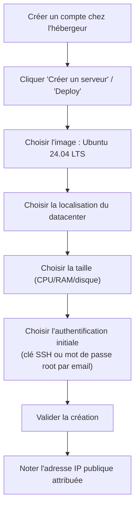
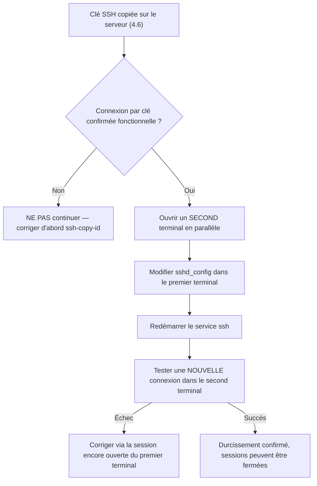
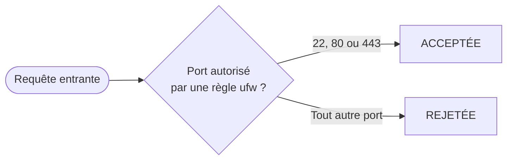

# Chapitre 4 — Préparer un serveur

**Niveau : Débutant → Intermédiaire**

---

## Introduction

Ce chapitre est celui où la théorie devient enfin concrète : tu vas louer une vraie machine, quelque part dans un vrai datacenter, et t'y connecter pour la première fois. Tout ce qui a été appris aux chapitres 1 à 3 — vocabulaire réseau, commandes Linux, Git — converge ici en une seule séquence d'actions réelles, du clic "Créer un serveur" chez un hébergeur jusqu'à un VPS entièrement sécurisé, prêt à recevoir des logiciels au chapitre 5.

Ce chapitre demande un vrai budget, minime mais réel (quelques dollars). C'est un investissement nécessaire : aucune des notions suivantes ne s'apprend correctement sur un environnement simulé.

## 🎯 Objectifs pédagogiques

À la fin de ce chapitre, tu sauras : choisir un hébergeur VPS adapté à un premier projet ; créer un VPS Ubuntu Server LTS depuis zéro ; te connecter en SSH pour la première fois ; mettre le système à jour ; créer un utilisateur non-root avec les droits `sudo` et désactiver l'accès direct par `root` ; générer et utiliser une paire de clés SSH pour te connecter sans mot de passe ; durcir la configuration SSH ; configurer un pare-feu (`ufw`) sans te couper l'accès ; installer Fail2ban pour bloquer automatiquement les tentatives d'intrusion ; régler le fuseau horaire, la locale, la synchronisation de l'heure (NTP) et un fichier swap.

## 📋 Prérequis

Chapitres 1 à 3 complétés (vocabulaire réseau, terminal Linux, notions Git). Un moyen de paiement pour louer un VPS (quelques dollars par mois, résiliable à tout moment). Une clé SSH n'est pas encore nécessaire — elle sera générée dans ce chapitre si tu ne l'as pas déjà (tu peux réutiliser celle générée au chapitre 3 pour GitHub, ou en créer une distincte — voir section 4.5).

## Pourquoi ce chapitre est important

Un serveur mal préparé est le point de départ de la quasi-totalité des incidents de sécurité évitables : mot de passe root laissé par défaut, pare-feu jamais configuré, connexion root directe encore active des mois après la mise en production. Ce chapitre installe, une bonne fois pour toutes et dans le bon ordre, les fondations de sécurité sur lesquelles tout le reste du manuel — et tout projet réel que tu déploieras plus tard — va reposer sans jamais y revenir.

---

## Concepts fondamentaux

1. **Choix de l'hébergeur** — un compromis coût/simplicité/localisation.
2. **Image système** — Ubuntu Server LTS, la version longuement supportée.
3. **Connexion initiale** — toujours en `root`, mais seulement le temps de sécuriser l'accès.
4. **Utilisateur dédié** — la bascule immédiate hors de `root` pour tout usage quotidien.
5. **Authentification par clé** — remplace le mot de passe, plus sûr et plus pratique.
6. **Durcissement SSH** — fermer les deux portes les plus attaquées automatiquement sur Internet.
7. **Pare-feu et Fail2ban** — deux couches de défense complémentaires.
8. **Réglages de fond** — fuseau horaire, locale, swap, NTP : faits une fois, jamais revisités.

---

## Explications détaillées

### 4.1 Choisir un hébergeur

> 💡 **Analogie** — Choisir un hébergeur, c'est choisir un propriétaire chez qui louer un appartement (le VPS, chapitre 1 section 1.3). Le bâtiment (le datacenter), sa localisation, le prix au mètre carré et la qualité du service après-vente varient énormément d'un propriétaire à l'autre pour un logement globalement équivalent.

| Hébergeur | Points forts | Points faibles | Idéal pour |
|---|---|---|---|
| **Hetzner** | Excellent rapport prix/performance, datacenters Europe/USA | Pas de datacenter en Amérique latine/Caraïbes | Débuter, budget serré, apprentissage |
| **Contabo** | Très bon marché, grosses ressources pour le prix | Support parfois lent, réseau moins premium | Projets à petit budget tolérants à une latence plus élevée |
| **DigitalOcean** | Interface très simple, immense documentation communautaire | Un peu plus cher que Hetzner/Contabo à ressources égales | Débutants qui veulent une interface soignée et beaucoup de tutoriels |
| **Vultr** | Beaucoup de localisations dans le monde, facturation à l'heure | Interface un peu moins intuitive que DigitalOcean | Choisir précisément la localisation la plus proche des utilisateurs finaux |
| **OVH** | Datacenters en France/Canada, panel en français | Interface parfois jugée moins moderne | Public francophone, conformité données en Europe/Canada |
| **AWS / Azure / Google Cloud** | Écosystème quasi illimité, scalabilité extrême | Complexité et facturation bien plus difficiles à maîtriser au début | Une fois les bases (ce manuel) maîtrisées |

> ✅ **Bonne pratique pour débuter** — Hetzner ou DigitalOcean pour ce manuel : documentation abondante, panel simple, prix prévisible. Choisis une **offre VPS d'entrée de gamme** : 1 à 2 vCPU, 2 à 4 Go de RAM, 40 à 80 Go SSD/NVMe suffisent largement pour apprendre et pour héberger un projet réel de taille modeste.

### 4.2 Créer un VPS Ubuntu Server LTS

**Pourquoi "LTS" ?** *Long Term Support* : ces versions (24.04, 22.04...) reçoivent des mises à jour de sécurité pendant plusieurs années, contrairement aux versions intermédiaires bien moins longtemps supportées. **Toujours choisir une version LTS pour un serveur en production.**


**Explication du diagramme :** cette séquence est identique, dans sa logique, chez tous les hébergeurs du tableau ci-dessus — seul le vocabulaire exact de l'interface varie. La dernière étape (noter l'IP) est cruciale : c'est cette adresse qui identifiera le serveur pour tout le reste du manuel.

> ⚠️ **Attention** — Si un mot de passe root est généré automatiquement par l'hébergeur (envoyé par email), il doit être considéré comme **temporaire** : la toute première chose à faire après la première connexion est de sécuriser l'accès (utilisateur dédié + clé SSH, sections 4.4 et 4.5), pas de continuer à travailler avec ce mot de passe.

### 4.3 Première connexion SSH

#### `ssh` (première connexion)
**Description :** initie une connexion chiffrée vers la machine distante, en s'authentifiant en tant que `root`.
**Syntaxe :** `ssh root@ADRESSE_IP_DU_SERVEUR`
**Cas d'utilisation :** toute première prise de contact avec un serveur neuf.
**Exemple :**
```bash
ssh root@38.242.137.71
```
**Résultat attendu (première fois) :**
```
The authenticity of host '38.242.137.71' can't be established.
ED25519 key fingerprint is SHA256:xxxxxxxxxxxxxxxxxxxxxxxxxxxxxxxx.
Are you sure you want to continue connecting (yes/no/[fingerprint])?
```
**Explication du résultat :** ton ordinateur n'a jamais rencontré ce serveur ; `ssh` demande de confirmer explicitement la confiance avant d'enregistrer son empreinte pour toutes les connexions futures — ce mécanisme permettra de détecter automatiquement une usurpation ultérieure. Taper `yes`, puis fournir le mot de passe (ou rien si une clé est déjà configurée).
**Résultat attendu (connexion réussie) :**
```
Welcome to Ubuntu 24.04 LTS (GNU/Linux ...)
root@nomserveur:~#
```
**Explication du résultat :** le `#` final (plutôt que `$`) indique une session `root`.
**Erreurs possibles :** `Connection refused` (le serveur vient d'être créé et n'a pas fini de démarrer — attendre une minute) ; `Connection timed out` (IP incorrecte, ou pare-feu réseau côté hébergeur).
**Vérification :** l'invite de commande affiche bien `root@nomserveur`.
**Cas pratiques :** cette étape ne se reproduit qu'une seule fois par serveur — dès la section 4.4, la connexion `root` directe sera désactivée.

### 4.4 Mettre le système à jour

```bash
apt update
apt upgrade -y
```
**Ce que fait ce bloc :** `apt update` (chapitre 2, section 2.7) rafraîchit la liste des paquets disponibles ; `apt upgrade -y` les met à jour, `-y` répondant automatiquement "oui" à chaque confirmation — acceptable ici sur un serveur tout juste créé, sans rien de critique encore en place.

> ✅ **Bonne pratique** — Redémarrer si `apt` signale *"a reboot is required"* (souvent après une mise à jour du noyau) :
```bash
reboot
```
Attendre 30 à 60 secondes, puis se reconnecter comme en 4.3.

### 4.5 Créer un utilisateur non-root avec `sudo`

> ⚠️ **Attention** — Travailler en permanence en `root` (rappelé aux chapitres 1 et 2) donne à une seule commande mal tapée un pouvoir de destruction total. Toute la suite de ce manuel suppose un utilisateur dédié créé **maintenant**.

#### `adduser`
**Description :** crée un nouvel utilisateur système, avec son dossier personnel et ses réglages de base.
**Syntaxe :** `adduser nom-utilisateur`
**Cas d'utilisation :** créer le compte qui remplacera `root` pour tout usage quotidien.
**Exemple :**
```bash
adduser jaslin
```
**Résultat attendu :** une série de questions (mot de passe à choisir robuste, puis informations optionnelles laissables vides).
**Explication du résultat :** un dossier `/home/jaslin` est créé, avec les fichiers de configuration shell par défaut.
**Erreurs possibles :** `adduser: The user 'jaslin' already exists` si le compte existe déjà.
**Vérification :** `ls /home/` liste le nouveau dossier personnel.
**Cas pratiques :** première commande exécutée sur chaque nouveau serveur, juste après la mise à jour système.

#### `usermod`
**Description :** modifie un compte utilisateur existant, notamment son appartenance à des groupes.
**Syntaxe :** `usermod -aG groupe utilisateur`
**Décomposition mot par mot :** *user modify* ; `-a` = *append* (ajoute sans retirer les groupes existants), `-G` = groupes secondaires.
**Cas d'utilisation :** autoriser un utilisateur à exécuter des commandes `sudo`.
**Exemple :**
```bash
usermod -aG sudo jaslin
```
**Résultat attendu :** aucune sortie en cas de succès.
**Explication du résultat :** `jaslin` appartient désormais aussi au groupe `sudo`, en plus de ses groupes existants.
**Erreurs possibles :** oublier `-a` remplace **tous** les groupes existants par le seul groupe indiqué — un risque réel sur un utilisateur qui appartenait déjà à d'autres groupes.
**Vérification :**
```bash
su - jaslin
sudo whoami
```
`sudo whoami` doit répondre `root` après avoir demandé le mot de passe de `jaslin`, pas celui de root.
**Cas pratiques :** identique à chaque nouveau serveur préparé — le réflexe `-aG` (jamais `-G` seul) doit devenir automatique.

### 4.6 Clés SSH : se connecter sans mot de passe, plus sûrement

Le mécanisme est identique à celui déjà vu au chapitre 3 pour GitHub (section 3.4) — une paire de clés publique/privée, cette fois pour authentifier ta machine auprès du **serveur** plutôt qu'auprès de GitHub.

> 💡 **Analogie** — Un cadenas (la clé publique, posé sur le serveur) qui ne peut s'ouvrir qu'avec une seule clé physique précise (la clé privée, qui ne quitte jamais ta machine).

**Générer une paire de clés dédiée** (en local, pas sur le serveur) :
```bash
ssh-keygen -t ed25519 -C "jaslin@monprojet"
```
(voir chapitre 3, section 3.4, pour le détail complet de cette commande déjà couverte)

#### `ssh-copy-id`
**Description :** copie automatiquement une clé publique locale vers le fichier `authorized_keys` d'un serveur distant.
**Syntaxe :** `ssh-copy-id utilisateur@ADRESSE_IP`
**Cas d'utilisation :** installer sa clé publique sur un serveur pour s'y connecter sans mot de passe.
**Exemple :**
```bash
ssh-copy-id jaslin@38.242.137.71
```
**Résultat attendu :** demande le mot de passe de `jaslin` une dernière fois, puis confirme le nombre de clés ajoutées.
**Explication du résultat :** la clé publique est désormais présente dans `~/.ssh/authorized_keys` sur le serveur, associée au compte `jaslin`.
**Erreurs possibles :** `Permission denied` si le mot de passe de `jaslin` est incorrect.
**Vérification :**
```bash
ssh jaslin@38.242.137.71
```
Si la connexion s'établit **sans demander de mot de passe**, la clé fonctionne.
**Cas pratiques :** à refaire pour chaque nouveau serveur, avec la même clé ou une clé dédiée selon la politique retenue.

> ✅ **Bonne pratique** — À partir de maintenant, toutes les commandes de ce manuel supposent une connexion avec l'utilisateur `jaslin`, jamais `root`.

### 4.7 Durcir la configuration SSH

Une fois la connexion par clé confirmée fonctionnelle (étape impérative avant celle-ci) :

```bash
sudo nano /etc/ssh/sshd_config
```
Régler :
```
PermitRootLogin no
PasswordAuthentication no
```
- `PermitRootLogin no` : interdit toute connexion SSH directe avec `root`.
- `PasswordAuthentication no` : interdit toute connexion par mot de passe, éliminant le risque d'attaque par force brute.

```bash
sudo systemctl restart ssh
```


**Explication du diagramme :** ce schéma formalise la procédure de sécurité la plus importante de ce chapitre — ne jamais avancer à l'étape suivante sans avoir validé la précédente, et toujours garder un filet de sécurité (le second terminal) avant toute action qui pourrait couper l'accès.

> ⚠️ **Attention, étape à risque si mal exécutée** — Avant de fermer ta session SSH actuelle, ouvre un second terminal et teste une nouvelle connexion pendant que la première reste ouverte. Ne jamais fermer la seule session active avant d'avoir confirmé qu'une nouvelle connexion fonctionne.

### 4.8 Configurer le pare-feu (`ufw`)

Rappel du chapitre 2 (section 2.10) : **toujours autoriser SSH avant d'activer le pare-feu.**

```bash
sudo ufw allow OpenSSH
sudo ufw allow 80
sudo ufw allow 443
sudo ufw enable
```
```bash
sudo ufw status verbose
```
**Résultat attendu :**
```
Status: active
22/tcp (OpenSSH)  ALLOW IN  Anywhere
80/tcp            ALLOW IN  Anywhere
443/tcp           ALLOW IN  Anywhere
```


**Explication du diagramme :** `ufw` applique la politique "tout refuser par défaut" (chapitre 1, section 1.7) — seuls les trois ports explicitement autorisés laissent passer une requête, tout le reste est silencieusement rejeté avant même d'atteindre un quelconque service applicatif.

> 📌 **À retenir** — À ce stade, ni le port de base de données (3306/5432) ni celui d'un futur backend applicatif ne sont ouverts — ils resteront accessibles uniquement en interne, via nginx en reverse proxy (chapitre 9).

### 4.9 Fail2ban : bloquer automatiquement les tentatives d'intrusion

**Fail2ban** surveille les logs (SSH en particulier) et bannit temporairement, au niveau du pare-feu, toute adresse IP qui multiplie les échecs d'authentification.

```bash
sudo apt install fail2ban -y
sudo nano /etc/fail2ban/jail.local
```
```ini
[sshd]
enabled = true
port = 22
maxretry = 5
findtime = 10m
bantime = 1h
```
```bash
sudo systemctl restart fail2ban
sudo fail2ban-client status sshd
```
**Explication de la configuration :** `maxretry = 5` (échecs tolérés avant bannissement), `findtime = 10m` (fenêtre de comptage), `bantime = 1h` (durée du bannissement).

> ✅ **Bonne pratique** — Même avec `PasswordAuthentication no` déjà en place (une attaque par mot de passe étant déjà impossible), Fail2ban reste utile : il réduit le bruit dans les logs et protège d'autres services qui pourraient, eux, encore accepter des mots de passe.

### 4.10 Fuseau horaire, locale, swap et NTP

**Fuseau horaire :**
```bash
sudo timedatectl set-timezone America/Port-au-Prince
timedatectl
```

**Locale (encodage UTF-8, obligatoire pour les caractères accentués) :**
```bash
sudo apt install language-pack-fr -y
sudo update-locale LANG=fr_FR.UTF-8
```

**Fichier swap (mémoire d'appoint sur disque) :**
```bash
sudo fallocate -l 2G /swapfile
sudo chmod 600 /swapfile
sudo mkswap /swapfile
sudo swapon /swapfile
echo '/swapfile none swap sw 0 0' | sudo tee -a /etc/fstab
free -h
```
**Explication :** `fallocate` crée un fichier de 2 Go, `chmod 600` restreint sa lecture à root (il peut contenir des données sensibles issues de la RAM), `mkswap` le formate comme espace d'échange, `swapon` l'active, et la ligne ajoutée à `/etc/fstab` le rend permanent après redémarrage.

**Synchronisation de l'heure (NTP) :**
```bash
timedatectl   # vérifie "System clock synchronized: yes"
```
Si inactif :
```bash
sudo systemctl enable --now systemd-timesyncd
```

> ⚠️ **Attention** — Une horloge serveur désynchronisée cause des problèmes subtils : certificats SSL refusés (chapitre 10), tokens d'authentification expirés au mauvais moment, logs incohérents entre plusieurs machines.

---

## Analogies clés de ce chapitre

| Notion | Analogie |
|---|---|
| Choisir un hébergeur | Choisir un propriétaire chez qui louer un appartement |
| Clé SSH | Un cadenas et sa seule clé physique correspondante |
| Fail2ban | Un vigile qui bannit temporairement quiconque force la porte à répétition |
| Swap | Une pièce de secours qu'on utilise seulement quand le salon (la RAM) est plein |

---

## Étude de cas

**Contexte.** Un développeur loue son tout premier VPS pour un projet client réel, avec un délai serré. Pressé, il est tenté de "faire vite" : garder le mot de passe root reçu par email, ne pas configurer de pare-feu "pour l'instant", promettant de sécuriser "plus tard une fois que ça marche".

**Pourquoi cette approche est risquée.** Un serveur avec le port 22 ouvert et un mot de passe root, même complexe, est scanné par des robots automatisés en quelques minutes après sa mise en ligne — ce n'est pas une hypothèse théorique, c'est une observation constante sur Internet. "Plus tard" devient souvent "jamais", une fois le projet livré et l'attention tournée ailleurs.

**La bonne séquence, celle de ce chapitre.** Sécuriser d'abord (sections 4.3 à 4.9), déployer ensuite (chapitre 6) — jamais l'inverse. L'intégralité de ce chapitre prend moins d'une heure une fois maîtrisée ; le coût d'un serveur compromis (données volées, serveur utilisé pour attaquer d'autres machines, perte de confiance du client) est sans commune mesure avec ce temps investi en amont.

---

## Bonnes pratiques (récapitulatif du chapitre)

- Toujours une image Ubuntu **LTS**, jamais une version intermédiaire, pour un serveur de production.
- Ne jamais continuer à utiliser un mot de passe root généré automatiquement au-delà de la première connexion.
- Créer l'utilisateur non-root et sa clé SSH avant toute autre configuration.
- Toujours garder un second terminal ouvert avant de durcir SSH ou d'activer le pare-feu.
- Autoriser SSH dans `ufw` avant, jamais après, l'activation du pare-feu.
- Régler fuseau horaire et NTP dès la préparation du serveur, jamais après coup en plein incident de logs.

---

## Erreurs fréquentes (récapitulatif du chapitre)

| Erreur | Pourquoi elle arrive | Conséquence |
|---|---|---|
| Continuer avec le mot de passe root par email | Semble suffisant à court terme | Serveur rapidement ciblé par des robots automatisés |
| Désactiver `PasswordAuthentication` avant d'avoir vérifié la clé | Précipitation | Perte totale d'accès au serveur |
| `ufw enable` avant `ufw allow OpenSSH` | Ordre non respecté | Perte d'accès SSH immédiate |
| Oublier `-a` dans `usermod -aG` | Syntaxe mal mémorisée | Perte des groupes existants de l'utilisateur |
| Ignorer le réglage NTP | Semble sans importance immédiate | Certificats SSL refusés, logs incohérents, bien plus tard (chapitre 10, 18) |

---

## Captures d'écran à réaliser

> 📸 **Capture 5**
> **Logiciel :** panel de l'hébergeur choisi (Hetzner, Contabo, DigitalOcean...)
> **Pourquoi cette capture est utile :** montrer concrètement à quoi ressemble l'écran de création d'un VPS, avec ses champs réels — nettement plus rassurant pour un débutant que la seule description textuelle.
> **Page/écran concerné :** écran de création d'un nouveau serveur, juste avant validation (choix de l'image, de la taille, de la localisation)
> **Niveau de zoom conseillé :** 100 %, fenêtre complète
> **Montrer :** le sélecteur d'image système (Ubuntu 24.04 LTS visible), le sélecteur de taille (CPU/RAM/disque), le sélecteur de localisation
> **Entourer :** le choix "Ubuntu 24.04 LTS" et le bouton de validation finale
> **Flouter/masquer :** toute information de facturation (numéro de carte, historique de paiement) si visible sur le même écran

> 📸 **Capture 6**
> **Logiciel :** panel de l'hébergeur, écran de résultat après création
> **Pourquoi cette capture est utile :** montrer où retrouver l'adresse IP et les identifiants initiaux, l'information la plus critique de tout le chapitre.
> **Page/écran concerné :** page de détail du serveur nouvellement créé
> **Niveau de zoom conseillé :** 100 %
> **Montrer :** l'emplacement de l'adresse IPv4 (et IPv6 si disponible), le nom du serveur
> **Entourer :** le champ affichant l'adresse IPv4
> **Flouter/masquer :** l'adresse IP réelle et le mot de passe root généré (tous deux à considérer comme sensibles une fois un vrai serveur en jeu)

---

## Laboratoire pratique n°1 — Louer un VPS et s'y connecter la première fois

**Objectifs :** obtenir un VPS Ubuntu LTS réel et confirmer la première connexion SSH.
**Prérequis :** compte chez un hébergeur, moyen de paiement.
**Matériel nécessaire :** un ordinateur avec terminal.

**Étapes :**
1. Crée un compte chez l'hébergeur choisi (section 4.1).
2. Crée un VPS Ubuntu 24.04 LTS, taille d'entrée de gamme, localisation la plus proche de toi.
3. Note précieusement l'adresse IP attribuée.
4. Connecte-toi en SSH : `ssh root@ADRESSE_IP`.
5. Accepte l'empreinte du serveur, authentifie-toi.

**Résultat attendu :** une invite de commande `root@nomserveur:~#`.
**Vérifications :** `whoami` répond `root` ; `hostname` affiche le nom du serveur.
**Erreurs fréquentes :** `Connection timed out` juste après la création — le serveur n'a pas fini de démarrer, attendre une minute.
**Solutions :** vérifier l'état du serveur dans le panel de l'hébergeur avant de réessayer.

## Laboratoire pratique n°2 — Créer un utilisateur sécurisé avec clé SSH

**Objectifs :** créer l'utilisateur non-root définitif et confirmer une connexion par clé, sans mot de passe.
**Prérequis :** Laboratoire 1 complété.
**Matériel nécessaire :** le VPS du Laboratoire 1.

**Étapes :**
1. En root : `adduser jaslin` (ou le nom de ton choix).
2. `usermod -aG sudo jaslin`.
3. Vérifie : `su - jaslin && sudo whoami`.
4. En local : `ssh-keygen -t ed25519 -C "jaslin@monprojet"`.
5. `ssh-copy-id jaslin@ADRESSE_IP`.
6. Confirme : `ssh jaslin@ADRESSE_IP` sans demande de mot de passe.

**Résultat attendu :** connexion SSH réussie avec l'utilisateur `jaslin`, sans aucun mot de passe demandé.
**Vérifications :** `sudo whoami` répond `root` depuis la session `jaslin`.
**Erreurs fréquentes :** `ssh-copy-id` échoue silencieusement si le service SSH n'accepte pas encore l'authentification par mot de passe pour `jaslin` (cas rare si `sshd_config` a déjà été modifié par erreur) — dans ce cas, copier manuellement le contenu de la clé publique dans `~/.ssh/authorized_keys` via la console web de l'hébergeur.
**Solutions :** toujours faire `ssh-copy-id` **avant** toute modification de `sshd_config`.

## Laboratoire pratique n°3 — Configurer le pare-feu et Fail2ban

**Objectifs :** sécuriser le serveur au niveau réseau, sans jamais perdre l'accès.
**Prérequis :** Laboratoire 2 complété, connexion par clé confirmée fonctionnelle.
**Matériel nécessaire :** le VPS des laboratoires précédents.

**Étapes :**
1. Ouvre un second terminal, connecté en `jaslin`, à garder ouvert pendant toute la suite.
2. Dans le premier terminal : durcis `sshd_config` (`PermitRootLogin no`, `PasswordAuthentication no`), redémarre `ssh`.
3. Dans le second terminal : ouvre une **nouvelle** connexion pour confirmer que tout fonctionne toujours.
4. Configure `ufw` (`allow OpenSSH`, `allow 80`, `allow 443`, `enable`).
5. Installe et configure Fail2ban comme en section 4.9.
6. Vérifie l'état final : `sudo ufw status verbose` et `sudo fail2ban-client status sshd`.

**Résultat attendu :** `ssh root@ADRESSE_IP` échoue désormais ; `ssh jaslin@ADRESSE_IP` fonctionne par clé uniquement ; `ufw` actif avec exactement 3 règles ; Fail2ban actif sur `sshd`.
**Vérifications :** fermer complètement tous les terminaux, en rouvrir un nouveau, et confirmer une connexion réussie depuis zéro.
**Erreurs fréquentes :** activer `ufw` avant d'avoir autorisé SSH — coupe l'accès immédiatement.
**Solutions :** si l'accès est perdu, utiliser la console web de secours de l'hébergeur (indépendante du réseau) pour corriger `ufw` ou `sshd_config` en local.

---

## Exercices

1. Pourquoi la toute première connexion à un serveur neuf se fait-elle en `root`, alors que ce chapitre insiste sur le fait de ne jamais l'utiliser au quotidien ?
2. Explique, dans l'ordre exact, la séquence de sécurisation d'un serveur neuf telle que ce chapitre la prescrit, et pourquoi cet ordre précis est important.
3. Un ami te dit avoir désactivé `PasswordAuthentication` "pour être plus tranquille côté sécurité" avant même d'avoir testé sa clé SSH. Que va-t-il probablement se passer, et que devrait-il faire à la place ?
4. Pourquoi Fail2ban reste-t-il utile même après avoir désactivé complètement l'authentification par mot de passe SSH ?
5. Explique avec tes propres mots pourquoi une horloge serveur mal réglée peut casser un certificat SSL, un sujet pourtant abordé seulement au chapitre 10.

---

## Quiz

**Question 1.** La première connexion à un VPS neuf se fait généralement :
a) Avec un utilisateur non-root déjà créé par l'hébergeur
b) En `root`, avant de créer immédiatement un utilisateur dédié
c) Impossible sans clé SSH préalable
d) Toujours par mot de passe, jamais par clé

**Question 2.** Que se passe-t-il si on oublie `-a` dans `usermod -aG sudo jaslin` sur un utilisateur ayant déjà d'autres groupes ?
a) Rien, `-a` est purement décoratif
b) Les groupes existants sont remplacés, potentiellement perdus
c) La commande échoue systématiquement
d) `jaslin` obtient tous les groupes du système

**Question 3.** Avant de désactiver `PasswordAuthentication`, il faut impérativement :
a) Redémarrer le serveur
b) Avoir confirmé qu'une connexion par clé SSH fonctionne déjà
c) Installer Fail2ban
d) Rien de particulier, l'ordre n'a pas d'importance

**Question 4.** `sudo ufw allow OpenSSH` doit être exécuté :
a) Après `sudo ufw enable`, jamais avant
b) Avant `sudo ufw enable`, jamais après
c) L'ordre n'a aucune importance
d) Uniquement si Fail2ban n'est pas installé

**Question 5.** Le fichier swap sert à :
a) Remplacer complètement la RAM
b) Étendre temporairement la mémoire disponible en utilisant le disque, plus lentement
c) Accélérer le CPU
d) Stocker les logs système

> 🔑 **Corrigé** — 1: b · 2: b · 3: b · 4: b · 5: b

---

## 📝 Résumé du chapitre

- Un hébergeur VPS d'entrée de gamme avec une image Ubuntu LTS suffit pour tout ce manuel.
- La première connexion SSH se fait en `root`, remplacé immédiatement par un utilisateur dédié avec `sudo`.
- Une paire de clés SSH remplace le mot de passe ; `PermitRootLogin no` et `PasswordAuthentication no` ferment les deux portes les plus attaquées.
- `ufw` limite le trafic entrant aux seuls ports 22/80/443 ; Fail2ban bannit automatiquement les IP insistantes.
- Fuseau horaire, locale, swap et NTP sont des réglages de fond faits une seule fois, évitant des bugs difficiles à diagnostiquer bien plus tard.

## ✅ Checklist avant de passer au chapitre 5

- [ ] Je me connecte au serveur avec un utilisateur normal et une clé SSH, sans mot de passe.
- [ ] `ssh root@IP` échoue désormais.
- [ ] `sudo ufw status` montre uniquement 22/80/443 autorisés, pare-feu actif.
- [ ] `sudo fail2ban-client status sshd` répond correctement.
- [ ] `timedatectl` affiche le bon fuseau horaire et une horloge synchronisée.
- [ ] `free -h` montre un espace swap actif.
- [ ] J'ai réalisé les trois laboratoires et obtenu au moins 4/5 au quiz.

---

## Glossaire du chapitre

**LTS (Long Term Support)**
Définition simple : une version d'Ubuntu qui reçoit des mises à jour de sécurité pendant plusieurs années.
Définition technique : un cycle de publication garantissant un support étendu (généralement 5 ans), contrairement aux versions intermédiaires publiées tous les 6 mois avec un support de 9 mois seulement.
Exemple concret : Ubuntu 24.04 LTS.
Voir : Chapitre 4, section 4.2.

**Fail2ban**
Définition simple : un logiciel qui bannit automatiquement les adresses IP qui échouent trop souvent à se connecter.
Définition technique : un service surveillant les fichiers de log pour détecter des motifs d'échec répétés, et appliquant des règles de bannissement temporaire via le pare-feu.
Exemple concret : bannissement d'une IP après 5 échecs SSH en 10 minutes.
Voir : Chapitre 4, section 4.9.

**Swap**
Définition simple : un espace disque utilisé comme mémoire de secours quand la RAM est pleine.
Définition technique : une partition ou un fichier dédié utilisé par le noyau Linux pour décharger des pages mémoire inactives, au prix d'un accès nettement plus lent que la RAM.
Exemple concret : `/swapfile`, un fichier de 2 Go.
Voir : Chapitre 4, section 4.10.

**NTP (Network Time Protocol)**
Définition simple : le mécanisme qui garde l'horloge d'un serveur synchronisée avec l'heure réelle.
Définition technique : un protocole de synchronisation d'horloge par échange de paquets avec des serveurs de temps de référence, implémenté sur Ubuntu par `systemd-timesyncd`.
Exemple concret : `timedatectl` confirmant "System clock synchronized: yes".
Voir : Chapitre 4, section 4.10.

---

## ❓ FAQ

**Je me suis coupé l'accès SSH en suivant la section 4.7, que faire ?**
La plupart des hébergeurs proposent une "console web" ou "console de secours", indépendante du réseau et donc du pare-feu/SSH — elle permet de se reconnecter en root localement pour corriger `sshd_config` ou `ufw`.

**Pourquoi une passphrase sur la clé SSH si elle est déjà censée être sûre ?**
La clé privée est un fichier comme un autre sur ton disque. Si ta machine est volée ou compromise, une clé sans passphrase est immédiatement utilisable. La passphrase ajoute une couche de protection sur ce fichier précis.

**Faut-il refaire tout ce chapitre pour chaque nouveau projet ?**
Pour chaque **nouveau serveur**, oui. Un même serveur bien préparé peut ensuite héberger plusieurs applications différentes (chapitres 6 et 9), sans repasser par ce chapitre à chaque fois.

---

## Références officielles

- Ubuntu Server Documentation, Initial Server Setup — [ubuntu.com/server/docs](https://ubuntu.com/server/docs)
- OpenSSH Server Configuration (`sshd_config`) — [man.openbsd.org/sshd_config](https://man.openbsd.org/sshd_config)
- Fail2ban Documentation — [fail2ban.readthedocs.io](https://fail2ban.readthedocs.io)
- UFW (Uncomplicated Firewall) — Ubuntu Documentation — [help.ubuntu.com/community/UFW](https://help.ubuntu.com/community/UFW)

---

## Conclusion

Ton serveur est désormais un environnement sûr : accès par clé uniquement, pare-feu minimal, protection contre les tentatives d'intrusion automatisées, horloge fiable. C'est la fondation sur laquelle chaque chapitre suivant va construire, sans jamais avoir à y revenir. Le chapitre 5 va maintenant y installer les outils nécessaires — Node.js, une base de données, Docker — pour qu'il puisse enfin accueillir une vraie application.

---

⬅️ [Chapitre 3 — Git et le contrôle de version](03-git.md) · ➡️ **Suite : [Chapitre 5 — Installation des logiciels](05-installation-logiciels.md)**
