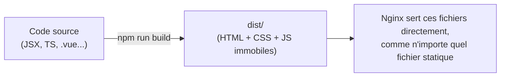
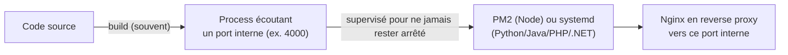

# Chapitre 6 — Déployer différents types d'applications

**Niveau : Intermédiaire**

---

## Introduction

Tout ce qui précède — Linux, Git, un serveur sécurisé, les logiciels installés — convergeait vers ce chapitre : faire tourner une vraie application, du code source jusqu'à une URL accessible depuis n'importe où dans le monde. Ce chapitre couvre douze technologies différentes, volontairement traitées ensemble plutôt qu'éparpillées, parce qu'elles se ramènent en réalité à seulement deux logiques de déploiement. Une fois ces deux logiques comprises, ajouter une treizième technologie non couverte ici — un futur framework qui n'existe pas encore à l'écriture de ce manuel — devient une question de quelques minutes de documentation, pas un nouvel apprentissage complet.

## 🎯 Objectifs pédagogiques

À la fin de ce chapitre, tu sauras déployer, du code source jusqu'à une URL publique fonctionnelle : un site statique HTML/CSS/JS ; une application React, Vue ou Angular ; une application Next.js ou Nuxt (rendu serveur) ; une API Express ou NestJS ; une application Laravel, Django, Spring Boot ou ASP.NET. Pour chacune : installation des outils, build, variables d'environnement, lancement, supervision du process (PM2 ou systemd selon le langage), reverse proxy. Tu sauras aussi, avant même d'ouvrir la documentation d'une techno inconnue, prédire à quelle famille de déploiement elle appartient.

## 📋 Prérequis

Chapitres 4 (serveur prêt) et 5 (logiciels installés) complétés. Si un logiciel mentionné ici (Node, PHP, Python, Java, .NET, nginx, PM2) n'est pas encore installé, retourner au chapitre 5 avant de continuer.

## Pourquoi ce chapitre est important

Un débutant qui apprend à déployer "React" puis "Express" comme deux mondes totalement séparés se retrouve démuni face à Vue, ou face à NestJS, ou face à n'importe quelle techno de demain. Ce chapitre enseigne délibérément le **modèle sous-jacent** avant le détail de chaque outil — c'est ce modèle qui reste valable indéfiniment, bien après que la syntaxe précise d'une commande CLI ait changé entre deux versions.

---

## Concepts fondamentaux

1. **Famille statique** — un build produit des fichiers immobiles, servis tels quels par nginx.
2. **Famille process continu** — un programme tourne en permanence, écoutant un port interne.
3. **Supervision** — PM2 pour Node, systemd pour tout le reste.
4. **Variables d'environnement build-time vs runtime** — figées dans le bundle pour le frontend statique, lues à chaque démarrage pour un process.
5. **Reverse proxy** — le seul point d'entrée public, quelle que soit la techno derrière.
6. **Cas particulier PHP** — ni statique ni process autonome, exécuté à la demande par php-fpm.

---

## Explications détaillées

### 6.0 Le modèle mental : deux familles de déploiement

Avant de traiter douze technologies une par une, il faut comprendre qu'elles se répartissent en réalité en **seulement deux familles**.

**Famille 1 — Fichiers statiques.** Certaines applications, une fois **buildées**, ne sont plus que des fichiers HTML/CSS/JS immobiles : aucun code ne s'exécute côté serveur pour générer la page. C'est le cas de HTML/CSS pur, React (mode standard), Vue, Angular.


> 📌 **À retenir** — Une application "statique" n'a **aucun process qui tourne en continu**. Pas de PM2, pas de port applicatif à faire écouter, pas de redémarrage à gérer.

**Famille 2 — Process qui tourne en continu.** D'autres applications exécutent du code **à chaque requête** : une API (Express, NestJS, Django, Laravel, Spring Boot, ASP.NET) ou une application à rendu serveur (Next.js, Nuxt en mode SSR).


> 📌 **À retenir** — Ici, un vrai programme tourne en permanence en arrière-plan. S'il plante, quelqu'un doit le relancer automatiquement — PM2 (chapitre 5, spécifique à Node) ou un **service systemd** (chapitre 4, applicable à n'importe quel langage).

> 💡 **Analogie** — La Famille 1, c'est une affiche imprimée : une fois posée, elle ne bouge plus, personne ne doit "l'actionner" pour qu'elle reste visible. La Famille 2, c'est un employé au guichet : quelqu'un doit être présent en permanence pour traiter chaque nouvelle demande, et s'il quitte son poste, il faut le remplacer immédiatement.

Chaque section ci-dessous précise à quelle famille appartient la techno traitée — cela seul détermine 80 % de la marche à suivre.

### 6.1 Site statique HTML/CSS/JS pur

**Famille 1 (statique).** Le cas le plus simple : aucun outil de build n'est même nécessaire si le site est déjà écrit en HTML/CSS/JS directement.

```bash
mkdir -p ~/sites/monsite
scp -r ./mon-site-local/* jaslin@ADRESSE_IP:~/sites/monsite/
```
```nginx
server {
    listen 80;
    server_name tondomaine.ht;
    root /home/jaslin/sites/monsite;
    index index.html;
}
```
```bash
sudo nano /etc/nginx/sites-available/monsite
sudo ln -s /etc/nginx/sites-available/monsite /etc/nginx/sites-enabled/
sudo nginx -t
sudo systemctl reload nginx
```
**Vérification :** `curl -I http://tondomaine.ht` doit répondre `200 OK`. HTTPS : entièrement couvert au chapitre 10, s'applique à l'identique pour tous les sites statiques.

### 6.2 React (via Vite)

**Famille 1 (statique).** React ne nécessite aucun process serveur en production dans son usage standard (hors Next.js, section 6.5, qui ajoute du rendu serveur).

**Installation (en local, pas sur le serveur — le build se fait avant déploiement) :**
```bash
npm create vite@latest mon-app -- --template react-ts
cd mon-app
npm install
```

**Variables d'environnement**, préfixe **obligatoire** `VITE_` :
```bash
VITE_API_URL=https://tondomaine.ht/api
```
> ⚠️ **Attention** — Vite (chapitre 1, section 1.10) injecte ces valeurs **au moment du build**, pas à l'exécution. Un changement de `.env.production` nécessite un nouveau `npm run build` — un simple redémarrage ne suffit pas puisqu'il n'y a pas de process à redémarrer.

```bash
npm run build
rsync -avz --delete dist/ jaslin@ADRESSE_IP:~/sites/mon-app/
```
`--delete` supprime côté serveur les fichiers qui n'existent plus dans le nouveau build.

**Reverse proxy nginx**, précision cruciale pour toute application **SPA** :
```nginx
server {
    listen 80;
    server_name tondomaine.ht;
    root /home/jaslin/sites/mon-app;
    index index.html;

    location / {
        try_files $uri $uri/ /index.html;
    }
}
```
> ❌ **Erreur fréquente** — Sans `try_files ... /index.html`, recharger la page sur une route interne (`tondomaine.ht/profil`) renvoie une 404 : nginx cherche un vrai fichier `/profil` inexistant, alors que React attend `index.html` dans tous les cas pour gérer lui-même le routage en JavaScript.

### 6.3 Vue

**Famille 1 (statique).** Déploiement identique en tout point à React (6.2) — seuls les outils diffèrent.

```bash
npm create vue@latest mon-app
cd mon-app
npm install
npm run build
```
Variables d'environnement : préfixe `VITE_` également (Vue moderne utilise Vite par défaut). Déploiement, reverse proxy, HTTPS : strictement identiques à la section 6.2.

### 6.4 Angular

**Famille 1 (statique).** Même famille, avec deux différences pratiques.

```bash
npm install -g @angular/cli
ng new mon-app
cd mon-app
```
**Variables d'environnement :** fichiers `environment.ts`/`environment.prod.ts` dans `src/environments/`, en TypeScript :
```typescript
export const environment = {
  production: true,
  apiUrl: 'https://tondomaine.ht/api'
};
```
```bash
ng build --configuration production
```
> ⚠️ **Attention, piège spécifique à Angular** — Depuis Angular 17+, le dossier généré est **`dist/mon-app/browser/`**, pas `dist/mon-app/` directement. Vérifier avec `ls dist/mon-app/` avant de configurer nginx — l'erreur la plus fréquente en déployant Angular (page blanche malgré un build réussi, `root` pointant sur le mauvais dossier).

Déploiement, reverse proxy, HTTPS : identiques à 6.2, `root` pointant vers `dist/mon-app/browser`.

### 6.5 Next.js

**Famille 2 (process).** Contrairement à React seul, Next.js en mode standard exécute du rendu serveur à chaque requête.

```bash
git clone git@github.com:tonorg/mon-app-next.git ~/app
cd ~/app
npm ci
```
**Variables d'environnement**, fichier `.env.production` :
```bash
NEXT_PUBLIC_API_URL=https://tondomaine.ht/api    # exposée au navigateur
DATABASE_URL=postgresql://...                     # reste côté serveur uniquement
```
> 📌 **À retenir** — Seules les variables préfixées `NEXT_PUBLIC_` sont envoyées au navigateur ; toutes les autres restent strictement côté serveur — utile pour des secrets que Next.js peut utiliser directement dans ses composants serveur, contrairement à Vite/React où tout ce qui est bundlé finit côté navigateur.

```bash
npm run build     # génère .next/
pm2 start npm --name "mon-app-next" -- start
pm2 save
```
```nginx
location / {
    proxy_pass http://localhost:3000;
    proxy_set_header Host $host;
    proxy_set_header X-Real-IP $remote_addr;
    proxy_set_header X-Forwarded-Proto $scheme;
}
```
**Vérification :** `pm2 logs mon-app-next --lines 30` et `curl -I http://localhost:3000`.

### 6.6 Nuxt

**Famille 2 (process).** Équivalent Vue de Next.js.

```bash
npm ci
npm run build      # génère .output/
pm2 start .output/server/index.mjs --name "mon-app-nuxt"
pm2 save
```
Variables d'environnement : préfixe `NUXT_PUBLIC_`, même logique que `NEXT_PUBLIC_`. Reverse proxy : identique à 6.5.

### 6.7 Express

**Famille 2 (process).**

```bash
git clone git@github.com:tonorg/mon-api.git ~/app
cd ~/app
npm ci
cp .env.example .env
nano .env                    # DATABASE_URL, JWT_SECRET, PORT, CORS_ORIGINS...
npm run build                # si TypeScript : génère dist/
pm2 start dist/server.js --name mon-api
pm2 save
```
```nginx
location /api {
    proxy_pass http://localhost:4000;
    proxy_set_header Host $host;
    proxy_set_header X-Real-IP $remote_addr;
    proxy_set_header X-Forwarded-For $proxy_add_x_forwarded_for;
    proxy_set_header X-Forwarded-Proto $scheme;
}
```
> 📌 **À retenir** — Docker est une alternative valable à cette installation directe pour Express comme pour tout le reste de ce chapitre — entièrement couverte aux chapitres 7 et 8, volontairement pas anticipée ici pour ne pas mélanger les deux approches avant d'avoir bien assimilé chacune séparément.

### 6.8 NestJS

**Famille 2 (process).** Même famille qu'Express (NestJS est construit par-dessus Express ou Fastify).

```bash
git clone git@github.com:tonorg/mon-api-nest.git ~/app
cd ~/app
npm ci
cp .env.example .env
nano .env
npm run build                # génère dist/main.js
pm2 start dist/main.js --name mon-api-nest
pm2 save
```
Reverse proxy : identique à 6.7, seul le fichier de démarrage change (`dist/main.js`).

### 6.9 Laravel (PHP)

**Famille 2, cas particulier.** Laravel ne se lance pas comme un process autonome : c'est **php-fpm** (chapitre 5) qui exécute le code à la demande, orchestré par nginx.

```bash
sudo apt install composer -y
git clone git@github.com:tonorg/mon-app-laravel.git ~/app
cd ~/app
composer install --no-dev --optimize-autoloader
```
`--no-dev` n'installe pas les dépendances de développement ; `--optimize-autoloader` génère une table de correspondance des classes optimisée.

```bash
cp .env.example .env
nano .env       # APP_ENV=production, APP_DEBUG=false, DB_*, ...
php artisan key:generate
```
> ⚠️ **Attention** — `APP_DEBUG=false` est **obligatoire** en production : à `true`, Laravel affiche la stack trace complète des erreurs à n'importe quel visiteur en cas de bug.

```bash
php artisan migrate --force
sudo chown -R www-data:www-data storage bootstrap/cache
sudo chmod -R 775 storage bootstrap/cache
php artisan config:cache
php artisan route:cache
```
`www-data` est l'utilisateur système sous lequel php-fpm/nginx exécutent le code.

```nginx
server {
    listen 80;
    server_name tondomaine.ht;
    root /home/jaslin/app/public;
    index index.php;

    location / {
        try_files $uri $uri/ /index.php?$query_string;
    }
    location ~ \.php$ {
        include snippets/fastcgi-php.conf;
        fastcgi_pass unix:/var/run/php/php8.3-fpm.sock;
    }
}
```

**Files d'attente**, un worker séparé géré via systemd (pas PM2) :
```ini
# /etc/systemd/system/laravel-worker.service
[Unit]
Description=Laravel Queue Worker
[Service]
User=www-data
ExecStart=/usr/bin/php /home/jaslin/app/artisan queue:work --sleep=3 --tries=3
Restart=always
[Install]
WantedBy=multi-user.target
```
```bash
sudo systemctl enable --now laravel-worker
```

### 6.10 Django (Python)

**Famille 2 (process).** Django ne sert pas le trafic en production via son serveur de développement — un serveur WSGI comme **Gunicorn** prend le relais.

```bash
git clone git@github.com:tonorg/mon-app-django.git ~/app
cd ~/app
python3 -m venv venv
source venv/bin/activate
pip install -r requirements.txt gunicorn
```
```bash
DEBUG=False
SECRET_KEY=...
DATABASE_URL=postgresql://...
ALLOWED_HOSTS=tondomaine.ht
```
> ⚠️ **Attention** — Comme Laravel, `DEBUG=False` est obligatoire en production, pour la même raison.

```bash
python manage.py migrate
python manage.py collectstatic --noinput
```
`collectstatic` rassemble tous les fichiers statiques en un seul dossier que nginx sert directement, sans passer par Python.

```ini
# /etc/systemd/system/mon-app-django.service
[Unit]
Description=Django app (Gunicorn)
After=network.target
[Service]
User=jaslin
WorkingDirectory=/home/jaslin/app
Environment="PATH=/home/jaslin/app/venv/bin"
ExecStart=/home/jaslin/app/venv/bin/gunicorn --workers 3 --bind 127.0.0.1:8000 monprojet.wsgi:application
Restart=always
[Install]
WantedBy=multi-user.target
```
```bash
sudo systemctl daemon-reload
sudo systemctl enable --now mon-app-django
```
```nginx
location /static/ {
    alias /home/jaslin/app/staticfiles/;
}
location / {
    proxy_pass http://127.0.0.1:8000;
    proxy_set_header Host $host;
    proxy_set_header X-Real-IP $remote_addr;
}
```

### 6.11 Spring Boot (Java)

**Famille 2 (process).** Se package en un unique fichier exécutable (`.jar`).

```bash
./mvnw clean package -DskipTests
```
Compiler idéalement en local ou en CI, pas sur le serveur (consomme beaucoup de ressources).
```bash
scp target/mon-app-*.jar jaslin@ADRESSE_IP:~/app/mon-app.jar
```
Spring Boot lit ses variables via `application.properties`/`.yml`, ou en variables d'environnement système — préférable en production pour ne jamais committer de secret dans le `.jar`.
```ini
# /etc/systemd/system/mon-app.service
[Unit]
Description=Spring Boot app
After=network.target
[Service]
User=jaslin
Environment="SPRING_DATASOURCE_URL=jdbc:postgresql://localhost:5432/nomapp"
Environment="SPRING_DATASOURCE_PASSWORD=motdepasse"
ExecStart=/usr/bin/java -jar /home/jaslin/app/mon-app.jar
Restart=always
[Install]
WantedBy=multi-user.target
```
```nginx
location / {
    proxy_pass http://localhost:8080;
    proxy_set_header Host $host;
}
```

### 6.12 ASP.NET (C#/.NET)

**Famille 2 (process).** Inclut son propre serveur web léger (**Kestrel**), placé derrière nginx en reverse proxy.

```bash
wget https://dot.net/v1/dotnet-install.sh
chmod +x dotnet-install.sh
./dotnet-install.sh --channel LTS --runtime aspnetcore
```
```bash
dotnet publish -c Release -o ./publish
```
Transférer `publish/` sur le serveur (`rsync` ou `scp`).
```ini
# /etc/systemd/system/mon-app.service
[Unit]
Description=ASP.NET app
After=network.target
[Service]
WorkingDirectory=/home/jaslin/app/publish
ExecStart=/usr/bin/dotnet /home/jaslin/app/publish/MonApp.dll
Restart=always
User=jaslin
Environment=ASPNETCORE_ENVIRONMENT=Production
Environment=ASPNETCORE_URLS=http://localhost:5000
[Install]
WantedBy=multi-user.target
```
```nginx
location / {
    proxy_pass http://localhost:5000;
    proxy_set_header Host $host;
    proxy_set_header X-Forwarded-For $proxy_add_x_forwarded_for;
    proxy_set_header X-Forwarded-Proto $scheme;
}
```

---

## Analogies clés de ce chapitre

| Notion | Analogie |
|---|---|
| Famille statique | Une affiche imprimée, posée une fois pour toutes |
| Famille process | Un employé au guichet, devant être remplacé s'il quitte son poste |
| Variables build-time (VITE_/NEXT_PUBLIC_) | Une étiquette imprimée sur l'emballage, fixée à la fabrication |
| Variables runtime | Une instruction lue à chaque ouverture du magasin |

---

## Étude de cas

**Contexte.** Un développeur freelance doit déployer, pour deux clients différents, un site vitrine React et une API Express avec base de données. Sans la distinction de ce chapitre, il pourrait être tenté d'installer PM2 pour le site React "au cas où", ou de chercher un dossier `dist/` à servir statiquement pour l'API Express.

**Avec le modèle de ce chapitre :** il identifie immédiatement le site React comme famille 1 (aucun PM2, nginx seul suffit, `try_files` pour le routage SPA) et l'API Express comme famille 2 (PM2 obligatoire, nginx en reverse proxy vers le port interne). Cette seule distinction, appliquée dès le départ, lui évite des heures de confusion et des questions mal posées lors d'une recherche en ligne.

---

## Bonnes pratiques (récapitulatif du chapitre)

- Identifier la famille (statique/process) avant de chercher la documentation spécifique d'une techno.
- `try_files ... /index.html` systématique pour toute SPA (React/Vue/Angular).
- Vérifier le dossier de build exact généré (`ls dist/`) avant de configurer nginx, en particulier pour Angular.
- `APP_DEBUG=false` / `DEBUG=False` non négociable en production (Laravel, Django).
- PM2 pour Node, systemd pour tout le reste — jamais l'inverse par habitude.
- Compiler Spring Boot et ASP.NET en local/CI, jamais sur le serveur de production lui-même.

---

## Erreurs fréquentes (récapitulatif du chapitre)

| Erreur | Pourquoi elle arrive | Conséquence |
|---|---|---|
| Oublier `try_files` sur une SPA | Notion non évidente sans ce chapitre | 404 au rechargement de toute route interne |
| Pointer `root` sur `dist/mon-app` au lieu de `dist/mon-app/browser` (Angular) | Changement de comportement depuis Angular 17 | Page blanche malgré un build réussi |
| `APP_DEBUG=true` / `DEBUG=True` laissé en production | Oubli après le développement local | Fuite d'informations sensibles dans les pages d'erreur |
| Lancer une app Node avec `npm start` dans un terminal, sans PM2 | Semble fonctionner immédiatement | Application arrêtée à la moindre déconnexion SSH |
| Compiler Spring Boot/ASP.NET directement sur le serveur de production | Semble plus simple | Consommation excessive de ressources pendant la compilation |

---

## Captures d'écran à réaliser

> 📸 **Capture 8**
> **Logiciel :** navigateur web
> **Pourquoi cette capture est utile :** valider visuellement, pour la toute première fois du manuel, qu'une vraie application (pas seulement une page nginx par défaut) est accessible publiquement.
> **Page/écran concerné :** l'application déployée, ouverte via l'adresse IP ou le domaine du serveur
> **Niveau de zoom conseillé :** 100 %
> **Montrer :** l'application fonctionnelle, la barre d'adresse avec l'IP/domaine
> **Entourer :** rien de spécifique, l'écran entier fait foi
> **Flouter/masquer :** l'adresse IP ou le domaine si jugé personnel

---

## Laboratoire pratique n°1 — Déployer une application statique

**Objectifs :** déployer une application React (ou Vue/Angular) jusqu'à une URL accessible.
**Prérequis :** chapitre 5 complété, projet React/Vue/Angular disponible (nouveau ou existant).
**Matériel nécessaire :** le VPS, un projet frontend local.

**Étapes :**
1. Build local (`npm run build`).
2. Transfert vers le serveur (`rsync -avz --delete`).
3. Configuration nginx avec `try_files ... /index.html`.
4. `sudo nginx -t && sudo systemctl reload nginx`.
5. Vérification depuis un navigateur externe.

**Résultat attendu :** l'application accessible et fonctionnelle, y compris après rechargement sur une route interne.
**Vérifications :** `curl -I http://ADRESSE_IP` renvoie `200`.
**Erreurs fréquentes :** 404 au rechargement d'une route interne — `try_files` manquant.
**Solutions :** relire la configuration nginx, section 6.2.

## Laboratoire pratique n°2 — Déployer une application "process" avec PM2

**Objectifs :** déployer une API Express ou NestJS, supervisée par PM2.
**Prérequis :** Laboratoire 1 complété, base de données disponible (chapitre 5).
**Matériel nécessaire :** le VPS, un projet backend Node local ou un dépôt de test.

**Étapes :**
1. Cloner le projet sur le serveur (chapitre 3).
2. Configurer `.env`.
3. `npm ci`, build si TypeScript.
4. `pm2 start ... --name mon-api`, `pm2 save`.
5. Configurer nginx en reverse proxy vers le port interne.
6. Vérifier `curl -I http://localhost:PORT` puis depuis l'extérieur.

**Résultat attendu :** l'API répond correctement via le domaine/IP public, jamais directement sur son port interne depuis l'extérieur.
**Vérifications :** `pm2 logs mon-api` ne montre aucune erreur ; le port interne n'apparaît pas dans `sudo ufw status`.
**Erreurs fréquentes :** oublier `pm2 save`, l'application ne redémarrant pas après un reboot.
**Solutions :** revoir le chapitre 5, section PM2 (`pm2 startup` + `pm2 save`).

## Laboratoire pratique n°3 — Déployer un service géré par systemd (non-Node)

**Objectifs :** déployer une application Django (ou Laravel/Spring Boot/ASP.NET), supervisée par systemd plutôt que PM2.
**Prérequis :** Laboratoire 2 complété, runtime correspondant installé (chapitre 5).
**Matériel nécessaire :** le VPS, un projet Django (ou équivalent) local ou un dépôt de test.

**Étapes :**
1. Cloner le projet, créer l'environnement virtuel, installer les dépendances.
2. Configurer les variables d'environnement, `DEBUG=False` confirmé.
3. Migrations et fichiers statiques.
4. Créer et activer le service systemd.
5. Configurer nginx en reverse proxy, avec le bloc `location /static/` dédié.

**Résultat attendu :** l'application répond via le domaine/IP public ; `systemctl status` confirme le service actif.
**Vérifications :** `sudo systemctl status mon-app-django` affiche "active (running)" ; les fichiers statiques (CSS/JS) se chargent correctement.
**Erreurs fréquentes :** oublier `collectstatic`, laissant l'interface d'administration Django sans mise en forme.
**Solutions :** relire la section 6.10, ré-exécuter `collectstatic` puis `sudo systemctl restart`.

---

## Exercices

1. Sans relire le chapitre, classe ces technos par famille (statique/process) : Vue, Django, HTML pur, NestJS, Angular, ASP.NET.
2. Pourquoi une variable `VITE_API_URL` changée après le build n'a-t-elle aucun effet tant qu'un nouveau build n'est pas fait ?
3. Explique pourquoi Laravel est un "cas particulier" qui ne rentre ni tout à fait dans la famille statique ni tout à fait dans la famille process.
4. Un stagiaire installe PM2 pour superviser une application Django. Explique-lui pourquoi ce choix, bien que techniquement possible, n'est pas la meilleure pratique.
5. Pourquoi compiler un projet Spring Boot ou ASP.NET directement sur le serveur de production est-il déconseillé ?

---

## Quiz

**Question 1.** Une application React standard (sans Next.js) appartient à quelle famille ?
a) Famille process, elle nécessite PM2
b) Famille statique, aucun process ne tourne en continu
c) Aucune des deux, elle est un cas particulier
d) Cela dépend de la version de React

**Question 2.** Pourquoi `try_files $uri $uri/ /index.html;` est-il nécessaire pour une SPA ?
a) Pour accélérer le chargement des images
b) Pour que nginx renvoie toujours `index.html`, laissant React/Vue/Angular gérer le routage côté navigateur
c) Pour activer la compression gzip
d) Pour rediriger automatiquement vers HTTPS

**Question 3.** Quel outil supervise une application Node.js en production dans ce manuel ?
a) systemd exclusivement
b) PM2
c) Aucun, Node n'en a pas besoin
d) Docker Compose obligatoirement

**Question 4.** Pourquoi Laravel ne suit-il ni le modèle statique ni le modèle "process autonome" classique ?
a) Laravel n'est pas un vrai framework de production
b) php-fpm exécute le code PHP à la demande, orchestré par nginx via FastCGI
c) Laravel nécessite toujours Docker
d) Laravel s'exécute exclusivement côté client

**Question 5.** `APP_DEBUG=false` (Laravel) est obligatoire en production parce que :
a) Ça améliore les performances de façon significative
b) `true` affiche la stack trace complète des erreurs à n'importe quel visiteur
c) C'est requis pour que `php artisan migrate` fonctionne
d) Cela n'a aucun impact réel

> 🔑 **Corrigé** — 1: b · 2: b · 3: b · 4: b · 5: b

---

## 📝 Résumé du chapitre

- Toute application se range dans l'une de deux familles : **statique** (build une fois, nginx sert des fichiers immobiles) ou **process continu** (un programme tourne en permanence).
- PM2 supervise les process Node.js ; systemd supervise tout le reste (Python, PHP, Java, C#).
- Laravel est un cas particulier : php-fpm exécute le code à la demande, orchestré par nginx.
- Dans tous les cas "process", nginx reste le seul point d'entrée public, redirigeant en interne vers le port applicatif.
- Les variables d'environnement suivent la même philosophie partout, mais leur portée (client vs serveur) varie : `VITE_`/`NEXT_PUBLIC_`/`NUXT_PUBLIC_` pour ce qui doit atteindre le navigateur.

## ✅ Checklist avant de passer au chapitre 7

- [ ] Je sais dire, pour n'importe quelle techno de ce chapitre, si elle appartient à la famille statique ou process, et pourquoi.
- [ ] J'ai déployé au moins une application statique avec succès, `try_files` compris.
- [ ] J'ai déployé au moins une application "process" avec PM2 **ou** systemd, et je sais lire ses logs.
- [ ] Je comprends pourquoi `APP_DEBUG=false`/`DEBUG=False` est obligatoire en production.
- [ ] J'ai réalisé les trois laboratoires et obtenu au moins 4/5 au quiz.

---

## Glossaire du chapitre

**SPA (Single Page Application)**
Définition simple : une application web dont le routage entre les "pages" se fait côté navigateur, sans rechargement complet.
Définition technique : une application où le serveur renvoie toujours le même point d'entrée HTML, le JavaScript prenant en charge le rendu des différentes vues via une bibliothèque de routage côté client.
Exemple concret : React Router, gérant `/profil` sans jamais demander ce chemin exact au serveur.
Voir : Chapitre 6, section 6.2.

**WSGI (Web Server Gateway Interface)**
Définition simple : le pont standard entre un serveur web et une application Python.
Définition technique : une spécification définissant l'interface entre un serveur web et une application Python, implémentée par des serveurs comme Gunicorn.
Exemple concret : `gunicorn monprojet.wsgi:application`.
Voir : Chapitre 6, section 6.10.

**Kestrel**
Définition simple : le serveur web intégré à ASP.NET Core.
Définition technique : un serveur HTTP multiplateforme léger, conçu pour tourner derrière un reverse proxy en production plutôt qu'exposé directement.
Exemple concret : `ASPNETCORE_URLS=http://localhost:5000`.
Voir : Chapitre 6, section 6.12.

---

## ❓ FAQ

**Next.js peut-il aussi être "statique" ?**
Oui, avec `output: 'export'` dans sa configuration, Next.js peut générer un export purement statique si aucune fonctionnalité serveur n'est utilisée — il rejoint alors la famille 1, déployée exactement comme la section 6.2. Ce manuel couvre le mode standard (SSR), le plus fréquent en pratique.

**Peut-on utiliser PM2 pour superviser une application Python ou Java plutôt que systemd ?**
Techniquement oui, mais ce n'est pas l'usage le plus répandu ni le mieux documenté pour ces langages — systemd, déjà maîtrisé depuis le chapitre 4, est le choix le plus standard et robuste pour tout ce qui n'est pas Node.js.

**Pourquoi ne pas juste tout faire tourner avec Docker plutôt que d'installer chaque runtime sur le serveur ?**
Approche parfaitement valide, développée aux chapitres 7 et 8 juste après celui-ci. Ce manuel présente d'abord l'installation directe pour bien comprendre ce qui se passe sous le capot, avant d'ajouter la couche d'abstraction Docker.

---

## Références officielles

- Vite — Building for Production — [vitejs.dev/guide/build](https://vitejs.dev/guide/build.html)
- Next.js Deployment — [nextjs.org/docs/deployment](https://nextjs.org/docs/app/building-your-application/deploying)
- Laravel Deployment — [laravel.com/docs/deployment](https://laravel.com/docs/deployment)
- Django Deployment Checklist — [docs.djangoproject.com/en/stable/howto/deployment/checklist](https://docs.djangoproject.com/en/stable/howto/deployment/checklist/)
- Spring Boot — Deploying to production — [docs.spring.io/spring-boot/reference/deployment](https://docs.spring.io/spring-boot/reference/deployment/index.html)
- ASP.NET Core — Host and deploy — [learn.microsoft.com/aspnet/core/host-and-deploy](https://learn.microsoft.com/en-us/aspnet/core/host-and-deploy/)

---

## Conclusion

Douze technologies, une seule grille de lecture. Le chapitre 7 va maintenant introduire une troisième option, transversale à tout ce qui précède : plutôt que d'installer chaque runtime directement sur le système, tout empaqueter dans des containers Docker, isolés et reproductibles.

---

⬅️ [Chapitre 5 — Installation des logiciels](05-installation-logiciels.md) · ➡️ **Suite : [Chapitre 7 — Docker, cours complet](07-docker.md)**
