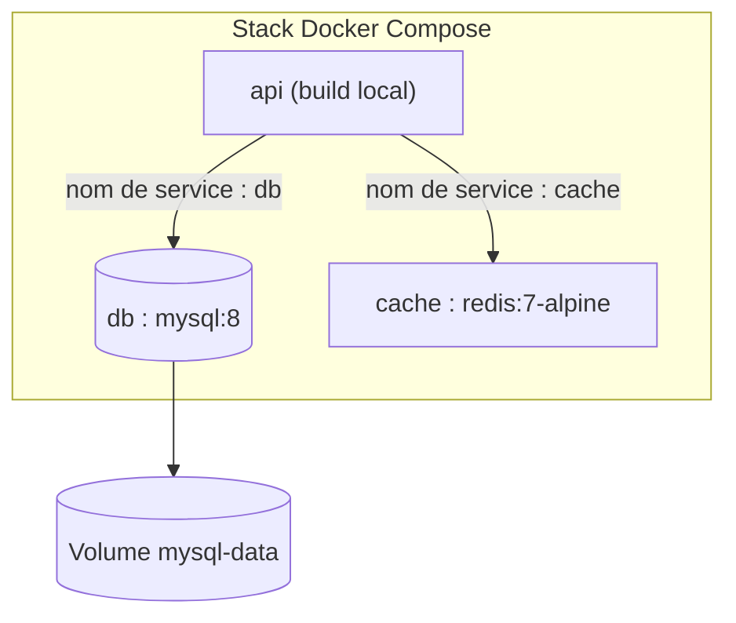
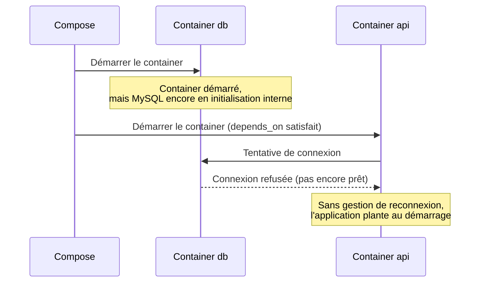

# Chapitre 8 — Docker Compose

**Niveau : Intermédiaire**

---

## Introduction

Le chapitre 7 a montré comment lancer un container à la fois, avec des commandes `docker run` de plus en plus longues à mesure que les options s'accumulent (réseau, volumes, variables d'environnement, ports). Dès qu'une application a plusieurs composants — une API, une base de données, un cache — cette approche devient vite ingérable : mémoriser et retaper plusieurs commandes complexes dans le bon ordre, à chaque redémarrage, à chaque nouveau développeur qui rejoint le projet. Docker Compose résout précisément ce problème.

## 🎯 Objectifs pédagogiques

À la fin de ce chapitre, tu sauras : expliquer pourquoi Docker Compose devient indispensable dès qu'une application a plus d'un composant ; écrire un fichier `docker-compose.yml` complet pour une application multi-services ; comprendre comment Compose crée automatiquement un réseau et permet à chaque service de joindre les autres par leur nom ; gérer les variables d'environnement via un fichier `.env` dédié à Compose ; comprendre les limites réelles de `depends_on` et les compléter avec un healthcheck ; maîtriser le cycle de vie complet d'une stack Compose (`up`, `down`, `logs`, `exec`) ; redéployer une nouvelle version d'une application sans perdre les données ; distinguer une configuration Compose de développement d'une configuration de production.

## 📋 Prérequis

Chapitre 7 (Docker) entièrement complété — ce chapitre suppose la maîtrise des images, containers, volumes et réseau Docker, qu'il ne réexplique pas.

## Pourquoi ce chapitre est important

La quasi-totalité des applications réelles de ce manuel (chapitre 6) ont plus d'un composant : une API et une base de données, au minimum. Docker Compose est l'outil que tu utiliseras concrètement, au quotidien, dès que Docker entre en jeu — bien plus que des commandes `docker run` isolées. Maîtriser Compose, c'est pouvoir démarrer un projet entier, sur n'importe quelle machine, en une seule commande.

---

## Concepts fondamentaux

1. **Fichier déclaratif** — l'état voulu de la stack entière décrit une fois, appliqué automatiquement.
2. **Service** — un composant de l'application (correspond à un container).
3. **Réseau et volumes implicites** — Compose les crée automatiquement, sans configuration manuelle.
4. **`depends_on`** — garantit un ordre de démarrage, pas une disponibilité réelle.
5. **Healthcheck** — un mécanisme pour vérifier qu'un service est réellement prêt, au-delà du simple démarrage de son container.
6. **Environnement dev vs production** — un même fichier de base, des ajustements ciblés selon le contexte.

---

## Explications détaillées

### 8.1 Pourquoi Docker Compose

> 💡 **Analogie** — Lancer chaque container séparément avec `docker run`, c'est comme allumer individuellement chaque appareil d'une pièce de home cinéma, dans le bon ordre, à chaque fois. Docker Compose, c'est la télécommande unique qui allume tout, dans le bon ordre, en appuyant sur un seul bouton.

Sans Compose, faire tourner une API avec sa base de données nécessite une séquence de commandes comme celle vue au chapitre 7 (section 7.7) — à retaper, dans le bon ordre, à chaque démarrage, sur chaque machine. Compose remplace cette séquence par un seul fichier, versionné avec le code, exécuté par une seule commande.

### 8.2 Anatomie d'un `docker-compose.yml`

**Exemple complet, une API Express + MySQL + Redis :**
```yaml
services:
  api:
    build: .
    ports:
      - "4000:4000"
    environment:
      DATABASE_URL: mysql://nomapp_user:${DB_PASSWORD}@db:3306/nomapp
      REDIS_URL: redis://cache:6379
    depends_on:
      db:
        condition: service_healthy
      cache:
        condition: service_started
    restart: unless-stopped

  db:
    image: mysql:8
    environment:
      MYSQL_DATABASE: nomapp
      MYSQL_USER: nomapp_user
      MYSQL_PASSWORD: ${DB_PASSWORD}
      MYSQL_ROOT_PASSWORD: ${DB_ROOT_PASSWORD}
    volumes:
      - mysql-data:/var/lib/mysql
    healthcheck:
      test: ["CMD", "mysqladmin", "ping", "-h", "localhost"]
      interval: 5s
      timeout: 5s
      retries: 5
    restart: unless-stopped

  cache:
    image: redis:7-alpine
    restart: unless-stopped

volumes:
  mysql-data:
```

**Décomposition, ligne par ligne :**
- `services:` — chaque bloc en dessous correspond à un container.
- `build: .` — construit l'image depuis le `Dockerfile` local (contrairement à `image: mysql:8`, qui télécharge une image publiée sur Docker Hub, chapitre 7 section 7.1).
- `${DB_PASSWORD}` — une variable lue depuis un fichier `.env` (section 8.4), jamais écrite en dur.
- `depends_on` avec `condition: service_healthy` — attend que le `healthcheck` de `db` confirme un état réellement prêt, pas seulement démarré (approfondi en 8.5).
- `healthcheck` — une commande exécutée périodiquement à l'intérieur du container pour vérifier son état réel.
- `restart: unless-stopped` — redémarre automatiquement un service qui plante, sauf s'il a été arrêté volontairement — équivalent Compose de ce que PM2 (chapitre 5) fait pour un process Node classique.
- `volumes:` (en bas du fichier) — déclare le volume nommé utilisé par `db`.


**Explication du diagramme :** les trois services vivent dans un réseau Compose créé automatiquement (section 8.3), chacun joignable par les autres via son nom déclaré dans le fichier — exactement le mécanisme du réseau Docker déjà vu au chapitre 7, mais sans aucune commande `docker network create` manuelle.

### 8.3 Services, réseaux, volumes automatiques

Un réseau Docker Compose est créé **automatiquement** à chaque `docker compose up`, avec chaque service joignable par son nom (`db`, `cache`), comme au chapitre 7 (section 7.7) mais sans configuration manuelle.

> 📌 **À retenir** — Le nom du réseau généré suit le motif `nomdudossier_default`. Il n'est presque jamais nécessaire de le connaître explicitement, sauf pour connecter un container externe à cette stack — un cas avancé, rare en pratique.

### 8.4 Variables d'environnement et fichier `.env`

Compose lit automatiquement un fichier `.env` placé à la racine du projet, à côté du `docker-compose.yml` :
```bash
# .env (jamais commité, rappel chapitre 3)
DB_PASSWORD=motdepasse-fort
DB_ROOT_PASSWORD=motdepasse-root-different
```
Ces valeurs remplacent alors `${DB_PASSWORD}` et `${DB_ROOT_PASSWORD}` dans `docker-compose.yml` au moment de l'exécution.

> ⚠️ **Attention** — Le fichier `.env` de Compose doit être ajouté au `.gitignore` (chapitre 3, section 3.10) exactement comme n'importe quel autre fichier de secrets. Un `docker-compose.yml` peut être committé sans risque (il ne contient que des noms de variables, jamais leurs valeurs) — c'est précisément l'intérêt de cette séparation.

### 8.5 Dépendances entre services : `depends_on` et ses limites

**Ce que `depends_on` garantit réellement :** l'ordre de **démarrage** des containers — `db` démarre avant `api`.

**Ce que `depends_on` ne garantit PAS**, sans healthcheck : que `db` soit **prêt à accepter des connexions** au moment où `api` démarre. Un service de base de données peut mettre plusieurs secondes à devenir réellement opérationnel après le démarrage de son container (initialisation interne, création des tables système) — un délai que `depends_on` seul ignore complètement.


**Explication du diagramme :** c'est précisément ce risque que corrige `condition: service_healthy` (section 8.2), en attendant que le `healthcheck` de `db` confirme un état réellement opérationnel, pas seulement un container démarré.

> ✅ **Bonne pratique** — Même avec un healthcheck bien configuré, une application robuste doit gérer une tentative de reconnexion à son démarrage (une bibliothèque comme Prisma le fait déjà nativement pour la plupart des bases de données) — le healthcheck réduit le risque, il ne l'élimine pas à 100 % dans tous les cas de figure.

### 8.6 Cycle de vie : `up`, `down`, `logs`, `exec`

#### `docker compose up`
**Description :** construit (si nécessaire) et démarre tous les services définis.
**Syntaxe :** `docker compose up [-d] [--build]`
**Options principales :** `-d` (arrière-plan), `--build` (force la reconstruction des images avant démarrage).
**Cas d'utilisation :** démarrage initial ou redémarrage complet d'une stack.
**Exemple :**
```bash
docker compose up -d
```
**Résultat attendu :** chaque service listé avec son statut de démarrage, se terminant par tous les containers "Started" ou "Running".
**Explication du résultat :** Compose respecte l'ordre de `depends_on`, créant d'abord le réseau et les volumes déclarés, puis chaque container dans l'ordre de dépendance.
**Erreurs possibles :** `port is already allocated` si un port publié est déjà utilisé sur la machine hôte.
**Vérification :** `docker compose ps`.
**Cas pratiques :** commande la plus utilisée de ce chapitre, au quotidien.

#### `docker compose down`
**Description :** arrête et supprime les containers et le réseau de la stack.
**Syntaxe :** `docker compose down [-v]`
**Options principales :** `-v` (supprime aussi les volumes nommés — irréversible).
**Cas d'utilisation :** arrêt complet d'une stack, avant un redéploiement ou en fin de session de développement.
**Exemple :**
```bash
docker compose down
```
**Résultat attendu :** confirmation de suppression de chaque container et du réseau.
**Explication du résultat :** sans `-v`, les volumes nommés (donc les données) survivent — seuls les containers et le réseau disparaissent.
**Erreurs possibles :** aucune en usage normal.
**Vérification :** `docker compose ps` ne montre plus aucun service ; `docker volume ls` confirme que les volumes nommés existent toujours (sans `-v`).
**Cas pratiques :** `docker compose down` puis `docker compose up -d` est le cycle normal de redéploiement (section 8.7) — jamais `-v` dans ce contexte, sous peine de perdre les données.

```bash
docker compose ps               # état de tous les services
docker compose logs -f api      # logs d'un seul service, en temps réel
docker compose exec api sh      # shell interactif dans un service en cours d'exécution
```

### 8.7 Redéploiement d'une nouvelle version

```bash
cd ~/app
git pull origin main
docker compose up -d --build
```
**Ce que fait cette séquence :** `git pull` récupère le nouveau code (chapitre 3) ; `docker compose up -d --build` reconstruit les images dont le `Dockerfile` ou le contexte de build a changé, puis recrée uniquement les containers concernés — les services inchangés (comme `db`, dont l'image `mysql:8` n'a pas changé) ne sont pas redémarrés inutilement.

> 📌 **À retenir** — Ce cycle ne touche jamais aux volumes nommés : les données de `db` survivent intégralement à travers chaque redéploiement, exactement comme démontré au Laboratoire 2 du chapitre 7.

### 8.8 Compose en développement vs en production

Une même base de fichier, avec des ajustements ciblés selon le contexte, plutôt que deux fichiers totalement séparés et divergents.

**`docker-compose.yml`** (base commune, utilisée partout) :
```yaml
services:
  api:
    build: .
    environment:
      DATABASE_URL: mysql://nomapp_user:${DB_PASSWORD}@db:3306/nomapp
    depends_on:
      db:
        condition: service_healthy
  db:
    image: mysql:8
    volumes:
      - mysql-data:/var/lib/mysql
volumes:
  mysql-data:
```

**`docker-compose.override.yml`** (chargé automatiquement en plus du fichier de base, pour le développement local uniquement) :
```yaml
services:
  api:
    ports:
      - "4000:4000"
    volumes:
      - ./src:/app/src       # montage du code source local pour le rechargement à chaud
    command: npm run dev
```
**Explication :** Docker Compose charge automatiquement `docker-compose.override.yml` s'il existe, en le fusionnant avec `docker-compose.yml` — sans action supplémentaire en développement local. En production, seul `docker-compose.yml` est présent (ou un fichier de production explicite appelé avec `-f`), sans le montage de code source ni le mode développement.

> ✅ **Bonne pratique** — Ne jamais monter le code source local (`volumes: - ./src:/app/src`) en production : l'image doit contenir une copie figée et vérifiée du code, pas un lien vivant vers un dossier modifiable sur le serveur.

---

## Analogies clés de ce chapitre

| Notion | Analogie |
|---|---|
| Docker Compose | La télécommande unique d'un home cinéma, plutôt qu'allumer chaque appareil un par un |
| `depends_on` sans healthcheck | Un livreur qui sonne à la porte avant même que quelqu'un soit rentré chez soi |
| Healthcheck | Le livreur qui attend une vraie réponse avant de considérer la livraison possible |
| `docker-compose.override.yml` | Une note ajoutée temporairement sur un plan, sans modifier le plan original |

---

## Étude de cas

**Contexte.** Une petite équipe de trois développeurs travaille sur un projet identique à l'étude de cas du chapitre 7 (API + PostgreSQL), mais avec en plus un cache Redis pour les sessions. Sans Compose, chaque développeur devrait retenir et exécuter trois commandes `docker run` distinctes, dans le bon ordre, avec les bonnes options réseau — une source d'erreurs et de "chez moi ça ne marche pas" à l'intérieur même de l'équipe.

**Avec Compose :** un seul `docker-compose.yml`, committé avec le code, décrit toute la stack. Un nouveau développeur qui rejoint l'équipe clone le dépôt (chapitre 3), copie un `.env.example` vers `.env`, et lance `docker compose up -d` — il obtient en une commande exactement le même environnement que ses collègues, sans avoir à comprendre chaque option Docker individuellement dans l'immédiat.

---

## Bonnes pratiques (récapitulatif du chapitre)

- Un `docker-compose.yml` committé, un `.env` jamais committé (rappel chapitre 3).
- `condition: service_healthy` plutôt qu'un `depends_on` nu, dès qu'un service met du temps à devenir réellement disponible.
- `docker compose down` sans `-v` pour un redéploiement normal — `-v` uniquement en toute connaissance de cause.
- Un `docker-compose.override.yml` pour les ajustements de développement, jamais mélangés au fichier de base destiné à la production.
- Jamais de montage de code source local (`volumes`) en production.

---

## Erreurs fréquentes (récapitulatif du chapitre)

| Erreur | Pourquoi elle arrive | Conséquence |
|---|---|---|
| Compter sur `depends_on` seul pour la disponibilité réelle | Documentation lue trop vite | Application qui plante au démarrage, base "pas encore prête" |
| `docker compose down -v` par réflexe | Confondu avec un simple arrêt | Perte définitive des données |
| `.env` de Compose committé par erreur | `.gitignore` incomplet | Secrets exposés dans l'historique Git |
| Monter le code source local en production | Configuration de dev copiée telle quelle | Le serveur exécute un code potentiellement différent de l'image censée être en production |

---

## Captures d'écran à réaliser

> 📸 **Capture 10**
> **Logiciel :** terminal
> **Pourquoi cette capture est utile :** montrer le résultat de `docker compose ps`, la commande de vérification la plus utilisée au quotidien avec Compose.
> **Page/écran concerné :** terminal après `docker compose up -d` puis `docker compose ps`
> **Niveau de zoom conseillé :** 100 %
> **Montrer :** la liste des services avec leur statut ("running", "healthy")
> **Entourer :** la colonne de statut
> **Flouter/masquer :** rien de sensible sur cet écran

---

## Laboratoire pratique n°1 — Écrire un Compose complet API + base de données

**Objectifs :** écrire et démarrer un `docker-compose.yml` à deux services, avec healthcheck.
**Prérequis :** chapitre 7 complété, image `mon-api:1.0` ou équivalent disponible.
**Matériel nécessaire :** Docker, un projet avec `Dockerfile`.

**Étapes :**
1. Écris un `docker-compose.yml` avec deux services : `api` (build local) et `db` (PostgreSQL ou MySQL).
2. Ajoute un `healthcheck` sur `db`.
3. Utilise `condition: service_healthy` dans `depends_on` de `api`.
4. Crée un `.env` avec les mots de passe, ajouté au `.gitignore`.
5. Lance `docker compose up -d`, observe l'ordre de démarrage avec `docker compose logs -f`.

**Résultat attendu :** `api` démarre seulement après que `db` soit signalée "healthy", jamais avant.
**Vérifications :** `docker compose ps` montre `db` en "healthy" avant que `api` passe à "running".
**Erreurs fréquentes :** healthcheck mal écrit (commande inexistante dans l'image de base), restant indéfiniment "unhealthy".
**Solutions :** tester la commande du healthcheck manuellement via `docker compose exec db la-commande`.

## Laboratoire pratique n°2 — Ajouter un cache Redis au Compose existant

**Objectifs :** étendre une stack existante avec un troisième service.
**Prérequis :** Laboratoire 1 complété.
**Matériel nécessaire :** le `docker-compose.yml` du Laboratoire 1.

**Étapes :**
1. Ajoute un service `cache` basé sur `redis:7-alpine`.
2. Ajoute `cache` aux `depends_on` de `api`.
3. Ajoute une variable `REDIS_URL` à `api`, pointant vers `redis://cache:6379`.
4. Relance avec `docker compose up -d`.
5. Vérifie la connexion depuis `api` (`docker compose exec api sh`, puis un outil de test réseau simple si disponible, ou consultation des logs applicatifs confirmant la connexion Redis).

**Résultat attendu :** trois services actifs, `api` connectée à la fois à `db` et `cache`.
**Vérifications :** `docker compose ps` montre les trois services "running"/"healthy".
**Erreurs fréquentes :** oublier de redémarrer `api` après l'ajout de `cache`, la variable `REDIS_URL` n'étant alors jamais lue.
**Solutions :** `docker compose up -d` recrée automatiquement les services dont la configuration a changé — vérifier que c'est bien le cas avec `docker compose ps` (colonne "Created" récente).

## Laboratoire pratique n°3 — Simuler un redéploiement de nouvelle version sans perte de données

**Objectifs :** confirmer qu'un cycle complet de redéploiement Compose préserve les données.
**Prérequis :** Laboratoires 1 et 2 complétés.
**Matériel nécessaire :** la stack complète des laboratoires précédents.

**Étapes :**
1. Insère une donnée de test dans la base (via l'API, ou directement via `docker compose exec db`).
2. Modifie légèrement le code de l'API (un message de log, par exemple), committe (chapitre 3).
3. Exécute le cycle de redéploiement complet : `docker compose down` (sans `-v`) puis `docker compose up -d --build`.
4. Vérifie que la donnée de test insérée à l'étape 1 est toujours présente.

**Résultat attendu :** la nouvelle version du code est active, la donnée de test toujours présente.
**Vérifications :** `docker compose logs api` confirme la nouvelle version (le message de log modifié apparaît) ; une requête vers la base confirme la donnée toujours là.
**Erreurs fréquentes :** utiliser `-v` par réflexe lors du `down`, perdant les données par erreur.
**Solutions :** faire de `docker compose down` (sans `-v`) le réflexe par défaut, `-v` restant une action exceptionnelle et consciente.

---

## Exercices

1. Explique pourquoi `depends_on` seul ne garantit pas qu'une base de données soit prête à accepter des connexions.
2. Un fichier `docker-compose.yml` peut-il être committé sur Git sans risque ? Justifie ta réponse en fonction de son contenu réel.
3. Quelle est la différence entre `docker compose down` et `docker compose down -v` ? Donne un exemple de situation où chacune est appropriée.
4. Pourquoi ne faut-il jamais monter le code source local dans un container en production ?
5. Explique comment `docker-compose.override.yml` permet de garder une seule base de configuration tout en ayant un comportement différent en développement.

---

## Quiz

**Question 1.** Que garantit `depends_on` sans `condition: service_healthy` ?
a) Que le service dépendant est réellement prêt à recevoir des connexions
b) Uniquement l'ordre de démarrage des containers
c) Rien du tout, c'est purement informatif
d) Que les deux services partagent automatiquement leurs données

**Question 2.** Où doivent vivre les valeurs sensibles utilisées dans un `docker-compose.yml` ?
a) Directement écrites dans le fichier `docker-compose.yml`
b) Dans un fichier `.env` séparé, non commité
c) Dans les commentaires du fichier
d) Peu importe, Compose les chiffre automatiquement

**Question 3.** `docker compose down -v` :
a) Est strictement identique à `docker compose down`
b) Supprime aussi les volumes nommés, donc les données
c) Ne supprime que les images
d) Redémarre simplement les services

**Question 4.** `docker-compose.override.yml` est utilisé pour :
a) Remplacer complètement `docker-compose.yml`
b) Ajouter des ajustements (souvent de développement) fusionnés automatiquement avec le fichier de base
c) Définir les secrets de production
d) Configurer uniquement le réseau

**Question 5.** Pourquoi ajouter un `healthcheck` à un service de base de données dans Compose ?
a) Pour accélérer son démarrage
b) Pour permettre à `depends_on` de vraiment attendre qu'elle soit opérationnelle, pas seulement démarrée
c) C'est purement décoratif dans l'interface
d) Pour chiffrer automatiquement les données

> 🔑 **Corrigé** — 1: b · 2: b · 3: b · 4: b · 5: b

---

## 📝 Résumé du chapitre

- Docker Compose remplace une série de commandes `docker run` complexes par un seul fichier déclaratif, versionné avec le code.
- Compose crée automatiquement un réseau et permet à chaque service de joindre les autres par leur nom.
- Les secrets vivent dans un `.env` séparé, jamais dans `docker-compose.yml` lui-même.
- `depends_on` seul ne garantit que l'ordre de démarrage — un `healthcheck` avec `condition: service_healthy` garantit une réelle disponibilité.
- `docker compose down` préserve les volumes nommés ; seul `-v` les supprime, à utiliser en toute connaissance de cause.
- Un `docker-compose.override.yml` permet des ajustements de développement sans dupliquer ni modifier le fichier de base destiné à la production.

## ✅ Checklist avant de passer au chapitre 9

- [ ] J'ai écrit et lancé un `docker-compose.yml` avec au moins deux services communiquant par leur nom.
- [ ] J'ai ajouté un healthcheck et compris pourquoi `depends_on` seul ne suffit pas toujours.
- [ ] Je sais où placer les secrets d'une stack Compose.
- [ ] J'ai réalisé un cycle complet `down`/`up --build` sans perdre de données.
- [ ] Je comprends la différence entre une configuration Compose de développement et de production.
- [ ] J'ai réalisé les trois laboratoires et obtenu au moins 4/5 au quiz.

---

## Glossaire du chapitre

**Service (Compose)**
Définition simple : un composant de l'application décrit dans `docker-compose.yml`, correspondant à un container.
Définition technique : une entrée sous la clé `services:`, définissant l'image ou le contexte de build, les variables d'environnement, les ports, les volumes et les dépendances d'un container géré par Compose.
Exemple concret : le service `api` du fichier de la section 8.2.
Voir : Chapitre 8, section 8.2.

**Healthcheck**
Définition simple : un test périodique confirmant qu'un service est réellement opérationnel, pas seulement démarré.
Définition technique : une commande exécutée à intervalle régulier à l'intérieur d'un container, dont le code de sortie détermine l'état "healthy"/"unhealthy" rapporté à Compose et exploitable par `depends_on`.
Exemple concret : `mysqladmin ping` pour un service MySQL.
Voir : Chapitre 8, section 8.5.

**Override (Compose)**
Définition simple : un fichier d'ajustements fusionné automatiquement avec la configuration de base.
Définition technique : `docker-compose.override.yml`, chargé par défaut en plus de `docker-compose.yml`, permettant de surcharger ou compléter certains champs sans dupliquer tout le fichier.
Exemple concret : monter le code source local uniquement en développement.
Voir : Chapitre 8, section 8.8.

---

## ❓ FAQ

**Peut-on utiliser Docker Compose en production, ou est-ce réservé au développement local ?**
Compose est tout à fait utilisable en production pour un serveur unique (c'est l'approche retenue dans plusieurs études de cas de la Partie X de ce manuel). Pour une charge nécessitant plusieurs serveurs coordonnés, des outils d'orchestration plus avancés (Kubernetes, Docker Swarm) prennent le relais — hors du périmètre de ce manuel, volontairement centré sur un serveur unique bien maîtrisé.

**Faut-il un `Dockerfile` séparé pour chaque service, même ceux basés sur une image officielle comme `mysql:8` ?**
Non — un service utilisant directement une image publiée (`image: mysql:8`) n'a besoin d'aucun `Dockerfile` propre ; celui-ci n'est nécessaire que pour les services construits depuis du code source local (`build: .`).

**Que se passe-t-il si je modifie `docker-compose.yml` sans relancer `docker compose up -d` ?**
Rien — Compose ne surveille pas le fichier en continu. Toute modification nécessite un nouveau `docker compose up -d` (ou `docker compose restart` pour certains changements) pour être appliquée.

---

## Références officielles

- Docker Compose Documentation — [docs.docker.com/compose](https://docs.docker.com/compose/)
- Compose File Reference — [docs.docker.com/reference/compose-file](https://docs.docker.com/reference/compose-file/)
- Compose — Healthcheck — [docs.docker.com/reference/compose-file/services/#healthcheck](https://docs.docker.com/reference/compose-file/services/#healthcheck)
- Compose — Merge and override — [docs.docker.com/compose/how-tos/multiple-compose-files/merge](https://docs.docker.com/compose/how-tos/multiple-compose-files/merge/)

---

## Conclusion

Docker Compose clôt la Partie III du manuel : d'un serveur vide au chapitre 4 jusqu'à une application multi-services, conteneurisée, démarrable en une seule commande, reproductible sur n'importe quelle machine. La Partie IV va maintenant se concentrer sur ce qui expose cette application au monde extérieur, de façon robuste et chiffrée : Nginx et HTTPS.

---

⬅️ [Chapitre 7 — Docker, cours complet](07-docker.md) · ➡️ **Suite : [Chapitre 9 — Configuration de Nginx](09-nginx.md)**
