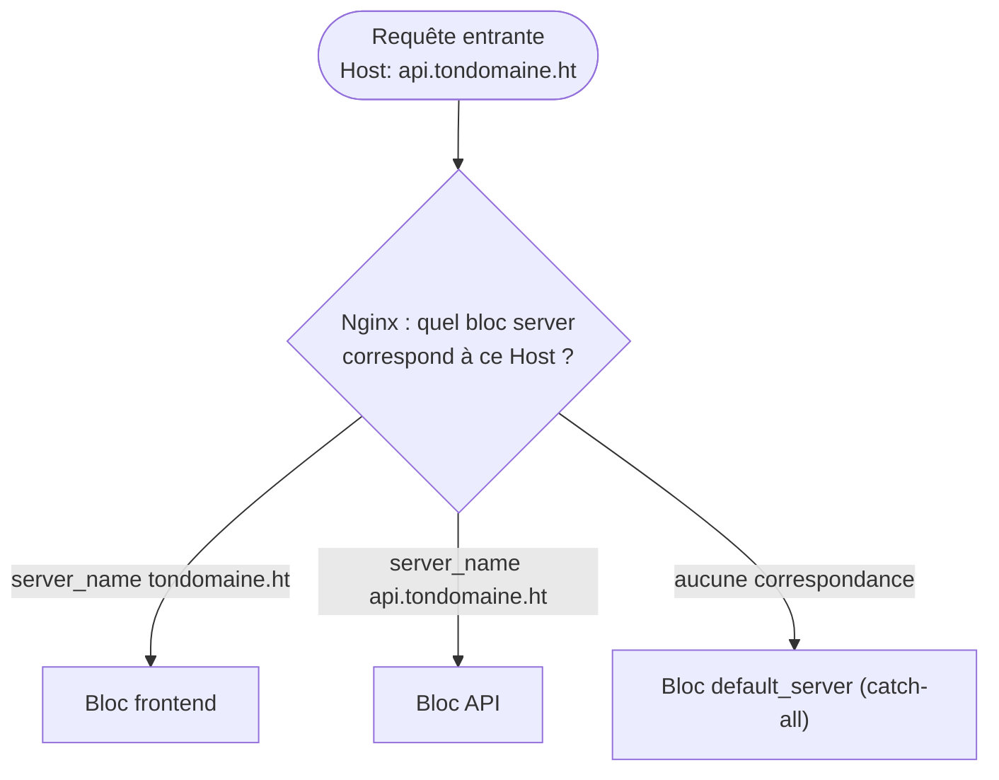
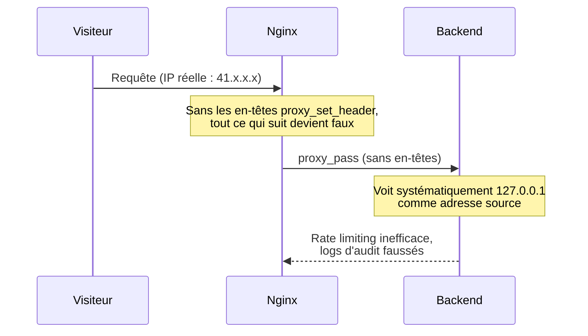

# Chapitre 9 — Configuration de Nginx

**Niveau : Intermédiaire**

---

## Introduction

Depuis le chapitre 6, nginx est apparu à chaque déploiement, toujours de façon minimale — un bloc `server` sommaire, juste assez pour faire fonctionner une application. Ce chapitre reprend nginx depuis le début et l'approfondit entièrement : virtual hosts, reverse proxy complet, performance, sécurité, redirections. À la fin, tu sauras écrire n'importe quelle configuration nginx en comprenant chaque directive, pas en copiant un exemple trouvé en ligne sans le comprendre.

## 🎯 Objectifs pédagogiques

À la fin de ce chapitre, tu sauras : lire et écrire un fichier de configuration nginx de A à Z ; héberger plusieurs domaines distincts sur un même serveur (virtual hosts) ; configurer un reverse proxy robuste vers une application backend ; activer HTTP/2 et la compression ; mettre en cache des fichiers statiques et des réponses d'API ; appliquer des en-têtes et des règles de sécurité de base ; gérer des redirections (HTTP→HTTPS, www, anciennes URLs) ; organiser proprement plusieurs sites sur un même serveur.

## 📋 Prérequis

Nginx installé (chapitre 5, section 5.13), au moins une application déployée derrière lui (chapitre 6).

## Pourquoi ce chapitre est important

Nginx est le seul point de contact entre Internet et tout ce que tu as construit depuis le chapitre 4. Une configuration nginx mal comprise cause des incidents disproportionnés par rapport à leur cause réelle : un en-tête manquant qui casse silencieusement le rate limiting d'une application entière (un cas réel, développé en 9.4), un cache mal configuré qui sert les données personnelles d'un utilisateur à un autre. Ce chapitre vise à ce que chaque ligne de configuration nginx que tu écris désormais soit délibérée, pas copiée-collée à l'aveugle.

---

## Concepts fondamentaux

1. **`sites-available` / `sites-enabled`** — séparation entre configuration écrite et configuration active.
2. **Virtual host** — un bloc `server` répondant à un domaine précis.
3. **`location`** — une règle appliquée à un chemin d'URL précis.
4. **En-têtes de proxy** — l'information transmise (ou perdue) entre nginx et le backend.
5. **Cache** — navigateur (côté client) vs serveur (côté nginx), deux mécanismes distincts.
6. **Défense en profondeur** — nginx comme une couche de sécurité parmi d'autres, jamais la seule.

---

## Explications détaillées

### 9.1 Rappel : le rôle de nginx

Comme vu au chapitre 1 (section 1.6), nginx joue le rôle de **reverse proxy** : point d'entrée unique du trafic (port 80/443), qui sert directement les fichiers statiques ou redirige vers le bon service interne selon des règles.


**Explication du diagramme :** nginx examine l'en-tête HTTP `Host` de chaque requête entrante et sélectionne le bloc `server` dont le `server_name` correspond exactement — c'est ce mécanisme, détaillé en 9.3, qui permet à un seul serveur d'héberger un nombre quasiment illimité de domaines.

### 9.2 Anatomie d'un fichier de configuration nginx

**Organisation des fichiers sur Ubuntu :**
```
/etc/nginx/
├── nginx.conf                 fichier principal, rarement modifié directement
├── sites-available/           tous les sites configurés, actifs ou non
│   ├── monsite
│   └── mon-api
└── sites-enabled/             liens symboliques vers les sites réellement actifs
    ├── monsite -> ../sites-available/monsite
    └── mon-api -> ../sites-available/mon-api
```
> 💡 **Pourquoi séparer `sites-available` et `sites-enabled` ?** Ça permet de désactiver un site sans supprimer sa configuration : il suffit de retirer le lien symbolique dans `sites-enabled` (la configuration reste intacte, réactivable en une commande). C'est l'équivalent d'un interrupteur, plutôt que de devoir débrancher et reconstruire tout le câblage à chaque fois.

**Structure de base, un bloc `server` par domaine/port :**
```nginx
server {
    listen 80;
    server_name tondomaine.ht;

    location / {
        # règles pour ce chemin précis
    }
    location /api {
        # règles pour un autre chemin
    }
}
```
- `server { }` : définit un virtual host (section 9.3).
- `listen 80` : le port sur lequel ce bloc écoute.
- `server_name` : le(s) nom(s) de domaine auquel ce bloc doit répondre.
- `location CHEMIN { }` : nginx choisit le bloc le plus spécifique correspondant à l'URL demandée.

#### `nginx -t`
**Description :** valide la syntaxe de l'ensemble de la configuration nginx sans l'appliquer.
**Syntaxe :** `sudo nginx -t`
**Décomposition mot par mot :** `-t` = *test*.
**Cas d'utilisation :** avant **toute** modification de configuration, sans exception.
**Exemple :** `sudo nginx -t`
**Résultat attendu :**
```
nginx: the configuration file /etc/nginx/nginx.conf syntax is ok
nginx: configuration file /etc/nginx/nginx.conf test is successful
```
**Explication du résultat :** les deux lignes confirment respectivement la syntaxe correcte et l'absence d'erreur logique détectable (fichier référencé absent, par exemple).
**Erreurs possibles :** `nginx: [emerg] ... syntax error` avec le fichier et la ligne exacts concernés.
**Vérification :** seulement après un `nginx -t` réussi, appliquer avec `sudo systemctl reload nginx`.
**Cas pratiques :** réflexe systématique, sans exception, avant chaque `reload`.

> ⚠️ **Attention** — Ne **jamais** faire `systemctl restart nginx` après une modification sans avoir fait `nginx -t` avant : si la configuration contient une erreur, `restart` peut laisser nginx complètement arrêté (contrairement à `reload`, qui refuse d'appliquer une configuration invalide et garde l'ancienne active) — le site entier serait alors hors ligne jusqu'à correction.

### 9.3 Virtual Hosts : plusieurs domaines sur un seul serveur

```nginx
# /etc/nginx/sites-available/site-a
server {
    listen 80;
    server_name site-a.ht;
    root /home/jaslin/sites/site-a;
    index index.html;
}
```
```nginx
# /etc/nginx/sites-available/site-b
server {
    listen 80;
    server_name site-b.ht;
    root /home/jaslin/sites/site-b;
    index index.html;
}
```
Les deux sites, une fois dans `sites-enabled`, coexistent sur le même serveur et le même port 80.

> 📌 **À retenir** — C'est ce mécanisme qui permet d'héberger un portefeuille entier d'applications (comme les études de cas de la Partie X de ce manuel) sur un unique VPS raisonnablement dimensionné, plutôt qu'un serveur dédié par projet.

**Bloc "catch-all"**, pour éviter qu'une requête sur une IP directe ou un domaine non reconnu n'atterrisse par erreur sur le premier site défini :
```nginx
server {
    listen 80 default_server;
    server_name _;
    return 444;    # ferme la connexion sans réponse
}
```

### 9.4 Reverse proxy en détail

```nginx
location /api {
    proxy_pass http://localhost:4000;

    proxy_set_header Host $host;
    proxy_set_header X-Real-IP $remote_addr;
    proxy_set_header X-Forwarded-For $proxy_add_x_forwarded_for;
    proxy_set_header X-Forwarded-Proto $scheme;

    proxy_connect_timeout 5s;
    proxy_send_timeout 60s;
    proxy_read_timeout 60s;
}
```


**Explication du diagramme :** sans les en-têtes `proxy_set_header`, le backend ne voit jamais la vraie adresse du visiteur — seulement celle de nginx lui-même. C'est un bug silencieux : l'application continue de fonctionner en apparence, mais des mécanismes entiers (rate limiting, logs d'audit, géolocalisation) deviennent inefficaces sans qu'aucune erreur ne soit levée.

**Pourquoi chaque en-tête est nécessaire :**
- `Host $host` : sans cette ligne, le backend reçoit `localhost` comme nom d'hôte au lieu du vrai domaine — casse potentiellement des liens absolus générés côté serveur.
- `X-Real-IP` et `X-Forwarded-For` : sans eux, le backend voit **toutes** les requêtes comme venant de `127.0.0.1` (l'adresse interne de nginx).
- `X-Forwarded-Proto` : indique si la requête d'origine était en HTTP ou HTTPS (important une fois HTTPS activé, chapitre 10).

> ⚠️ **Attention** — Oublier `X-Forwarded-For`/`X-Real-IP` est une source d'incidents de sécurité concrets : un rate limiting de connexion qui croit que toutes les tentatives viennent de la même IP (`127.0.0.1`) finit par bloquer **tous** les utilisateurs en même temps après quelques échecs cumulés de n'importe qui, ou au contraire ne protège plus personne individuellement.

**Timeouts :** des valeurs trop courtes coupent des requêtes légitimes mais lentes ; trop longues, un backend bloqué fait attendre un visiteur indéfiniment. Les valeurs ci-dessus sont un bon point de départ, à ajuster selon la nature réelle de l'application.

### 9.5 HTTP/2

**HTTP/2** permet de transmettre plusieurs requêtes/réponses en parallèle sur une seule connexion, réduisant la latence perçue.

```nginx
server {
    listen 443 ssl;
    http2 on;
    server_name tondomaine.ht;
}
```
> 📌 **À retenir** — HTTP/2 nécessite **HTTPS** en pratique — cette directive prend tout son sens une fois le chapitre 10 (SSL) mis en place, pas avant.

### 9.6 Compression

```nginx
gzip on;
gzip_vary on;
gzip_comp_level 5;
gzip_min_length 256;
gzip_types
    text/plain
    text/css
    text/javascript
    application/javascript
    application/json
    application/xml
    image/svg+xml;
```
`gzip_types` ne compresse que les types de contenu qui en bénéficient réellement — inutile de compresser des images déjà compressées (JPEG, PNG) ou des vidéos.

> 📌 **À retenir** — Cette section se place généralement dans le bloc `http { }` de `nginx.conf` (s'applique à tous les sites), plutôt que répétée dans chaque fichier de `sites-available`.

### 9.7 Cache

Deux formes de cache distinctes à ne pas confondre.

**Cache navigateur**, via en-têtes HTTP :
```nginx
location ~* \.(css|js|jpg|jpeg|png|gif|svg|woff2?)$ {
    expires 30d;
    add_header Cache-Control "public, immutable";
}
```
> ⚠️ **Attention** — N'appliquer une durée de cache longue qu'à des fichiers dont le nom change à chaque modification (le cas standard avec Vite/Webpack, qui ajoutent un hash au nom, ex. `app.a3f9c1.js`).

**Cache côté serveur**, pour une réponse coûteuse à générer :
```nginx
proxy_cache_path /var/cache/nginx levels=1:2 keys_zone=api_cache:10m max_size=100m inactive=60m;

server {
    location /api/rapports {
        proxy_pass http://localhost:4000;
        proxy_cache api_cache;
        proxy_cache_valid 200 5m;
        add_header X-Cache-Status $upstream_cache_status;
    }
}
```
`X-Cache-Status` indique `HIT` (servi depuis le cache) ou `MISS` (généré par le backend puis mis en cache).

> ⚠️ **Attention** — Ne jamais mettre en cache une réponse contenant des données personnelles à un utilisateur précis sans une clé de cache qui isole chaque utilisateur.

### 9.8 Sécurité

```nginx
add_header X-Content-Type-Options "nosniff" always;
add_header X-Frame-Options "SAMEORIGIN" always;
add_header Referrer-Policy "strict-origin-when-cross-origin" always;
```
- `X-Content-Type-Options: nosniff` : empêche le navigateur de deviner le type d'un fichier différemment de ce que déclare le serveur.
- `X-Frame-Options: SAMEORIGIN` : empêche l'intégration du site dans une `iframe` sur un domaine tiers (clickjacking).
- `Referrer-Policy` : limite les informations envoyées à un site tiers via un lien sortant.

**Masquer la version de nginx :**
```nginx
server_tokens off;
```

**Limitation de débit :**
```nginx
limit_req_zone $binary_remote_addr zone=login_limit:10m rate=5r/m;

server {
    location /api/auth/login {
        limit_req zone=login_limit burst=3 nodelay;
        proxy_pass http://localhost:4000;
    }
}
```
> 📌 **À retenir** — Ce rate limiting **au niveau nginx** est un filet de sécurité complémentaire, pas un remplacement du rate limiting applicatif. Les deux couches se renforcent : nginx protège même si l'application plante ou est contournée d'une façon imprévue.

> ⚠️ **Attention** — Ces protections sont complémentaires à Fail2ban (chapitre 4, section 4.9), pas redondantes : Fail2ban bannit une IP au niveau du pare-feu après des échecs répétés (toutes routes confondues), `limit_req` limite le débit en continu sur une route précise, même sans "échec" à proprement parler.

### 9.9 Redirections

**HTTP vers HTTPS** (obligatoire une fois le certificat en place, chapitre 10) :
```nginx
server {
    listen 80;
    server_name tondomaine.ht;
    return 301 https://$host$request_uri;
}
```
`301` signale une redirection **permanente**, mémorisée par les navigateurs et moteurs de recherche — contrairement à `302` (temporaire).

**www vers non-www :**
```nginx
server {
    listen 80;
    server_name www.tondomaine.ht;
    return 301 https://tondomaine.ht$request_uri;
}
```
> ✅ **Bonne pratique** — Choisir une seule forme "canonique" (avec ou sans `www`) et y rediriger systématiquement l'autre.

**Redirection d'anciennes URLs :**
```nginx
location = /ancienne-page {
    return 301 /nouvelle-page;
}
```

### 9.10 Organiser plusieurs sites — exemple complet

```nginx
# Redirection HTTP -> HTTPS
server {
    listen 80;
    server_name tondomaine.ht api.tondomaine.ht;
    return 301 https://$host$request_uri;
}

# Frontend statique
server {
    listen 443 ssl;
    http2 on;
    server_name tondomaine.ht;
    root /home/jaslin/sites/frontend/dist;
    index index.html;

    server_tokens off;
    add_header X-Content-Type-Options "nosniff" always;
    add_header X-Frame-Options "SAMEORIGIN" always;

    location / {
        try_files $uri $uri/ /index.html;
    }
    location ~* \.(css|js|jpg|jpeg|png|gif|svg|woff2?)$ {
        expires 30d;
        add_header Cache-Control "public, immutable";
    }
}

# API backend
server {
    listen 443 ssl;
    http2 on;
    server_name api.tondomaine.ht;
    server_tokens off;

    location / {
        proxy_pass http://localhost:4000;
        proxy_set_header Host $host;
        proxy_set_header X-Real-IP $remote_addr;
        proxy_set_header X-Forwarded-For $proxy_add_x_forwarded_for;
        proxy_set_header X-Forwarded-Proto $scheme;
    }
    location /auth/login {
        limit_req zone=login_limit burst=3 nodelay;
        proxy_pass http://localhost:4000;
        proxy_set_header Host $host;
        proxy_set_header X-Real-IP $remote_addr;
    }
}
```

---

## Analogies clés de ce chapitre

| Notion | Analogie |
|---|---|
| `sites-available`/`sites-enabled` | Un interrupteur, plutôt que débrancher et reconstruire le câblage |
| `X-Real-IP` manquant | Une lettre qui arrive sans adresse de retour lisible |
| Cache navigateur vs cache serveur | Une photocopie gardée chez soi vs une copie gardée à l'accueil pour tout le monde |
| `limit_req` + Fail2ban | Un vigile à l'entrée (Fail2ban) et un tourniquet qui limite le rythme (limit_req), deux protections différentes |

---

## Étude de cas

**Contexte.** Une application en production commence, un jour, à bloquer tous ses utilisateurs après seulement quelques tentatives de connexion échouées de **n'importe qui** — un comportement inattendu, puisque le rate limiting est censé s'appliquer par utilisateur, pas globalement.

**Diagnostic, avec les outils de ce chapitre.** En lisant la configuration nginx du reverse proxy vers cette API, la cause apparaît : les en-têtes `proxy_set_header X-Real-IP`/`X-Forwarded-For` ont été omis lors d'une reconfiguration récente. Le backend, incapable de distinguer les visiteurs les uns des autres, voit toutes les requêtes comme venant de la même adresse (`127.0.0.1`, celle de nginx) — son rate limiting, techniquement fonctionnel, protège en réalité tout le monde contre tout le monde. La correction (section 9.4) est immédiate une fois la cause identifiée : ce n'est jamais l'application elle-même qui était en cause, mais une ligne de configuration nginx absente.

---

## Bonnes pratiques (récapitulatif du chapitre)

- `nginx -t` avant chaque `reload`, sans exception.
- Un bloc `server` par domaine ou sous-domaine, jamais tout mélangé dans un seul bloc dès que la logique diffère.
- Les quatre en-têtes de reverse proxy toujours présents (`Host`, `X-Real-IP`, `X-Forwarded-For`, `X-Forwarded-Proto`).
- Cache long uniquement sur des fichiers versionnés par hash.
- `limit_req` et Fail2ban comme couches complémentaires, jamais l'une à la place de l'autre.
- Une seule forme canonique d'URL (avec/sans www), l'autre toujours redirigée en `301`.

---

## Erreurs fréquentes (récapitulatif du chapitre)

| Erreur | Pourquoi elle arrive | Conséquence |
|---|---|---|
| `systemctl restart` sans `nginx -t` avant | Réflexe non pris | Site potentiellement hors ligne si erreur de syntaxe |
| Oublier `try_files ... /index.html` sur une SPA | Notion non évidente | 404 au rechargement de toute route interne |
| Oublier `X-Real-IP`/`X-Forwarded-For` | Configuration copiée incomplète | Rate limiting et logs d'audit faussés silencieusement |
| Cache long sur un fichier au nom fixe | Confusion avec le cache de fichiers versionnés | Utilisateurs bloqués sur une ancienne version |
| Mettre en cache une réponse personnalisée | Cache appliqué sans réflexion | Fuite de données d'un utilisateur vers un autre |

---

## Captures d'écran à réaliser

> 📸 **Capture 11**
> **Logiciel :** navigateur, outils de développement
> **Pourquoi cette capture est utile :** vérifier visuellement la présence des en-têtes de sécurité et de cache configurés dans ce chapitre.
> **Page/écran concerné :** onglet Réseau, en-têtes de réponse d'une requête vers le site déployé
> **Niveau de zoom conseillé :** 100 %
> **Montrer :** les en-têtes `X-Content-Type-Options`, `X-Frame-Options`, `Cache-Control`
> **Entourer :** la liste des en-têtes de réponse
> **Flouter/masquer :** rien de sensible sur cet écran

---

## Laboratoire pratique n°1 — Héberger deux sites sur un même serveur

**Objectifs :** configurer deux virtual hosts distincts, fonctionnels simultanément.
**Prérequis :** chapitre 6 complété, deux applications (ou une application + une page statique de test) disponibles.
**Matériel nécessaire :** le VPS.

**Étapes :**
1. Crée deux fichiers dans `sites-available`, chacun avec son `server_name` distinct.
2. Active les deux (`sites-enabled`).
3. `nginx -t` puis `reload`.
4. Vérifie chaque site individuellement.

**Résultat attendu :** chaque domaine affiche son propre contenu, sans mélange.
**Vérifications :** `curl -H "Host: site-a.ht" http://ADRESSE_IP` et `curl -H "Host: site-b.ht" http://ADRESSE_IP` renvoient des contenus différents.
**Erreurs fréquentes :** un `server_name` dupliqué entre deux fichiers, nginx utilisant alors le premier trouvé de façon imprévisible.
**Solutions :** `sudo nginx -T | grep server_name` pour repérer tout doublon.

## Laboratoire pratique n°2 — Mettre en place un reverse proxy complet

**Objectifs :** configurer un reverse proxy avec les quatre en-têtes essentiels, et vérifier leur présence côté backend.
**Prérequis :** une API du chapitre 6 déployée et supervisée (PM2 ou systemd).
**Matériel nécessaire :** le VPS avec l'API active.

**Étapes :**
1. Configure `proxy_pass` avec les quatre `proxy_set_header`.
2. Ajoute une route de test dans l'API qui affiche `req.ip`/`req.headers` (ou équivalent selon le framework).
3. Requête cette route via le domaine public, observe l'IP réellement reçue par le backend.
4. Retire volontairement `X-Real-IP`/`X-Forwarded-For`, relance la requête, observe la différence.
5. Remets les en-têtes en place.

**Résultat attendu :** avec les en-têtes, le backend voit la vraie IP du visiteur ; sans eux, il voit `127.0.0.1`.
**Vérifications :** comparaison directe des deux résultats.
**Erreurs fréquentes :** oublier de `reload` nginx après modification, testant alors l'ancienne configuration.
**Solutions :** toujours confirmer `nginx -t` + `reload` avant de retester.

## Laboratoire pratique n°3 — Configurer cache et compression et mesurer l'impact

**Objectifs :** activer gzip et le cache navigateur, mesurer la différence de taille transférée.
**Prérequis :** un site statique du chapitre 6 déployé.
**Matériel nécessaire :** le VPS, un navigateur avec DevTools.

**Étapes :**
1. Ajoute le bloc `gzip` dans `nginx.conf`.
2. Ajoute le bloc de cache navigateur pour les fichiers statiques versionnés.
3. `nginx -t`, `reload`.
4. Dans les DevTools, onglet Réseau, observe `Content-Encoding: gzip` et `Cache-Control` sur les ressources concernées.
5. Recharge la page une seconde fois, observe que les ressources en cache ne sont plus retéléchargées (statut "from disk cache" ou équivalent).

**Résultat attendu :** taille transférée réduite grâce à gzip, ressources non re-téléchargées grâce au cache.
**Vérifications :** comparaison de la taille "transférée" vs "taille réelle" dans les DevTools.
**Erreurs fréquentes :** tester le cache sans vider le cache existant du navigateur au préalable, rendant la comparaison peu fiable.
**Solutions :** utiliser un rechargement forcé (Ctrl+Shift+R) avant le premier test, puis un rechargement normal pour le second.

---

## Exercices

1. Explique la différence entre `sites-available` et `sites-enabled`, et pourquoi cette séparation existe.
2. Un site affiche une erreur 404 uniquement quand on recharge une page après avoir navigué dans l'application. Diagnostique la cause probable.
3. Pourquoi `X-Real-IP` et `X-Forwarded-For` sont-ils indispensables dans un reverse proxy, même si l'application semble fonctionner sans eux ?
4. Explique pourquoi un cache long (`expires 30d`) est sûr pour `app.a3f9c1.js` mais dangereux pour `app.js`.
5. Pourquoi `limit_req` (nginx) et Fail2ban (chapitre 4) sont-ils complémentaires plutôt que redondants ?

---

## Quiz

**Question 1.** `sites-enabled` contient :
a) Les configurations de tous les sites, actifs ou non
b) Des liens symboliques vers les sites réellement actifs
c) Une copie de `nginx.conf`
d) Les certificats SSL

**Question 2.** Sans `X-Real-IP`/`X-Forwarded-For`, le backend voit :
a) La vraie adresse IP de chaque visiteur
b) Systématiquement l'adresse locale de nginx (127.0.0.1)
c) Une erreur de connexion
d) Aucune différence, ces en-têtes sont purement décoratifs

**Question 3.** Pourquoi valider avec `nginx -t` avant `reload` ?
a) Pour accélérer le rechargement
b) Pour éviter qu'une erreur de syntaxe ne mette le site hors service (avec `restart`)
c) C'est obligatoire pour activer HTTPS
d) Ça n'a aucune utilité réelle

**Question 4.** Un cache serveur (`proxy_cache`) est adapté pour :
a) Toute réponse, y compris les données personnelles d'un utilisateur
b) Du contenu public, identique pour tous les visiteurs, coûteux à générer
c) Uniquement les fichiers CSS et JS
d) Les pages de connexion

**Question 5.** `limit_req` au niveau nginx :
a) Remplace totalement le rate limiting applicatif
b) Est un filet de sécurité complémentaire, pas un remplacement
c) Bloque uniquement les robots connus
d) Nécessite Fail2ban pour fonctionner

> 🔑 **Corrigé** — 1: b · 2: b · 3: b · 4: b · 5: b

---

## 📝 Résumé du chapitre

- Un site nginx se configure dans `sites-available`, activé via un lien symbolique dans `sites-enabled` ; toujours `nginx -t` avant `reload`.
- Plusieurs domaines cohabitent grâce à `server_name`, chacun dans son propre bloc `server`.
- Un reverse proxy complet transmet `Host`, `X-Real-IP`, `X-Forwarded-For` et `X-Forwarded-Proto` — leur absence casse silencieusement le rate limiting et les logs applicatifs.
- HTTP/2 nécessite HTTPS en pratique ; gzip réduit la bande passante sur le texte.
- Le cache navigateur convient aux fichiers versionnés par hash ; le cache serveur convient au contenu public coûteux, jamais aux données personnelles.
- Les en-têtes de sécurité, `server_tokens off` et `limit_req` complètent Fail2ban, sans le remplacer.
- Les redirections `301` fixent une forme canonique d'URL de façon durable.

## ✅ Checklist avant de passer au chapitre 10

- [ ] Je sais activer/désactiver un site sans toucher à sa configuration.
- [ ] `nginx -t` fait partie de mon réflexe systématique avant tout `reload`.
- [ ] Mon reverse proxy transmet les 4 en-têtes essentiels.
- [ ] Je sais expliquer la différence entre cache navigateur et cache serveur.
- [ ] J'ai réalisé les trois laboratoires et obtenu au moins 4/5 au quiz.

---

## Glossaire du chapitre

**Virtual host**
Définition simple : un site hébergé sur un serveur partagé, identifié par son nom de domaine.
Définition technique : un bloc `server` nginx associé à un ou plusieurs `server_name`, sélectionné selon l'en-tête HTTP `Host` de la requête entrante.
Exemple concret : deux blocs `server` distincts pour `site-a.ht` et `site-b.ht` sur le même VPS.
Voir : Chapitre 9, section 9.3.

**Reverse proxy**
Définition simple : le logiciel qui reçoit toutes les requêtes et les redirige vers le bon service interne.
Définition technique : un serveur intermédiaire côté serveur, recevant les requêtes pour le compte d'un ou plusieurs backends, via la directive `proxy_pass`.
Exemple concret : nginx redirigeant `/api` vers `http://localhost:4000`.
Voir : Chapitre 9, section 9.4.

**Rate limiting**
Définition simple : une limite du nombre de requêtes autorisées dans un temps donné.
Définition technique : un mécanisme de limitation de débit, implémenté côté nginx via `limit_req_zone`/`limit_req`, basé sur une clé (souvent l'adresse IP).
Exemple concret : 5 tentatives de connexion par minute maximum sur `/api/auth/login`.
Voir : Chapitre 9, section 9.8.

---

## ❓ FAQ

**Faut-il un bloc `server` séparé par sous-domaine, ou peut-on tout gérer avec des `location` dans un seul bloc ?**
Un bloc `server` par domaine (ou sous-domaine) est recommandé dès que le contenu ou la logique diffère significativement — plus lisible et plus facile à faire évoluer indépendamment. Les `location` multiples conviennent bien quand tout reste sur un seul domaine (typiquement `/` pour le frontend et `/api` pour le backend du même site).

**Le rate limiting nginx remplace-t-il un rate limiting applicatif ?**
Non, les deux se complètent (section 9.8) : nginx protège même si l'application est indisponible ou contournée d'une manière imprévue ; le rate limiting applicatif peut appliquer une logique plus fine (par utilisateur authentifié) que nginx ne peut pas connaître.

**Pourquoi certains en-têtes ont `always` à la fin (`add_header ... always;`) ?**
Sans `always`, nginx n'ajoute l'en-tête que sur les réponses 2xx/3xx par défaut — `always` garantit sa présence même sur une réponse d'erreur (4xx/5xx), presque toujours l'intention recherchée pour un en-tête de sécurité.

---

## Références officielles

- Nginx Documentation — [nginx.org/en/docs](https://nginx.org/en/docs/)
- Nginx — Reverse Proxy — [nginx.org/en/docs/http/ngx_http_proxy_module.html](https://nginx.org/en/docs/http/ngx_http_proxy_module.html)
- Nginx — Rate Limiting — [nginx.org/en/docs/http/ngx_http_limit_req_module.html](https://nginx.org/en/docs/http/ngx_http_limit_req_module.html)
- Mozilla — En-têtes de sécurité HTTP — [developer.mozilla.org/fr/docs/Web/HTTP/Headers](https://developer.mozilla.org/fr/docs/Web/HTTP/Headers)

---

## Conclusion

Nginx est maintenant un outil pleinement maîtrisé — plus une boîte noire copiée-collée, mais un ensemble de directives dont tu comprends chaque effet. Il ne manque plus qu'une seule pièce pour que tout ce qui a été construit soit réellement prêt pour de vrais utilisateurs : le chiffrement HTTPS, sujet du chapitre 10.

---

⬅️ [Chapitre 8 — Docker Compose](08-docker-compose.md) · ➡️ **Suite : [Chapitre 10 — SSL / HTTPS](10-ssl.md)**
