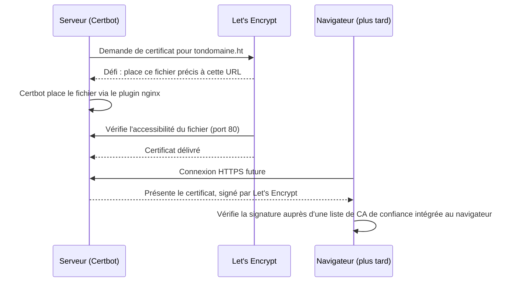

# Chapitre 10 — SSL / HTTPS

**Niveau : Intermédiaire**

---

## Introduction

Il ne manque plus qu'une seule pièce pour que tout ce qui a été construit depuis le chapitre 4 soit réellement prêt pour de vrais utilisateurs : le chiffrement. Un site accessible uniquement en HTTP, aujourd'hui, est signalé "non sécurisé" par tous les navigateurs, mal référencé, et techniquement vulnérable à l'interception. Ce chapitre explique comment obtenir, configurer, renouveler et auditer un certificat HTTPS gratuit, en comprenant le mécanisme cryptographique sous-jacent plutôt qu'en traitant Certbot comme une commande magique.

## 🎯 Objectifs pédagogiques

À la fin de ce chapitre, tu sauras : expliquer comment un certificat SSL établit la confiance entre un navigateur et un serveur ; installer et utiliser Certbot pour obtenir un certificat Let's Encrypt gratuit ; comprendre précisément ce que Certbot modifie dans la configuration nginx ; sécuriser plusieurs domaines/sous-domaines avec un seul certificat ; vérifier que le renouvellement automatique fonctionne réellement, pas seulement qu'il est configuré ; auditer la qualité d'une configuration HTTPS ; diagnostiquer et résoudre les problèmes SSL les plus fréquents.

## 📋 Prérequis

Chapitre 9 complété (au moins un site nginx fonctionnel en HTTP). Un vrai nom de domaine, déjà pointé vers l'adresse IP du serveur (enregistrement DNS de type A, chapitre 1 section 1.5) — impossible de suivre ce chapitre sans cette condition remplie au préalable.

## Pourquoi ce chapitre est important

HTTPS n'est plus une option en 2026 : c'est un prérequis pour la confiance des utilisateurs, le référencement, et l'accès à des fonctionnalités web modernes. Mais au-delà de l'obligation, comprendre **comment** un certificat établit la confiance — et pas seulement la commande qui l'obtient — permet de diagnostiquer sereinement le jour où quelque chose échoue, plutôt que de paniquer face à un message d'erreur cryptographique incompréhensible.

---

## Concepts fondamentaux

1. **Autorité de certification (CA)** — un tiers de confiance qui vérifie et atteste l'identité d'un domaine.
2. **ACME** — le protocole automatisé qui permet à Let's Encrypt de vérifier le contrôle d'un domaine sans intervention humaine.
3. **Certbot** — l'outil qui automatise le dialogue ACME et la configuration nginx.
4. **Durée de vie courte** — 90 jours, un choix délibéré qui force l'automatisation du renouvellement.
5. **HSTS** — un engagement durable à n'utiliser que HTTPS pour un domaine.
6. **Audit externe** — SSL Labs, un moyen objectif de mesurer la qualité réelle d'une configuration.

---

## Explications détaillées

### 10.1 Comment un certificat établit la confiance

> 💡 **Analogie** — Un certificat SSL, c'est une pièce d'identité délivrée par une autorité reconnue (l'équivalent d'un passeport délivré par un gouvernement). N'importe qui peut fabriquer une fausse carte affirmant "je suis tondomaine.ht", mais seule une **autorité de certification** (CA) de confiance peut délivrer un document que les navigateurs acceptent sans poser de question, parce que cette autorité a elle-même vérifié, au préalable, que le demandeur contrôle réellement ce domaine.

**Le problème que Let's Encrypt résout :** historiquement, obtenir un certificat signé par une CA reconnue coûtait de l'argent et demandait une démarche manuelle. **Let's Encrypt** est une autorité de certification **gratuite** et automatisée, largement reconnue par tous les navigateurs modernes, qui vérifie le contrôle d'un domaine via un protocole automatisé appelé **ACME**.


**Explication du diagramme, ligne par ligne :** la vérification ACME (les trois premiers échanges) n'a lieu qu'une seule fois, au moment de l'obtention (ou du renouvellement) du certificat. Ensuite, chaque visiteur qui se connecte reçoit ce certificat déjà signé et le vérifie lui-même, sans jamais recontacter Let's Encrypt — la confiance est entièrement déléguée à la signature cryptographique, vérifiable localement par le navigateur grâce à une liste de CA de confiance qu'il embarque déjà.

**Certbot** est l'outil officiel qui automatise l'intégralité de ce dialogue avec Let's Encrypt, y compris la configuration de nginx pour répondre au défi et l'activation du certificat une fois obtenu.

> ⚠️ **Attention, prérequis absolu avant de commencer** — Le domaine doit déjà **pointer vers l'adresse IP du serveur** et le port 80 doit être ouvert et accessible depuis Internet. Sans ces deux conditions réunies, le défi ACME échoue systématiquement — la cause de la grande majorité des échecs de première tentative, détaillée en section 10.8.

### 10.2 Installer Certbot

```bash
sudo apt update
sudo apt install certbot python3-certbot-nginx -y
certbot --version
```
`python3-certbot-nginx` est le **plugin** qui permet à Certbot de modifier automatiquement la configuration nginx — c'est ce plugin qui rend toute la suite de ce chapitre aussi simple qu'elle l'est.

### 10.3 Obtenir un premier certificat

#### `certbot --nginx`
**Description :** obtient un certificat Let's Encrypt et configure automatiquement nginx pour l'utiliser.
**Syntaxe :** `sudo certbot --nginx -d domaine [-d autre-domaine ...]`
**Décomposition mot par mot :** `--nginx` sélectionne le plugin d'intégration automatique ; `-d` déclare un domaine à couvrir, répétable.
**Cas d'utilisation :** activer HTTPS sur un site déjà fonctionnel en HTTP.
**Exemple :**
```bash
sudo certbot --nginx -d tondomaine.ht -d www.tondomaine.ht
```
**Résultat attendu :** trois questions interactives (email, conditions d'utilisation, redirection automatique HTTP→HTTPS — accepter), puis :
```
Successfully received certificate.
Certificate is saved at: /etc/letsencrypt/live/tondomaine.ht/fullchain.pem
Congratulations! You have successfully enabled HTTPS on https://tondomaine.ht
```
**Explication du résultat :** le certificat et sa clé privée sont sauvegardés dans `/etc/letsencrypt/live/tondomaine.ht/`, et le fichier nginx du site est automatiquement enrichi (détaillé en 10.4).
**Erreurs possibles :** voir la section 10.8, dépannage complet.
**Vérification :** `curl -I https://tondomaine.ht` répond `200`, cadenas fermé dans un navigateur.
**Cas pratiques :** commande centrale de tout ce chapitre, à exécuter pour chaque nouveau domaine mis en production.

### 10.4 Ce que Certbot a réellement modifié

Comprendre ce qui a changé, plutôt que de traiter Certbot comme une boîte noire, permet de diagnostiquer un problème plus tard sans paniquer.

```nginx
server {
    server_name tondomaine.ht www.tondomaine.ht;
    # ... configuration existante (root, location, etc.) ...
    listen 443 ssl;
    ssl_certificate /etc/letsencrypt/live/tondomaine.ht/fullchain.pem;
    ssl_certificate_key /etc/letsencrypt/live/tondomaine.ht/privkey.pem;
    include /etc/letsencrypt/options-ssl-nginx.conf;
    ssl_dhparam /etc/letsencrypt/ssl-dhparam.pem;
}

server {
    if ($host = www.tondomaine.ht) { return 301 https://$host$request_uri; }
    if ($host = tondomaine.ht) { return 301 https://$host$request_uri; }
    listen 80;
    server_name tondomaine.ht www.tondomaine.ht;
    return 404;
}
```
- `ssl_certificate`/`ssl_certificate_key` : le certificat public (incluant la chaîne de confiance jusqu'à Let's Encrypt) et la clé privée correspondante — cette dernière à ne **jamais** partager.
- `options-ssl-nginx.conf` : réglages de sécurité TLS recommandés, générés une seule fois par Certbot, réutilisés par tous les sites du serveur.
- Le second bloc `server` (port 80) gère la redirection automatique, avec le même principe que le chapitre 9 (section 9.9) mais générée automatiquement.

> 📌 **À retenir** — Après un `certbot --nginx`, toute nouvelle modification du fichier de site doit se faire prudemment : le bloc SSL ajouté par Certbot ne doit pas être supprimé par erreur en modifiant le reste de la configuration.

### 10.5 Plusieurs domaines et sous-domaines

**Ajouter un sous-domaine à un certificat déjà émis :**
```bash
sudo certbot --nginx -d tondomaine.ht -d www.tondomaine.ht -d api.tondomaine.ht
```
Certbot détecte qu'un certificat existe déjà et propose de l'étendre.

**Certificat wildcard** (`*.tondomaine.ht`), nécessitant obligatoirement la vérification DNS :
```bash
sudo certbot certonly --manual --preferred-challenges dns -d "*.tondomaine.ht"
```
> 📌 **À retenir** — Pour un usage classique (un site + quelques sous-domaines fixes et connus à l'avance), la vérification HTTP standard (10.3) est plus simple et suffisante — le wildcard n'est justifié que pour un vrai besoin de sous-domaines dynamiques et nombreux (un SaaS multi-tenant, par exemple).

### 10.6 Renouvellement automatique

Un certificat Let's Encrypt est valide **90 jours seulement** — volontairement court, pour limiter les dégâts si une clé était compromise, et pour forcer l'automatisation plutôt que de dépendre d'une action manuelle facilement oubliée.

**Certbot installe automatiquement un timer systemd** qui vérifie deux fois par jour si un certificat approche de l'expiration (30 jours) et le renouvelle.

```bash
sudo systemctl list-timers | grep certbot
```

#### `certbot renew --dry-run`
**Description :** simule un renouvellement complet, sans réellement le déclencher.
**Syntaxe :** `sudo certbot renew --dry-run`
**Cas d'utilisation :** confirmer que l'automatisation fonctionnera réellement le jour venu.
**Exemple :** `sudo certbot renew --dry-run`
**Résultat attendu :** `Congratulations, all simulated renewals succeeded`.
**Explication du résultat :** Certbot rejoue tout le processus ACME sans installer le nouveau certificat obtenu — un test fidèle sans conséquence.
**Erreurs possibles :** tout échec ici prédit un échec réel futur — investiguer immédiatement (section 10.8).
**Vérification :** message de succès explicite pour chaque domaine configuré.
**Cas pratiques :** à exécuter une fois juste après l'obtention de chaque certificat, jamais supposé fonctionner sans avoir été testé.

> ⚠️ **Attention, une automatisation jamais testée n'est qu'une hypothèse.** Ne jamais se contenter de "Certbot installe un renouvellement automatique" sans avoir exécuté `--dry-run` au moins une fois.

### 10.7 Vérifier la qualité d'une configuration HTTPS

**Vérifier la date d'expiration en ligne de commande :**
```bash
echo | openssl s_client -servername tondomaine.ht -connect tondomaine.ht:443 2>/dev/null | openssl x509 -noout -dates
```

**HSTS**, un en-tête qui force durablement HTTPS :
```nginx
add_header Strict-Transport-Security "max-age=31536000; includeSubDomains" always;
```
> ⚠️ **Attention** — Une fois HSTS activé avec une longue durée, le navigateur **refusera** toute connexion HTTP à ce domaine pendant toute cette durée, même si HTTPS venait à être désactivé par erreur plus tard. À activer seulement une fois certain que HTTPS restera fonctionnel durablement.

**SSL Labs** (Qualys) attribue une note de A+ à F à une configuration HTTPS publique — un excellent réflexe après toute mise en production d'un nouveau domaine.

### 10.8 Dépannage

> ⚠️ **La quasi-totalité des cas rencontrés en pratique se résume à l'un des points suivants.**

**`Timeout during connect` ou `Connection refused` pendant la vérification ACME**
- DNS pas encore propagé — vérifier avec `dig` ou [dnschecker.org](https://dnschecker.org).
- Port 80 fermé dans `ufw` ou nginx arrêté — vérifier `sudo ufw status` et `sudo systemctl status nginx`.

**`Too many certificates already issued` (rate limit)**
Provoqué par des tentatives répétées en boucle. Solution : attendre la fenêtre de réinitialisation, ou utiliser `--staging` pendant la mise au point :
```bash
sudo certbot --nginx -d tondomaine.ht --staging
```

**Cadenas affichant "Non sécurisé" malgré un certificat valide**
Cause fréquente : contenu mixte (une ressource chargée en `http://` sur une page HTTPS) — vérifier la console des DevTools, corriger en `https://` ou en URL relative.

**Le renouvellement automatique semble configuré mais le certificat a expiré**
Vérifier dans l'ordre : `sudo systemctl status certbot.timer` actif ; `sudo certbot renew --dry-run` réussit réellement ; les logs (`/var/log/letsencrypt/letsencrypt.log`) pour la cause exacte d'un échec silencieux passé.

---

## Analogies clés de ce chapitre

| Notion | Analogie |
|---|---|
| Certificat SSL | Un passeport délivré par une autorité reconnue |
| ACME | Une preuve d'identité automatisée, vérifiée une seule fois à l'obtention |
| Durée de vie de 90 jours | Un badge d'accès à renouvellement obligatoire, jamais laissé "à vie" |
| HSTS | Une promesse ferme et durable, pas une simple préférence révisable |

---

## Étude de cas

**Contexte.** Une application déployée depuis plusieurs mois affiche soudainement, un matin, l'avertissement "Votre connexion n'est pas privée" à tous ses visiteurs — l'incident le plus visible et le plus grave que ce chapitre puisse prévenir.

**Diagnostic, avec la méthode de ce chapitre.** `openssl s_client ... | openssl x509 -noout -dates` (section 10.7) confirme un certificat expiré la veille. `sudo systemctl status certbot.timer` montre le timer bien actif — le problème n'est donc pas l'absence d'automatisation. `sudo certbot renew --dry-run` échoue avec une erreur de connexion sur le port 80. En creusant `sudo ufw status` (section 10.8), la cause apparaît : une modification récente du pare-feu, faite pour une autre raison, avait accidentellement retiré la règle autorisant le port 80. Le renouvellement automatique tentait bien de se déclencher chaque jour depuis des semaines, mais échouait silencieusement à chaque fois, sans que personne ne s'en aperçoive faute d'avoir vérifié les logs.

**Leçon.** Ni Certbot ni son automatisation n'ont failli — c'est une modification non liée, ailleurs sur le système, qui a cassé une dépendance implicite. C'est exactement pour ce type de scénario que la vérification périodique (`--dry-run`, chapitre 17 sur la maintenance) doit rester une habitude, pas un geste fait une seule fois à l'installation.

---

## Bonnes pratiques (récapitulatif du chapitre)

- Toujours confirmer DNS + port 80 ouverts avant le premier `certbot --nginx`.
- Toujours tester le renouvellement (`--dry-run`) immédiatement après l'obtention d'un certificat.
- `--staging` pendant toute phase de test répétée, jamais l'environnement réel.
- HSTS activé seulement une fois HTTPS confirmé stable dans la durée.
- Un contrôle SSL Labs après chaque nouvelle mise en production de domaine.

---

## Erreurs fréquentes (récapitulatif du chapitre)

| Erreur | Pourquoi elle arrive | Conséquence |
|---|---|---|
| DNS pas encore propagé au moment du premier `certbot` | Impatience après l'achat du domaine | Échec ACME systématique |
| Tests répétés en boucle sur l'environnement réel | Non-connaissance de `--staging` | Rate limit atteint, blocage de plusieurs jours |
| HSTS activé trop tôt | Envie de "bien faire" immédiatement | Domaine inaccessible en HTTP si HTTPS casse ensuite |
| Contenu mixte (ressource en `http://` sur une page HTTPS) | URL codée en dur, jamais mise à jour | Avertissement de sécurité malgré un certificat valide |
| Modification du pare-feu cassant le renouvellement sans le savoir | Changement fait pour une autre raison | Expiration silencieuse du certificat |

---

## Captures d'écran à réaliser

> 📸 **Capture 12**
> **Logiciel :** SSL Labs (Qualys)
> **Pourquoi cette capture est utile :** montrer un rapport d'audit réel, avec sa note globale et le détail des critères évalués — un des seuls outils externes objectifs du manuel.
> **Page/écran concerné :** page de résultat après test d'un domaine sur ssllabs.com/ssltest
> **Niveau de zoom conseillé :** 100 %, page complète avec la note en évidence
> **Montrer :** la note globale (lettre A à F), le tableau des protocoles/suites de chiffrement supportés
> **Entourer :** la note globale
> **Flouter/masquer :** le nom de domaine testé si jugé personnel

---

## Laboratoire pratique n°1 — Obtenir un certificat réel sur un domaine

**Objectifs :** activer HTTPS sur un domaine réel, de bout en bout.
**Prérequis :** un domaine pointé vers le VPS (DNS type A confirmé), un site nginx fonctionnel en HTTP (chapitre 9).
**Matériel nécessaire :** le VPS, un nom de domaine réel.

**Étapes :**
1. Confirme la propagation DNS (`dig tondomaine.ht` ou dnschecker.org).
2. `sudo certbot --nginx -d tondomaine.ht`.
3. Réponds aux questions interactives.
4. Vérifie le cadenas dans un navigateur.
5. Vérifie la redirection automatique HTTP→HTTPS.

**Résultat attendu :** `https://tondomaine.ht` accessible avec un cadenas fermé, `http://tondomaine.ht` redirigeant automatiquement.
**Vérifications :** `curl -IL http://tondomaine.ht` montre une redirection `301` suivie d'un `200`.
**Erreurs fréquentes :** DNS pas encore propagé — voir section 10.8.
**Solutions :** attendre la propagation complète avant de relancer, jamais en boucle rapprochée (risque de rate limit).

## Laboratoire pratique n°2 — Tester le renouvellement automatique

**Objectifs :** confirmer que le renouvellement automatique fonctionnera réellement.
**Prérequis :** Laboratoire 1 complété.
**Matériel nécessaire :** le VPS avec certificat actif.

**Étapes :**
1. `sudo systemctl list-timers | grep certbot` — confirme le timer actif.
2. `sudo certbot renew --dry-run`.
3. Si échec, consulte `/var/log/letsencrypt/letsencrypt.log` pour la cause exacte.
4. Corrige la cause identifiée, relance `--dry-run` jusqu'au succès.

**Résultat attendu :** `Congratulations, all simulated renewals succeeded`.
**Vérifications :** aucune erreur dans le log après le test.
**Erreurs fréquentes :** port 80 fermé entretemps par une modification `ufw` non liée.
**Solutions :** `sudo ufw status` pour confirmer que 80 reste autorisé en permanence, pas seulement au moment de l'obtention initiale.

## Laboratoire pratique n°3 — Auditer et améliorer la note SSL Labs

**Objectifs :** obtenir un audit objectif de la configuration HTTPS et corriger au moins un point signalé.
**Prérequis :** Laboratoire 1 complété, domaine accessible publiquement.
**Matériel nécessaire :** un navigateur, accès à ssllabs.com/ssltest.

**Étapes :**
1. Lance un test sur le domaine du Laboratoire 1.
2. Attends le rapport complet (peut prendre plusieurs minutes).
3. Identifie au moins un point d'amélioration mentionné (souvent HSTS absent, sur une première configuration).
4. Applique le correctif (ajout de HSTS, section 10.7).
5. Relance le test, compare la nouvelle note.

**Résultat attendu :** une note A ou A+ après correction.
**Vérifications :** le rapport SSL Labs confirme explicitement la présence de HSTS après correction.
**Erreurs fréquentes :** activer HSTS avec `max-age` très long avant d'être sûr de la stabilité de HTTPS.
**Solutions :** commencer avec une durée plus courte le temps de valider, l'augmenter ensuite (rappel de l'avertissement section 10.7).

---

## Exercices

1. Explique, sans relire le chapitre, comment un navigateur sait qu'il peut faire confiance à un certificat qu'il n'a jamais vu auparavant.
2. Pourquoi Let's Encrypt limite-t-il la durée de vie d'un certificat à 90 jours plutôt que plusieurs années, comme le faisaient historiquement les CA payantes ?
3. Un certificat wildcard nécessite une vérification DNS plutôt que HTTP. Explique pourquoi la vérification HTTP standard ne peut pas fonctionner dans ce cas.
4. Pourquoi activer HSTS avec un `max-age` d'un an peut-il devenir un problème si HTTPS venait à casser accidentellement plus tard ?
5. Un certificat protège-t-il une connexion à une base de données MySQL distante ? Justifie ta réponse.

---

## Quiz

**Question 1.** Le rôle d'une autorité de certification (CA) est de :
a) Chiffrer le trafic elle-même en continu
b) Vérifier et attester qu'un demandeur contrôle réellement un domaine avant de signer son certificat
c) Héberger les sites web
d) Générer les noms de domaine

**Question 2.** Un certificat Let's Encrypt est valide pendant :
a) 1 an
b) 10 ans
c) 90 jours
d) Indéfiniment

**Question 3.** Pourquoi tester `certbot renew --dry-run` immédiatement après l'obtention d'un certificat ?
a) C'est purement facultatif
b) Pour confirmer que le renouvellement automatique fonctionnera réellement le moment venu
c) Pour accélérer le premier certificat
d) Pour changer de mot de passe

**Question 4.** HSTS force :
a) Une meilleure compression des données
b) L'utilisation exclusive de HTTPS pour un domaine, de façon durable
c) Le renouvellement automatique des certificats
d) La redirection vers www

**Question 5.** Un certificat wildcard (`*.tondomaine.ht`) nécessite :
a) La vérification HTTP standard, comme un domaine simple
b) La vérification DNS obligatoirement
c) Aucune vérification, il est délivré automatiquement
d) Un paiement, contrairement aux certificats simples

> 🔑 **Corrigé** — 1: b · 2: c · 3: b · 4: b · 5: b

---

## 📝 Résumé du chapitre

- Un certificat SSL est délivré par une autorité de confiance (Let's Encrypt, gratuite et automatisée) après une preuve de contrôle du domaine via le protocole ACME.
- Certbot avec le plugin nginx automatise l'obtention **et** la configuration nginx, à condition que le DNS pointe déjà vers le serveur et que le port 80 soit ouvert.
- Un certificat Let's Encrypt dure 90 jours ; le renouvellement automatique doit être **testé** (`--dry-run`), pas seulement supposé fonctionnel.
- HSTS force durablement HTTPS — à activer seulement une fois HTTPS confirmé stable.
- SSL Labs permet d'auditer objectivement la qualité d'une configuration HTTPS.
- La grande majorité des échecs Certbot viennent d'un DNS pas encore propagé, d'un port 80 fermé, ou d'une limite de taux atteinte à force de tests répétés.

## ✅ Checklist avant de passer au chapitre 11

- [ ] `https://tondomaine.ht` affiche un cadenas fermé, `http://` redirige automatiquement.
- [ ] `sudo certbot renew --dry-run` réussit sans erreur.
- [ ] Une note A ou A+ est obtenue sur SSL Labs.
- [ ] Je sais où se trouvent les logs Certbot en cas de problème futur.
- [ ] J'ai réalisé les trois laboratoires et obtenu au moins 4/5 au quiz.

---

## Glossaire du chapitre

**Autorité de certification (CA)**
Définition simple : une entité de confiance qui délivre des certificats après avoir vérifié une identité.
Définition technique : une organisation dont la clé publique racine est intégrée aux navigateurs et systèmes d'exploitation, servant de base à la chaîne de confiance TLS.
Exemple concret : Let's Encrypt.
Voir : Chapitre 10, section 10.1.

**ACME (Automatic Certificate Management Environment)**
Définition simple : le protocole automatisé qui permet d'obtenir un certificat sans intervention humaine.
Définition technique : un protocole standardisé (RFC 8555) définissant l'échange de défis de vérification de domaine entre un client (Certbot) et une autorité de certification.
Exemple concret : le défi HTTP-01 utilisé par `certbot --nginx`.
Voir : Chapitre 10, section 10.1.

**HSTS (HTTP Strict Transport Security)**
Définition simple : un engagement durable à n'utiliser que HTTPS pour un domaine.
Définition technique : un en-tête HTTP (`Strict-Transport-Security`) indiquant au navigateur de refuser toute connexion HTTP non chiffrée vers ce domaine pendant une durée définie.
Exemple concret : `max-age=31536000; includeSubDomains`.
Voir : Chapitre 10, section 10.7.

---

## ❓ FAQ

**Faut-il payer pour un certificat "plus sérieux" qu'un certificat Let's Encrypt gratuit ?**
Non, pour l'immense majorité des usages. Un certificat Let's Encrypt offre exactement le même niveau de chiffrement qu'un certificat payant.

**Que se passe-t-il si un certificat expire réellement ?**
Le navigateur affiche un avertissement bloquant à tous les visiteurs. C'est précisément pour éviter ce scénario que la vérification du renouvellement automatique n'est pas optionnelle.

**Un certificat protège-t-il aussi la base de données ou seulement le site web ?**
Seulement les connexions HTTPS vers nginx. Une connexion à une base de données utilise son propre mécanisme, généralement inutile si la base n'est accessible que localement.

---

## Références officielles

- Let's Encrypt Documentation — [letsencrypt.org/docs](https://letsencrypt.org/docs/)
- Certbot Documentation — [certbot.eff.org](https://certbot.eff.org/)
- RFC 8555 — Automatic Certificate Management Environment (ACME)
- SSL Labs Server Test — [ssllabs.com/ssltest](https://www.ssllabs.com/ssltest/)
- Mozilla — HTTP Strict Transport Security — [developer.mozilla.org/fr/docs/Web/HTTP/Headers/Strict-Transport-Security](https://developer.mozilla.org/fr/docs/Web/HTTP/Headers/Strict-Transport-Security)

---

## Conclusion

La Partie IV du manuel s'achève ici : exposition réseau et chiffrement, deux fondations désormais solides. La Partie V va introduire une dimension entièrement nouvelle — l'automatisation du déploiement lui-même, pour qu'un `git push` déclenche, sans intervention manuelle, tout ce que tu as appris à faire à la main depuis le chapitre 4.

---

⬅️ [Chapitre 9 — Configuration de Nginx](09-nginx.md) · ➡️ **Suite : [Chapitre 11 — CI/CD](11-cicd.md)**
