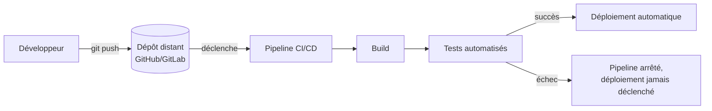
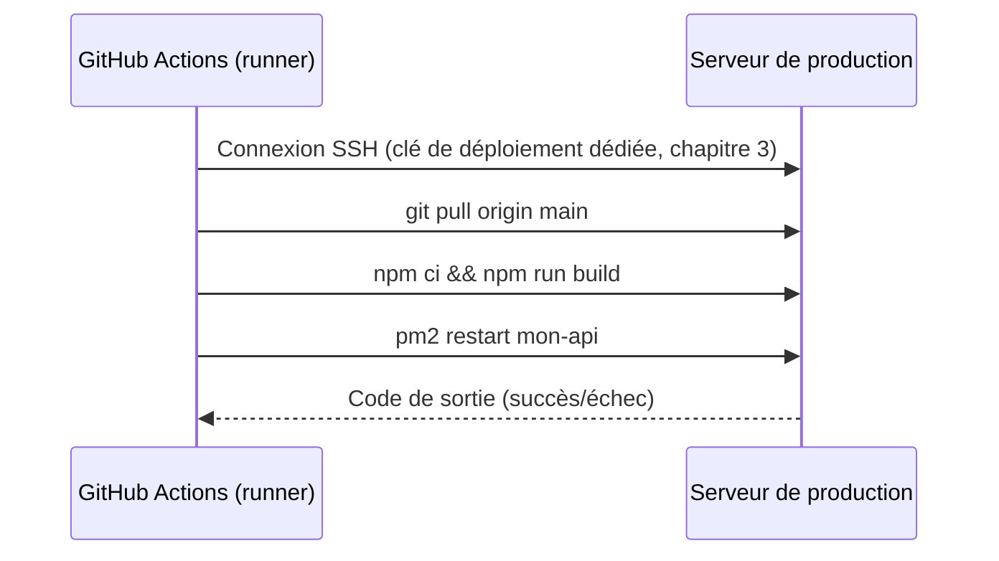

# Chapitre 11 — CI/CD

**Niveau : Intermédiaire → Avancé**

---

## Introduction

Depuis le chapitre 6, chaque redéploiement suit le même rituel manuel : se connecter en SSH, `git pull`, réinstaller les dépendances, rebuilder, redémarrer le process. Cette séquence, répétée des dizaines de fois au fil d'un projet, est une source d'erreurs humaines évitables — une étape oubliée sous la pression, un `git pull` fait sur la mauvaise branche. Ce chapitre automatise entièrement cette séquence : à partir de maintenant, un simple `git push` peut déclencher, sans aucune intervention manuelle, le test, le build et le déploiement complets de l'application.

## 🎯 Objectifs pédagogiques

À la fin de ce chapitre, tu sauras : expliquer pourquoi automatiser un déploiement réduit les erreurs plutôt que d'en introduire de nouvelles ; décomposer l'anatomie d'un pipeline (déclencheur, jobs, étapes, runner) ; écrire un workflow GitHub Actions complet ; écrire un pipeline GitLab CI équivalent ; gérer des secrets de façon sûre dans un pipeline, jamais en clair ; déployer automatiquement vers un VPS via SSH depuis la CI ; mettre en place une stratégie de rollback fiable en cas de déploiement raté ; intégrer des tests automatisés comme condition bloquante avant tout déploiement ; être notifié automatiquement en cas d'échec du pipeline.

## 📋 Prérequis

Chapitre 3 (Git, dépôts distants, tags) et Chapitres 4 à 6 (serveur préparé, application déployable manuellement) entièrement complétés. Un compte GitHub ou GitLab avec un dépôt existant.

## Pourquoi ce chapitre est important

Un déploiement manuel répété est, statistiquement, un déploiement qui finira par échouer par erreur humaine — pas une question de compétence, mais de répétition. CI/CD (Intégration Continue / Déploiement Continu) déplace cette responsabilité vers une machine qui exécute toujours exactement la même séquence, dans le même ordre, sans fatigue ni distraction. C'est aussi ce qui permet à une équipe de grandir : un nouveau développeur n'a jamais besoin d'accès SSH direct au serveur de production pour livrer son travail, seulement le droit de fusionner sur la bonne branche.

---

## Concepts fondamentaux

1. **Intégration continue (CI)** — chaque changement de code est automatiquement testé et validé.
2. **Déploiement continu (CD)** — chaque changement validé est automatiquement mis en production.
3. **Pipeline** — la séquence complète d'étapes automatisées, du push au déploiement.
4. **Runner** — la machine (fournie par la plateforme ou auto-hébergée) qui exécute réellement le pipeline.
5. **Secret protégé** — une valeur sensible stockée par la plateforme CI, jamais visible dans les logs ni dans le code.
6. **Rollback** — revenir automatiquement à la dernière version stable en cas d'échec.

---

## Explications détaillées

### 11.1 Pourquoi automatiser un déploiement

> 💡 **Analogie** — Un déploiement manuel répété, c'est comme préparer à la main, chaque jour, exactement la même recette de cuisine complexe : tôt ou tard, une étape sera oubliée ou inversée, même par un cuisinier expérimenté. Un pipeline CI/CD, c'est une machine qui suit la recette à la lettre, identiquement, chaque fois, sans jamais se laisser distraire.


**Explication du diagramme :** c'est ce chemin complet que ce chapitre construit, étape par étape. Le point le plus important est la branche d'échec : un test qui échoue **empêche structurellement** un déploiement défaillant d'atteindre la production — un filet de sécurité qu'aucun processus manuel, même rigoureux, ne peut garantir avec la même fiabilité.

### 11.2 Anatomie d'un pipeline

Quelle que soit la plateforme (GitHub Actions ou GitLab CI, quasiment interchangeables dans leur logique), un pipeline se décompose toujours de la même façon :

- **Déclencheur (trigger)** — l'événement qui démarre le pipeline (un `push`, une `pull request`, un tag créé).
- **Job** — un ensemble d'étapes exécutées ensemble, sur une même machine (le runner).
- **Étape (step)** — une action précise à l'intérieur d'un job (installer des dépendances, lancer un test, se connecter en SSH).
- **Runner** — la machine qui exécute réellement le job, fournie par la plateforme (gratuite dans une certaine limite) ou auto-hébergée sur ton propre serveur.

> 📌 **À retenir** — Plusieurs jobs d'un même pipeline s'exécutent **en parallèle** par défaut, sauf dépendance explicite déclarée entre eux — un job "déploiement" doit toujours dépendre explicitement du succès du job "tests", jamais s'exécuter indépendamment.

### 11.3 GitHub Actions

Un workflow GitHub Actions est un fichier YAML placé dans `.github/workflows/`.

**Exemple, build + test :**
```yaml
# .github/workflows/ci.yml
name: CI

on:
  push:
    branches: [main]
  pull_request:
    branches: [main]

jobs:
  build-and-test:
    runs-on: ubuntu-latest
    steps:
      - name: Récupérer le code
        uses: actions/checkout@v4

      - name: Installer Node.js
        uses: actions/setup-node@v4
        with:
          node-version: '22'

      - name: Installer les dépendances
        run: npm ci

      - name: Lancer les tests
        run: npm test

      - name: Build
        run: npm run build
```

**Décomposition ligne par ligne :**
- `on:` — les déclencheurs : ici, tout push sur `main` et toute pull request ciblant `main`.
- `jobs:` — un seul job nommé `build-and-test`, exécuté sur une machine Ubuntu fournie par GitHub (`runs-on: ubuntu-latest`).
- `steps:` — chaque étape s'exécute dans l'ordre ; `uses:` invoque une action réutilisable publiée sur la Marketplace GitHub (`actions/checkout` récupère le code du dépôt, `actions/setup-node` installe Node) ; `run:` exécute une commande shell directement.
- L'ordre est important : les tests s'exécutent **avant** le build — inutile de construire une version dont le code est déjà connu comme défaillant.

> ✅ **Bonne pratique** — Toujours utiliser `npm ci` (chapitre 2, rappel) plutôt que `npm install` dans un pipeline : reproductible, strict sur le lockfile, jamais de surprise de version entre deux exécutions.

### 11.4 GitLab CI

L'équivalent GitLab, un fichier `.gitlab-ci.yml` à la racine du dépôt :

```yaml
# .gitlab-ci.yml
stages:
  - build
  - test
  - deploy

build:
  stage: build
  image: node:22-alpine
  script:
    - npm ci
    - npm run build
  artifacts:
    paths:
      - dist/

test:
  stage: test
  image: node:22-alpine
  script:
    - npm ci
    - npm test

deploy:
  stage: deploy
  script:
    - echo "Déploiement, section 11.6"
  only:
    - main
```

**Décomposition :** `stages:` définit l'ordre global (build, puis test, puis deploy) ; chaque bloc nommé (`build`, `test`, `deploy`) est un job rattaché à un stage ; `image:` définit l'environnement d'exécution (un container Docker, chapitre 7) ; `artifacts:` conserve le résultat d'un job (ici, `dist/`) pour les stages suivants ; `only: [main]` restreint le job `deploy` aux seuls push sur la branche `main`.

> 📌 **À retenir** — GitHub Actions et GitLab CI expriment la même logique (déclencheur → jobs → étapes) avec un vocabulaire et une syntaxe légèrement différents. Une fois l'un maîtrisé, l'autre se comprend en quelques minutes de documentation.

### 11.5 Secrets et variables protégées

Un pipeline a presque toujours besoin d'informations sensibles : une clé SSH pour se connecter au serveur de déploiement, un token d'API. Ces valeurs ne doivent **jamais** apparaître en clair dans le fichier de workflow (rappel du chapitre 3, section 3.10 — un secret dans un fichier versionné est compromis dès son premier commit).

**GitHub Actions** : Settings → Secrets and variables → Actions, puis référencé dans le workflow via `${{ secrets.NOM_DU_SECRET }}`.

**GitLab CI** : Settings → CI/CD → Variables, référencé via `$NOM_DE_LA_VARIABLE`, avec une option "Masked" empêchant son affichage en clair dans les logs.

```yaml
# Extrait GitHub Actions
- name: Déployer sur le serveur
  env:
    SSH_PRIVATE_KEY: ${{ secrets.DEPLOY_SSH_KEY }}
  run: |
    echo "$SSH_PRIVATE_KEY" > deploy_key
    chmod 600 deploy_key
```

> ⚠️ **Attention** — Un secret bien configuré côté plateforme reste vulnérable s'il est ensuite affiché par erreur (`echo $SSH_PRIVATE_KEY` sans redirection, par exemple) dans les logs du pipeline, souvent publiquement lisibles sur un dépôt public. GitHub Actions masque automatiquement la valeur exacte d'un secret connu dans les logs, mais cette protection a des limites (une valeur transformée ou encodée peut y échapper) — la prudence reste de mise.

### 11.6 Déploiement automatique vers un VPS


**Explication du diagramme :** le runner GitHub Actions n'exécute jamais l'application lui-même — il se connecte au serveur de production, exactement comme le ferait un humain en SSH, et y exécute la même séquence de commandes que celle du déploiement manuel (chapitre 6). C'est la raison pour laquelle tout ce qui a été appris jusqu'ici reste directement pertinent : la CI ne remplace pas la connaissance du déploiement, elle l'automatise.

**Workflow complet, avec déploiement :**
```yaml
name: CI/CD

on:
  push:
    branches: [main]

jobs:
  build-and-test:
    runs-on: ubuntu-latest
    steps:
      - uses: actions/checkout@v4
      - uses: actions/setup-node@v4
        with:
          node-version: '22'
      - run: npm ci
      - run: npm test
      - run: npm run build

  deploy:
    needs: build-and-test
    runs-on: ubuntu-latest
    steps:
      - name: Déployer via SSH
        uses: appleboy/ssh-action@v1
        with:
          host: ${{ secrets.SERVER_IP }}
          username: ${{ secrets.SERVER_USER }}
          key: ${{ secrets.DEPLOY_SSH_KEY }}
          script: |
            cd ~/app
            git pull origin main
            npm ci
            npm run build
            pm2 restart mon-api
```
**Décomposition :** `needs: build-and-test` garantit que le job `deploy` ne démarre **que** si `build-and-test` a réussi — c'est le mécanisme exact qui empêche un code défaillant d'atteindre la production (rappel du diagramme 11.1). `appleboy/ssh-action` est une action de la Marketplace GitHub qui encapsule proprement une connexion SSH et l'exécution d'un script distant, en utilisant les secrets déjà configurés (section 11.5).

> ⚠️ **Attention** — La clé utilisée ici (`DEPLOY_SSH_KEY`) doit être une **Deploy Key** dédiée au déploiement (chapitre 3, section 3.5), avec les droits strictement nécessaires sur le serveur — jamais une clé personnelle d'administrateur système.

### 11.7 Stratégies de rollback

Même avec des tests automatisés, un déploiement peut révéler un problème seulement visible en production (une variable d'environnement manquante sur le serveur réel, par exemple).

**Rollback manuel rapide, en s'appuyant sur les tags du chapitre 3 :**
```bash
# Sur le serveur, en urgence
cd ~/app
git fetch --tags
git checkout prod-2026-07-20   # le dernier tag connu comme stable
npm ci
npm run build
pm2 restart mon-api
```

**Rollback automatisé dans le pipeline**, déclenché manuellement :
```yaml
name: Rollback manuel

on:
  workflow_dispatch:
    inputs:
      tag:
        description: 'Tag vers lequel revenir'
        required: true

jobs:
  rollback:
    runs-on: ubuntu-latest
    steps:
      - name: Revenir à la version indiquée
        uses: appleboy/ssh-action@v1
        with:
          host: ${{ secrets.SERVER_IP }}
          username: ${{ secrets.SERVER_USER }}
          key: ${{ secrets.DEPLOY_SSH_KEY }}
          script: |
            cd ~/app
            git fetch --tags
            git checkout ${{ github.event.inputs.tag }}
            npm ci && npm run build
            pm2 restart mon-api
```
`workflow_dispatch` permet de déclencher ce pipeline manuellement depuis l'interface GitHub, en précisant le tag cible — un rollback en quelques clics plutôt qu'une intervention SSH d'urgence sous pression.

> ✅ **Bonne pratique** — Un tag (chapitre 3, section 3.9) après **chaque** déploiement réussi en production, automatisé directement dans le pipeline de déploiement lui-même, garantit qu'un rollback a toujours une cible fiable et récente vers laquelle revenir.

### 11.8 Tests automatisés dans le pipeline

Le pipeline n'ajoute aucune valeur si aucun test réel n'existe pour bloquer un mauvais déploiement — `npm test` sans suite de tests écrite ne fait qu'exécuter une commande vide.

```yaml
- name: Lancer les tests
  run: npm test
```
> 📌 **À retenir** — Ce chapitre suppose qu'une suite de tests existe déjà dans le projet (unitaires, d'intégration) — l'écriture de tests elle-même est hors du périmètre de ce manuel, centré sur le déploiement. Un projet sans aucun test peut tout de même bénéficier de la CI pour automatiser build et déploiement, mais perd la garantie la plus précieuse : bloquer un déploiement dont on sait déjà, avant même de le tenter, qu'il est défaillant.

### 11.9 Notifications d'échec

```yaml
- name: Notifier en cas d'échec
  if: failure()
  run: |
    curl -X POST -H 'Content-Type: application/json' \
      -d '{"text":"❌ Le déploiement de mon-api a échoué : voir GitHub Actions"}' \
      ${{ secrets.SLACK_WEBHOOK_URL }}
```
`if: failure()` restreint cette étape aux seuls cas où une étape précédente du même job a échoué — évite une notification à chaque déploiement réussi (bruyant et rapidement ignoré), pour ne signaler que ce qui nécessite réellement une attention humaine.

---

## Analogies clés de ce chapitre

| Notion | Analogie |
|---|---|
| Pipeline CI/CD | Une chaîne de montage qui suit toujours la même séquence, sans fatigue |
| `needs: build-and-test` | Un contrôle qualité qui bloque physiquement la ligne de production en cas de défaut |
| Secret protégé | Une clé confiée à un coffre-fort de l'entreprise, jamais laissée sur le bureau |
| Rollback par tag | Un point de sauvegarde de jeu vidéo, vers lequel revenir en cas d'échec |

---

## Étude de cas

**Contexte.** Une équipe de trois développeurs livre plusieurs fois par jour sur un projet en croissance. Avant la mise en place de la CI/CD, chaque déploiement nécessitait qu'un seul développeur, disposant seul de l'accès SSH au serveur, exécute manuellement la séquence de déploiement — un goulot d'étranglement et un risque (que se passe-t-il si cette personne est indisponible un jour critique ?).

**Après la mise en place de ce chapitre :** n'importe quel membre de l'équipe peut fusionner sur `main`, et le pipeline se charge du reste — tests, build, déploiement, tout automatiquement, sans qu'aucun développeur n'ait besoin d'un accès SSH direct au serveur de production. Le jour où un déploiement révèle un problème en production, le rollback (section 11.7) se déclenche en quelques clics depuis l'interface GitHub, sans dépendre non plus de la disponibilité d'une seule personne.

---

## Bonnes pratiques (récapitulatif du chapitre)

- Toujours `needs:` (ou son équivalent GitLab) pour bloquer un déploiement tant que les tests n'ont pas réussi.
- Toujours une Deploy Key dédiée pour la CI, jamais une clé personnelle d'administrateur.
- Un tag après chaque déploiement réussi, automatisé dans le pipeline lui-même.
- Une notification d'échec, jamais une notification systématique à chaque exécution réussie.
- `npm ci`, jamais `npm install`, dans un pipeline.

---

## Erreurs fréquentes (récapitulatif du chapitre)

| Erreur | Pourquoi elle arrive | Conséquence |
|---|---|---|
| Déployer sans `needs:` sur les tests | Pipeline copié sans réflexion | Code défaillant déployé malgré des tests en échec |
| Secret affiché dans un `echo` de débogage | Débogage rapide, oublié ensuite | Fuite de secret dans des logs potentiellement publics |
| Clé personnelle utilisée comme secret de déploiement | Simplicité apparente | Compromission totale du compte si le pipeline est un jour piraté |
| Aucun tag créé après les déploiements | Étape jugée secondaire | Rollback impossible à cibler précisément en cas d'urgence |
| `npm install` au lieu de `npm ci` dans le pipeline | Habitude de développement local | Versions de dépendances potentiellement différentes entre deux runs |

---

## Captures d'écran à réaliser

> 📸 **Capture 13**
> **Logiciel :** GitHub
> **Pourquoi cette capture est utile :** montrer l'interface réelle d'exécution d'un workflow, avec chaque étape visible et son statut.
> **Page/écran concerné :** onglet "Actions" du dépôt, détail d'une exécution de workflow
> **Niveau de zoom conseillé :** 100 %
> **Montrer :** la liste des jobs et étapes, avec leurs coches vertes de succès
> **Entourer :** le job "deploy" et sa dépendance visible envers "build-and-test"
> **Flouter/masquer :** rien de sensible, les secrets n'apparaissent jamais en clair dans cette interface

---

## Laboratoire pratique n°1 — Écrire un premier workflow GitHub Actions

**Objectifs :** créer un workflow de build et test fonctionnel.
**Prérequis :** un dépôt GitHub existant avec une application Node (chapitre 6).
**Matériel nécessaire :** un compte GitHub, le dépôt du projet.

**Étapes :**
1. Crée `.github/workflows/ci.yml` (section 11.3).
2. Adapte-le à ton projet réel (version de Node, présence ou non de tests).
3. Committe et pousse sur une branche de test.
4. Observe l'exécution dans l'onglet "Actions" de GitHub.

**Résultat attendu :** le workflow s'exécute automatiquement au push, chaque étape visible avec son statut.
**Vérifications :** une coche verte sur chaque étape en cas de succès.
**Erreurs fréquentes :** version de Node dans le workflow différente de celle utilisée en local, révélant des incompatibilités invisibles jusque-là.
**Solutions :** aligner explicitement `node-version` avec la version réelle du projet (fichier `.nvmrc` si présent, chapitre 5).

## Laboratoire pratique n°2 — Déployer automatiquement sur le VPS à chaque push sur `main`

**Objectifs :** étendre le workflow du Laboratoire 1 avec un déploiement SSH réel.
**Prérequis :** Laboratoire 1 complété, VPS accessible (chapitre 4), Deploy Key dédiée créée (chapitre 3).
**Matériel nécessaire :** le VPS, les secrets GitHub configurés.

**Étapes :**
1. Ajoute les secrets `SERVER_IP`, `SERVER_USER`, `DEPLOY_SSH_KEY` dans les réglages GitHub du dépôt.
2. Ajoute le job `deploy` avec `needs: build-and-test` (section 11.6).
3. Pousse un changement mineur (un commentaire, par exemple) sur `main`.
4. Observe le déploiement automatique dans l'onglet "Actions".
5. Confirme le changement visible sur le site en production.

**Résultat attendu :** chaque push sur `main` déclenche un déploiement réel, visible sur le site en quelques minutes.
**Vérifications :** le contenu déployé correspond exactement au dernier commit poussé.
**Erreurs fréquentes :** `Permission denied (publickey)` si la Deploy Key n'a pas été correctement ajoutée au serveur.
**Solutions :** tester la connexion SSH manuellement avec la même clé avant de l'intégrer au pipeline.

## Laboratoire pratique n°3 — Simuler un déploiement raté et effectuer un rollback

**Objectifs :** provoquer un échec de déploiement et revenir à une version stable via le pipeline.
**Prérequis :** Laboratoire 2 complété.
**Matériel nécessaire :** le pipeline complet fonctionnel.

**Étapes :**
1. Tague la version actuelle stable : `git tag prod-test && git push origin prod-test`.
2. Introduis volontairement une erreur qui casse le build (une faute de syntaxe, par exemple), pousse sur `main`.
3. Observe le job `build-and-test` échouer, et confirme que `deploy` ne se déclenche jamais.
4. Corrige l'erreur avec un nouveau commit, confirme le déploiement réussi.
5. Ajoute le workflow de rollback manuel (section 11.7), déclenche-le vers `prod-test` pour t'entraîner au scénario d'urgence.

**Résultat attendu :** le déploiement défaillant n'atteint jamais la production ; le rollback manuel restaure une version antérieure avec succès.
**Vérifications :** le site reflète bien la version du tag `prod-test` après le rollback.
**Erreurs fréquentes :** confondre un échec de test (bloquant, sain) avec un vrai problème de pipeline.
**Solutions :** toujours lire le log complet du job en échec avant de conclure — l'échec du Laboratoire est volontaire et attendu ici.

---

## Exercices

1. Explique pourquoi un pipeline CI/CD réduit les erreurs humaines, plutôt que d'en introduire de nouvelles comme on pourrait le craindre au premier abord.
2. Un job `deploy` s'exécute même quand le job `build-and-test` a échoué. Identifie l'erreur de configuration la plus probable.
3. Pourquoi une Deploy Key dédiée à la CI, plutôt qu'une clé personnelle d'administrateur système ?
4. Explique la différence entre un rollback manuel (SSH direct) et un rollback automatisé via `workflow_dispatch`.
5. Pourquoi notifier uniquement les échecs (`if: failure()`) plutôt que chaque exécution du pipeline ?

---

## Quiz

**Question 1.** Un runner, dans un pipeline CI/CD, est :
a) Un développeur qui exécute manuellement les tests
b) La machine qui exécute réellement les jobs du pipeline
c) Un type de secret
d) Le nom du fichier de configuration

**Question 2.** Pourquoi `needs: build-and-test` sur le job `deploy` est-il essentiel ?
a) Pour accélérer le pipeline
b) Pour garantir que le déploiement n'a lieu que si les tests ont réussi
c) C'est purement cosmétique
d) Pour réduire les coûts d'exécution

**Question 3.** Où doit vivre une clé SSH utilisée par un pipeline pour se connecter à un serveur ?
a) Directement écrite dans le fichier de workflow
b) Dans un secret protégé de la plateforme CI (GitHub Secrets / GitLab CI Variables)
c) Dans un commentaire du code
d) Envoyée par email à chaque exécution

**Question 4.** Un rollback via tag Git consiste à :
a) Supprimer définitivement le code défaillant
b) Revenir vers un commit précédent marqué comme stable
c) Redémarrer uniquement la base de données
d) Créer automatiquement un nouveau serveur

**Question 5.** Pourquoi utiliser `npm ci` plutôt que `npm install` dans un pipeline ?
a) `npm ci` est plus rapide dans tous les cas
b) `npm ci` respecte strictement le lockfile, garantissant une installation reproductible
c) `npm install` ne fonctionne pas en CI
d) Il n'y a aucune différence pratique

> 🔑 **Corrigé** — 1: b · 2: b · 3: b · 4: b · 5: b

---

## 📝 Résumé du chapitre

- CI/CD automatise la séquence complète de déploiement, réduisant les erreurs humaines liées à la répétition manuelle.
- Un pipeline se décompose en déclencheur, jobs, étapes, exécutés sur un runner.
- GitHub Actions (`.github/workflows/`) et GitLab CI (`.gitlab-ci.yml`) expriment la même logique avec une syntaxe différente.
- Les secrets vivent toujours dans un espace protégé de la plateforme, jamais en clair dans le code.
- Le déploiement automatique se connecte au serveur via SSH, exécutant la même séquence qu'un déploiement manuel — la CI automatise, elle ne remplace pas la compréhension du déploiement.
- `needs:` bloque structurellement un déploiement tant que les tests n'ont pas réussi ; un tag après chaque déploiement réussi rend un rollback toujours possible et précis.

## ✅ Checklist avant de passer au chapitre 12

- [ ] J'ai un workflow CI fonctionnel, déclenché à chaque push.
- [ ] Le déploiement ne se déclenche que si les tests/build ont réussi (`needs:`).
- [ ] Tous les secrets utilisés sont stockés dans l'espace protégé de la plateforme, jamais en clair.
- [ ] J'ai testé un rollback réel, pas seulement en théorie.
- [ ] J'ai réalisé les trois laboratoires et obtenu au moins 4/5 au quiz.

---

## Glossaire du chapitre

**Pipeline**
Définition simple : la séquence automatisée complète, du push au déploiement.
Définition technique : un ensemble de jobs déclenchés par un événement, exécutés selon un ordre et des dépendances définis dans un fichier de configuration versionné.
Exemple concret : `.github/workflows/ci.yml`.
Voir : Chapitre 11, section 11.2.

**Runner**
Définition simple : la machine qui exécute réellement un job de pipeline.
Définition technique : un environnement d'exécution (hébergé par la plateforme ou auto-hébergé) sur lequel les étapes d'un job s'exécutent séquentiellement.
Exemple concret : `runs-on: ubuntu-latest`.
Voir : Chapitre 11, section 11.2.

**Secret protégé**
Définition simple : une valeur sensible stockée de façon sécurisée par la plateforme CI.
Définition technique : une variable chiffrée au repos, injectée à l'exécution du pipeline sans jamais apparaître en clair dans le code versionné, et généralement masquée dans les logs.
Exemple concret : `${{ secrets.DEPLOY_SSH_KEY }}`.
Voir : Chapitre 11, section 11.5.

---

## ❓ FAQ

**Faut-il choisir entre GitHub Actions et GitLab CI, ou peut-on utiliser l'un avec un dépôt hébergé sur l'autre plateforme ?**
Chaque système CI est lié à sa plateforme d'hébergement de dépôt correspondante — GitHub Actions pour un dépôt GitHub, GitLab CI pour un dépôt GitLab. Des outils tiers permettent des ponts entre plateformes, mais hors du périmètre de ce manuel.

**Le pipeline peut-il tourner directement sur mon VPS plutôt que sur un runner fourni par la plateforme ?**
Oui — un "self-hosted runner" peut être installé sur ton propre serveur, utile pour des besoins spécifiques (accès réseau interne, ressources dédiées). Pour la plupart des projets de ce manuel, le runner gratuit fourni par la plateforme suffit largement.

**Que se passe-t-il si le pipeline lui-même tombe en panne (la plateforme CI est indisponible) ?**
Le déploiement manuel classique (chapitre 6) reste toujours possible en secours — la CI/CD est une automatisation qui s'ajoute à la connaissance manuelle acquise dans ce manuel, elle ne la rend jamais obsolète.

---

## Références officielles

- GitHub Actions Documentation — [docs.github.com/actions](https://docs.github.com/en/actions)
- GitLab CI/CD Documentation — [docs.gitlab.com/ee/ci](https://docs.gitlab.com/ee/ci/)
- appleboy/ssh-action — [github.com/appleboy/ssh-action](https://github.com/appleboy/ssh-action)
- GitHub Actions — Encrypted Secrets — [docs.github.com/actions/security-guides/encrypted-secrets](https://docs.github.com/en/actions/security-guides/encrypted-secrets)

---

## Conclusion

Le déploiement, jusqu'ici entièrement manuel, est désormais automatisé de bout en bout, avec un filet de sécurité (tests bloquants) et une porte de sortie (rollback) en cas de problème. La Partie VI revient maintenant sur un sujet déjà abordé de façon pratique — les bases de données — pour l'approfondir avec la même rigueur que le reste de ce manuel : sécurisation avancée, sauvegarde, restauration.

---

⬅️ [Chapitre 10 — SSL / HTTPS](10-ssl.md) · ➡️ **Suite : [Chapitre 12 — Bases de données](12-bases-de-donnees.md)**
