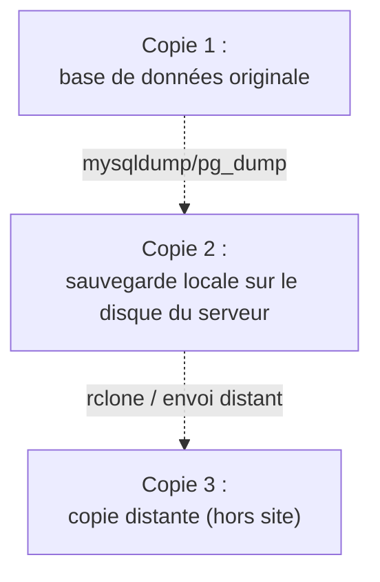
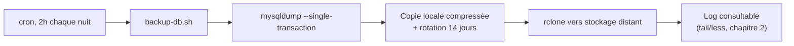

# Chapitre 12 — Bases de données : sécurisation, sauvegarde, restauration

**Niveau : Intermédiaire**

---

## Introduction

Une base de données mal sécurisée ou jamais sauvegardée est, statistiquement, la cause de l'incident le plus grave qu'un projet puisse subir — pas un site lent, pas une erreur 500 temporaire, mais une perte de données définitive. Ce chapitre reprend les bases de données installées au chapitre 5 et va bien au-delà de l'installation : durcissement réel, sauvegarde et restauration testées en conditions réelles, pas seulement en théorie.

## 🎯 Objectifs pédagogiques

À la fin de ce chapitre, tu sauras : durcir la sécurité de MySQL, PostgreSQL et Redis au-delà de l'installation de base ; comprendre et configurer précisément l'authentification PostgreSQL (`pg_hba.conf`) ; sauvegarder et restaurer une base MySQL et PostgreSQL, en conditions réelles ; importer et exporter des données ; sauvegarder Redis ; appliquer la règle 3-2-1 de sauvegarde et savoir pourquoi une sauvegarde non testée n'est qu'une hypothèse ; automatiser tout cela avec cron.

## 📋 Prérequis

MySQL et/ou PostgreSQL installés (chapitre 5, sections 5.7-5.8) avec un utilisateur applicatif créé. Redis, si utilisé, section 5.9. Chapitre 2 pour cron.

## Pourquoi ce chapitre est important

La plupart des incidents graves documentés dans l'industrie ne sont pas des pannes de serveur — ils sont des pertes de données irréversibles, causées par l'absence d'une sauvegarde fonctionnelle au moment précis où elle aurait été nécessaire. Ce chapitre traite la sauvegarde non comme une case à cocher, mais comme un processus à vérifier activement, encore et encore.

---

## Concepts fondamentaux

1. **Principe du moindre privilège** — un compte applicatif n'a que les droits strictement nécessaires.
2. **`pg_hba.conf`** — le cœur de l'authentification PostgreSQL, souvent mal compris.
3. **Sauvegarde cohérente** — capturer un état stable de la base, même sous charge active.
4. **Format de sauvegarde** — texte brut (lisible, simple) vs binaire compressé (compact, restauration sélective).
5. **Règle 3-2-1** — le standard de référence en protection de données.
6. **Sauvegarde non testée = hypothèse** — la seule preuve de fiabilité est une restauration réussie.

---

## Explications détaillées

### 12.1 Aller plus loin sur la sécurité

**MySQL — restreindre l'écoute réseau :**
```bash
sudo nano /etc/mysql/mysql.conf.d/mysqld.cnf
```
```ini
bind-address = 127.0.0.1
```
`127.0.0.1` garantit qu'aucune connexion MySQL n'est possible depuis l'extérieur de la machine, même si le pare-feu (chapitre 4) venait à être mal configuré un jour — une seconde couche de protection, jamais la seule.
```bash
sudo systemctl restart mysql
```

**Principe du moindre privilège**, au-delà du chapitre 5 :
```sql
GRANT SELECT, INSERT, UPDATE, DELETE ON nomapp.* TO 'nomapp_user'@'localhost';
```
> 📌 **À retenir** — Un compte applicatif n'a quasiment jamais besoin de `DROP`, `CREATE`, ou `ALTER` en production : ces opérations relèvent des migrations, exécutées séparément.

**PostgreSQL — comprendre `pg_hba.conf`**, le cœur de la sécurité d'accès :
```bash
sudo nano /etc/postgresql/16/main/pg_hba.conf
```
```
TYPE  DATABASE  USER  ADDRESS  METHOD
local   all   postgres   peer
local   all   all        scram-sha-256
host    nomapp   nomapp_user   127.0.0.1/32   scram-sha-256
```
- `local` : connexion via socket Unix ; `host` : connexion réseau, même en local via `127.0.0.1`.
- `peer` : authentifie en comparant l'utilisateur système Linux à l'utilisateur PostgreSQL demandé — pratique pour l'administration, inutilisable par une application.
- `scram-sha-256` : méthode moderne recommandée (successeur de `md5`).
- `trust` : **aucune vérification** — ne doit jamais apparaître en production.

```bash
sudo systemctl restart postgresql
```

> ⚠️ **Attention** — Une ligne `trust` copiée depuis un tutoriel de développement local est une faille de sécurité directe si elle atteint un jour un serveur de production.

**Redis — ACL (Redis 6+) :**
```bash
redis-cli
ACL SETUSER nomapp_user on >motdepasse ~nomapp:* +@read +@write -@admin
```
Cet utilisateur ne peut agir que sur les clés préfixées `nomapp:`, sans aucune commande d'administration — utile si Redis est partagé entre plusieurs applications.

### 12.2 Sauvegarder MySQL

#### `mysqldump`
**Description :** exporte la structure et les données d'une base MySQL sous forme d'instructions SQL rejouables.
**Syntaxe :** `mysqldump -u utilisateur -p [options] base > fichier.sql`
**Options principales :** `--single-transaction` (sauvegarde cohérente sans verrouillage, essentiel sur InnoDB en usage actif), `--quick` (évite de charger toute la table en mémoire).
**Cas d'utilisation :** sauvegarde régulière d'une base en production.
**Exemple :**
```bash
mysqldump -u nomapp_user -p --single-transaction --quick nomapp | gzip > backup_nomapp_$(date +%Y-%m-%d).sql.gz
```
**Résultat attendu :** un fichier `.sql.gz` contenant l'intégralité de la structure et des données.
**Explication du résultat :** compressé avec `gzip`, ce fichier peut être rejoué intégralement pour reconstruire la base à l'identique.
**Erreurs possibles :** sans `--single-transaction`, verrouillage des tables ou sauvegarde incohérente si des écritures ont lieu pendant l'export.
**Vérification :** `gunzip -t fichier.sql.gz` confirme l'intégrité du fichier compressé (sans le décompresser).
**Cas pratiques :** base de tout script de sauvegarde automatisé (section 12.9).

### 12.3 Restaurer MySQL

```bash
gunzip < backup_nomapp_2026-07-27.sql.gz | mysql -u nomapp_user -p nomapp
```
> ⚠️ **Attention, danger réel** — Cette commande **écrase** les données existantes de la base ciblée. **Ne jamais exécuter une restauration directement sur une base de production** sans certitude absolue — toujours restaurer d'abord sur une base de test :
```bash
mysql -u root -p -e "CREATE DATABASE nomapp_test;"
gunzip < backup_nomapp_2026-07-27.sql.gz | mysql -u root -p nomapp_test
mysql -u root -p nomapp_test -e "SELECT COUNT(*) FROM utilisateurs;"
mysql -u root -p -e "DROP DATABASE nomapp_test;"
```

### 12.4 Sauvegarder PostgreSQL

```bash
pg_dump -U nomapp_user -d nomapp -F c -f backup_nomapp.dump
```
`-F c` : format **custom** (compressé, binaire), permettant une restauration sélective (section 12.5), contrairement au format texte brut par défaut.

**Sauvegarder l'intégralité d'un serveur** (toutes les bases) :
```bash
sudo -u postgres pg_dumpall > backup_complet.sql
```

### 12.5 Restaurer PostgreSQL

```bash
pg_restore -U nomapp_user -d nomapp_test --clean backup_nomapp.dump
```
`--clean` supprime les objets existants avant de les recréer.

**Restauration sélective**, avantage du format custom :
```bash
pg_restore -U nomapp_user -d nomapp_test -t utilisateurs backup_nomapp.dump
```
Restaure uniquement la table `utilisateurs`.

> ✅ **Bonne pratique** — Toujours restaurer d'abord vers une base de test pour vérifier l'intégrité et le contenu avant d'envisager une restauration en production.

### 12.6 Import et export ciblés

**Exporter une seule table (MySQL) :**
```bash
mysqldump -u nomapp_user -p nomapp utilisateurs > backup_utilisateurs.sql
```

**Export CSV natif (PostgreSQL) :**
```sql
\copy (SELECT * FROM utilisateurs WHERE actif=true) TO 'utilisateurs_actifs.csv' WITH CSV HEADER;
```

**Importer un CSV (PostgreSQL) :**
```sql
\copy utilisateurs(nom, email, actif) FROM 'nouveaux_utilisateurs.csv' WITH CSV HEADER;
```
> 📌 **À retenir** — `\copy` (côté client `psql`) fonctionne avec un fichier local à la machine où tourne `psql` ; `COPY` (sans backslash, côté serveur) exige que le fichier soit déjà présent sur le serveur — `\copy` est presque toujours le choix le plus pratique.

### 12.7 Sauvegarder Redis

Redis persiste ses données de deux façons, configurables dans `redis.conf` : **RDB** (snapshot périodique, le mode par défaut) ou **AOF** (journal de chaque écriture, moins de perte en cas de crash, fichier plus volumineux).

```bash
redis-cli BGSAVE
```
`BGSAVE` sauvegarde en arrière-plan, non bloquant — contrairement à `SAVE`, à éviter sur une instance active.
```bash
redis-cli CONFIG GET dir
sudo cp /var/lib/redis/dump.rdb ~/backups/redis_$(date +%Y-%m-%d).rdb
```

### 12.8 La règle 3-2-1

> 💡 **La règle 3-2-1** : conserver **3** copies des données (l'originale + 2 sauvegardes), sur **2** supports différents, dont **1** copie hors site.


**Explication du diagramme :** un incendie, un vol, ou une panne matérielle détruisant le serveur détruit à la fois la copie 1 et la copie 2 si elles sont physiquement au même endroit — seule la copie 3, hors site, survit à ce scénario. C'est cette copie 3 qui transforme une "sauvegarde" en une vraie protection contre la perte totale du serveur.

> ⚠️ **Attention, répété volontairement, tant l'erreur est fréquente et coûteuse** : une sauvegarde qui n'a **jamais été restaurée avec succès au moins une fois** n'est qu'une hypothèse, pas une garantie. Un script de sauvegarde peut sembler fonctionner (fichier créé, cron actif, aucune erreur visible) tout en produisant un fichier corrompu ou incomplet. Planifier, au minimum une fois par trimestre, un exercice réel de restauration.

> 📌 **À retenir** — Ce chapitre couvre la sauvegarde de base avec les outils natifs (`mysqldump`/`pg_dump`). Le chapitre 16 approfondit avec des outils professionnels dédiés (Restic, BorgBackup) offrant chiffrement, déduplication et gestion de rétention avancée — la règle 3-2-1 reste identique, seuls les outils évoluent.

### 12.9 Automatiser avec cron

```bash
nano ~/scripts/backup-db.sh
```
```bash
#!/bin/bash
set -e

DATE=$(date +%Y-%m-%d_%H%M)
BACKUP_DIR="/var/backups/nomapp"
RETENTION_DAYS=14

mkdir -p "$BACKUP_DIR"

mysqldump -u nomapp_user -p'MOT_DE_PASSE_REEL' --single-transaction nomapp \
  | gzip > "$BACKUP_DIR/nomapp_$DATE.sql.gz"

find "$BACKUP_DIR" -name "*.sql.gz" -mtime +$RETENTION_DAYS -delete

rclone copy "$BACKUP_DIR/nomapp_$DATE.sql.gz" remote:NomApp-Backups/

echo "Sauvegarde terminée : $DATE"
```
```bash
chmod +x ~/scripts/backup-db.sh
crontab -e
```
```
0 2 * * * /home/jaslin/scripts/backup-db.sh >> /var/log/backup-nomapp.log 2>&1
```



> ✅ **Bonne pratique** — Le lendemain de la mise en place, vérifier concrètement : le fichier est-il apparu ? Le log ne contient-il aucune erreur ? La copie distante est-elle bien arrivée ?

---

## Analogies clés de ce chapitre

| Notion | Analogie |
|---|---|
| `bind-address 127.0.0.1` | Une porte qui ne s'ouvre que de l'intérieur du bâtiment |
| `pg_hba.conf` | Le registre d'accès qui décide qui entre, comment, et avec quelle preuve d'identité |
| Règle 3-2-1 | Ne jamais garder l'original et sa seule copie dans le même tiroir |
| Sauvegarde jamais testée | Un extincteur jamais vérifié, dont on découvre la panne au pire moment |

---

## Étude de cas

**Contexte.** Une petite entreprise perd son serveur suite à une panne matérielle chez son hébergeur — un scénario rare mais réel. L'équipe technique reste sereine : des sauvegardes quotidiennes existent, envoyées chaque nuit vers un stockage distant.

**Le jour de la restauration réelle**, un problème inattendu apparaît : le script de sauvegarde fonctionnait, le fichier était bien créé et envoyé chaque nuit — mais personne n'avait jamais vérifié qu'il pouvait réellement être restauré. Le fichier se révèle tronqué, une conséquence d'un script mal terminé (`set -e` absent, section 12.9) qui continuait silencieusement après un échec partiel du `mysqldump`. Une semaine de données récentes est irrémédiablement perdue, malgré des mois de "sauvegardes" apparemment fonctionnelles.

**Leçon, au cœur de ce chapitre.** Ce scénario, très commun dans l'industrie, illustre exactement pourquoi la section 12.8 insiste : une sauvegarde jamais restaurée n'est qu'une hypothèse. Le coût d'un test trimestriel de restauration est dérisoire comparé à celui d'une semaine de données perdues.

---

## Bonnes pratiques (récapitulatif du chapitre)

- `bind-address 127.0.0.1` sur MySQL, aucune ligne `trust` dans `pg_hba.conf`.
- `--single-transaction` systématique pour `mysqldump` sur une base active.
- Toujours restaurer d'abord vers une base de test, jamais directement en production.
- `BGSAVE`, jamais `SAVE`, pour Redis en production.
- Un test de restauration réel au moins une fois par trimestre.
- `set -e` dans tout script de sauvegarde, pour ne jamais continuer sur un échec partiel silencieux.

---

## Erreurs fréquentes (récapitulatif du chapitre)

| Erreur | Pourquoi elle arrive | Conséquence |
|---|---|---|
| `trust` dans `pg_hba.conf` en production | Copié depuis un tutoriel de dev local | N'importe qui peut se connecter sans mot de passe |
| `mysqldump` sans `--single-transaction` | Oubli | Sauvegarde incohérente ou tables verrouillées |
| Restauration testée directement en production | Précipitation en situation d'urgence | Écrasement irréversible de données actuelles |
| Script de sauvegarde sans `set -e` | Script écrit rapidement | Échec partiel silencieux, sauvegarde tronquée non détectée |
| Sauvegarde jamais restaurée pour test | "Ça doit marcher" supposé | Découverte d'un fichier corrompu seulement en cas d'urgence réelle |

---

## Captures d'écran à réaliser

> 📸 **Capture 14**
> **Logiciel :** terminal
> **Pourquoi cette capture est utile :** documenter la preuve concrète qu'une restauration a réellement réussi — l'élément central de ce chapitre.
> **Page/écran concerné :** terminal après une restauration de test, montrant le résultat d'un `SELECT COUNT(*)` cohérent
> **Niveau de zoom conseillé :** 100 %
> **Montrer :** la commande de restauration exécutée et son résultat de comptage
> **Entourer :** le nombre de lignes retourné
> **Flouter/masquer :** rien de sensible si les données sont de test

---

## Laboratoire pratique n°1 — Durcir une base fraîchement installée

**Objectifs :** appliquer les mesures de sécurité de la section 12.1 sur une base réelle.
**Prérequis :** MySQL ou PostgreSQL installé (chapitre 5).
**Matériel nécessaire :** le VPS.

**Étapes :**
1. Confirme `bind-address 127.0.0.1` (MySQL) ou vérifie l'absence de `trust` (`pg_hba.conf`, PostgreSQL).
2. Applique le principe du moindre privilège sur le compte applicatif existant.
3. Tente une connexion depuis une machine externe (si possible) — doit échouer.

**Résultat attendu :** aucune connexion possible depuis l'extérieur, compte applicatif limité aux droits nécessaires.
**Vérifications :** `SHOW GRANTS FOR 'nomapp_user'@'localhost';` (MySQL) ne montre pas de droits superflus.
**Erreurs fréquentes :** oublier de redémarrer le service après modification de la configuration.
**Solutions :** `sudo systemctl restart mysql`/`postgresql` systématique après chaque changement.

## Laboratoire pratique n°2 — Sauvegarder puis restaurer sur une base de test

**Objectifs :** réaliser un cycle complet de sauvegarde et restauration réelle.
**Prérequis :** Laboratoire 1 complété, données de test présentes dans la base.
**Matériel nécessaire :** le VPS.

**Étapes :**
1. Sauvegarde la base avec `mysqldump --single-transaction` ou `pg_dump -F c`.
2. Crée une base de test distincte.
3. Restaure la sauvegarde vers cette base de test.
4. Compare le contenu (`SELECT COUNT(*)` sur une table connue) entre l'originale et la restaurée.

**Résultat attendu :** un nombre de lignes identique entre les deux bases.
**Vérifications :** comparaison ligne par ligne d'un échantillon de données, pas seulement un comptage global.
**Erreurs fréquentes :** restaurer directement sur la base de production par erreur de nom.
**Solutions :** toujours vérifier deux fois le nom de la base cible avant d'exécuter une restauration.

## Laboratoire pratique n°3 — Automatiser la sauvegarde avec vérification réelle

**Objectifs :** mettre en place le script cron complet et confirmer son fonctionnement réel.
**Prérequis :** Laboratoires 1 et 2 complétés, `rclone` configuré (ou une alternative de copie distante).
**Matériel nécessaire :** le VPS.

**Étapes :**
1. Écris le script de la section 12.9, adapté à ton projet.
2. Exécute-le manuellement une première fois.
3. Vérifie le fichier local, le contenu du log, et la présence sur le stockage distant.
4. Programme le cron.
5. Le lendemain, vérifie à nouveau les trois mêmes éléments, sans intervention manuelle cette fois.

**Résultat attendu :** une sauvegarde automatique fonctionnelle, vérifiée deux fois (manuellement, puis via cron réel).
**Vérifications :** `crontab -l` confirme l'entrée ; le fichier du jour précédent existe bien dans `$BACKUP_DIR` et sur le stockage distant.
**Erreurs fréquentes :** mot de passe en clair dans le script sans protection de permissions.
**Solutions :** `chmod 700` sur le script contenant un mot de passe, ou utiliser un fichier `.my.cnf`/variables d'environnement séparées.

---

## Exercices

1. Explique pourquoi `bind-address 127.0.0.1` reste utile même si le pare-feu bloque déjà le port MySQL.
2. Un `pg_hba.conf` contient la ligne `host all all 0.0.0.0/0 trust`. Explique le risque exact que cela représente.
3. Pourquoi `--single-transaction` est-il indispensable pour `mysqldump` sur une base InnoDB active ?
4. Explique la règle 3-2-1 avec tes propres mots, et donne un exemple concret de scénario qu'elle protège.
5. Pourquoi une sauvegarde jamais restaurée pour test n'est-elle "qu'une hypothèse" ?

---

## Quiz

**Question 1.** `bind-address 127.0.0.1` sur MySQL signifie :
a) MySQL accepte les connexions de n'importe où
b) MySQL n'accepte les connexions que depuis la machine elle-même
c) MySQL est désactivé
d) Le port 3306 est ouvert publiquement

**Question 2.** Une ligne `trust` dans `pg_hba.conf` :
a) Est recommandée en production pour simplifier les connexions
b) N'a aucune vérification et ne doit jamais apparaître en production
c) Chiffre automatiquement les connexions
d) N'existe pas dans PostgreSQL

**Question 3.** Pourquoi restaurer d'abord vers une base de test plutôt que directement en production ?
a) C'est plus rapide
b) Pour vérifier l'intégrité du fichier sans risquer d'écraser des données de production
c) MySQL l'exige techniquement
d) Ce n'est jamais nécessaire

**Question 4.** La copie "hors site" de la règle 3-2-1 protège contre :
a) Les erreurs de syntaxe SQL
b) La destruction physique totale du serveur (incendie, vol, panne matérielle)
c) Les attaques par force brute
d) La lenteur des requêtes

**Question 5.** Une sauvegarde jamais restaurée pour test est :
a) Une garantie suffisante si le script ne montre aucune erreur
b) Une hypothèse, pas une garantie
c) Inutile de toute façon
d) Automatiquement validée par cron

> 🔑 **Corrigé** — 1: b · 2: b · 3: b · 4: b · 5: b

---

## 📝 Résumé du chapitre

- MySQL et PostgreSQL doivent tous deux être restreints à une écoute locale, avec un utilisateur applicatif aux droits strictement nécessaires — jamais `trust` en authentification PostgreSQL.
- `mysqldump --single-transaction` et `pg_dump -F c` sont les commandes de référence pour sauvegarder sans bloquer une base active ; toute restauration doit d'abord être testée sur une base de test.
- Redis persiste via RDB (`BGSAVE`) ou AOF — jamais `SAVE` sur une instance active.
- La règle 3-2-1 est le standard de référence ; une sauvegarde jamais restaurée avec succès reste une hypothèse.
- cron automatise l'ensemble, avec rotation locale et copie distante — vérifié concrètement, pas seulement supposé fonctionnel.

## ✅ Checklist avant de passer au chapitre 13

- [ ] `pg_hba.conf` (si PostgreSQL) ne contient aucune ligne `trust`.
- [ ] J'ai réalisé une sauvegarde puis restauré ce fichier avec succès sur une base de test.
- [ ] Un script de sauvegarde automatique tourne via cron, vérifié concrètement après une exécution réelle.
- [ ] Je sais expliquer la règle 3-2-1 et pourquoi une sauvegarde jamais restaurée n'est pas fiable.
- [ ] J'ai réalisé les trois laboratoires et obtenu au moins 4/5 au quiz.

---

## Glossaire du chapitre

**`pg_hba.conf`**
Définition simple : le fichier qui décide qui peut se connecter à PostgreSQL, et comment.
Définition technique : le fichier de configuration d'authentification hôte-based de PostgreSQL, définissant des règles par type de connexion, base, utilisateur, adresse et méthode.
Exemple concret : `host nomapp nomapp_user 127.0.0.1/32 scram-sha-256`.
Voir : Chapitre 12, section 12.1.

**Sauvegarde cohérente**
Définition simple : une sauvegarde qui capture un état stable de la base, même si elle change pendant l'export.
Définition technique : un dump réalisé dans une transaction unique isolée (`--single-transaction`), garantissant qu'aucune écriture concurrente ne corrompt la cohérence relationnelle du résultat.
Exemple concret : `mysqldump --single-transaction`.
Voir : Chapitre 12, section 12.2.

**Règle 3-2-1**
Définition simple : 3 copies des données, sur 2 supports différents, dont 1 hors site.
Définition technique : une stratégie de sauvegarde standard de l'industrie, conçue pour survivre à la fois à une corruption logique et à une destruction physique complète d'un site.
Exemple concret : base originale + sauvegarde locale + copie sur stockage cloud distant.
Voir : Chapitre 12, section 12.8.

---

## ❓ FAQ

**Faut-il chiffrer les fichiers de sauvegarde ?**
Fortement recommandé dès que la sauvegarde contient des données sensibles, et surtout avant tout envoi vers un stockage distant tiers. `gpg --symmetric --cipher-algo AES256` chiffre simplement un fichier avec un mot de passe.

**`mysqldump` semble très lent sur une grosse base, existe-t-il une alternative ?**
Pour des bases volumineuses, des outils spécialisés comme `mydumper`/`myloader` offrent des sauvegardes parallélisées. Pour la taille des bases d'un projet en lancement, `mysqldump`/`pg_dump` restent largement suffisants.

**Une réplication remplace-t-elle les sauvegardes ?**
Non — une réplication protège contre une panne matérielle, mais une erreur applicative (suppression accidentelle) se réplique tout aussi fidèlement vers la copie. Seule une vraie sauvegarde, figée dans le temps, permet de revenir à un état antérieur à l'erreur.

---

## Références officielles

- MySQL — mysqldump Reference — [dev.mysql.com/doc/refman/8.0/en/mysqldump.html](https://dev.mysql.com/doc/refman/8.0/en/mysqldump.html)
- PostgreSQL — pg_hba.conf — [postgresql.org/docs/current/auth-pg-hba-conf.html](https://www.postgresql.org/docs/current/auth-pg-hba-conf.html)
- PostgreSQL — pg_dump/pg_restore — [postgresql.org/docs/current/app-pgdump.html](https://www.postgresql.org/docs/current/app-pgdump.html)
- Redis Persistence — [redis.io/docs/management/persistence](https://redis.io/docs/latest/operate/oss_and_stack/management/persistence/)

---

## Conclusion

Les données de l'application — souvent son actif le plus précieux — sont désormais protégées avec la même rigueur que le reste de l'infrastructure. La Partie VII va maintenant s'attaquer à un aspect encore non couvert : savoir, en permanence et sans attendre qu'un utilisateur ne le signale, si le serveur fonctionne correctement.

---

⬅️ [Chapitre 11 — CI/CD](11-cicd.md) · ➡️ **Suite : [Chapitre 13 — Monitoring](13-monitoring.md)**
