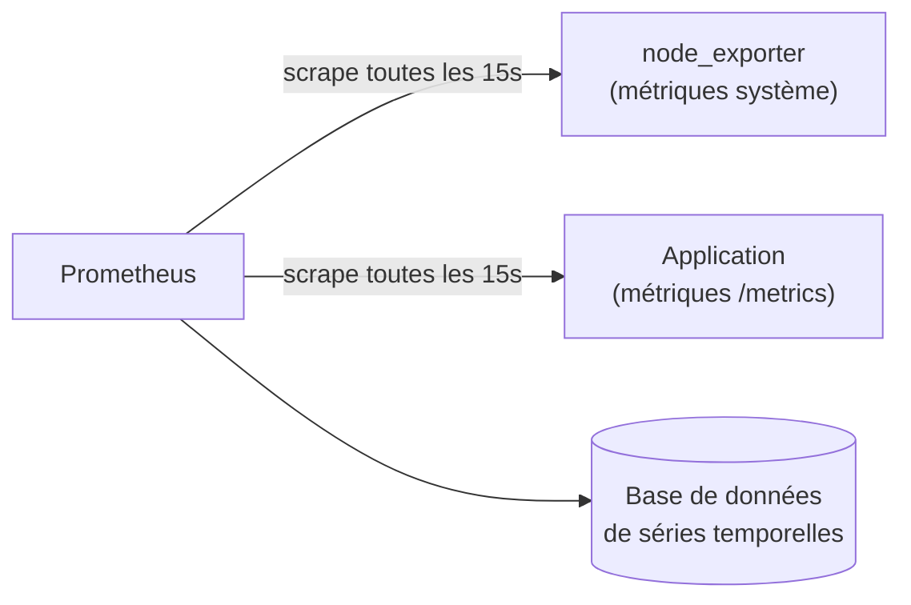
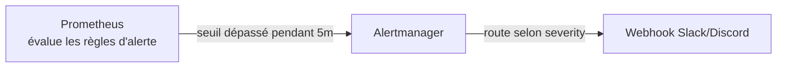

# Chapitre 13 — Monitoring

**Niveau : Avancé**

---

## Introduction

Jusqu'ici, chaque problème rencontré dans ce manuel a été découvert en le cherchant activement — se connecter, lancer `htop`, lire des logs à la main. En production réelle, cette approche a une limite fondamentale : elle suppose qu'un humain pense à vérifier, au bon moment, la bonne chose. Ce chapitre inverse cette logique : au lieu d'aller chercher l'information, l'information vient à toi, en continu, et t'alerte activement quand quelque chose dépasse un seuil anormal — souvent avant qu'un seul utilisateur ne s'en aperçoive.

## 🎯 Objectifs pédagogiques

À la fin de ce chapitre, tu sauras : expliquer pourquoi monitorer un serveur et quelles métriques ont réellement de la valeur ; installer et lire Netdata pour une vue temps réel immédiate ; comprendre le modèle de métriques de Prometheus et le principe du scraping ; construire des dashboards Grafana connectés à des sources de données réelles ; centraliser des logs multi-services avec Loki ; mettre en place une surveillance externe avec Uptime Kuma ; configurer des règles d'alerte avec Alertmanager, routées vers un canal de notification réel ; assembler ces outils en un tableau de bord de référence cohérent.

## 📋 Prérequis

Chapitres 4 à 8 complétés (serveur, applications, Docker et Docker Compose). Ce chapitre déploie l'essentiel de sa stack via Docker Compose — une bonne occasion de mettre en pratique le chapitre 8 sur un cas d'usage réel et non trivial.

## Pourquoi ce chapitre est important

Un serveur qui "tombe" silencieusement pendant la nuit, découvert seulement le lendemain matin par un client mécontent, est l'un des scénarios les plus évitables et pourtant les plus fréquents chez les projets sans monitoring. Ce chapitre construit le système nerveux d'une infrastructure : la capacité à savoir, en permanence, si tout va bien — et à être prévenu activement, sans avoir à demander, dès que ce n'est plus le cas.

---

## Concepts fondamentaux

1. **Métrique** — une valeur numérique mesurée dans le temps (CPU %, nombre de requêtes, latence).
2. **Scraping** — Prometheus va chercher activement les métriques, plutôt que d'attendre qu'on les lui envoie.
3. **Exporter** — un petit programme qui traduit l'état d'un système en métriques compréhensibles par Prometheus.
4. **Dashboard** — une visualisation construite à partir d'une ou plusieurs sources de données.
5. **Log centralisé** — les logs de tous les services regroupés en un seul endroit interrogeable.
6. **Monitoring externe (synthétique)** — une vérification depuis l'extérieur du serveur, détectant ce qu'un monitoring interne ne peut jamais voir seul.
7. **Alerte** — une règle qui transforme une métrique anormale en notification active.

---

## Explications détaillées

### 13.1 Pourquoi monitorer, et que mesurer

> 💡 **Analogie** — Un serveur sans monitoring, c'est un tableau de bord de voiture sans aucune jauge : le moteur peut surchauffer, l'essence peut être presque vide, tu ne le sauras qu'au moment où la voiture s'arrête net, au bord de la route. Le monitoring, ce sont les jauges — et les alertes, le voyant qui s'allume avant la panne, pas après.

**Ce qui mérite d'être mesuré en priorité :**

| Catégorie | Exemples de métriques | Pourquoi |
|---|---|---|
| Ressources système | CPU, RAM, disque, réseau | Prédire une saturation avant qu'elle ne cause une panne |
| Disponibilité | Le service répond-il ? Depuis l'extérieur ? | Détecter une panne même si le serveur "semble" fonctionner en interne |
| Performance applicative | Temps de réponse, taux d'erreur | Détecter une dégradation avant qu'elle ne devienne critique |
| Logs | Erreurs, avertissements, événements de sécurité | Reconstituer un incident après coup |

> 📌 **À retenir** — Il est tentant, en découvrant ces outils, de vouloir tout mesurer immédiatement. Commencer petit (Netdata seul, section 13.2) et étendre progressivement (Prometheus/Grafana, section 13.3-13.4) évite de se noyer sous des dashboards jamais consultés faute de temps.

### 13.2 Netdata : une vue temps réel immédiate

**Netdata** s'installe en une commande et fournit, sans aucune configuration, un dashboard web complet montrant des centaines de métriques système en temps réel.

```bash
curl -Ss https://get.netdata.cloud/kickstart.sh -o /tmp/netdata-kickstart.sh
sudo sh /tmp/netdata-kickstart.sh
```
**Ce que fait ce script :** installe Netdata comme service systemd (chapitre 4), démarré automatiquement, écoutant par défaut sur le port 19999.

> ⚠️ **Attention** — Le port 19999 ne doit **jamais** être exposé publiquement sans protection : il révèle des détails internes du serveur à quiconque y accède. Accéder au dashboard via un tunnel SSH plutôt que d'ouvrir le port dans `ufw` :
```bash
ssh -L 19999:localhost:19999 jaslin@ADRESSE_IP
```
Puis ouvrir `http://localhost:19999` **depuis ta propre machine** — le trafic passe par le tunnel chiffré SSH déjà maîtrisé depuis le chapitre 4, sans jamais exposer le port directement sur Internet.

> ✅ **Bonne pratique** — Netdata est le premier réflexe pour un diagnostic ponctuel et immédiat (rejoint le chapitre 14 sur la performance) ; ce n'est pas un outil de suivi historique long terme ni d'alerte structurée — c'est le rôle de Prometheus/Grafana, plus lourds à mettre en place mais bien plus adaptés à un usage continu et collaboratif.

### 13.3 Prometheus : le modèle de métriques

**Prometheus** fonctionne selon un modèle **pull** (contrairement à beaucoup de systèmes de monitoring plus anciens, en mode push) : il va chercher activement les métriques auprès de cibles configurées, à intervalle régulier.


**Explication du diagramme :** un **exporter** est un petit programme qui expose des métriques dans un format texte standardisé, sur une route HTTP (`/metrics`) que Prometheus interroge périodiquement — c'est ce mécanisme qu'on appelle le **scraping**. `node_exporter` est l'exporter officiel pour les métriques système (CPU, RAM, disque), l'équivalent de ce que `htop`/`df`/`free` montrent manuellement (chapitre 2), mais collecté et historisé automatiquement.

**Déploiement via Docker Compose** (chapitre 8), le moyen le plus simple de monter cette stack :
```yaml
# docker-compose.yml (stack monitoring)
services:
  prometheus:
    image: prom/prometheus:latest
    volumes:
      - ./prometheus.yml:/etc/prometheus/prometheus.yml
      - prometheus-data:/prometheus
    ports:
      - "127.0.0.1:9090:9090"

  node-exporter:
    image: prom/node-exporter:latest
    network_mode: host
    pid: host
    volumes:
      - /:/host:ro,rslave
    command:
      - '--path.rootfs=/host'

volumes:
  prometheus-data:
```
`prometheus.yml`, le fichier de configuration des cibles à scraper :
```yaml
global:
  scrape_interval: 15s

scrape_configs:
  - job_name: 'node'
    static_configs:
      - targets: ['localhost:9100']
```
> ⚠️ **Attention** — Comme pour Netdata, les ports 9090 (Prometheus) et 9100 (node_exporter) ne doivent jamais être exposés publiquement — remarque que `ports: - "127.0.0.1:9090:9090"` publie explicitement le port uniquement sur l'interface locale, jamais sur `0.0.0.0` (chapitre 10, rappel de sécurité réseau).

### 13.4 Grafana : construire des dashboards

**Grafana** ne collecte aucune métrique lui-même — il se connecte à des **sources de données** (Prometheus, mais aussi Loki, des bases de données classiques...) et construit des visualisations à partir de leurs données.

```yaml
# ajout au docker-compose.yml de la stack monitoring
  grafana:
    image: grafana/grafana:latest
    ports:
      - "127.0.0.1:3000:3000"
    environment:
      GF_SECURITY_ADMIN_PASSWORD: ${GRAFANA_PASSWORD}
    volumes:
      - grafana-data:/var/lib/grafana

volumes:
  grafana-data:
```
**Connexion à Prometheus comme source de données** : depuis l'interface Grafana (Connections → Data sources → Prometheus), URL `http://prometheus:9090` — le nom de service Docker Compose, résolu automatiquement (chapitre 8, rappel du réseau Compose).

> 📌 **À retenir** — Grafana propose une bibliothèque de dashboards prêts à importer (par identifiant numérique, depuis grafana.com/dashboards) pour `node_exporter` — inutile de reconstruire depuis zéro un dashboard système standard déjà éprouvé par la communauté.

### 13.5 Loki : centraliser les logs

**Loki**, développé par la même équipe que Grafana, centralise les logs de plusieurs services — l'équivalent, pour les logs, de ce que Prometheus fait pour les métriques.

```yaml
  loki:
    image: grafana/loki:latest
    ports:
      - "127.0.0.1:3100:3100"
    volumes:
      - loki-data:/loki

  promtail:
    image: grafana/promtail:latest
    volumes:
      - /var/log:/var/log:ro
      - ./promtail-config.yml:/etc/promtail/config.yml
    command: -config.file=/etc/promtail/config.yml

volumes:
  loki-data:
```
**Promtail** est l'agent qui lit les fichiers de log locaux (`/var/log/nginx/*.log`, par exemple) et les envoie à Loki — le pendant "collecte" de Loki, comme `node_exporter` l'est pour Prometheus.

Une fois Loki ajouté comme source de données dans Grafana, une recherche **LogQL** (le langage de requête de Loki, syntaxiquement proche de celui de Prometheus) permet de filtrer :
```
{job="nginx"} |= "error"
```
Cette requête affiche toutes les lignes de log nginx contenant le mot "error", dans une interface unique — plutôt que de se connecter en SSH pour `grep` manuellement chaque fichier (chapitre 2), une opération devenue centralisée et consultable par toute une équipe.

### 13.6 Uptime Kuma : surveillance externe

Tout ce qui précède surveille le serveur **depuis l'intérieur** — si le serveur entier devient injoignable (panne réseau, pare-feu mal configuré), aucun de ces outils ne peut lever d'alerte, puisqu'ils sont hébergés sur ce même serveur défaillant.

> 💡 **Analogie** — Un monitoring interne, c'est un employé qui vérifie son propre pouls. Un monitoring externe (synthétique), c'est quelqu'un à l'extérieur du bâtiment qui vérifie, depuis la rue, que les lumières sont allumées — la seule façon de détecter que le bâtiment entier est hors service.

**Uptime Kuma** est une alternative auto-hébergée aux services externes gratuits (comme UptimeRobot, mentionné en aperçu au chapitre 17) — à héberger **sur une machine distincte** du serveur surveillé, sous peine de perdre toute utilité si les deux tombent ensemble.

```bash
docker run -d --name uptime-kuma -p 3001:3001 -v uptime-kuma-data:/app/data louislam/uptime-kuma:1
```
Une fois accessible (idéalement via un domaine dédié avec HTTPS, chapitre 10), l'interface web permet de configurer un moniteur HTTP(S) vers le domaine à surveiller, avec un intervalle de vérification (1 à 5 minutes) et des canaux de notification (email, Slack, Discord, Telegram...).

> ⚠️ **Attention** — Héberger Uptime Kuma sur le **même** serveur que l'application qu'il surveille est une erreur de conception qui annule son intérêt principal : si ce serveur tombe entièrement, Uptime Kuma tombe avec lui, sans jamais pouvoir alerter de sa propre indisponibilité.

### 13.7 Alertmanager : router les alertes

**Alertmanager**, le compagnon de Prometheus, reçoit des règles d'alerte définies dans Prometheus et décide où et comment les envoyer (email, Slack, PagerDuty...), avec des mécanismes de regroupement et de déduplication (éviter cent notifications identiques pour un seul incident prolongé).

**Règle d'alerte dans Prometheus :**
```yaml
# alert.rules.yml
groups:
  - name: exemple
    rules:
      - alert: DiskSpaceCritique
        expr: node_filesystem_avail_bytes{mountpoint="/"} / node_filesystem_size_bytes{mountpoint="/"} < 0.10
        for: 5m
        labels:
          severity: critical
        annotations:
          summary: "Moins de 10% d'espace disque disponible"
```
**Décomposition :** `expr` est une requête PromQL (le langage de requête de Prometheus) calculant le ratio d'espace disque disponible ; `for: 5m` exige que la condition reste vraie pendant 5 minutes consécutives avant de déclencher (évite une alerte pour un pic transitoire sans conséquence) ; `severity: critical` est un label libre, utilisé ensuite par Alertmanager pour router l'alerte vers le bon canal.

```yaml
# alertmanager.yml
route:
  receiver: 'slack-notifications'

receivers:
  - name: 'slack-notifications'
    slack_configs:
      - api_url: '${SLACK_WEBHOOK_URL}'
        channel: '#alertes-serveur'
```



### 13.8 Construire un tableau de bord de référence

Une fois chaque brique en place, un tableau de bord Grafana unique, regroupant les panneaux les plus utiles au quotidien, évite d'avoir à naviguer entre plusieurs interfaces :

- **Ressources système** (Prometheus/node_exporter) : CPU, RAM, disque, réseau.
- **Disponibilité** (Uptime Kuma, intégrable à Grafana via son API) : uptime en pourcentage sur 30 jours.
- **Logs récents en erreur** (Loki) : un panneau listant les 20 dernières erreurs, toutes applications confondues.
- **Alertes actives** (Alertmanager) : la liste des alertes actuellement déclenchées, jamais vide en pratique n'étant pas forcément un bon signe (voir FAQ).

> ✅ **Bonne pratique** — Un tableau de bord trop chargé n'est jamais consulté. Un tableau de bord de référence doit tenir sur un seul écran, sans défilement, avec seulement les métriques qui déclenchent réellement une action si elles sortent de leur plage normale.

---

## Analogies clés de ce chapitre

| Notion | Analogie |
|---|---|
| Monitoring en général | Les jauges du tableau de bord d'une voiture |
| Scraping (Prometheus) | Un releveur de compteurs qui passe à heure fixe, plutôt que d'attendre un courrier |
| Monitoring externe (Uptime Kuma) | Quelqu'un dans la rue qui vérifie que les lumières du bâtiment sont allumées |
| Alertmanager | Le standardiste qui décide vers quel service transférer chaque type d'appel |

---

## Étude de cas

**Contexte.** Une application connaît un pic de trafic inhabituel un samedi soir, en dehors des heures de travail habituelles de l'équipe. Sans monitoring, personne ne s'en aperçoit avant le lundi matin, découvrant alors des heures d'indisponibilité passées et des clients mécontents.

**Avec la stack de ce chapitre :** l'espace disque, saturé par l'accumulation de logs générés par ce pic de trafic, déclenche la règle d'alerte de la section 13.7 après 5 minutes de seuil critique confirmé. Alertmanager route immédiatement vers le canal Slack de l'équipe. Un développeur, alerté sur son téléphone, se connecte, consulte le dashboard Grafana pour confirmer l'ampleur du problème, purge les logs anciens (chapitre 17), et résout l'incident en quelques minutes — au lieu de plusieurs heures d'indisponibilité découvertes après coup.

---

## Bonnes pratiques (récapitulatif du chapitre)

- Commencer par Netdata pour un usage ponctuel, avant d'investir dans Prometheus/Grafana pour un suivi continu.
- Jamais de port de monitoring exposé publiquement — tunnel SSH ou liaison `127.0.0.1` uniquement.
- Un monitoring externe (Uptime Kuma) toujours hébergé sur une machine distincte du serveur surveillé.
- `for: 5m` (ou équivalent) sur les règles d'alerte, pour éviter le bruit d'un pic transitoire sans conséquence.
- Un tableau de bord de référence court et actionnable, jamais une accumulation de panneaux jamais consultés.

---

## Erreurs fréquentes (récapitulatif du chapitre)

| Erreur | Pourquoi elle arrive | Conséquence |
|---|---|---|
| Port Netdata/Prometheus exposé publiquement | Configuration par défaut non modifiée | Fuite d'informations internes du serveur |
| Uptime Kuma sur le même serveur surveillé | Simplicité apparente | Aucune alerte possible si ce serveur tombe entièrement |
| Alerte sans `for:` (seuil instantané) | Configuration copiée sans réflexion | Notifications constantes pour des pics sans conséquence réelle |
| Dashboard surchargé de dizaines de panneaux | Envie de "tout voir" | Dashboard jamais réellement consulté au quotidien |
| Aucun canal de notification configuré dans Alertmanager | Étape jugée secondaire | Alertes générées mais jamais vues par personne |

---

## Captures d'écran à réaliser

> 📸 **Capture 15**
> **Logiciel :** Netdata
> **Pourquoi cette capture est utile :** montrer le dashboard temps réel immédiatement après installation, sans aucune configuration.
> **Page/écran concerné :** page d'accueil du dashboard Netdata (via tunnel SSH local)
> **Niveau de zoom conseillé :** 100 %
> **Montrer :** les graphiques CPU, RAM et réseau en temps réel
> **Entourer :** rien de spécifique, l'ensemble du dashboard fait foi
> **Flouter/masquer :** rien de sensible sur cet écran

> 📸 **Capture 16**
> **Logiciel :** Grafana
> **Pourquoi cette capture est utile :** montrer un dashboard construit, connecté à une vraie source de données Prometheus.
> **Page/écran concerné :** un dashboard système importé (node_exporter)
> **Niveau de zoom conseillé :** 100 %
> **Montrer :** plusieurs panneaux (CPU, RAM, disque) avec des données réelles
> **Entourer :** un panneau montrant une valeur actuelle claire
> **Flouter/masquer :** rien de sensible sur cet écran

---

## Laboratoire pratique n°1 — Installer Netdata et lire ses métriques

**Objectifs :** obtenir une vue temps réel du serveur sans configuration lourde.
**Prérequis :** chapitre 4 complété.
**Matériel nécessaire :** le VPS.

**Étapes :**
1. Installe Netdata (section 13.2).
2. Accède au dashboard via tunnel SSH.
3. Explore les sections CPU, RAM, disque, réseau.
4. Génère volontairement une charge (`stress` ou une boucle simple consommant du CPU) et observe le dashboard réagir en temps réel.

**Résultat attendu :** le dashboard reflète immédiatement la charge générée.
**Vérifications :** le graphique CPU montre un pic correspondant précisément au moment du test.
**Erreurs fréquentes :** tenter d'accéder au dashboard sans le tunnel SSH actif.
**Solutions :** vérifier que la commande `ssh -L 19999:localhost:19999 ...` est bien active dans un terminal séparé.

## Laboratoire pratique n°2 — Monter une stack Prometheus + Grafana minimale

**Objectifs :** déployer et connecter Prometheus, node_exporter et Grafana via Docker Compose.
**Prérequis :** chapitre 8 complété.
**Matériel nécessaire :** le VPS, Docker.

**Étapes :**
1. Écris le `docker-compose.yml` combinant les sections 13.3 et 13.4.
2. Écris `prometheus.yml` avec la cible `node-exporter`.
3. `docker compose up -d`.
4. Dans Grafana, ajoute Prometheus comme source de données.
5. Importe un dashboard `node_exporter` communautaire (par ID, depuis grafana.com/dashboards).

**Résultat attendu :** un dashboard Grafana affichant des métriques système réelles du serveur.
**Vérifications :** les valeurs affichées correspondent à celles observées avec `htop`/`free` (chapitre 2) au même instant.
**Erreurs fréquentes :** oublier `network_mode: host` sur `node-exporter`, l'empêchant de lire les métriques réelles de la machine hôte plutôt que celles du seul container.
**Solutions :** relire la configuration Docker Compose de la section 13.3.

## Laboratoire pratique n°3 — Configurer une alerte réelle et la déclencher volontairement

**Objectifs :** confirmer qu'une alerte se déclenche réellement et atteint un canal de notification.
**Prérequis :** Laboratoire 2 complété, ou Uptime Kuma installé (section 13.6) comme alternative plus simple.
**Matériel nécessaire :** un webhook Slack ou Discord (gratuit à créer).

**Étapes (voie Alertmanager) :**
1. Ajoute Alertmanager au `docker-compose.yml`, avec une règle d'alerte simple (section 13.7).
2. Configure le webhook Slack/Discord dans `alertmanager.yml`.
3. Provoque volontairement la condition d'alerte (remplis temporairement le disque, ou abaisse le seuil pour le test).
4. Confirme la réception de la notification.
5. Résous la condition, confirme la résolution automatique de l'alerte.

**Résultat attendu :** une notification réelle reçue sur le canal configuré, puis une notification de résolution.
**Vérifications :** le message reçu correspond bien à la règle définie (`DiskSpaceCritique`, par exemple).
**Erreurs fréquentes :** tester avec un seuil qui ne se déclenche jamais en pratique sur un environnement de test.
**Solutions :** abaisser temporairement le seuil de test (`< 0.90` au lieu de `< 0.10`, par exemple) pour déclencher facilement, puis le remettre à une valeur réaliste.

---

## Exercices

1. Explique la différence entre le modèle "pull" de Prometheus et un modèle "push" où chaque service enverrait lui-même ses métriques.
2. Pourquoi un monitoring externe (Uptime Kuma) ne doit-il jamais être hébergé sur le serveur qu'il surveille ?
3. Un développeur configure une alerte sans `for:` (déclenchement instantané). Explique le problème que cela va probablement causer.
4. Quelle est la différence de rôle entre Prometheus et Grafana ? Pourquoi ne peuvent-ils pas être confondus en un seul outil ?
5. Pourquoi les ports de Netdata, Prometheus et Grafana ne doivent-ils jamais être exposés directement sur `0.0.0.0` ?

---

## Quiz

**Question 1.** Prometheus fonctionne selon un modèle :
a) Push — chaque service lui envoie ses métriques
b) Pull — il va chercher activement les métriques auprès de cibles (scraping)
c) Ni l'un ni l'autre, il lit directement les fichiers de log
d) Push uniquement pour les alertes, pull pour les métriques

**Question 2.** Le rôle de Grafana est de :
a) Collecter lui-même les métriques système
b) Visualiser des données provenant de sources externes comme Prometheus ou Loki
c) Remplacer complètement Prometheus
d) Envoyer les notifications d'alerte

**Question 3.** Pourquoi héberger Uptime Kuma sur une machine distincte du serveur surveillé ?
a) Pour des raisons de performance uniquement
b) Sinon aucune alerte n'est possible si ce serveur tombe entièrement
c) Ce n'est pas nécessaire, la même machine convient toujours
d) Pour respecter une limite de licence

**Question 4.** `for: 5m` dans une règle d'alerte Prometheus sert à :
a) Répéter l'alerte toutes les 5 minutes
b) Exiger que la condition reste vraie 5 minutes avant de déclencher, évitant le bruit d'un pic transitoire
c) Limiter la durée de vie du serveur
d) Définir l'intervalle de scraping

**Question 5.** Loki sert principalement à :
a) Visualiser des métriques système
b) Centraliser et interroger les logs de plusieurs services
c) Remplacer Prometheus
d) Gérer les certificats SSL

> 🔑 **Corrigé** — 1: b · 2: b · 3: b · 4: b · 5: b

---

## 📝 Résumé du chapitre

- Le monitoring transforme une découverte passive de panne en une alerte active, souvent avant qu'un utilisateur ne s'en aperçoive.
- Netdata offre une vue temps réel immédiate, sans configuration ; Prometheus/Grafana conviennent à un suivi historique et collaboratif plus structuré.
- Prometheus scrape des exporters (comme `node_exporter`) à intervalle régulier ; Grafana visualise ces données sans jamais les collecter lui-même.
- Loki centralise les logs de plusieurs services, interrogeables via LogQL.
- Un monitoring externe (Uptime Kuma) doit toujours être hébergé ailleurs que le serveur surveillé, seule façon de détecter une panne totale.
- Alertmanager route les alertes de Prometheus vers de vrais canaux de notification, avec regroupement pour éviter le bruit.
- Aucun port de monitoring ne doit jamais être exposé publiquement.

## ✅ Checklist avant de passer au chapitre 14

- [ ] Netdata installé et accessible via tunnel SSH, jamais publiquement.
- [ ] Une stack Prometheus + Grafana fonctionnelle, affichant des métriques système réelles.
- [ ] Une alerte réelle testée de bout en bout, notification reçue et résolution confirmée.
- [ ] Je comprends pourquoi un monitoring externe doit vivre sur une machine séparée.
- [ ] J'ai réalisé les trois laboratoires et obtenu au moins 4/5 au quiz.

---

## Glossaire du chapitre

**Exporter**
Définition simple : un petit programme qui traduit l'état d'un système en métriques lisibles par Prometheus.
Définition technique : un service HTTP exposant des métriques au format texte Prometheus sur une route (généralement `/metrics`), scrapée périodiquement.
Exemple concret : `node_exporter`, pour les métriques système.
Voir : Chapitre 13, section 13.3.

**Scraping**
Définition simple : le fait, pour Prometheus, d'aller chercher activement les métriques à intervalle régulier.
Définition technique : une requête HTTP GET périodique vers l'endpoint `/metrics` de chaque cible configurée, dont l'intervalle est défini par `scrape_interval`.
Exemple concret : `scrape_interval: 15s`.
Voir : Chapitre 13, section 13.3.

**Monitoring synthétique**
Définition simple : une vérification simulée depuis l'extérieur, comme le ferait un vrai visiteur.
Définition technique : une requête HTTP périodique émise depuis un emplacement externe au système surveillé, mesurant disponibilité et temps de réponse perçus.
Exemple concret : Uptime Kuma vérifiant `https://tondomaine.ht` toutes les 5 minutes.
Voir : Chapitre 13, section 13.6.

---

## ❓ FAQ

**Faut-il vraiment installer les cinq outils de ce chapitre pour un petit projet ?**
Non. Netdata seul (section 13.2) et un moniteur externe simple (Uptime Kuma, section 13.6) couvrent l'essentiel pour un petit projet. La stack complète Prometheus/Grafana/Loki/Alertmanager devient pertinente à mesure que le projet grandit, avec plusieurs services à suivre et une équipe à coordonner.

**Une liste d'alertes actives toujours vide est-elle un bon signe ?**
Généralement oui, mais elle mérite d'être questionnée périodiquement : une liste vide peut aussi signifier qu'aucune alerte n'a jamais été correctement configurée ou testée (rappel du principe "une automatisation jamais testée n'est qu'une hypothèse", déjà vu au chapitre 12).

**Le monitoring remplace-t-il les logs applicatifs détaillés vus au chapitre 1 ?**
Non, il les complète. Les métriques (Prometheus) répondent à "combien" et "quand" ; les logs (Loki, ou consultés directement) répondent à "pourquoi" — les deux sont nécessaires pour un diagnostic complet, approfondi au chapitre 18.

---

## Références officielles

- Netdata Documentation — [learn.netdata.cloud](https://learn.netdata.cloud/)
- Prometheus Documentation — [prometheus.io/docs](https://prometheus.io/docs/introduction/overview/)
- Grafana Documentation — [grafana.com/docs/grafana](https://grafana.com/docs/grafana/latest/)
- Loki Documentation — [grafana.com/docs/loki](https://grafana.com/docs/loki/latest/)
- Uptime Kuma — [github.com/louislam/uptime-kuma](https://github.com/louislam/uptime-kuma)
- Alertmanager Documentation — [prometheus.io/docs/alerting/latest/alertmanager](https://prometheus.io/docs/alerting/latest/alertmanager/)

---

## Conclusion

Le serveur dispose désormais d'un véritable système nerveux : des métriques en continu, des logs centralisés, une surveillance externe, et des alertes qui préviennent activement plutôt que d'attendre d'être découvertes. Le chapitre 14 va maintenant se concentrer sur ce qui se passe une fois qu'un problème de performance est détecté : comment le diagnostiquer précisément, puis le résoudre.

---

⬅️ [Chapitre 12 — Bases de données](12-bases-de-donnees.md) · ➡️ **Suite : [Chapitre 14 — Performance](14-performance.md)**
