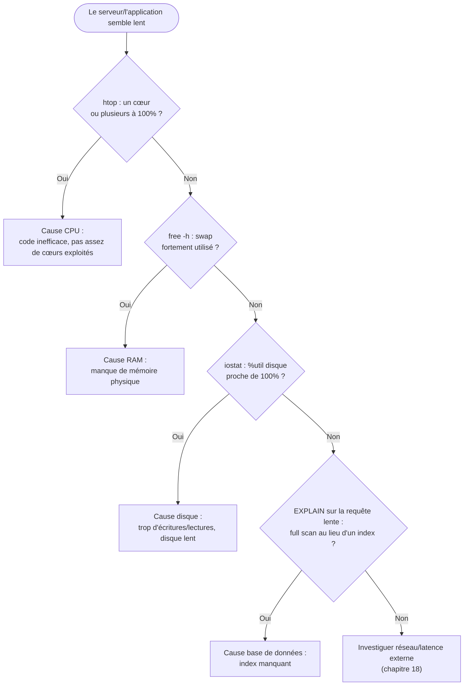
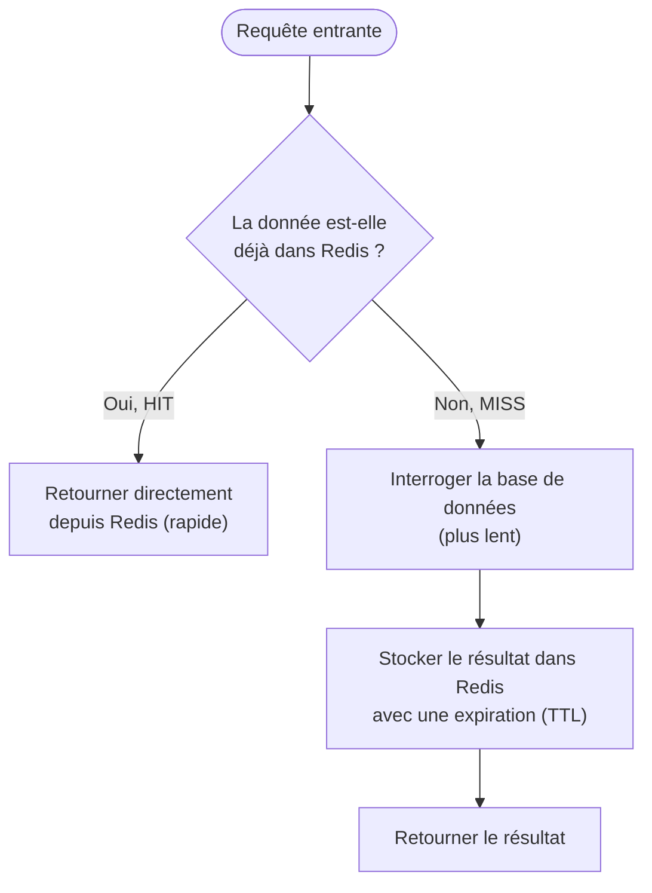
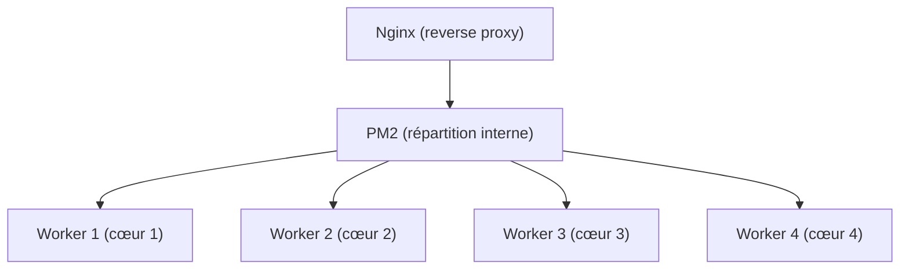

# Chapitre 14 — Performance

**Niveau : Avancé**

---

## Introduction

Le chapitre 13 a construit la capacité à savoir *qu'*un problème existe. Ce chapitre construit la capacité à savoir *pourquoi*, précisément, et à le corriger — sans deviner, sans changer des réglages au hasard en espérant que "ça ira mieux". Un serveur perçu comme lent a toujours une cause identifiable : CPU saturé, disque lent, mémoire insuffisante, requête de base de données mal indexée, ou configuration réseau sous-optimale. Ce chapitre donne la méthode et les outils pour trouver laquelle, à chaque fois.

## 🎯 Objectifs pédagogiques

À la fin de ce chapitre, tu sauras : appliquer une méthode systématique pour identifier un goulot d'étranglement, sans deviner ; lire `htop` en profondeur, au-delà de sa première utilisation au chapitre 2 ; utiliser `iostat` pour diagnostiquer l'activité disque ; utiliser `vmstat` pour comprendre la mémoire virtuelle et le swap en action ; utiliser `ncdu` pour explorer l'espace disque de façon interactive ; optimiser la configuration nginx pour un trafic plus élevé ; mettre en cache une opération coûteuse avec Redis ; comparer et configurer Brotli et Gzip ; exploiter le mode cluster de PM2 pour utiliser tous les cœurs CPU disponibles ; diagnostiquer et corriger une requête de base de données lente grâce à un index.

## 📋 Prérequis

Chapitre 2 (bases de `htop`, `free`, `df`), Chapitre 5 (PM2), Chapitre 9 (nginx, compression), Chapitre 12 (bases de données). Chapitre 13 utile pour repérer *quand* investiguer, mais pas strictement nécessaire pour suivre ce chapitre.

## Pourquoi ce chapitre est important

Face à une lenteur, le réflexe le plus commun et le moins efficace est de changer des réglages au hasard — augmenter une taille de cache, ajouter de la RAM, redémarrer le serveur — en espérant une amélioration sans jamais avoir confirmé la cause réelle. Ce réflexe coûte du temps, masque parfois temporairement le symptôme sans jamais traiter la cause, et peut même introduire de nouveaux problèmes. Ce chapitre enseigne l'inverse : mesurer avant d'agir, toujours.

---

## Concepts fondamentaux

1. **Goulot d'étranglement** — la ressource la plus contrainte, celle qui limite réellement la performance globale.
2. **Charge CPU vs attente I/O** — deux causes de lenteur très différentes, souvent confondues.
3. **Cache applicatif** — éviter de refaire un calcul ou une requête coûteuse déjà faite récemment.
4. **Compression** — réduire la taille transférée au prix d'un peu de calcul CPU.
5. **Scaling vertical par cœurs** — exploiter plusieurs cœurs CPU pour une seule application.
6. **Index de base de données** — une structure qui évite de parcourir une table entière à chaque requête.

---

## Explications détaillées

### 14.1 Méthode d'identification d'un goulot d'étranglement


**Explication du diagramme :** cette méthode élimine les hypothèses une par une, dans un ordre qui va du plus rapide à vérifier au plus lent — jamais de suppositions simultanées non vérifiées. Chaque branche de ce diagramme correspond à une section de ce chapitre.

> ✅ **Bonne pratique** — Toujours suivre ce diagramme dans l'ordre, même quand une cause semble "évidente" à l'avance. L'intuition se trompe plus souvent qu'on ne le pense face à un système complexe — la mesure, jamais.

### 14.2 `htop` en profondeur

Déjà introduit au chapitre 2 comme premier réflexe. Quelques éléments approfondis, essentiels pour un diagnostic précis :

- **Load average** (visible en haut de `htop` ou via `uptime`) : la moyenne du nombre de processus en attente de CPU sur 1, 5 et 15 minutes. Sur un serveur à *N* cœurs, une valeur régulièrement supérieure à *N* signifie que le CPU est un facteur limitant réel.
- **Vue par cœur** : `htop` affiche une barre par cœur CPU en haut de l'écran — un seul cœur à 100 % pendant que les autres restent inactifs révèle une application qui n'exploite pas le parallélisme disponible (section 14.10, PM2 cluster).
- **Tri par colonne** : `F6` dans `htop` permet de trier par CPU, RAM, ou temps d'exécution — utile pour identifier immédiatement le processus responsable d'un pic.

> 📌 **À retenir** — Un CPU à 100 % n'est pas automatiquement un problème : cela signifie simplement qu'il est pleinement utilisé. Le vrai signal d'alerte est un **load average** durablement supérieur au nombre de cœurs, signe que des tâches attendent leur tour sans jamais rattraper le retard.

### 14.3 `iostat` : l'activité disque

#### `iostat`
**Description :** affiche les statistiques d'utilisation des périphériques de stockage (lecture, écriture, temps d'attente).
**Syntaxe :** `iostat [options] [intervalle]`
**Décomposition mot par mot :** *input/output statistics*, fourni par le paquet `sysstat` (`sudo apt install sysstat -y`).
**Options principales :** `-x` (statistiques étendues, dont `%util`), un intervalle en secondes pour un rafraîchissement continu.
**Cas d'utilisation :** confirmer ou écarter le disque comme goulot d'étranglement.
**Exemple :**
```bash
iostat -x 2
```
**Résultat attendu :**
```
Device    r/s   w/s   rkB/s   wkB/s   await   %util
sda       12.0  45.0  480.0   1800.0  8.2     92.5
```
**Explication du résultat :** `%util` proche de 100 % indique un disque quasiment saturé en permanence ; `await` (temps d'attente moyen en millisecondes) élevé confirme un ralentissement perçu par les applications qui lisent/écrivent.
**Erreurs possibles :** `iostat: command not found` si `sysstat` n'est pas installé.
**Vérification :** comparer `%util` à un moment de faible activité connue, pour établir une base de référence.
**Cas pratiques :** confirmer qu'une base de données mal indexée (section 14.11) génère une charge disque anormale par les lectures répétées de table entière.

### 14.4 `vmstat` : la mémoire virtuelle

#### `vmstat`
**Description :** affiche un résumé de l'utilisation mémoire, des processus, et de l'activité swap.
**Syntaxe :** `vmstat [intervalle] [nombre]`
**Décomposition mot par mot :** *virtual memory statistics*.
**Cas d'utilisation :** distinguer un manque de RAM physique d'un usage normal.
**Exemple :**
```bash
vmstat 2 5
```
**Résultat attendu :**
```
procs -----------memory---------- ---swap-- -----io---- -system-- ------cpu-----
 r  b   swpd   free   buff  cache   si   so    bi    bo   in   cs us sy id wa st
 2  1   50000  102400 20000 500000  120  340   45    88  200  350 20  5 70  5  0
```
**Explication du résultat :** les colonnes `si`/`so` (*swap in/out*) non nulles et régulières confirment une utilisation active du swap — signe de RAM insuffisante (chapitre 1, section 1.4). La colonne `wa` (I/O wait) élevée indique que le CPU passe du temps à attendre des opérations disque, recoupant le diagnostic `iostat`.
**Erreurs possibles :** aucune, la commande est native sur la plupart des distributions.
**Vérification :** observer plusieurs intervalles successifs pour distinguer un pic ponctuel d'un état durable.
**Cas pratiques :** confirmer qu'une augmentation de RAM du VPS (chapitre 4) résoudrait réellement un problème, avant de payer pour une offre plus grande sans certitude.

### 14.5 `ncdu` : explorer l'espace disque

#### `ncdu`
**Description :** explore interactivement l'utilisation de l'espace disque, dossier par dossier.
**Syntaxe :** `ncdu [chemin]`
**Décomposition mot par mot :** *NCurses Disk Usage*.
**Cas d'utilisation :** identifier rapidement quel dossier consomme le plus d'espace, sans deviner.
**Exemple :**
```bash
sudo apt install ncdu -y
ncdu /
```
**Résultat attendu :** une interface interactive, navigable aux flèches, listant chaque dossier avec sa taille, triée du plus gros au plus petit.
**Explication du résultat :** contrairement à `du -sh */` (chapitre 2/10, qui affiche un résultat statique), `ncdu` permet d'entrer dans chaque dossier pour continuer l'exploration, sans relancer la commande.
**Erreurs possibles :** lenteur sur un système de fichiers très volumineux au premier scan — normal, patienter.
**Vérification :** le total affiché en haut correspond approximativement à `df -h` sur la même partition.
**Cas pratiques :** diagnostic rapide d'un disque plein (chapitre 17), bien plus efficace qu'une série de `du -sh` manuels.

### 14.6 `free`, `df`, `du` réexaminés

Déjà vus aux chapitres 2 et 10 pour un premier niveau. Quelques nuances utiles en diagnostic de performance :

```bash
free -h
```
La colonne `available` (pas `free`) est la plus fiable pour juger la RAM réellement disponible — Linux utilise agressivement la RAM "libre" pour du cache disque, qu'il libère instantanément si une application en a besoin. Une valeur `free` basse n'est donc **pas** un signe de problème en soi ; `available` basse l'est.

```bash
df -h -i
```
`-i` affiche l'utilisation des **inodes** (le nombre de fichiers possibles), distincte de l'espace en octets — un disque peut afficher de l'espace libre en Go tout en étant incapable de créer un seul nouveau fichier si ses inodes sont épuisés (cas rare mais réel avec un très grand nombre de petits fichiers).

### 14.7 Optimisation Nginx

```nginx
# /etc/nginx/nginx.conf, bloc events/http
worker_processes auto;

events {
    worker_connections 1024;
}

http {
    client_body_buffer_size 16k;
    client_max_body_size 8m;
}
```
- `worker_processes auto` : nginx détecte automatiquement le nombre de cœurs CPU et lance un worker par cœur — presque toujours le bon choix, à ne modifier manuellement que dans des cas avancés.
- `worker_connections 1024` : le nombre maximal de connexions simultanées par worker — la capacité totale théorique est `worker_processes × worker_connections`.
- Les tailles de buffer ajustées évitent des écritures temporaires sur disque pour des requêtes légèrement plus grosses que le défaut, au prix d'un peu plus de RAM utilisée par connexion.

> ⚠️ **Attention** — Augmenter `worker_connections` sans avoir vérifié la limite système de fichiers ouverts (`ulimit -n`, chapitre 11 du dépannage) peut atteindre une limite invisible avant même celle configurée dans nginx.

### 14.8 Cache applicatif avec Redis

Le cache le plus efficace n'est pas au niveau nginx (chapitre 9, cache de réponses complètes) mais au niveau applicatif, pour des calculs ou requêtes coûteuses réutilisées entre plusieurs types de requêtes différentes.

**Le motif "cache-aside", le plus courant :**

**Explication du diagramme :** l'application vérifie toujours Redis en premier ; seule une absence (MISS) déclenche la requête coûteuse vers la base de données, dont le résultat est alors mis en cache pour les appels suivants — jusqu'à expiration du TTL (Time To Live), qui garantit que la donnée ne reste jamais indéfiniment obsolète.

```javascript
// Exemple conceptuel, indépendant du framework
async function getRapportVentes(periode) {
  const cle = `rapport:ventes:${periode}`;
  const enCache = await redis.get(cle);
  if (enCache) return JSON.parse(enCache);

  const resultat = await db.calculerRapportVentes(periode);
  await redis.set(cle, JSON.stringify(resultat), 'EX', 300); // expire après 5 minutes
  return resultat;
}
```

> ⚠️ **Attention** — Un TTL trop long sert des données obsolètes sans que personne ne s'en aperçoive ; un TTL trop court annule le bénéfice du cache. La bonne valeur dépend entièrement de la fraîcheur réellement nécessaire pour la donnée concernée — un rapport agrégé tolère plusieurs minutes, un solde de compte utilisateur beaucoup moins.

### 14.9 Compression : Brotli vs Gzip

**Gzip**, déjà vu au chapitre 9, est universellement supporté. **Brotli**, plus récent, offre généralement une compression 15 à 25 % meilleure à qualité équivalente, au prix d'un temps de compression plus long.

```nginx
# nécessite le module ngx_brotli, souvent absent du paquet nginx par défaut Ubuntu
brotli on;
brotli_comp_level 5;
brotli_types text/plain text/css application/javascript application/json;
```
> 📌 **À retenir** — Contrairement à Gzip (inclus nativement dans nginx sur Ubuntu), Brotli nécessite un module compilé séparément ou une installation via un dépôt tiers — une complexité supplémentaire à mettre en balance avec le gain réel, souvent modeste pour de petits fichiers déjà bien compressés par Gzip.

| Critère | Gzip | Brotli |
|---|---|---|
| Support navigateur | Universel | Quasi universel (navigateurs modernes) |
| Taux de compression | Bon | Meilleur (10-25 % de plus) |
| Coût CPU à la compression | Modéré | Plus élevé aux niveaux de compression maximaux |
| Disponibilité nginx Ubuntu | Native | Module additionnel requis |

### 14.10 PM2 en mode cluster

```bash
pm2 start dist/server.js -i max --name mon-api
```
`-i max` démarre autant d'instances que de cœurs CPU disponibles, PM2 répartissant automatiquement les requêtes entre elles.


**Explication du diagramme :** un seul process Node.js ne peut nativement utiliser qu'un seul cœur CPU à la fois (rappel du chapitre 1, section 1.4, sur le fonctionnement du CPU). Le mode cluster de PM2 lance plusieurs instances identiques de l'application, chacune sur son propre cœur, et répartit les requêtes entrantes entre elles — nginx continue de ne voir qu'un seul point d'entrée (le port de l'application), inchangé.

> ⚠️ **Attention, rappel du chapitre 6** — Le mode cluster ne convient qu'à une application **sans état en mémoire locale** (pas de session utilisateur stockée uniquement en RAM du process) — chaque instance étant un process séparé sans mémoire partagée entre elles. Une application déjà externalisée (sessions en base ou Redis) migre sans difficulté ; une application avec état local nécessite une refonte avant d'en profiter.

### 14.11 Index de base de données

```sql
EXPLAIN SELECT * FROM commandes WHERE clientId = 42;
```
**Ce que révèle `EXPLAIN` :** si la base parcourt l'intégralité de la table (`type: ALL` en MySQL, `Seq Scan` en PostgreSQL) plutôt que d'utiliser un index (`type: ref`/`Index Scan`), chaque requête sur cette colonne devient de plus en plus lente à mesure que la table grossit.

**Ajouter l'index manquant :**
```sql
CREATE INDEX idx_commandes_clientid ON commandes(clientId);
```
**Revérifier :**
```sql
EXPLAIN SELECT * FROM commandes WHERE clientId = 42;
```
Le plan d'exécution doit maintenant montrer l'utilisation de l'index créé.

> ⚠️ **Attention** — Un index n'est jamais gratuit : chaque écriture (INSERT/UPDATE/DELETE) sur une table doit aussi mettre à jour tous ses index, ralentissant légèrement les écritures en échange d'accélérer les lectures. Indexer une colonne rarement filtrée, ou une table à très forte fréquence d'écriture et rarement lue, peut faire plus de mal que de bien.

---

## Analogies clés de ce chapitre

| Notion | Analogie |
|---|---|
| Méthode de diagnostic (14.1) | Un médecin qui élimine les hypothèses une par une avant de prescrire, jamais au hasard |
| Load average > nombre de cœurs | Une file d'attente qui s'allonge plus vite qu'elle ne se vide |
| Cache applicatif | Garder la réponse d'un calcul complexe sur un post-it, plutôt que de le refaire à chaque question identique |
| PM2 cluster | Plusieurs guichets ouverts en même temps, plutôt qu'un seul traitant toute la file |
| Index de base de données | L'index alphabétique d'un livre, plutôt que de lire chaque page pour trouver un mot |

---

## Étude de cas

**Contexte.** Une application e-commerce devient de plus en plus lente à mesure que son catalogue de produits grossit, en particulier sur la page de recherche. L'équipe, sans méthode, commence par augmenter la RAM du serveur — sans amélioration notable, pour un coût mensuel plus élevé.

**Diagnostic, avec la méthode de ce chapitre.** `htop` (14.2) montre un CPU normal, `free -h` (14.6) une RAM `available` confortable — les deux premières hypothèses du diagramme 14.1 sont écartées en quelques minutes. `iostat -x 2` (14.3) révèle un `%util` disque proche de 100 % pendant chaque recherche. `EXPLAIN` (14.11) sur la requête de recherche confirme un `Seq Scan` complet sur une table de plusieurs centaines de milliers de lignes, faute d'index sur la colonne recherchée. Un unique `CREATE INDEX` résout le problème en quelques secondes, sans dépense supplémentaire d'infrastructure — la RAM ajoutée précédemment, elle, reste un coût récurrent sans bénéfice réel.

**Leçon.** La méthode (mesurer avant d'agir) aurait évité une dépense inutile et trouvé la vraie cause en quelques minutes, plutôt que plusieurs jours d'ajustements au hasard.

---

## Bonnes pratiques (récapitulatif du chapitre)

- Toujours suivre la méthode de diagnostic (14.1) dans l'ordre, jamais d'hypothèse non vérifiée.
- `available` (pas `free`) pour juger la RAM réellement disponible.
- Un cache applicatif toujours avec un TTL réfléchi, jamais indéfini.
- PM2 en mode cluster uniquement pour une application sans état local.
- `EXPLAIN` avant tout ajout d'index, jamais un index ajouté "au cas où".

---

## Erreurs fréquentes (récapitulatif du chapitre)

| Erreur | Pourquoi elle arrive | Conséquence |
|---|---|---|
| Changer des réglages au hasard sans mesurer | Envie d'agir vite | Temps perdu, cause réelle jamais traitée |
| Juger la RAM disponible sur la colonne `free` | Confusion avec `available` | Fausse alerte de manque de mémoire |
| Cache sans TTL réfléchi | Configuration copiée sans réflexion | Données obsolètes servies indéfiniment |
| PM2 cluster sur une application avec état local | Notion non comprise | Comportement incohérent entre requêtes (session perdue aléatoirement) |
| Index ajouté sans `EXPLAIN` préalable | Réflexe "plus d'index = plus rapide" | Écritures ralenties sans gain de lecture réel |

---

## Captures d'écran à réaliser

> 📸 **Capture 17**
> **Logiciel :** terminal
> **Pourquoi cette capture est utile :** montrer `ncdu` en action, l'outil le plus visuel et immédiatement compréhensible de ce chapitre.
> **Page/écran concerné :** terminal après `ncdu /`
> **Niveau de zoom conseillé :** 100 %
> **Montrer :** la liste des dossiers triés par taille
> **Entourer :** le plus gros dossier de la liste
> **Flouter/masquer :** rien de sensible si les noms de dossiers sont génériques

---

## Laboratoire pratique n°1 — Diagnostiquer un goulot d'étranglement provoqué volontairement

**Objectifs :** appliquer la méthode de la section 14.1 sur un problème réel, provoqué en laboratoire.
**Prérequis :** chapitres 2 et 12 complétés.
**Matériel nécessaire :** le VPS.

**Étapes :**
1. Provoque une charge CPU artificielle (`yes > /dev/null &` plusieurs fois, à arrêter ensuite avec `kill`).
2. Diagnostique avec `htop`, confirme la cause CPU.
3. Arrête la charge CPU, provoque à la place une charge disque (`dd if=/dev/zero of=/tmp/test bs=1M count=2000` en boucle).
4. Diagnostique avec `iostat -x 2`, confirme la cause disque.
5. Nettoie les fichiers de test.

**Résultat attendu :** identification correcte de chaque cause provoquée, sans ambiguïté.
**Vérifications :** les outils utilisés (`htop`, `iostat`) montrent des valeurs cohérentes avec le type de charge généré.
**Erreurs fréquentes :** oublier d'arrêter la charge CPU avant de passer au test disque, brouillant le diagnostic.
**Solutions :** toujours confirmer `htop` revenu à la normale avant de passer au test suivant.

## Laboratoire pratique n°2 — Mettre en cache une route coûteuse avec Redis

**Objectifs :** implémenter et mesurer l'effet d'un cache applicatif.
**Prérequis :** Redis installé (chapitre 5), une application avec une opération coûteuse identifiable.
**Matériel nécessaire :** le VPS, une application Node du chapitre 6.

**Étapes :**
1. Identifie une route existante avec une requête de base de données coûteuse (agrégation, jointures multiples).
2. Mesure son temps de réponse actuel sans cache (`curl -w "%{time_total}\n"`).
3. Implémente le motif cache-aside (section 14.8).
4. Mesure à nouveau : premier appel (MISS, temps similaire), second appel (HIT, nettement plus rapide).
5. Modifie la donnée sous-jacente, confirme que le cache reste "faux" jusqu'à expiration du TTL — comportement attendu, pas un bug.

**Résultat attendu :** un temps de réponse nettement réduit sur les appels en cache.
**Vérifications :** comparaison chiffrée avant/après, pas seulement une impression de rapidité.
**Erreurs fréquentes :** oublier d'invalider le cache lors d'une modification de la donnée sous-jacente, si la fraîcheur immédiate est réellement nécessaire.
**Solutions :** ajouter une invalidation explicite (`redis.del(cle)`) dans le code de modification, en complément du TTL.

## Laboratoire pratique n°3 — Comparer Gzip et Brotli sur un cas réel

**Objectifs :** mesurer concrètement la différence de taille compressée entre Gzip et Brotli.
**Prérequis :** chapitre 9 complété, un site avec des fichiers CSS/JS conséquents.
**Matériel nécessaire :** le VPS, un navigateur avec DevTools.

**Étapes :**
1. Confirme Gzip actif (chapitre 9), mesure la taille transférée d'un fichier JS via les DevTools.
2. Installe le module Brotli pour nginx (ou utilise une image Docker nginx avec Brotli pré-compilé, chapitre 7).
3. Active Brotli, recharge, mesure à nouveau la taille transférée du même fichier.
4. Compare les deux résultats.

**Résultat attendu :** une taille transférée généralement plus petite avec Brotli qu'avec Gzip, sur le même fichier.
**Vérifications :** `Content-Encoding: br` visible dans les en-têtes de réponse une fois Brotli actif.
**Erreurs fréquentes :** conclure trop vite sur un seul petit fichier, où la différence peut être négligeable ou même inversée.
**Solutions :** tester sur plusieurs types de fichiers (JS volumineux, JSON, CSS) pour une comparaison représentative.

---

## Exercices

1. Un serveur a un load average de 8 sur une machine à 4 cœurs. Explique ce que cela signifie et la piste à investiguer en premier.
2. Pourquoi la colonne `available` de `free -h` est-elle plus fiable que `free` pour juger la RAM réellement disponible ?
3. Explique pourquoi un cache avec un TTL de 24h serait dangereux pour un solde de compte bancaire, mais acceptable pour un rapport de ventes mensuel.
4. Pourquoi PM2 en mode cluster ne convient-il pas à une application qui stocke des sessions utilisateur uniquement en mémoire locale ?
5. Un index a été ajouté sur une colonne, mais `EXPLAIN` continue de montrer un scan complet de la table. Propose deux causes possibles.

---

## Quiz

**Question 1.** La méthode de diagnostic de ce chapitre recommande de :
a) Changer plusieurs réglages en même temps pour gagner du temps
b) Vérifier les causes une par une, dans un ordre logique, avant d'agir
c) Toujours commencer par ajouter de la RAM
d) Redémarrer le serveur en premier réflexe

**Question 2.** Un `%util` proche de 100% dans `iostat` indique :
a) Une saturation CPU
b) Une saturation quasi complète du disque
c) Un manque de RAM
d) Un problème réseau

**Question 3.** Le motif "cache-aside" consiste à :
a) Toujours interroger la base de données, jamais le cache
b) Vérifier le cache en premier, et n'interroger la base qu'en cas d'absence (MISS)
c) Mettre en cache indéfiniment sans expiration
d) Remplacer complètement la base de données

**Question 4.** Le mode cluster de PM2 (`-i max`) :
a) Nécessite obligatoirement une base de données distincte
b) Lance une instance par cœur CPU disponible, à condition que l'application soit sans état local
c) Ne fonctionne qu'avec Docker
d) Remplace nginx comme reverse proxy

**Question 5.** Un index de base de données :
a) N'a aucun coût, uniquement des avantages
b) Accélère les lectures mais ralentit légèrement les écritures sur la colonne indexée
c) Doit être ajouté sur toutes les colonnes systématiquement
d) Remplace le besoin d'un cache applicatif

> 🔑 **Corrigé** — 1: b · 2: b · 3: b · 4: b · 5: b

---

## 📝 Résumé du chapitre

- Un goulot d'étranglement se diagnostique méthodiquement, jamais par supposition : CPU, RAM, disque, puis base de données, dans cet ordre.
- `iostat` révèle la saturation disque, `vmstat` l'activité swap, `ncdu` l'occupation d'espace disque de façon interactive.
- `available` (pas `free`) est la mesure fiable de RAM réellement disponible.
- Un cache applicatif (Redis, motif cache-aside) évite de refaire une opération coûteuse, avec un TTL réfléchi selon la fraîcheur réellement nécessaire.
- Brotli compresse généralement mieux que Gzip, au prix d'une configuration supplémentaire.
- PM2 en mode cluster exploite tous les cœurs CPU, uniquement pour une application sans état local.
- Un index accélère les lectures mais ralentit légèrement les écritures — à ajouter après vérification par `EXPLAIN`, jamais par réflexe.

## ✅ Checklist avant de passer au chapitre 15

- [ ] Je sais appliquer la méthode de diagnostic dans l'ordre, sans sauter d'étape.
- [ ] Je sais utiliser `iostat`, `vmstat` et `ncdu` pour confirmer une hypothèse précise.
- [ ] J'ai implémenté un cache applicatif réel et mesuré son effet.
- [ ] Je comprends la limite du mode cluster PM2 (état local).
- [ ] J'ai réalisé les trois laboratoires et obtenu au moins 4/5 au quiz.

---

## Glossaire du chapitre

**Goulot d'étranglement**
Définition simple : la ressource la plus contrainte, celle qui limite réellement la performance globale.
Définition technique : le composant d'un système dont la capacité maximale est atteinte en premier, plafonnant le débit de l'ensemble malgré une marge disponible ailleurs.
Exemple concret : un disque saturé alors que CPU et RAM restent largement disponibles.
Voir : Chapitre 14, section 14.1.

**Cache-aside**
Définition simple : vérifier le cache avant de faire un calcul coûteux, et y stocker le résultat pour la prochaine fois.
Définition technique : un motif de mise en cache où l'application gère explicitement la lecture, le calcul de repli en cas d'absence, et l'écriture dans le cache, par opposition à un cache transparent géré par un intermédiaire.
Exemple concret : vérifier Redis avant d'interroger une base de données pour un rapport agrégé.
Voir : Chapitre 14, section 14.8.

**TTL (Time To Live)**
Définition simple : la durée pendant laquelle une donnée en cache reste considérée comme valide.
Définition technique : un délai d'expiration associé à une clé de cache, après lequel elle est automatiquement supprimée ou considérée comme périmée.
Exemple concret : `redis.set(cle, valeur, 'EX', 300)` — expiration après 300 secondes.
Voir : Chapitre 14, section 14.8.

---

## ❓ FAQ

**Faut-il toujours activer Brotli en plus de Gzip ?**
Pas systématiquement. Le gain réel dépend du type et de la taille des fichiers servis ; pour un petit projet, la complexité d'installation du module Brotli peut ne pas valoir le gain marginal. Mesurer (Laboratoire 3) avant de décider.

**Combien de cœurs faut-il pour que le mode cluster PM2 soit utile ?**
Au moins 2 — sur un VPS à un seul cœur, le mode cluster n'apporte aucun bénéfice réel. Vérifier `nproc` avant de l'activer.

**Un index rend-il toujours une requête plus rapide ?**
Non, uniquement s'il est réellement utilisé par le planificateur de requêtes pour la requête concernée (confirmé par `EXPLAIN`) — un index mal choisi (sur une colonne peu sélective, par exemple) peut rester inutilisé tout en ralentissant les écritures.

---

## Références officielles

- htop Explained — [htop.dev](https://htop.dev/)
- sysstat (iostat/vmstat) — [github.com/sysstat/sysstat](https://github.com/sysstat/sysstat)
- ncdu — [dev.yorhel.nl/ncdu](https://dev.yorhel.nl/ncdu)
- Nginx — Brotli Module — [github.com/google/ngx_brotli](https://github.com/google/ngx_brotli)
- PM2 — Cluster Mode — [pm2.keymetrics.io/docs/usage/cluster-mode](https://pm2.keymetrics.io/docs/usage/cluster-mode/)
- PostgreSQL — Using EXPLAIN — [postgresql.org/docs/current/using-explain.html](https://www.postgresql.org/docs/current/using-explain.html)

---

## Conclusion

Un serveur lent n'est plus un mystère : chaque cause possible a désormais un outil de mesure et une méthode de correction associés. La Partie VIII revient sur un sujet déjà abordé aux bases — la sécurité — pour aller bien au-delà des fondations du chapitre 4, avec des outils d'audit et de défense professionnels.

---

⬅️ [Chapitre 13 — Monitoring](13-monitoring.md) · ➡️ **Suite : [Chapitre 15 — Sécurité avancée](15-securite-avancee.md)**
