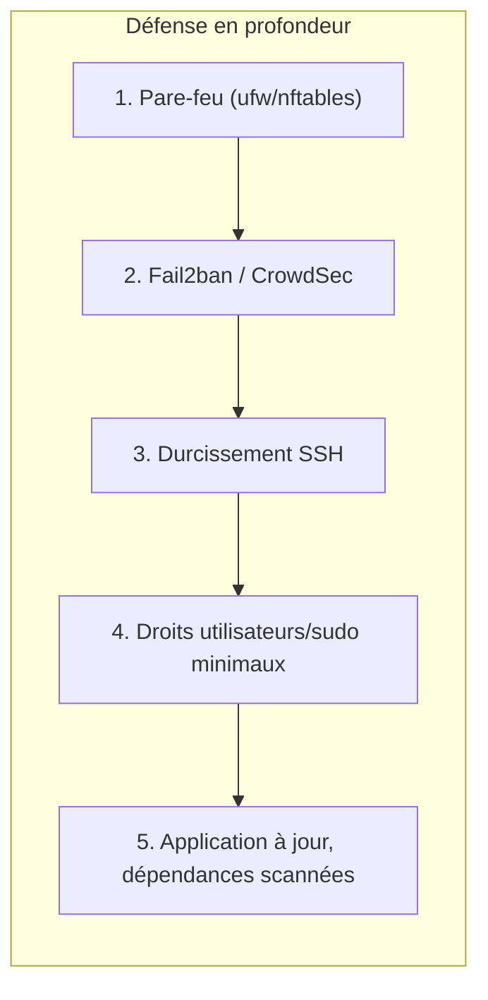
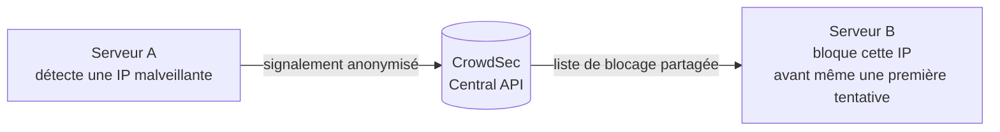

# Chapitre 15 — Sécurité avancée

**Niveau : Avancé**

---

## Introduction

Le chapitre 4 a posé des fondations de sécurité solides : clé SSH, pare-feu minimal, Fail2ban de base. Ces fondations suffisent à écarter la grande majorité des attaques automatisées génériques. Mais un serveur en production réelle, avec de vrais utilisateurs et de vraies données, mérite d'aller plus loin : un audit objectif de durcissement, une protection collaborative à l'échelle d'Internet, des règles de pare-feu plus fines, et une vigilance continue sur les comptes et les droits accordés au fil du temps. Ce chapitre construit cette couche supplémentaire, sans jamais remettre en cause ce qui a déjà été fait au chapitre 4 — il l'étend.

## 🎯 Objectifs pédagogiques

À la fin de ce chapitre, tu sauras : exécuter un audit Lynis complet et interpréter ses résultats ; comprendre le principe de la protection collaborative de CrowdSec et l'installer ; configurer des jails Fail2ban personnalisées au-delà de SSH ; approfondir le durcissement SSH bien au-delà des bases du chapitre 4 ; auditer méthodiquement les comptes utilisateurs d'un serveur ; auditer les droits `sudo` accordés et repérer une dérive de privilèges ; configurer un pare-feu plus fin avec `nftables` ; scanner un projet et une image Docker à la recherche de vulnérabilités connues.

## 📋 Prérequis

Chapitre 4 (sécurité de base) et Chapitre 13 (monitoring, pour recevoir les alertes générées par les outils de ce chapitre) complétés.

## Pourquoi ce chapitre est important

La sécurité n'est jamais un état figé, acquis une fois pour toutes au chapitre 4. Un serveur en production accumule, avec le temps, des comptes créés puis oubliés, des droits `sudo` élargis "temporairement" et jamais retirés, des dépendances logicielles vieillissantes avec des failles découvertes après coup. Ce chapitre installe à la fois des outils de défense active (CrowdSec, Fail2ban avancé) et une discipline d'audit régulier — la sécurité comme processus continu, pas comme case cochée une seule fois.

---

## Concepts fondamentaux

1. **Défense en profondeur** — plusieurs couches de protection indépendantes, aucune n'étant supposée suffisante seule.
2. **Protection collaborative** — bénéficier de l'expérience de milliers d'autres serveurs pour anticiper une attaque.
3. **Audit de durcissement** — une mesure objective et reproductible du niveau de sécurité d'un système.
4. **Dérive de privilèges** — l'accumulation progressive et souvent oubliée de droits accordés au fil du temps.
5. **Vulnérabilité connue (CVE)** — une faille publiquement documentée dans un logiciel ou une dépendance.


**Explication du diagramme :** aucune couche seule n'est infaillible — c'est leur superposition qui rend un serveur réellement résilient. Ce chapitre traite chaque couche individuellement, dans l'ordre de ce diagramme.

---

## Explications détaillées

### 15.1 Lynis : l'audit de durcissement

**Lynis** est un outil d'audit qui inspecte un système Linux dans son ensemble (comptes, permissions, services, configuration réseau, noyau) et produit un rapport détaillé avec un score de durcissement (*hardening index*) et des recommandations concrètes.

```bash
sudo apt install lynis -y
sudo lynis audit system
```
**Résultat attendu :** un long rapport terminal, organisé par catégorie (Boot and services, Kernel, Memory and Processes, Users/Groups, Shells, File systems, Networking, Software: file integrity, Software: malware, Firewalls...), chaque point signalé avec un niveau (suggestion, avertissement) et souvent une référence documentaire.

**Extrait typique :**
```
[+] System Tools
[+] Users, Groups and Authentication
  - Checking password aging (LOGIN_DEFS) [ WEAK ]
    Suggestion: Configure password aging limits...
[+] Firewalls
  - Checking firewall status [ OK ]
Hardening index : 68 [###########.........]
```
**Explication du résultat :** chaque `[ WEAK ]` ou `[ SUGGESTION ]` correspond à un point d'amélioration concret, jamais une simple critique vague — Lynis référence systématiquement la configuration exacte à ajuster.

> ✅ **Bonne pratique** — Ne pas viser un score de 100 à tout prix : certaines suggestions de Lynis ne s'appliquent pas à tous les contextes (un serveur sans interface graphique n'a pas besoin de durcir un gestionnaire d'affichage absent, par exemple). Lire et comprendre chaque suggestion avant de l'appliquer, plutôt que d'appliquer aveuglément pour "faire monter le score".

### 15.2 CrowdSec : la protection collaborative

Fail2ban (chapitre 4) bannit une IP en se basant uniquement sur ce qui se passe **sur ton propre serveur**. **CrowdSec** va plus loin : il partage, de façon anonymisée, les IP malveillantes détectées entre tous les serveurs participant au réseau, et bénéficie en retour de cette intelligence collective.


**Explication du diagramme :** une IP qui attaque un premier serveur dans le monde peut être bloquée préventivement sur ton propre serveur, avant même d'avoir tenté quoi que ce soit chez toi — un avantage structurel qu'aucun serveur isolé ne peut reproduire seul.

```bash
curl -s https://install.crowdsec.net | sudo sh
sudo apt install crowdsec -y
sudo apt install crowdsec-firewall-bouncer-iptables -y
```
Le **bouncer** est le composant qui applique réellement les décisions de blocage (ici, via `iptables`) — CrowdSec détecte et décide, le bouncer exécute.

```bash
sudo cscli collections install crowdsecurity/nginx
sudo cscli collections install crowdsecurity/sshd
sudo systemctl restart crowdsec
sudo cscli decisions list
```
Les **collections** sont des ensembles de scénarios de détection préconfigurés pour un service précis (ici, nginx et sshd) — installées à la demande selon les services réellement exposés sur le serveur.

> 📌 **À retenir** — CrowdSec et Fail2ban ne sont pas mutuellement exclusifs : beaucoup d'administrateurs font coexister les deux, Fail2ban pour une réactivité locale immédiate, CrowdSec pour la protection préventive issue de la communauté.

### 15.3 Fail2ban avancé : jails personnalisées

Le chapitre 4 a configuré Fail2ban pour SSH uniquement. Une jail personnalisée peut protéger n'importe quel service dont les logs suivent un motif régulier.

**Exemple, protéger une route de connexion applicative :**
```ini
# /etc/fail2ban/filter.d/mon-api-login.conf
[Definition]
failregex = ^.*Échec de connexion pour .* depuis <HOST>.*$
```
```ini
# /etc/fail2ban/jail.local, ajout
[mon-api-login]
enabled = true
filter = mon-api-login
logpath = /home/jaslin/app/logs/auth.log
maxretry = 5
findtime = 10m
bantime = 1h
```
**Ce que fait cette configuration :** `failregex` est une expression régulière qui doit correspondre exactement au format des lignes de log d'échec de connexion de l'application — `<HOST>` est un marqueur spécial Fail2ban qui capture l'adresse IP à bannir. Une fois ce motif détecté `maxretry` fois dans la fenêtre `findtime`, l'IP est bannie comme pour SSH.

```bash
sudo fail2ban-client -d   # valide la configuration sans redémarrer
sudo systemctl restart fail2ban
sudo fail2ban-client status mon-api-login
```

> ⚠️ **Attention** — Une expression régulière `failregex` mal écrite ne déclenche jamais de bannissement (silencieusement inefficace) ou, pire, bannit des IP légitimes sur un faux positif. Toujours tester le motif sur des lignes de log réelles avant de le déployer (`fail2ban-regex logpath filterfile`).

### 15.4 Audit SSH approfondi

Au-delà de `PermitRootLogin no` et `PasswordAuthentication no` (chapitre 4) :

```bash
sudo nano /etc/ssh/sshd_config
```
```
MaxAuthTries 3
AllowUsers jaslin
Protocol 2
```
- `MaxAuthTries 3` : ferme la connexion après 3 tentatives d'authentification échouées dans une même session, plutôt que de laisser un nombre illimité d'essais.
- `AllowUsers` : liste blanche explicite des comptes autorisés à se connecter en SSH — même un compte compromis par ailleurs (mot de passe système deviné via une autre voie) ne peut pas se connecter en SSH s'il n'est pas explicitement listé.
- `Protocol 2` : force le protocole SSH version 2 (la version 1, obsolète et vulnérable, n'existe même plus sur les versions récentes d'OpenSSH, mais la directive documente l'intention explicitement).

**Authentification à deux facteurs (2FA) pour SSH**, une couche supplémentaire au-delà de la clé :
```bash
sudo apt install libpam-google-authenticator -y
google-authenticator
```
Configure un second facteur (application TOTP comme Google Authenticator ou Authy) en plus de la clé SSH déjà en place — une compromission de la seule clé privée ne suffit alors plus à elle seule.

> 📌 **À retenir** — La 2FA SSH ajoute une friction réelle même pour l'administrateur légitime. Elle se justifie surtout pour un serveur à très haute sensibilité (données financières, médicales) — pour la majorité des projets de ce manuel, une clé SSH bien gérée (chapitre 4) reste un niveau de sécurité déjà élevé.

### 15.5 Audit des comptes utilisateurs

```bash
cat /etc/passwd | grep '/bin/bash\|/bin/sh'
```
Liste tous les comptes disposant d'un shell interactif (donc potentiellement capables de se connecter) — un compte système (comme `www-data`) n'en a normalement aucun (`/usr/sbin/nologin`), et sa présence dans cette liste mérite d'être investiguée.

```bash
lastlog
```
Affiche la dernière connexion de chaque compte — un compte jamais utilisé depuis des mois, ou dont personne dans l'équipe ne se souvient de la création, est un candidat à la désactivation.

```bash
sudo passwd -l ancien-compte    # verrouille un compte sans le supprimer (réversible)
sudo userdel -r ancien-compte   # supprime définitivement un compte et son dossier personnel
```

> ✅ **Bonne pratique** — Verrouiller (`passwd -l`) plutôt que supprimer immédiatement un compte suspecté inutile, le temps de confirmer qu'il ne sert vraiment plus à rien — une suppression est immédiate et irréversible, un verrouillage ne l'est pas.

### 15.6 Audit des droits `sudo`

```bash
sudo visudo
```
`visudo` valide automatiquement la syntaxe du fichier `sudoers` avant de sauvegarder — un fichier `sudoers` corrompu peut rendre **impossible** toute élévation de privilège, y compris pour corriger l'erreur elle-même.

```bash
getent group sudo
```
Liste tous les membres du groupe `sudo` — chaque nom doit être justifiable ; un compte présent "depuis toujours, on ne sait plus pourquoi" est précisément le signal d'une dérive de privilèges à corriger.

**Droits `sudo` restreints à des commandes précises**, plutôt qu'un accès total :
```
# /etc/sudoers.d/deploiement
jaslin ALL=(ALL) NOPASSWD: /usr/bin/systemctl restart mon-api
```
Ce compte peut redémarrer **uniquement** ce service précis via `sudo`, sans mot de passe (pratique pour un script automatisé), sans jamais obtenir un accès `root` complet.

**Journal des commandes `sudo` exécutées :**
```bash
sudo journalctl _COMM=sudo
```

> ⚠️ **Attention** — `NOPASSWD` sur une commande large (`ALL=(ALL) NOPASSWD: ALL`) équivaut à donner un accès root complet sans aucune friction — à réserver exclusivement à des commandes précises et limitées, jamais comme raccourci de confort général.

### 15.7 Pare-feu avancé : `nftables`

`ufw` (chapitre 4) est une surcouche simplifiée au-dessus de `nftables` (le successeur moderne d'`iptables`). Pour des règles plus fines, `nftables` peut être utilisé directement.

```bash
sudo nft list ruleset
```
Affiche les règles réellement appliquées, y compris celles générées par `ufw` en arrière-plan — utile pour comprendre ce qui se passe réellement "sous" l'abstraction `ufw`.

**Règle avancée : limiter le débit de nouvelles connexions SSH au niveau du pare-feu** (en complément de Fail2ban, une protection différente et plus précoce) :
```bash
sudo nft add rule inet filter input tcp dport 22 ct state new limit rate 5/minute accept
```
**Ce que fait cette règle :** accepte au maximum 5 nouvelles connexions SSH par minute, toutes IP confondues — une protection supplémentaire contre un flot massif de tentatives de connexion, avant même que Fail2ban n'ait eu le temps d'analyser les logs et de décider un bannissement.

> 📌 **À retenir** — `ufw` reste largement suffisant pour la majorité des projets de ce manuel (rappel du chapitre 4) ; `nftables` directement n'est nécessaire que pour des règles que `ufw` ne peut pas exprimer simplement (limitation de débit fine, règles par plage géographique via des listes IP tierces).

### 15.8 Scan de vulnérabilités

**Dépendances applicatives**, rappel et approfondissement du chapitre 10 :
```bash
npm audit
npm audit fix
```

**Images Docker**, avec Trivy :
```bash
sudo apt install trivy -y
trivy image mon-api:1.0
```
**Résultat attendu :** une liste des vulnérabilités connues (CVE) détectées dans les paquets système et dépendances de l'image, classées par sévérité (Critical, High, Medium, Low).

> ✅ **Bonne pratique** — Intégrer `trivy image` comme étape du pipeline CI/CD (chapitre 11), bloquant le déploiement en cas de vulnérabilité critique détectée — exactement le même principe que les tests automatisés bloquants déjà vus.

---

## Analogies clés de ce chapitre

| Notion | Analogie |
|---|---|
| Défense en profondeur | Plusieurs serrures différentes sur une même porte, jamais une seule supposée infaillible |
| CrowdSec | Un quartier où chaque voisin prévient les autres d'un rôdeur repéré |
| Lynis | Un contrôle technique automobile complet, poste par poste |
| Dérive de privilèges | Des clés de bureaux jamais rendues après un changement de poste |

---

## Étude de cas

**Contexte.** Un audit de sécurité, réalisé après plusieurs mois de production sans revue, révèle un compte `sudo` créé "temporairement" pour un stagiaire parti depuis six mois, toujours actif et jamais désactivé — un cas typique et extrêmement fréquent de dérive de privilèges (section 15.6), invisible tant que personne ne l'a activement cherché.

**Démarche de correction.** `getent group sudo` révèle le compte suspect. `lastlog` confirme qu'il n'a pas été utilisé depuis le départ du stagiaire. `sudo passwd -l` le verrouille immédiatement, en attendant confirmation qu'il ne sert vraiment plus à rien avant une suppression définitive. Ce type d'audit, à peine plus long que quelques minutes, aurait dû être fait régulièrement plutôt que découvert par hasard — exactement la discipline que ce chapitre installe comme réflexe périodique, pas comme geste isolé.

---

## Bonnes pratiques (récapitulatif du chapitre)

- Lynis régulièrement, pas seulement une fois à l'installation.
- CrowdSec et Fail2ban peuvent coexister, chacun avec son rôle distinct.
- Une jail Fail2ban personnalisée testée (`fail2ban-regex`) avant déploiement, jamais devinée.
- `AllowUsers` en liste blanche explicite dans `sshd_config`.
- `passwd -l` avant `userdel`, jamais une suppression immédiate sur un simple soupçon.
- `NOPASSWD` réservé à des commandes précises, jamais à un accès `ALL` complet.
- Un scan Trivy intégré au pipeline CI/CD, bloquant sur vulnérabilité critique.

---

## Erreurs fréquentes (récapitulatif du chapitre)

| Erreur | Pourquoi elle arrive | Conséquence |
|---|---|---|
| Compte `sudo` oublié après le départ d'un collaborateur | Aucun audit périodique | Accès administrateur non surveillé, potentiellement compromis |
| `failregex` Fail2ban jamais testée | Confiance aveugle en la configuration | Jail inefficace ou faux positifs sur des IP légitimes |
| `NOPASSWD: ALL` pour un script automatisé | Simplicité de mise en œuvre | Accès root complet sans aucune friction en cas de script compromis |
| Ignorer les résultats Lynis "WEAK" jugés mineurs | Pas le temps d'investiguer chaque point | Accumulation de petites failles, ensemble significatives |
| Image Docker jamais scannée avant déploiement | Étape non intégrée au pipeline | Vulnérabilités connues déployées en production sans le savoir |

---

## Captures d'écran à réaliser

> 📸 **Capture 18**
> **Logiciel :** terminal
> **Pourquoi cette capture est utile :** montrer un rapport Lynis réel, avec son score de durcissement visible.
> **Page/écran concerné :** fin de sortie de `sudo lynis audit system`
> **Niveau de zoom conseillé :** 100 %
> **Montrer :** le "Hardening index" final et quelques suggestions listées
> **Entourer :** le score de durcissement
> **Flouter/masquer :** rien de sensible, sauf si le nom d'hôte est jugé personnel

---

## Laboratoire pratique n°1 — Faire un audit Lynis complet et corriger les points signalés

**Objectifs :** exécuter un audit réel et améliorer concrètement le score de durcissement.
**Prérequis :** chapitre 4 complété.
**Matériel nécessaire :** le VPS.

**Étapes :**
1. Installe et exécute Lynis (section 15.1).
2. Note le score de durcissement initial.
3. Choisis trois suggestions pertinentes pour ton contexte (pas toutes, certaines ne s'appliquent pas).
4. Applique les corrections.
5. Relance l'audit, compare le nouveau score.

**Résultat attendu :** un score de durcissement amélioré, avec une compréhension claire de chaque changement effectué.
**Vérifications :** les trois points corrigés n'apparaissent plus comme "WEAK" au second passage.
**Erreurs fréquentes :** appliquer une suggestion sans comprendre son effet, cassant une fonctionnalité nécessaire.
**Solutions :** toujours lire la documentation référencée par Lynis avant d'appliquer une correction non triviale.

## Laboratoire pratique n°2 — Configurer CrowdSec

**Objectifs :** installer CrowdSec avec les collections pertinentes et confirmer son fonctionnement réel.
**Prérequis :** nginx actif (chapitre 9), SSH configuré (chapitre 4).
**Matériel nécessaire :** le VPS.

**Étapes :**
1. Installe CrowdSec et le bouncer firewall (section 15.2).
2. Installe les collections `nginx` et `sshd`.
3. `sudo cscli decisions list` — observe une liste vide initialement (normal).
4. Provoque volontairement plusieurs échecs de connexion SSH depuis une autre machine ou un autre terminal (avec un utilisateur inexistant, sans risque).
5. Relance `cscli decisions list`, confirme l'apparition d'une décision de blocage.

**Résultat attendu :** une IP de test bloquée après plusieurs tentatives échouées, visible dans les décisions CrowdSec.
**Vérifications :** `sudo cscli metrics` montre une activité de détection réelle.
**Erreurs fréquentes :** tester depuis sa propre IP habituelle, se bloquant soi-même par erreur.
**Solutions :** si cela arrive, `sudo cscli decisions delete --ip TON_IP` débloque immédiatement depuis le serveur.

## Laboratoire pratique n°3 — Réaliser un audit manuel des comptes et des droits sudo

**Objectifs :** appliquer la méthode d'audit des sections 15.5 et 15.6 sur le serveur réel.
**Prérequis :** chapitre 4 complété.
**Matériel nécessaire :** le VPS.

**Étapes :**
1. Liste tous les comptes à shell interactif (`/etc/passwd`).
2. Pour chacun, vérifie la dernière connexion (`lastlog`).
3. Liste les membres du groupe `sudo` (`getent group sudo`).
4. Pour chaque membre, justifie explicitement (par écrit, dans un fichier de notes) pourquoi ce droit est nécessaire.
5. Si un compte de test a été créé au fil de ce manuel et n'est plus nécessaire, verrouille-le.

**Résultat attendu :** une liste claire et justifiée de tous les comptes et droits `sudo` actifs sur le serveur.
**Vérifications :** aucun compte ni droit `sudo` sans justification écrite explicite.
**Erreurs fréquentes :** verrouiller par erreur son propre compte principal, perdant l'accès administrateur.
**Solutions :** toujours vérifier trois fois le nom du compte ciblé avant `passwd -l`, et garder une session active en parallèle (rappel du réflexe du chapitre 4).

---

## Exercices

1. Explique pourquoi la défense en profondeur repose sur plusieurs couches indépendantes plutôt qu'une seule très robuste.
2. Quelle est la différence fondamentale entre la protection de Fail2ban et celle de CrowdSec ?
3. Pourquoi `passwd -l` est-il préférable à `userdel` pour un compte suspecté inutile, mais pas encore confirmé ?
4. Un script automatisé a besoin de redémarrer un seul service via `sudo`. Explique pourquoi `NOPASSWD: ALL` est une mauvaise pratique dans ce cas, et propose une alternative.
5. Pourquoi scanner une image Docker avec Trivy avant déploiement, alors que `npm audit` a déjà été exécuté sur le code source ?

---

## Quiz

**Question 1.** Lynis produit :
a) Un pare-feu automatique
b) Un rapport d'audit avec un score de durcissement et des suggestions concrètes
c) Une sauvegarde du système
d) Un certificat SSL

**Question 2.** CrowdSec se distingue de Fail2ban principalement par :
a) Sa vitesse d'exécution
b) Le partage collaboratif et anonymisé de renseignements sur les IP malveillantes entre serveurs participants
c) Son coût, gratuit contrairement à Fail2ban
d) Il ne fonctionne que sur Windows

**Question 3.** `AllowUsers` dans `sshd_config` sert à :
a) Autoriser tous les utilisateurs système par défaut
b) Restreindre explicitement la liste des comptes autorisés à se connecter en SSH
c) Activer l'authentification par mot de passe
d) Générer des clés SSH automatiquement

**Question 4.** `NOPASSWD: ALL` dans les droits sudo d'un utilisateur signifie :
a) Cet utilisateur ne peut exécuter aucune commande
b) Cet utilisateur a un accès root complet sans aucune friction
c) Cet utilisateur doit changer son mot de passe
d) C'est sans effet réel

**Question 5.** Trivy sert à :
a) Générer des certificats SSL
b) Scanner une image Docker à la recherche de vulnérabilités connues (CVE)
c) Remplacer Fail2ban
d) Sauvegarder une base de données

> 🔑 **Corrigé** — 1: b · 2: b · 3: b · 4: b · 5: b

---

## 📝 Résumé du chapitre

- La sécurité est une défense en profondeur : plusieurs couches indépendantes, aucune supposée suffisante seule.
- Lynis produit un audit objectif et reproductible, avec un score de durcissement à suivre dans le temps.
- CrowdSec ajoute une protection collaborative à l'échelle d'Internet, complémentaire à Fail2ban, pas un remplacement.
- Des jails Fail2ban personnalisées protègent n'importe quel service, à condition d'un `failregex` testé.
- L'audit SSH va au-delà des bases : `MaxAuthTries`, `AllowUsers`, éventuellement une 2FA pour les contextes les plus sensibles.
- Les comptes et droits `sudo` doivent être audités périodiquement — la dérive de privilèges est silencieuse et progressive.
- `nftables` directement permet des règles de pare-feu plus fines que `ufw` quand nécessaire.
- Trivy scanne les images Docker à la recherche de vulnérabilités connues, intégrable au pipeline CI/CD.

## ✅ Checklist avant de passer au chapitre 16

- [ ] Un audit Lynis a été exécuté, avec au moins trois points corrigés.
- [ ] CrowdSec est actif, avec au moins une collection installée et testée.
- [ ] Tous les comptes et droits `sudo` du serveur sont justifiés explicitement.
- [ ] Je comprends la différence entre Fail2ban et CrowdSec.
- [ ] J'ai réalisé les trois laboratoires et obtenu au moins 4/5 au quiz.

---

## Glossaire du chapitre

**Défense en profondeur**
Définition simple : plusieurs couches de sécurité indépendantes, jamais une seule supposée suffisante.
Définition technique : une stratégie de sécurité redondante où chaque couche (réseau, système, application) protège contre une classe différente de menace, limitant l'impact d'une défaillance isolée.
Exemple concret : pare-feu + Fail2ban + SSH par clé + droits sudo minimaux, ensemble.
Voir : Chapitre 15, introduction des concepts fondamentaux.

**Hardening index**
Définition simple : un score mesurant objectivement le niveau de durcissement d'un système.
Définition technique : un indice calculé par Lynis à partir du nombre de tests réussis, avertissements et suggestions, pondérés par catégorie.
Exemple concret : `Hardening index : 68 [###########.........]`.
Voir : Chapitre 15, section 15.1.

**Dérive de privilèges**
Définition simple : l'accumulation progressive et souvent oubliée de droits accordés au fil du temps.
Définition technique : un écart croissant entre les droits effectivement nécessaires à un compte et ceux réellement accordés, non corrigé faute d'audit périodique.
Exemple concret : un compte `sudo` de stagiaire jamais désactivé après son départ.
Voir : Chapitre 15, section 15.6.

---

## ❓ FAQ

**Faut-il installer CrowdSec ET Fail2ban, ou choisir l'un des deux ?**
Les deux peuvent coexister sans conflit — Fail2ban pour une réactivité locale immédiate basée sur tes propres logs, CrowdSec pour bénéficier en plus de l'intelligence collective d'un réseau de serveurs. Pour un tout petit projet, Fail2ban seul (chapitre 4) reste un point de départ raisonnable.

**Un score Lynis de 100 est-il l'objectif à atteindre ?**
Non — certaines suggestions ne s'appliquent pas à tous les contextes, et viser 100 à tout prix pousse parfois à appliquer des changements inutiles ou contre-productifs. Un score en progression constante, avec chaque changement compris, vaut mieux qu'un score maximal appliqué sans réflexion.

**La 2FA SSH est-elle nécessaire pour tous les projets de ce manuel ?**
Non, elle ajoute une friction réelle et se justifie surtout pour des données très sensibles. Une clé SSH bien gérée, sans mot de passe activé, sans root direct (chapitre 4), reste déjà un niveau de sécurité solide pour la majorité des projets.

---

## Références officielles

- Lynis Documentation — [cisofy.com/lynis](https://cisofy.com/lynis/)
- CrowdSec Documentation — [docs.crowdsec.net](https://docs.crowdsec.net/)
- Fail2ban Documentation — [fail2ban.readthedocs.io](https://fail2ban.readthedocs.io/)
- OpenSSH sshd_config — [man.openbsd.org/sshd_config](https://man.openbsd.org/sshd_config)
- nftables Wiki — [wiki.nftables.org](https://wiki.nftables.org/)
- Trivy Documentation — [trivy.dev](https://trivy.dev/)

---

## Conclusion

Le serveur dispose maintenant d'une sécurité à plusieurs niveaux, active et auditée, bien au-delà des fondations du chapitre 4. Le chapitre 16 complète cette résilience par le dernier pilier encore incomplet : des sauvegardes professionnelles, chiffrées et testées, capables de survivre non seulement à une erreur humaine mais à la perte totale du serveur lui-même.

---

⬅️ [Chapitre 14 — Performance](14-performance.md) · ➡️ **Suite : [Chapitre 16 — Sauvegardes avancées](16-sauvegardes-avancees.md)**
