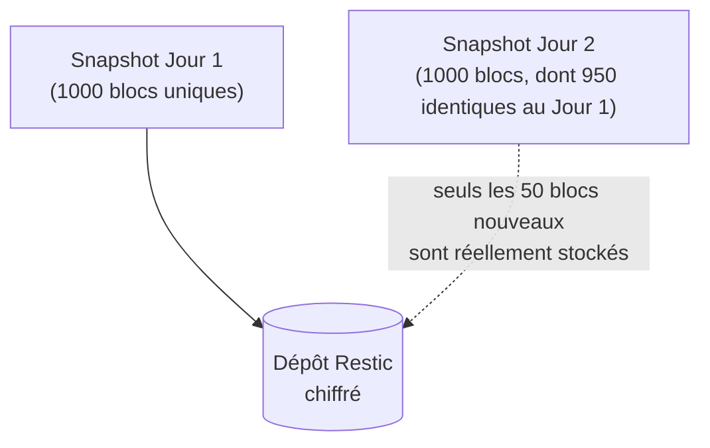
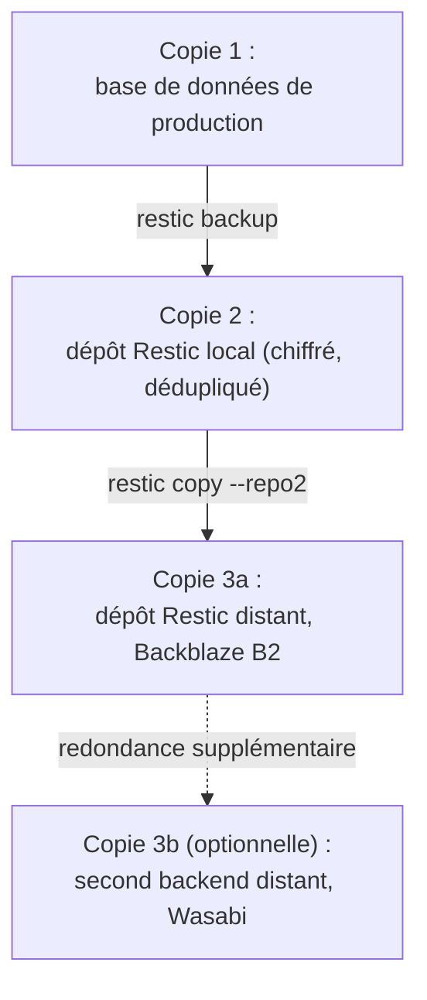
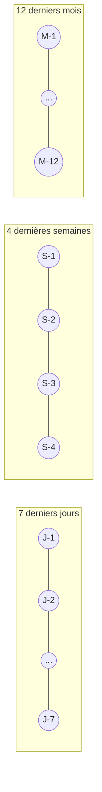

# Chapitre 16 — Sauvegardes avancées

**Niveau : Avancé**

---

## Introduction

Le chapitre 12 a posé les bases indispensables : `mysqldump`, `pg_dump`, un script cron, une copie distante. Ces outils suffisent pour un premier projet, mais montrent leurs limites à mesure qu'un projet grandit — des sauvegardes qui prennent de plus en plus de place, aucune protection si le stockage distant lui-même est compromis, une politique de rétention gérée à la main avec des `find -mtime -delete` approximatifs. Ce chapitre introduit des outils professionnels, conçus spécifiquement pour la sauvegarde à grande échelle : chiffrement natif, déduplication, et une politique de rétention exprimée en une seule ligne de configuration.

## 🎯 Objectifs pédagogiques

À la fin de ce chapitre, tu sauras : expliquer les limites réelles d'une sauvegarde simple type `mysqldump` en cron ; utiliser Restic pour des sauvegardes chiffrées et dédupliquées ; utiliser BorgBackup comme alternative avec ses propres compromis ; configurer une destination de sauvegarde distante professionnelle (Backblaze B2, Wasabi, AWS S3) ; appliquer la règle 3-2-1 avec des outils adaptés à une vraie échelle de production ; distinguer sauvegarde incrémentale et complète, et comprendre pourquoi la déduplication change la donne ; définir une politique de rétention précise et automatisée ; mettre en place un test de restauration automatisé et régulier, avec alerte en cas d'échec.

## 📋 Prérequis

Chapitre 12 (sauvegardes de base) entièrement complété — ce chapitre étend ces notions, il ne les réexplique pas. Chapitre 13 (monitoring) utile pour la section 16.8.

## Pourquoi ce chapitre est important

Une sauvegarde simple (chapitre 12) protège contre l'erreur la plus fréquente — une suppression accidentelle, une migration défaillante. Mais elle protège mal contre des scénarios plus graves : un stockage distant lui-même compromis (si les sauvegardes n'y sont pas chiffrées), un espace de stockage qui explose avec l'accumulation de copies complètes redondantes, ou une politique de rétention gérée à la main qui finit par contenir soit trop peu d'historique, soit trop de fichiers inutiles. Ce chapitre ferme ces angles morts avec des outils dont c'est la seule raison d'être.

---

## Concepts fondamentaux

1. **Dépôt (repository)** — l'espace de stockage structuré où Restic/Borg organisent les sauvegardes.
2. **Snapshot** — un instantané nommé et daté, comme un commit Git (chapitre 3) mais pour des fichiers.
3. **Déduplication** — ne stocker qu'une seule fois un bloc de données identique, même répété entre plusieurs sauvegardes.
4. **Chiffrement au repos** — les données sont illisibles sans la clé, même pour qui a un accès complet au stockage distant.
5. **Rétention** — la politique définissant combien de sauvegardes garder, et pendant combien de temps.
6. **Backend S3-compatible** — un standard d'API de stockage objet, partagé par de nombreux fournisseurs.

---

## Explications détaillées

### 16.1 Limites des sauvegardes simples

Rappel du chapitre 12 : `mysqldump`/`pg_dump` produisent un fichier complet à chaque exécution. Trois limites deviennent significatives à mesure qu'un projet grandit :

| Limite | Conséquence |
|---|---|
| Pas de déduplication | Chaque sauvegarde quotidienne est une copie presque intégralement redondante de la précédente, gonflant l'espace de stockage |
| Pas de chiffrement natif | Une sauvegarde interceptée ou un stockage distant compromis expose les données en clair (sauf ajout manuel de `gpg`, chapitre 12) |
| Rétention gérée à la main | Un `find -mtime +14 -delete` approximatif, sans granularité (garder les quotidiennes récentes, les hebdomadaires plus anciennes, les mensuelles très anciennes) |

> 📌 **À retenir** — Ces limites ne rendent pas les sauvegardes du chapitre 12 obsolètes ou inutiles — elles restent parfaitement valables pour un petit projet. Ce chapitre s'adresse à un projet dont l'échelle (volume de données, exigences de rétention, sensibilité des données) justifie l'investissement dans des outils plus sophistiqués.

### 16.2 Restic : dépôts, snapshots, chiffrement natif

**Restic** est un outil de sauvegarde moderne, chiffrant nativement chaque sauvegarde, dédupliquant automatiquement les données identiques entre exécutions, et supportant de nombreux backends de stockage.

```bash
sudo apt install restic -y
```

**Initialiser un dépôt** (local, pour commencer) :
```bash
restic init --repo /var/backups/restic-repo
```
Restic demande de définir un mot de passe de chiffrement — **à conserver précieusement, sans lui aucune restauration n'est possible, y compris pour le propriétaire légitime.**

#### `restic backup`
**Description :** crée un nouveau snapshot chiffré et dédupliqué d'un dossier ou fichier.
**Syntaxe :** `restic --repo chemin backup chemin-a-sauvegarder`
**Cas d'utilisation :** sauvegarder un dump de base de données, ou directement des fichiers (uploads, configuration).
**Exemple :**
```bash
mysqldump -u nomapp_user -p'MOT_DE_PASSE' nomapp > /tmp/dump.sql
restic --repo /var/backups/restic-repo --password-file /root/.restic-pass backup /tmp/dump.sql
```
**Résultat attendu :**
```
snapshot a1b2c3d4 saved
```
**Explication du résultat :** un identifiant unique de snapshot, comparable à un hash de commit Git (chapitre 3) — chaque snapshot reste individuellement accessible, même après des dizaines d'exécutions suivantes.
**Erreurs possibles :** `unable to open repository` si le mot de passe fourni est incorrect.
**Vérification :** `restic --repo ... snapshots` liste tous les snapshots existants.
**Cas pratiques :** exécution quotidienne via cron (section 16.7), remplaçant le simple `gzip` du chapitre 12.


**Explication du diagramme :** contrairement à `mysqldump` seul (qui écrirait deux fichiers complets pour deux jours consécutifs), Restic ne stocke physiquement qu'une seule fois chaque bloc de données identique — c'est la **déduplication**. Le second snapshot occupe donc un espace disque proportionnel à ce qui a réellement changé, pas à la taille totale de la sauvegarde.

**Restaurer un snapshot :**
```bash
restic --repo /var/backups/restic-repo --password-file /root/.restic-pass restore a1b2c3d4 --target /tmp/restauration
```

### 16.3 BorgBackup : une alternative avec déduplication

**BorgBackup** (souvent abrégé "Borg") suit une philosophie très proche de Restic — chiffrement natif, déduplication — avec quelques différences pratiques.

```bash
sudo apt install borgbackup -y
borg init --encryption=repokey /var/backups/borg-repo
borg create /var/backups/borg-repo::sauvegarde-{now} /tmp/dump.sql
borg list /var/backups/borg-repo
```

| Critère | Restic | BorgBackup |
|---|---|---|
| Langage/distribution | Binaire unique Go, très simple à installer | Paquet Python, dépendances système |
| Backends distants supportés | Très nombreux (S3, B2, SFTP, Azure...) nativement | Principalement SSH/SFTP nativement, S3 via des outils tiers |
| Déduplication | Oui | Oui, réputée légèrement plus efficace sur certains types de données |
| Compression | Oui (plusieurs algorithmes) | Oui |
| Courbe d'apprentissage | Légèrement plus simple | Légèrement plus riche en options avancées |

> 📌 **À retenir** — Les deux outils sont d'un niveau de qualité et de fiabilité comparable, largement utilisés en production dans l'industrie. Restic, avec son support natif de nombreux backends cloud (section 16.4), est souvent le choix par défaut le plus simple pour un serveur isolé envoyant ses sauvegardes vers un stockage objet distant — Borg reste excellent pour une sauvegarde vers un second serveur via SSH.

### 16.4 Destinations distantes : Backblaze B2, Wasabi, AWS S3

Trois fournisseurs de stockage objet, tous compatibles avec le standard **S3** (initialement propriétaire à Amazon, devenu une API de facto standard adoptée par de nombreux concurrents).

| Fournisseur | Points forts | Idéal pour |
|---|---|---|
| **Backblaze B2** | Très bon marché, simple, gratuit jusqu'à 10 Go | Petits projets, débuter avec un stockage distant réel |
| **Wasabi** | Pas de frais de sortie (egress), prix prévisible | Sauvegardes fréquemment restaurées/testées sans coût surprise |
| **AWS S3** | Écosystème le plus large, intégrations infinies | Déjà dans l'écosystème AWS pour d'autres besoins |

**Configurer Restic avec un backend S3-compatible** (Backblaze B2, dans cet exemple) :
```bash
export RESTIC_REPOSITORY="s3:https://s3.us-west-002.backblazeb2.com/nom-du-bucket"
export AWS_ACCESS_KEY_ID="cle-application-id"
export AWS_SECRET_ACCESS_KEY="cle-application-secrete"
export RESTIC_PASSWORD_FILE="/root/.restic-pass"

restic init
restic backup /tmp/dump.sql
```
> ⚠️ **Attention** — Ces variables d'environnement contiennent des secrets réels (rappel du chapitre 1, section 1.10) — jamais écrites dans un script versionné, toujours dans un fichier séparé non suivi par Git, avec des permissions strictes (`chmod 600`).

### 16.5 La règle 3-2-1, approfondie

Rappel du chapitre 12 : 3 copies, 2 supports, 1 hors site. Avec les outils de ce chapitre :


**Explication du diagramme :** `restic copy` permet de répliquer un dépôt entier vers un second dépôt distant, sans repasser par la source originale — une redondance supplémentaire (au-delà du strict minimum 3-2-1) pour les projets dont la criticité le justifie, en évitant de dépendre d'un seul fournisseur cloud.

### 16.6 Sauvegardes incrémentales vs complètes

Une sauvegarde **complète** capture l'intégralité des données à chaque exécution (le comportement de `mysqldump` seul, chapitre 12). Une sauvegarde **incrémentale** ne capture que ce qui a changé depuis la précédente.

> 💡 **Analogie** — Une sauvegarde complète, c'est réimprimer un livre entier chaque fois qu'une seule phrase change. Une sauvegarde incrémentale, c'est n'imprimer que la page modifiée, en gardant une référence vers le reste du livre déjà imprimé.

Restic et Borg vont plus loin qu'une simple incrémentalité classique : grâce à la déduplication (section 16.2), chaque `restic backup` **se comporte comme une sauvegarde complète du point de vue de l'utilisateur** (chaque snapshot peut être restauré intégralement et indépendamment, contrairement à une chaîne d'incréments classique où il faut parfois rejouer plusieurs sauvegardes dans l'ordre) — **tout en ne consommant, en espace de stockage réel, que l'équivalent d'une sauvegarde incrémentale.** C'est le meilleur des deux approches.

### 16.7 Politique de rétention

#### `restic forget`
**Description :** applique une politique de rétention, supprimant les snapshots qui ne correspondent plus aux règles définies.
**Syntaxe :** `restic forget [options de rétention] [--prune]`
**Options principales :** `--keep-daily N`, `--keep-weekly N`, `--keep-monthly N`, `--keep-yearly N`.
**Cas d'utilisation :** garder un historique structuré sans accumulation indéfinie.
**Exemple :**
```bash
restic --repo /var/backups/restic-repo forget \
  --keep-daily 7 \
  --keep-weekly 4 \
  --keep-monthly 12 \
  --prune
```
**Résultat attendu :** conservation des 7 derniers snapshots quotidiens, des 4 derniers hebdomadaires, des 12 derniers mensuels — tout le reste supprimé.
**Explication du résultat :** `--prune` supprime physiquement les blocs de données devenus orphelins après suppression des snapshots (sans cette option, `forget` retire seulement les références, l'espace disque n'étant pas immédiatement libéré).
**Erreurs possibles :** aucune en usage normal ; une politique trop agressive (`--keep-daily 1`) peut supprimer un snapshot dont on aurait eu besoin — réfléchir la politique selon le besoin réel de recul historique.
**Vérification :** `restic snapshots` avant et après, pour confirmer le nombre attendu de snapshots conservés.
**Cas pratiques :** exécuté juste après chaque `restic backup` dans le script cron automatisé.



### 16.8 Tests de restauration automatisés

Rappel capital du chapitre 12 : une sauvegarde jamais restaurée n'est qu'une hypothèse. Ce principe se automatise ici plutôt que de dépendre d'un rappel trimestriel manuel.

```bash
#!/bin/bash
# ~/scripts/test-restauration.sh
set -e

RESTORE_DIR="/tmp/test-restauration-$(date +%Y%m%d)"
LATEST_SNAPSHOT=$(restic --repo /var/backups/restic-repo snapshots --latest 1 --json | jq -r '.[0].short_id')

restic --repo /var/backups/restic-repo --password-file /root/.restic-pass restore "$LATEST_SNAPSHOT" --target "$RESTORE_DIR"

# Vérification réelle du contenu, pas seulement l'absence d'erreur de restauration
if mysql -u root -p'MOT_DE_PASSE' -e "SOURCE $RESTORE_DIR/tmp/dump.sql" test_restauration_db 2>/dev/null \
   && [ "$(mysql -u root -p'MOT_DE_PASSE' test_restauration_db -N -e 'SELECT COUNT(*) FROM utilisateurs')" -gt 0 ]; then
  echo "Test de restauration réussi : $(date)"
else
  curl -X POST -H 'Content-Type: application/json' \
    -d '{"text":"🚨 Échec du test de restauration automatisé — investiguer immédiatement"}' \
    "$SLACK_WEBHOOK_URL"
fi

rm -rf "$RESTORE_DIR"
```
**Ce que fait ce script :** restaure le dernier snapshot vers un emplacement temporaire, tente de le charger dans une base de test, et vérifie qu'une table connue contient réellement des données — pas seulement que la commande de restauration s'est exécutée sans erreur technique, mais que le **contenu** est authentiquement exploitable.

```bash
crontab -e
```
```
0 4 1 * * /home/jaslin/scripts/test-restauration.sh >> /var/log/test-restauration.log 2>&1
```
Exécuté le premier de chaque mois — rejoint directement le monitoring du chapitre 13 : l'échec de ce script peut lui-même déclencher une alerte Alertmanager si le job est supervisé par un exporter dédié (une piste avancée, au-delà du périmètre strict de ce chapitre, mais une extension naturelle une fois les deux chapitres maîtrisés).

---

## Analogies clés de ce chapitre

| Notion | Analogie |
|---|---|
| Déduplication | Ne pas réimprimer un livre entier pour corriger une seule phrase |
| Snapshot Restic/Borg | Un commit Git, mais pour des fichiers plutôt que du code |
| Chiffrement au repos | Un coffre-fort dont même le gardien du bâtiment ne connaît pas la combinaison |
| Politique de rétention | Un album photo qui garde chaque jour de la semaine dernière, chaque semaine du mois dernier, chaque mois de l'année dernière |

---

## Étude de cas

**Contexte.** Une entreprise, après plusieurs années de croissance, découvre que son espace de stockage de sauvegardes (avec `mysqldump` simple, chapitre 12) a explosé : des centaines de fichiers quasi identiques accumulés, sans réelle politique de rétention, coûtant chaque mois plus cher en stockage cloud que la base de données elle-même n'en occupe.

**Migration vers Restic.** Le premier `restic backup` du nouveau dépôt reste volumineux (rien à dédupliquer encore). Mais dès le second jour, la déduplication réduit drastiquement l'espace physique utilisé — seuls les blocs réellement modifiés depuis la veille sont stockés. Une politique `--keep-daily 7 --keep-weekly 4 --keep-monthly 12` remplace l'accumulation informe précédente par un historique structuré et prévisible. Le coût de stockage mensuel diminue significativement, tout en offrant un **meilleur** niveau de recul historique (des sauvegardes mensuelles remontant à un an, impossibles à conserver économiquement avec l'ancienne méthode).

---

## Bonnes pratiques (récapitulatif du chapitre)

- Le mot de passe de chiffrement Restic/Borg conservé dans un gestionnaire de secrets séparé, jamais uniquement sur le serveur sauvegardé lui-même.
- `restic copy` vers un second backend pour les projets dont la criticité le justifie.
- `--prune` systématique après `forget`, pour libérer réellement l'espace.
- Un test de restauration automatisé mensuel, avec alerte réelle en cas d'échec — pas seulement un rappel humain trimestriel.
- Vérifier le **contenu** restauré, pas seulement l'absence d'erreur technique de la commande de restauration.

---

## Erreurs fréquentes (récapitulatif du chapitre)

| Erreur | Pourquoi elle arrive | Conséquence |
|---|---|---|
| Mot de passe de chiffrement perdu | Conservé uniquement sur le serveur sauvegardé | Sauvegardes définitivement irrécupérables, même intactes |
| `forget` sans `--prune` | Option oubliée | Espace disque jamais réellement libéré malgré la politique de rétention |
| Secrets S3 en clair dans un script versionné | Habitude non corrigée depuis le chapitre 3 | Fuite d'accès complet au stockage de sauvegardes |
| Test de restauration vérifiant seulement l'absence d'erreur | Script incomplet | Un fichier restauré mais vide ou corrompu passe le test à tort |
| Un seul backend distant, jamais de redondance | Coût perçu comme superflu | Dépendance totale à un seul fournisseur en cas de panne de leur côté |

---

## Captures d'écran à réaliser

> 📸 **Capture 19**
> **Logiciel :** terminal
> **Pourquoi cette capture est utile :** rendre visible la déduplication réelle, un concept autrement abstrait.
> **Page/écran concerné :** sortie de `restic backup` après un second run sur les mêmes données peu modifiées
> **Niveau de zoom conseillé :** 100 %
> **Montrer :** les statistiques de fin d'exécution (`Added to the repository`, taille ajoutée bien inférieure à la taille totale)
> **Entourer :** la ligne indiquant la taille réellement ajoutée au dépôt
> **Flouter/masquer :** rien de sensible sur cet écran

---

## Laboratoire pratique n°1 — Mettre en place Restic vers un stockage distant

**Objectifs :** configurer Restic avec un backend S3-compatible réel et réaliser une première sauvegarde chiffrée.
**Prérequis :** un compte Backblaze B2 (offre gratuite suffisante pour ce laboratoire).
**Matériel nécessaire :** le VPS, un compte Backblaze B2.

**Étapes :**
1. Crée un bucket B2 et une clé d'application dédiée.
2. Configure les variables d'environnement Restic (section 16.4).
3. `restic init`.
4. Sauvegarde un dump de base de test.
5. Confirme la présence des fichiers chiffrés sur le bucket B2 (interface web) — illisibles sans le mot de passe Restic.

**Résultat attendu :** un dépôt Restic distant fonctionnel, contenant un premier snapshot.
**Vérifications :** `restic snapshots` liste le snapshot créé.
**Erreurs fréquentes :** clé d'application B2 avec des droits insuffisants (lecture seule au lieu de lecture/écriture).
**Solutions :** vérifier les permissions de la clé dans l'interface Backblaze avant de réessayer.

## Laboratoire pratique n°2 — Comparer Restic et BorgBackup sur un même jeu de données

**Objectifs :** observer concrètement les différences pratiques entre les deux outils.
**Prérequis :** Laboratoire 1 complété.
**Matériel nécessaire :** le VPS, un jeu de données de test identique pour les deux outils.

**Étapes :**
1. Installe BorgBackup en plus de Restic.
2. Initialise un dépôt Borg local.
3. Sauvegarde le même jeu de données avec les deux outils.
4. Modifie légèrement les données, sauvegarde à nouveau avec les deux.
5. Compare l'espace disque réellement utilisé par chaque dépôt (`restic stats`, `borg info`).

**Résultat attendu :** les deux outils montrent une déduplication efficace, avec des tailles comparables.
**Vérifications :** la taille du second snapshot/archive est nettement inférieure à celle qu'occuperait une copie complète.
**Erreurs fréquentes :** comparer des jeux de données différents entre les deux outils, faussant la comparaison.
**Solutions :** utiliser strictement le même dossier source pour les deux tests.

## Laboratoire pratique n°3 — Automatiser un test de restauration mensuel

**Objectifs :** mettre en place le script de la section 16.8 et confirmer son fonctionnement, y compris en cas d'échec simulé.
**Prérequis :** Laboratoire 1 complété, un webhook Slack/Discord (chapitre 11 ou 13).
**Matériel nécessaire :** le VPS.

**Étapes :**
1. Écris le script de test de restauration automatisé.
2. Exécute-le manuellement, confirme un message de succès.
3. Simule un échec (corromps volontairement le mot de passe utilisé dans le script, ou vise un snapshot inexistant).
4. Confirme la réception de l'alerte d'échec.
5. Corrige, programme le cron mensuel.

**Résultat attendu :** une alerte réelle reçue en cas d'échec simulé, un message de succès en cas normal.
**Vérifications :** le log du script (`/var/log/test-restauration.log`) reflète fidèlement chaque exécution.
**Erreurs fréquentes :** un script qui affiche "succès" même en cas d'échec partiel, faute de vérification réelle du contenu restauré.
**Solutions :** toujours vérifier une donnée réelle (comptage de lignes, contenu d'un champ connu), jamais seulement l'absence d'erreur de la commande de restauration elle-même.

---

## Exercices

1. Explique la déduplication avec tes propres mots, sans utiliser l'analogie du chapitre.
2. Pourquoi le mot de passe de chiffrement Restic ne doit-il jamais être stocké uniquement sur le serveur qu'il protège ?
3. Quelle est la différence entre une sauvegarde incrémentale classique et l'approche de Restic/Borg, qui combine les avantages de l'incrémentale et de la complète ?
4. Explique pourquoi `--prune` est nécessaire après `restic forget` pour réellement libérer de l'espace disque.
5. Pourquoi un test de restauration automatisé qui ne vérifie que l'absence d'erreur technique peut-il donner un faux sentiment de sécurité ?

---

## Quiz

**Question 1.** La déduplication, dans Restic/Borg, signifie :
a) Compresser chaque fichier individuellement
b) Ne stocker qu'une seule fois un bloc de données identique, même répété entre plusieurs sauvegardes
c) Supprimer les anciennes sauvegardes automatiquement
d) Chiffrer les données deux fois pour plus de sécurité

**Question 2.** Sans le mot de passe de chiffrement Restic :
a) La restauration reste possible via un mode de secours
b) Aucune restauration n'est possible, même pour le propriétaire légitime
c) Restic génère un nouveau mot de passe automatiquement
d) Seules les métadonnées sont perdues, pas les données

**Question 3.** `restic forget --keep-daily 7 --keep-weekly 4 --prune` :
a) Supprime toutes les sauvegardes de plus de 7 jours sans exception
b) Applique une politique de rétention structurée et libère réellement l'espace des snapshots supprimés
c) Chiffre les sauvegardes existantes
d) Crée une nouvelle sauvegarde complète

**Question 4.** Pourquoi tester une restauration en vérifiant le contenu réel plutôt que juste l'absence d'erreur ?
a) Ce n'est jamais nécessaire, l'absence d'erreur suffit
b) Une commande peut réussir techniquement tout en restaurant un fichier vide ou corrompu
c) Pour accélérer le test
d) C'est une exigence légale uniquement

**Question 5.** Un backend S3-compatible signifie :
a) Que seul Amazon S3 peut être utilisé
b) Que plusieurs fournisseurs (Backblaze, Wasabi, AWS...) partagent une API de stockage objet standardisée
c) Qu'aucun chiffrement n'est possible
d) Que la sauvegarde est automatiquement gratuite

> 🔑 **Corrigé** — 1: b · 2: b · 3: b · 4: b · 5: b

---

## 📝 Résumé du chapitre

- Les sauvegardes simples (chapitre 12) montrent leurs limites à l'échelle : pas de déduplication, pas de chiffrement natif, rétention gérée à la main.
- Restic et BorgBackup chiffrent nativement et dédupliquent chaque sauvegarde, combinant les avantages d'une sauvegarde complète (restauration indépendante) et incrémentale (espace disque minimal).
- Backblaze B2, Wasabi et AWS S3 sont des destinations distantes professionnelles, compatibles avec le standard S3.
- `restic forget` avec des options `--keep-*` applique une politique de rétention précise, `--prune` libère réellement l'espace.
- Un test de restauration automatisé, vérifiant le contenu réel et pas seulement l'absence d'erreur, transforme une hypothèse de fiabilité en une certitude régulièrement reconfirmée.

## ✅ Checklist avant de passer au chapitre 17

- [ ] Un dépôt Restic (ou Borg) fonctionnel, avec au moins un backend distant configuré.
- [ ] Une politique de rétention définie et appliquée (`--keep-daily`/`--keep-weekly`/`--keep-monthly`).
- [ ] Un test de restauration automatisé, vérifiant le contenu réel, avec alerte en cas d'échec.
- [ ] Le mot de passe de chiffrement conservé en lieu sûr, séparément du serveur sauvegardé.
- [ ] J'ai réalisé les trois laboratoires et obtenu au moins 4/5 au quiz.

---

## Glossaire du chapitre

**Dépôt (repository, Restic/Borg)**
Définition simple : l'espace de stockage structuré où les sauvegardes chiffrées et dédupliquées sont organisées.
Définition technique : une structure de données propriétaire à l'outil, contenant des blocs de données chiffrés référencés par des index, indépendante du support physique (local, SFTP, S3...).
Exemple concret : `s3:https://s3.us-west-002.backblazeb2.com/nom-du-bucket`.
Voir : Chapitre 16, section 16.2.

**Snapshot (Restic/Borg)**
Définition simple : un instantané nommé et daté d'une sauvegarde.
Définition technique : une référence immuable vers un ensemble de blocs de données à un instant précis, restaurable indépendamment des autres snapshots du même dépôt.
Exemple concret : `snapshot a1b2c3d4 saved`.
Voir : Chapitre 16, section 16.2.

**Déduplication**
Définition simple : ne stocker qu'une seule fois une donnée identique, même répétée plusieurs fois.
Définition technique : une technique de stockage qui identifie des blocs de données identiques (par empreinte cryptographique) et n'en conserve physiquement qu'une seule copie, référencée par tous les points qui en ont besoin.
Exemple concret : deux sauvegardes consécutives d'une base peu modifiée n'occupant, ensemble, qu'un espace proche d'une seule sauvegarde complète.
Voir : Chapitre 16, section 16.2.

---

## ❓ FAQ

**Faut-il migrer immédiatement tous les projets du chapitre 12 vers Restic ?**
Pas nécessairement dans l'urgence — les sauvegardes du chapitre 12 restent fonctionnelles. La migration se justifie quand le volume de données, le coût de stockage, ou les exigences de rétention rendent les limites de la section 16.1 concrètement gênantes.

**Restic ou Borg, comment choisir pour un premier projet ?**
Restic, pour sa simplicité d'installation (un seul binaire) et son support natif de nombreux backends cloud — un choix par défaut raisonnable pour la majorité des cas de ce manuel. Borg reste excellent, en particulier si la destination est un second serveur accessible en SSH plutôt qu'un stockage objet cloud.

**Le chiffrement Restic protège-t-il contre un accès root au serveur lui-même ?**
Non — si quelqu'un a un accès root complet au serveur au moment où une sauvegarde ou une restauration a lieu, il peut potentiellement intercepter les données en clair à ce moment précis. Le chiffrement protège principalement les données **au repos**, une fois stockées, en particulier chez un fournisseur cloud tiers qui n'a jamais accès au mot de passe.

---

## Références officielles

- Restic Documentation — [restic.readthedocs.io](https://restic.readthedocs.io/)
- BorgBackup Documentation — [borgbackup.readthedocs.io](https://borgbackup.readthedocs.io/)
- Backblaze B2 Documentation — [backblaze.com/docs/cloud-storage](https://www.backblaze.com/docs/cloud-storage)
- Wasabi Documentation — [docs.wasabi.com](https://docs.wasabi.com/)
- AWS S3 Documentation — [docs.aws.amazon.com/s3](https://docs.aws.amazon.com/s3/)

---

## Conclusion

La Partie VIII s'achève ici : sécurité avancée et sauvegardes professionnelles, les deux piliers d'un serveur véritablement résilient. La Partie IX revient maintenant vers le quotidien — comment entretenir tout ce qui a été construit, jour après jour, et comment diagnostiquer méthodiquement n'importe quelle panne qui surviendrait malgré tout.

---

⬅️ [Chapitre 15 — Sécurité avancée](15-securite-avancee.md) · ➡️ **Suite : [Chapitre 17 — Maintenance générale](17-maintenance.md)**
