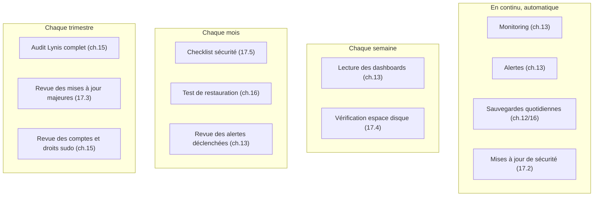

# Chapitre 17 — Maintenance générale

**Niveau : Intermédiaire**

---

## Introduction

Les chapitres 13 à 16 ont chacun construit une discipline spécialisée — observer, optimiser, durcir, sauvegarder. Ce chapitre ne réexplique aucun de ces outils : il tisse le fil qui les relie en une routine cohérente, et couvre ce qui n'appartient à aucun d'entre eux en propre — la rotation des logs, les mises à jour système, le nettoyage de l'espace disque. C'est le chapitre le plus modeste en nouveauté technique, et pourtant l'un des plus importants : c'est lui qui transforme un ensemble d'outils puissants en une pratique réellement suivie dans le temps.

## 🎯 Objectifs pédagogiques

À la fin de ce chapitre, tu sauras : faire tourner (rotation) les logs sans jamais remplir le disque ; appliquer les mises à jour de sécurité automatiquement, sans casser une application en production ; planifier et tester une montée de version majeure avant de l'appliquer ; nettoyer un serveur régulièrement pour éviter la panne "disque plein" ; suivre une checklist de sécurité périodique synthétique ; construire une routine de maintenance hebdomadaire, mensuelle et trimestrielle, articulant tous les chapitres précédents en un calendrier réaliste et tenable.

## 📋 Prérequis

Chapitres 4 à 16 — ce chapitre est une synthèse, pas une introduction. Chaque outil référencé ici renvoie à son chapitre dédié pour l'apprentissage initial.

## Pourquoi ce chapitre est important

> 💡 **Un serveur déployé n'est pas un serveur terminé.** Le déploiement est un événement ponctuel ; la maintenance est un processus continu, sur toute la durée de vie du projet. La majorité des pannes en production ne viennent pas d'un déploiement raté, mais d'une dérive lente et non surveillée : un disque qui se remplit sur plusieurs semaines, une mise à jour de sécurité jamais appliquée, un certificat dont le renouvellement a silencieusement cessé de fonctionner (chapitre 10). Sans une routine claire, même les meilleurs outils des chapitres précédents finissent par n'être configurés qu'une fois, puis oubliés.

---

## Concepts fondamentaux

1. **Rotation des logs** — empêcher un fichier de log de croître indéfiniment.
2. **Mise à jour de sécurité vs mise à jour majeure** — deux rythmes, deux niveaux de risque, deux approches.
3. **Nettoyage régulier** — anticiper la panne "disque plein" plutôt que la découvrir.
4. **Cadence** — quelle tâche à quelle fréquence, ni trop souvent (fatigue), ni trop rarement (dérive silencieuse).

---

## Explications détaillées

### 17.1 Rotation des logs

**Où se trouvent les logs :**

| Source | Emplacement / commande |
|---|---|
| Nginx | `/var/log/nginx/access.log`, `/var/log/nginx/error.log` |
| Application Node (PM2) | `pm2 logs`, fichiers dans `~/.pm2/logs/` |
| Services systemd (Django, Spring Boot, ASP.NET...) | `journalctl -u nomservice` |
| MySQL | `/var/log/mysql/error.log` |
| PostgreSQL | `/var/log/postgresql/` |
| Système général | `journalctl` |

Sans rotation, un fichier de log grossit indéfiniment tant que le service tourne — un scénario réel et fréquent de disque plein en production, causé non pas par les données de l'application mais par ses propres journaux. **`logrotate`** est préinstallé sur Ubuntu et gère automatiquement la rotation de la plupart des logs système — mais une application custom (PM2, en particulier) nécessite une configuration explicite.

```bash
pm2 install pm2-logrotate
pm2 set pm2-logrotate:max_size 10M
pm2 set pm2-logrotate:retain 14
pm2 set pm2-logrotate:compress true
```

**Pour un service systemd**, les logs passent par `journalctl`, à limiter explicitement :
```bash
sudo nano /etc/systemd/journald.conf
```
```ini
SystemMaxUse=500M
```
```bash
sudo systemctl restart systemd-journald
sudo journalctl --vacuum-time=30d
```

### 17.2 Mises à jour de sécurité automatiques

```bash
sudo apt install unattended-upgrades -y
sudo dpkg-reconfigure --priority=low unattended-upgrades
```
Applique automatiquement les correctifs de sécurité (pas les mises à jour de fonctionnalités, plus risquées) sans intervention manuelle.

```bash
cat /etc/apt/apt.conf.d/50unattended-upgrades
```

> ⚠️ **Attention** — `unattended-upgrades` peut, selon la configuration, redémarrer automatiquement certains services (voire le serveur lui-même si le noyau est mis à jour). Vérifier le réglage `Automatic-Reboot` et le programmer à une heure creuse.

### 17.3 Mises à jour majeures : planification et tests

```bash
sudo apt update
sudo apt list --upgradable
sudo apt upgrade -y
```
> ✅ **Bonne pratique** — Séparer mentalement deux rythmes : les correctifs de **sécurité** (automatiques, fréquents, faible risque) et les montées de version **majeures** d'un composant critique (MySQL 8→9, Node 22→24) qui doivent être testées sur un environnement de test avant d'être appliquées en production.

**Dépendances applicatives :**
```bash
npm outdated
npm audit
npm audit fix
```
> ⚠️ **Attention** — `npm audit fix --force` peut forcer des mises à jour majeures incompatibles avec le code existant — jamais directement en production sans test préalable (rappel du scan de vulnérabilités, chapitre 15).

**Montée de version majeure d'Ubuntu :**
```bash
sudo do-release-upgrade
```
> ⚠️ **Attention, opération à planifier, jamais à improviser.** Toujours : (1) une sauvegarde complète avant (chapitre 16), idéalement un snapshot complet du serveur proposé par l'hébergeur ; (2) un test préalable sur un serveur identique si l'application est critique ; (3) une fenêtre de maintenance annoncée si le projet a déjà des utilisateurs réels.

### 17.4 Nettoyage régulier

```bash
sudo apt autoremove -y
sudo apt autoclean
```
**Docker**, rappel du chapitre 7 :
```bash
docker system df
docker system prune
```
**Vérifier la rotation des sauvegardes** (chapitres 12 et 16), plutôt que de supposer qu'elle fonctionne :
```bash
ls -la /var/backups/nomapp/database/
```
**Vue d'ensemble avant de nettoyer précisément :**
```bash
sudo du -sh /var/log/* | sort -rh | head -10
```
Ou, plus confortablement, `ncdu` (chapitre 14).

### 17.5 Checklist de sécurité périodique (synthèse)

Ce chapitre ne réexplique pas les outils du chapitre 15 — voici seulement la synthèse à exécuter régulièrement :

- `sudo fail2ban-client status sshd` / `sudo cscli decisions list` (chapitre 15) — activité anormale récente ?
- `sudo ss -tulpn` — aucun nouveau port ouvert de façon inattendue.
- `last` — connexions SSH à une heure ou depuis une IP inhabituelle.
- `getent group sudo` — dérive de privilèges (chapitre 15, section 15.6) ?
- `sudo lynis audit system` — score de durcissement stable ou en régression ?

> 📌 **À retenir** — La sécurité "une fois configurée puis oubliée" est précisément le schéma qui mène aux incidents les plus évitables. Cette checklist n'a de valeur que répétée, pas exécutée une seule fois à l'installation.

### 17.6 Routine recommandée


**Explication du diagramme :** chaque case renvoie à un chapitre déjà maîtrisé — ce diagramme n'introduit aucun nouvel outil, il organise dans le temps ce qui a déjà été appris. C'est la seule vraie nouveauté de ce chapitre : la discipline du calendrier, pas la technique.

> ✅ **Bonne pratique** — Ce calendrier n'a de valeur que s'il est lui-même suivi de façon fiable — un rappel calendaire personnel, ou mieux, une tâche cron qui envoie un rappel (chapitre 13, section notifications) le premier de chaque mois, évite de compter uniquement sur la mémoire humaine.

---

## Analogies clés de ce chapitre

| Notion | Analogie |
|---|---|
| Maintenance générale | L'entretien régulier d'un véhicule (vidange, contrôle technique), pas juste la conduite |
| Routine hebdo/mensuelle/trimestrielle | Les tâches ménagères quotidiennes vs le grand nettoyage saisonnier |
| Logs sans rotation | Un tiroir qu'on ne vide jamais, jusqu'à ne plus pouvoir le fermer |

---

## Étude de cas

**Contexte.** Un projet, bien construit techniquement (chapitres 1 à 16 tous correctement appliqués à son lancement), périclite doucement sur 18 mois : les alertes du chapitre 13 sont configurées mais jamais relues faute de routine, `unattended-upgrades` tourne mais personne ne vérifie plus jamais `apt list --upgradable` pour les mises à jour majeures, les tests de restauration mensuels du chapitre 16 ont cessé d'être exécutés après le troisième mois, sans que personne ne s'en aperçoive.

**Ce que révèle un audit après 18 mois.** Techniquement, rien n'a été mal configuré à l'origine — chaque brique individuelle fonctionne. C'est l'absence de routine qui a laissé la dérive s'installer silencieusement : un audit Lynis jamais reproduit depuis le lancement montre un score en régression (nouveaux paquets installés sans durcissement), une sauvegarde jamais retestée depuis des mois s'avère partiellement corrompue.

**Leçon.** Ce chapitre existe précisément pour ce scénario — la meilleure infrastructure technique se dégrade sans une discipline de suivi régulière. Le calendrier de la section 17.6 n'est pas une formalité, c'est ce qui distingue un projet réellement mûr d'un projet bien construit une fois puis abandonné à lui-même.

---

## Bonnes pratiques (récapitulatif du chapitre)

- `pm2-logrotate` (ou `journald` limité) configuré dès le premier déploiement d'une application, jamais après un incident de disque plein.
- `unattended-upgrades` actif systématiquement ; les montées de version majeures toujours testées avant application.
- Le calendrier hebdomadaire/mensuel/trimestriel suivi réellement, pas seulement écrit une fois.
- Chaque outil des chapitres 13 à 16 revu périodiquement, pas seulement configuré une fois à l'installation.

---

## Erreurs fréquentes (récapitulatif du chapitre)

| Erreur | Pourquoi elle arrive | Conséquence |
|---|---|---|
| Logs PM2 jamais configurés en rotation | Oubli au moment du premier déploiement | Disque plein après plusieurs semaines/mois |
| Alertes configurées mais jamais relues | Absence de routine, pas de calendrier suivi | Dérive silencieuse, incidents découverts tardivement |
| Mise à jour majeure appliquée sans test | Pression du temps | Incompatibilité découverte en production |
| Routine de maintenance jamais formalisée | "On s'en occupera si besoin" | Dégradation lente et invisible sur plusieurs mois |

---

## Captures d'écran à réaliser

> 📸 **Capture 20**
> **Logiciel :** terminal
> **Pourquoi cette capture est utile :** documenter l'état "propre" d'un serveur bien maintenu, comme référence de comparaison future.
> **Page/écran concerné :** sortie combinée de `df -h`, `sudo apt list --upgradable`, `pm2 list` sur un serveur à jour
> **Niveau de zoom conseillé :** 100 %
> **Montrer :** un espace disque sain, peu de mises à jour en attente, des process PM2 stables
> **Entourer :** rien de spécifique
> **Flouter/masquer :** rien de sensible

---

## Laboratoire pratique n°1 — Mettre en place `unattended-upgrades`

**Objectifs :** automatiser les correctifs de sécurité système.
**Prérequis :** chapitre 4 complété.
**Matériel nécessaire :** le VPS.

**Étapes :**
1. Installe et configure `unattended-upgrades` (section 17.2).
2. Vérifie la configuration générée.
3. Règle `Automatic-Reboot` à une heure creuse cohérente avec l'usage réel de l'application.

**Résultat attendu :** une configuration active, avec un horaire de redémarrage automatique choisi consciemment.
**Vérifications :** `cat /etc/apt/apt.conf.d/50unattended-upgrades` reflète les choix faits.
**Erreurs fréquentes :** laisser `Automatic-Reboot` sur une valeur par défaut sans l'avoir vérifiée.
**Solutions :** relire explicitement ce réglage avant de considérer l'étape terminée.

## Laboratoire pratique n°2 — Construire sa propre routine de nettoyage automatisée

**Objectifs :** écrire un script de nettoyage régulier, combinant plusieurs commandes de ce chapitre.
**Prérequis :** Laboratoire 1 complété.
**Matériel nécessaire :** le VPS.

**Étapes :**
1. Écris un script combinant `apt autoremove`, `docker system prune` (si Docker utilisé), et une vérification d'espace disque avec alerte (rappel du chapitre 13) si le seuil dépasse 85 %.
2. Teste-le manuellement.
3. Programme-le en cron, hebdomadaire.

**Résultat attendu :** un script fonctionnel, exécuté automatiquement chaque semaine.
**Vérifications :** `crontab -l` confirme l'entrée ; le log du script après une semaine confirme une exécution réelle.
**Erreurs fréquentes :** un `docker system prune` sans discernement, supprimant des ressources encore utiles (rappel de l'avertissement du chapitre 7).
**Solutions :** ne jamais utiliser `-a --volumes` dans un script automatisé sans supervision humaine directe.

## Laboratoire pratique n°3 — Exécuter une checklist de sécurité mensuelle complète

**Objectifs :** appliquer concrètement la checklist de la section 17.5 sur le serveur réel.
**Prérequis :** chapitre 15 complété.
**Matériel nécessaire :** le VPS.

**Étapes :**
1. Exécute chaque commande de la checklist de sécurité (section 17.5).
2. Note les résultats dans un fichier daté (`~/audits/audit-2026-07.md`, par exemple).
3. Compare avec une exécution précédente si disponible (sinon, cette exécution devient la référence pour le mois suivant).

**Résultat attendu :** un rapport d'audit personnel daté, comparable dans le temps.
**Vérifications :** chaque point de la checklist a une réponse claire, pas seulement "exécuté sans regarder le résultat".
**Erreurs fréquentes :** exécuter les commandes sans réellement lire ni comparer leurs résultats.
**Solutions :** toujours écrire une conclusion explicite par point ("normal" / "à investiguer"), pas seulement copier la sortie brute.

---

## Exercices

1. Pourquoi une application déployée sans rotation de logs configurée finit-elle presque toujours par remplir le disque, même sans erreur de code ?
2. Explique la différence de risque entre une mise à jour de sécurité automatique et une montée de version majeure planifiée.
3. Un serveur techniquement bien construit se dégrade sur 18 mois sans qu'aucune configuration n'ait changé. Explique ce paradoxe apparent.
4. Pourquoi le calendrier de maintenance de la section 17.6 ne introduit-il aucun nouvel outil technique ?
5. Propose une méthode concrète (au-delà de la mémoire humaine) pour garantir que la checklist mensuelle est réellement exécutée chaque mois.

---

## Quiz

**Question 1.** Sans rotation de logs configurée pour une application PM2 :
a) PM2 gère automatiquement la rotation par défaut
b) Le fichier de log peut grossir indéfiniment et remplir le disque
c) L'application s'arrête automatiquement après 10 Mo de logs
d) Aucun risque, les logs PM2 sont limités par le système

**Question 2.** `unattended-upgrades` applique automatiquement :
a) Toutes les mises à jour, y compris les montées de version majeures
b) Uniquement les correctifs de sécurité
c) Uniquement les mises à jour d'applications Node.js
d) Rien sans confirmation manuelle

**Question 3.** Pourquoi tester une montée de version majeure avant de l'appliquer en production ?
a) Ce n'est jamais nécessaire si `apt` ne signale aucune erreur
b) Elle peut affecter la compatibilité de logiciels déjà installés
c) C'est purement une formalité administrative
d) Uniquement requis pour Ubuntu, pas pour les autres composants

**Question 4.** Le calendrier de maintenance de ce chapitre sert principalement à :
a) Introduire de nouveaux outils de sécurité
b) Organiser dans le temps l'usage des outils déjà appris dans les chapitres précédents
c) Remplacer le monitoring du chapitre 13
d) Automatiser entièrement la sécurité sans aucune vérification humaine

**Question 5.** Un projet bien construit techniquement peut se dégrader dans le temps principalement à cause de :
a) L'usure naturelle du code, inévitable
b) L'absence d'une routine de suivi et de vérification régulière
c) Un défaut de conception initial toujours présent
d) Le vieillissement du matériel serveur uniquement

> 🔑 **Corrigé** — 1: b · 2: b · 3: b · 4: b · 5: b

---

## 📝 Résumé du chapitre

- La rotation des logs (`pm2-logrotate`, `journalctl --vacuum`) évite la panne "disque plein" causée par les journaux eux-mêmes.
- Les mises à jour de sécurité s'automatisent sans risque majeur (`unattended-upgrades`) ; les montées de version majeures se planifient et se testent toujours au préalable.
- Un nettoyage régulier (paquets, Docker, vérification des sauvegardes) complète la routine.
- La checklist de sécurité périodique n'a de valeur que répétée dans le temps, pas exécutée une seule fois.
- Le calendrier hebdomadaire/mensuel/trimestriel n'introduit aucun nouvel outil : il organise dans le temps l'usage de tout ce qui a été appris aux chapitres 12 à 16.
- La dégradation la plus fréquente d'un projet techniquement bien construit vient de l'absence de suivi régulier, pas d'un défaut de conception initial.

## ✅ Checklist avant de passer au chapitre 18

- [ ] La rotation des logs est configurée pour toutes les applications (PM2 et/ou journald).
- [ ] `unattended-upgrades` est actif et son horaire de redémarrage automatique vérifié.
- [ ] Un script de nettoyage régulier existe et est programmé en cron.
- [ ] La checklist de sécurité mensuelle a été exécutée au moins une fois, avec des résultats notés.
- [ ] J'ai un calendrier personnel (mémoire, rappel, ou automatisé) pour suivre la routine hebdomadaire/mensuelle/trimestrielle.
- [ ] J'ai réalisé les trois laboratoires et obtenu au moins 4/5 au quiz.

---

## Glossaire du chapitre

**Rotation de logs**
Définition simple : le fait de limiter la taille d'un fichier de log en le renouvelant régulièrement.
Définition technique : un mécanisme qui archive (et compresse éventuellement) un fichier de log à intervalle régulier ou dès qu'une taille limite est atteinte, en supprimant les archives les plus anciennes au-delà d'une politique de rétention définie.
Exemple concret : `pm2-logrotate` avec `retain 14`.
Voir : Chapitre 17, section 17.1.

**Mise à jour de sécurité vs majeure**
Définition simple : un correctif ciblé sans risque de casse vs une nouvelle version qui peut changer un comportement existant.
Définition technique : une mise à jour de sécurité corrige une vulnérabilité connue sans modifier de fonctionnalité (faible risque de régression) ; une mise à jour majeure change potentiellement des comportements, API ou dépendances (risque de régression significatif, nécessitant des tests).
Exemple concret : un correctif OpenSSL (sécurité) vs Node 22 → Node 24 (majeure).
Voir : Chapitre 17, sections 17.2-17.3.

---

## ❓ FAQ

**À quelle fréquence faut-il vraiment faire cette maintenance ?**
Un rythme raisonnable pour un petit projet en production : monitoring et alertes actifs en permanence (automatiques) ; vérification de sécurité et nettoyage manuel une fois par mois ; revue des mises à jour majeures une fois par trimestre, sauf urgence de sécurité signalée entre-temps.

**Faut-il un outil de monitoring complexe dès le début ?**
Pas nécessairement — voir le chapitre 13, qui recommande déjà de commencer petit (Netdata, un moniteur externe simple) avant d'investir dans une stack complète.

**Que faire si la routine de maintenance prend trop de temps chaque mois ?**
C'est souvent le signe qu'une partie devrait être automatisée plutôt qu'exécutée manuellement — les scripts et alertes des chapitres 12 à 16 existent précisément pour réduire ce temps à une simple revue plutôt qu'une exécution manuelle répétée.

---

## Références officielles

- Ubuntu — Automatic Security Updates — [ubuntu.com/server/docs/security-automatic-updates](https://ubuntu.com/server/docs/security-automatic-updates)
- logrotate Documentation — [linux.die.net/man/8/logrotate](https://linux.die.net/man/8/logrotate)
- PM2 Log Management — [pm2.keymetrics.io/docs/usage/log-management](https://pm2.keymetrics.io/docs/usage/log-management/)
- Ubuntu — do-release-upgrade — [help.ubuntu.com/community/UpgradeNotes](https://help.ubuntu.com/community/UpgradeNotes)

---

## Conclusion

La Partie IX se termine avec une infrastructure non seulement techniquement solide, mais réellement entretenue dans la durée. Le chapitre 18, le plus dense de ce manuel, formalise ce qui a été pratiqué en filigrane depuis le premier chapitre : une méthode complète de diagnostic, avec des arbres de décision et un catalogue de 150 scénarios réels, pour ne plus jamais rester démuni face à une panne.

---

⬅️ [Chapitre 16 — Sauvegardes avancées](16-sauvegardes-avancees.md) · ➡️ **Suite : [Chapitre 18 — Méthodologie professionnelle de diagnostic](18-methodologie-diagnostic.md)**
