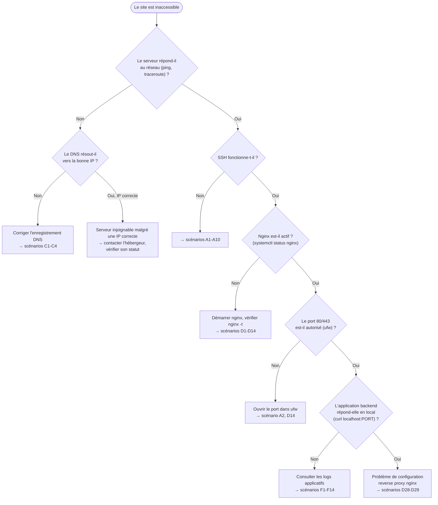
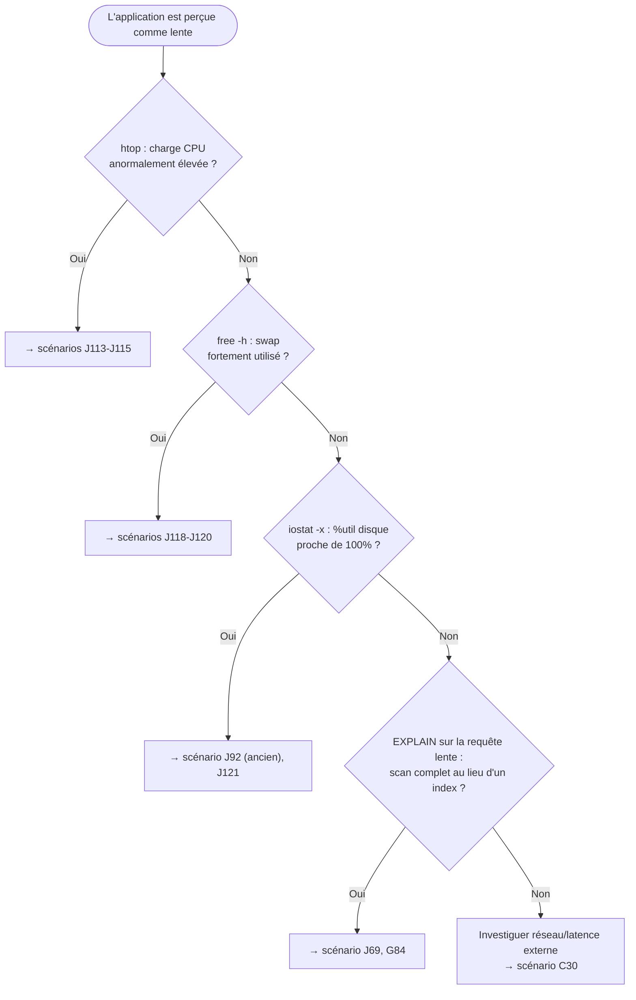
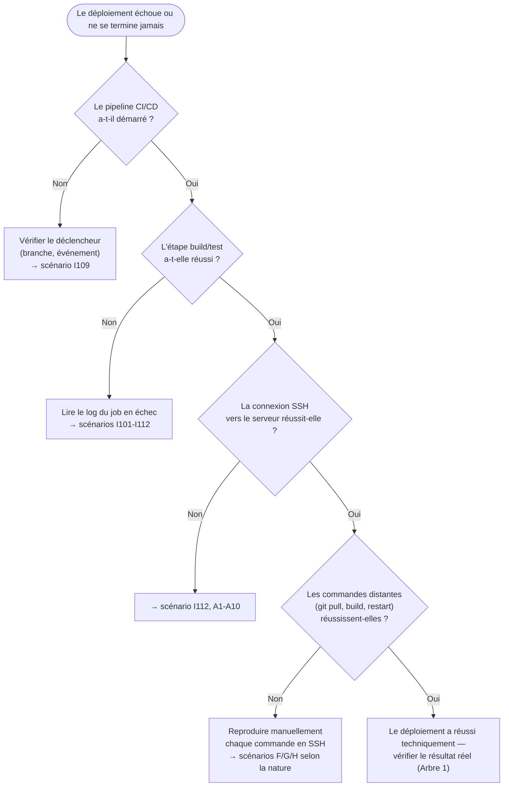
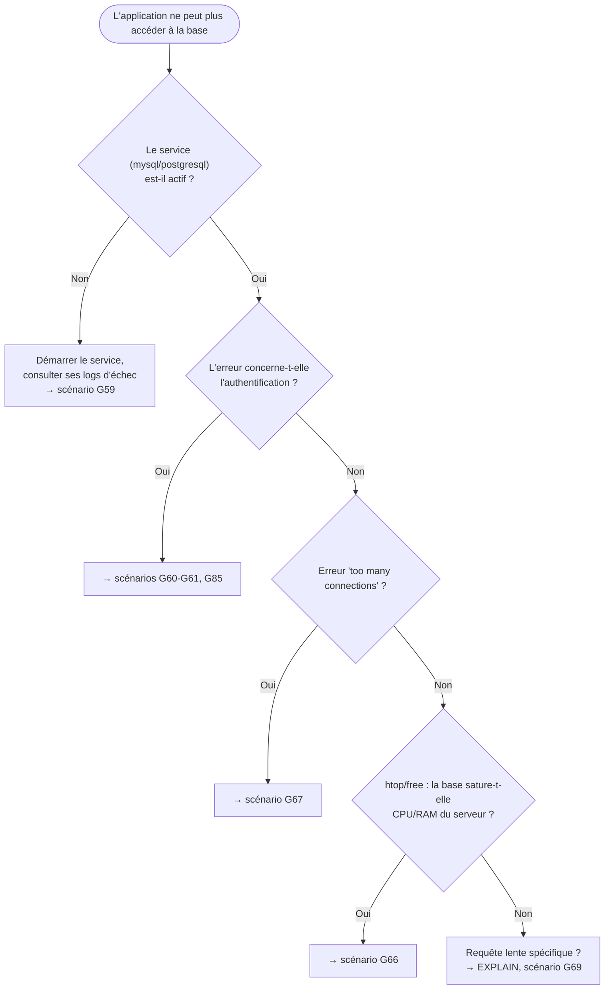

# Chapitre 18 — Méthodologie professionnelle de diagnostic

**Niveau : Avancé**

---

## Introduction

Tout ce manuel, depuis le chapitre 1, a construit une compréhension couche par couche : réseau, système, applications, sécurité, observabilité. Ce chapitre est celui où toute cette compréhension converge en une seule compétence : savoir, face à n'importe quel problème jamais rencontré auparavant, où regarder en premier, comment raisonner, et comment ne jamais rester démuni. C'est le chapitre le plus long de cet ouvrage — pas par accident, mais parce que le dépannage est, en administration système réelle, l'activité qui occupe le plus de temps une fois qu'un projet est en production.

## 🎯 Objectifs pédagogiques

À la fin de ce chapitre, tu sauras : appliquer une méthode de diagnostic générale et systématique à n'importe quel problème, y compris ceux jamais rencontrés auparavant ; utiliser des arbres de décision structurés pour les quatre familles de pannes les plus fréquentes (site inaccessible, lenteur, échec de déploiement, panne de base de données) ; reconnaître et résoudre 150 scénarios réels couvrant l'intégralité du manuel ; distinguer un symptôme d'une cause, et ne jamais confondre une solution qui masque un problème d'une solution qui le résout réellement.

## 📋 Prérequis

L'intégralité des chapitres 1 à 17. Ce chapitre ne réexplique aucune notion — il les mobilise toutes.

## Pourquoi ce chapitre est important

Un administrateur système ne se distingue pas par le nombre de solutions qu'il a mémorisées, mais par sa capacité à raisonner méthodiquement face à un problème qu'il n'a jamais vu. Ce chapitre transmet cette méthode, avec 150 scénarios concrets comme terrain d'entraînement — mais l'objectif final n'est jamais de mémoriser 150 réponses, c'est d'intérioriser la démarche qui les a toutes produites.

---

## Concepts fondamentaux

1. **Symptôme vs cause** — ce qui est visible n'est presque jamais l'endroit où corriger.
2. **Isolation** — réduire un problème à sa plus petite reproduction possible avant d'agir.
3. **Hypothèse avant action** — ne jamais taper une commande de correction sans une théorie précise de pourquoi elle devrait fonctionner.
4. **Arbre de décision** — une séquence de questions binaires qui élimine des causes jusqu'à la bonne.
5. **Faux positif de résolution** — un symptôme qui disparaît sans que la cause réelle n'ait été traitée (souvent un redémarrage qui "règle" temporairement un problème qui reviendra).

---

## La méthode générale

> ✅ **Méthode générale de dépannage, à appliquer avant tout le reste, dans cet ordre, systématiquement :**
> 1. **Lire le message d'erreur en entier**, mot par mot, avant de chercher ailleurs — la cause exacte y est souvent déjà écrite.
> 2. **Consulter les logs pertinents** (chapitre 1, section 1.9 — `tail -f`, `pm2 logs`, `journalctl -u`).
> 3. **Reproduire le problème de la façon la plus isolée possible** — une seule commande, un seul composant, jamais le système entier à la fois.
> 4. **Formuler une hypothèse précise avant de taper une commande de correction** — jamais une correction "au hasard" en espérant que ça règle le problème sans en avoir compris la cause.

> ⚠️ **Attention au faux positif de résolution le plus fréquent : redémarrer sans comprendre.** Un `pm2 restart`, un `sudo reboot`, un `docker compose restart` fait disparaître de nombreux symptômes temporairement, sans jamais traiter leur cause — le problème revient, souvent au pire moment. Un redémarrage n'est une solution légitime que lorsqu'il est **le résultat** d'un diagnostic ("la cause était une fuite mémoire lente, redémarrer périodiquement est un palliatif assumé en attendant le vrai correctif"), jamais un réflexe de premier recours.

---

## Arbres de décision

### Arbre 1 — Le site est inaccessible

### Arbre 2 — L'application est lente

### Arbre 3 — Le déploiement échoue

### Arbre 4 — La base de données est en panne

---

## Catalogue des 150 scénarios

### A. Connexion et accès SSH (1-10)

**1. `Connection refused` en tentant de se connecter en SSH**
Symptômes : `ssh: connect to host X.X.X.X port 22: Connection refused`. Cause probable : le service SSH n'est pas démarré, ou le serveur vient d'être créé et n'a pas fini de démarrer. Diagnostic : vérifier depuis la console web de l'hébergeur si le serveur répond. Solution : `sudo systemctl status ssh` puis `sudo systemctl start ssh`. Vérification : nouvelle tentative depuis un autre terminal.

**2. `Connection timed out` en SSH**
Symptômes : la connexion reste bloquée puis échoue sans message de refus explicite. Cause probable : le pare-feu (`ufw`, chapitre 4) bloque le port 22. Diagnostic : console web de l'hébergeur, puis `sudo ufw status`. Solution : `sudo ufw allow OpenSSH`. Vérification : connexion depuis l'extérieur.

**3. Accès SSH perdu après avoir modifié `sshd_config`**
Symptômes : plus aucune connexion possible après avoir désactivé `PasswordAuthentication` (chapitre 4, section 4.7). Cause probable : la clé SSH n'était pas correctement installée avant de désactiver le mot de passe. Diagnostic : une session encore ouverte dans un autre terminal, ou la console web de secours. Solution : depuis la console de secours, remettre temporairement `PasswordAuthentication yes`, redémarrer `ssh`, corriger la clé avant de redésactiver.

**4. `Permission denied (publickey)`**
Symptômes : SSH refuse la connexion malgré une clé générée. Cause probable : clé publique non copiée, ou permissions incorrectes sur `~/.ssh`. Diagnostic : `ls -la ~/.ssh`. Solution : `chmod 700 ~/.ssh && chmod 600 ~/.ssh/authorized_keys`. Vérification : SSH exige des permissions strictes, trop permissives il refuse silencieusement.

**5. `Host key verification failed`**
Symptômes : SSH signale que l'empreinte du serveur a changé. Cause probable : réinstallation du serveur, ou une nouvelle machine a repris la même IP. Diagnostic : confirmer que le changement est légitime auprès de l'hébergeur. Solution : `ssh-keygen -R ADRESSE_IP`. Vérification : nouvelle connexion, accepter la nouvelle empreinte.

**6. `jaslin is not in the sudoers file`**
Symptômes : l'utilisateur créé (chapitre 4) ne peut exécuter aucune commande `sudo`. Cause probable : oubli de `usermod -aG sudo`. Diagnostic : `groups jaslin`. Solution (en root) : `usermod -aG sudo jaslin`. Vérification : `sudo whoami` répond `root` après reconnexion.

**7. Fail2ban bloque ta propre IP**
Symptômes : connexion refusée après plusieurs tentatives légitimes ratées. Cause probable : Fail2ban (chapitre 4, section 4.9) a banni ta propre adresse. Diagnostic (console web) : `sudo fail2ban-client status sshd`. Solution : `sudo fail2ban-client set sshd unbanip TON_IP`. Vérification : nouvelle tentative réussie.

**8. `scp`/`rsync` échoue alors que `ssh` fonctionne**
Symptômes : connexion SSH normale, transfert refusé. Cause probable : permissions insuffisantes sur le dossier de destination. Diagnostic : `ls -la /chemin/destination`. Solution : `sudo chown -R jaslin:jaslin /chemin/destination`. Vérification : nouveau transfert réussi.

**9. Deploy Key CI/CD refusée lors d'un déploiement automatisé**
Symptômes : le job de déploiement (chapitre 11) échoue avec `Permission denied (publickey)`, alors qu'une connexion SSH manuelle fonctionne. Cause probable : le secret `DEPLOY_SSH_KEY` configuré dans la CI ne correspond pas à la clé réellement autorisée sur le serveur, ou contient un saut de ligne mal géré lors du copier-coller. Diagnostic : tester la même clé manuellement avec `ssh -i fichier-cle jaslin@IP` en local avant d'accuser la CI. Solution : régénérer proprement le secret, en copiant le contenu exact du fichier de clé privée sans modification. Vérification : le job de déploiement suivant réussit.

**10. 2FA SSH bloque l'administrateur légitime**
Symptômes : connexion refusée malgré une clé SSH et un mot de passe corrects, depuis l'activation de Google Authenticator (chapitre 15, section 15.4). Cause probable : l'horloge du téléphone générant les codes TOTP n'est plus synchronisée, ou l'utilisateur tape le code trop lentement (fenêtre de validité de 30 secondes dépassée). Diagnostic : vérifier l'heure du téléphone vs celle du serveur (`timedatectl`). Solution : resynchroniser l'heure du téléphone (option automatique dans la plupart des applications TOTP), retaper un nouveau code immédiatement généré. Vérification : connexion réussie avec le nouveau code.

### B. Linux et système général (11-22)

**11. `Permission denied` en exécutant un script**
Symptômes : `bash: ./deploy.sh: Permission denied`. Cause probable : le script n'a pas le droit d'exécution. Diagnostic : `ls -l deploy.sh`. Solution : `chmod +x deploy.sh`. Vérification : `./deploy.sh` s'exécute.

**12. `No space left on device`**
Symptômes : toute écriture échoue, y compris parfois SSH. Cause probable : disque plein (chapitre 17). Diagnostic : `df -h`, `du -sh /var/log/* | sort -rh | head -10` ou `ncdu` (chapitre 14). Solution : nettoyer selon la source identifiée. Vérification : `df -h` confirme l'espace libéré.

**13. Un réglage manuel disparaît après redémarrage**
Symptômes : une règle appliquée "à la main" n'est plus active après reboot. Cause probable : modification faite uniquement en mémoire, jamais dans un fichier de configuration persistant. Diagnostic : vérifier l'existence du réglage dans un fichier `/etc/...`. Solution : rendre le réglage permanent (exemple du swap, chapitre 4, via `/etc/fstab`). Vérification : `sudo reboot` puis re-contrôle.

**14. `command not found` pour une commande fraîchement installée**
Symptômes : `npm: command not found` juste après l'installation via nvm. Cause probable : le shell courant n'a pas rechargé `~/.bashrc`. Diagnostic : `echo $PATH`. Solution : `source ~/.bashrc`. Vérification : `npm -v` répond.

**15. `Text file busy` en remplaçant un exécutable**
Symptômes : erreur en copiant un nouveau binaire sur un ancien en cours d'exécution. Cause probable : fichier activement utilisé. Diagnostic : `sudo lsof | grep nom-du-fichier`. Solution : arrêter le process avant remplacement, ou `mv` depuis un chemin temporaire. Vérification : redémarrage réussi avec le nouveau binaire.

**16. Une variable d'environnement n'est pas prise en compte**
Symptômes : l'application utilise toujours une ancienne valeur malgré la modification du `.env`. Cause probable (Node/PM2) : PM2 a mis en cache les variables au premier démarrage. Diagnostic : `pm2 env <id>`. Solution : `pm2 restart mon-api --update-env`. Vérification : `pm2 env <id>` confirme la nouvelle valeur.

**17. `Too many open files`**
Symptômes : une application plante sous charge avec cette erreur exacte. Cause probable : limite système de fichiers/connexions ouvertes atteinte. Diagnostic : `ulimit -n`. Solution : augmenter la limite dans `/etc/security/limits.conf`. Vérification : nouvelle session, `ulimit -n` confirme.

**18. `nano`/`vim` refuse de sauvegarder un fichier système**
Symptômes : `Error writing ... Permission denied`. Cause probable : fichier appartenant à root, éditeur non lancé avec `sudo`. Diagnostic : `ls -l fichier`. Solution : rouvrir avec `sudo nano fichier`. Vérification : sauvegarde réussie.

**19. L'heure du serveur est fausse**
Symptômes : tokens expirés trop tôt/tard, logs incohérents. Cause probable : synchronisation NTP inactive (chapitre 4, section 4.10). Diagnostic : `timedatectl`. Solution : `sudo systemctl enable --now systemd-timesyncd`. Vérification : "System clock synchronized: yes".

**20. Caractères accentués mal affichés (mojibake)**
Symptômes : "café" s'affiche "café". Cause probable : locale ou encodage de base non réglés en UTF-8 (chapitre 4, section 4.10). Diagnostic : `locale`. Solution : régler la locale UTF-8, vérifier l'encodage de la base. Vérification : texte accentué correct de bout en bout.

**21. `ulimit` trop bas cause un crash sous charge, découvert seulement en production**
Symptômes : l'application tourne parfaitement en test, mais s'effondre avec `EMFILE` (trop de fichiers ouverts) uniquement en pic de trafic réel. Cause probable : la limite par défaut (souvent 1024) n'a jamais été augmentée avant la mise en production, un environnement de test n'atteignant jamais cette charge. Diagnostic : `ulimit -n` pour l'utilisateur applicatif, comparé au nombre de connexions simultanées réellement observées (chapitre 13, monitoring). Solution : augmenter la limite (scénario 17) de façon anticipée, avant qu'un pic réel ne la révèle. Vérification : un test de charge simulé (chapitre 14) confirme l'absence de la même erreur après correction.

**22. Horloge désynchronisée après restauration d'un snapshot hébergeur**
Symptômes : après restauration d'un snapshot de sauvegarde complet proposé par l'hébergeur (chapitre 17), les certificats SSL sont soudainement refusés et les tokens JWT semblent invalides. Cause probable : un snapshot restauré démarre parfois avec l'horloge figée au moment de la sauvegarde, désynchronisée de plusieurs heures ou jours par rapport à l'heure réelle. Diagnostic : `timedatectl` immédiatement après toute restauration de snapshot. Solution : forcer une resynchronisation NTP immédiate (`sudo systemctl restart systemd-timesyncd`). Vérification : `timedatectl` confirme la synchronisation, les certificats redeviennent valides.

### C. Réseau et DNS (23-32)

**23. Le domaine ne pointe pas vers le serveur**
Symptômes : le domaine reste injoignable malgré une configuration serveur correcte. Cause probable : enregistrement DNS de type A absent ou mal renseigné, ou propagation pas encore terminée. Diagnostic : `dig tondomaine.ht` ou dnschecker.org (chapitre 1). Solution : corriger l'enregistrement A, patienter la propagation. Vérification : l'IP retournée correspond au serveur.

**24. `curl: (7) Failed to connect`**
Symptômes : aucune réponse du serveur, y compris en HTTP simple. Cause probable : nginx arrêté, ou pare-feu bloquant le port 80. Diagnostic : `sudo systemctl status nginx`, `sudo ufw status`. Solution : démarrer nginx et/ou autoriser le port. Vérification : `curl -I http://IP`.

**25. Le site répond en local mais pas depuis l'extérieur**
Symptômes : le backend répond en interne, injoignable depuis un navigateur externe. Cause probable : port applicatif exposé directement au lieu de passer par nginx, pare-feu bloquant. Diagnostic : `sudo ufw status`, `curl -I http://localhost:4000`. Solution : configurer un reverse proxy nginx (chapitre 9), ne jamais ouvrir un port backend au pare-feu. Vérification : accès via le domaine fonctionne, le port applicatif reste fermé en externe.

**26. Erreur CORS dans la console du navigateur**
Symptômes : `Access to fetch at '...' has been blocked by CORS policy`. Cause probable : le backend n'autorise pas explicitement le domaine du frontend. Diagnostic : vérifier la variable `CORS_ORIGINS`. Solution : ajouter le domaine exact, redémarrer le backend. Vérification : la requête réussit dans les DevTools.

**27. Deux applications entrent en conflit sur le même port**
Symptômes : `Error: listen EADDRINUSE: address already in use :::4000`. Cause probable : un ancien process jamais arrêté proprement. Diagnostic : `sudo lsof -i :4000`. Solution : `kill -9 PID`, relancer proprement via PM2. Vérification : `sudo ss -tulpn | grep 4000` ne montre qu'un process.

**28. IPv6 cause un comportement incohérent**
Symptômes : l'application fonctionne pour certains visiteurs mais pas d'autres, apparemment au hasard. Cause probable : un enregistrement AAAA pointe vers une adresse invalide ou absente. Diagnostic : `dig AAAA tondomaine.ht`. Solution : retirer l'enregistrement AAAA si aucune IPv6 réelle n'est configurée, ou la corriger. Vérification : test depuis un réseau IPv6.

**29. `Too many redirects`**
Symptômes : boucle de redirection infinie. Cause probable : conflit entre redirection HTTPS applicative et redirection nginx, ou proxy tiers mal configuré. Diagnostic : `curl -IL http://tondomaine.ht`. Solution : ne garder qu'une seule couche de redirection. Vérification : une seule redirection puis un `200`.

**30. Latence élevée depuis une région géographique précise**
Symptômes : le site est rapide pour certains, lent pour d'autres selon leur localisation. Cause probable : datacenter éloigné des utilisateurs concernés (chapitre 4, section 4.1). Diagnostic : `traceroute` depuis une localisation représentative. Solution : envisager un CDN, ou un serveur plus proche géographiquement. Vérification : mesure de latence après changement.

**31. IPv6 seul configuré, mais l'application n'écoute qu'en IPv4**
Symptômes : certains visiteurs (réseaux IPv6 uniquement, de plus en plus fréquents) ne peuvent jamais atteindre le site, sans erreur claire côté serveur. Cause probable : nginx ou l'application backend n'écoute que sur `0.0.0.0` (toutes interfaces IPv4) sans directive `listen [::]:80` équivalente pour IPv6. Diagnostic : `sudo ss -tulpn` pour confirmer l'absence d'écoute IPv6. Solution : ajouter `listen [::]:80;` et `listen [::]:443 ssl;` aux blocs `server` concernés (chapitre 9). Vérification : test depuis un réseau IPv6 réel ou un outil en ligne dédié.

**32. Certificat wildcard : l'enregistrement DNS TXT n'a jamais propagé**
Symptômes : `certbot certonly --manual --preferred-challenges dns` (chapitre 10, section 10.5) reste bloqué indéfiniment en attente de confirmation. Cause probable : l'enregistrement `TXT` demandé par Certbot n'a pas été créé correctement chez le registrar, ou la propagation n'est pas encore terminée au moment de la validation. Diagnostic : `dig TXT _acme-challenge.tondomaine.ht` depuis une machine externe. Solution : vérifier l'exactitude de l'enregistrement créé, patienter la propagation avant de confirmer à Certbot. Vérification : `dig` retourne bien la valeur attendue avant de continuer le processus.

### D. Nginx (33-46)

**33. Page blanche après déploiement d'une SPA**
Symptômes : la page d'accueil se charge, recharger une route interne donne une 404. Cause probable : absence de `try_files ... /index.html` (chapitres 6 et 9). Diagnostic : vérifier le bloc `location /`. Solution : ajouter la directive. Vérification : rechargement d'une route interne fonctionne.

**34. `502 Bad Gateway`**
Symptômes : nginx répond avec une erreur, aucun contenu applicatif. Cause probable : le backend vers lequel nginx fait `proxy_pass` est arrêté ou plante. Diagnostic : `pm2 status`, `pm2 logs mon-api --lines 50`. Solution : corriger la cause du plantage, redémarrer. Vérification : `curl` local puis externe.

**35. `504 Gateway Timeout`**
Symptômes : requête très longue puis échec avec ce code précis. Cause probable : backend trop lent, timeout nginx trop court. Diagnostic : identifier l'opération lente dans les logs applicatifs. Solution : optimiser (chapitre 14, souvent un index manquant) et/ou augmenter `proxy_read_timeout` (chapitre 9). Vérification : requête aboutissant dans un délai raisonnable.

**36. nginx refuse de démarrer après une modification**
Symptômes : `systemctl status nginx` affiche "failed". Cause probable : erreur de syntaxe. Diagnostic : `sudo nginx -t`. Solution : corriger l'erreur précisément indiquée. Vérification : `nginx -t` puis `systemctl start nginx`.

**37. Modifier la configuration n'a aucun effet visible**
Symptômes : le comportement ne change pas malgré une modification. Cause probable : oubli de `reload`, ou mauvais fichier modifié. Diagnostic : `sudo nginx -T | grep -A 5 "server_name ..."`. Solution : `sudo systemctl reload nginx`. Vérification : comportement attendu observé.

**38. Fichiers statiques renvoient une 403 Forbidden**
Symptômes : nginx refuse l'accès à un fichier existant. Cause probable : permissions insuffisantes pour `www-data`. Diagnostic : `ls -la`, `sudo -u www-data cat fichier`. Solution : `sudo chmod -R 755 /chemin`. Vérification : `curl -I` renvoie `200`.

**39. Un site fonctionne en HTTP mais affiche une erreur en HTTPS**
Symptômes : erreur SSL ou 400 "plain HTTP request sent to HTTPS port". Cause probable : confusion entre `listen 80` et `listen 443 ssl`. Diagnostic : relire le bloc `server`. Solution : séparer clairement les blocs, refaire `certbot --nginx` si nécessaire. Vérification : `curl -I https://` répond correctement.

**40. Upload de fichier volumineux échoue**
Symptômes : `413 Request Entity Too Large`. Cause probable : limite par défaut nginx (1 Mo) dépassée. Diagnostic : comparer la taille du fichier à la limite. Solution : `client_max_body_size 20M;`. Vérification : upload réussi après `reload`.

**41. En-têtes personnalisés absents malgré leur présence dans la config**
Symptômes : `curl -I` ne montre pas un en-tête pourtant ajouté. Cause probable : `add_header` dans un bloc parent écrasé par un bloc enfant plus spécifique. Diagnostic : identifier les niveaux d'`add_header`. Solution : répéter tous les en-têtes nécessaires dans le bloc le plus spécifique. Vérification : `curl -I` confirme leur présence.

**42. Requêtes API lentes uniquement via nginx**
Symptômes : rapide en direct sur le backend, lent via nginx. Cause probable : `proxy_buffering` ou résolution DNS répétée si `proxy_pass` utilise un nom. Diagnostic : comparer les temps avec `curl -w`. Solution : utiliser `proxy_pass http://127.0.0.1:4000;`. Vérification : temps comparables.

**43. Deux domaines affichent le même contenu par erreur**
Symptômes : deux sites montrent le même contenu. Cause probable : absence de `default_server`, ou `server_name` mal renseigné. Diagnostic : `sudo nginx -T | grep server_name`. Solution : vérifier chaque `server_name`, ajouter un catch-all. Vérification : chaque domaine affiche son propre contenu.

**44. `Address already in use` au démarrage de nginx**
Symptômes : nginx refuse de démarrer avec ce message précis. Cause probable : Apache ou une autre instance nginx écoute déjà sur le port 80. Diagnostic : `sudo ss -tulpn | grep :80`. Solution : arrêter/désinstaller le service en conflit. Vérification : `systemctl start nginx` réussit.

**45. `nginx -T` ne montre pas la configuration attendue**
Symptômes : une directive semble absente de `nginx -T` alors qu'elle a bien été écrite dans un fichier. Cause probable : le fichier de configuration n'est pas inclus (absent de `sites-enabled`, ou l'instruction `include` correspondante manque dans `nginx.conf`). Diagnostic : `ls -la /etc/nginx/sites-enabled/`, vérifier la présence du lien symbolique. Solution : créer le lien manquant (`ln -s`), `nginx -t` puis `reload`. Vérification : `nginx -T` montre désormais la directive.

**46. `limit_req` bloque un usage légitime**
Symptômes : des utilisateurs réels reçoivent des erreurs `503` sur une route protégée par rate limiting (chapitre 9, section 9.8), sans avoir réellement abusé du service. Cause probable : un seuil (`rate=5r/m`) trop strict pour un usage légitime concentré (plusieurs utilisateurs d'un même réseau d'entreprise partageant la même IP publique, par exemple). Diagnostic : croiser les logs nginx avec les plaintes d'utilisateurs légitimes au même moment. Solution : ajuster le seuil à la hausse, ou utiliser une clé de limitation plus fine que la seule IP si le contexte le permet. Vérification : les utilisateurs légitimes ne rencontrent plus l'erreur, la protection reste active contre un abus réel.

### E. SSL / HTTPS (47-56)

**47. Certbot échoue avec `Timeout during connect`**
Voir chapitre 10, section 10.8. Cause probable : DNS pas propagé ou port 80 fermé. Diagnostic : `dig`, `sudo ufw status`. Solution : corriger avant de relancer Certbot.

**48. `Too many certificates already issued`**
Cause probable : trop de tentatives Certbot répétées. Solution : `--staging` pour continuer à tester, attendre la réinitialisation du quota.

**49. Le cadenas affiche un avertissement malgré un certificat valide**
Cause probable : contenu mixte (ressource en `http://` sur une page HTTPS). Diagnostic : onglet Console des DevTools. Solution : corriger les URLs en `https://` ou relatives.

**50. Certificat expiré malgré un renouvellement "configuré"**
Cause probable : le timer de renouvellement a échoué silencieusement. Diagnostic : `sudo cat /var/log/letsencrypt/letsencrypt.log`, `sudo certbot renew --dry-run`. Solution : corriger la cause identifiée, relancer manuellement.

**51. `SSL_ERROR_RX_RECORD_TOO_LONG`**
Symptômes : erreur en tentant `https://`. Cause probable : une requête HTTPS atteint un port qui ne parle que du HTTP. Diagnostic : vérifier quel service écoute réellement sur 443. Solution : corriger la configuration nginx pour que 443 soit bien associé à un bloc `ssl`.

**52. API mobile refuse le certificat**
Symptômes : le web fonctionne, une app mobile rejette la connexion. Cause probable : chaîne de certificats incomplète (`cert.pem` au lieu de `fullchain.pem`). Diagnostic : `openssl s_client -showcerts`. Solution : vérifier que nginx référence `fullchain.pem`.

**53. Note SSL Labs basse malgré HTTPS fonctionnel**
Cause probable : absence de HSTS, versions TLS obsolètes autorisées. Diagnostic : lire le rapport détaillé (chapitre 10, section 10.7). Solution : appliquer les recommandations une par une.

**54. `certbot renew --dry-run` échoue avec une erreur de permission**
Cause probable : changement de propriétaire sur `/etc/letsencrypt` fait par erreur. Diagnostic : `ls -la /etc/letsencrypt/live/`. Solution : restaurer la propriété root, ne jamais modifier ces permissions manuellement.

**55. HSTS empêche l'accès après une désactivation accidentelle de HTTPS**
Symptômes : après une erreur de configuration ayant temporairement cassé HTTPS, le navigateur refuse même de tenter une connexion HTTP de secours, affichant une erreur immédiate sans possibilité de continuer. Cause probable : HSTS (chapitre 10, section 10.7), activé avec un `max-age` long, a mémorisé l'engagement HTTPS-only et le fait respecter strictement, y compris pendant l'incident. Diagnostic : confirmer l'en-tête HSTS précédemment envoyé (mémoire du navigateur, difficile à vérifier a posteriori — la cause se déduit surtout du comportement). Solution : rétablir HTTPS le plus vite possible (c'est la seule vraie solution, HSTS ne se contourne pas côté serveur une fois mémorisé par le navigateur d'un visiteur) ; pour la prochaine fois, activer HSTS avec un `max-age` court le temps de valider la stabilité avant de l'allonger (rappel de l'avertissement du chapitre 10). Vérification : accès restauré une fois HTTPS de nouveau fonctionnel.

**56. Certificat wildcard expiré séparément du certificat principal**
Symptômes : `tondomaine.ht` reste accessible en HTTPS, mais tous les sous-domaines (`*.tondomaine.ht`) affichent une erreur de certificat expiré. Cause probable : le certificat wildcard (chapitre 10, section 10.5), obtenu séparément via vérification DNS manuelle, n'est pas inclus dans le renouvellement automatique standard (qui suppose une vérification HTTP). Diagnostic : `sudo certbot certificates` liste les certificats et leur méthode de vérification respective. Solution : mettre en place un renouvellement spécifique pour le certificat wildcard (script dédié avec l'API du fournisseur DNS, hors du périmètre standard de Certbot `--nginx`). Vérification : `openssl s_client` confirme une date d'expiration à jour sur un sous-domaine.

### F. Node.js, PM2 et applications (57-70)

**57. PM2 redémarre un process en boucle (crash loop)**
Symptômes : `pm2 list` montre un compteur de redémarrages qui augmente sans cesse. Cause probable : erreur au démarrage (variable manquante, port utilisé, erreur de syntaxe). Diagnostic : `pm2 logs mon-api --lines 100`. Solution : corriger la cause exacte affichée. Vérification : "online" stable.

**58. `pm2 restart` ne prend pas en compte le nouveau code**
Cause probable : le build n'a pas été refait avant le restart. Diagnostic : date de modification de `dist/server.js` vs dernier commit. Solution : `npm run build` puis `pm2 restart`.

**59. Application inaccessible après un reboot serveur**
Cause probable : `pm2 save`/`pm2 startup` (chapitre 5, section 5.15) jamais exécutés. Diagnostic : `pm2 list` vide après reconnexion. Solution : `pm2 startup` (exécuter la commande générée) puis `pm2 save`.

**60. `EACCES: permission denied` en installant des dépendances npm**
Cause probable : `npm install` exécuté avec `sudo` par erreur. Diagnostic : `ls -la node_modules | head`. Solution : `sudo chown -R $USER:$USER ~/app/node_modules`, ne plus jamais utiliser `sudo npm install`.

**61. Variables `VITE_`/`NEXT_PUBLIC_` non prises en compte après modification**
Cause probable : rappel chapitre 6 — ces variables sont figées au build. Solution : refaire `npm run build` puis redéployer.

**62. `JavaScript heap out of memory`**
Symptômes : plantage avec ce message précis, souvent au build. Cause probable : limite mémoire par défaut de Node dépassée. Diagnostic : `free -h` au moment du plantage. Solution temporaire : `NODE_OPTIONS="--max-old-space-size=2048"`. Solution durable : augmenter la RAM ou optimiser le traitement.

**63. CORS fonctionne en développement mais pas en production**
Cause probable : `CORS_ORIGINS` codée avec `localhost`, jamais mise à jour en production. Diagnostic : `pm2 env` pour la variable réellement chargée. Solution : corriger le `.env` de production, `pm2 restart --update-env`.

**64. Route API fonctionne avec Postman mais pas depuis le vrai frontend**
Cause probable : cookie httpOnly non envoyé (`credentials`/`SameSite`/`Secure` mal réglés). Diagnostic : onglet réseau des DevTools. Solution : aligner ces réglages selon le contexte same-site ou cross-site.

**65. L'application plante uniquement sous charge réelle**
Cause probable : fuite de mémoire progressive, ou pool de connexions base de données dépassé. Diagnostic : `pm2 monit`/`htop` sur la durée, pendant un test de charge (chapitre 14). Solution : ajuster le pool, chercher la fuite.

**66. `MODULE_NOT_FOUND` uniquement en production**
Cause probable : dépendance installée localement sans mise à jour du lockfile, ou dépendance de dev utilisée par erreur en code de production. Diagnostic : vérifier `dependencies` vs `devDependencies`. Solution : déplacer la dépendance, committer le lockfile à jour.

**67. Logs applicatifs introuvables**
Cause probable : l'application tourne en `&` sans supervision PM2. Diagnostic : `pm2 list` ne montre pas le process. Solution : toujours lancer via `pm2 start`.

**68. Deux instances de la même application tournent en double**
Cause probable : `pm2 start` relancé sans `pm2 delete` préalable. Diagnostic : `pm2 list`. Solution : `pm2 delete mon-api-old`.

**69. PM2 en mode cluster produit un comportement incohérent entre requêtes**
Symptômes : un utilisateur est parfois déconnecté de façon aléatoire, ou voit des données incohérentes entre deux requêtes consécutives, depuis l'activation du mode cluster (chapitre 14, section 14.10). Cause probable : l'application stocke un état (session, cache local) uniquement en mémoire du process — chaque requête pouvant être traitée par une instance différente sans mémoire partagée entre elles. Diagnostic : identifier tout `Map`/variable globale utilisée pour stocker un état utilisateur en mémoire. Solution : externaliser cet état vers Redis ou la base de données (chapitre 14, rappel de l'avertissement sur le mode cluster) avant de pouvoir l'utiliser sereinement. Vérification : comportement cohérent quel que soit le worker qui traite la requête.

**70. Variable d'environnement runtime confondue avec build-time (Next.js)**
Symptômes : une variable sans préfixe `NEXT_PUBLIC_` reste `undefined` côté navigateur, malgré sa présence correcte dans `.env`. Cause probable : confusion entre les deux portées distinctes de Next.js (chapitre 6, section 6.5) — les variables serveur ne sont jamais envoyées au client, par design, quelle que soit leur présence dans le fichier `.env`. Diagnostic : vérifier si la variable est utilisée dans un composant client (`'use client'`) ou serveur. Solution : soit préfixer `NEXT_PUBLIC_` si la valeur n'est pas sensible et doit réellement atteindre le navigateur, soit restructurer pour ne l'utiliser que côté serveur si elle est sensible. Vérification : la valeur attendue apparaît (ou reste absente à raison) selon le contexte.

### G. Bases de données (71-86)

**71. `ECONNREFUSED` en tentant de se connecter à MySQL/PostgreSQL**
Cause probable : service arrêté, ou `bind-address`/`pg_hba.conf` (chapitre 12) empêchant la connexion. Diagnostic : `sudo systemctl status mysql`. Solution : démarrer le service ou corriger la configuration.

**72. `Access denied for user` (MySQL)**
Cause probable : mot de passe incorrect, ou droits insuffisants. Diagnostic : `mysql -u nomapp_user -p nomapp` en direct. Solution : corriger le mot de passe ou re-`GRANT`.

**73. `password authentication failed` (PostgreSQL)**
Cause probable : méthode `peer` au lieu de `scram-sha-256`/`md5` (chapitre 12, section 12.1). Diagnostic : relire `pg_hba.conf`. Solution : corriger la ligne, redémarrer PostgreSQL.

**74. Migrations Prisma "non appliquées" alors que les tables existent**
Cause probable : dérive d'historique (base construite via `db push`). Diagnostic : `npx prisma migrate status`, `migrate diff`. Solution : baseliner (`migrate resolve --applied`) si le `diff` ne montre aucun écart réel. Vérification : `migrate status` confirme "up to date".

**75. `Deadlock found when trying to get lock` (MySQL)**
Symptômes : transaction échouant aléatoirement sous charge concurrente. Cause probable : deux transactions verrouillent des lignes dans un ordre différent. Diagnostic : `SHOW ENGINE INNODB STATUS;`. Solution : verrouiller systématiquement dans le même ordre, ou réessayer automatiquement.

**76. Une sauvegarde `mysqldump` échoue en plein milieu**
Cause probable : timeout, ou verrouillage prolongé sans `--single-transaction` (chapitre 12). Diagnostic : message d'erreur exact. Solution : ajouter `--single-transaction --quick`, vérifier `max_allowed_packet`.

**77. Restauration `pg_restore` échoue avec des erreurs de dépendances**
Cause probable : ordre incorrect, ou base cible non vide. Diagnostic : lire le message d'erreur précisément. Solution : `--clean` (chapitre 12, section 12.5) ou restaurer sur une base vide.

**78. La base de données consomme toute la RAM du serveur**
Cause probable : configuration par défaut non adaptée à la RAM réelle. Diagnostic : `htop` sur `mysqld`/`postgres`. Solution : ajuster `innodb_buffer_pool_size` (MySQL) selon la RAM totale.

**79. `too many connections`**
Cause probable : fuite de connexions applicative, ou `max_connections` trop bas. Diagnostic : `SHOW STATUS LIKE 'Threads_connected';` / `SELECT count(*) FROM pg_stat_activity;`. Solution : corriger la fuite, ajuster `max_connections` si justifié.

**80. Une colonne accentuée s'affiche corrompue uniquement dans certaines requêtes**
Cause probable : client de connexion utilisant un jeu de caractères différent. Diagnostic : `SHOW VARIABLES LIKE 'character_set%';`. Solution : forcer `utf8mb4` côté connexion applicative.

**81. Requête lente identifiée mais aucun index visible n'explique pourquoi**
Cause probable : index existant mais non utilisé (statistiques obsolètes, fonction appliquée sur la colonne). Diagnostic : `EXPLAIN ANALYZE`. Solution : réécrire la requête, `ANALYZE nom_table;`.

**82. Redis perd toutes ses données après un redémarrage**
Cause probable : persistance RDB/AOF non activée (chapitre 12, section 12.7), ou usage volontairement volatile. Diagnostic : `redis-cli CONFIG GET save`. Solution : activer RDB/AOF si réellement nécessaire.

**83. `ER_NOT_SUPPORTED_AUTH_MODE` en connectant une application à MySQL**
Cause probable : MySQL 8+ utilise `caching_sha2_password`, non supporté par un ancien pilote. Diagnostic : version du pilote applicatif. Solution : `ALTER USER ... IDENTIFIED WITH mysql_native_password`, palliatif en attendant la mise à jour du pilote.

**84. Un script d'import CSV échoue silencieusement**
Cause probable : encodage incompatible (Windows-1252 au lieu d'UTF-8), séparateur incorrect. Diagnostic : `file monfichier.csv`, `head -5`. Solution : `iconv -f WINDOWS-1252 -t UTF-8`, vérifier le séparateur.

**85. `trust` retrouvé dans `pg_hba.conf` après restauration depuis un ancien backup**
Symptômes : un audit Lynis (chapitre 15) ou une vérification manuelle révèle soudain une ligne `trust`, alors qu'elle avait été corrigée des mois auparavant. Cause probable : une restauration complète de configuration serveur (après un incident, ou une migration vers un nouveau serveur) a réintroduit un ancien fichier `pg_hba.conf` non mis à jour, écrasant la correction précédente. Diagnostic : comparer la date de modification du fichier actuel avec la date de la dernière correction connue. Solution : réappliquer la correction (chapitre 12, section 12.1), documenter ce point de vigilance dans toute procédure future de restauration/migration. Vérification : absence confirmée de `trust`, testée après chaque restauration future.

**86. ACL Redis mal configurée bloque l'application elle-même**
Symptômes : après avoir suivi la sécurisation ACL de Redis (chapitre 12, section 12.1), l'application ne peut plus se connecter du tout, y compris pour des opérations légitimes. Cause probable : les permissions accordées (`+@read +@write -@admin`) sont trop restrictives pour une commande spécifique réellement utilisée par l'application (comme `SUBSCRIBE` pour un usage pub/sub, appartenant à une catégorie de commande non incluse). Diagnostic : identifier la commande exacte refusée dans les logs applicatifs (`NOPERM` dans la réponse Redis). Solution : ajouter explicitement la catégorie de commande manquante à l'ACL (`+@pubsub`, par exemple). Vérification : l'opération précédemment refusée réussit désormais.

### H. Docker et Docker Compose (87-100)

**87. `docker: permission denied` malgré `usermod -aG docker`**
Cause probable : nouvelle appartenance de groupe nécessitant une reconnexion complète. Solution : `exit` puis nouvelle connexion SSH.

**88. Un container redémarre en boucle**
Cause probable : l'application à l'intérieur plante au démarrage. Diagnostic : `docker logs nom-container`. Solution : corriger la cause précise dans les logs.

**89. Un container ne peut pas joindre un autre par son nom**
Cause probable : containers non sur le même réseau Docker (chapitre 7, section 7.7). Diagnostic : `docker network inspect`. Solution : s'assurer qu'ils sont dans le même Compose ou reliés via `docker network connect`.

**90. Les données d'une base Docker disparaissent après `docker compose down`**
Cause probable : absence de volume nommé (chapitre 7, section 7.6). Diagnostic : relire `docker-compose.yml`, absence de `volumes:`. Solution : ajouter un volume nommé ; pour cette fois, seule une sauvegarde antérieure permet une récupération.

**91. `docker build` très lent à chaque modification**
Cause probable : absence de séparation `COPY package*.json`/`COPY . .` (chapitre 7, section 7.4). Solution : réorganiser le `Dockerfile`.

**92. Image Docker anormalement volumineuse**
Cause probable : absence de multi-stage build, `.dockerignore` manquant. Diagnostic : `docker images`, `docker history`. Solution : multi-stage build, `.dockerignore` complet.

**93. `docker compose up` échoue avec un conflit de port**
Cause probable : port hôte déjà utilisé. Diagnostic : `sudo ss -tulpn | grep PORT`. Solution : changer le port hôte dans `docker-compose.yml` ou arrêter le service en conflit.

**94. Un `docker system prune` a supprimé quelque chose d'important**
Cause probable : volume/image "non utilisé" en réalité nécessaire pour un service arrêté temporairement. Solution : restaurer depuis une sauvegarde (chapitre 16) ; à l'avenir, toujours vérifier `docker volume ls` avant `--volumes`.

**95. Les logs d'un container grossissent indéfiniment**
Cause probable : absence de limite de taille configurée. Solution : `logging: driver: json-file, options: max-size/max-file` dans Compose.

**96. Un changement de code n'apparaît pas après `docker compose up -d`**
Cause probable : Docker réutilise une image déjà construite en cache. Solution : `docker compose up -d --build`.

**97. Un healthcheck reste "unhealthy" indéfiniment**
Symptômes : `docker compose ps` montre un service "unhealthy" en permanence, et `depends_on: condition: service_healthy` (chapitre 8, section 8.5) empêche tout service dépendant de démarrer. Cause probable : la commande de `healthcheck` elle-même est incorrecte (outil absent dans l'image, syntaxe invalide), pas un vrai problème du service surveillé. Diagnostic : `docker compose exec service la-commande-du-healthcheck` pour la tester manuellement. Solution : corriger la commande du healthcheck (souvent un outil comme `curl` absent d'une image minimale `alpine`, nécessitant `wget` ou une alternative déjà présente). Vérification : `docker compose ps` montre "healthy" après correction.

**98. `docker-compose.override.yml` appliqué par erreur en production**
Symptômes : le code source local semble "monté en direct" sur le serveur de production, un changement de fichier local se répercutant anormalement. Cause probable : le fichier `docker-compose.override.yml` (chapitre 8, section 8.8), destiné uniquement au développement, a été copié par erreur sur le serveur de production, où Compose le charge automatiquement en plus du fichier de base. Diagnostic : `ls -la` sur le dossier de déploiement en production, présence inattendue du fichier override. Solution : supprimer le fichier override du serveur de production, `docker compose up -d --build` pour repartir sur la configuration de base uniquement. Vérification : `docker compose config` (qui affiche la configuration fusionnée finale) confirme l'absence des ajustements de développement.

**99. Volume Docker orphelin après renommage d'un service dans `docker-compose.yml`**
Symptômes : après avoir renommé un service dans `docker-compose.yml` (`db` devenu `database`, par exemple), les données semblent avoir disparu. Cause probable : Docker Compose génère les noms de volumes à partir du nom du service — un renommage crée un nouveau volume vide plutôt que de réutiliser l'ancien. Diagnostic : `docker volume ls` révèle l'ancien volume, toujours présent mais non référencé par la configuration actuelle. Solution : soit renommer explicitement le volume dans la configuration pour pointer vers l'ancien nom, soit migrer les données de l'ancien volume vers le nouveau (`docker run` temporaire montant les deux volumes, `cp` entre eux). Vérification : les données réapparaissent dans le service renommé.

**100. Image Docker non reconstruite après modification du `Dockerfile`, cache trompeur**
Symptômes : une modification du `Dockerfile` lui-même (pas seulement du code source) ne semble avoir aucun effet, contrairement au scénario 96 déjà couvert pour le code applicatif. Cause probable : une instruction modifiée en fin de fichier, après une instruction `RUN` volumineuse et coûteuse restée identique, ne devrait normalement invalider que les couches suivantes — mais un problème de cache Docker plus profond (rare, souvent lié à un `FROM` avec un tag mobile comme `latest` déjà mis en cache localement) peut occasionnellement tromper cette logique. Diagnostic : `docker build --no-cache -t mon-api:test .` pour confirmer si le comportement diffère sans aucun cache. Solution : si le build sans cache diffère, forcer `docker build --no-cache` pour cette fois, et envisager de figer les tags d'image de base (`node:22.5-alpine` plutôt que `node:22-alpine`) pour éviter cette ambiguïté à l'avenir. Vérification : le comportement attendu est présent dans l'image reconstruite sans cache.

### I. Git, déploiement et CI/CD (101-112)

**101. `git pull` échoue avec des conflits sur le serveur**
Cause probable : modification faite directement sur le serveur, en conflit avec le dépôt distant. Diagnostic : `git status`, `git diff`. Solution : ne jamais modifier le code en production ; `git stash` pour mettre de côté, résoudre ou écraser consciemment.

**102. `Permission denied (publickey)` en faisant `git pull` sur le serveur**
Cause probable : Deploy Key (chapitre 3, section 3.5) non configurée, expirée ou révoquée. Diagnostic : `ssh -T git@github.com`. Solution : régénérer et reconfigurer la Deploy Key.

**103. Après un déploiement, le site montre une ancienne version**
Cause probable : cache navigateur ou cache nginx (chapitre 9, section 9.7) trop agressif sur des fichiers dont le nom ne change pas. Diagnostic : comparer le contenu servi au contenu réel sur disque. Solution : s'assurer que le build génère des noms avec hash, vérifier l'absence de cache intermédiaire.

**104. `dist/`/`node_modules/` committés par erreur**
Cause probable : `.gitignore` absent ou incomplet au premier commit. Diagnostic : `git ls-files | grep node_modules`. Solution : `git rm -r --cached`, corriger `.gitignore`, committer.

**105. Un secret a été committé par erreur dans l'historique git**
Cause probable : `.env` non ignoré, ou clé collée en dur puis retirée sans nettoyer l'historique. Diagnostic : `git log --all --full-history -- .env`. Solution : considérer le secret compromis, le faire tourner immédiatement.

**106. Le déploiement applique le code mais pas la nouvelle migration**
Cause probable : oubli de `prisma migrate deploy` dans le process, ou ordre inversé. Solution : toujours migrations avant redémarrage.

**107. Le frontend en production appelle encore `localhost`**
Cause probable : `.env` de production jamais mis à jour après une session de développement local. Diagnostic : DevTools réseau, URL réelle des requêtes. Solution : corriger le `.env`, refaire un build.

**108. Rollback impossible car aucun tag stable n'est identifiable rapidement**
Cause probable : absence de tag git sur les déploiements réussis (chapitre 3, section 3.9). Solution pour la prochaine fois : tagger systématiquement après chaque déploiement validé. Solution immédiate : `git log --oneline` pour identifier manuellement le dernier état plausible.

**109. Le pipeline CI/CD déploie malgré un échec des tests**
Symptômes : une version défaillante atteint la production alors que le job de tests a clairement échoué dans les logs GitHub Actions/GitLab CI. Cause probable : le job `deploy` n'a pas de dépendance explicite (`needs:` en GitHub Actions, `stage` mal ordonné en GitLab CI) envers le job de tests (chapitre 11, section 11.6). Diagnostic : relire le fichier de workflow, confirmer l'absence de `needs:`. Solution : ajouter `needs: build-and-test` (ou équivalent), qui empêche structurellement le déploiement de démarrer sans succès préalable. Vérification : un nouveau test volontairement en échec confirme que le déploiement ne se déclenche plus.

**110. Un secret CI/CD apparaît en clair dans les logs**
Symptômes : une valeur censée être un secret protégé (chapitre 11, section 11.5) est lisible dans les logs publics d'exécution du pipeline. Cause probable : un `echo` de débogage affichant directement la variable, ou une transformation de la valeur (encodage base64, par exemple) que le masquage automatique de la plateforme ne reconnaît pas comme identique au secret original. Diagnostic : relire chaque étape du workflow à la recherche d'un affichage explicite ou indirect du secret. Solution : supprimer immédiatement l'affichage en cause, et considérer le secret compromis (le faire tourner) si le dépôt est public ou si les logs ont pu être vus par une personne non autorisée. Vérification : nouvelle exécution du pipeline sans aucune trace du secret dans les logs.

**111. Rollback vers un tag qui n'existe pas ou mal orthographié**
Symptômes : le workflow de rollback manuel (chapitre 11, section 11.7) échoue avec une erreur Git de type "tag not found". Cause probable : une faute de frappe dans le champ de saisie du tag lors du déclenchement manuel (`workflow_dispatch`), ou le tag attendu n'a en réalité jamais été créé (scénario 108). Diagnostic : `git tag` sur le serveur ou dans le dépôt local pour lister les tags réellement disponibles. Solution : corriger la saisie, ou identifier un tag de repli valide si celui visé n'existe effectivement pas. Vérification : le rollback réussit avec le nom exact confirmé.

**112. Le runner CI/CD n'a pas d'accès réseau au serveur de déploiement**
Symptômes : le job de déploiement échoue systématiquement à l'étape de connexion SSH, alors que la clé et les identifiants sont corrects (déjà écarté via le scénario 9). Cause probable : le pare-feu du serveur (chapitre 4) n'autorise pas l'adresse IP du runner GitHub/GitLab, si une restriction par IP source a été ajoutée en plus du filtrage par port standard. Diagnostic : vérifier si `ufw`/`nftables` (chapitre 15) contient une règle restrictive par adresse source sur le port 22. Solution : soit retirer la restriction par IP source (les runners cloud utilisent des IP changeantes, difficiles à lister exhaustivement), soit migrer vers un runner auto-hébergé (chapitre 11, FAQ) à IP fixe si cette restriction est requise pour des raisons de conformité. Vérification : la connexion SSH depuis le runner réussit.

### J. Performance et ressources (113-122)

**113. Le serveur devient injoignable sous une charge de trafic soudaine**
Cause probable : saturation CPU/RAM, ou connexions simultanées dépassant les limites configurées. Diagnostic : `htop`, `sudo ss -s`. Solution : augmenter les ressources si légitime et durable, ou PM2 cluster (chapitre 14) si un seul cœur est sous-exploité.

**114. `iotop`/`iostat` montre une activité disque anormalement élevée**
Cause probable : manque de RAM forçant le swap, ou requête de base pathologique. Diagnostic : croiser avec `free -h`, logs lents de la base. Solution : augmenter la RAM si le swap est en cause, ou corriger la requête (index manquant).

**115. Le CPU reste élevé même sans trafic apparent**
Cause probable : tâche cron mal configurée en boucle, ou processus orphelin d'un ancien déploiement. Diagnostic : `htop`, tri par %CPU. Solution : identifier le PID, comprendre son origine avant de le tuer.

**116. Le temps de build augmente au fil du temps**
Cause probable : accumulation de dépendances inutilisées, cache de build Docker mal exploité. Solution : auditer les dépendances, optimiser l'ordre des instructions `Dockerfile` (chapitre 7).

**117. Un test de charge révèle des erreurs absentes en usage normal**
Cause probable : limite de connexions base de données ou fichiers ouverts atteinte uniquement sous forte concurrence. Diagnostic : logs applicatifs au moment précis des premières erreurs. Solution : ajuster les limites concernées (scénario 17, 79) selon la charge cible réelle.

**118. Le site est lent uniquement sur mobile/connexion faible**
Cause probable : poids excessif du bundle, absence de compression (chapitre 9/14), images non optimisées. Diagnostic : DevTools avec limitation de bande passante simulée. Solution : gzip/Brotli, optimiser les images, découpage du bundle.

**119. Un rapport/export volumineux fait planter le backend**
Cause probable : génération entière en mémoire plutôt qu'en flux (streaming). Diagnostic : RAM du process au moment de la génération. Solution : réécrire en streaming.

**120. Les temps de réponse se dégradent progressivement sur plusieurs jours**
Cause probable : fuite de mémoire lente, ou table à forte croissance sans purge/index adapté. Diagnostic : `pm2 monit` et taille des tables sur plusieurs jours. Solution : redémarrage régulier temporaire en attendant la vraie correction, politique de purge/archivage.

**121. Cache Redis jamais invalidé après modification de la donnée sous-jacente**
Symptômes : une modification (mise à jour d'un prix, d'un statut) n'apparaît jamais côté utilisateur avant l'expiration naturelle du TTL, malgré une écriture réussie en base de données. Cause probable : le motif cache-aside (chapitre 14, section 14.8) a été implémenté avec un TTL, mais sans invalidation explicite (`redis.del`) au moment de l'écriture. Diagnostic : reproduire une modification et observer le délai exact avant que le changement apparaisse — s'il correspond précisément au TTL configuré, la cause est confirmée. Solution : ajouter une invalidation explicite du cache dans le code de modification, en complément (pas en remplacement) du TTL de sécurité. Vérification : la modification apparaît immédiatement après correction.

**122. Brotli activé mais `Content-Encoding` jamais présent dans la réponse**
Symptômes : le module Brotli (chapitre 14, section 14.9) semble correctement configuré, mais les réponses continuent d'utiliser Gzip ou aucune compression. Cause probable : le navigateur du visiteur n'envoie l'en-tête `Accept-Encoding: br` que sur une connexion HTTPS pour certains navigateurs (une restriction de sécurité côté client, pas une erreur de configuration serveur), ou le type MIME de la réponse n'est pas listé dans `brotli_types`. Diagnostic : `curl -H "Accept-Encoding: br" -I https://tondomaine.ht` (avec HTTPS actif) pour tester directement. Solution : confirmer le test en HTTPS plutôt qu'en HTTP simple, vérifier `brotli_types` couvre le type de contenu concerné. Vérification : `Content-Encoding: br` présent dans la réponse testée en HTTPS.

### K. Monitoring (123-130)

**123. Prometheus ne scrape aucune cible**
Symptômes : l'interface Prometheus (`/targets`) montre toutes les cibles en état "DOWN". Cause probable : `node_exporter` n'est pas démarré, ou une erreur dans `prometheus.yml` (chapitre 13, section 13.3) empêche la résolution du nom du service Docker Compose. Diagnostic : `docker compose logs node-exporter`, vérifier l'orthographe exacte du nom de service dans `targets:`. Solution : corriger la configuration, `docker compose restart prometheus`. Vérification : `/targets` affiche "UP" pour chaque cible.

**124. Grafana affiche "No data" malgré Prometheus actif**
Symptômes : les panneaux Grafana restent vides alors que Prometheus lui-même contient des métriques (vérifiable dans son interface directement). Cause probable : la source de données Prometheus dans Grafana pointe vers une mauvaise URL (souvent `localhost:9090` au lieu du nom du service Docker Compose `prometheus:9090`, chapitre 13, section 13.4). Diagnostic : Connections → Data sources → tester la connexion depuis l'interface Grafana elle-même. Solution : corriger l'URL vers le nom de service Compose correct. Vérification : le test de connexion Grafana réussit, les panneaux se remplissent.

**125. Alertmanager ne notifie jamais malgré une alerte visiblement active**
Symptômes : Prometheus affiche une alerte en état "firing", mais aucune notification n'arrive sur le canal configuré. Cause probable : Alertmanager n'est pas référencé dans la configuration de Prometheus (`alerting: alertmanagers:`), ou le webhook configuré dans `alertmanager.yml` (chapitre 13, section 13.7) est incorrect/expiré. Diagnostic : interface Alertmanager elle-même, vérifier si l'alerte y est reçue depuis Prometheus. Solution : corriger la configuration manquante, retester le webhook indépendamment (`curl` direct vers l'URL du webhook). Vérification : une alerte de test atteint réellement le canal configuré.

**126. Uptime Kuma hébergé sur le même serveur que l'application surveillée**
Symptômes : lors d'une panne totale du serveur principal, aucune alerte n'est reçue, alors qu'Uptime Kuma était supposé la détecter. Cause probable : erreur de conception explicitement mise en garde au chapitre 13 (section 13.6) — Uptime Kuma tombe avec le même serveur qu'il est censé surveiller. Diagnostic : confirmer, après coup, qu'Uptime Kuma était bien hébergé sur la même machine. Solution : migrer Uptime Kuma vers une machine distincte, un VPS séparé même minimal suffit. Vérification : une panne simulée du serveur principal (arrêt volontaire en test) déclenche bien une alerte depuis l'instance déplacée.

**127. Netdata inaccessible après activation du pare-feu**
Symptômes : le dashboard Netdata, accessible juste après installation, ne répond plus après une révision du pare-feu. Cause probable : le tunnel SSH (chapitre 13, section 13.2) n'est plus actif, ou une règle `ufw` a été ajoutée par erreur pour exposer directement le port 19999 puis retirée. Diagnostic : `sudo ufw status`, confirmer l'absence du port 19999 (attendu, ce n'est pas une régression) et retester avec un tunnel SSH actif. Solution : relancer `ssh -L 19999:localhost:19999 ...`. Vérification : accès rétabli via `http://localhost:19999` en local.

**128. Loki ne reçoit aucun log de Promtail**
Symptômes : les requêtes LogQL dans Grafana ne retournent jamais de résultat, malgré des logs bien présents sur le disque du serveur. Cause probable : le chemin monté dans le container Promtail (`/var/log:/var/log:ro`, chapitre 13, section 13.5) ne correspond pas au chemin réel des logs applicatifs, ou `promtail-config.yml` cible un motif de fichier incorrect. Diagnostic : `docker compose logs promtail` pour ses propres erreurs internes. Solution : corriger le chemin monté ou le motif de fichiers surveillés dans la configuration Promtail. Vérification : une nouvelle ligne de log applicative apparaît dans Grafana en quelques secondes.

**129. Une alerte Prometheus reste active malgré la correction du problème**
Symptômes : le problème réel (espace disque, par exemple) a été corrigé, mais l'alerte continue d'apparaître comme "firing" dans Alertmanager. Cause probable : Prometheus n'a pas encore re-scrapé la cible depuis la correction (délai normal selon `scrape_interval`), ou la condition `for:` (chapitre 13, section 13.7) exige une période de stabilité avant résolution, symétrique à son délai de déclenchement. Diagnostic : attendre au moins deux fois l'intervalle de scraping avant de s'inquiéter. Solution : patienter le délai normal ; si l'alerte persiste au-delà, vérifier que la métrique sous-jacente reflète réellement la correction (`curl localhost:9100/metrics` en direct). Vérification : l'alerte repasse à "resolved" dans le délai attendu.

**130. Dashboard Grafana perdu après redémarrage du container**
Symptômes : un dashboard personnalisé, créé manuellement dans l'interface Grafana, disparaît après un `docker compose down`/`up`. Cause probable : absence de volume nommé pour `/var/lib/grafana` (chapitre 13, section 13.4) — même piège que le scénario 90, mais appliqué au monitoring lui-même. Diagnostic : relire le `docker-compose.yml` de la stack monitoring, absence de `volumes: - grafana-data:/var/lib/grafana`. Solution : ajouter le volume manquant ; le dashboard perdu doit malheureusement être reconstruit (aucune sauvegarde n'existait). Vérification : un nouveau redémarrage préserve désormais les dashboards créés.

### L. Sécurité avancée (131-140)

**131. Lynis signale une régression de score après une installation récente**
Symptômes : le score de durcissement (chapitre 15, section 15.1) baisse après l'installation d'un nouveau logiciel, sans qu'aucun réglage de sécurité n'ait été volontairement modifié. Cause probable : le nouveau paquet installé a ouvert un port, créé un compte système, ou modifié une configuration par défaut moins stricte que celle déjà en place. Diagnostic : comparer les deux rapports Lynis (avant/après) pour identifier précisément la nouvelle suggestion apparue. Solution : durcir spécifiquement ce point nouvellement introduit, sans remettre en cause le reste. Vérification : le score remonte après correction ciblée.

**132. CrowdSec bloque l'administrateur légitime par erreur**
Symptômes : l'administrateur lui-même se retrouve banni après plusieurs échecs de connexion légitimes (mot de passe oublié, clé pas encore configurée sur une nouvelle machine). Cause probable : comportement normal et voulu de CrowdSec (chapitre 15, section 15.2), symétrique au scénario 7 pour Fail2ban. Diagnostic : `sudo cscli decisions list` depuis la console web de secours. Solution : `sudo cscli decisions delete --ip TON_IP`. Vérification : nouvelle tentative de connexion réussie.

**133. Une jail Fail2ban personnalisée ne bannit jamais**
Symptômes : des tentatives d'échec répétées et clairement visibles dans les logs applicatifs ne déclenchent aucun bannissement, malgré une jail personnalisée configurée (chapitre 15, section 15.3). Cause probable : l'expression régulière `failregex` ne correspond pas exactement au format réel des lignes de log (un espace, une majuscule, un format de date différent de celui prévu). Diagnostic : `fail2ban-regex logpath filterfile` pour tester le motif contre les vraies lignes. Solution : ajuster `failregex` jusqu'à obtenir des correspondances confirmées par l'outil de test. Vérification : `fail2ban-client status nom-jail` montre des tentatives comptabilisées après correction.

**134. Un compte `sudo` oublié après le départ d'un collaborateur**
Voir l'étude de cas complète du chapitre 15 (section 15.6). Symptômes : un audit révèle un compte actif, avec droits `sudo`, jamais utilisé depuis des mois. Cause probable : absence de procédure de désactivation systématique au départ d'un collaborateur. Diagnostic : `getent group sudo`, `lastlog`. Solution : `passwd -l` immédiatement, `userdel` après confirmation. Vérification : le compte n'apparaît plus dans les connexions possibles.

**135. `NOPASSWD: ALL` trop large découvert en audit**
Symptômes : un audit sudoers révèle qu'un compte (souvent créé pour un script d'automatisation) dispose d'un accès root complet sans mot de passe, bien au-delà de son besoin réel. Cause probable : simplicité de mise en œuvre privilégiée au moment de la création, sans restriction ultérieure (chapitre 15, section 15.6). Diagnostic : `sudo visudo -c` pour lister et relire chaque règle. Solution : restreindre à la ou les commandes précises réellement nécessaires. Vérification : le script automatisé continue de fonctionner avec les droits restreints, confirmant qu'ils étaient bien suffisants.

**136. Trivy signale une vulnérabilité critique dans une image déjà en production**
Symptômes : un scan Trivy (chapitre 15, section 15.8), exécuté a posteriori sur une image déjà déployée depuis un moment, révèle une CVE critique. Cause probable : la vulnérabilité a été découverte et publiée après le déploiement initial de cette image — un risque qui n'existait pas au moment du premier scan (si un scan avait eu lieu) mais qui existe maintenant. Diagnostic : lire le détail de la CVE (souvent un lien direct fourni par Trivy) pour comprendre l'exploitabilité réelle dans le contexte de l'application. Solution : mettre à jour l'image de base ou le paquet concerné, reconstruire, redéployer en urgence si la sévérité le justifie. Vérification : un nouveau scan Trivy confirme la disparition de la vulnérabilité.

**137. `nftables` et `ufw` entrent en conflit après une règle manuelle ajoutée**
Symptômes : une règle `nft` ajoutée manuellement (chapitre 15, section 15.7) semble ignorée, ou `ufw status` n'affiche plus une image cohérente de l'état réel du pare-feu. Cause probable : `ufw` régénère parfois ses propres chaînes `nftables` lors d'un rechargement, pouvant écraser ou entrer en conflit avec des règles ajoutées manuellement en dehors de son contrôle. Diagnostic : `sudo nft list ruleset` pour voir l'état réellement appliqué, à comparer avec ce qui est attendu. Solution : soit intégrer la règle personnalisée via un fichier `ufw` dédié (`/etc/ufw/before.rules`) plutôt que directement en `nft`, soit gérer l'intégralité du pare-feu via `nftables` seul si les besoins dépassent significativement ce qu'`ufw` peut exprimer proprement. Vérification : la règle personnalisée persiste après un `ufw reload`.

**138. Une clé SSH reste valide après le départ d'un développeur**
Symptômes : un audit révèle qu'un ancien collaborateur pourrait techniquement toujours se connecter, sa clé publique n'ayant jamais été retirée de `authorized_keys`. Cause probable : absence de procédure de départ formalisée (rejoint le scénario 134, appliqué aux clés plutôt qu'aux comptes). Diagnostic : `cat ~/.ssh/authorized_keys` pour chaque compte, comparer avec la liste des collaborateurs actifs. Solution : retirer la ligne correspondante de `authorized_keys`. Vérification : une tentative de connexion avec l'ancienne clé (si testable) échoue désormais.

**139. `npm audit fix --force` casse l'application après une exécution automatisée**
Symptômes : un pipeline CI/CD ou une intervention de maintenance ayant exécuté `npm audit fix --force` (chapitre 15/17) sans supervision, l'application ne démarre plus après le prochain déploiement. Cause probable : `--force` a appliqué des mises à jour majeures de dépendances, potentiellement incompatibles avec le code existant, sans qu'aucun test n'ait confirmé la compatibilité avant déploiement. Diagnostic : `git diff package.json package-lock.json` pour identifier précisément quelles dépendances ont changé de version majeure. Solution : revenir à la version précédente du lockfile (`git checkout -- package-lock.json`), mettre à jour les dépendances une par une avec tests entre chaque changement plutôt qu'en masse forcée. Vérification : l'application redémarre normalement après restauration du lockfile précédent.

**140. Le journal `sudo` révèle une commande suspecte**
Symptômes : une revue de routine (chapitre 15, section 15.6 ; chapitre 17, section 17.5) du journal `sudo` montre une commande inattendue, exécutée à une heure inhabituelle ou par un compte qui ne devrait pas en avoir besoin. Cause probable : potentiellement une intrusion réelle, mais aussi souvent une fausse alerte (un script d'automatisation légitime mal identifié, un collaborateur ayant exécuté une commande exceptionnelle pour une raison valable non documentée). Diagnostic : `sudo journalctl _COMM=sudo` pour le contexte complet, croiser avec `last` pour la session associée, et interroger directement la personne concernée si identifiable. Solution : si l'origine reste inexpliquée après investigation, traiter comme une compromission potentielle — changer tous les secrets accessibles depuis ce compte, réviser tous ses droits. Vérification : origine confirmée et documentée, ou mesures de confinement appliquées en cas de doute persistant.

### M. Scénarios multi-couches et diagnostics ambigus (141-150)

**141. "Le site est lent, mais uniquement le matin"**
Symptômes : des lenteurs perçues systématiquement à la même heure chaque jour, absentes le reste du temps. Cause probable : chevauchement entre une tâche cron programmée (sauvegarde, chapitre 12/16) et un pic de trafic légitime survenant à la même heure. Diagnostic : croiser l'horaire exact des crontabs (`crontab -l`) avec les heures de lenteur signalées, et le dashboard Grafana (chapitre 13) sur la même fenêtre. Solution : déplacer la tâche cron à une heure de trafic plus faible, ou lui allouer moins de ressources prioritaires (`nice`/`ionice`). Vérification : la lenteur matinale disparaît après décalage de la tâche.

**142. "Ça marche sur mon serveur de test, pas en production"**
Symptômes : un comportement fonctionnel dans un environnement identique en apparence, défaillant uniquement en production. Cause probable, la plus fréquente entre toutes : une variable d'environnement présente en test mais oubliée en production (rappel des scénarios 61, 63, 107). Diagnostic : comparer systématiquement, ligne par ligne, les fichiers `.env` des deux environnements (jamais "à l'œil", toujours avec un `diff`). Solution : corriger la variable manquante ; envisager une vérification automatique au démarrage de l'application qui refuse de démarrer si une variable attendue est absente (fail-fast plutôt qu'un comportement dégradé silencieux). Vérification : comportement identique entre test et production après correction.

**143. "L'application plante une fois par semaine, presque exactement au même moment"**
Symptômes : un crash récurrent à intervalle hebdomadaire régulier, sans lien évident avec le trafic. Cause probable : une coïncidence entre la rotation de logs (chapitre 17, avec une politique hebdomadaire) et un comportement de l'application qui gère mal un fichier de log soudainement renommé/vidé sous ses pieds (un descripteur de fichier devenu invalide). Diagnostic : corréler précisément l'horodatage du crash avec celui de la rotation configurée. Solution : configurer l'application (ou son gestionnaire de logs) pour rouvrir proprement son fichier de log après rotation (`copytruncate` dans `logrotate`, ou un signal de réouverture applicatif). Vérification : le crash hebdomadaire ne se reproduit plus après le prochain cycle de rotation.

**144. "Les utilisateurs se plaignent, mais aucune alerte du chapitre 13 ne s'est déclenchée"**
Symptômes : un problème réel et perçu par de vrais utilisateurs, sans qu'aucune métrique surveillée ne l'ait signalé. Cause probable : les seuils d'alerte configurés (chapitre 13, section 13.7) sont mal calibrés — trop larges pour capturer une dégradation réelle mais modérée, ou le problème concerne une dimension jamais mesurée (une fonctionnalité précise cassée, invisible dans des métriques système génériques). Diagnostic : reproduire le problème signalé manuellement, identifier quelle métrique *aurait dû* le révéler si elle existait. Solution : ajouter une métrique applicative spécifique (temps de réponse par route, taux d'erreur par fonctionnalité) plutôt que de se reposer uniquement sur des métriques système génériques. Vérification : la nouvelle métrique aurait effectivement capturé l'incident, testée rétroactivement ou lors d'une reproduction contrôlée.

**145. "Le déploiement a réussi mais rien n'a changé visuellement"**
Symptômes : le pipeline CI/CD (chapitre 11) confirme un déploiement réussi, le code sur le serveur est bien à jour, mais les utilisateurs continuent de voir l'ancienne version. Cause probable : un cache intermédiaire non considéré — cache navigateur sur un fichier au nom non versionné (rare avec les outils de build modernes, scénario 103), cache nginx (chapitre 9, section 9.7) avec un TTL trop long, ou un CDN tiers devant le serveur, jamais purgé. Diagnostic : `curl -I` directement sur le serveur (contournant tout CDN) pour confirmer que le contenu servi à la source est bien à jour. Solution : purger le cache intermédiaire identifié (invalidation CDN, `proxy_cache_purge` nginx, ou attendre l'expiration du TTL en connaissance de cause). Vérification : le nouveau contenu apparaît après purge.

**146. "Erreur 502 uniquement sur certaines requêtes, pas toutes"**
Symptômes : la même route API échoue parfois, réussit d'autres fois, sans motif apparent. Cause probable : un timeout backend (chapitre 9, section 9.4) trop court pour certaines requêtes plus lourdes que la moyenne (un rapport avec beaucoup de données, par exemple), les requêtes légères passant systématiquement. Diagnostic : croiser les requêtes en échec avec leur charge réelle (taille de réponse attendue, complexité des paramètres) dans les logs. Solution : soit augmenter `proxy_read_timeout` pour cette route précise, soit optimiser le traitement en cause (chapitre 14) si le temps réel dépasse ce qui est raisonnable pour un utilisateur final. Vérification : les mêmes requêtes lourdes réussissent systématiquement après correction.

**147. "Le certificat SSL fonctionne dans le navigateur mais pas depuis un script"**
Symptômes : `https://tondomaine.ht` s'ouvre normalement dans un navigateur, mais un script (`curl`, un client HTTP dans un autre langage) rejette la connexion avec une erreur de certificat. Cause probable, rejoint le scénario 52 : chaîne de certificats incomplète — les navigateurs modernes savent souvent reconstruire une chaîne incomplète à partir de certificats intermédiaires qu'ils ont déjà en cache d'autres sites, masquant le problème ; un script strict, lui, ne bénéficie jamais de ce filet. Diagnostic : `openssl s_client -connect tondomaine.ht:443 -showcerts` pour voir la chaîne exacte envoyée par le serveur, indépendamment de tout cache client. Solution : confirmer que nginx sert bien `fullchain.pem`, pas `cert.pem` seul (chapitre 10, section 10.4). Vérification : le script réussit après correction, sans dépendre d'aucun cache de navigateur.

**148. "La base de données a doublé de taille sans explication"**
Symptômes : une croissance de l'espace disque de la base bien supérieure à ce que la croissance métier réelle (nombre de clients, de commandes) semble justifier. Cause probable : des données techniques non purgées accumulées dans une table applicative — des logs d'audit stockés en base sans politique de rétention (rejoint le scénario 120), ou une table de sessions jamais nettoyée des entrées expirées. Diagnostic : `SELECT pg_size_pretty(pg_total_relation_size('nom_table'))` (PostgreSQL) ou équivalent MySQL, table par table, pour identifier la ou les tables responsables de la croissance disproportionnée. Solution : mettre en place une purge régulière (cron, chapitre 12) sur les tables identifiées comme non métier, avec une politique de rétention explicite. Vérification : la taille se stabilise après la première purge, croissance ultérieure alignée sur la croissance métier réelle.

**149. "Tout fonctionne normalement mais le monitoring indique une panne"**
Symptômes : un faux positif — Uptime Kuma ou une alerte Prometheus signale une indisponibilité, alors qu'une vérification manuelle immédiate confirme que tout fonctionne. Cause probable : le moniteur externe lui-même a rencontré un problème transitoire (sa propre connexion réseau, un délai d'exécution dépassé de justesse), ou le seuil de tentatives avant alerte (souvent configurable, "après 1 échec" plutôt que "après 3 échecs consécutifs") est trop sensible à un pic de latence isolé et sans conséquence réelle. Diagnostic : consulter l'historique du moniteur pour la fréquence de ces faux positifs — un cas isolé est différent d'un motif récurrent. Solution : ajuster le nombre de vérifications consécutives requises avant déclenchement d'une alerte, réduisant les faux positifs sans perdre en réactivité face à une vraie panne. Vérification : la fréquence de fausses alertes diminue sur les semaines suivantes, sans manquer d'incident réel entre-temps.

**150. "Impossible de reproduire un bug signalé par un utilisateur"**
Symptômes : un utilisateur rapporte un comportement précis, jamais observé en interne malgré des tentatives répétées. Cause probable : multiple par nature — données spécifiques à ce compte utilisateur, navigateur ou appareil particulier, condition de course (race condition) dépendant d'un timing précis, ou fuseau horaire/locale différents de l'environnement de test habituel. Diagnostic, méthode de dernier recours reprenant l'introduction de ce chapitre : demander à l'utilisateur des détails précis (navigateur, heure exacte, capture d'écran si possible, contenu exact d'un message d'erreur), consulter les logs applicatifs autour de l'horodatage rapporté (chapitre 1, section 1.9) plutôt que de tenter uniquement une reproduction à l'aveugle. Solution : une fois une piste identifiée dans les logs, reproduire dans un environnement configuré pour imiter précisément les conditions identifiées (même locale, même fuseau, données similaires). Vérification : le comportement rapporté est reproduit de façon fiable, condition nécessaire avant de pouvoir le considérer corrigé.

---

## Analogies clés de ce chapitre

| Notion | Analogie |
|---|---|
| Symptôme vs cause | La fièvre n'est pas la maladie, seulement son signal |
| Isolation avant diagnostic | Un électricien qui teste un circuit à la fois, jamais toute la maison en même temps |
| Arbre de décision | Le jeu des devinettes par élimination, appliqué à une panne |
| Redémarrage sans comprendre | Éteindre l'alarme incendie sans avoir éteint le feu |

---

## Étude de cas

**Contexte.** Un vendredi soir, une application e-commerce devient intermittentement inaccessible — parfois elle répond normalement, parfois elle affiche une erreur 502, sans motif apparent pour l'équipe de garde, elle-même pressée par des ventes en cours.

**Démarche complète, mobilisant l'ensemble de ce manuel.** L'Arbre 1 (site inaccessible) est suivi méthodiquement : ping réussi, SSH fonctionnel, nginx actif — jusqu'à `pm2 status` (scénario 57) qui révèle un compteur de redémarrage anormalement élevé, mais pas en boucle continue : l'application redémarre, tourne quelques minutes, puis crashe à nouveau. `pm2 logs` (méthode générale, étape 2) montre `JavaScript heap out of memory` (scénario 62) — mais uniquement sous une charge précise, jamais en test manuel léger (rejoint le scénario 65). Le monitoring (chapitre 13, dashboard Grafana) confirme visuellement : chaque crash coïncide exactement avec un pic de RAM du process, lui-même corrélé à des exports de rapports de ventes volumineux (scénario 119) déclenchés manuellement par l'équipe commerciale en pleine soirée de forte activité — une génération entière en mémoire, jamais en streaming.

**Résolution et leçon.** La solution technique (réécrire l'export en streaming) est appliquée le lundi suivant, après une solution de contournement immédiate le vendredi soir (limiter temporairement l'accès à cette fonctionnalité). Ce cas illustre exactement la philosophie de ce chapitre : aucune des étapes individuelles n'était nouvelle — chacune est un scénario déjà catalogué — mais c'est leur **enchaînement méthodique**, guidé par l'arbre de décision puis affiné par les scénarios précis, qui a mené du symptôme vague ("parfois inaccessible") à la cause exacte, en une seule soirée plutôt qu'en plusieurs jours de tâtonnement.

---

## Bonnes pratiques (récapitulatif du chapitre)

- Toujours la méthode générale avant tout scénario précis : lire l'erreur, logs, isoler, hypothèse.
- Un arbre de décision suivi dans l'ordre, jamais une étape sautée sur intuition.
- Ne jamais confondre un redémarrage qui fait disparaître un symptôme avec une résolution de sa cause.
- Documenter chaque incident réel rencontré, même résolu avec ce catalogue — cela devient la mémoire spécifique du projet, au-delà de ce manuel générique.
- Face à un scénario n°151 jamais catalogué, revenir systématiquement à la méthode générale plutôt que de chercher désespérément une correspondance approximative.

---

## Erreurs fréquentes (récapitulatif du chapitre)

| Erreur | Pourquoi elle arrive | Conséquence |
|---|---|---|
| Redémarrer par réflexe avant tout diagnostic | Solution la plus rapide en apparence | Cause réelle jamais identifiée, problème récurrent |
| Sauter des étapes de l'arbre de décision par intuition | Confiance excessive dans une hypothèse non vérifiée | Temps perdu sur une fausse piste |
| Corriger un symptôme sans comprendre la cause | Pression du temps | Le même problème revient, parfois amplifié |
| Chercher une correspondance exacte dans le catalogue plutôt que d'adapter la méthode | Réflexe de recherche de solution toute faite | Blocage face à un cas légèrement différent d'un scénario connu |

---

## Captures d'écran à réaliser

> 📸 **Capture 21**
> **Logiciel :** terminal, plusieurs fenêtres
> **Pourquoi cette capture est utile :** illustrer une session de diagnostic réelle, suivant la méthode générale étape par étape.
> **Page/écran concerné :** une investigation réelle (ou simulée en laboratoire) combinant `pm2 logs`, `htop` et `curl` de vérification
> **Niveau de zoom conseillé :** 100 %, plusieurs terminaux visibles simultanément si possible
> **Montrer :** l'enchaînement logique des commandes exécutées
> **Entourer :** la ligne de log qui a révélé la cause exacte
> **Flouter/masquer :** toute donnée applicative sensible visible dans les logs

---

## Laboratoire pratique n°1 — Provoquer et diagnostiquer trois pannes volontaires

**Objectifs :** s'entraîner à la méthode sans consulter directement la solution.
**Prérequis :** l'intégralité du manuel, un VPS de test (jamais de production).
**Matériel nécessaire :** le VPS de test.

**Étapes :**
1. Choisis trois scénarios de ce chapitre au hasard, sans lire leur solution.
2. Provoque volontairement chaque panne (par exemple : arrêter PM2 pour simuler le scénario 34 ; renommer un `.env` pour simuler un crash loop ; bloquer un port dans `ufw`).
3. Applique la méthode générale et l'arbre de décision pertinent pour diagnostiquer, sans relire la solution du scénario avant d'avoir formulé ta propre hypothèse.
4. Compare ensuite ta démarche avec la solution documentée.

**Résultat attendu :** un diagnostic autonome correct dans au moins deux cas sur trois.
**Vérifications :** la cause que tu identifies correspond à celle réellement provoquée.
**Erreurs fréquentes :** conclure trop vite sur la première hypothèse plausible sans la vérifier réellement.
**Solutions :** toujours confirmer une hypothèse par une commande de vérification avant de la considérer acquise.

## Laboratoire pratique n°2 — Construire son propre arbre de décision

**Objectifs :** transférer la méthode des arbres de décision à un scénario non couvert par ce chapitre.
**Prérequis :** Laboratoire 1 complété.
**Matériel nécessaire :** un éditeur de texte ou un outil de diagramme.

**Étapes :**
1. Choisis un type de panne pertinent pour un projet réel que tu connais, non couvert par les quatre arbres de ce chapitre (par exemple : "les emails ne partent jamais", "les paiements échouent silencieusement").
2. Construis un arbre de décision complet, avec des questions binaires, sur le modèle des arbres 1 à 4.
3. Teste-le mentalement sur un cas réel ou hypothétique.

**Résultat attendu :** un arbre de décision fonctionnel et cohérent, applicable à un vrai contexte.
**Vérifications :** chaque branche mène à une action concrète, jamais à une impasse.
**Erreurs fréquentes :** des questions trop vagues, ne permettant pas une réponse binaire claire.
**Solutions :** reformuler chaque question jusqu'à obtenir une réponse oui/non vérifiable par une commande précise.

## Laboratoire pratique n°3 — Simulation chronométrée de diagnostic sous pression

**Objectifs :** s'entraîner dans des conditions proches d'un incident réel, avec contrainte de temps.
**Prérequis :** Laboratoires 1 et 2 complétés.
**Matériel nécessaire :** le VPS de test, un chronomètre.

**Étapes :**
1. Demande à quelqu'un (ou choisis toi-même à l'avance, sans te souvenir du choix) de provoquer une panne parmi les 150 scénarios, sans te dire lequel.
2. Chronomètre-toi : combien de temps pour identifier la cause exacte, en suivant la méthode ?
3. Recommence avec un scénario différent, compare les temps.

**Résultat attendu :** un temps de diagnostic qui diminue avec la pratique, sans jamais sacrifier la rigueur de la méthode pour aller plus vite.
**Vérifications :** la cause identifiée est bien la bonne, pas seulement une hypothèse plausible non vérifiée.
**Erreurs fréquentes :** précipiter une conclusion sous la contrainte du chronomètre.
**Solutions :** se rappeler qu'une méthode rigoureuse, même un peu plus lente, reste toujours plus rapide qu'une série de tentatives au hasard.

---

## Exercices

1. Explique la méthode générale de dépannage de mémoire, sans consulter le chapitre.
2. Pourquoi un redémarrage qui "résout" un problème n'est-il pas toujours une vraie solution ?
3. Choisis un scénario de la catégorie M (multi-couches) et explique pourquoi il ne pouvait pas être résolu en ne consultant qu'une seule catégorie du catalogue.
4. Construis, de mémoire, l'arbre de décision "site inaccessible" sans le relire.
5. Pourquoi ce chapitre insiste-t-il sur le fait que 150 scénarios ne suffiront jamais à couvrir tous les cas possibles ?

---

## Quiz

**Question 1.** La première étape de la méthode générale de dépannage est :
a) Redémarrer le service concerné
b) Lire le message d'erreur en entier, avant toute autre action
c) Chercher la solution en ligne
d) Changer un réglage au hasard pour tester

**Question 2.** Un arbre de décision sert à :
a) Remplacer la lecture des logs
b) Éliminer méthodiquement des causes possibles par des questions binaires successives
c) Générer automatiquement une solution
d) Uniquement pour les pannes réseau

**Question 3.** Pourquoi un redémarrage qui fait disparaître un symptôme n'est-il pas toujours une solution ?
a) Un redémarrage ne fonctionne jamais réellement
b) Il peut masquer temporairement une cause non traitée, qui reviendra
c) C'est toujours la meilleure pratique en toutes circonstances
d) Il n'y a aucune différence entre les deux

**Question 4.** Face à un problème non répertorié dans les 150 scénarios, la bonne approche est :
a) Conclure qu'il n'existe aucune solution
b) Revenir à la méthode générale et appliquer la même rigueur de diagnostic
c) Redémarrer le serveur en espérant que ça suffise
d) Attendre que quelqu'un d'autre le résolve

**Question 5.** Un scénario "multi-couches" (catégorie M) se distingue par :
a) Une solution plus rapide que les autres scénarios
b) Une cause qui nécessite de croiser des informations de plusieurs domaines distincts du manuel
c) Il ne concerne que la sécurité
d) Il n'a jamais de solution définitive

> 🔑 **Corrigé** — 1: b · 2: b · 3: b · 4: b · 5: b

---

## 📝 Résumé du chapitre

Ce chapitre n'a pas de résumé théorique au sens habituel : il est lui-même la synthèse pratique de l'ensemble du manuel. La méthode générale (lire l'erreur, logs, isoler, hypothèse) et les quatre arbres de décision (site inaccessible, lenteur, échec de déploiement, panne de base de données) sont les outils à mobiliser en premier face à n'importe quel problème ; les 150 scénarios catalogués, organisés par domaine, servent de référence rapide et de terrain d'entraînement — jamais de liste à mémoriser par cœur.

## ✅ Checklist avant de passer à la Partie X (études de cas)

- [ ] Je peux réciter la méthode générale de mémoire, sans notes.
- [ ] Je sais utiliser au moins un des quatre arbres de décision face à un vrai problème.
- [ ] J'ai résolu au moins trois pannes provoquées volontairement, en appliquant la méthode plutôt qu'en lisant directement la solution.
- [ ] Je comprends pourquoi ce catalogue, même à 150 scénarios, ne prétend jamais à l'exhaustivité.
- [ ] J'ai réalisé les trois laboratoires et obtenu au moins 4/5 au quiz.

---

## Glossaire du chapitre

**Symptôme**
Définition simple : ce qui est visible et signalé, pas nécessairement l'endroit où corriger.
Définition technique : une manifestation observable d'un dysfonctionnement, potentiellement éloignée dans le système de sa cause racine.
Exemple concret : une page blanche (symptôme) causée par une erreur nginx `try_files` (cause).
Voir : Chapitre 18, introduction.

**Isolation (diagnostic)**
Définition simple : réduire un problème à sa plus petite reproduction possible.
Définition technique : une démarche consistant à tester chaque composant d'un système indépendamment des autres, pour localiser précisément où un comportement attendu cesse de se produire.
Exemple concret : tester `curl localhost:PORT` avant `curl https://domaine.ht`, pour savoir si le problème est côté application ou côté nginx.
Voir : Chapitre 18, méthode générale.

**Faux positif de résolution**
Définition simple : un symptôme qui disparaît sans que la cause ait été traitée.
Définition technique : une action (souvent un redémarrage) qui réinitialise un état défaillant sans corriger le mécanisme qui l'a produit, garantissant une récurrence future.
Exemple concret : redémarrer une application dont la RAM fuyait lentement, sans avoir corrigé la fuite elle-même.
Voir : Chapitre 18, méthode générale.

---

## ❓ FAQ

**Cette liste de 150 problèmes couvre-t-elle vraiment tout ce qui peut arriver ?**
Non, et ça ne sera jamais possible — de nouveaux problèmes apparaîtront toujours. L'objectif réel n'est pas l'exhaustivité mais la méthode : une fois maîtrisée sur ces 150 cas représentatifs, un problème n°151 jamais rencontré devient abordable avec la même rigueur.

**Faut-il mémoriser ces 150 solutions ?**
Non. Ce chapitre est une référence à consulter, pas un examen à réviser par cœur. Ce qui mérite d'être intériorisé, c'est la démarche de diagnostic.

**Comment organiser mes propres incidents pour enrichir ce catalogue avec le temps ?**
Tenir un journal d'incidents propre à chaque projet (date, symptôme, cause réelle trouvée, solution appliquée) — au fil du temps, ce journal personnel devient plus précieux que ce catalogue générique, parce qu'il reflète les pannes réellement rencontrées sur *ton* infrastructure précise.

---

## Références officielles

- Google SRE Book — Effective Troubleshooting — [sre.google/sre-book/effective-troubleshooting](https://sre.google/sre-book/effective-troubleshooting/)
- Documentation combinée de tous les outils cités : voir les références officielles de chaque chapitre correspondant (1 à 17).

---

## Conclusion

Ce chapitre referme la partie technique du manuel. Tu disposes désormais non seulement d'un catalogue de référence, mais surtout d'une méthode transférable à n'importe quelle situation future, y compris celles qu'aucun manuel n'a jamais documentées. La Partie X, dernière du manuel, applique maintenant l'intégralité de ce parcours à dix projets réels complets, du serveur vierge jusqu'à la mise en production sécurisée.

---

⬅️ [Chapitre 17 — Maintenance générale](17-maintenance.md) · ➡️ **Suite : Partie X — Études de cas professionnelles**
